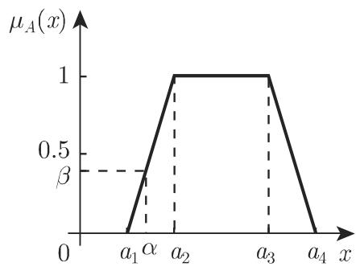
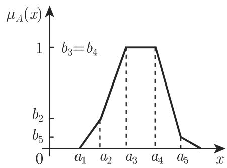

#### 5.9.1 模糊逻辑的基本概念

5.9.1.1 模糊集合的解释

现实世界中经常有多种程度的不确知的或不明确的情况，“模糊“这个词也意味着某种不确定性，而模糊逻辑这个名称也是基千这种意义．基本上存在两种不同类型的模糊性：不明确性和不确知性在此有两个从属的概念：模糊集合论和模糊测度论．在下面来源千实际的引论中，我们讨论模糊集的思想、方法和概念，它们是多值逻辑的基本数学工具

1. 经典集和模糊集的概念

经典的（清晰）集的概念是二值的，并且经典的布尔集代数同构千二值命题逻辑令 是称作全域的基本集那么对千每个 $A \subseteq X$ 存在这样一个函数

$$
f _ {A}: X \to \{0, 1 \},\tag{5.326a}
$$

它表示对千每个 $x \in X$ ，无论 是否属千集合 都有

$$
f _ {A} (x) = 1 \Leftrightarrow x \in A, \quad \text {以及} \quad f _ {A} (x) = 0 \Leftrightarrow x \notin A.\tag{5.326b}
$$

模糊集的概念基千下面的思想：将集合元素的从属关系考虑为一个语旬，这个语旬的真值巾区间 [O, 1] 中的值刻画．对千一个模糊集 的数学建模，必须有一个值域是区间 [O, 1]（用以代替 {0,1}）的函数，即

$$
\mu_ {A}: X \to [ 0, 1 ].\tag{5.327}
$$

换言之：对千每个元素 $x \in X$ 指派区间 [O, 1] 中的一个数 $\mu _ { A } ( x )$ ，它表示 从属千的等级映射 $\mu _ { A }$ 称为隶属函数函数 $\mu _ { A } ( x )$ 在点 的值称为隶属等级．的模糊集 A,B,C 等也称作 的模糊子集．所有 上的模糊集的集合记作 $F ( X )$

2. 模糊集的性质及其他定义

下面的性质可以从定义直接推出：

(El) 清晰集可以解释为具有隶属等级 的模糊集．

(E2) 隶属等级大千零，即 $\mu _ { A } ( x ) > 0$ 的自变最 $x$ 的集合称作模糊集 的支撑：

$$
\operatorname{supp} (A) = \{x \in X \mid \mu_ {A} (x) > 0 \}.\tag{5.328}
$$

集合 $\ker ( A ) = \{ x \in X | \mu _ { A } ( x ) = 1 \}$ 称作模糊集 的柱芯

(E3) 全域 上的两个模糊集 相等，当且仅当它们的隶属函数的值相等

$$
\text { 若对于每个 } x \in X, \mu_ {A} (x) = \mu_ {B} (x) \text { 成立,则 } A = B.\tag{5.329}
$$

(E4) 离散表示或有序对表示：如果全域 是有限的，即 $X = \{ x _ { 1 } , x _ { 2 } , \cdot \cdot \cdot , x _ { n } \}$ 用值表定义模糊集的隶属函数是适宜的模糊集 的表格表示见表 5.7. 它也可写成

$$
A := \mu_ {A} (x _ {1}) / x _ {1} + \dots + \mu_ {A} (x _ {n}) / x _ {n} = \sum_ {i = 1} ^ {n} \mu_ {A} (x _ {i}) / x _ {i}.\tag{5.330}
$$

(5.330) 中分数线和加号仅有符号意义．

5.7 模糊集的表格表示

<table><tr><td> $x_{1}$ </td><td> $x_{2}$ </td><td> $\cdots$ </td><td> $x_{n}$ </td></tr><tr><td> $\mu_{A}(x_{1})$ </td><td> $\mu_{A}(x_{2})$ </td><td> $\cdots$ </td><td> $\mu_{A}(x_{n})$ </td></tr></table>

(E5) 超模糊集：依扎德 (Zadeh) 的定义如果模糊集的隶属函数本身也是一个模糊集，那么它称为超模糊集

3. 模糊语言学

一个设定了语言值（例如，“小”“中”或“大”)的量称为语言量或语言变量．每个语言值可以用模糊集，例如，用具有支撑 (5.328) 的隶属函数（参见 5.9.1.2)图象刻画模糊集的个数（在“小”“中”“大”的情形，它们是 个）取决千问题．

5.9.1.2 中语言变量用 表示例如对千温度、压力、体积、频率、速度、亮度、年龄、穿戴等可以有语言值，并且还有医学、电学、化学、生态学等的变量• 应用语言变量的隶属函数 $\mu _ { A } ( x )$ ，可以在由 $\mu _ { A } ( x )$ 表示的模糊集中确定一个固定（清晰）值的隶属等级．也就是说，一个“高”的量（例如温度）的建模，作为由5.65 中梯形隶属函数给出的语言变量，意味着给定的温度 $\alpha$ 以隶属等级 $\beta ($ （也称相容性等级或正确等级）属于模糊集“高温“.

5.9.1.2 实直线上的隶属函数

隶属函数可以用在 之间取值的函数作为模型．它们对给定不同的集的全域中的点表示不同的隶属等级

1. 梯形隶属函数

梯形隶属函数是普遍使用的下面的例子描绘了经常使用的分段（连续可微）隶属函数以及它们的特殊情形，例如，三角形隶属函数．如果模糊量用连续或分段连续的的隶属函数表示，那么相关的模糊量给出较光滑的输出函数．

■ A: 对应千 (5.331) 的梯形函数（图 5.65).

$$
\mu_ {A} (x) = \left\{ \begin{array}{l l} 0, & x \leqslant a _ {1}, \\ \frac {x - a _ {1}}{a _ {2} - a _ {1}}, & a _ {1} <   x <   a _ {2}, \\ 1, & a _ {2} \leqslant x \leqslant a _ {3}, \\ \frac {a _ {4} - x}{a _ {4} - a _ {3}}, & a _ {3} <   x <   a _ {4}, \\ 0, & x \geqslant a _ {4}. \end{array} \right.\tag{5.331}
$$

如果 $a _ { 2 } \ = \ a _ { 3 } \ = \ a _ { 3 }$ ，并且 $a _ { 1 } ~ < ~ a ~ < ~ a _ { 4 }$ ，那么这个函数的图象就变成三角形函数选取 $a _ { 1 } , \cdots , a _ { 4 }$ 的不同的值，就给出对称或非对称梯形函数，对称三角形函数$( a _ { 2 } = a _ { 3 } = a , $ ，并且 $| a - a _ { 1 } | = | a _ { 4 } - a | )$ 或非对称三角形函数 $( a _ { 2 } = a _ { 3 } = a$ 并且$\vert a - a _ { 1 } \vert \neq \vert a _ { 4 } - a \vert )$

  
5.65

B: 对应千 (5.332) 的左侧和右侧有界的隶属函数（图 5.66).

$$
\mu_ {A} (x) = \left\{ \begin{array}{l l} 1, & x \leqslant a _ {1}, \\ \frac {a _ {2} - x}{a _ {2} - a _ {1}}, & a _ {1} <   x <   a _ {2}, \\ 0, & a _ {2} \leqslant x \leqslant a _ {3}, \\ \frac {x - a _ {3}}{a _ {4} - a _ {3}}, & a _ {3} <   x <   a _ {4}, \\ 1, & a _ {4} \leqslant x. \end{array} \right.\tag{5.332}
$$

  
5.66

■ C: 对应千 (5.333) 的广义梯形函数（图 5.67).

$$
\mu_ {A} (x) = \left\{ \begin{array}{l l} 0, & x \leqslant a _ {1}, \\ \frac {b _ {2} (x - a _ {1})}{a _ {2} - a _ {1}}, & a _ {1} <   x <   a _ {2}, \\ \frac {(b _ {3} - b _ {2}) (x - a _ {2})}{a _ {3} - a _ {2}} + b _ {2}, & a _ {2} \leqslant x \leqslant a _ {3}, \\ b _ {3} = b _ {4} = 1, & a _ {3} <   x <   a _ {4}, \\ \frac {(b _ {4} - b _ {5}) (a _ {4} - x)}{a _ {5} - a _ {4}} + b _ {5}, & a _ {4} \leqslant x \leqslant a _ {5}, \\ \frac {b _ {5} (a _ {6} - x)}{a _ {6} - a _ {5}}, & a _ {5} <   x <   a _ {6}, \\ 0, & a _ {6} \leqslant x. \end{array} \right.\tag{5.333}
$$

  
5.67

2. 钟形隶属函数

■ A: 选取适当的 p(x), (5.334) 中的函数 f(x) 给出一类钟形可微隶属函数：

$$
f (x) = \left\{ \begin{array}{l l} 0, & x \leqslant a, \\ \mathrm{e} ^ {- 1 / p (x)}, & a <   x <   b, \\ 0, & x \geqslant b. \end{array} \right.\tag{5.334}
$$

对千 $p ( x ) = k ( x - a ) ( b - x )$ ，并且，例如当 $k = 1 0$ 或 $k = 1$ 或 $k = 0 . 1$ 时有一族不同宽度的具有隶属函数 $\mu _ { A } ( x ) = f ( x ) { \bigg / } f \left( { \frac { a + b } { 2 } } \right)$ 非对称曲线（图 5.68)，其中 $1 \int f \left( { \frac { a + b } { 2 } } \right)$ 正规化因子．外曲线由 $k = 1 0$ 得到内曲线由 $k = 0 . 1 \ \vec { \Gamma } ^ { z }$ 生

  
5.68

应用适当的正规化因子，对千（例如） $) p ( x ) = x ( 1 - x ) ( 2 - x )$ 或 $p ( x ) = x ( 1 -$ $x ) ( x + 1 )$ 得到 [O, 1] 中的反对称隶属函数（图 5.69)．第一个多项式中因子 $( 2 - x )$ 导致极大值左移并且产生一个非对称形状的曲线．类似地，第二个多项式中因子 (x+l)导致极大值右移并且产生一个非对称形状．

  
5.69

■ B: 一类更加灵活的隶属函数可以由公式

$$
F _ {t} (x) = \frac {\int_ {a} ^ {x} f (t (u)) \mathrm{d} u}{\int_ {a} ^ {b} f (t (u)) \mathrm{d} u}\tag{5.335}
$$

得到其中 (5.334) 定义并且 $p ( x ) = ( x - a ) ( b - x )$ ，而 $[ a , b ]$ 上的一个变换．如果 $[ a , b ]$ 上的光滑变换，即 在区间 $[ a , b ]$ 上无穷多次可微，那么 $F _ { t }$ 也是光滑的，因为 是光滑的．如果要求 是递增或递减的并且是光滑的，那么变换能够改变隶属函数的形状．在实用中，多项式特别适宜用作变换．最简单的多项式是区间 $[ a , b ] = [ 0 , 1 ]$ 上的恒等多项式 $t ( x ) = x$

稍差一点的最简单的具有给定性质的多项式是 $t ( x ) = - \frac { 2 } { 3 } c x ^ { 3 } + c x ^ { 2 } + \left( 1 - \frac { c } { 3 } \right) x$ 其中常数 $c \in [ - 6 , 3 ]$ ．取 $c = - 6 ~ \vec { p } ^ { \ z }$ 生最大曲率的多项式，它的方程是 $q ( x ) \ =$ $4 x ^ { 3 } - 6 x ^ { 2 } + 3 x$ 选取 $q _ { 0 }$ 。为恒等函数，即 $q _ { 0 } ( x ) = x$ 那么由公式 $q _ { i } = q \circ q _ { i - 1 }$ （对$i \in \mathbb { N } )$ 可以递推地得到其他多项式 q. 用对应的多项式变换 $q _ { 0 } , q _ { 1 } , \cdots$ ·替换 (5.335)中的 t, 就给出光滑函数列 $F _ { q _ { 0 } } , F _ { q _ { 1 } }$ 和 $F _ { q _ { 2 } }$ （图 5.70)，它们可以考虑作为隶属函数$\mu _ { A } ( x )$ ，其中 $F _ { q _ { n } }$ 九收敛千一条直线应用函数 $F _ { q _ { 2 } }$ ，它的反射以及水平线可用可微函数逼近梯形隶属函数（图 5.71).

  
5.70

  
5.71

结束语 不精确的和非清晰的信息可以用模糊集描述，并且可用隶属函数表示．

5.9.1.3 模糊集

1. 空模糊集和泛模糊集

a) 空模糊集 上的集合 称为空集，如果 $\mu _ { A } ( x ) = 0 ( \forall x \in X )$ 成立．

b) 泛模糊集 上的集合 称为泛集，如果 $\mu _ { A } ( x ) = 1 ( \forall x \in X )$ 成立．

2. 模糊子集

如果 $\mu _ { B } ( x ) \leqslant \mu _ { A } ( x ) ( \forall x \in X )$ ，那么 称为 的模糊子集（记作 $B \subseteq A )$

3. 实直线上模糊集容许区间和展形

如果 是一个实直线上的模糊集，那么区间

$$
[ a, b ] = \{x \in X \mid \mu_ {A} (x) = 1 \} \quad (a, b \text {是常数}, a <   b)\tag{5.336}
$$

称为模糊集 的容许区间，区间 $\left[ c , d \right] = \mathrm { c l } ( \mathrm { s u p p } A ) \left( c , d \right.$ 是常数， $c < d )$ 称为A的展形，其中 cl 表示集合的闭包．（容许区间有时也称作集 的尖峰）仅当核所含点数多千 时容许区间和核才相重合．

■ A: 在图 5.65 $[ a _ { 2 } , a _ { 3 } ]$ 是容许区间， $[ a _ { 1 } , a _ { 4 } ]$ 是展形．

■ B: $a _ { 2 } = a _ { 3 } = a$ 时（图 5.65)，给出一个三角形形状的隶属函数 $\mu .$ .在此情形三角形模糊集没有容许区间，但它的核是集合 $\{ a \}$ ．此外，如果还有 $a _ { 1 } = a = a _ { 4 }$ 那么得到一个清晰值；它称为单元素集单元素集 没有容许区间，但 $\ker ( A ) =$ $\operatorname { s u p p } ( A ) = \{ a \}$

4. 连续全域和离散全域上模糊集的转换

设全域是连续的，并且模糊集在其上由隶属函数给定．将全域离散化，每个离散点与它的隶属值确定一模糊单元素集．

反之一个在离散全域上给定的模糊集通过隶属值在全域的离散点间插值可以转换为连续全域上的模糊集．

5. 正规和次正规模糊集

如果 的模糊子集，那么它的高定义为

$$
H (A) := \max \{\mu_ {A} (x) \mid x \in X \}.\tag{5.337}
$$

如果 $H ( A ) = 1$ ，那么 称为正规模糊集，不然称为次正规模糊集

本节中给出的概念和方法限千正规模糊集，但容易将它们扩充到次正规模糊集．

6. 模糊集的切割

模糊集 切割 $A ^ { > \alpha }$ 或强 切割 $A ^ { \geqslant \alpha }$ 定义为

$$
A ^ {> \alpha} = \{x \in X \mid \mu_ {A} (x) > \alpha \}, \quad A ^ {\geqslant \alpha} = \{x \in X \mid \mu_ {A} (x) \geqslant \alpha \}, \quad \alpha \in [ 0, 1 ],\tag{5.338}
$$

并且 $A ^ { \geq 0 } = \operatorname { c l } ( A ^ { > 0 } )$ . 切割和强 切割也分别称为 水平集和强 水平集

(1) 性质

a) 模糊集的 切割是清晰集；

b) 支撑 supp(A) 是特殊的 切割： $\operatorname { s u p p } ( A ) = A ^ { > 0 }$

c) 清晰 切割 $A ^ { \geqslant 1 } = \{ x \in X | \mu _ { A } ( x ) = 1 \}$ 称为 的核

(2) 表示定理

的每个模糊子集 可以唯一确定它的 切割的族 $( A ^ { > \alpha } ) _ { \alpha \in [ 0 , 1 ) }$ ，以及它的切割的族 $( A ^ { \geqslant \alpha } ) _ { \alpha \in ( 0 , 1 ] } .$ · 切割和强 切割是 中的子集的单调族，因为

$$
\alpha <   \beta \Rightarrow A ^ {> \alpha} \supseteq A ^ {> \beta} \text {并且} A ^ {\geqslant \alpha} \supseteq A ^ {\geqslant \beta}.\tag{5.339a}
$$

反之，如果存在 中的子集的单调族 $( U _ { \alpha } ) _ { \alpha \in [ 0 , 1 ) }$ 或 $( V _ { \alpha } ) _ { \alpha \in ( 0 , 1 ] }$ ，那么存在唯一定义的模糊集 V, 使得 $U ^ { > \alpha } = U _ { \alpha }$ 以及 $V ^ { \geqslant \alpha } = V _ { \alpha }$ ,并且

$$
\mu_ {U} (x) = \sup \{\alpha \in [ 0, 1) \mid x \in U _ {\alpha} \}, \quad \text {以及} \quad \mu_ {V} (x) = \sup \{\alpha \in (0, 1 ] \mid x \in V _ {\alpha} \}.\tag{5.339b}
$$

7. 模糊集 的相似

(1) 具有隶属函数 $\mu _ { A } , \mu _ { B } : X \to [ 0 , 1 ]$ 的模糊集 A,B 称为模糊相似，如果对千每个 $\alpha \in ( 0 , 1 ]$ 存在数 $\alpha _ { i } \in ( 0 , 1 ] ( i = 1 , 2 )$ 使得

$$
\operatorname{supp} \left(\alpha_ {1} \mu_ {A}\right) _ {\alpha} \subseteq \operatorname{supp} \left(\mu_ {B}\right) _ {\alpha}, \quad \operatorname{supp} \left(\alpha_ {2} \mu_ {B}\right) _ {\alpha} \subseteq \operatorname{supp} \left(\mu_ {A}\right) _ {\alpha}.\tag{5.340}
$$

$( \mu _ { C } ) _ { \alpha }$ 表示具有隶属函数

$$
(\mu_ {C}) _ {\alpha} = \left\{ \begin{array}{l l} \mu_ {C} (x), & \mu_ {C} (x) > \alpha , \\ 0, & \text {其他} \end{array} \right.
$$

的模糊集，并且 $( \beta \mu _ { C } )$ 表示具有隶属函数

$$
(\beta \mu_ {C}) = \left\{ \begin{array}{l l} \beta , & \mu_ {C} (x) > \beta , \\ 0, & \text {其他} \end{array} \right.
$$

的模糊集

(2) 定理 如果具有隶属函数 $\mu _ { A } , \mu _ { B } : X \to [ 0 , 1 ]$ 的模糊集 A,B 有相同的核：

$$
\operatorname{supp} (\mu_ {A}) _ {1} = \operatorname{supp} (\mu_ {B}) _ {1},\tag{5.341a}
$$

那么它们模糊相似，因为核等千 切割，即

$$
\operatorname{supp} (\mu_ {A}) _ {1} = \{x \in X \mid \mu_ {A} (x) = 1 \}.\tag{5.341b}
$$

(3) A, ，以及 $\mu _ { A } , \mu _ { B } : X \to [ 0 , 1 ]$ 称为强模糊相似，如果它们有相同的支撑和相同的核：

$$
\operatorname{supp} (\mu_ {A}) _ {1} = \operatorname{supp} (\mu_ {B}) _ {1},\tag{5.342a}
$$

$$
\operatorname{supp} (\mu_ {A}) _ {0} = \operatorname{supp} (\mu_ {B}) _ {0}.\tag{5.342b}
$$
