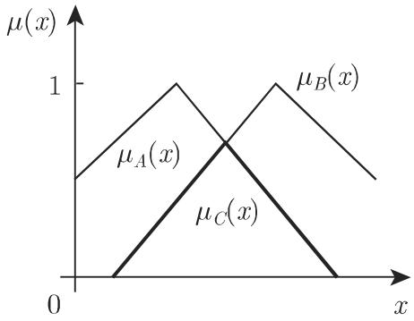
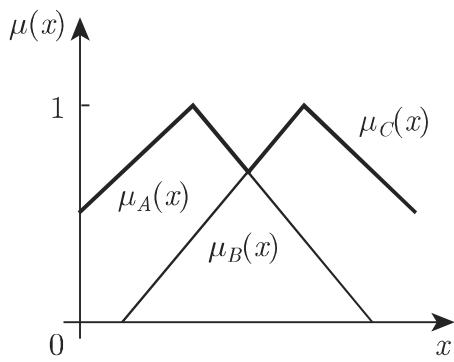
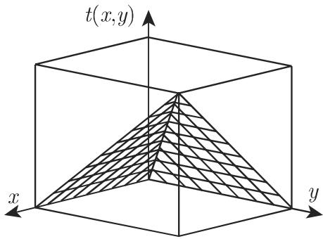
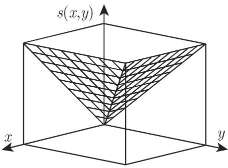

#### 5.9.2 模糊集的连接(聚合)

模糊集可以通过算子加以聚合．对千怎样将通常的集合运算加以推广，如模糊集的并、交及补，有儿个不同的建议

5.9.2.1 模糊集的聚合概念

1. 模糊集并、模糊集交

集合 $A \cup B$ 和 $A \cap B$ 中的任意元素 $x \in X$ 的隶属等级应该只与两个模糊集中元素的隶属等级 $\mu _ { A } ( x )$ 和 $\mu _ { B } ( x )$ 有关．模糊集的并和交借助两个函数

$$
s, t: [ 0, 1 ] \times [ 0, 1 ] \rightarrow [ 0, 1 ]\tag{5.343}
$$

定义并且它们用下列方式定义：

$$
\mu_ {A \cup B} (x) := s \big (\mu_ {A} (x), \mu_ {B} (x) \big),\tag{5.344}
$$

$$
\mu_ {A \cap B} (x) := t \big (\mu_ {A} (x), \mu_ {B} (x) \big).\tag{5.345}
$$

隶属等级 $\mu _ { A } ( x )$ 和 $\mu _ { B } ( x )$ 被映为新的隶属等级．函数 称作 范数和 余范数；后者也称为 范数

解释 函数 $\mu _ {  { A } \cup B }$ 和 $\mu _ { A \cap B }$ 表示隶属真值，它们由隶属真值 $\mu _ { A } ( x )$ 和 $\mu _ { B } ( x )$ 的聚合得到

2. 范数的定义

范数是 [O, 1] 中的一个二元运算 :

$$
t: [ 0, 1 ] \times [ 0, 1 ] \rightarrow [ 0, 1 ].\tag{5.346}
$$

它是对称、结合、单调增加的，它以 作为零元素，以 作为中性元素．对千$x , y , z , v , w \in [ 0 , 1 ]$ ，下列性质成立：

(El) 交换性

$$
t (x, y) = t (y, x).\tag{5.347a}
$$

(E2) 结合性

$$
t (x, t (y, z)) = t (t (x, y), z).\tag{5.347b}
$$

(E3) 与中性元素及零元素的特殊运算

$t ( x , 1 ) = x ,$ ，并且由千 (El) ，有 $t ( 1 , x ) = x ; \ t ( x , 0 ) = t ( 0 , x ) = 0 .$

(5.347c)

(E4) 单调性

如果 $x \leqslant v$ 并且 $y \leqslant w ,$ 那么有 $t ( x , y ) \leqslant t ( v , w )$

(5.347d)

3. 范数的定义

范数是 [O, 1] 中的一个二元函数：

$$
s: [ 0, 1 ] \times [ 0, 1 ] \rightarrow [ 0, 1 ].\tag{5.348}
$$

它有下列性质

(El) 交换性

$$
s (x, y) = s (y, x).\tag{5.349a}
$$

(E2) 结合性

$$
s (x, s (y, z)) = s (s (x, y), z).\tag{5.349b}
$$

(E3) 与中性元素及零元素的特殊运算

$$
s (x, 0) = s (0, x) = x; \quad s (x, 1) = s (1, x) = 1.\tag{5.349c}
$$

(E4) 单调性

如果 $x \leqslant v$ 并且 $y \leqslant w$ 那么 $s ( x , y ) \leqslant s ( v , w )$

(5.349d)

借助这些性质可以引进 范数的类 范数的类 ．仔细地研究可给出下列的关系：

$$
\min \{x, y \} \geqslant t (x, y), \quad \forall t \in T, \forall x, y \in [ 0, 1 ],\tag{5.349e}
$$

以及

$$
\max \{x, y \} \leqslant s (x, y), \quad \forall s \in S, \forall x, y \in [ 0, 1 ].\tag{5.349f}
$$

5.9.2.2 模糊集的实用聚合运算

1. 两个模糊集的交

两个模糊集 的交 $A \cap B$ 通过在它们的隶属函数 $\mu _ { A } ( x )$ 和 $\mu _ { B } ( x )$ 上的极小值运算 $\operatorname* { m i n } \{ \cdot , \cdot \}$ 定义．基千先前的要求有

$$
C := A \cap B \text {以及} \mu_ {C} (x) := \min \{\mu_ {A} (x), \mu_ {B} (x) \}, \quad \forall x \in X,\tag{5.350a}
$$

其中

$$
\min \{a, b \} := \left\{ \begin{array}{l l} a, & a \leqslant b, \\ b, & a > b. \end{array} \right.\tag{5.350b}
$$

交运算对应千两个隶属函数的 AND 运算（图 5.72)．隶属函数 $\mu _ { C } ( x )$ 定义为 $\mu _ { A } ( x )$ 和 $\mu _ { B } ( x )$ 的极小值．

  
5.72

2. 两个模糊集的并

两个模糊集的并 $A \cup B$ 通过在它们的隶属函数 $\mu _ { A } ( x )$ 和 $\mu _ { B } ( x )$ 上的极大值运算 $\operatorname* { m a x } \{ \cdot , \cdot \}$ 定义：

$$
C := A \cup B \text {并且} \mu_ {C} (x) := \max \left\{\mu_ {A} (x), \mu_ {B} (x) \right\}, \quad \forall x \in X,\tag{5.351a}
$$

其中

$$
\max \{a, b \} := \left\{ \begin{array}{l l} a, & a \geqslant b, \\ b, & a <   b. \end{array} \right.\tag{5.351b}
$$

交运算对应千逻辑 OR 运算．图 5.73 表明 $\mu _ { C } ( x )$ 是隶属函数 $\mu _ { A } ( x )$ 和 $\mu _ { B } ( x )$ 的极大值

  
5.73

■ 范数 $t ( x , y ) = \operatorname* { m i n } \{ x , y \}$ 范数 $s ( x , y ) = \operatorname* { m a x } \{ x , y \}$ 分别定义两个模糊集的交和并（图 5.74 和图 5.75).

  
5.74

  
5.75

．其他聚合

其他聚合有有界聚合、代数聚合、极端和，以及有界差分、代数积和极端积（表 5.8).

例如，代数和定义为

$C : = A + B$ 并且 $\mu _ { C } ( x ) : = \mu _ { A } ( x ) + \mu _ { B } ( x ) - \mu _ { A } ( x ) \cdot \mu _ { B } ( x )$ （对所有 $x \in X )$

(5.352a)

类似地对千并 (5.531a, 5.531b)，这个和也属千 范数类它们都包括在表 5.8左边的列中表 5.9 给出这些运算在布尔逻辑和模糊逻辑中的比较

表 5.8 t 范数和 s 范数, $p \in \mathbb { R }$

<table><tr><td>作者</td><td>t 范数</td><td>s 范数</td></tr><tr><td>Zadeh</td><td>交:  $t(x,y) = \min\{x,y\}$ </td><td>并:  $s(x,y) = \max\{x,y\}$ </td></tr><tr><td>Lukasiewicz</td><td>有界差:  $t_b(x,y) = \max\{0,x+y-1\}$ </td><td>有界和:  $s_b(x,y) = \min\{1,x+y\}$ </td></tr><tr><td></td><td>代数积:  $t_a(x,y) = xy$ </td><td>代数和:  $s_a(x,y) = x+y-xy$ </td></tr><tr><td></td><td>极端积:  $t_{dp}(x,y) = \begin{cases} \min\{x,y\}, & x=1 \text{ 或 } y=1, \\ 0, & \text{其他} \end{cases}$ </td><td>极端和:  $s_{ds}(x,y) = \begin{cases} \max\{x,y\}, & x=0 \text{ 或 } y=0, \\ 1, & \text{其他} \end{cases}$ </td></tr><tr><td>Hamacher ( $p \geqslant 0$ )</td><td> $t_h(x,y) = \frac{xy}{p+(1-p)(x+y-xy)}$ </td><td> $s_h(x,y) = \frac{x+y - xy - (1-p)xy}{1 - (1-p)xy}$ </td></tr><tr><td>Einstein</td><td> $t_e(x,y) = \frac{xy}{1 + (1-x)(1-y)}$ </td><td> $s_e(x,y) = \frac{x+y}{1+xy}$ </td></tr><tr><td>Frank ( $p > 0, p \neq 1$ )</td><td> $t_f(x,y) = \log_p \left[1 + \frac{(p^x-1)(p^y-1)}{p-1}\right]$ </td><td> $s_f(x,y) = 1 - \log_p \left[1 + \frac{(p^{1-x}-1)(p^{1-y}-1)}{p-1}\right]$ </td></tr><tr><td>Yager ( $p > 0$ )</td><td> $t_{ya}(x,y) = 1 - \min\{1, ((1-x)^p + (1-y)^p)^{1/p}\}$ </td><td> $s_{ya}(x,y) = \min\{1, (x^p + y^p)^{1/p}\}$ </td></tr><tr><td>Schweizer ( $p > 0$ )</td><td> $t_s(x,y) = \max\{0, x^{-p} + y^{-p}-1\}^{-1/p}$ </td><td> $s_s(x,y) = 1 - \max\{0, (1-x)^{-p} + (1-y)^p - 1\}^{-1/p}$ </td></tr><tr><td>Dombi ( $p > 0$ )</td><td> $t_{do}(x,y) = \left\{1 + \left[\left(\frac{1-x}{x}\right)^p + \left(\frac{1-y}{y}\right)^p\right]^{1/p}\right\}^{-1}$ </td><td> $s_{do}(x,y) = 1 - \left\{1 + \left[\left(\frac{x}{1-x}\right)^p + \left(\frac{y}{1-y}\right)^p\right]^{1/p}\right\}^{-1}$ </td></tr><tr><td>Weber ( $p \geqslant -1$ )</td><td> $t_w(x,y) = \max\{0, (1+p)(x+y-1) - pxy\}$ </td><td> $s_w(x,y) = \min\{1, x+y + pxy\}$ </td></tr><tr><td>Dubois ( $0 \leqslant p \leqslant 1$ )</td><td> $t_{du}(x,y) = \frac{xy}{\max\{x,y,p\}}$ </td><td> $s_{du}(x,y) = \frac{x+y - xy - \min\{x,y, (1-p)\}}{\max\{(1-x), (1-y), p\}}$ </td></tr></table>

注:对于表中所列的 t 范数和 s范数，有下列顺序： $t _ { \mathrm { d p } } \leqslant t _ { b } \leqslant t _ { \mathrm { e } } \leqslant t _ { a } \leqslant t _ { \mathrm { h } } \leqslant t \leqslant s \leqslant s _ { h } \leqslant s _ { a } \leqslant s _ { e } \leqslant s _ { b } \leqslant s _ { \mathrm { d s } }$

5.9 布尔逻辑和模糊逻辑中运算的比较

<table><tr><td>算子</td><td>布尔逻辑</td><td>模糊逻辑 (μA, μB ∈ [0,1])</td></tr><tr><td>AND</td><td>C = A ∧ B</td><td>μA∩B = min{μA, μB}</td></tr><tr><td>OR</td><td>C = A ∨ B</td><td>μA∪B = max{μA, μB}</td></tr><tr><td>NOT</td><td>C = ¬A</td><td>μA^C = 1 - μA (μA^C 是 μA 的补)</td></tr></table>

类似千将和扩充为并运算的概念，交也可以通过（例如）有界积、代数积和极端积来扩充例如，代数积是用下列方式定义的：

$$
C := A \cdot B \text {并且} \mu_ {C} (x) := \mu_ {A} (x) \cdot \mu_ {B} (x) (\text {对每个} x \in X).\tag{5.352b}
$$

类似千交 (5.350a, 5.350b)，它也属千 范数类，并且它也可以在表 5.8 的中间一列中找到

5.9.2.3 补偿算子

有时算子必须介千 范数和 范数之间；它们称作补偿算子．入算子和 $\gamma$ 算子是补偿算子的例子．

1. 入算子

$$
\mu_ {A \lambda B} (x) = \lambda [ \mu_ {A} (x) \mu_ {B} (x) ] + (1 - \lambda) [ \mu_ {A} (x) + \mu_ {B} (x) - \mu_ {A} (x) \mu_ {B} (x) ], \quad \lambda \in [ 0, 1 ].\tag{5.353}
$$

情形入＝ 方程 (5.353) 产生称作代数和的形式（表 5.8, 范数）；它属千OR 算子．

情形入＝ 方程 (5.353) 产生称作代数积的形式（表 5.8, 范数）；它属千AND 算子．

2. $\gamma$ 算子

$$
\mu_ {A \gamma B} (x) = [ \mu_ {A} (x) \mu_ {B} (x) ] ^ {1 - \gamma} [ 1 - (1 - \mu_ {A} (x)) (1 - \mu_ {B} (x)) ] ^ {\gamma}, \quad \gamma \in [ 0, 1 ].\tag{5.354}
$$

情形 ,=1 方程 (5.354) 产生代数和表达式．

情形 $\gamma = 0$ 方程 (5.354) 产生代数积表达式．

将？ $\gamma$ 算子应用千任意个模糊集，给出

$$
\mu (x) = \left[ \prod_ {i = 1} ^ {n} \mu_ {i} (x) \right] ^ {1 - \gamma} \left[ 1 - \prod_ {i = 1} ^ {n} (1 - \mu_ {i} (x)) \right] ^ {\gamma},\tag{5.355}
$$

并且当带权 $\delta _ { i }$ 时：

$$
\mu (x) = \left[ \prod_ {i = 1} ^ {n} \mu_ {i} (x) ^ {\delta_ {i}} \right] ^ {1 - \gamma} \left[ 1 - \prod_ {i = 1} ^ {n} (1 - \mu_ {i} (x)) ^ {\delta_ {i}} \right] ^ {\gamma}, \quad x \in X, \sum_ {i = 1} ^ {n} \delta_ {i} = 1, \gamma \in [ 0, 1 ].\tag{5.356}
$$

5.9.2.4 扩张原理

上述讨论过将基本的集合运算推广到模糊集．现在将映射的概念扩充到模糊区域概念的基础是不明确语旬的接受等级经典的映射 $\varPhi : X ^ { n } \to Y$ 将一个清晰的函数值 $\varPhi ( x _ { 1 } , \cdots , x _ { n } ) \in Y$ 指派给点 $( x _ { 1 } , \cdots , x _ { n } ) \in X ^ { n }$ 们这个映射可以如下地扩充到模糊变量：模糊映射是 ${ \widehat { \phi } } : F ( X ) ^ { n } \to F ( Y )$ ，它将一个模糊函数值 $\widehat { \varPhi } ( \mu _ { 1 } , \cdots , \mu _ { n } )$ 指派给由隶属函数 $( \mu _ { 1 } , \cdot \cdot \cdot , \mu _ { n } ) \in F ( X ) ^ { n }$ 给出的模糊向量变量 $( x _ { 1 } , \cdots , x _ { n } )$

5.9.2.5 模糊补

函数 $c : [ 0 , 1 ] \ \to \ [ 0 , 1 ]$ 称作补函数，如果它具有下列性质：对千任何 $x , y \in$ [O, 1],

(EKl) 边界条件 c(O) = c(l) = 0.

(5.357a)

$$
(\mathrm{EK2}) \quad \text {单调性} \quad x <   y \Rightarrow c (x) \geqslant c (y).\tag{5.357b}
$$

(EK3) 对合性 c(c(x)) = x.

(5.357c)

$$
(\mathrm{EK} 4) \quad \text {连续性} \quad c (x) \text {对每个} x \in [ 0, 1 ] \text {是连续的.}\tag{5.357d}
$$

■ A: 最常用的（连续且对合的）补函数是

$$
c (x) := 1 - x.\tag{5.358}
$$

■ B: 其他连续且对合的补函数是管野 (Sugeno) 补：

$$
c _ {\lambda} (x) := (1 - x) (1 + \lambda x) ^ {- 1}, \quad \lambda \in (- 1, \infty),
$$

以及耶格尔 (Yager) 补：

$$
c _ {p} (x) := (1 - x ^ {p}) ^ {1 / p}, \quad p \in (0, 1).
$$
