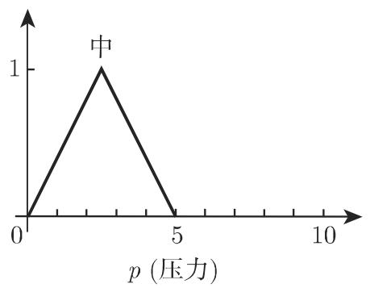
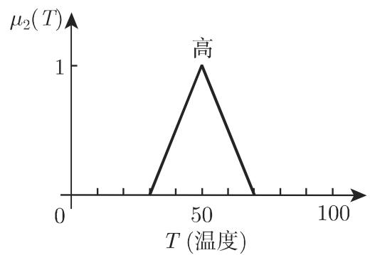
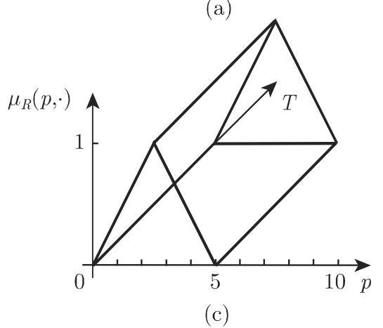
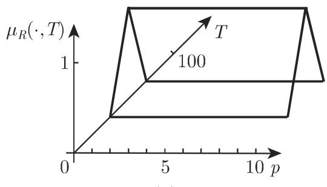
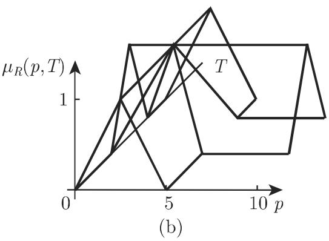

#### 5.9.4 模糊推理(近似推理)

模糊推理是模糊关系的一个重要应用，其目的是获得对千不明确信息的模糊逻辑结论（参见第 576 5.9.6.3)．在此不明确信息意味着模糊信息但不是不确知信息模糊推理也称作蕴涵，包含一个或多个法则、一个事实和一个结论．扎德称模糊推理为近似推理不可能用经典逻辑刻画

1. 模糊蕴涵、 IF THEN 法则

在最简单的情形模糊蕴涵含有一个 IF THEN 法则 IF 部分称为前提，并且表示条件． THEN 部分是结论．计算 $\mu _ { 2 } = \mu _ { 1 } \circ R$ (5.380) 产生

解释 $\mu _ { 2 }$ 是 $\mu _ { 1 }$ 在模糊关系 下的模糊推理象，即对千 IF THEN 法则或对千一组法则的计算规定．

2. 广义模糊推理格式

法则 IF（若 $A _ { 1 }$ 和 $A _ { 2 }$ 和 $A _ { 3 } \cdots$ ··和 $A _ { n }$ THEN（则） B, 其中 $A _ { i } : \mu _ { i } : X _ { i } \to $ $[ 0 , 1 ] ~ ( i = 1 , 2 , \cdots , n )$ 以及结论 的隶属函数 $\mu : Y \to [ 0 , 1 ]$ 是由一个 $( n + 1 )$ －值关系

$$
R: X _ {1} \times X _ {2} \times \dots \times X _ {n} \times Y \rightarrow [ 0, 1 ]\tag{5.381a}
$$

刻画的．对千具有清晰值 $x _ { 1 } ^ { \prime } , x _ { 2 } ^ { \prime } , \cdots , x _ { n } ^ { \prime }$ 吐确实的输入，法则 (5.381a) 通过

$$
\begin{array}{r l} \mu_ {B ^ {\prime}} (y) = & \mu_ {R} (x _ {1} ^ {\prime}, x _ {2} ^ {\prime}, \dots , x _ {n} ^ {\prime}, y) \\ = & \min \{\mu_ {1} (x _ {1} ^ {\prime}), \mu_ {2} (x _ {2} ^ {\prime}), \dots , \mu_ {n} (x _ {n} ^ {\prime}), \mu_ {B} (y) \} \quad (y \in Y) \end{array}\tag{5.381b}
$$

定义确实的模糊输出．

注量 $\operatorname* { m i n } \{ \mu _ { 1 } ( x _ { 1 } ^ { \prime } ) , \mu _ { 2 } ( x _ { 2 } ^ { \prime } ) , \cdot \cdot \cdot , \mu _ { n } ( x _ { n } ^ { \prime } ) \}$ ｝称为法则的满足等级，并且量 $\operatorname* { m i n } \{ \mu _ { 1 } ( x _ { 1 } ^ { \prime } ) , \mu _ { 2 } ( x _ { 2 } ^ { \prime } ) , \cdot \cdot \cdot , \mu _ { n } ( x _ { n } ^ { \prime } ) \}$ 表示模糊值输入量．

• 形成连接量”中等“压力与“高“温间的模糊关系（图 5.76)： $\widetilde { \mu } _ { 1 } ( p , T ) = \mu _ { 1 } ( p ) \forall T \in$ $X _ { 2 } \ ( \mu _ { 1 } : \ X _ { 1 } \ \to \ [ 0 , 1 ] )$ ）是模糊集中等压力（图 5.76(a)）的柱面扩充（图 5.76(c)).类似地 $\widetilde { \mu } _ { 2 } ( p , T ) = \mu _ { 2 } ( T ) \forall p \in X _ { 1 } ( \mu _ { 2 } : X _ { 2 } \to [ 0 , 1 ] )$ 是模糊集高温（图 5.76(b))的柱面扩充（图 $5 . 7 6 ( \mathrm { d } ) )$ ），这里 $\widetilde { \mu } _ { 1 } , \widetilde { \mu } _ { 2 } : G = X _ { 1 } \times X _ { 2 } \to [ 0 , 1 ]$

5.77(a) 给出形成模糊关系的图形结果：图 5.77(b) 给出用极小值算子 $\mu _ { R } ( p$ $T ) = \mathrm { m i n } \{ \mu _ { 1 } ( p ) , \mu _ { 2 } ( T ) \}$ ｝的复合中等压力 AND（和）高温的结果，而图 5.77(b)示用极大值算子 $\mu _ { R } ( p , T ) = \operatorname* { m a x } \{ \mu _ { 1 } ( p ) , \mu _ { 2 } ( T ) \}$ 的复合 OR（或）的结果．

µ1(P)  
  
(a)

  
(b)

  
(d)  
5.76

  
5.77
