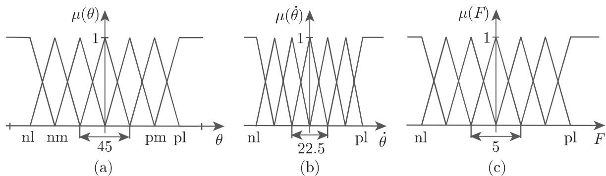
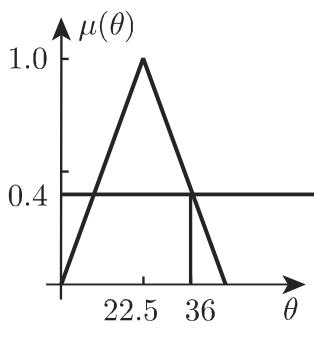
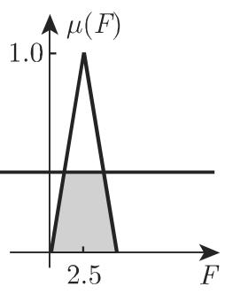
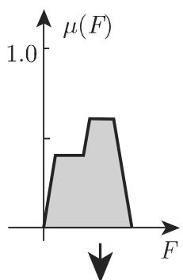

#### 5.9.6 基于知识的模糊系统

在技术和非技术领域中，单位区间上的多值模糊逻辑有多种应用的可能性．一般性概念包括量和特征数的模糊化通过适当的知识基础和运算将它们聚合，以及如有必要还包括将可能的模糊结果集合逆模糊化

5.9.6.1 Mamdani 方法

下列步骤用千模糊控制过程

(1) 法则基础设，例如对千第 个法则

$$
R ^ {i}: \quad \text {如果} e \text {是} E ^ {i} \text {并且} \dot {e} \text {是} \Delta E ^ {i}, \text {那么} u \text {是} U ^ {i}.\tag{5.389}
$$

其中 $e$ 刻画误差， 刻画误差的变化 刻画（非模糊值的）输出值的变化．每个量在其区域 $E , \Delta E$ 中定义令整个区域是 $E \times \Delta E \times U .$ ．误差和误差的变化将在这个区域中模糊化，即它们由模糊集表示，这里使用了语言描述．

(2) 模糊化算法 一般地，误差 及其变化 不是模糊值，所以它们必须通过有效的描述模糊化模糊值将与法则基础中 IF THEN 法则的前提加以比较．由此推出，哪些法则是起作用的，以及它们的权有多大．

(3) 聚合模 具有各自不同权的起作用的法则将与一个代数运算相结合并应用千逆模糊化

(4) 决策模 在逆模糊化过程中将对控制量给出清晰值．应用逆模糊化运算，非模糊值的量是从可能值即清晰量的集合中确定的．这个量表示应该怎样确定系统的控制参数以保持偏差极小．

模糊控制意味着步骤 (1) (4) 是重复的，直到达到取得最小的偏差及其变化的目的．

5.9.6.2 管野方法

营野 (Sugeno) 方法也用来设计模糊控制程序．它与 Mamdani 概念的差别在千法则基础和逆模糊化方法它有下列步骤：

(1) 法则基础 法则基础由下列形式的法则组成

$R ^ { i }$ : 如果 $x _ { 1 }$ 是 $A _ { 1 } ^ { i }$ ，并且. $\cdot \cdot \cdot$ .，并且 $x _ { k }$ 是 $A _ { k } ^ { i }$ ,

$$
\mathrm{那么} u _ {i} = p _ {0} ^ {i} + p _ {1} ^ {i} x _ {1} + p _ {2} ^ {i} x _ {2} + \dots + p _ {k} ^ {i} x _ {k}.\tag{5.390}
$$

其中各个记号的意义是：

$A _ { j }$ 由隶属函数确定的模糊集；

$x _ { j }$ 清晰输入值，如误差 $e$ 和误差的变化 ${ \dot { e } } ,$ ，它们有时告诉我们关千系统动力学的一些信息；

$p _ { j } ^ { i }$ $x _ { j } ( j = 1 , 2 , \cdot \cdot \cdot , k )$ 的权；

$u _ { i }$ ： 属千第 $i \ ( i = 1 , 2 , \cdots , n )$ 个法则的输出值．

(2) 模糊算法对千每个法则 $R ^ { i }$ 算出 $\mu _ { i } \in [ 0 , 1 ]$

(3) 决策模 非模糊值的量是从 $u _ { i }$ 的加权平均计算出来的，其中权是模糊化

$$
u = \sum_ {i = 1} ^ {n} \mu_ {i} u _ {i} \left(\sum_ {i = 1} ^ {n} \mu_ {i}\right) ^ {- 1}\tag{5.391}
$$

中的 $\mu _ { i }$

在此不进行 Mamdani 方法的逆模糊化问题是要得到有效的权参数 $p _ { j } ^ { i }$ ．这些参数可以用机器学习方法例如人工神经网络 (ANN) 确定

5.9.6.3 认知系统

为了清楚地了解方法我们应用 Mamdani 方法研究下面著名的例子：摆的校准（使它垂直千它的活动底座）（图 5.78)．控制过程的目的是保持摆的平衡使得摆杆是垂直的，即对千垂直方向的角位移及角速度为零．这必须通过一个作用千摆的下端的力 才能做到这个力是控制量．其模型基千人类“控制专家”的能动性（认知问题）．专家用语言法则表述它的知识．一般地，语言法则由前提即测量值的说明，以及给出适当的控制值的结论组成．

  
5.78

对千每个被测量的值 $X _ { 1 } , X _ { 2 } , \cdots , X _ { n }$ 的集合以及控制量 $\boldsymbol { Y } ,$ 定义适当的语言项：“几乎为零”“小的正数”等．这里“儿乎为零“对千测量 $\xi _ { 1 }$ ＆以及测量值 $\xi _ { 2 }$ 可以有不同的意义

• 活动底座上的逆摆（图 5.78)

(1) 建模 对千集合 $X _ { 1 }$ （角的值）以及类似的对千输入量 $X _ { 2 } ($ （角速度的值），选个语言项：负大 (nl) ，负中 (nm) ，负小 (ns) ，零 (z) ，正小 (ps) ，正中 (pm) 和正(pl).

为了数学建模，如同我们对千模糊推理所指出的（参见第 572 5.9.4)，必须对这些语言项中的每一个设定一个模糊集（图 5.77).

(2) 选取值的范围

• 角的值： $\theta ( - 9 0 ^ { \circ } < \theta < 9 0 ^ { \circ } ) : \ X _ { 1 } : = [ - 9 0 ^ { \circ } , 9 0 ^ { \circ } ]$

·角速度的值 $\dot { \theta } ( - 4 5 ^ { \circ } \mathrm { s } ^ { - 1 } \leqslant \dot { \theta } \leqslant 4 5 ^ { \circ } \mathrm { s } ^ { - 1 } ) : ~ X _ { 2 } : = [ - 4 5 ^ { \circ } \mathrm { s } ^ { - 1 } , 4 5 ^ { \circ } \mathrm { s } ^ { - 1 } ] ( $

• 力的值： $F ( - 1 0 \mathrm { N } \leqslant F \leqslant 1 0 \mathrm { N } ) : \ Y : = [ - 1 0 \mathrm { N } , 1 0 \mathrm { N } ]$

输入量 $X _ { 1 }$ 和 $X _ { 2 }$ 及输出量 的划分的图示见图 5.79．通常初始值是精确测量值，例如 $\theta = 3 6 ^ { \circ } , \dot { \theta } = - 2 . 2 5 ^ { \circ } \mathrm { s } ^ { - 1 }$

  
5.79

(3) 法则的选取考虑下面的表，其中有 $4 9 ( = 7 \times 7 )$ 个可能的法则但只有 19个在实际中是重要的，例如我们来讨论下面两个： $\mathrm { R _ { 1 } }$ 和 $\mathrm { R _ { 2 } }$

表：含 19 个有实际意义的法则的法则基础

<table><tr><td> $\Theta \backslash \dot{\Theta}$ </td><td>nl</td><td>nm</td><td>ns</td><td>z</td><td>ps</td><td>pm</td><td>pl</td></tr><tr><td>nl</td><td></td><td></td><td>ps</td><td>pl</td><td></td><td></td><td></td></tr><tr><td>nm</td><td></td><td></td><td></td><td>pm</td><td></td><td></td><td></td></tr><tr><td>ns</td><td>nm</td><td></td><td>ns</td><td>ps</td><td></td><td></td><td></td></tr><tr><td>z</td><td>nl</td><td>nm</td><td>ns</td><td>z</td><td>ps</td><td>pm</td><td>pl</td></tr><tr><td>ps</td><td></td><td></td><td></td><td>ns</td><td>ps</td><td></td><td>pm</td></tr><tr><td>pm</td><td></td><td></td><td></td><td>nm</td><td></td><td></td><td></td></tr><tr><td>pl</td><td></td><td></td><td></td><td>nl</td><td>ns</td><td></td><td></td></tr></table>

$\mathrm { R _ { 1 } }$ : 如果 是正小 (ps) ，并且 $\dot { \Theta }$ 是零 (z) ，那么 是正小 (ps) ．对千前提的满足等级（也称为法则的权），由 $\alpha = \operatorname* { m i n } \{ \mu ^ { ( 1 ) } ( \Theta ) , \mu ^ { ( 1 ) } ( \dot { \Theta } ) \} = \operatorname* { m i n } \{ 0 . 4 , 0 . 8 \} =$ 0.4, 我们通过 切割得到输出集 (5.392) ，因此输出模糊集在高度 $\alpha = 0 . 4$ 是正小(ps) （图 5.80(c)).

$$
\mu_ {3 6; - 2. 2 5} ^ {\text {输出} (\mathrm{R} _ {1})} (y) = \left\{ \begin{array}{l l} \frac {2}{5} y, & 0 \leqslant y <   1, \\ 0. 4, & 1 \leqslant y \leqslant 4, \\ 2 - \frac {2}{5} y, & 4 <   y \leqslant 5, \\ 0, & \text {其他}. \end{array} \right.\tag{5.392}
$$

$\mathrm { R _ { 2 } }$ 如果 是正中 (pm) ，并且 $\dot { \Theta }$ 是零 (z) ，那么 是正中 (pm) ．对千前提的满足等级，由 $\alpha = \operatorname* { m i n } \{ \mu ^ { ( 2 ) } ( \Theta ) , \mu ^ { ( 2 ) } ( \dot { \Theta } ) \} = \operatorname* { m i n } \{ 0 . 6 , 0 . 8 \} = 0 . 6 \mathrm { { } }$ ，类似千法则 $\mathrm { R _ { 1 } }$

得到输出集 (5.393) （图 5.80(£)):

$$
\mu_ {3 6; - 2. 2 5} ^ {\text {输出} (\mathrm{R} _ {2})} (y) = \left\{ \begin{array}{l l} {{ \frac {2}{5} y - 1,}} & {{2. 5 \leqslant y <   4,}} \\ {{0. 6,}} & {{4 \leqslant y \leqslant 6,}} \\ {{3 - \frac {2}{5} y,}} & {{6 <   y \leqslant 7. 5,}} \\ {{0,}} & {{\text {其他}.}} \end{array} \right.\tag{5.393}
$$

  
(a) 正小

  
(b)

  
(c) 正小

  
(d) 正中

  
(e)

  
5.80  
f) 正中

  
(g) 控制址

(4) 决策逻辑法则凡 $\mathrm { R _ { 1 } }$ 用极小值运算的计算产生图 5.80(a)\~(c) 中的模糊集对千法则 $\mathrm { R _ { 2 } }$ 应的计算结果见图 5.80(d)\~(f)．控制量是应用逆模糊化方法由模糊命题集最后算出的图 (5.80(g)）．应用极大值运算并且考虑模糊集（图 5.80(c))和（图 5.80(£)) 得到的结果是模糊集（图 5.80(g)).

a) 这样得到的模糊集的计算要通过算子聚合（参见第 570 页极大－极小复合5.9.3.2, 1. ）．决策逻辑产生：

$$
\mu_ {x _ {1}, \dots , x _ {n}} ^ {\text {输出}}: Y \to [ 0, 1 ]; y \to \max _ {r \in \{1, \dots , k \}} \{\min \{\mu_ {i _ {l, r}} ^ {(1)} (x _ {1}), \dots , \mu_ {i _ {l, r}} ^ {(n)} (x _ {n}), \mu_ {i _ {r}} (y) \} \}.\tag{5.394}
$$

b) 取极大值后对模糊集的函数图象得到

$$
\mu_ {3 6; - 2. 2 5} ^ {\text {输出}} (y) = \left\{ \begin{array}{l l} \frac {2}{5} y, & 0 \leqslant y <   1, \\ 0. 4, & 1 \leqslant y <   3. 5, \\ \frac {2}{5} y - 1, & 3. 5 \leqslant y <   4, \\ 0. 6, & 4 \leqslant y <   6, \\ 3 - \frac {2}{5} y, & 6 \leqslant y \leqslant 7. 5, \\ 0, & \text {其他}. \end{array} \right.\tag{5.395}
$$

c) 其余 17 个法则得到对千前提的满足等级等千零，即得到本身是零的模糊集

(5) 逆模糊化意味着要应用逆模糊化方法确定控制量．

应用重心法和极大值准则法得到控制量的值 $F = 3 . 9 5$ 或 $F = 5 . 0$

(6) 注记

(1)“基千知识”的路线建立在法则基础之上，因而最终目的以法则偏差最小为中心．

(2) 应用逆模糊化时迭代过程被引进，它最终抵达分区空间的中心，即得到零控制量．

(3) 每个非线性特征域可以通过选择紧域上的适当参数以任意精确度逼近．

5.9.6.4 基于知识的插值系统

1. 插值技巧

可以借助模糊逻辑建立插值技巧．模糊系统是处理模糊信息的系统．有可能将它们用千函数逼近或插值．一个可用来研究这个性质的简单的模糊系统是 Sugeno控制器它有 $n$ 个输出变量 $\xi _ { 1 } , \cdots , \xi _ { n }$ 并且用形式为

$$
\begin{array}{r l} & {{\mathrm{R} _ {i}: \mathrm{IF} (\mathrm{如果}) \xi_ {1} \mathrm{是} A _ {1} ^ {(i)}, \mathrm{并且} \dots , \mathrm{并且} \xi_ {n} \mathrm{是} A _ {n} ^ {(i)},}} \\ & {{\qquad \qquad \qquad \qquad \qquad \qquad \qquad \qquad \qquad \qquad \qquad \qquad \qquad \qquad \qquad \qquad \qquad \qquad \qquad \qquad \qquad \qquad \qquad \qquad \qquad \qquad \qquad \qquad \qquad \qquad \qquad \qquad \qquad \qquad \mathrm{THEN} (\mathrm{那么}) y = f _ {i} (\xi_ {1}, \dots , \xi_ {n}) (i = 1, 2, \dots , n)}} \end{array}\tag{5.396}
$$

的法则 $\mathrm { R } _ { 1 } , \cdots , \mathrm { R } _ { n }$ 定义输出变量 $y$ 的值模糊集 $A _ { j } ^ { ( 1 ) } , \cdots , A _ { j } ^ { ( k ) }$ 总是分割输入集$X _ { j }$ 法则的结论 $f _ { i } ( \xi _ { 1 } , \cdots , \xi _ { n } )$ )是单元素集，它可能与输入变量 $\xi _ { 1 } , \cdots , \xi _ { n }$ 有关．

结论的简单选取能够省去昂贵的逆模糊化，并且输出值 $y$ 将可作为带权的和计算为此控制器对每个法则 $\mathrm { R } _ { i }$ 用 范数从单个输入的隶属等级算出实现等级 $\alpha _ { i }$ 并且确定输出值

$$
y = \frac {\sum_ {i = 1} ^ {N} \alpha_ {i} f _ {i} (\xi_ {1} , \cdots , \xi_ {n})}{\sum_ {i = 1} ^ {N} \alpha_ {i}}.\tag{5.397}
$$

2. 限千 维情形

对千仅有一个输入 $x = \xi _ { 1 }$ 的模糊系统，经常应用三角形函数表示的模糊集，它们是在高 0.5 的切割这样的模糊集满足下列三个条件：

(1) 对千每个法则 $\mathrm { R } _ { i }$ 存在仅满足一个法则的输入 $x _ { i }$ ．对千这个输入，输出是用$f _ { i }$ 计算的．据此，模糊系统的输出在 个结点 $x _ { 1 } , \cdots , x _ { N }$ 上是固定的．实际上，模糊系统插入了结点 $x _ { 1 } , \cdots , x _ { N }$ ．在结点 $x _ { i }$ 仅有一个法则 $\mathrm { R } _ { i }$ 成立的要求对千精确插值是充分的，但不是必要的．对千我们下面将要考虑的两个法 $\mathrm { R _ { 1 } }$ 和 $\mathrm { R _ { 2 } }$ ，这个要求意味着 $\alpha _ { 1 } ( x _ { 2 } ) = \alpha _ { 2 } ( x _ { 1 } ) = 0$ 成立．为了满足第一个条件， $\alpha _ { 1 } ( x _ { 2 } ) = \alpha _ { 2 } ( x _ { 1 } ) = 0$ 必须成立这是结点的精确插值的充分条件．

(2) 至多有两个法则在两个相继的结点间满足．如果 $x _ { 1 }$ 和 $x _ { 2 }$ 是两个这样的具有法则 $\mathrm { R _ { 1 } }$ 和 $\mathrm { R _ { 2 } }$ 结点那么对千输入 $x \in [ x _ { 1 } , x _ { 2 } ]$ ］，输出

$$
\begin{array}{c} {{y =  \frac {\alpha_ {1} (x) f _ {1} (x) + \alpha_ {2} (x) f _ {2} (x)}{\alpha_ {1} (x) + \alpha_ {2} (x)} = f _ {1} (x) + g (x) [ f _ {2} (x) - f _ {1} (x) ],}} \\ {{\text {其中} \quad g =:  \frac {\alpha_ {2} (x)}{\alpha_ {1} (x) + \alpha_ {2} (x)}.}} \end{array}\tag{5.398}
$$

$x _ { 1 }$ 与 $x _ { 2 }$ 间插值曲线的确切形状由函数 确定．其形状仅与满足等级 $\alpha _ { 1 }$ 和 $\alpha _ { 2 }$ 有关这里 $\alpha _ { 1 }$ 和 $\alpha _ { 2 }$ 是隶属函数 $\mu _ { _ { A _ { i } ^ { ( 1 ) } } }$ 和 $\mu _ { _ { A _ { i } ^ { ( 2 ) } } }$ 在点 的值，即有 $\alpha _ { 1 } = \mu _ { A ^ { ( 1 ) } } ( x )$ 及$\alpha _ { 2 } = \mu _ { A ^ { \left( 2 \right) } } ( x )$ ，或简记为 $\alpha _ { 1 } = \mu _ { 1 } ( x )$ 及 $\alpha _ { 2 } = \mu _ { 2 } ( x )$ ．曲线的形状仅与隶属函数的比 $\mu _ { 1 } / \mu _ { 2 }$ 有关．

(3) 因为隶属函数是正的，所以输出 是结论 $f _ { i }$ 的凸组合．对千给定情形和一般情形，（ 5.399) (5.400) 分别成立：

$$
\min \left\{f _ {1}, f _ {2} \right\} \leqslant y \leqslant \max \left\{f _ {1}, f _ {2} \right\},\tag{5.399}
$$

$$
\min _ {i \in \{1, 2, \dots , n \}} f _ {i} \leqslant y \leqslant \max _ {i \in \{1, 2, \dots , n \}} f _ {i}.\tag{5.400}
$$

对千常数结论，项 $f _ { 1 }$ 和 $f _ { 2 }$ 只引起曲线 的形状的平移和伸展．如果结论与输入变量有关那么曲线形状在不同方向有不同的扰动．因此能够找到另一个输出函数

对千输入 应用线性相关的结论以及和为常数的隶属函数，那么输出是 $y =$ $\begin{array} { r } { c \sum _ { i = 1 } ^ { N } \alpha _ { i } ( x ) f _ { i } ( x ) } \end{array}$ ，其中 $\alpha _ { i }$ 与 $x$ 有关 为常数，千是插值函数是二次多项式．这些多项式可用千应用二次多项式的插值方法．

一般地，若选取 次多项式那么作为结论可得到 $( n + 1 )$ 次插值多项式在此意义下除用多项式局部插值（例如用样条）的约束插值方法外，模糊系统是基千法则的插值系统的．

（朱尧辰译）
