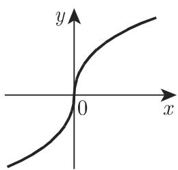
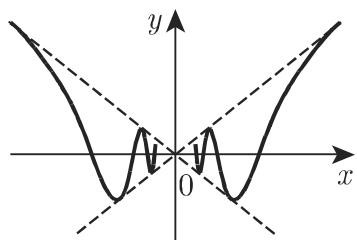
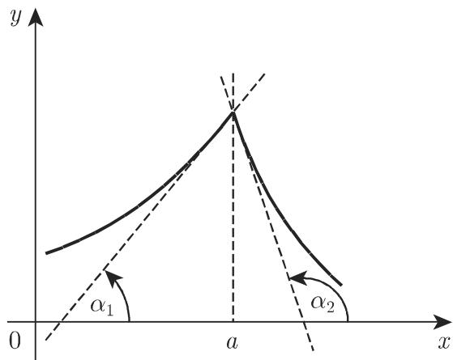

#### 6.1.1 微商

1. 函数的微商或导数

若极限 $\operatorname* { l i m } _ { \Delta x \to 0 } { \frac { f \left( x _ { 0 } + \Delta x \right) - f \left( x _ { 0 } \right) } { \Delta x } }$ 存在且有限，则称该极限为函数 $y = f \left( x \right)$ 在点 $x _ { 0 }$ 处的微商．若对每个 $x ,$ ，当 $\Delta x \to 0$ 时，函数增量 $\Delta y$ 与自变量增最 $\Delta x$ 的商的极限 $\operatorname* { l i m } _ { \Delta x \to 0 } { \frac { f \left( x + \Delta x \right) - f \left( x \right) } { \Delta x } }$ 存在，则称它为函数 $y = f \left( x \right)$ 的导函数，记为

$$
f ^ {\prime} (x) = \lim _ {\Delta x \rightarrow 0} \frac {f (x + \Delta x) - f (x)}{\Delta x}.\tag{6.1}
$$

$y = f \left( x \right)$ 关千变量 的导函数是 的另一个函数，还可记为 $y ^ { \prime } , \dot { y } , D y , \frac { \mathrm { d } y } { \mathrm { d } x } , D f \left( x \right)$ 或 $\frac { \mathrm { d } f \left( \boldsymbol { x } \right) } { \mathrm { d } \boldsymbol { x } }$

2. 导数的儿何表示

在笛卡儿坐标系中函数 $y = f \left( x \right)$ 如图 6.1 所示．若 轴和 轴单位相同则

$$
f ^ {\prime} (x) = \tan \alpha .\tag{6.2}
$$

轴与曲线在一点处切线的夹角 定义了角系数或切线的斜率（参见第 3273.6.1.2, 2.），从 轴的正方向逆时针到切线的角称为坡度角或倾斜角．

  
6.1

3. 可微性

由微商的定义易得：对 x, 当微商 (6.1) 取有限值时， $f \left( x \right)$ 关千 可微．导函数的定义域是原函数定义域的子集（真子集或平凡子集）．若函数在点 连续，但是导数不存在，则函数 f(x) 在该点无切线或者切线垂直千 轴，后者表现为 (6.1)极限为无穷，记为 $f ^ { \prime } \left( x \right) = + \infty$ 或－ 00.

■ A: $f \left( x \right) = \sqrt [ 3 ] { x } : \ f ^ { \prime } \left( x \right) = \frac { 1 } { 3 \sqrt [ 3 ] { x ^ { 2 } } } , \ f ^ { \prime } \left( 0 \right) = \infty$ . 在点 $x = 0$ 处极限 (6.1) 趋千无穷，因此在该点导数不存在（图 6.2(a)).

■ B: $f \left( x \right) = x \sin { \frac { 1 } { x } } , \ x \neq 0$ . 在点 $x = 0$ 处函数无定义，但极限为 0, 因此写成$f \left( 0 \right) = 0$ , 然而 $x = 0$ 处极限 (6.1) 不存在（图 6.2(b)).

  
(a)

  
(b)  
6.2

  
(c)

4. 左、右侧可微性

当 $x = a$ 时，若极限 (6.1) 不存在，但左极限或右极限存在，则分别称其为左导数或右导数若左、右极限都存在，则曲线在此处有两正切值

$$
f ^ {\prime} (a - 0) = \tan \alpha_ {1}, f ^ {\prime} (a + 0) = \tan \alpha_ {2}.\tag{6.3}
$$

从儿何上来看，意味着曲线有一个尖点 (knee) （图 6.2(c) ，图 6.3).

  
6.3

■ $f \left( x \right) = { \frac { x } { 1 + \mathrm { e } ^ { \frac { 1 } { x } } } } , x \neq 0$ ．当 x=O 时函数无定义但在 x=O 处极限为 ，因此记为 $f \left( 0 \right) = 0 . \ f ( x )$ (6.1) 形式在 $x = 0$ 处无极限，但有左极限 $f ^ { \prime } \left( - 0 \right) = 1$ 和右极限 $f ^ { \prime } \left( + 0 \right) = 0$ , 即此处为曲线尖点（图 6.2(c)).
