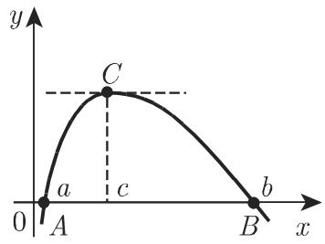
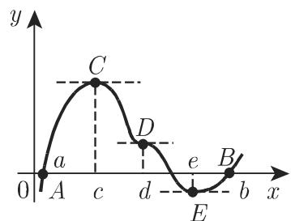
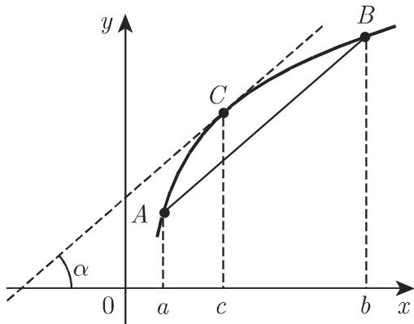

#### 6.1.4 微分学基本定理

6.1.4.1 单调性

若函数 $f \left( x \right)$ 在一连通区间上有定义且连续，并对该区间的每个内点都可微，则

$$
f (x) \text {为单调递增函数, 当且仅当} f ^ {\prime} (x) \geqslant 0;\tag{6.26a}
$$

$$
f (x) \text {为单调递减函数, 当且仅当} f ^ {\prime} (x) \leqslant 0.\tag{6.26b}
$$

若函数严格单调递增或递减，则在给定区间的任意子区间上导函数 ${ f ^ { \prime } } \left( x \right)$ 不恒等千0. 例如图 6.6(b) 上的线段 $\overline { { B C } }$ 不满足该条件．

单调性的儿何意义为：单调递增函数的曲线不会随着自变量的增加而下降，即或者上升或者沿水平方向移动（图 6.6(a)），因此曲线任意一点的切线或者与 轴正半轴的夹角为锐角，或者与 轴平行；当函数单调递减时（图 6.6(b)），叙述与递增时类似若函数严格单调则具有平行千 轴的切线仅在某些点取得，例如图 6.6(a)中的点 ，也就是不可能在图 6.6(b) 那样的子区间 BC 取得．

  
(a)

  
6.6  
(b)

6.1.4.2 费马定理

若函数 $y = f \left( x \right)$ 在一连通区间上有定义，在该区间的内点 $x = c$ 处有极大值或极小值，即对该区间的任一点 x,

$$
f (c) > f (x)\tag{6.27a}
$$

或

$$
f (c) <   f (x),\tag{6.27b}
$$

且函数在点 可导，则在点 导数一定等千 0:

$$
f ^ {\prime} (c) = 0.\tag{6.27c}
$$

费马定理的儿何意义：若函数满足定理假设条件，则曲线在点 具有平行千轴的切线（图 6.7).

  
6.7

费马定理仅为函数在一点取得极大值和极小值的必要条件．由图 $6 . 6 ( \mathrm { a } )$ ，显然导数等千 不是函数取得极值的充分条件：在点 A, $f ^ { \prime } \left( x \right) = 0$ ，但在此处无极大值或极小值

同样，可微也不是取得极值的必要条件．例如图 6.8(d) 点具有极大值，但是该点导数不存在．

6.1.4.3 罗尔定理

若函数 $y = f \left( x \right)$ 在闭区间 [a,b] 连续，开区间 (a,b) 可微，且

$$
f (a) = 0, \quad f (b) = 0 \quad (a <   b),\tag{6.28a}
$$

则 $a , b$ 间至少存在一点 c, 使得

$$
f ^ {\prime} (c) = 0 \quad (a <   c <   b).\tag{6.28b}
$$

罗尔定理的儿何意义：若区间 (a,b) 上连续函数 $y = f \left( x \right)$ 的图像与 轴交千 A,B两点且在每一点都没有垂直切线则 A,B 间至少存在一点 C, 使得该点处的切线与 轴平行（图 6.8(a)）．在此区间可能有多个这样的点如图 6.8(b) 中的点$C , D , E$ ．定理中连续性和可微性的性质非常重要：图 6.8(c) 中的函数在 $x = d$ 处不连续图 6.8(d) 中的函数在 $x = e$ 处不可微，在这两种情况下，对千任意导数存在的点都有 $f ^ { \prime } \left( x \right) \neq 0$

  
(a)

  
(b)  
6.8

  
(c)

  
(d)

6.1.4.4 微分中值定理

若函数 $y = f \left( x \right)$ 在闭区间 [a,b] 连续，开区间 (a,b) 可微，则在 $a , b$ 间至少存在一点 c, 满足

$$
{\frac {f (b) - f (a)}{b - a}} = f ^ {\prime} (c) \quad (a <   c <   b).\tag{6.29a}
$$

令 $b = a + h , \theta$ 为介千 之间的一个数，则该定理可写为如下形式：

$$
f (a + h) = f (a) + h f ^ {\prime} (a + \Theta h) \quad (0 <   \Theta <   1).\tag{6.29b}
$$

(1) 几何意义 定理的几何意义：若函数 $y = f \left( x \right)$ 满足定理条件，则函数图像A,B 间至少有一点 C, 使得该点处的切线与线段 AB 平行（图 6.9)．也可能存在多个这样的点（图 6.S(b)).

  
6.9

通过例子以及图 6.8(c), (d) 可以看出，连续性与可微性的性质非常重要

(2) 应用 中值定理有儿种重要应用．

：该定理可以证明如下形式的不等式：

$$
| f (b) - f (a) | <   K | b - a |,\tag{6.30}
$$

对区间 $[ a , b ]$ 内的每一点 K 为 $\left| f ^ { \prime } \left( x \right) \right|$ 的上界

B: 若用亢的近似值 $\overline { { \pi } } = 3 . 1 4$ 代替 $\mathfrak { R } , f \left( \pi \right) = \frac { 1 } { 1 + \pi ^ { 2 } }$ 的精度如何？

我们有： $| f \left( \pi \right) - f \left( \overline { { \pi } } \right) | = \left| \frac { 2 c } { \left( 1 + c ^ { 2 } \right) ^ { 2 } } \right| \left| \pi - \overline { { \pi } } \right| \leqslant 0 . 0 5 3 \cdot 0 . 0 0 1 6 = 0 . 0 0 0 0 8 5$ ，思即 $\frac { 1 } { 1 + \pi ^ { 2 } }$ 处千 $0 . 0 9 2 0 8 4 - 0 . 0 0 0 0 8 5$ 与 $0 . 0 9 2 0 8 4 + 0 . 0 0 0 0 8 5$ 之间

6.1.4.5 一元函数的泰勒定理

若函数 $y = f \left( x \right)$ 在区间 $[ a , a + h ]$ n-l 次连续可微（具有连续导数），且在区间内部也存在 阶导数，则泰勒公式或泰勒展开式为

$$
f (a + h) = f (a) + \frac {h}{1 !} f ^ {\prime} (a) + \frac {h ^ {2}}{2 !} f ^ {\prime \prime} (a) + \dots + \frac {h ^ {n - 1}}{(n - 1) !} f ^ {(n - 1)} (a) + \frac {h ^ {n}}{n !} f ^ {(n)} (a + \Theta h),\tag{6.31}
$$

其中 $0 < \Theta < 1$ , 可正可负．中值定理 (6.29b) 是泰勒公式在 n=l 时的特例．

6.1.4.6 广义微分中值定理（柯西定理）

若两函数 $y = f \left( x \right)$ 和 $y = \varphi \left( x \right)$ 在闭区间 $[ a , b ]$ 连续，至少在区间内部可微，且在该区间上 $\varphi ^ { \prime } \left( x \right) \neq 0$ ，则 a,b 间至少存在一点 c, 使得

$$
\frac {f (b) - f (a)}{\varphi (b) - \varphi (a)} = \frac {f ^ {\prime} (c)}{\varphi^ {\prime} (c)} \quad (a <   c <   b).\tag{6.32}
$$

广义中值定理的儿何意义与第一个中值定理的儿何意义相对应．例如，设图 6.9曲线的参数方程为 $x = \varphi \left( t \right) , y = f \left( t \right)$ ，则点 A,B 分别对应参数 $t = a , t = b$ 的函数值，因此在点 C,

$$
\tan \alpha = \frac {f (b) - f (a)}{\varphi (b) - \varphi (a)} = \frac {f ^ {\prime} (c)}{\varphi^ {\prime} (c)}.\tag{6.33}
$$

当 $\varphi \left( x \right) = x$ 时，广义中值定理简化成了第一个中值定理
