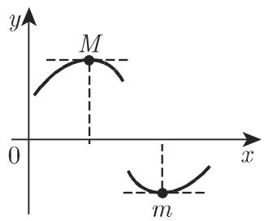
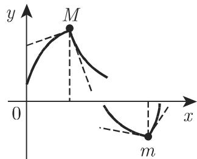
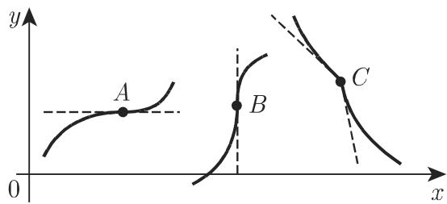
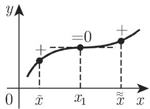
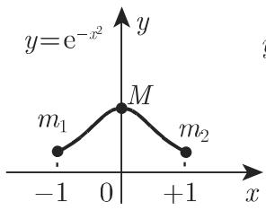
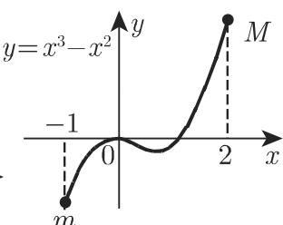
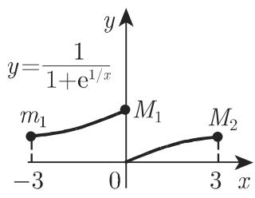
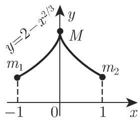

#### 6.1.5 极值和拐点的确定

6.1.5.1 极大值和极小值

若对任意足够小的正数或负数 ，都有

$$
f \left(x _ {0} + h\right) <   f \left(x _ {0}\right) \quad (\text {极大值})\tag{6.34a}
$$

或

$$
f \left(x _ {0} + h\right) > f \left(x _ {0}\right) \quad (\text {极小值}),\tag{6.34b}
$$

(x) $x = x _ { 0 }$ 处的值 $f \left( x _ { 0 } \right)$ 称为相对极大值 (M) 或相对极小值 (m) ．相对极大值 $f \left( x _ { 0 } \right)$ 比它邻域内的任何值都大，类似地，相对极小值比它邻域内的任何值都小．相对极大值和极小值称为相对极值或局部极值；函数在一个区间上的最大值或最小值称为全局或绝对极大值或极小值．

6.1.5.2 相对极值存在的必要条件

函数仅可能在导数等千 或导数不存在的点取得相对极大值或极小值，即在函数取得相对极值的点其切线或者平行千 轴（图 6.lO(a)），或者平行千（图 6.lO(b)）或者不存在（图 6.10(C)）．然而，它们不是函数取得相对极值的充分条件例如图 6.11 中的点 A,B,C 显然满足这些条件，但在这些点函数不存在极值

若一个连续函数有多个相对极值，则极大值和极小值交替出现，即在两个相邻的极大值间存在一个极小值，反之也是如此．

  
(a)

  
(b)  
6.10

  
(c)

6.1.5.3 可微显函数 = f (x) 相对极值与拐点的确定

既然当导数存在时， $f ^ { \prime } \left( x \right) = 0$ 是函数取得极值的必要条件，在确定导数 $f ^ { \prime } \left( x \right)$ 之后要首先计算方程 $f ^ { \prime } \left( x \right) = 0$ 的所有实根 $x _ { 1 } , x _ { 2 } , \cdot \cdot \cdot \ , x _ { i } , \cdot \cdot \cdot \ , x _ { n }$ , 且逐一按下面的方法检验是否在该点取得极值．

  
6.11

1. 符号改变法

对千比 $x _ { i }$ 稍小或稍大的值 $x -$ 和 $x _ { + }$ ，当 $x _ { i }$ 与 $x -$ 和 $x _ { + }$ 之间没有 $f ^ { \prime } \left( x \right)$ 其他根或间断点时，可检验 $f ^ { \prime } \left( x \right)$ 的符号．若从 $f ^ { \prime } \left( x _ { - } \right)$ 向 $f ^ { \prime } \left( x _ { + } \right)$ 符号由“十“变”—”,则函数 (x) $x = x _ { i }$ 处取得相对极大值（图 6.12(a) ）；若符号由“—“变”十＂，则函数 f(x) $x = x _ { i }$ 处取得相对极小值（图 6.12(b) ）；若导数不变号（图 6.12(c),(d)），函数在 $x = x _ { i }$ 处不取得极值，但有一个切线平行千 $x$ 轴的拐点．

2. 高阶导数法

若函数在 $x = x _ { i }$ 处具有高阶导数，可以把 $f ^ { \prime } \left( x \right) = 0$ 的根 $x _ { i }$ 代入到二阶导数$f ^ { \prime \prime } \left( x \right)$ 中．若 $f ^ { \prime \prime } \left( x _ { i } \right) < 0$ , 则函数 $f \left( x \right)$ 在 $x _ { i }$ 处取得相对极大值；若 $f ^ { \prime \prime } \left( x _ { i } \right) > 0$ 则取得相对极小值．若 $f ^ { \prime \prime } \left( x _ { i } \right) = 0$ ，则必须把 $x _ { i }$ 代入到三阶导数 $f ^ { \prime \prime \prime } \left( x \right)$ 中．若$f ^ { \prime \prime \prime } \left( x _ { i } \right) \neq 0$ ，则在 $x = x _ { i }$ 处不取得极值但有一个拐点；若仍有 $f ^ { \prime \prime \prime } \left( x _ { i } \right) = 0$ 则可将 $x _ { i }$ 代入到四阶导数，等等．若 $f \left( x \right)$ 在 $x = x _ { i }$ 处的第一个非零导数的阶数为偶数，则 f(x) $x _ { i }$ 处取得极值：若导数为正，取得极小值，若导数为负，则取得极大值若 (x) $x = x _ { i }$ 处的第一个非零导数的阶数为奇数，则在 $x _ { i }$ 处不取得极值（实际上存在一个拐点）．

  
(a)

  
(b)

  
6.12  
(c)

  
(d)

3. 极值点的其他条件及拐点的确定

若函数当 $x < x _ { 0 }$ 时单调递增 $x > x _ { 0 }$ 时单调递减则函数在 $x = x _ { 0 }$ 处有极大值；若函数当 $x < x _ { 0 }$ 时单调递减 $x > x _ { 0 }$ 时单调递赠，则函数在 $x = x _ { 0 }$ 处有极小值即使在图 6.lO(b)、（c) 中导数不存在的情况下，验证导数符号是否发生改变仍不失为一种有效方法若函数在一点一阶导数存在，且该点为拐点则一阶导数在此点取得极值．因此，为了利用导数来寻找拐点必须像研究原函数的极值点那样，对导函数进行相同的研究．

要确定不连续函数，有时甚至是某些可微函数的极值，也往往需要独特的思想可能函数有一个满足一阶导数存在且等千 的极值，但是二阶导数不存在，而且在一阶导数等千 的那个点的任意邻域都有无穷多个根，这时再考虑符号的改变是没有意义的例如：

$$
f (x) = \left\{ \begin{array}{l l} x ^ {2} (2 + \sin (1 / x)), & x \neq 0, \\ 0, & x = 0. \end{array} \right.
$$

6.1.5.4 绝对极值的确定

把自变量区间划分成一系列子区间，使得函数在这些区间上具有连续导数，则绝对极值在相对极值或子区间的端点处（若端点在定义域）取得．对千不连续函数或者非封闭的区间，可能在定义域上没有极大值和极小值．

极值的确定举例：

■ A: $y \ = \ \mathrm { e } ^ { - x ^ { 2 } } , \ x \ \in \ [ - 1 , 1 ]$ . 函数在 $x \ = \ 0$ 处有最大值，在端点处有最小值（图 $6 . 1 3 ( \mathrm { a } ) )$

■ B: $y = x ^ { 3 } - x ^ { 2 } , x \in [ - 1 , 2 ]$ ．函数在区间端点 $x = + 2$ 处有最大值，在 $x = - 1$ 处有最小值（图 6.13(b)).

■ C: $y = { \frac { 1 } { 1 + \mathrm { e } ^ { \frac { 1 } { x } } } } , x \in \left[ - 3 , 3 \right] , x \neq 0$ 函数无最大值和最小值．在 $x = - 3$ 处有相对极小值，在 $x = 3$ 处有相对极大值若定义 $x = 0$ 时 $y = 1$ , 则函数在 $x = 0$ 时取得绝对极大值（图 6.13(c)).

■ D: $y = 2 - x ^ { \frac { 2 } { 3 } } , x \in [ - 1 , + 1 ]$ ．函数在 x=O 处有最大值（图 6.13(d)，导数不是有限数）．

  
(a)

  
(b)

  
6.13  
(c)

  
(d)

6.1.5.5 隐函数极值的确定

若函数由隐形式 $F \left( x , y \right) = 0$ 给出，且函数 本身及其偏导数 $F _ { x } , F _ { y }$ 连续，则

它的极大值和极小值可以按如下方式确定：

(1) 解方程组 $F \left( x , y \right) = 0 , F _ { x } \left( x , y \right) = 0$ 把得到的结果 $\left( x _ { 1 } , y _ { 1 } \right) , \left( x _ { 2 } , y _ { 2 } \right) , \cdot \cdot \cdot$ $( x _ { i } , y _ { i } ) , \cdot \cdot$ 代入到 $F _ { y } , F _ { x x }$

(2) 对比 $F _ { y } , F _ { x x }$ 在点 $( x _ { i } , y _ { i } )$ 的符号：当它们异号时，函数 $y = f \left( x \right)$ 在点 $x _ { i }$ 取得极小值；当它们同号时，函数 $y = f \left( x \right)$ 在点 $x _ { i }$ 取得极大值．若 $F _ { y }$ 或 $F _ { x x }$ 在$( x _ { i } , y _ { i } )$ 取值为 $0 ,$ ，则需要用更复杂的方法去研究．
