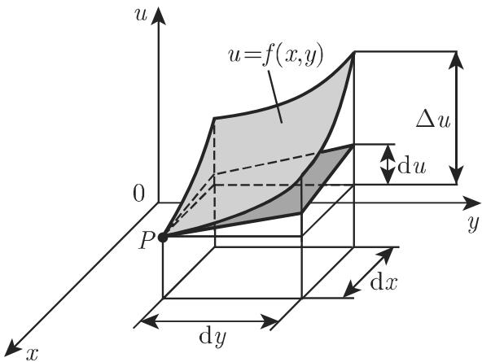

#### 6.2.2 全微分和高阶微分

6.2.2.1 多元函数全微分的概念

1. 可微性

多元函数 $u = f \left( x _ { 1 } , x _ { 2 } , \cdot \cdot \cdot , x _ { i } , \cdot \cdot \cdot , x _ { n } \right)$ 称为在点 $P _ { 0 } ( x _ { 1 0 } , x _ { 2 0 } , \cdot \cdot \cdot , x _ { i 0 } , \cdot \cdot \cdot ,$ $x _ { n 0 } )$ 可微，若对任意小量 $\Delta x _ { 1 } , \Delta x _ { 2 } , \cdot \cdot \cdot , \Delta x _ { i } , \cdot \cdot \cdot , \Delta x _ { n }$ 在点 $P ( x _ { 1 0 } + \Delta x _ { 1 } , x _ { 2 0 } +$ $\Delta x _ { 2 } , \cdots , x _ { i 0 } + \Delta x _ { i } , \cdots , x _ { n 0 } + \Delta x _ { n } \big )$ 与在点 $P _ { 0 } \left( x _ { 1 0 } , x _ { 2 0 } , \cdot \cdot \cdot , x _ { i 0 } , \cdot \cdot \cdot , x _ { n 0 } \right)$ 处函数的全增量

$$
\begin{array}{c} \Delta u = f (x _ {1 0} + \Delta x _ {1}, x _ {2 0} + \Delta x _ {2}, \dots , x _ {i 0} + \Delta x _ {i}, \dots , x _ {n 0} + \Delta x _ {n}) \\ - f (x _ {1 0}, x _ {2 0}, \dots , x _ {i 0}, \dots , x _ {n 0}) \end{array}\tag{6.41a}
$$

与所有变量的偏微分之和

$$
\left(\frac {\partial u}{\partial x _ {1}} \mathrm{d} x _ {1} + \frac {\partial u}{\partial x _ {2}} \mathrm{d} x _ {2} + \dots + \frac {\partial u}{\partial x _ {n}} \mathrm{d} x _ {n}\right) _ {x _ {1 0}, x _ {2 0}, \dots , x _ {n 0}}\tag{6.41b}
$$

相差为距离

$$
\overline {{P _ {0} P}} = \sqrt {\Delta x _ {1} ^ {2} + \Delta x _ {2} ^ {2} + \cdots + \Delta x _ {n} ^ {2}} = \sqrt {\mathrm{d} x _ {1} ^ {2} + \mathrm{d} x _ {2} ^ {2} + \cdots + \mathrm{d} x _ {n} ^ {2}}\tag{6.41c}
$$

的高阶无穷小．

若多元连续函数的偏导数作为多元函数在一点的邻域内连续，则该多元函数在这一点可徵这是可微的充分非必要条件，事实上，即使偏导数在一点存在，函数在该点也未必连续

2. 全微分

为可微函数，则和式 (6.41b) 称为函数的全微分，记为

$$
\mathrm{d} u = \frac {\partial u}{\partial x _ {1}} \mathrm{d} x _ {1} + \frac {\partial u}{\partial x _ {2}} \mathrm{d} x _ {2} + \dots + \frac {\partial u}{\partial x _ {n}} \mathrm{d} x _ {n}.\tag{6.42a}
$$

维向量

$$
\mathbf {g r a d} \underline {{u}} = \left(\frac {\partial u}{\partial x _ {1}}, \frac {\partial u}{\partial x _ {2}}, \dots , \frac {\partial u}{\partial x _ {n}}\right) ^ {\mathrm{T}},\tag{6.42b}
$$

$$
\mathbf {d} \underline {{\boldsymbol {r}}} = (\mathrm{d} x _ {1}, \mathrm{d} x _ {2}, \dots , \mathrm{d} x _ {n}) ^ {\mathrm{T}},\tag{6.42c}
$$

则全微分可以表示为标量积

$$
\mathrm{d} \boldsymbol {u} = (\mathbf {g r a d} \underline {{\boldsymbol {u}}}) ^ {\mathrm{T}} \cdot \mathbf {d} \underline {{\boldsymbol {r}}}.\tag{6.42d}
$$

(6.42b) 中含 个变元的向量为梯度，其定义见 926 13.2.2.

3. 儿何表示

二元函数 $u = f \left( x , y \right)$ 在笛卡儿坐标系中表示一曲面，它的全微分的儿何意义（图 6.15) ：若 dx,dy $x , y$ 的增量，则 $\mathrm { d } u$ 等千切平面（在同一点）的竖坐标（参见281 3.5.3.1, 3.) 的增量

由泰勒公式（参见第 602 6.2.2.3, 1.），可得对二元函数，有

$$
f (x, y) = f \left(x _ {0}, y _ {0}\right) + \frac {\partial f}{\partial x} \left(x _ {0}, y _ {0}\right) \left(x - x _ {0}\right) + \frac {\partial f}{\partial y} \left(x _ {0}, y _ {0}\right) \left(y - y _ {0}\right) + R _ {1}.\tag{6.43a}
$$

忽略掉余项 $R _ { 1 }$ ，有

$$
u = f \left(x _ {0}, y _ {0}\right) + \frac {\partial f}{\partial x} \left(x _ {0}, y _ {0}\right) \left(x - x _ {0}\right) + \frac {\partial f}{\partial y} \left(x _ {0}, y _ {0}\right) \left(y - y _ {0}\right),\tag{6.43b}
$$

它给出了曲而 $u = f \left( x , y \right)$ 在点 $P _ { 0 } \left( x _ { 0 } , y _ { 0 } , z _ { 0 } \right)$ 的切平面方程．

  
6.15

4. 全微分的基本性质

与一元函数中的公式 (6.38) 类似，全微分关千自变量也具有微分形式不变性．

．在误差计算中的应用

在误差计算中，常常使用全微分 du 作为 $\Delta u ($ （参见 (6.41a) ）的误差估计（具体例子参见第 1111 16.4.1.3, 5. ）．由泰勒公式（参见第 602 6.2.2.3, 1.) ，有

$$
| \Delta u | = | \mathrm{d} u + R _ {1} | \leqslant | \mathrm{d} u | + | R _ {1} | \approx | \mathrm{d} u |,\tag{6.44}
$$

即绝对误差 $| \Delta u |$ 可用 $\lvert \mathrm { d } u \rvert$ 作初步近似，由此 du $\Delta u$ 的线性近似．

6.2.2.2 高阶导数与微分

1. 二阶偏导数、施瓦茨交换定理

多元函数 $u = f \left( x _ { 1 } , x _ { 2 } , \cdot \cdot \cdot , x _ { i } , \cdot \cdot \cdot , x _ { n } \right)$ ）的二阶偏导数分两种情况：一种是对同一个变量的偏导数，如 ${ \frac { \partial ^ { 2 } u } { \partial x _ { 1 } ^ { 2 } } } , { \frac { \partial ^ { 2 } u } { \partial x _ { 2 } ^ { 2 } } } , \cdot \cdot \cdot ; { \frac { \nabla } { \mathcal { H } } }$ ；另一种是对两个变量的偏导数，如 ${ \frac { \partial ^ { 2 } u } { \partial x _ { 1 } \partial x _ { 2 } } } ,$ ${ \frac { \partial ^ { 2 } u } { \partial x _ { 2 } \partial x _ { 3 } } } , { \frac { \partial ^ { 2 } u } { \partial x _ { 3 } \partial x _ { 1 } } } , \cdot \cdot \cdot$ ．．．第二种情况称为混合偏导数．若在一点混合偏导数连续，则对微分次序中独立的 $x _ { 1 } , x _ { 2 }$ ，有

$$
\frac {\partial^ {2} u}{\partial x _ {1} \partial x _ {2}} = \frac {\partial^ {2} u}{\partial x _ {2} \partial x _ {1}} \quad (\text {施瓦茨交换定理}).\tag{6.45}
$$

类似地可定义高阶偏导数，如 ${ \frac { \partial ^ { 3 } u } { \partial x _ { 1 } ^ { 3 } } } , { \frac { \partial ^ { 3 } u } { \partial x \partial y ^ { 2 } } } , \cdot \cdot \cdot$

2. 一元函数 $y = f ( x )$ 的二阶微分

一元函数 $y = f \left( x \right)$ 的一阶微分的微分称为二阶微分，记为 $\operatorname { d } ^ { 2 } y , \operatorname { d } ^ { 2 } f \left( x \right)$ ，其中$\mathrm { d } ^ { 2 } y = \mathrm { d } \left( \mathrm { d } y \right) = f ^ { \prime \prime } \left( x \right) \mathrm { d } x ^ { 2 }$ 仅当 为自变量时，才适千采用这样的符号，若$x = z \left( v \right)$ 的形式给出，上述符号就不再适用．类似地可以定义高阶微分．若变元$x _ { 1 } , x _ { 2 } , \cdot \cdot \cdot \ , x _ { i } , \cdot \cdot \cdot \ , x _ { n }$ 本身是其他变元的函数，可得到更复杂的公式（参见第 6066.2.4).

3. 二元函数 $u = f \left( x , y \right)$ 的二阶全微分

$$
\mathrm{d} ^ {2} u = \mathrm{d} (\mathrm{d} u) = \frac {\partial^ {2} u}{\partial x ^ {2}} \mathrm{d} x ^ {2} + 2 \frac {\partial^ {2} u}{\partial x \partial y} \mathrm{d} x \mathrm{d} y + \frac {\partial^ {2} u}{\partial y ^ {2}} \mathrm{d} y ^ {2},\tag{6.46a}
$$

或象征性地写为

$$
\mathrm{d} ^ {2} u = \left(\frac {\partial}{\partial x} \mathrm{d} x + \frac {\partial}{\partial y} \mathrm{d} y\right) ^ {2} u.\tag{6.46b}
$$

4. 二元函数的 阶全微分

$$
\mathrm{d} ^ {n} u = \left(\frac {\partial}{\partial x} \mathrm{d} x + \frac {\partial}{\partial y} \mathrm{d} y\right) ^ {n} u.\tag{6.47}
$$

5. 元函数 $u = f \left( x _ { 1 } , x _ { 2 } , \cdot \cdot \cdot , x _ { m } \right)$ 的 阶全微分

$$
\mathrm{d} ^ {n} u = \left(\frac {\partial}{\partial x _ {1}} \mathrm{d} x _ {1} + \frac {\partial}{\partial x _ {2}} \mathrm{d} x _ {2} + \dots + \frac {\partial}{\partial x _ {m}} \mathrm{d} x _ {m}\right) ^ {n} u.\tag{6.48}
$$

6.2.2.3 多元函数的泰勒定理

1. 二元函数的泰勒定理

a) 第一种表示形式

$$
f (x, y) = f (a, b) + \frac {\partial f (x , y)}{\partial x} \Bigg | _ {(x, y) = (a, b)} (x - a) + \frac {\partial f (x , y)}{\partial y} \Bigg | _ {(x, y) = (a, b)} (y - b)
$$

$$
\begin{array}{l} + \frac {1}{2 !} \left\{\frac {\partial^ {2} f (x , y)}{\partial x ^ {2}} \Big | _ {(x, y) = (a, b)} (x - a) ^ {2} + 2 \frac {\partial^ {2} f (x , y)}{\partial x \partial y} \Big | _ {(x, y) = (a, b)} (x - a) (y - b) \right. \\ + \left. \frac {\partial^ {2} f (x , y)}{\partial y ^ {2}} \right| _ {(x, y) = (a, b)} (y - b) ^ {2} \Bigg \} + \frac {1}{3 !} \{\dots \} + \dots + \frac {1}{n !} \{\dots \} + R _ {n}, \end{array}\tag{6.49a}
$$

其中 (a,b) 是展开式的中心， $R _ { n }$ 是余项．有时采用简写符号，如把

$$
\frac {\partial f (x , y)}{\partial x} \mid_ {(x, y) = (x _ {0}, y _ {0})},
$$

简记为 $\frac { \partial f } { \partial x } \left( x _ { 0 } , y _ { 0 } \right)$

(6.49a) 中更高阶的项可以借助下列符号清晰地表示出来：

$$
\begin{array}{r l} & f (x, y) = f (a, b) + \frac {1}{1 !} \bigg \{(x - a) \frac {\partial}{\partial x} + (y - b) \frac {\partial}{\partial y} \bigg \} f (x, y) \bigg | _ {(x, y) = (a, b)} \\ & \qquad + \frac {1}{2 !} \bigg \{(x - a) \frac {\partial}{\partial x} + (y - b) \frac {\partial}{\partial y} \bigg \} ^ {2} f (x, y) \bigg | _ {(x, y) = (a, b)} \\ & \qquad + \frac {1}{3 !} \{\dots \} ^ {3} f (x, y) \bigg | _ {(x, y) = (a, b)} + \dots + \frac {1}{n !} \{\dots \} ^ {n} f (x, y) \bigg | _ {(x, y) = (a, b)} + R _ {n}. \end{array}\tag{6.49b}
$$

这种符号形式的意思是：利用二项式定理后微分符 ${ \frac { \partial } { \partial x } } , { \frac { \partial } { \partial y } }$ 的幕表示函数 $f \left( x , y \right)$ 的高阶导数，然后让导数在点 (a,b) 取值

b) 第二种表示形式

$$
\begin{array}{l} f (x + h, y + k) = f (x, y) + \frac {1}{1 !} \left(\frac {\partial}{\partial x} h + \frac {\partial}{\partial y} k\right) f (x, y) + \frac {1}{2 !} \left(\frac {\partial}{\partial x} h + \frac {\partial}{\partial y} k\right) ^ {2} f (x, y) \\ \quad + \frac {1}{3 !} \left(\frac {\partial}{\partial x} h + \frac {\partial}{\partial y} k\right) ^ {3} f (x, y) + \dots \\ \quad + \frac {1}{n !} \left(\frac {\partial}{\partial x} h + \frac {\partial}{\partial y} k\right) ^ {n} f (x, y) + R _ {n}. \end{array} \tag {6.49c}
$$

c) 余项 余项的表达式为

$$
R _ {n} = \frac {1}{(n + 1) !} \left(\frac {\partial}{\partial x} h + \frac {\partial}{\partial y} k\right) ^ {n + 1} f (x + \Theta h, y + \Theta k) \quad (0 <   \Theta <   1).\tag{6.49d}
$$

2. 元函数的泰勒公式

用微分符号可类似地表示为

$$
f (x + h, y + k, \dots , t + l)
$$

$$
= f (x, y, \dots , t) + \sum_ {i = 1} ^ {n} \frac {1}{i !} \left(\frac {\partial}{\partial x} h + \frac {\partial}{\partial y} k + \dots + \frac {\partial}{\partial t} l\right) ^ {i} f (x, y, \dots , t) + R _ {n}, \tag {6.50a}
$$

其中余项可用如下表达式来计算

$$
\begin{array}{l} R _ {n} = \frac {1}{(n + 1) !} \left(\frac {\partial}{\partial x} h + \frac {\partial}{\partial y} k + \dots + \frac {\partial}{\partial t} l\right) ^ {n + 1} \\ \times f (x + \Theta h, y + \Theta k, \dots , t + \Theta l) \quad (0 <   \Theta <   1). \end{array}\tag{6.50b}
$$
