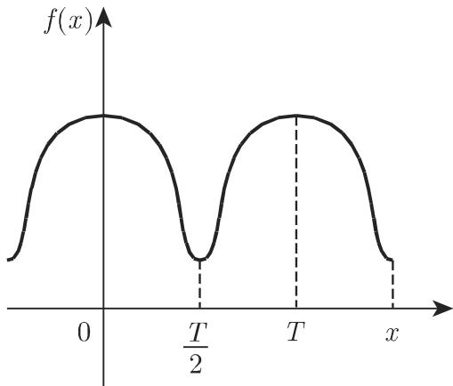
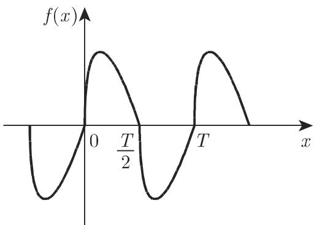
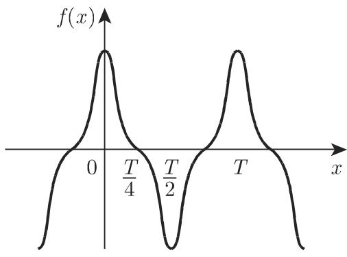
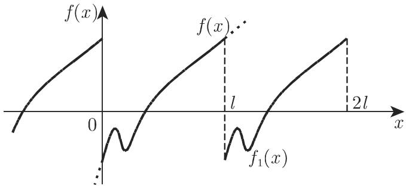
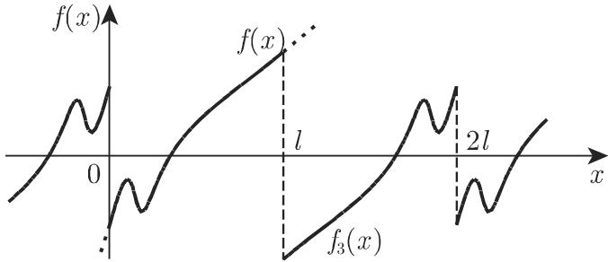

### 7.4 傅里叶级数

#### 7.4.1 三角和与傅里叶级数

7.4.1.1 基本概念

1. 周期函数的傅里叶表示

有时需要或要用到把周期为 的周期函数 f(x) 精确或近似地表示为三角函数和的形式

$$
\begin{array}{c} s _ {n} (x) = \frac {a _ {0}}{2} + a _ {1} \cos \omega x + a _ {2} \cos 2 \omega x + \dots + a _ {n} \cos n \omega x \\ + b _ {1} \sin \omega x + b _ {2} \sin 2 \omega x + \dots + b _ {n} \sin n \omega x, \end{array}\tag{7.101}
$$

上式称为傅里叶展开式频率 $w = { \frac { 2 \pi } { T } }$ ，当 $T = 2 \pi$ 时， $w = 1$ . 635 7.4.2.1 的角度讲，利用近似函数 $s _ { n } \left( x \right)$ 可得 $f \left( x \right)$ 的最佳近似，其中 $a _ { k }$ 和 $b _ { k } ( k = 0 , 1 , 2 , \cdots , n )$

为已知函数的傅里叶系数，且它们可由欧拉公式来确定：

$$
\begin{array}{l} a _ {k} = \frac {2}{T} \int_ {0} ^ {T} f (x) \cos k \omega x \mathrm{d} x = \frac {2}{T} \int_ {x _ {0}} ^ {x _ {0} + T} f (x) \cos k \omega x \mathrm{d} x \\ = \frac {2}{T} \int_ {0} ^ {T / 2} [ f (x) + f (- x) ] \cos k \omega x \mathrm{d} x, \\ b _ {k} = \frac {2}{T} \int_ {0} ^ {T} f (x) \sin k \omega x \mathrm{d} x = \frac {2}{T} \int_ {x _ {0}} ^ {x _ {0} + T} f (x) \sin k \omega x \mathrm{d} x \\ = \frac {2}{T} \int_ {0} ^ {T / 2} [ f (x) - f (- x) ] \sin k \omega x \mathrm{d} x, \end{array}\tag{7.102a}
$$

(7.102b)

此外，这些系数也可由调和分析法（参见第 1287 19.6.4) 近似确定．

2. 傅里叶级数

若存在一组 x, 满足当 $n \to \infty$ 时，函数序列 $s _ { n } \left( x \right)$ 趋千极限 $s \left( x \right)$ ，则对这些，已知函数存在一个收敛的傅里叶级数，形如

$$
\begin{array}{r l} s (x) & = \frac {a _ {0}}{2} + a _ {1} \cos \omega x + a _ {2} \cos 2 \omega x + \dots + a _ {n} \cos n \omega x + \dots \\ & \quad + b _ {1} \sin \omega x + b _ {2} \sin 2 \omega x + \dots + b _ {n} \sin n \omega x + \dots \end{array}\tag{7.103a}
$$

或

$$
s (x) = \frac {a _ {0}}{2} + A _ {1} \sin (\omega x + \varphi_ {1}) + A _ {2} \sin (2 \omega x + \varphi_ {2}) + \dots + A _ {n} \sin (n \omega x + \varphi_ {n}) + \dots ,\tag{7.103b}
$$

在第二种形式中，

$$
A _ {k} = \sqrt {a _ {k} ^ {2} + b _ {k} ^ {2}}, \quad \tan \varphi_ {k} = \frac {a _ {k}}{b _ {k}}.\tag{7.103c}
$$

3. 傅里叶级数的复形式

在很多情况下，傅里叶级数的复形式非常有用：

$$
s (x) = \sum_ {k = - \infty} ^ {+ \infty} c _ {k} \mathrm{e} ^ {\mathrm{i} k \omega x},\tag{7.104a}
$$

$$
c _ {k} = \frac {1}{T} \int_ {0} ^ {T} f (x) \mathrm{e} ^ {- \mathrm{i} k \omega x} \mathrm{d} x = \left\{ \begin{array}{l l} \frac {1}{2} a _ {0}, & k = 0, \\ \frac {1}{2} (a _ {k} - \mathrm{i} b _ {k}), & k > 0, \\ \frac {1}{2} (a _ {- k} + \mathrm{i} b _ {- k}), & k <   0. \end{array} \right.\tag{7.104b}
$$

7.4.1.2 傅里叶级数的重要性质

1. 函数的最小均方误差

若区间 [O,T] $\displaystyle \left( T = \frac { 2 \pi } { w } \right)$ 上函数 (x) 能用如下三角和来近似：

$$
s _ {n} (x) = \frac {a _ {0}}{2} + \sum_ {k = 1} ^ {n} a _ {k} \cos k \omega x + \sum_ {k = 1} ^ {n} b _ {k} \sin k \omega x,\tag{7.105a}
$$

该三角和也称为傅里叶和，则均方误差（参见第 1278 19.6.2.1 1288 19.6.4.1,2.)

$$
F = \frac {1}{T} \int_ {0} ^ {T} [ f (x) - s _ {n} (x) ] ^ {2} \mathrm{d} x\tag{7.105b}
$$

最小，其中 $a _ { k }$ 和 $b _ { k }$ 为给定函数 $f \left( x \right)$ 的傅里叶系数 (7.102a, 7.102b).

2. 函数的均方收敛、帕塞瓦尔方程

若已知函数有界且在区间 $0 ~ < ~ x ~ < ~ T$ 上分段连续，则傅里叶级数在区间$\left[ 0 , T \right] \left( T = { \frac { 2 \pi } { w } } \right)$ 上均方收敛到该函数，即

$$
\int_ {0} ^ {T} [ f (x) - s _ {n} (x) ] ^ {2} \mathrm{d} x \rightarrow 0, \quad n \rightarrow \infty .\tag{7.106a}
$$

均方收敛的重要结果为帕塞瓦尔方程：

$$
\frac {2}{T} \int_ {0} ^ {T} [ f (x) ] ^ {2} \mathrm{d} x = \frac {a _ {0} ^ {2}}{2} + \sum_ {k = 1} ^ {\infty} (a _ {k} ^ {2} + b _ {k} ^ {2}).\tag{7.106b}
$$

3. 狄利克雷条件

若函数 f(x) 满足狄利克雷条件，即

a) 定义区间可以分成有限多个区间，且函数 (x) 在这些区间上均连续、单调．

b) 在函数 (x) 的每个间断点定义 $f \left( x + 0 \right)$ 和 $f \left( x - 0 \right)$ 后，函数的傅里叶级数收敛．在函数 $f \left( x \right)$ 的连续点和等千 $f \left( x \right)$ ，在间断点和等千 $\frac { f \left( x - 0 \right) + f \left( x + 0 \right) } { 2 }$

4. 傅里叶系数的渐近性

若周期函数 (x) 及其 阶与 阶以下导数均连续，则当 $n \to \infty$ 时，表达式$a _ { n } n ^ { k + 1 }$ 和 $b _ { n } n ^ { k + 1 }$ 均趋千 0.

#### 7.4.2 对称函数系数的确定

7.4.2.1 各种类型的对称

1. 第一类对称

若周期为 的周期函数 f(x) 为偶函数，即 (x) = f( x) （图 7.2)，则其傅里叶系数为

$$
a _ {k} = \frac {4}{T} \int_ {0} ^ {T / 2} f (x) \cos k \frac {2 \pi x}{T} \mathrm{d} x, \quad b _ {k} = 0 \qquad (k = 0, 1, 2, \dots).\tag{7.107}
$$

  
7.2

2. 第二类对称

若周期为 $T$ 的周期函数 f(x) 为奇函数，即 $f \left( x \right) = - f \left( - x \right)$ （图 7.3) ，则其傅里叶系数为

$$
a _ {k} = 0, \quad b _ {k} = \frac {4}{T} \int_ {0} ^ {T / 2} f (x) \sin k \frac {2 \pi x}{T} \mathrm{d} x \quad (k = 0, 1, 2, \dots).\tag{7.108}
$$

  
7.3

3. 第三类对称

若周期为 $T$ 的周期函数 (x) 满足 $f \left( x + T / 2 \right) = - f \left( x \right)$ （图 7.4)，则其傅里叶系数为

$$
a _ {2 k + 1} = \frac {4}{T} \int_ {0} ^ {T / 2} f (x) \cos (2 k + 1) \frac {2 \pi x}{T} \mathrm{d} x, a _ {2 k} = 0,\tag{7.109a}
$$

$$
b _ {2 k + 1} = \frac {4}{T} \int_ {0} ^ {T / 2} f (x) \sin (2 k + 1) \frac {2 \pi x}{T} \mathrm{d} x, \quad b _ {2 k} = 0 \quad (k = 0, 1, 2, \dots).\tag{7.109b}
$$

4. 第四类对称

若周期为 $T$ 的周期函数 f(x) 为奇函数，且满足第三类对称（图 7.5(a)），则其傅里叶系数

$$
a _ {k} = b _ {2 k} = 0, \quad b _ {2 k + 1} = \frac {8}{T} \int_ {0} ^ {T / 4} f (x) \sin (2 k + 1) \frac {2 \pi x}{T} \mathrm{d} x \quad (k = 0, 1, 2, \dots).\tag{7.110}
$$

若函数 f(x) 为偶函数，且满足第三类对称（图 7.5(b)），则其傅里叶系数

$$
b _ {k} = a _ {2 k} = 0, \quad a _ {2 k + 1} = \frac {8}{T} \int_ {0} ^ {T / 4} f (x) \cos (2 k + 1) \frac {2 \pi x}{T} \mathrm{d} x \quad (k = 0, 1, 2, \dots).
$$

(7.111)

7.4  
  
(a)  
7.5

  
(b)

7.4.2.2 傅里叶级数展开形式

在区间 [O, l] 上满足狄利克雷条件（参见第 635 7.4.1.2, 3.) 的每个函数 (x)都可在该区间展成如下形式的收敛级数：

$$
\begin{array}{r l} f _ {1} (x) & = \frac {a _ {0}}{2} + a _ {1} \cos \frac {2 \pi x}{l} + a _ {2} \cos 2 \frac {2 \pi x}{l} + \dots + a _ {n} \cos n \frac {2 \pi x}{l} + \dots \\ & \quad + b _ {1} \sin \frac {2 \pi x}{l} + b _ {2} \sin 2 \frac {2 \pi x}{l} + \dots + b _ {n} \sin n \frac {2 \pi x}{l} + \dots . \end{array} \tag {1}\tag{7.112a}
$$

函数 $f _ { 1 } \left( x \right)$ 的周期 $T = l ;$ 在区间 (0, l) 的连续点函数 $f _ { 1 } \left( x \right)$ 与 $f \left( x \right)$ 相同（图 7.6),在间断点 $f _ { 1 } \left( x \right) = \frac { 1 } { 2 } \left[ f \left( x - 0 \right) + f \left( x + 0 \right) \right]$ ］．当 $w = \frac { 2 \pi } { l }$ 时，展开式的系数由欧拉公式 (7.102a, 7.102b) 来确定

$$
f _ {2} (x) = \frac {a _ {0}}{2} + a _ {1} \cos \frac {\pi x}{l} + a _ {2} \cos 2 \frac {\pi x}{l} + \dots + a _ {n} \cos n \frac {\pi x}{l} + \dots .\tag{7.112b}
$$

函数 $f _ { 2 } \left( x \right)$ ）的周期 $T = 2 l ;$ ；在区间 $[ 0 , l ]$ 上函数 $f _ { 2 } \left( x \right)$ 具有第一类对称性，且与函数 $f \left( x \right)$ 相同（图 7.7), h (x) 的展开式系数可由第一类对称中 $T = 2 l$ 时满足的公式来确定

(3)

  
7.6

  
7.7

$$
f _ {3} (x) = b _ {1} \sin \frac {\pi x}{l} + b _ {2} \sin 2 \frac {\pi x}{l} + \dots + b _ {n} \sin n \frac {\pi x}{l} + \dots .\tag{7.112c}
$$

函数 $f _ { 3 } \left( x \right)$ 的周期 $T = 2 l ;$ ；在区间 (0, l) 上函数 $f _ { 3 } \left( x \right)$ 具有第二类对称性，且与函数 $f \left( x \right)$ 相同（图 7.8), $f _ { 3 } \left( x \right)$ 的展开式系数可由第二类对称中 $T = 2 l$ 时满足的公式来确定

  
图 7.8

#### 7.4.3 数值法对傅里叶系数的确定

若周期函数 f(x) 比较复杂，或者在区间 [O,T) 上，仅当 $x _ { k } \ = \ { \frac { k T } { N } } ( k \ =$ $0 , 1 , 2 , \cdots , N - 1 )$ 这些离散点处函数值已知则此时的傅里叶系数只能通过近似得到另外， 的数值可以很大在上述情况中要用到数值调和分析中的方法（参见1287 19.6.4).

#### 7.4.4 傅里叶级数与傅里叶积分

1. 傅里叶积分

若函数 (x) 在任意有限区间上满足狄利克雷条件（参见第 635 7.4.1.2, 3.),且积分 $\int _ { - \infty } ^ { + \infty } | f \left( x \right) | \mathrm { d } x$ 收敛（参见第 674 8.2.3.2, 1.)，则下面公式成立（傅里叶积分）：

$$
f (x) = \frac {1}{2 \pi} \int_ {- \infty} ^ {+ \infty} \mathrm{e} ^ {\mathrm{i} \omega x} \mathrm{d} \omega \int_ {- \infty} ^ {+ \infty} f (t) \mathrm{e} ^ {- \mathrm{i} \omega t} \mathrm{d} t = \frac {1}{\pi} \int_ {0} ^ {\infty} \mathrm{d} \omega \int_ {- \infty} ^ {+ \infty} f (t) \cos \omega (t - x) \mathrm{d} t.\tag{7.113a}
$$

在间断点有

$$
f (x) = \frac {1}{2} [ f (x - 0) + f (x + 0) ].\tag{7.113b}
$$

2. 非周期函数的极限情况

公式 (7.113a) 可看作当 $l  \infty$ 时非周期函数 f(x) 在(—l, l) 上的三角级数展开式．借助傅里叶级数展开式在离散频谱的基础上，周期为 的周期函数可表示为频率 $w _ { n } = n \frac { 2 \pi } { T } ( n = 1 , 2 , \cdot \cdot \cdot )$ 小振幅为 $A _ { n }$ 的谐振动之和．

利用傅里叶积分，非周期函数 (x) 可以表示成无限多个具有连续变化频率 $w$ 的谐振动之和．傅里叶积分把函数 f(x) 展开成连续频谱，其中频率 $w$ 对应谱密度$g \left( w \right)$ :

$$
g (\omega) = \frac {1}{2 \pi} \int_ {- \infty} ^ {+ \infty} f (t) \mathrm{e} ^ {- \mathrm{i} \omega t} \mathrm{d} t.\tag{7.113c}
$$

若 $f \left( x \right)$ 为下面 a) 这种偶函数或 b) 这种奇函数，则傅里叶积分形式更为简单．

$$
\mathrm{a)} f (x) = \frac {2}{\pi} \int_ {0} ^ {\infty} \cos \omega x \mathrm{d} \omega \int_ {0} ^ {\infty} f (t) \cos \omega t \mathrm{d} t;\tag{7.114a}
$$

$$
\mathrm{b)} f (x) = \frac {2}{\pi} \int_ {0} ^ {\infty} \sin \omega x \mathrm{d} \omega \int_ {0} ^ {\infty} f (t) \sin \omega t \mathrm{d} t.\tag{7.114b}
$$

·偶函数 $f \left( x \right) = \mathrm { e } ^ { - \left| x \right| }$ 的谱密度及 f(x) 的表示分别为

$$
g (\omega) = \frac {2}{\pi} \int_ {0} ^ {\infty} \mathrm{e} ^ {- t} \cos \omega t \mathrm{d} t = \frac {2}{\pi} \frac {1}{\omega^ {2} + 1}\tag{7.115a}
$$

和

$$
\mathrm{e} ^ {- | x |} = \frac {2}{\pi} \int_ {0} ^ {\infty} \frac {\cos \omega x}{\omega^ {2} + 1} \mathrm{d} \omega .\tag{7.115b}
$$

#### 7.4.5 关于表中某些傅里叶级数的注

1378 页的表 21.6 给出了某些简单函数在某一区间上的傅里叶展开式，并对其进行了周期延拓，描述了延拓函数曲线的形状．

1. 坐标变换的应用

通过改变坐标轴的标度（度量单位）或平移原点可将许多非常简单的周期函数化简成表 21.6 中所示的函数

·设函数 $f \left( x \right) = f \left( - x \right)$ ，且满足关系

$$
y = \left\{ \begin{array}{l l} 2, & 0 <   x <   \frac {T}{4}, \\ 0, & \frac {T}{4} <   x <   \frac {T}{2} \end{array} \right.\tag{7.116a}
$$

（图 7.9)，则利用代换 a= 1, 并引入新的变量 $Y = y - 1$ $X = { \frac { 2 \pi x } { T } } + { \frac { \pi } { 2 } }$ ，可化为21.6 中的第 种形式在级数 中作变量代换，因为 $\sin { ( 2 n + 1 ) } \left( { \frac { 2 \pi x } { T } } + { \frac { \pi } { 2 } } \right) =$ $( - 1 ) ^ { n } \cos { ( 2 n + 1 ) } \frac { 2 \pi x } { T }$ ，对函数 (7.116a)，有表达式

$$
y = 1 + \frac {4}{\pi} \left(\cos \frac {2 \pi x}{T} - \frac {1}{3} \cos 3 \frac {2 \pi x}{T} + \frac {1}{5} \cos 5 \frac {2 \pi x}{T} - \dots\right).\tag{7.116b}
$$

  
7.9

2. 复函数级数展开式的应用

21.6 将函数展开成三角级数的许多公式都可以利用复变量函数的幕级数展开得到

·由函数展开式

$$
\frac {1}{1 - z} = 1 + z + z ^ {2} + \dots \quad (| z | <   1)\tag{7.117}
$$

当

$$
z = a \mathrm{e} ^ {\mathrm{i} \varphi}\tag{7.118}
$$

时，分离实部和虚部有

$$
\begin{array}{l} 1 + a \cos \varphi + a ^ {2} \cos 2 \varphi + \dots + a ^ {n} \cos n \varphi + \dots = \frac {1 - a \cos \varphi}{1 - 2 a \cos \varphi + a ^ {2}}, \\ a \sin \varphi + a ^ {2} \sin 2 \varphi + \dots + a ^ {n} \sin n \varphi + \dots = \frac {a \sin \varphi}{1 - 2 a \cos \varphi + a ^ {2}}, | a | <   1. \end{array}\tag{7.119}
$$

（胡俊美 译）
