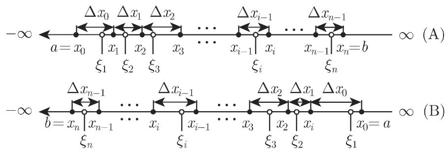
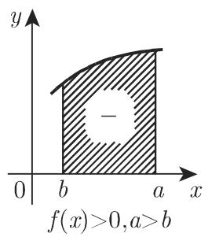
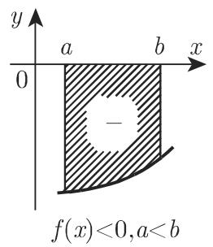
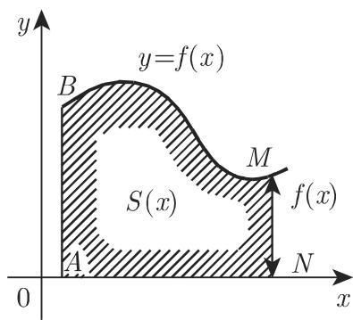
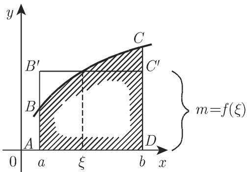

#### 8.2.1 基本概念、法则和定理

8.2.1.1 定积分的定义与存在性

1. 定积分的定义

有界闭区间 [a,b] 上的有界函数 $y = f \left( x \right)$ 的定积分是一个数，当 $a < b ($ （情形A) $a > b ($ （情形 B) 时，定积分为和的极限．在后面定积分概念的推广中，也把它看成定义在实直线上任意连通区域，如开区间或半开区间、半实轴或整个数轴以及分段连通（除有限个点外处处连通）区域上的函数，这类积分属千广义积分（参见第673 8.2.3).

2. 作为和的极限的定积分

定积分可以定义为如下步骤的极限（参见第 641 页图 8.1):

在区间 $[ a , b ]$ 上任意选取 $n - 1$ 个分点 $x _ { 1 } , x _ { 2 } , \cdots , x _ { n - 1 } .$ ' 且满足下列情形之一：

$$
a = x _ {0} <   x _ {1} <   x _ {2} <   \dots <   x _ {i} <   \dots <   x _ {n - 1} <   x _ {n} = b \quad (\text {情形A})\tag{8.37a}
$$

或

$$
a = x _ {0} > x _ {1} > x _ {2} > \dots > x _ {i} > \dots > x _ {n - 1} > x _ {n} = b \quad (\text {情形 B}),\tag{8.37b}
$$

把区间分成 个子区间．

如图 8.4 所示，在每个子区间的内部或边界任取一点 $\xi _ { i } .$ ，使得 $x _ { i - 1 } \leqslant$ $\xi _ { i } \leqslant x _ { i }$ （情形 中）或 $x _ { i - 1 } \geqslant \xi _ { i } \geqslant x _ { i }$ （情形 中）． (8.37c)

(B)

8.4

第3步用函数 $f \left( x \right)$ 在所选点处的值 $f \left( \xi _ { i } \right)$ 乘以子区间的长度，即差 $\Delta x _ { i - 1 } =$ $x _ { i } - x _ { i - 1 }$ ，若为情形 ，则差取正号，若为情形 ，则差取负号．情形 中这一步如641 页图 8.1 所示

将所有这 个乘积 $f \left( \xi _ { i } \right) \Delta x _ { i - 1 }$ 相加．

当每个子区间的长度都趋千 $0 ,$ 故 $\Delta x _ { i - 1 }$ 也可看作无穷小量，小区间的个数趋千 $\infty$ 时，计算积分近似和或黎曼和

$$
\sum_ {i = 1} ^ {n} f (\xi_ {i}) \Delta x _ {i - 1}\tag{8.38}
$$

的极限

若无论 $x _ { i }$ 尸及 $\xi _ { i }$ 的取法如何，极限都存在，则称该极限为函数在所给区间上的定黎曼积分，记作

$$
\int_{a}^{b}f(x)\mathrm{d}x = \lim_{\substack{\Delta x_{i - 1}\to 0\\ n\to \infty}}\sum_{i = 1}^{n}f(\xi_{i})\Delta x_{i - 1}.\tag{8.39}
$$

称区间的端点为积分限， $a$ 为积分下限， $b$ 为积分上限，区间 $[ a , b ]$ 为积分区间， $x$ 为积分变量， $f \left( x \right)$ 为被积函数

3. 定积分的存在性

闭区间 $[ a , b ]$ 上的连续函数定积分存在，即极限 (8.39) 总存在且与 $x _ { i }$ 尸及 $\xi _ { i }$ 的取法无关若函数在区间 $[ a , b ]$ 有界，且仅有有限个间断点则其定积分也存在在某一给定区间上定积分存在的函数称为该区间上的可积函数．

8.2.1.2 定积分的性质

8.5 列出了定积分极为重要的性质

8.5 定积分的重要性质

<table><tr><td>性质</td><td>公式</td></tr><tr><td>微积分基本定理 (f(x)连续)</td><td> $\int_{a}^{b} f(x) \mathrm{d}x = F(x)\bigg|_{a}^{b} = F(b) - F(a), \quad \text{其中}$  $F(x)=\int f(x) \mathrm{d}x + C \text{或} F'(x) = f(x)$ </td></tr><tr><td>交换法则</td><td> $\int_{a}^{b} f(x) \mathrm{d}x = -\int_{b}^{a} f(x) \mathrm{d}x$ </td></tr><tr><td>等积分限</td><td> $\int_{a}^{a} f(x) \mathrm{d}x = 0$ </td></tr><tr><td>区间法则</td><td> $\int_{a}^{b} f(x) \mathrm{d}x = \int_{a}^{c} f(x) \mathrm{d}x + \int_{c}^{b} f(x) \mathrm{d}x$ </td></tr><tr><td>积分变量记号的独立性</td><td> $\int_{a}^{b} f(x) \mathrm{d}x = \int_{a}^{b} f(u) \mathrm{d}u = \int_{a}^{b} f(t) \mathrm{d}t$ </td></tr><tr><td>关于积分上限函数的可微性</td><td> $\frac{\mathrm{d}}{\mathrm{d}x} \int_{a}^{x} f(t) \mathrm{d}t = f(x), \text{其中} f(x) \text{为连续函数}$ </td></tr><tr><td>积分中值定理</td><td> $\int_{a}^{b} f(x) \mathrm{d}x = (b - a)f(\xi) \quad (a < \xi < b)$ </td></tr></table>

1. 微积分基本定理

若被积函数 f(x) 在区间 [a,b] 连续 $F \left( x \right)$ 为其原函数，则

$$
\int_ {a} ^ {b} f (x) \mathrm{d} x = \int_ {a} ^ {b} F ^ {\prime} (x) \mathrm{d} x = \left. F (x) \right| _ {a} ^ {b} = F (b) - F (a),\tag{8.40}
$$

即定积分的计算可以化成相应的不定积分的计算，也就是确定反导数：

$$
F (x) = \int f (x) \mathrm{d} x + C.\tag{8.41}
$$

可积函数不一定有原函数，但连续函数一定有原函数．

2. 儿何意义及符号法则

(1) 曲线下的面积设对 $\forall x \in [ a , b ]$ ，都有 $f \left( x \right) \geqslant 0 .$ 则和 (8.38) 可看作 641页图 8.1 所有小矩形的总面积，即曲线 $f \left( x \right)$ 下方面积的近似值．因此和的极限，即函数 $f \left( x \right)$ 的定积分等千曲线 $y = f \left( x \right) , x$ 轴以及平行线 $x = a , x = b$ 所围成的区的面积：

$$
A = \int_ {a} ^ {b} f (x) \mathrm{d} x \quad (a <   b, \text {且当} a \leqslant x \leqslant b \text {时} f (x) \geqslant 0).\tag{8.42}
$$

(2) 符号法则 若函数 $y = f \left( x \right)$ 在积分区间上分段正负（图 8.5)，则相应子区间上的积分，即各部分面积也有正有负，故总区间上的积分等千各部分面积的代数和

图 $8 . 5 ( \mathrm { a } ) \sim ( \mathrm { d } )$ 给出了面积符号可能出现的四种不同情况

■ $\mathbf { A } { \mathrm { : } } \int _ { 0 } ^ { \pi } \sin x \ \mathrm { d } x$ （读作从 $x = 0$ 到 $x = \pi$ 上的积分） $= - \cos { x } | _ { 0 } ^ { \pi } = ( - \cos { \pi } + \cos { 0 } ) = 2 .$ ■ B: $\int _ { 0 } ^ { 2 \pi } \sin { x } \mathrm { d } x$ （读作从 $x = 0$ 到 $x = 2 \pi$ 上的积分） $= - \cos x | _ { 0 } ^ { 2 \pi } = ( - \cos 2 \pi +$ $\cos 0 ) = 0$

  
(a)

  
(b)

  
8.5  
(c)

  
(d)

3. 变上限

(1) 特别积分 若积分上限为变量（图 8.6, 区域 ABCD)，则存在如下形式的面积函数：

$$
S (x) = \int_ {a} ^ {x} f (t) \mathrm{d} t \quad (a <   b, \text {且当} x \geqslant a \text {时} f (x) \geqslant 0),\tag{8.43}
$$

该积分称为特别积分

为了避免变上限 与积分变量混淆常常把积分变量记为 ，如（8.43) 那样不再使用 x.

(2) 变上限定积分的微分 若变上限定积分 $\int _ { 0 } ^ { x } f \left( t \right) \mathrm { d } t$ 存在，则它为上限的连续函数 $F \left( x \right)$ ．若 $f \left( x \right)$ 连续则 $F \left( x \right)$ 关千 可微，即 $F \left( x \right)$ 为被积函数的一个原函数．因此若 $f \left( x \right)$ 在区间 $[ a , b ]$ 上连续，则对任意 $x \in ( a , b )$ ，有

$$
F ^ {\prime} (x) = f (x) \quad {\text {或}} \quad {\frac {\mathrm{d}}{\mathrm{d} x}} \int_ {a} ^ {x} f (t) \mathrm{d} t = f (x).\tag{8.44}
$$

该定理的儿何意义是变面积 $S \left( x \right)$ 的导数等千线段 NM 的长度（图 8.7)．正如线段的长度一样，此处的面积也遵循符号法则（图 8.5).

4. 积分区间的分解

积分区间 $[ a , b ]$ 可以分解成子区间，整个区间上定积分的值

$$
\int_ {a} ^ {b} f (x) \mathrm{d} x = \int_ {a} ^ {c} f (x) \mathrm{d} x + \int_ {c} ^ {b} f (x) \mathrm{d} x,\tag{8.45}
$$

上式称为区间法则．若被积函数有有限多个跳跃点则可将原区间划分成一系列子区间使得被积函数在每个子区间上都连续千是利用上面的公式原积分等千各个子区间上的积分之和．

  
8.6

  
8.7

  
8.8

若函数在子区间的端点左极限或右极限存在，可以以其定义函数的值，若极限不存在，则积分为广义积分（参见第 677 8.2.3.3, 1.).

若假设等号右侧积分存在，则当 位千区间 [a,b] 的外部时，上述积分公式仍成立

8.2.1.3 关于积分限的其他定理

1. 积分变量记号的独立性

定积分的值与积分变量的符号无关：

$$
\int_ {a} ^ {b} f (x) \mathrm{d} x = \int_ {a} ^ {b} f (u) \mathrm{d} u = \int_ {a} ^ {b} f (t) \mathrm{d} t.\tag{8.46}
$$

2. 等积分限

若积分上限和积分下限相等，则积分值等千 0:

$$
\int_ {a} ^ {a} f (x) \mathrm{d} x = 0.\tag{8.47}
$$

3. 交换积分限

交换积分的上下限后，积分变号（交换法则）：

$$
\int_ {a} ^ {b} f (x) \mathrm{d} x = - \int_ {b} ^ {a} f (x) \mathrm{d} x.\tag{8.48}
$$

4. 中值定理与中值

(1) 中值定理 若函数 (x) 在区间 $[ a , b ]$ 上连续，则在该区间至少存在一点$\xi ,$ ，满足对千情形 中的 $a < \xi < b$ 以及情形 中的 $a > \xi > b$ （参见第 6578.2.1.1,2.) ，有

$$
\int_ {a} ^ {b} f (x) \mathrm{d} x = (b - a) f (\xi).\tag{8.49}
$$

该定理的儿何意义为在点 a,b 之间至少存在一点 $\xi ,$ ,使得图 8.8 中图形 ABCD而积等千矩形 $A B ^ { \prime } C ^ { \prime } D$ 的面积

$$
m = \frac {1}{b - a} \int_ {a} ^ {b} f (x) \mathrm{d} x\tag{8.50}
$$

称为区间 $[ a , b ]$ 上函数 (x) 的中值或算术平均数．

(2) 中值定理的推广 若函数 $f \left( x \right)$ 和 $\varphi \left( x \right)$ 均在区间 [a,b] 上连续，且 $\varphi \left( x \right)$ 在该区间不变号，则至少存在一点 ，使得

$$
\int_ {a} ^ {b} f (x) \varphi (x) \mathrm{d} x = f (\xi) \int_ {a} ^ {b} \varphi (x) \mathrm{d} x \quad (a <   \xi <   b).\tag{8.51}
$$

5. 定积分的估计

定积分的值介千区间 $[ a , b ]$ 的长度分别与函数在该区间的下确界 $m$ 和上确界的乘积之间：

$$
m (b - a) \leqslant \int_ {a} ^ {b} f (x) \mathrm{d} x \leqslant M (b - a) \quad (a <   b, f (x) \geqslant 0).\tag{8.52}
$$

若函数 $f$ 连续，则 的最小值， 的最大值．由图 8.9，很容易看出该定理的几何意义．

  
8.9

8.2.1.4 定积分的计算

1. 主要方法

计算定积分的主要方法是微积分基本定理，即转化成不定积分的计算（参见第659 8.2.1.2,1.），比如，可利用 1382 页的表 21.7. 作积分限的代换之前，要事先检查原积分是否为广义积分．

当今，常用计算机代数系统可解析地计算不定积分或定积分（参见第 20 章）．

2. 定积分的变换

在很多情况下，借助代换或分部积分，作适当变换可计算定积分

A: $I = \int _ { 0 } ^ { a } { \sqrt { a ^ { 2 } - x ^ { 2 } } } \mathrm { d } x$ 作代换法．

首先作代换： $x = \varphi \left( t \right) = a \sin t .$ ，有 $t = \psi \left( x \right) = \arcsin \frac { x } { a } , \psi \left( 0 \right) = 0 , \psi \left( a \right) =$ $\frac { \pi } { 2 }$

于是

$$
\begin{array}{r} I = \int_ {0} ^ {a} \sqrt {a ^ {2} - x ^ {2}} \mathrm{d} x = \int_ {\arcsin 0} ^ {\arcsin 1} a ^ {2} \sqrt {1 - \sin^ {2} t} \cos t \mathrm{d} t \\ = a ^ {2} \int_ {0} ^ {\frac {\pi}{2}} \cos^ {2} t \mathrm{d} t = a ^ {2} \int_ {0} ^ {\frac {\pi}{2}} \frac {1}{2} (1 + \cos 2 t) \mathrm{d} t. \end{array}
$$

进一步作代换： $t = \varphi \left( z \right) = \frac { z } { 2 }$ ，有 $z = \psi \left( t \right) = 2 t , \ \psi \left( 0 \right) = 0 , \ \psi \left( \frac { \pi } { 2 } \right) = \pi ,$ ，千是

$$
I = \left. \frac {a ^ {2}}{2} t \right| _ {0} ^ {\frac {\pi}{2}} + \frac {a ^ {2}}{4} \int_ {0} ^ {\pi} \cos z \mathrm{d} z = \left. \frac {\pi a ^ {2}}{4} + \frac {a ^ {2}}{4} \sin z \right| _ {0} ^ {\pi} = \frac {\pi a ^ {2}}{4}.
$$

• ：分部积分法 $\int _ { 0 } ^ { 1 } x \mathrm { e } ^ { x } \mathrm { d } x = [ x \mathrm { e } ^ { x } ] _ { 0 } ^ { 1 } - \int _ { 0 } ^ { 1 } \mathrm { e } ^ { x } \mathrm { d } x = \mathrm { e } - ( \mathrm { e } - 1 ) = 1 .$

3. 较难积分的计算方法

若不定积分的计算太过困难与复杂，或者不能用初等函数来表 $\textstyle { \overline { { \overline { { \mathbf { \Lambda } } } } } }$ ，还可以借助其他方法分几种情况求解定积分的值，比如复变量函数的积分（参见 984rv989 页的例子）以及含一个参数的积分的微分定理（参见第 679 8.2.4):

$$
\frac {\mathrm{d}}{\mathrm{d} t} \int_ {a} ^ {b} f (x, t) \mathrm{d} x = \int_ {a} ^ {b} \frac {\partial f (x , t)}{\partial t} \mathrm{d} x.\tag{8.53}
$$

• $I = \int _ { 0 } ^ { 1 } { \frac { x - 1 } { \ln x } } { \mathrm { d } } x$ ．引入参数 t: $F \left( t \right) = \int _ { 0 } ^ { 1 } \frac { x ^ { t } - 1 } { \ln x } \mathrm { d } x ; F \left( 0 \right) = 0 ; F \left( 1 \right) = I .$

(t) 利用 (8.53) ，有

$$
{\frac {\mathrm{d} F}{\mathrm{d} t}} = \int_ {0} ^ {1} {\frac {\partial}{\partial t}} \left[ {\frac {x ^ {t} - 1}{\ln x}} \right] \mathrm{d} x = \int_ {0} ^ {1} {\frac {x ^ {t} \ln x}{\ln x}} \mathrm{d} x = \int_ {0} ^ {1} x ^ {t} \mathrm{d} x = \left. {\frac {1}{t + 1}} x ^ {t + 1} \right| _ {0} ^ {1} = {\frac {1}{t + 1}}.
$$

积分： $F ( t ) - F ( 0 ) = \int _ { 0 } ^ { t } { \frac { \mathrm { d } \tau } { \tau + 1 } } = \ln ( \tau + 1 ) { \Big | } _ { 0 } ^ { t } = \ln ( t + 1 )$ ，故 $I = F ( 1 ) = \ln 2$

4. 利用级数展开式积分

若被积函数 f(x) 可展成区间 [a,b] 上一致收敛的级数

$$
f (x) = \varphi_ {1} (x) + \varphi_ {2} (x) + \dots + \varphi_ {n} (x) + \dots ,\tag{8.54}
$$

则积分可写成如下形式

$$
\int f (x) \mathrm{d} x = \int \varphi_ {1} (x) \mathrm{d} x + \int \varphi_ {2} (x) \mathrm{d} x + \dots + \int \varphi_ {n} (x) \mathrm{d} x + \dots\tag{8.55}
$$

按此方法可将定积分表示成收敛的数项级数：

$$
\int_ {a} ^ {b} f (x) \mathrm{d} x = \int_ {a} ^ {b} \varphi_ {1} (x) \mathrm{d} x + \int_ {a} ^ {b} \varphi_ {2} (x) \mathrm{d} x + \dots + \int_ {a} ^ {b} \varphi_ {n} (x) \mathrm{d} x + \dots .\tag{8.56}
$$

若函数 $\varphi _ { k } \left( x \right)$ 易千积分，比如若 $f \left( x \right)$ 能展开成在区间 [a, b] 上一致收敛的幕级数，则分 $\int _ { a } ^ { b } f \left( x \right) \mathrm { d } x$ 可以计算到任意精度

·计算积分 $\int _ { 0 } ^ { 1 / 2 } \mathrm { e } ^ { - x ^ { 2 } } \ \mathrm { d } x$ 将其精确到 0.0001. 由阿贝尔定理（参见第 6277.3.3.1) ，级数 $\mathrm { e } ^ { - x ^ { 2 } } = 1 - { \frac { x ^ { 2 } } { 1 ! } } + { \frac { x ^ { 4 } } { 2 ! } } - { \frac { x ^ { 6 } } { 3 ! } } + { \frac { x ^ { 8 } } { 4 ! } } - \cdot \cdot \cdot$ 在任何有限区间上一致收敛，因此有 $\int \mathrm { e } ^ { - x ^ { 2 } } \mathrm { d } x = x \left( 1 - { \frac { x ^ { 2 } } { 1 ! \cdot 3 } } + { \frac { x ^ { 4 } } { 2 ! \cdot 5 } } - { \frac { x ^ { 6 } } { 3 ! \cdot 7 } } + { \frac { x ^ { 8 } } { 4 ! \cdot 9 } } - \cdots \right)$ )，由此得到${ \begin{array} { r l } & { I = \displaystyle \int _ { 0 } ^ { 1 / 2 } \mathrm { e } ^ { - x ^ { 2 } } \mathrm { d } x = \frac { 1 } { 2 } \left( 1 - \frac { 1 } { 2 ^ { 2 } \cdot 1 ! \cdot 3 } + \frac { 1 } { 2 ^ { 4 } \cdot 2 ! \cdot 5 } - \frac { 1 } { 2 ^ { 6 } \cdot 3 ! \cdot 7 } + \frac { 1 } { 2 ^ { 8 } \cdot 4 ! \cdot 9 } - \cdots \right) } \\ & { \quad = \frac { 1 } { 2 } \left( 1 - \frac { 1 } { 1 2 } + \frac { 1 } { 1 6 0 } - \frac { 1 } { 2 6 8 8 } + \frac { 1 } { 5 5 2 9 6 } - \cdots \right) . } \end{array} }$

为了使积分的计算精度达到 0.0001，根据交错级数的莱布尼茨定理（参见第 6217.2.3.3, 1.) ，只需考虑前四项：

$$
\begin{array}{l} I \approx \frac {1}{2} (1 - 0. 0 8 3 3 3 + 0. 0 0 6 2 5 - 0. 0 0 0 3 7) \\ = \frac {1}{2} \cdot 0. 9 2 2 5 5 = 0. 4 6 1 2 7, \\ \int_ {0} ^ {1 / 2} \mathrm{e} ^ {- x ^ {2}} \mathrm{d} x = 0. 4 6 1 3. \end{array}
$$

5. 图形积分法

图形积分法是对由曲线 AB 给出的函数 = f (x)（图 8.10) 进行积分的图解法即利用图示计算积分 $\int _ { a } ^ { b } f \left( x \right) \mathrm { d } x .$ ，亦即 $M _ { 0 } A B N$ 的面积

(1) 在区间 $\overline { { M _ { 0 } N } }$ 插入点 $x _ { 1 / 2 } , x _ { 1 } , x _ { 3 / 2 } , x _ { 2 } , \cdot \cdot \cdot , x _ { n - 1 } , x _ { n - 1 / 2 }$ ，将其划为 $2 n$ 个相等区间，若插入更多分点结果将更精确

(2) 在点 $x _ { 1 / 2 } , x _ { 3 / 2 } , \cdot \cdot \cdot , x _ { n - 1 / 2 }$ 处作垂线与曲线相交，其交点相应的纵坐标值记为 ${ \overline { { O A _ { 1 } } } } , { \overline { { O A _ { 2 } } } } , \cdot \cdot \cdot \ , { \overline { { O A _ { n } } } }$

(3) 线段 $\overline { { O P } }$ 轴负半轴上的任意长度，将 分别连接点 $A _ { 1 } , A _ { 2 } , \cdots , A _ { n }$

(4) 过点 $M _ { 0 }$ 作一条直线与 $P A _ { 1 }$ 平行且与直线 $x = x _ { 1 }$ 相交，即得线段 $\overline { { M _ { 0 } M _ { 1 } } }$ 过点 $M _ { 1 }$ 作一条直线与 $P A _ { 2 }$ 平行且与直线 $x = x _ { 2 }$ 相交，得线段 $\overline { { M _ { 1 } M _ { 2 } } }$ ，等等，直 到最后到达横坐标为 $x _ { n }$ 的点 $M _ { n }$

该积分在数值上等千 $\overline { { O P } }$ 的长度与 $\overline { { N M _ { n } } }$ 的长度之积：

$$
\int_ {a} ^ {b} f (x) \mathrm{d} x \approx \overline {{O P}} \cdot \overline {{N M _ {n}}}.\tag{8.57}
$$

通过适当地选取任意线段 ${ \overline { { O P } } } .$ ，图示的范围会受到影响；要想图示越小，需要选取的线段 $\overline { { O P } }$ 越长．若 ${ \overline { { O P } } } = 1$ ，则 $\int _ { a } ^ { b } f \left( x \right) \mathrm { d } x = \overline { { N M _ { n } } }$ 折线 $M _ { 0 } , M _ { 1 } , M _ { 2 } , \cdots , M _ { n }$ 近似地表示 $f \left( x \right)$ 的一个原函数，即由不定积分 $\int f \left( x \right) \mathrm { d } x$ 给出的一个函数的图像

  
8.10

6. 面积仪与积分仪

面积仪是测量由封闭平面曲线所围图形面积的工具，也可用来计算由曲线给定的函数 $y = f \left( x \right)$ 的定积分．特殊类型的面积仪不仅可以估计 $\int y \ \mathrm { d } x ,$ 还可以估计$\int y ^ { 2 } \mathrm { d } x$ 和 $\int y ^ { 3 } \mathrm { d } x$

若函数 $y = f \left( x \right)$ 的图示已知积分仪是用来绘制它的一个原函数 $Y = \int _ { a } ^ { x } f \left( t \right) \mathrm { d } t$ 的工具（参见 [19.27]).

7. 数值积分

若定积分的被积函数太过复杂，或其相应的不定积分不能表示成初等函数，再或仅在一些离散的点处知道函数的值，比如值表，则要用到所谓的求积公式或者计算数学中的其他方法（参见第 1252 19.3.1).
