#### 8.2.2 定积分的应用

8.2.2.1 定积分应用的一般原则

(1) 把要确定的量 分解成许多很小的量，即分解成无穷小量：

$$
A = a _ {1} + a _ {2} + \dots + a _ {n}.\tag{8.58}
$$

(2) 把每个无穷小量 $a _ { i }$ 用量 $\tilde { a } _ { i }$ 代替，尽管每个 $\tilde { a } _ { i }$ 与 $a _ { i }$ 在数值上相差都很小，但却可由已知公式来积分，其中误差 $\alpha _ { i } = a _ { i } - \tilde { a } _ { i }$ 应该是 $a _ { i }$ 和 $\tilde { a } _ { i }$ 的高阶无穷小．

(3) 用一个变量 和一个函数 $f \left( x \right)$ 来表示 $\tilde { a } _ { i }$ ，使得 $\tilde { a } _ { i }$ 具有形式 $f \left( \boldsymbol { x } _ { i } \right) \Delta \boldsymbol { x } _ { i }$

(4) 要求的量为和式的极限：

$$
A = \lim _ {n \rightarrow \infty} \sum_ {i = 1} ^ {n} \tilde {a} _ {i} = \lim _ {n \rightarrow \infty} \sum_ {i = 1} ^ {n} f (x _ {i}) \Delta x _ {i} = \int_ {a} ^ {b} f (x) \mathrm{d} x,\tag{8.59}
$$

其中对每个 $i ,$ 有 $\Delta x _ { i } \geqslant 0 , x$ 的积分下限和上限分别记为 $a$ b.

·计算底面积为 和高为 的棱锥的体积 （图 8.ll(a)rv(c)).

  
(a)

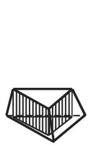  
(b)

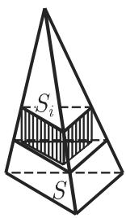  
(c)

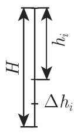  
8.11

a) 将要求的体积 用平面分割成一系列平截头体（图 8.ll(a)): $V = v _ { 1 } + v _ { 2 } +$ $\cdots + v _ { n }$

b) 用体积为 $\tilde { v } _ { i }$ 的棱柱代替相应的平截头体，其高与平截头体相同底面积等千平截头体上底面的面积（图 8.ll(b)）．它们的体积之差是 $v _ { i }$ 的高阶无穷小．

c) 把体积 $\tilde { v } _ { i }$ 表示成 $\tilde { v } _ { i } = S _ { i } \Delta h _ { i }$ ，其中 $h _ { i }$ （图 8.ll(c)) 为棱锥的顶面与顶点间的距离因为 $S _ { i } : S = h _ { i } ^ { 2 } : H ^ { 2 }$ 故 $\tilde { v } _ { i } = \frac { S h _ { i } ^ { 2 } } { H ^ { 2 } } \Delta { h } _ { i }$

d) 计算和的极限

$$
V = \lim _ {n \to \infty} \sum_ {i = 1} ^ {n} \tilde {v} _ {i} = \lim _ {n \to \infty} \sum_ {i = 1} ^ {n} \frac {S h _ {i} ^ {2}}{H ^ {2}} \Delta h _ {i} = \int_ {0} ^ {H} \frac {S h ^ {2}}{H ^ {2}} \mathrm{d} h = \frac {S H}{3}.
$$

8.2.2.2 在几何中应用

1. 平面图形的面积

(1) B, 间曲边梯形的面积（图 8.12{a) 设曲线由显形式方程 $( y = f \left( x \right)$ $a \leqslant x \leqslant b )$ 或参数方程 $\left( x = x \left( t \right) , y = y \left( t \right) , t _ { 1 } \leqslant t \leqslant t _ { 2 } \right)$ 给出，则

$$
S _ {A B C D} = \int_ {a} ^ {b} f (x) \mathrm{d} x = \int_ {t _ {1}} ^ {t _ {2}} y (t) x ^ {\prime} (t) \mathrm{d} t \quad (f (x) \geqslant 0; x (t _ {1}) = a; x (t _ {2}) = b; y (t) \geqslant 0).\tag{8.60a}
$$

(2) G, 间曲边梯形的面积（图 8.12{b) 设曲线巾显形式方程 $( x \ =$ $g \left( y \right) , \alpha \leqslant y \leqslant \beta )$ 或参数方程 $\left( x = x \left( t \right) , y = y \left( t \right) , t _ { 1 } \leqslant t \leqslant t _ { 2 } \right)$ 给出，则

$$
S _ {E F G H} = \int_ {\alpha} ^ {\beta} g (y) \mathrm{d} y = \int_ {t _ {1}} ^ {t _ {2}} x (t) y ^ {\prime} (t) \mathrm{d} t \quad (g (y) \geqslant 0; y (t _ {1}) = \alpha ; y (t _ {2}) = \beta ; x (t) \geqslant 0).\tag{8.60b}
$$

(3) 曲边扇形的面积（图 8.12{c) 曲边扇形以 K,L 间的曲线为边界，并且由极坐标方程 $\left( \rho = \rho \left( \varphi \right) , \varphi _ { 1 } \leqslant \varphi \leqslant \varphi _ { 2 } \right)$ 给出，则

$$
S _ {O K L} = \frac {1}{2} \int_ {\varphi_ {1}} ^ {\varphi_ {2}} \rho^ {2} \mathrm{d} \varphi .\tag{8.60c}
$$

要求更复杂图形的面积，可将原图形化为一些简单图形，或通过线积分（参见第 6848.3) 或二重积分（参见第 694 8.4.1) 计算．

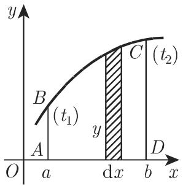  
(a)

  
(b)  
8.12

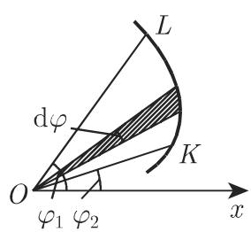  
(c)

2. 平面曲线的弧长

(1) 由显形式 $( y = f \left( x \right)$ 或 $x = g \left( y \right) )$ 或参数形式 $\left( x = x \left( t \right) , y = y \left( t \right) \right)$ ）给出A,B 两点间的曲线弧长 (I) ，可利用如下积分计算：

$$
L _ {\widehat {A B}} = \int_ {a} ^ {b} \sqrt {1 + [ f ^ {\prime} (x) ] ^ {2}} \mathrm{d} x = \int_ {\alpha} ^ {\beta} \sqrt {[ g ^ {\prime} (y) ] ^ {2} + 1} \mathrm{d} y = \int_ {t _ {1}} ^ {t _ {2}} \sqrt {[ x ^ {\prime} (t) ] ^ {2} + [ y ^ {\prime} (t) ] ^ {2}} \mathrm{d} t.\tag{8.61a}
$$

由弧微分 dl ，有

$$
L = \int \mathrm{d} l, \quad \text {其中} \quad \mathrm{d} l ^ {2} = \mathrm{d} x ^ {2} + \mathrm{d} y ^ {2}.\tag{8.61b}
$$

·利用 (8.61a) 计算椭圆的周长：作代换 $x = x \left( t \right) = a \sin t , y = y \left( t \right) = b \cos t$ ，有

$$
L _ {\widehat {A B}} = \int_ {t _ {1}} ^ {t _ {2}} \sqrt {a ^ {2} - (a ^ {2} - b ^ {2}) \sin^ {2} t} \mathrm{d} t = a \int_ {t _ {1}} ^ {t _ {2}} \sqrt {1 - e ^ {2} \sin^ {2} t} \mathrm{d} t,
$$

其中 $e = { \sqrt { a ^ { 2 } - b ^ { 2 } } } / a$ 为椭圆的离心率．

  
(a)

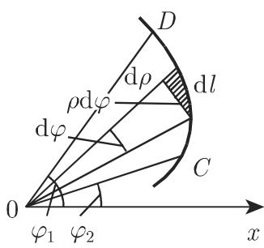  
(b)  
8.13

因为 $x = 0$ 时 $y = b , \ x = a$ 时 $y = 0$ ，所以第一象限的积分限为 $t _ { 1 } = 0$ $t _ { 2 } = \pi / 2$ 故椭圆的周长 $L _ { \widehat { A B } } = 4 a \int _ { \Omega } ^ { \pi / 2 } \sqrt { 1 - e ^ { 2 } \sin ^ { 2 } t } \mathrm { d } t = a E \left( k , \frac { \pi } { 2 } \right)$ ，其中 $k = e$ 积分 $E \left( k , { \frac { \pi } { 2 } } \right)$ 的值可查表 21.9(参见第 653 页 8.1.4.3).

(2) 由极坐标 $\rho = \rho \left( \varphi \right)$ 给出的 C,D 两点间的曲线弧长 (II) （图 8.13(b) ）为

$$
L _ {\widehat {C D}} = \int_ {\varphi_ {1}} ^ {\varphi_ {2}} \sqrt {\rho^ {2} + \left(\frac {\mathrm{d} \rho}{\mathrm{d} \varphi}\right) ^ {2}} \mathrm{d} \varphi .\tag{8.61c}
$$

由弧微分 $\mathrm { d } l ,$ ，有

$$
L = \int \mathrm{d} l, \qquad \text {其中} \qquad \mathrm{d} l ^ {2} = \rho^ {2} \mathrm{d} \varphi^ {2} + \mathrm{d} \rho^ {2}.\tag{8.61d}
$$

3. 旋转体的表面积（也可参见第 673 页的第一古尔丁 (Guldin) 法则）

(1) 函数 $y = f \left( x \right) \geqslant 0$ 的图像绕 轴旋转（图 8.14(a)) 得到的旋转体的表面积为

$$
S = 2 \pi \int_ {a} ^ {b} y \mathrm{d} l = 2 \pi \int_ {a} ^ {b} y (x) \sqrt {1 + \left(\frac {\mathrm{d} y}{\mathrm{d} x}\right) ^ {2}} \mathrm{d} x.\tag{8.62a}
$$

(2) 函数 $x = f \left( y \right) \geqslant 0$ 轴旋转（图 8.14(b)）得到的旋转体的表面积为

$$
S = 2 \pi \int_ {\alpha} ^ {\beta} x \mathrm{d} l = 2 \pi \int_ {\alpha} ^ {\beta} x (y) \sqrt {1 + \left(\frac {\mathrm{d} x}{\mathrm{d} y}\right) ^ {2}} \mathrm{d} y.\tag{8.62b}
$$

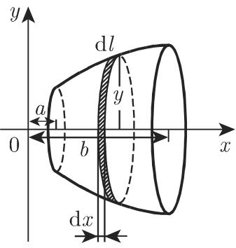  
(a)

  
(b)  
8.14

(3) 要计算更复杂的曲面面积，可利用 699 8.4.1.3 中二重积分的应用以及709 8.5.1.3 中的第一类曲面积分的应用． 700 页的表 8.9（二重积分的应用）给出了利用二重积分求曲面面积的一般计算公式．

4. 体积（也可参见第 673 页的第二古尔丁法则）

(1) 轴旋转的旋转对称体（图 8.14(a) ）的体积为

$$
V = \pi \int_ {a} ^ {b} y ^ {2} \mathrm{d} x.\tag{8.63a}
$$

(2) 轴旋转的旋转对称体（图 8.14(b)）的体积为

$$
V = \pi \int_ {\alpha} ^ {\beta} x ^ {2} \mathrm{d} y.\tag{8.63b}
$$

(3) 截面垂直千 轴，且截面面积为 = f (x) 的立体（图 8.15) 体积为

$$
V = \int_ {a} ^ {b} f (x) \mathrm{d} x.\tag{8.64a}
$$

  
8.15

·计算以原点为中心的旋转椭球体体积．当 $a = c$ 时旋转椭球体 $x ^ { 2 } / a ^ { 2 } + y ^ { 2 } / b ^ { 2 } +$ $z ^ { 2 } / c ^ { 2 } = 1$ （参见第 302 3.5.3.13,2., (3.412) ，以及图 8.16) 由椭圆 $y ^ { 2 } / b ^ { 2 } + z ^ { 2 } / c ^ { 2 } =$ 轴旋转而得到与 $z O x$ 面平行的圆形的横截面面积 $S = f ( y ) = \pi z ^ { 2 } = $ $\pi c ^ { 2 } \left( 1 - y ^ { 2 } / b ^ { 2 } \right)$ ，因此由积分可得椭球体体积 $V ~ = ~ 2 \pi c ^ { 2 } \int _ { 0 } ^ { b } { \left( 1 - y ^ { 2 } / b ^ { 2 } \right) } \mathrm { d } y ~ =$ $( 4 / 3 ) \pi b c ^ { 2 }$

(4) 卡瓦列里 (Cavalieri) 原理 若在区间 $[ a , b ]$ 上除了存在一个横截面积函数 $S = f \left( x \right)$ 外，还有另一个横截面积函数 ${ \overline { { S } } } = { \overline { { f } } } \left( x \right)$ ），且对任意 ，有了 $( x ) = f \left( x \right)$ 则体积 $\overline { V }$ 与（8.64a) 中的体积 V 相等：

$$
\overline {{V}} = \int_ {a} ^ {b} \overline {{f}} (x) \mathrm{d} x = V.\tag{8.64b}
$$

最初的卡瓦列里原理是说：夹在两个平行平面之间的两个立体图形，被平行千这两个平面的任意平面所截，如果所得的两个截面面积相等，则这两个立体图形的体积相等（图 8.17).

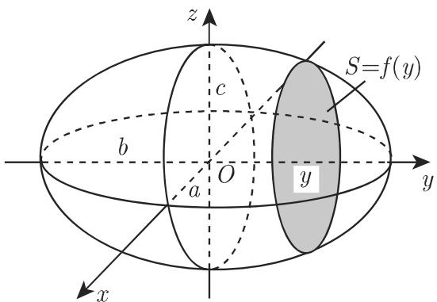  
8.16

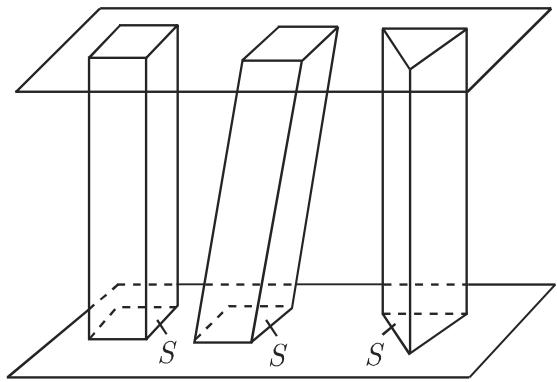  
8.17

(5) 表 表 8.9（参见第 700 页二重积分的应用）和表 8.10（参见第 705 页三重积分的应用）给出了用多重积分来计算体积的一般公式．

8.2.2.3 在力学与物理中应用

1. 一点所走过的距离

设一动点的速度与时间有关， $v = f \left( t \right)$ ，则从 $t _ { 0 }$ 到 $T$ 这段时间该点走过的距离为

$$
s = \int_ {t _ {0}} ^ {T} v \mathrm{d} t.\tag{8.65}
$$

2. 做功

力场中移动一物体时沿运动方向所做的功假设力场方向与运动方向恒定且都是沿 轴方向，若力 $\vec { F }$ 为变力， $\vert \vec { F } \vert = f \left( x \right)$ ，则使物体从点 $x = a$ 轴方向移动到点 $x = b$ 所做的功

$$
W = \int_ {a} ^ {b} f (x) \mathrm{d} x.\tag{8.66}
$$

通常力场的方向与运动方向并不一致，此时功可以利用力与沿给定路径 $\vec { r }$ 在每点的位移的点积的线性积分（参见第 692 (8.130)) 来计算

3. 重力压力与侧压

在地球的重力场下，静止流体的密度为 $\rho ,$ ，重力加速度为 $g ($ （参见第 1368 页的21.2)，重力压力为 $p ,$ ，侧压为 $p _ { s }$ • 在流体表面下方深度为 处（图 8.18)，重力压力为

$$
p = \varrho g x.
$$

  
8.18

(8.67a)

对千侧压 $p _ { s }$ ，比如作用在一个侧开口容器盖板（表面积为 A) 上的侧压（图 8.18) 来自千各个方向的压力 F. 流体表面下方深度 处垂直作用在表而微dA 的压力的微分

$$
\mathrm{d} F = \varrho g x \mathrm{d} A = \varrho g x y (x) \mathrm{d} x.\tag{8.67b}
$$

除以 ，积分得

$$
p _ {s} = \frac {\varrho g}{A} \int_ {h _ {1}} ^ {h _ {2}} x (y _ {2} (x) - y _ {1} (x)) \mathrm{d} x = \varrho g x _ {C}.\tag{8.67c}
$$

函数 $y _ { 1 } \left( x \right)$ 和 $y _ { 2 } \left( x \right)$ 是盖板左右侧边界的函数， $x _ { C }$ 为质心的横坐标（参见下页 5.中平面图形的重心）．

因为侧压与 成比例故盖板的质心通常并不与压力 的着点一致

4. 转动惯量

(1) 圆弧的转动惯量 区间 $[ a , b ]$ 上密度为 $\rho$ 的质地均匀的曲线段 $y = f \left( x \right)$ 关千 $y$ 轴的转动惯量（图 8.19(a) ）为

$$
I _ {y} = \varrho \int_ {a} ^ {b} x ^ {2} \mathrm{d} l = \varrho \int_ {a} ^ {b} x ^ {2} \sqrt {1 + (y ^ {\prime}) ^ {2}} \mathrm{d} x.\tag{8.68}
$$

若密度是关千 的函数 $\rho \left( x \right)$ ，则其解析表达式包含在被积函数中．

  
(a)

  
(b)  
8.19

(2) 平面图形的转动惯量 质地均匀的密度为 $\rho$ 的平面图形关千 $y$ 轴的转动惯量（图 8.19(b) ）为

$$
I _ {y} = \varrho \int_ {a} ^ {b} x ^ {2} y \mathrm{d} x,\tag{8.69}
$$

其中 为平行千 轴的切口图形的长度（也可参见第 700 页表 8.9（二重积分的应用））．若点的密度与它在平面图形的位置有关，则其解析表达式必包含在被积函数中．

  
(a)

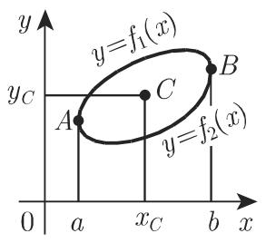  
(b)

  
(c)  
8.20

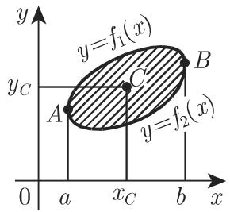  
(d)

．重心与古尔丁法则

(1) 弧段的重心 考虑到 667 页的 (8.61a) ，区间 $[ a , b ]$ 上长为 的质地均匀的平面曲线弧段 $y = f \left( x \right)$ （图 8.20(a) ）的重心 的坐标为

$$
x _ {C} = \frac {\int_ {a} ^ {b} x \sqrt {1 + (y ^ {\prime}) ^ {2}} \mathrm{d} x}{L}, y _ {C} = \frac {\int_ {a} ^ {b} y \sqrt {1 + (y ^ {\prime}) ^ {2}} \mathrm{d} x}{L}.\tag{8.70}
$$

(2) 闭曲线的重心 长为 的闭曲线 $y \ = \ f \left( x \right)$ （图 8.20(b)）上部分方程为$y _ { 1 } = f _ { 1 } \left( x \right)$ ，下部分方程为 $y _ { 2 } = f _ { 2 } \left( x \right)$ ，则其重心 的坐标为

$$
\begin{array}{l} {x _ {C} = \frac {\int_ {a} ^ {b} x (\sqrt {1 + (y _ {1} ^ {\prime}) ^ {2}} + \sqrt {1 + (y _ {2} ^ {\prime}) ^ {2}}) \mathrm{d} x}{L},} \\ {y _ {C} = \frac {\int_ {a} ^ {b} (y _ {1} \sqrt {1 + (y _ {1} ^ {\prime}) ^ {2}} + y _ {2} \sqrt {1 + (y _ {2} ^ {\prime}) ^ {2}}) \mathrm{d} x}{L}.} \end{array}\tag{8.71}
$$

(3) 第一古尔丁法则 设一平面曲线段绕同一平面内且不与之相交的轴旋转，不妨取该轴为 轴，则所得到的旋转体的表面积 $S _ { \mathrm { r o t } }$ 等千曲线段长 乘以与旋转轴距离为 $r _ { C }$ 的重心所画的圆的周长 c:

$$
S _ {\mathrm{rot}} = L \cdot 2 \pi r _ {C}.\tag{8.72}
$$

(4) 曲边梯形的重心 A,B 两点间的曲线段方程为 $y = f \left( x \right)$ ，以该曲线为边界的质地均匀的曲边梯形的面积为 （图 8.20(c)），则该梯形的重心 $C$ 的坐标为

$$
x _ {C} = \frac {\int_ {a} ^ {b} x y \mathrm{d} x}{S}, \quad y _ {C} = \frac {\frac {1}{2} \int_ {a} ^ {b} y ^ {2} \mathrm{d} x}{S}.\tag{8.73}
$$

(5) 任意平面图形的重心 设有面积为 任意平面图形（图 8.20(d) ），其上下曲线段方程分别为 $y _ { 1 } = f _ { 1 } \left( x \right)$ 和 $y _ { 2 } = f _ { 2 } \left( x \right)$ ，则该图形的重心 的坐标为

$$
x _ {C} = \frac {\int_ {a} ^ {b} x (y _ {1} - y _ {2}) \mathrm{d} x}{S}, \quad y _ {C} = \frac {\frac {1}{2} \int_ {a} ^ {b} (y _ {1} ^ {2} - y _ {2} ^ {2}) \mathrm{d} x}{S}.\tag{8.74}
$$

8.9 (700 页二重积分的应用）和表 8.10(705 页三重积分的应用）给出了利用多重积分来计算重心的公式．

(6) 第二古尔丁法则 假设一平面图形绕同一平面内且不与之相交的轴旋转，不妨取该轴为 轴则所得到的旋转体体积等千平面图形的面积 乘以该旋转下重心所画的圆的周长 $2 \pi r _ { C }$

$$
V _ {\mathrm{rot}} = S \cdot 2 \pi r _ {C}.\tag{8.75}
$$
