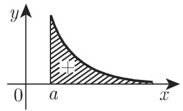
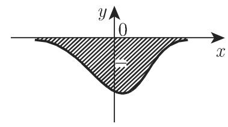
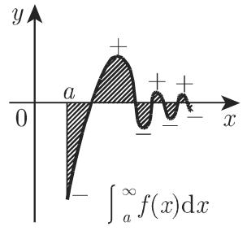
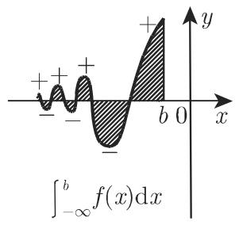
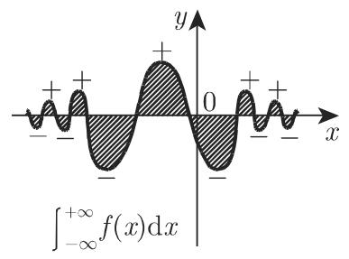
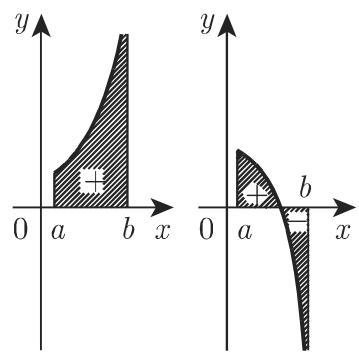
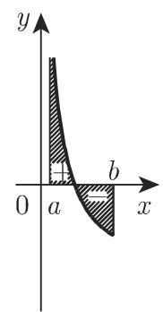
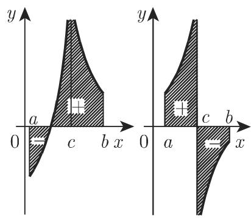

#### 8.2.3 广义积分、斯蒂尔切斯积分与勒贝格积分

8.2.3.1 积分概念的推广

前面已经把定积分作为黎曼积分（参见第 657 8.2.1.1) 介绍了它的概念，当时假设函数 $f \left( x \right)$ 有界，［a,b] 为有限闭区间在黎曼积分的推广中这两个条件都可以放宽，接来下将会提到

1. 广义积分

广义积分把被积函数推广到无界函数或者无限区间下面儿段会讨论无限积分区间的积分和无界被积函数的积分．

2. 一元函数的斯蒂尔切斯积分

设在有限区间 $[ a , b ]$ 上给定两个有限函数 $f \left( x \right)$ 和 $g \left( x \right)$ ．正如黎曼积分一样，把区间 $[ a , b ]$ 划分成一系列子区间，但与黎曼和 (8.38) 不同此处考虑如下形式的和：

$$
\sum_ {i = 1} ^ {n} f (\xi_ {i}) [ g (x _ {i}) - g (x _ {i - 1}) ].\tag{8.76}
$$

若无论如何选取点 $x _ { i }$ 和 $\xi _ { i }$ ，都有当子区间的长度趋千 时极限 (8.76) 存在，则称该极限为定斯蒂尔切斯 (Stieltjes) 积分（也可参见 [8.14], [8.19])

·若 $g \left( x \right) = x$ ，则斯蒂尔切斯积分变成黎曼积分．

3. 勒贝格积分

积分的另一种推广与测度论有关（参见第 905 12.9)，涉及集合的测度、测度空间、可测函数的概念．泛函分析中的勒贝格积分正是以这些概念为基础（参见[8.10]）定义的（参见第 908 12.9.3.2)．相比黎曼积分而言，这种推广可以把积分区域推广到贮的更一般的子集上，把积分区域划分成可测子集．

关千积分的推广还有不同的记号（参见 [8.14]).

8.2.3.2 具有无限积分限的积分

1. 定义

a) 若被积函数的积分区间为闭半轴 $[ a , + \infty )$ ，则该积分可定义为

$$
\int_ {a} ^ {+ \infty} f (x) \mathrm{d} x = \lim _ {B \to \infty} \int_ {a} ^ {B} f (x) \mathrm{d} x.\tag{8.77}
$$

若极限存在，则称该积分为收敛广义积分；若极限不存在，则广义积分 (8.77) 发散．

b) 若函数的定义域为闭半轴 $( - \infty , b ]$ 或整个实数轴 $( - \infty , + \infty )$ , 则可类似地把广义积分定义成

$$
\int_ {- \infty} ^ {b} f (x) \mathrm{d} x = \lim _ {A \to - \infty} \int_ {A} ^ {b} f (x) \mathrm{d} x,\tag{8.78a}
$$

$$
\int_{-\infty}^{+\infty}f(x)\mathrm{d}x = \lim_{\substack{A\to -\infty \\ B\to \infty}}\int_{A}^{B}f(x)\mathrm{d}x.\tag{8.78b}
$$

c) (8.78b) 的上下限 A,B 都趋千无穷且相互独立，若极限 (8.78b) 不存在，但极限

$$
\lim _ {A \to \infty} \int_ {- A} ^ {+ A} f (x) \mathrm{d} x\tag{8.78c}
$$

存在，则极限 (8.78c) 称为广义积分主值或柯西主值．

显然， $\operatorname* { l i m } _ { x \to \infty } f \left( x \right) = 0$ 是积分（8.77) 收敛的必要非充分条件

2. 无穷积分限积分的儿何意义

积分 (8.77), (8.78a), (8.78b) 分别表示图 8.21 所示图形的面积

■ A: $\int _ { 1 } ^ { \infty } { \frac { \mathrm { d } x } { x } } = \operatorname* { l i m } _ { B \to \infty } \int _ { 1 } ^ { B } { \frac { \mathrm { d } x } { x } } = \operatorname* { l i m } _ { B \to \infty } \ln | B | = \infty$ （发散）．

■ B: $\int _ { 2 } ^ { \infty } { \frac { \mathrm { d } x } { x ^ { 2 } } } = \operatorname* { l i m } _ { B \to \infty } \int _ { 2 } ^ { B } { \frac { \mathrm { d } x } { x ^ { 2 } } } = \operatorname* { l i m } _ { B \to \infty } \left( { \frac { 1 } { 2 } } - { \frac { 1 } { B } } \right) = { \frac { 1 } { 2 } } \ ( \| \langle { \underline { { x } } } { \underline { { s } } } \rangle \| ) .$

c: $\int _ { - \infty } ^ { + \infty } { \frac { \mathrm { d } x } { 1 + x ^ { 2 } } } = \operatorname* { l i m } _ { \stackrel { A \to - \infty } { B \to \infty } } \int _ { A } ^ { B } { \frac { \mathrm { d } x } { 1 + x ^ { 2 } } } = \operatorname* { l i m } _ { \stackrel { A \to - \infty } { B \to \infty } } [ \arctan B - \arctan A ] = { \frac { \pi } { 2 } } - \pi \qquad \quad$

$\left( - { \frac { \pi } { 2 } } \right) = \pi$ 收敛）．

  
(a)

  
(b)  
8.21

  
(c)

3. 收敛的充分条件

若直接计算极限 (8.77), (8.78a) (8.78b) 比较复杂，或者只需判断一个广义积分的敛散性，则可利用下面的充分条件之一．此处仅考虑 (8.77)，因为 (8.78a)以用— 代换 ，进一步转换成 (8.77) 的形式：

$$
\int_ {- \infty} ^ {a} f (x) \mathrm{d} x = \int_ {- a} ^ {+ \infty} f (- x) \mathrm{d} x.\tag{8.79}
$$

而积分 (8.78b) 可分解成形如 (8.77) (8.78a) 的两个积分之和：

$$
\int_ {- \infty} ^ {+ \infty} f (x) \mathrm{d} x = \int_ {- \infty} ^ {c} f (x) \mathrm{d} x + \int_ {c} ^ {+ \infty} f (x) \mathrm{d} x,\tag{8.80}
$$

其中 $c$ 为任意实数．

充分条件 在任意无限叮又间 $[ a , + \infty )$ 上都可积，且积分

$$
\int_ {a} ^ {+ \infty} | f (x) | \mathrm{d} x\tag{8.81}
$$

收敛，则积分 (8.77) 也收敛此时称 (8.77) 为绝对收敛，称函数 $f \left( x \right)$ 在半轴$[ a , + \infty )$ 上绝对可积

充分条件 若函数 $f \left( x \right)$ 和 $\varphi \left( x \right)$ 满足

$$
f \left(x\right) > 0,   \varphi \left(x\right) > 0    \text {且当}    a \leqslant x <   + \infty    \text {时}    f \left(x\right) \leqslant \varphi \left(x\right)\tag{8.82a}
$$

叩原文有误． 译者注

则由积分

$$
\int_ {a} ^ {+ \infty} \varphi (x) \mathrm{d} x\tag{8.82b}
$$

收敛可得积分

$$
\int_ {a} ^ {+ \infty} f (x) \mathrm{d} x\tag{8.82c}
$$

收敛反之可由 (8.82c) 发散得 (8.82b) 发散

充分条件 设有代换

$$
\varphi (x) = \frac {1}{x ^ {\alpha}},\tag{8.83a}
$$

当 $a > 0 , \alpha > 1$ 时积分

$$
\int_ {a} ^ {+ \infty} \frac {\mathrm{d} x}{x ^ {\alpha}} = \frac {1}{(\alpha - 1) a ^ {\alpha - 1}} (a > 0, \alpha > 1)\tag{8.83b}
$$

收敛且等千右侧的值，当 $\alpha \leqslant 1$ 时左侧积分发散，可得到进一步的收敛条件：

若当 $a \leqslant x < \infty$ 时函数 $f \left( x \right)$ 为正，且至少存在一个数 $\alpha > 1$ ，使得对任意足够大的 ，都有

$$
f (x) x ^ {\alpha} <   k <   \infty \quad (k > 0 \text {且为常数}),\tag{8.83c}
$$

则积分 (8.77) 收敛；若 $f \left( x \right)$ 为正，且存在一个数 $\alpha \leqslant 1$ ，使得自某个 之后，都有

$$
f (x) x ^ {\alpha} > c > 0 \quad (c > 0 \text {且为常数}),\tag{8.83d}
$$

则积分 (8.77) 发散

■ $\int _ { 0 } ^ { + \infty } \frac { x ^ { 3 / 2 } \mathrm { d } x } { 1 + x ^ { 2 } }$ .取 $\alpha = \frac 1 2$ ，有 ${ \frac { x ^ { 3 / 2 } } { 1 + x ^ { 2 } } } x ^ { 1 / 2 } = { \frac { x ^ { 2 } } { 1 + x ^ { 2 } } }  1$ 故积分发散

4. 广义积分与无穷级数的关系

若 $x _ { 1 } , x _ { 2 } , \cdots , x _ { n } , \cdot \cdot \cdot$ 为任意无限增加的无穷序列，即若

$$
a <   x _ {1} <   x _ {2} <   \dots <   x _ {n} <   \dots , \quad \lim _ {n \rightarrow + \infty} x _ {n} = \infty ,\tag{8.84a}
$$

且当 $a \leqslant x < \infty$ 时函数 $f \left( x \right)$ 为正，则积分 (8.77) 的收敛问题可化成级数

$$
\int_ {a} ^ {x _ {1}} f (x) \mathrm{d} x + \int_ {x _ {1}} ^ {x _ {2}} f (x) \mathrm{d} x + \dots + \int_ {x _ {n - 1}} ^ {x _ {n}} f (x) \mathrm{d} x + \dots\tag{8.84b}
$$

的收敛问题若级数 (8.846) 收敛，则积分 (8.77) 也收敛且等千 (8.846) 的和若级(8.846) 发散，则积分 (8.77) 也发散．因此可以把级数的收敛条件用千广义积分，反之由级数的积分审敛法（参见第 619 7.2.2.4)，可用广义积分来研究无穷级数的收敛性．

8.2.3.3 无界被积函数的积分

1. 定义

(1) 右开区间 设函数 f(x) 的定义域为右开区间 [a,b) ，且在点 其非正常极限 $\operatorname* { l i m } _ { x  b - 0 } f ( x ) = \infty$ ，则可如下定义广义积分：

$$
\int_ {a} ^ {b} f (x) \mathrm{d} x = \lim _ {\varepsilon \rightarrow + 0} \int_ {a} ^ {b - \varepsilon} f (x) \mathrm{d} x.\tag{8.85}
$$

若该极限存在且有限，则广义积分 (8.85) 存在，称其为收敛广义积分；若该极限不存在或为无限，则称其为发散广义积分

(2) 左开区间 设函数 $f \left( x \right)$ 的定义域为左开区间 (a,b]，且在点 $\operatorname* { l i m } _ { x \to a + 0 } f \left( x \right)$ $= \infty$ ，则与 (8.85) 类似可如下定义广义积分：

$$
\int_ {a} ^ {b} f (x) \mathrm{d} x = \lim _ {\varepsilon \rightarrow + 0} \int_ {a + \varepsilon} ^ {b} f (x) \mathrm{d} x.\tag{8.86}
$$

(3) 双半开连续区间 若函数 (x) 除了在区间 $[ a , b ]$ 的内点 $c ( a < c < b )$ 外都有定义也就是函数定义在区间 $[ a , c )$ 和 $( c , b ]$ 上，或者定义在 $[ a , b ]$ 上，但在内点$c$ 处至少有一侧极限为无穷，即 $\operatorname* { l i m } _ { x  c + 0 } f ( x ) = \infty$ 或 $\operatorname* { l i m } _ { x  c - 0 } f ( x ) = \infty .$ ，则广义积分可定义为

$$
\int_ {a} ^ {b} f (x) \mathrm{d} x = \lim _ {\varepsilon \rightarrow + 0} \int_ {a} ^ {c - \varepsilon} f (x) \mathrm{d} x + \lim _ {\delta \rightarrow + 0} \int_ {c + \delta} ^ {b} f (x) \mathrm{d} x.\tag{8.87a}
$$

其中 $\varepsilon$ 和 $\delta$ 彼此独立地趋近千 0. 若极限 (8.87a) 不存在，但是极限

$$
\lim _ {\varepsilon \to + 0} \left\{\int_ {a} ^ {c - \varepsilon} f (x) \mathrm{d} x + \int_ {c + \varepsilon} ^ {b} f (x) \mathrm{d} x \right\}\tag{8.87b}
$$

存在，则 (8.87b) 称为广义积分主值或柯西主值

2. 儿何意义

无界函数 (8.85), (8.86) (8.87a) 的几何意义是求如图 8.22 所示的以一侧垂直渐近线为边界的图形的面积．

  
(a) (8.85)

  
(b) (8.86)  
8.22

  
(c) (8.87a)

A: $\int _ { 0 } ^ { b } { \frac { \mathrm { d } x } { \sqrt { x } } }$ 满足 (8.86) 的情形， $x = 0$ 为奇点

$\int _ { 0 } ^ { b } { \frac { \mathrm { d } x } { \sqrt { x } } } = \operatorname* { l i m } _ { \varepsilon \to + 0 } \int _ { \varepsilon } ^ { b } { \frac { \mathrm { d } x } { \sqrt { x } } } = \operatorname* { l i m } _ { \varepsilon \to + 0 } ( 2 { \sqrt { b } } - 2 { \sqrt { \varepsilon } } ) = 2 { \sqrt { b } }$ （收敛）．

• B: $\int _ { 0 } ^ { \pi / 2 } \tan x \mathrm { d } x$ 满足（8.85) 的情形， $x = { \frac { \pi } { 2 } }$ 为奇点

$$
\begin{array}{r}\int_ {0} ^ {\pi / 2} \tan x \mathrm{d} x = \lim _ {\varepsilon \rightarrow + 0} \int_ {0} ^ {\pi / 2 - \varepsilon} \tan x \mathrm{d} x\\= \lim _ {\varepsilon \rightarrow + 0} \left[ \ln \cos 0 - \ln \cos \left(\frac {\pi}{2} - \varepsilon\right)\right] = \infty\end{array}
$$

■ C: $\int _ { - 1 } ^ { 8 } { \frac { \mathrm { d } x } { \sqrt [ { 3 } ] { x } } }$ 满足 (8.87a) 的情形， x=O 为奇点

$$
\begin{array}{r l} & {{\int_ {- 1} ^ {8} \frac {\mathrm{d} x}{\sqrt [ 3 ]{x}} = \lim _ {\varepsilon \to + 0} \int_ {- 1} ^ {- \varepsilon} \frac {\mathrm{d} x}{\sqrt [ 3 ]{x}} + \lim _ {\delta \to + 0} \int_ {\delta} ^ {8} \frac {\mathrm{d} x}{\sqrt [ 3 ]{x}}}} \\ & {{\qquad = \lim _ {\varepsilon \to + 0} \frac {3}{2} (\varepsilon^ {2 / 3} - 1) + \lim _ {\delta \to + 0} \frac {3}{2} (4 - \delta^ {2 / 3}) = \frac {9}{2} \quad (\mathrm{收敛}).}} \end{array}
$$

D: $\int _ { - 2 } ^ { 2 } { \frac { 2 x \mathrm { d } x } { x ^ { 2 } - 1 } }$ 满足 (8.87a) 的情形， $x = \pm 1$ 为奇点．

$$
\begin{array}{r l}&{{\int_ {- 2} ^ {2} \frac {2 x \mathrm{d} x}{x ^ {2} - 1} = \lim _ {\varepsilon \rightarrow + 0} \int_ {- 2} ^ {- 1 - \varepsilon} + \lim _ {\delta \rightarrow + 0 \atop \nu \rightarrow + 0} \int_ {- 1 + \delta} ^ {1 - \nu} + \lim _ {\gamma \rightarrow + 0} \int_ {1 + \gamma} ^ {2} = \lim _ {\varepsilon \rightarrow + 0} \ln | x ^ {2} - 1 | \Big | _ {- 2} ^ {- 1 - \varepsilon} + \dots}}\\&{{\qquad = \lim _ {\varepsilon \rightarrow + 0} [ \ln | 1 + 2 \varepsilon + \varepsilon^ {2} - 1 | - \ln 3 ] + \dots = \infty \quad (\text {发散}).}}\end{array}
$$

3. 微积分基本定理的应用

(1) 注意在计算形如 (8.87a) 的广义积分时若不考虑区间 [a, b] 中的奇点直接利用公式

$$
\int_ {a} ^ {b} f (x) \mathrm{d} x = F (x) | _ {a} ^ {b}, \quad \text {其中} \quad F ^ {\prime} (x) = f (x)\tag{8.88}
$$

（参见第 667 8.2.2.2, 1.），则会得到错误的结论

E: 例如在例 中尽管 $\int _ { - 2 } ^ { 2 } { \frac { 2 x \mathrm { d } x } { x ^ { 2 } - 1 } }$ 发散，但若形式地使用基本定理则有

$$
\int_ {- 2} ^ {2} \frac {2 x \mathrm{d} x}{x ^ {2} - 1} = \ln | x ^ {2} - 1 | \Bigg | _ {- 2} ^ {2} = \ln 3 - \ln 3 = 0.
$$

(2) 一般法则 仅当 (x) 的原函数在奇点连续时，（8.87a) 才可以使用微积分基本定理

F: 例如在例 中，函数 $\ln \left| x ^ { 2 } - 1 \right|$ 在 $x = \pm 1$ 处不连续，因此条件不成立而在中，函数 $y = \frac { 3 } { 2 } x ^ { 2 / 3 }$ 是区间 $[ a , 0 )$ (O,b］上 $\frac { 1 } { \sqrt [ 3 ] { x } }$ 的一个原函数，且在 $x = 0$ 处连续，因此可利用微积分基本定理：

$$
\int_ {- 1} ^ {8} \frac {\mathrm{d} x}{\sqrt [ 3 ]{x}} = \left. \frac {3}{2} x ^ {2 / 3} \right| _ {- 1} ^ {8} = \frac {3}{2} (8 ^ {2 / 3} - (- 1) ^ {2 / 3}) = \frac {9}{2}.
$$

4. 无界被积函数 $\operatorname* { l i m } _ { x  b - 0 } f ( x ) = \infty$ 广义积分收敛的充分条件

(1) 若广义积分 $\int _ { a } ^ { b } { \vert f ( x ) \vert \mathrm { d } x }$ 收敛，则广义积分 $\int _ { a } ^ { b } f \left( x \right) \mathrm { d } x$ 也收敛，此时称之为绝对收敛积分，称定义区间上的函数 $f \left( x \right)$ 为绝对可积函数．

(2) 若在区间 $[ a , b )$ 上函数 $f \left( x \right)$ 为正，且存在数 $\alpha < 1$ ，使得对与 足够接近的所有 $x ,$ ，都有

$$
f (x) (b - x) ^ {\alpha} <   \infty ,\tag{8.89a}
$$

则积分 (8.87a) 收敛．但是若在区间 $[ a , b )$ 上函数 $f \left( x \right)$ 为正，且存在数 $\alpha > 1$ ,得对与 $b$ 足够接近的 $x ,$ ，有

$$
f (x) (b - x) ^ {\alpha} > c > 0 \quad (c \text {为常数}),\tag{8.89b}
$$

则积分 (8.87a) 发散
