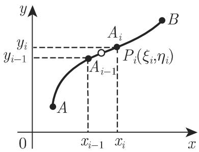
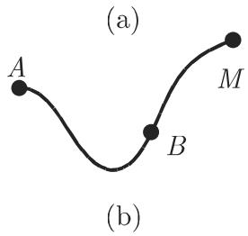
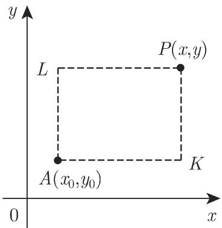

### 8.3 线积分

积分的概念可以按几种不同的方法来推广．正如通常定积分的定义域为数轴上的一个区间，线积分的定义域为一条平面曲线或空间曲线．若积分路径是封闭的曲线则称之为环路积分，它给出了函数沿曲线的循环下面将分第一类线积分、第二类线积分和一般类型的线积分三种情况进行讨论

#### 8.3.1 第一类线积分

8.3.1.1 定义

笫一类线积分或对弧长的积分是满足如下形式的定积分

$$
\int_ {(C)} f (x, y) \mathrm{d} s,\tag{8.106}
$$

其中 $f \left( x , y \right)$ 是定义在一个连通区域的二元函数，其积分在一条已知方程的平面曲线弧 $C \equiv { \widehat { A B } }$ 上进行，称之为积分路径．第一类线积分的值可按如下方法来确定（图 8.24):

  
8.24

(1) 在可求长弧段 $\widehat { A B }$ 上任意插入一点列 $A _ { 1 } , A _ { 2 } , \cdots , A _ { n - 1 }$ ' 其中起点为 $A \equiv$ $A _ { 0 }$ ，终点为 $B \equiv A _ { n }$ ，把 $\widehat { A B }$ 分成 个小弧段

(2) 在每个小弧段 $\widehat { A _ { i - 1 } A _ { i } }$ 的内部或端点任意选择点 $P _ { i }$ 其坐标为（ $( \xi _ { i } , \eta _ { i } )$

(3) 用函数在点 $( \xi _ { i } , \eta _ { i } )$ 的函数值 $f \left( \xi _ { i } , \eta _ { i } \right)$ 乘以弧长 $\widehat { A _ { i - 1 } A _ { i } } = \Delta s _ { i - 1 } , \Delta s _ { i - 1 }$ 为正．（因为弧可求长，故 $\Delta s _ { i - 1 }$ 有限）

(4) 个乘积 $f \left( \xi _ { i } , \eta _ { i } \right) \Delta s _ { i - 1 }$ 相加．

(5) 趋千 $\infty .$ ，每个小曲线弧段的长 $\Delta s _ { i - 1 }$ 趋千 时，计算和

$$
\sum_ {i = 1} ^ {n} f (\xi_ {i}, \eta_ {i}) \Delta s _ {i - 1}\tag{8.107a}
$$

的极限，若无论 $A _ { i }$ 和 $P _ { i }$ 如何选取，（8.107a) 的极限都存在，则该极限称为第一类线积分，函数 $f \left( x , y \right)$ 称为沿曲线 可积：

$$
\int \limits_{(C)}f(x,y)\mathrm{d}s = \lim \limits_{\substack{\Delta s_{i}\to 0\\ n\to \infty}}\sum \limits_{i = 1}^{n}f(\xi_{i},\eta_{i})\Delta s_{i - 1}.\tag{8.107b}
$$

类似地可对积分路径为空间曲线弧段上的三元函数定义笫一类线积分：

$$
\int \limits_{(C)}f(x,y,z)\mathrm{d}s = \lim \limits_{\substack{\Delta s_{i}\to 0\\ n\to \infty}}\sum \limits_{i = 1}^{n}f(\xi_{i},\eta_{i},\zeta_{i})\Delta s_{i - 1}.\tag{8.107c}
$$

8.3.1.2 存在定理

设有一连续曲线弧段 ，且 有连续变化的切线，若函数 $f \left( x , y \right)$ 或 $f \left( x , y , z \right)$ 沿该曲线连续则第一类线积分 (8.107b) (8.107c) 存在，即无论 $A _ { i }$ 和 $P _ { i }$ 如何选取，前面的极限都存在此时称 $f \left( x , y \right)$ 或 $f \left( x , y , z \right)$ 沿该曲线 $C$ 可积

8.3.1.3 笫一类线积分的计算

为了计算第一类线积分，可将其化为定积分．

1. 以参数形式给出的积分路径方程

若积分路径的方程为 $x = x \left( t \right) , y = y \left( t \right)$ ，则

$$
\int_ {(C)} f (x, y) \mathrm{d} s = \int_ {t _ {0}} ^ {T} f [ x (t), y (t) ] \sqrt {[ x ^ {\prime} (t) ] ^ {2} + [ y ^ {\prime} (t) ] ^ {2}} \mathrm{d} t.\tag{8.108a}
$$

当积分路径为空间曲线 $x = x \left( t \right) , y = y \left( t \right) , z = z \left( t \right)$ 时，

$$
\int_ {(C)} f (x, y, z) \mathrm{d} s = \int_ {t _ {0}} ^ {T} f [ x (t), y (t), z (t) ] \sqrt {[ x ^ {\prime} (t) ] ^ {2} + [ y ^ {\prime} (t) ] ^ {2} + [ z ^ {\prime} (t) ] ^ {2}} \mathrm{d} t,\tag{8.108b}
$$

其中 $t _ { 0 }$ 是参数 在点 的值， $T$ 是参数 在点 的值， A,B 的选取应满足 $t _ { 0 } < T$

2. 以显形式 $y = y \left( x \right)$ 给出的积分路径方程

令 $t = x ,$ ，对千平面曲线情形，由 (8.108a)，得

$$
\int_ {(C)} f (x, y) \mathrm{d} s = \int_ {a} ^ {b} f [ x, y (x) ] \sqrt {1 + [ y ^ {\prime} (x) ] ^ {2}} \mathrm{d} x,\tag{8.109a}
$$

对千空间曲线情形，由 (8.108b)，得

$$
\int_ {(C)} f (x, y, z) \mathrm{d} s = \int_ {a} ^ {b} f [ x, y (x), z (x) ] \sqrt {1 + [ y ^ {\prime} (x) ] ^ {2} + [ z ^ {\prime} (x) ] ^ {2}} \mathrm{d} x,\tag{8.109b}
$$

其中 $a , b$ 分别为点 A,B 的横坐标，且必须满足 $a < b .$ 若每个 都对应千曲线段轴投影上的一点即曲线上的每一点由其横坐标唯一确定，则可把 看成一个参数若不满足上述条件，可把曲线段划分成满足该性质的子线段沿整条曲线段的线积分等千沿各个子曲线段的线积分之和．

8.3.1.4 笫一类线积分的应用

8.6 列出了第一类线积分的一些应用．表 8.7 列出了不同坐标系下计算线积分所用的曲线微元 ds.

8.6 第一类线积分

<table><tr><td>曲线段C的长</td><td> $L = \int ds$  $(C)$ </td></tr><tr><td>质地不均匀的曲线段C的质量</td><td> $M = \int \varrho ds \quad (\varrho = f(x, y, z) \text{为密度函数})$  $(C)$ </td></tr><tr><td>重心的坐标</td><td> $x_{C} = \frac{1}{L} \int x \varrho ds, \quad y_{C} = \frac{1}{L} \int y \varrho ds, \quad z_{C} = \frac{1}{L} \int z \varrho ds$  $(C)$ </td></tr><tr><td>平面曲线在xOy面的转动惯量</td><td> $I_{x} = \int x^{2} \varrho ds, \quad I_{y} = \int y^{2} \varrho ds$  $(C)$ </td></tr><tr><td>空间曲线关于坐标轴的转动惯量</td><td> $I_{x} = \int (y^{2} + z^{2}) \varrho ds, \quad I_{y} = \int (x^{2} + z^{2}) \varrho ds,$  $(C)$  $I_{z} = \int (x^{2} + y^{2}) \varrho ds$  $(C)$ </td></tr><tr><td colspan="2">对于质地均匀的曲线,令 $\rho = 1$ </td></tr></table>

8.7 曲线微元

<table><tr><td> $xOy$ 面中的平面曲线</td><td>笛卡儿坐标  $x, y = y(x)$ 极坐标  $\varphi, \rho = \rho(\varphi),$  $x = \rho(\varphi) \cos\varphi, y = \rho(\varphi) \sin\varphi$ 笛卡儿坐标系下的参数形式 $x = x(t), y = y(t)$ </td><td> $ds = \sqrt{1 + [y'(x)]^2} dx$  $ds = \sqrt{\rho^2(\varphi) + [\rho'(\varphi)]^2} d\varphi$  $ds = \sqrt{[x'(t)]^2 + [y'(t)]^2} dt$ </td></tr><tr><td>空间曲线</td><td>笛卡儿坐标系下的参数形式 $x = x(t), y = y(t), z = z(t)$ </td><td> $ds = \sqrt{[x'(t)]^2 + [y'(t)]^2 + [z'(t)]^2} dt$ </td></tr></table>

#### 8.3.2 第二类线积分

8.3.2.1 定义

笫二类线积分或投影积分，如在 轴、 轴或 轴上的投影积分，是如下形式的定积分

$$
\int_ {(C)} f (x, y) \mathrm{d} x\tag{8.110a}
$$

或

$$
\int_ {(C)} f (x, y, z) \mathrm{d} x,\tag{8.110b}
$$

其中 $f \left( x , y \right)$ 或 $f \left( x , y , z \right)$ 是定义在一连通区域上的二元或三元函数，使其对平面曲线或空间曲线 $C \equiv \overset { \cdot } { A } \overset { \cdot } { B }$ 轴、 轴或 轴上的投影进行积分，且积分路径也位千该连通区域中．第二类线积分的确定方法与第一类线积分类似，但是在第中并不是用函数 $f \left( \xi _ { i } , \eta _ { i } \right)$ 或 $f \left( \xi _ { i } , \eta _ { i } , \varsigma _ { i } \right)$ 乘以小曲线段 $\widehat { A _ { i - 1 } A _ { i } }$ 的弧长，而是乘以小曲线段在坐标轴上的投影（图 8.25).

  
8.25

1. 轴上的投影

$$
\widehat {\operatorname * {P r} _ {x} A _ {i - 1} A _ {i}} = x _ {i} - x _ {i - 1},\tag{8.111}
$$

有

$$
\int \limits_{(C)}f(x,y)\mathrm{d}x = \lim \limits_{\substack{\Delta x_{i - 1}\to 0\\ n\to \infty}}\sum \limits_{i = 1}^{n}f(\xi_{i},\eta_{i})\Delta x_{i - 1},\tag{8.112a}
$$

$$
\int \limits_{(C)}f(x,y,z)\mathrm{d}x = \lim_{\substack{\Delta x_{i - 1}\to 0\\ n\to \infty}}\sum \limits_{i = 1}^{n}f(\xi_{i},\eta_{i},\zeta_{i})\Delta x_{i - 1}.\tag{8.112b}
$$

．在 轴上的投影

$$
\int \limsupits_{\substack{y_{i - 1}\to 0\\ n\to \infty}}\sum \limsupits_{i = 1}^{n}f(\xi_{i},\eta_{i})\Delta y_{i - 1},\tag{8.113a}
$$

$$
\int \limits_{(C)}f(x,y,z)\mathrm{d}y = \lim_{\substack{\Delta y_{i - 1}\to 0\\ n\to \infty}}\sum \limits_{i = 1}^{n}f(\xi_{i},\eta_{i},\zeta_{i})\Delta y_{i - 1}.\tag{8.113b}
$$

．在 轴上的投影

$$
\int \limits_{(C)}f(x,y,z)\mathrm{d}z = \lim_{\substack{\Delta z_{i - 1}\to 0\\ n\to \infty}}\sum \limits_{i = 1}^{n}f(\xi_{i},\eta_{i},\zeta_{i})  \Delta z_{i - 1}.\tag{8.114}
$$

8.3.2.2 存在定理

若函数 $f \left( x , y \right) , f \left( x , y , z \right)$ 及曲线沿线段 连续，且曲线有连续变化的切线，则形如 (8.112a), (8.113a), (8.1126), (8.1136) (8.114) 的第二类线积分存在．

8.3.2.3 笫二类线积分的计算

为了计算第二类线积分，可将其化为定积分．

1. 以参数形式给出的积分路径

若积分路径的参数方程为

$$
x = x (t), \quad y = y (t), \quad (\text {对空间曲线}, \text {还有}) z = z (t),\tag{8.115}
$$

则有下面的公式

(8.112a) ，有 $\int _ { ( C ) } f ( x , y ) \mathrm { d } x = \int _ { t _ { 0 } } ^ { T } f [ x ( t ) , y ( t ) ] x ^ { \prime } ( t ) \mathrm { d } t .$

(8.116a)

(8.113a) ，有 $\int _ { ( C ) } f ( x , y ) \mathrm { d } y = \int _ { t _ { 0 } } ^ { T } f [ x ( t ) , y ( t ) ] y ^ { \prime } ( t ) \mathrm { d } t .$

(8.1166)

(8.1126) ，有 $\int _ { ( C ) } f ( x , y , z ) \mathrm { d } x = \int _ { t _ { 0 } } ^ { T } f [ x ( t ) , y ( t ) , z ( t ) ] x ^ { \prime } ( t ) \mathrm { d } t .$

(8.116c)

(8.1136) ，有 $\int _ { ( C ) } f ( x , y , z ) \mathrm { d } y = \int _ { t _ { 0 } } ^ { T } f [ x ( t ) , y ( t ) , z ( t ) ] y ^ { \prime } ( t ) \mathrm { d } t .$

(8.116d)

$$
\text {对} (8. 1 1 4), \text {有} \int_ {(C)} f (x, y, z) \mathrm{d} z = \int_ {t _ {0}} ^ {T} f [ x (t), y (t), z (t) ] z ^ {\prime} (t) \mathrm{d} t.\tag{8.116e}
$$

其中 $t _ { 0 }$ 和 分别是参数 在弧段的起点 和终点 处的值．与第一类线积分不同，此处不再要求不等式 $t _ { 0 } < T$

若积分路径反向，即点 换位，则积分变号．

2. 以显形式给出的积分路径

在平面曲线或空间曲线中，积分路径方程为

$$
y = y (x) \quad {\text {或}} \quad y = y (x), z = z (x),\tag{8.117}
$$

其中 a,b 分别为点 A,B 的横坐标，但不必满足条件 $a \ < \ b ,$ 横坐标 取代了$( 8 . 1 1 2 \mathrm { a } ) \sim ( 8 . 1 1 4 )$ 中参数 t.

#### 8.3.3 一般类型的线积分

8.3.3.1 定义

一般类型的线积分是沿一条曲线所有投影的第二类线积分之和．设沿已知曲线给出两个二元函数 $P \left( x , y \right)$ 和 $Q \left( x , y \right)$ ，或三个三元函数 $P \left( x , y , z \right) , Q \left( x , y , z \right)$ 和$R \left( x , y , z \right)$ ，且相应的第二类线积分存在，则对平面曲线或空间曲线，下面公式成立．

1. 平面曲线

$$
\int_ {(C)} (P \mathrm{d} x + Q \mathrm{d} y) = \int_ {(C)} P \mathrm{d} x + \int_ {(C)} Q \mathrm{d} y.\tag{8.118a}
$$

2. 空间曲线

$$
\int_ {(C)} (P \mathrm{d} x + Q \mathrm{d} y + R \mathrm{d} z) = \int_ {(C)} P \mathrm{d} x + \int_ {(C)} Q \mathrm{d} y + \int_ {(C)} R \mathrm{d} z.\tag{8.118b}
$$

在向量分析一章（参见第 938 13.3.1.1) 将会讨论一般类型线积分的向量表示及其在力学中的应用

8.3.3.2 一般类型线积分的性质

1. 积分路径的分解

用曲线 $\widehat { A B }$ 上的一点 甚至是 $\widehat { A B }$ 外一点 （图 8.26) ，可以把积分分解成两部分：

$$
\int_ {\widehat {A B}} (P \mathrm{d} x + Q \mathrm{d} y) = \int_ {\widehat {A M}} (P \mathrm{d} x + Q \mathrm{d} y) + \int_ {\widehat {M B}} (P \mathrm{d} x + Q \mathrm{d} y) ^ {\textcircled {1}}\tag{8.119}
$$

  
8.26

2. 积分路径反向

积分变号：

$$
\int_ {\widehat {A B}} (P \mathrm{d} x + Q \mathrm{d} y) = - \int_ {\widehat {B A}} (P \mathrm{d} x + Q \mathrm{d} y). ^ {(1)}\tag{8.120}
$$

3. 路径的相关性

一般地线积分的值不仅与起点有关还和积分路径有关（图 8.27):

$$
\int_ {\widehat {A M B}} (P \mathrm{d} x + Q \mathrm{d} y) \neq \int_ {\widehat {A D B}} (P \mathrm{d} x + Q \mathrm{d} y) ^ {\textcircled {2}}\tag{8.121}
$$

  
8.27

■ A: $I = \int _ { ( C ) } \left( x y \mathrm { d } x + y z \mathrm { d } y + z x \mathrm { d } z \right)$ ，其中 为螺旋线 $x = a \cos t , y = a \sin t , z =$ bt（参见第 348 页螺旋线）从 $t _ { 0 } = 0$ 到 $T = 2 \pi$ 的一圈：

$$
I = \int_ {0} ^ {2 \pi} (- a ^ {3} \sin^ {2} t \cos t + a ^ {2} b t \sin t \cos t + a b ^ {2} t \cos t) \mathrm{d} t = - \frac {\pi a ^ {2} b}{2}.
$$

■ B: $I = \int _ { ( C ) } \left[ y ^ { 2 } \mathrm { d } x + \left( x y - x ^ { 2 } \right) \mathrm { d } y \right]$ ，其中 为抛物线 $y ^ { 2 } = 9 x$ 上位千点 (0, 0)和 $B \left( 1 , 3 \right)$ 间的弧段：

$$
I = \int_ {0} ^ {3} \left[ \frac {2}{9} y ^ {3} + \left(\frac {y ^ {3}}{9} - \frac {y ^ {4}}{8 1}\right) \right] \mathrm{d} y = 6 \frac {3}{2 0}.
$$

也对三元函数有类似公式成立．

＠同CD.

8.3.3.3 沿闭曲线的积分

(1) 沿闭曲线积分的概念 环路积分也称为沿曲线的围道积分，它是沿闭合的积分路径 的线积分，即积分路径的起点 和终点 相同，通常记为

$$
\oint_ {(C)} (P \mathrm{d} x + Q \mathrm{d} y) \qquad {\text {或}} \qquad \oint_ {(C)} (P \mathrm{d} x + Q \mathrm{d} y + R \mathrm{d} z).\tag{8.122}
$$

一般而言该积分不等千 ，但是如它满足 (8.127) 中的条件或者积分在一个守恒场中进行（参见第 941 13.3.1.6) ，积分值等千 0. （也可参见第 941 13.3.1.6 中的零值围道积分）

(2) 平面图形面积 的计算 是应用沿闭曲线积分的典型例子，形式如下：

$$
S = \frac {1}{2} \oint_ {(C)} (x \mathrm{d} y - y \mathrm{d} x),\tag{8.123}
$$

其中 为平面图形的边界曲线若积分路径逆时针方向，则积分为正

#### 8.3.4 线积分与积分路径无关

线积分与积分路径无关的条件也称为全微分的可积性．

8.3.4.1 二维情况

设P和 $Q$ 是定义在单连通区域上的连续函数，若积分

$$
\int_ {(C)} [ P (x, y) \mathrm{d} x + Q (x, y) \mathrm{d} y ]\tag{8.124}
$$

仅与积分路径的起点 和终点 有关，而与连接这两点的曲线无关，即对任意 A,及积分路径 ACB $A D B$ （图 8.27) ，都有等式

$$
\int_ {\widehat {A C B}} (P \mathrm{d} x + Q \mathrm{d} y) = \int_ {\widehat {A D B}} (P \mathrm{d} x + Q \mathrm{d} y),\tag{8.125}
$$

以上成立的充分必要条件为存在二元函数 $U \left( x , y \right)$ ，其全微分是线积分的被积函数：

$$
P \mathrm{d} x + Q \mathrm{d} y = \mathrm{d} U,\tag{8.126a}
$$

即

$$
P = \frac {\partial U}{\partial x}, \qquad Q = \frac {\partial U}{\partial y}.\tag{8.126b}
$$

函数 $U \left( x , y \right)$ 是全微分 (8.126a) 的原函数．在物理学中，原函数 $U \left( x , y \right)$ 是向量场的势能（参见第 941 13.3.1.6,4.).

8.3.4.2 原函数的存在性

原函数存在的充分必要条件，即表达式 $P { \mathrm { d } } x + Q { \mathrm { d } } y$ 可积的充要条件为偏导数

$$
\frac {\partial P}{\partial y} = \frac {\partial Q}{\partial x},\tag{8.127}
$$

且偏导数连续

8.3.4.3 三维情况

与二维的情况类似积分

$$
\int [ P (x, y, z) \mathrm{d} x + Q (x, y, z) \mathrm{d} y + R (x, y, z) \mathrm{d} z ]\tag{8.128}
$$

与积分路径无关的条件是：存在原函数 $U \left( x , y , z \right)$ ，满足

$$
P \mathrm{d} x + Q \mathrm{d} y + R \mathrm{d} z = \mathrm{d} U,\tag{8.129a}
$$

即

$$
P = \frac {\partial U}{\partial x}, \quad Q = \frac {\partial U}{\partial y}, \quad R = \frac {\partial U}{\partial z}.\tag{8.129b}
$$

可积条件是若偏导数连续，则它们同时满足如下三个方程

$$
\frac {\partial Q}{\partial z} = \frac {\partial R}{\partial y}, \quad \frac {\partial R}{\partial x} = \frac {\partial P}{\partial z}, \quad \frac {\partial P}{\partial y} = \frac {\partial Q}{\partial x}.\tag{8.129c}
$$

·功 $W$ （参见第 670 8.2.2.3, 2. ）可定义为 $\vec { F } \left( \vec { r } \right)$ 与位移 $\vec { s }$ 的点积在守恒场中功仅与位置 $\vec { r }$ 有关而与速度 $\vec { v }$ 无关设 ${ \vec { F } } = P { \vec { e } } _ { x } + Q { \vec { e } } _ { y } + R { \vec { e } } _ { z } = \mathrm { g r a d } V$ $\mathrm { d } \vec { s } = \mathrm { d } x \vec { e } _ { x } + \mathrm { d } y \vec { e } _ { y } + \mathrm { d } z \vec { e } _ { x }$ ，则势能 $V \left( \vec { r } \right)$ 门满足关系 (8.129a) (8.129b) ，且有等式(8.129c) 成立．功与点 $P _ { 1 }$ 和 $P _ { 2 }$ 间的积分路径无关：

$$
W = \int_ {P _ {1}} ^ {P _ {2}} \vec {F} (\vec {r}) \cdot \mathrm{d} \vec {s} = \int_ {P _ {1}} ^ {P _ {2}} [ P \mathrm{d} x + Q \mathrm{d} y + R \mathrm{d} z ] = V (P _ {2}) - V (P _ {1}).\tag{8.130}
$$

8.3.4.4 原函数的确定

1. 二维情况（图 8.28)

若满足可积条件 (8.127)，则在 (8.127) 成立的区域内，沿着连接任意固定点$A \left( x _ { 0 } , y _ { 0 } \right)$ 和动点 $P \left( x , y \right)$ 的积分路径，都有原函数 $U \left( x , y \right)$ 等千线积分

$$
U = \int_ {\widehat {A P}} (P \mathrm{d} x + Q \mathrm{d} y).\tag{8.131}
$$

事实上，为方便起见，可在 (8.127) 成立的区域内选择平行千坐标轴的积分路径，即折线 $A K P$ 或 $A L P$ ，故此存在两个计算原函数和全微分的公式：

$$
U = U (x _ {0}, y _ {0}) + \int_ {\overline {{A K}}} + \int_ {\overline {{K P}}} = C + \int_ {x _ {0}} ^ {x} P (\xi , y _ {0}) \mathrm{d} \xi + \int_ {y _ {0}} ^ {y} Q (x, \eta) \mathrm{d} \eta ,\tag{8.132a}
$$

$$
U = U (x _ {0}, y _ {0}) + \int_ {\overline {{A L}}} + \int_ {\overline {{L P}}} = C + \int_ {y _ {0}} ^ {y} Q (x _ {0}, \eta) \mathrm{d} \eta + \int_ {x _ {0}} ^ {x} P (\xi , y) \mathrm{d} \xi ,\tag{8.132b}
$$

其中 为任意常数．

．三维情况（图 8.29)

若满足条件 (8.129c)，由积分路径 AKLP，可得原函数计算公式：

$$
\begin{array}{l} {U = U (x _ {0}, y _ {0}, z _ {0}) + \int_ {\overline {{A K}}} + \int_ {\overline {{K L}}} + \int_ {\overline {{L P}}}} \\ {= \int_ {x _ {0}} ^ {x} P (\xi , y _ {0}, z _ {0}) \mathrm{d} \xi + \int_ {y _ {0}} ^ {y} Q (x, \eta , z _ {0}) \mathrm{d} \eta + \int_ {z _ {0}} ^ {z} R (x, y, \xi) \mathrm{d} \xi + C} \end{array}
$$

(C 为任意常数）．

(8.133)

沿着平行坐标轴的方向还有其他 条可能的积分路径，由此又可进一步得到公式

  
8.28

  
8.29

■ A: $P \mathrm { d } x + Q \mathrm { d } y = - { \frac { y \mathrm { d } x } { x ^ { 2 } + y ^ { 2 } } } + { \frac { x \mathrm { d } y } { x ^ { 2 } + y ^ { 2 } } }$ ．满足条件 (8.129c): $\frac { \partial P } { \partial y } = \frac { \partial Q } { \partial x } =$ $\frac { y ^ { 2 } - x ^ { 2 } } { \left( x ^ { 2 } + y ^ { 2 } \right) ^ { 2 } }$ 利用 (8.132b) ，令 $x _ { 0 } = 0 , ~ y _ { 0 } = 1$ （因为函数 在点 (0,0) 不连续，故不选 $x _ { 0 } = 0 , ~ y _ { 0 } = 0 )$ ，得

$$
U = \int_ {1} ^ {y} {\frac {0 \cdot \mathrm{d} \eta}{0 ^ {2} + \eta^ {2}}} + \int_ {0} ^ {x} {\frac {- y \mathrm{d} \xi}{\xi^ {2} + y ^ {2}}} + U (0, 1) = - \arctan {\frac {x}{y}} + C = \arctan {\frac {y}{x}} + C _ {1}.
$$

B: $P { \mathrm { d } } x + Q { \mathrm { d } } y + R { \mathrm { d } } z = z \left( { \frac { 1 } { x ^ { 2 } y } } - { \frac { 1 } { x ^ { 2 } + z ^ { 2 } } } \right) { \mathrm { d } } x + { \frac { z } { x y ^ { 2 } } } { \mathrm { d } } y + \left( { \frac { x } { x ^ { 2 } + z ^ { 2 } } } - { \frac { 1 } { x y } } \right) { \mathrm { d } } z .$ 满足条件 (8.129c) ，利用 (8.133) ，令 $x _ { 0 } = 1 , y _ { 0 } = 1 , z _ { 0 } = 0$ ，得

$$
U = \int_ {1} ^ {x} 0 \cdot \mathrm{d} \xi + \int_ {1} ^ {y} 0 \cdot \mathrm{d} \eta + \int_ {0} ^ {z} \left(\frac {x}{x ^ {2} + \zeta^ {2}} - \frac {1}{x y}\right) \mathrm{d} \zeta + C = \arctan \frac {z}{x} - \frac {z}{x y} + C.
$$

8.3.4.5 沿闭曲线的零值积分

若积分曲线为一闭曲线，（8.127) 成立，且该闭曲线内部不含使 $P , Q , { \frac { \partial P } { \partial y } } , { \frac { \partial Q } { \partial x } }$

不连续或没定义的点则 $P { \mathrm { d } } x + Q { \mathrm { d } } y$ 的线积分为 0.

当不满足上述条件时积分值也可等千 ，但是这个值只能是进行相应计算后得到的．
