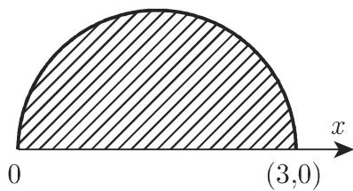
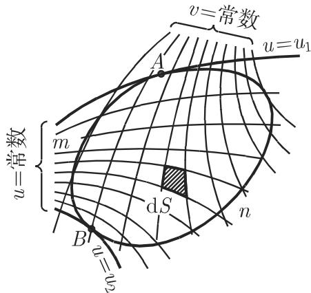
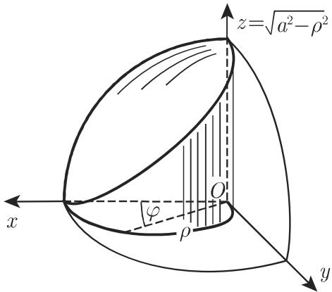

### 8.4 多重积分

可以把积分的概念推广到更高维，若积分区域为空间平面或曲面上的一个区域，则称之为曲面积分；若积分区域为一部分空间，则称之为体积积分．此外，在各种特殊的应用中，也采用其他特殊的记号

#### 8.4.1 二重积分

8.4.1.1 二重积分的概念

1. 定义

  
8.30

二元函数 $u = f \left( x , y \right)$ 在 $x O y$ 面内平面区域 上的二重积分记为

$$
\int_ {S} f (x, y) \mathrm{d} S = \iint_ {S} f (x, y) \mathrm{d} y \mathrm{d} x.\tag{8.134}
$$

若二重积分存在，则它是一个数，且可按下面方法来定义（图 8.30):

(1) 将区域 划分成 个小区域 $\Delta S _ { i }$

(2) 在每个小区域的内部或边界任取一点 $P _ { i } \left( x _ { i } , y _ { i } \right)$

(3) 用函数在点 $P _ { i } \left( x _ { i } , y _ { i } \right)$ 的值 $u = f \left( x _ { i } , y _ { i } \right)$ 乘以相应小区域的面积 $\Delta S _ { i }$

(4) 所有乘积 $f \left( x _ { i } , y _ { i } \right) \Delta S _ { i }$ 作和．

(5) 当每个小区域的直径趋千 0, $\Delta S _ { i } \longrightarrow 0 , n \longrightarrow \infty$ 时计算和式

$$
\sum_ {i = 1} ^ {n} f (x _ {i}, y _ {i}) \Delta S _ {i}\tag{8.135a}
$$

的极限．（点集的直径是指集合中任意两点间距离的上确界）此处仅要求 $\Delta S  0$ 还远远不够，比如对矩形而言，若一边足够小，另一边不作要求，便能满足面积趋千，但所考虑的点可能彼此相距甚远若该极限与区域 划成小区域的分法无关与点 $P _ { i } \left( x _ { i } , y _ { i } \right)$ 的取法也无关，即极限存在，则称其为函数 $u = f \left( x , y \right)$ 在积分区域上的二重积分，记为

$$
\int_ {S} f (x, y) \mathrm{d} S = \lim _ {\Delta S _ {i} \to 0 \atop n \to \infty} \sum_ {i = 1} ^ {n} f (x _ {i}, y _ {i}) \Delta S _ {i}.\tag{8.135b}
$$

2. 存在定理

若函数 $f \left( x , y \right)$ 在包含着边界的积分区域上连续，则二重积分 (8.135b) 存在．（连续是积分存在的充分非必要条件．）

3. 儿何意义

二重积分的儿何意义是以 $x O y$ 面内的区域为底，以母线平行千 轴的柱面为侧面且以 $u = f \left( x , y \right)$ 为有界上顶面的立体的体积（图 8.31)．和式 (8.135b) 中的每一项 $P _ { i } \left( x _ { i } , y _ { i } \right) \Delta S _ { i }$ 都对应着以 $\Delta S _ { i }$ 为底，以 $f \left( x _ { i } , y _ { i } \right)$ 为高的小柱体的体积．体积符号的正负依曲面 $u = f \left( x , y \right)$ 在 $x O y$ 的上方或下方而定．若曲面与 $x O y$ 面相交，则所求体积为正负部分的代数和

  
8.31

若函数值恒为 $1 ( f \left( x , y \right) \equiv 1 )$ ，则该体积在数值上等千 $x O y$ 面内区域面积

8.4.1.2 二重积分的计算

可以把二重积分的计算化成累次积分的计算，即相继计算两个积分．

1. 笛卡儿坐标系下的计算

若二重积分存在，可以把积分区域划分成任何类型，如小矩形．在用坐标线把积分区域化成无限小的矩形后（图 8.32(a)），可先沿小矩形的每个垂直边再沿水平边计算所有微分 $f \left( x , y \right)$ dS 的和．（内和为关千变量 的积分近似和，外和为关千的积分近似和．）若被积函数连续，则该区域上的累次积分等千二重积分，其解析记号为

$$
\int_ {S} f (x, y) \mathrm{d} S = \int_ {a} ^ {b} \left[ \int_ {\varphi_ {1} (x)} ^ {\varphi_ {2} (x)} f (x, y) \mathrm{d} y \right] \mathrm{d} x = \int_ {a} ^ {b} \int_ {\varphi_ {1} (x)} ^ {\varphi_ {2} (x)} f (x, y) \mathrm{d} y \mathrm{d} x,\tag{8.136a}
$$

其中 $y = \varphi _ { 2 } \left( x \right)$ 和 $y = \varphi _ { 1 } \left( x \right)$ 分别为区域 上、下边界曲线 $( \widehat { A B } )$ 肛和 $( \widehat { A B } ) _ { \ F }$ 的方程 $( \varphi _ { 1 } \leqslant \varphi _ { 2 }$ ，且 $\varphi _ { 1 } , \varphi _ { 2 }$ 连续）， 分别为曲线最左边和最右边点的横坐标．笛卡儿坐标系下的面积微元

$$
\mathrm{d} S = \mathrm{d} x \mathrm{d} y.\tag{8.136b}
$$

  
(a)

  
(b)  
8.32

  
8.33

  
8.34

（小矩形的面积等千 $\Delta x \Delta y ,$ 与 $x$ 的值无关）进行第一重积分时把 $x$ 看成常数，根据记号，内积分指的是内部的积分变量，外积分指的是外部的积分变量，所以(8.136a) 中的方括号可以省略在 (8.136a) 中，微分号 dx dy 位千被积函数的后面，通常也可以将其放在相应积分号的右边被积函数的前面和也可逆向进行（图 8.32(b)），若被积函数连续，其结果为以下二重积分：

$$
\int_ {S} f (x, y) \mathrm{d} S = \int_ {\alpha} ^ {\beta} \int_ {\psi_ {1} (y)} ^ {\psi_ {2} (y)} f (x, y) \mathrm{d} x \mathrm{d} y.\tag{8.136c}
$$

·计算 $A = \int _ { S } x y ^ { 2 } \mathrm { d } S$ 其中 是由抛物线 $y = x ^ { 2 }$ 和直线 $y = 2 x$ 围成的平面区域（图 8.33).

$$
A = \int_ {0} ^ {2} \int_ {x ^ {2}} ^ {2 x} x y ^ {2} \mathrm{d} y \mathrm{d} x = \int_ {0} ^ {2} x \mathrm{d} x \left[ \frac {y ^ {3}}{3} \right] _ {x ^ {2}} ^ {2 x} = \frac {1}{3} \int_ {0} ^ {2} (8 x ^ {4} - x ^ {7}) \mathrm{d} x = \frac {3 2}{5}
$$

或

$$
A = \int_ {0} ^ {4} \int_ {y / 2} ^ {\sqrt {y}} x y ^ {2} \mathrm{d} x \mathrm{d} y = \int_ {0} ^ {2} y ^ {2} \mathrm{d} y \left[ \frac {x ^ {2}}{2} \right] _ {y / 2} ^ {\sqrt {y}} = \frac {1}{2} \int_ {0} ^ {4} y ^ {2} \left(y - \frac {y ^ {2}}{4}\right) \mathrm{d} y = \frac {3 2}{5}.
$$

2. 极坐标系下的计算

用坐标线把积分区域分成若干个小区域，每个小区域均以从极点出发的两个同心圆和两条射线为边界（图 8.34)．极坐标系下小区域的面积具有形式

$$
\mathrm{d} S = \rho \mathrm{d} \rho \mathrm{d} \varphi .\tag{8.137a}
$$

（对千 $\Delta \rho$ 和 $\Delta \varphi$ 相同的小区域，显然离原点越近面积越小，离原点越远面积越大．）若被积函数的极坐标方程为 $w = f \left( \rho , \varphi \right)$ ，则可先沿小扇区再把所有扇区求和：

$$
\int_ {S} f (\rho , \varphi) \mathrm{d} S = \int_ {\varphi_ {1}} ^ {\varphi_ {2}} \int_ {\rho_ {1} (\varphi)} ^ {\rho_ {2} (\varphi)} f (\rho , \varphi) \rho \mathrm{d} \rho \mathrm{d} \varphi ,\tag{8.137b}
$$

其中 $\rho = \rho _ { 1 } \left( \varphi \right)$ 和 $\rho = \rho _ { 2 } \left( \varphi \right)$ 分别为平面区域 的内外边界曲线 $\widehat { ( A m B ) }$ 和$\widehat { ( A n B ) }$ 的方程， $\varphi _ { 1 }$ 和 $\varphi _ { 2 }$ 分别为区域中点的极角的下确界和上确界，很少先对极角再对极径积分．

·计算特殊积分 $A = \int _ { S } \rho \sin ^ { 2 } \varphi \mathrm { d } S ,$ , 为半圆面 $\rho = 3 \cos \varphi ( 0 \leqslant \varphi \leqslant \pi / 2 )$ （图 8.35):

$$
\begin{array}{r l} & A = \int_ {0} ^ {\pi / 2} \int_ {0} ^ {3 \cos \varphi} \rho^ {2} \sin^ {2} \varphi \mathrm{d} \rho \mathrm{d} \varphi = \int_ {0} ^ {\pi / 2} \sin^ {2} \varphi \mathrm{d} \varphi \left[ \frac {\rho^ {3}}{3} \right] _ {0} ^ {3 \cos \varphi} \\ & \qquad = 9 \int_ {0} ^ {\pi / 2} \sin^ {2} \varphi \cos^ {3} \varphi \mathrm{d} \varphi = \frac {6}{5}. \end{array}
$$

  
8.35

3. 任意曲线坐标系 u,v 下的计算

坐标定义如下：

$$
x = x (u, v), \quad y = y (u, v)\tag{8.138}
$$

（参见第 350 3.6.3.1)．若坐标线 ＝常数和 v= 常数把积分区域分成了一系列无穷小平面微元（图 8.36)，且被积函数可以表示成 u,v 的函数，则可先沿小条形区域（如沿 $v = \frac { \nu \mu } { \mathrm { H } } \divideontimes$ 再把所有条形区域求和：

$$
\int_ {S} f (u, v) \mathrm{d} S = \int_ {u _ {1}} ^ {u _ {2}} \int_ {v _ {1} (u)} ^ {v _ {2} (u)} f (u, v) | D | \mathrm{d} v \mathrm{d} u,\tag{8.139}
$$

  
8.36

其中 $v = v _ { 1 } \left( u \right)$ 和 $v = v _ { 2 } \left( u \right)$ 分别为平面区域 $S$ 的边界曲线 $\widehat { ( A m B ) }$ 和 $\widehat { ( A n B ) }$ 的方程， $u _ { 1 }$ 和 $u _ { 2 }$ 分别为区域中点 的下确界和上确界． $| D |$ 表示雅可比行列式（函数行列式）的绝对值：

$$
D = \frac {D (x , y)}{D (u , v)} = \left| \begin{array}{l l} \frac {\partial x}{\partial u} & \frac {\partial x}{\partial v} \\ \frac {\partial y}{\partial u} & \frac {\partial y}{\partial v} \end{array} \right|.\tag{8.140a}
$$

在曲线坐标系下，易得小区域的面积

$$
\mathrm{d} S = | D | \mathrm{d} v \mathrm{d} u.\tag{8.140b}
$$

对极坐标 $x = \rho \cos \varphi , \ y = \rho \sin \varphi ,$ (8.137b) 属千（8.139) 的特殊情况，其中函数行列式 $D = \rho$

所选择的曲线坐标系应该使 (8.139) 中的积分限尽可能简单，而且被积函数不要太过复杂·计算 $A = \int _ { S } f \left( x , y \right) \mathrm { d } S ,$ 为星形线的内部（参见第 134 2.13.4)，其中 $x =$ $a \cos ^ { 3 } t , y = a \sin ^ { 3 } t$ （图 8.37) ．令 $x = u \cos ^ { 3 } v , y = u \sin ^ { 3 } v$ ，引入曲线坐标 $u , v ,$ 坐标线 $u = c _ { 1 }$ 表示一族与方程 $x = c _ { 1 } \cos ^ { 3 } v , y = c _ { 1 } \sin ^ { 3 } v$ 类似的星形线．坐标线$v = c _ { 2 }$ 是方程为 $y = k x$ 的射线，其中 $k = \tan ^ { 3 } c _ { 2 }$ ．由此

$$
\begin{array}{r l} & D = \left| \begin{array}{c c} \cos^ {3} v & - 3 u \cos^ {2} v \sin v \\ \sin^ {3} v & 3 u \sin^ {2} v \cos v \end{array} \right| = 3 u \sin^ {2} v \cos^ {2} v, \\ & A = \int_ {0} ^ {a} \int_ {0} ^ {2 \pi} f (x (u, v), y (u, v)) 3 u \sin^ {2} v \cos^ {2} v \mathrm{d} v \mathrm{d} u. \end{array}
$$

  
8.37

8.4.1.3 二重积分的应用

8.8 给出了笛卡儿坐标系和极坐标系下小区域的面积．表 8.9 给出了二重积分的某些应用．

8.8 平面面积微元

<table><tr><td>坐标</td><td>面积微元</td></tr><tr><td>笛卡儿坐标 x,y</td><td>dS = dydx</td></tr><tr><td>极坐标 ρ,φ</td><td>dS = ρdρdφ</td></tr><tr><td>任意曲线坐标 u,v</td><td>dS = |D|dudv (D为雅可比行列式)</td></tr></table>

#### 8.4.2 三重积分

三重积分是积分概念在三维区域的推广，也称为体积积分．

8.4.2.1 三重积分的概念

1. 定义

在三维区域 上三元函数 $f \left( x , y , z \right)$ 的三重积分的定义方法与二重积分类似，记为

$$
\int_ {V} f (x, y, z) \mathrm{d} V = \iiint_ {V} f (x, y, z) \mathrm{d} z \mathrm{d} y \mathrm{d} x.\tag{8.141}
$$

可将体积 （图 8.38) 划分成一系列小体积 $\Delta V _ { i }$ ，作积 $f \left( x _ { i } , y _ { i } , z _ { i } \right) \Delta V _ { i }$ ，其中点$P _ { i } \left( x _ { i } , y _ { i } , z _ { i } \right)$ 位千小体积的内部或边界．随着体积 的划分，当每个小体积的直径都趋千 0, 它们的个数趋千 $\infty$ 时，三重积分为所有 $f \left( x _ { i } , y _ { i } , z _ { i } \right)$ 与这些小体积乘积$f \left( x _ { i } , y _ { i } , z _ { i } \right) \Delta V _ { i }$ 的和的极限仅当该极限与体积的划分方法及点 $P _ { i } \left( x _ { i } , y _ { i } , z _ { i } \right)$ ）的取

法无关时，三重积分才存在，且有

$$
\int_ {V} f (x, y, z) \mathrm{d} V = \lim _ {\stackrel {\Delta V _ {i} \rightarrow 0} {n \rightarrow \infty}} \sum_ {i = 1} ^ {n} f (x _ {i}, y _ {i}, z _ {i}) \Delta V _ {i}.\tag{8.142}
$$

8.9 二重积分的应用

<table><tr><td>一般公式</td><td>笛卡儿坐标</td><td>极坐标</td></tr><tr><td colspan="3">1. 平面图形的面积</td></tr><tr><td> $S = \int_{S} \mathrm{d}S$ </td><td> $= \iint \mathrm{d}y\mathrm{d}x$ </td><td> $= \iint \rho \mathrm{d}\rho \mathrm{d}\varphi$ </td></tr><tr><td colspan="3">2. 曲面面积</td></tr><tr><td> $S_O = \int_{S} \frac{\mathrm{d}S}{\cos\gamma}$ </td><td> $= \iint \sqrt{1 + \left(\frac{\partial z}{\partial x}\right)^2 + \left(\frac{\partial z}{\partial y}\right)^2} \mathrm{d}y\mathrm{d}x$ </td><td> $= \iint \sqrt{\rho^2 + \rho^2 \left(\frac{\partial z}{\partial\rho}\right)^2 + \left(\frac{\partial z}{\partial\varphi}\right)^2} \mathrm{d}\rho \mathrm{d}\varphi$ </td></tr><tr><td colspan="3">3. 柱体体积</td></tr><tr><td> $V = \int_{S} z\mathrm{d}S$ </td><td> $= \iint z\mathrm{d}y\mathrm{d}x$ </td><td> $= \iint z\rho \mathrm{d}\rho \mathrm{d}\varphi$ </td></tr><tr><td colspan="3">4. 平面图形关于  $x$  轴的转动惯量</td></tr><tr><td> $I_x = \int_{S} y^2\mathrm{d}S$ </td><td> $= \iint y^2\mathrm{d}y\mathrm{d}x$ </td><td> $= \iint \rho^3\sin^2\varphi \mathrm{d}\rho \mathrm{d}\varphi$ </td></tr><tr><td colspan="3">5. 平面图形关于极点 0 的转动惯量</td></tr><tr><td> $I_0 = \int_{S} \rho^2\mathrm{d}S$ </td><td> $= \iint (x^2 + y^2)\mathrm{d}y\mathrm{d}x$ </td><td> $= \iint \rho^3\mathrm{d}\rho \mathrm{d}\varphi$ </td></tr><tr><td colspan="3">6. 密度函数为  $\varrho$  的平面图形的质量</td></tr><tr><td> $M = \int_{S} \varrho\mathrm{d}S$ </td><td> $= \iint \varrho\mathrm{d}y\mathrm{d}x$ </td><td> $= \iint \varrho\varrho\mathrm{d}\rho\mathrm{d}\varphi$ </td></tr><tr><td colspan="3">7. 质地均匀的平面图形的重心坐标</td></tr><tr><td> $x_C = \frac{\int_{S} x\mathrm{d}S}{S}$ </td><td> $= \frac{\iint x\mathrm{d}y\mathrm{d}x}{\iint \mathrm{d}y\mathrm{d}x}$ </td><td> $= \frac{\iint \rho^2\cos\varphi\mathrm{d}\rho\mathrm{d}\varphi}{\iint \rho\mathrm{d}\rho\mathrm{d}\varphi}$ </td></tr><tr><td> $y_C = \frac{\int_{S} y\mathrm{d}S}{S}$ </td><td> $= \frac{\iint y\mathrm{d}y\mathrm{d}x}{\iint \mathrm{d}y\mathrm{d}x}$ </td><td> $= \frac{\iint \rho^2\sin\varphi\mathrm{d}\rho\mathrm{d}\varphi}{\iint \rho\mathrm{d}\rho\mathrm{d}\varphi}$ </td></tr></table>

2. 存在定理

三重积分的存在定理与二重积分的存在定理完全类似．

  
8.38

8.4.2.2 三重积分的计算

三重积分的计算可转化为依次计算三个普通积分．若三重积分存在，则其积分区域可进行任意划分

1. 笛卡儿坐标系下的计算

在此可把积分区域看成体积 ，用坐标曲面，如平面，把 划分成一系列无穷小的平行六面体，使其直径为无穷小量（图 8.39)，接下来对所有乘积 $f \left( x , y , z \right) \mathrm { d } V$ 作和这要求首先沿着竖列作和，即关千 作和，然后在小薄片的列中关于 作和最后对所有这样的薄片作和，即关千 作和．任何列的和都是一个积分的近似和，若每个平行六面体的直径都趋千 0, 则其和往往对应相应的积分，进一步若被积函数连续则此累次积分等千三重积分，其解析表达式为

$$
\begin{array}{r l} & {\int_ {V} f (x, y, z) \mathrm{d} V = \int_ {a} ^ {b} \left\{\int_ {\varphi_ {1} (x)} ^ {\varphi_ {2} (x)} \left[ \int_ {\psi_ {1} (x, y)} ^ {\psi_ {2} (x, y)} f (x, y, z) \mathrm{d} z \right] \mathrm{d} y \right\} \mathrm{d} x} \\ & {\qquad = \int_ {a} ^ {b} \int_ {\varphi_ {1} (x)} ^ {\varphi_ {2} (x)} \int_ {\psi_ {1} (x, y)} ^ {\psi_ {2} (x, y)} f (x, y, z) \mathrm{d} z \mathrm{d} y \mathrm{d} x,} \end{array}\tag{8.143a}
$$

其中 $z = \psi _ { 1 } \left( x , y \right)$ 和 $z = \psi _ { 2 } \left( x , y \right)$ 表示积分区域 下曲面和上曲面方程（参见8.39 中的极限曲线 I'); dxdydz 是笛卡儿坐标系下的体积微元；函数 $y = \varphi _ { 1 } \left( x \right)$ 和 $y = \varphi _ { 2 } \left( x \right)$ 为体积在 $x O y$ 面投影边界线 的下上两部分方程； $x = a$ 和 $x = b$ 表示体积 （也可看作体积在 $x O y$ 而上的投影）在 轴坐标的极值．对积分区域作如下假设：设函数 $\varphi _ { 1 } \left( x \right)$ 和 $\varphi _ { 2 } \left( x \right)$ 在区间 $a \leqslant x \leqslant b$ 上有定义、连续，且满足不等式$\varphi _ { 1 } \left( x \right) \leqslant \varphi _ { 2 } \left( x \right)$ ；函数 $\psi _ { 1 } \left( x , y \right)$ 和 $\psi _ { 2 } \left( x , y \right)$ 在区域 $a \leqslant x \leqslant b , \varphi _ { 1 } \left( x \right) \leqslant y \leqslant \varphi _ { 2 } \left( x \right)$ 上有定义且连续，且 $\psi _ { 1 } \left( x , y \right) \leqslant \psi _ { 2 } \left( x , y \right)$ ，即 中的每个点均满足关系式

$$
a \leqslant x \leqslant b, \quad \varphi_ {1} (x) \leqslant y \leqslant \varphi_ {2} (x), \quad \psi_ {1} (x, y) \leqslant z \leqslant \psi_ {2} (x, y).\tag{8.143b}
$$

正如二重积分一样，三重积分也可以改变积分顺序，此时相应的极限函数也发生改变（一般地，最外侧的积分限一定为常数，且任何积分限都可能仅含有外侧积分变量）

  
8.39

·计算积分 $I = \int _ { V } \big ( y ^ { 2 } + z ^ { 2 } \big ) \mathrm { d } V$ ，其积分区域为坐标面与平面 $x + y + z = 1$ 所围成的棱锥

$$
\begin{array}{l} I = \int_ {0} ^ {1} \int_ {0} ^ {1 - x} \int_ {0} ^ {1 - x - y} (y ^ {2} + z ^ {2}) \mathrm{d} z \mathrm{d} y \mathrm{d} x \\ = \int_ {0} ^ {1} \left\{\int_ {0} ^ {1 - x} \left[ \int_ {0} ^ {1 - x - y} (y ^ {2} + z ^ {2}) \mathrm{d} z \right] \mathrm{d} y \right\} \mathrm{d} x = \frac {1}{3 0}. \end{array}
$$

2. 柱面坐标系下的计算

用坐标曲而 $\rho =$ 常数， $\varphi =$ 常数和 ＝常数把积分区域分成无穷小的小体积（图 8.40)，柱面坐标系下小区域的体积（参见第 705 页表 8.11)

$$
\mathrm{d} V = \rho \mathrm{d} z \mathrm{d} \rho \mathrm{d} \varphi .\tag{8.144a}
$$

  
8.40

用柱面坐标定义被积函数 $f \left( \rho , \varphi , z \right)$ 之后，有积分

$$
\int_ {V} f (\rho , \varphi , z) \mathrm{d} V = \int_ {\varphi_ {1}} ^ {\varphi_ {2}} \int_ {\rho_ {1} (\varphi)} ^ {\rho_ {2} (\varphi)} \int_ {z _ {1} (\rho , \varphi)} ^ {z _ {2} (\rho , \varphi)} f (\rho , \varphi , z) \rho \mathrm{d} z \mathrm{d} \rho \mathrm{d} \varphi .\tag{8.144b}
$$

·计算积分 $I = \int _ { V } \mathrm { d } V$ （图 8.41)，积分区域为以 $x O y$ 面、 $z O x$ 面、柱面 $x ^ { 2 } + y ^ { 2 } = a x$ 和球面 $x ^ { 2 } + y ^ { 2 } + z ^ { 2 } = a ^ { 2 }$ 所围成的立体： $z _ { 1 } ~ = ~ 0 , ~ z _ { 2 } ~ = ~ \sqrt { a ^ { 2 } - x ^ { 2 } - y ^ { 2 } } ~ = ~$ $\sqrt { a ^ { 2 } - \rho ^ { 2 } } ; \rho _ { 1 } = 0 , \rho _ { 2 } = a \cos \varphi ; \varphi _ { 1 } = 0 , \varphi _ { 2 } = \frac { \pi } { 2 } . \ I = \int _ { 0 } ^ { \pi / 2 } \int _ { 0 } ^ { a \cos \varphi } \int _ { 0 } ^ { \sqrt { a ^ { 2 } - \rho ^ { 2 } } } \rho \mathrm { d } z \mathrm { d } \rho \mathrm { d } \varphi$ $= \int _ { 0 } ^ { \pi / 2 } \left\{ \int _ { 0 } ^ { a \cos \varphi } \left[ \int _ { 0 } ^ { \sqrt { a ^ { 2 } - \rho ^ { 2 } } } \mathrm { d } z \right] \rho \mathrm { d } \rho \right\} \mathrm { d } \varphi = \frac { a ^ { 3 } } { 1 8 } ( 3 \pi - 4 ) .$

当 $f \left( \rho , \varphi , z \right) = 1$ 时该积分等千立体的体积

  
8.41

3. 球面坐标系下的计算

用坐标曲面 ＝常数， $\varphi =$ 常数和 ＝常数把积分区域分成无穷小的小体积（图 8.42)，球面坐标系下小区域的体积（参见第 705 页表 8.11)

$$
\mathrm{d} V = r ^ {2} \sin \vartheta \mathrm{d} r \mathrm{d} \vartheta \mathrm{d} \varphi .\tag{8.145a}
$$

若在球面坐标下被积函数为 $f \left( r , \varphi , \vartheta \right)$ ），则

$$
\int_ {V} f (r, \varphi , \vartheta) \mathrm{d} V = \int_ {\varphi_ {1}} ^ {\varphi_ {2}} \int_ {\vartheta_ {1} (\varphi)} ^ {\vartheta_ {2} (\varphi)} \int_ {r _ {1} (\vartheta , \varphi)} ^ {r _ {2} (\vartheta , \varphi)} f (r, \varphi , \vartheta) r ^ {2} \sin \vartheta \mathrm{d} r \mathrm{d} \vartheta \mathrm{d} \varphi .\tag{8.145b}
$$

·计算积分 $I = \int _ { V } \frac { \cos \vartheta } { r ^ { 2 } } \mathrm { d } V$ 积分区域是以原点为顶点 轴为对称轴顶角为 $2 \alpha$ 2高为 的圆锥（图 8.43) ，因此：

$$
r _ {1} = 0, r _ {2} = \frac {h}{\cos \vartheta}; \quad \vartheta_ {1} = 0, \vartheta_ {2} = \alpha ; \quad \varphi_ {1} = 0, \varphi_ {2} = 2 \pi .
$$

$$
\begin{array}{l} {I = \int_ {0} ^ {2 \pi} \int_ {0} ^ {\alpha} \int_ {0} ^ {h / \cos \vartheta} \frac {\cos \vartheta}{r ^ {2}} r ^ {2} \sin \vartheta \mathrm{d} r \mathrm{d} \vartheta \mathrm{d} \varphi} \\ {= \int_ {0} ^ {2 \pi} \left\{\int_ {0} ^ {\alpha} \cos \vartheta \sin \vartheta \left[ \int_ {0} ^ {h / \cos \vartheta} \mathrm{d} r \right] \mathrm{d} \vartheta \right\} \mathrm{d} \varphi} \\ {= 2 \pi h (1 - \cos \alpha).} \end{array}
$$

  
8.42

  
8.43

4. 任意曲线坐标系 $u , v , w$ 下的计算

坐标方程定义为

$$
x = x (u, v, w), \quad y = y (u, v, w), \quad z = z (u, v, w)\tag{8.146}
$$

（参见第 350 3.6.3.1) ．用坐标曲而 $u =$ 常数， $v =$ 常数和 $w =$ 常数把积分区域分成无穷小的小体积，任意坐标系下小区域的体积（参见第 705 页表 8.11)

其中

$$
D = \left| \begin{array}{c c c} \frac {\partial x}{\partial u} & \frac {\partial x}{\partial v} & \frac {\partial x}{\partial w} \\ \frac {\partial y}{\partial u} & \frac {\partial y}{\partial v} & \frac {\partial y}{\partial w} \\ \frac {\partial z}{\partial u} & \frac {\partial z}{\partial v} & \frac {\partial z}{\partial w} \end{array} \right|,\tag{8.147a}
$$

为雅可比行列式．若在曲线坐标 $u , v , w$ 下被积函数为 $f \left( u , v , w \right)$ ，则

$$
\int_ {V} f (u, v, w) \mathrm{d} V = \int_ {u _ {1}} ^ {u _ {2}} \int_ {v _ {1} (u)} ^ {v _ {2} (u)} \int_ {w _ {1} (u, v)} ^ {w _ {2} (u, v)} f (u, v, w) | D | \mathrm{d} w \mathrm{d} v \mathrm{d} u.\tag{8.147b}
$$

(8.144b) (8.145b) 都是 (8.147b) 的特殊情况．对柱面坐标，有 $D = \rho ;$ 对球面坐标有 $D = r ^ { 2 } \sin \vartheta$

若被积函数连续则在任意坐标系下都可以改变积分次序．在选择曲线坐标系时应使得积分限 (8.147b) 的确定以及积分计算尽可能简单

8.4.2.3 三重积分的应用

8.10 给出了三重积分的某些应用， 699 页的表 8.8 给出了不同坐标系下相应的面积微元，表 8.11 给出了不同坐标系下相应的体积微元．

8.10 三重积分的应用

<table><tr><td>一般公式</td><td>笛卡儿坐标</td><td>柱面坐标</td><td>球面坐标</td></tr><tr><td colspan="4">1. 立体的体积</td></tr><tr><td> $V = \int_{V} \mathrm{d}V =$ </td><td> $\iiint \mathrm{d}z \mathrm{d}y \mathrm{d}x$ </td><td> $\iiint \rho \mathrm{d}z \mathrm{d}\rho \mathrm{d}\varphi$ </td><td> $\iiint r^{2} \sin \vartheta \mathrm{d}r \mathrm{d}\vartheta \mathrm{d}\varphi$ </td></tr><tr><td colspan="4">2. 关于z轴的轴向转动惯量</td></tr><tr><td> $I_{z} = \int_{V} \rho^{2} \mathrm{d}V =$ </td><td> $\iiint (x^{2} + y^{2}) \mathrm{d}z \mathrm{d}y \mathrm{d}x$ </td><td> $\iiint \rho^{3} \mathrm{d}z \mathrm{d}\rho \mathrm{d}\varphi$ </td><td> $\iiint r^{4} \sin^{3} \vartheta \mathrm{d}r \mathrm{d}\vartheta \mathrm{d}\varphi$ </td></tr><tr><td colspan="4">3. 密度函数为 $\varrho$ 的立体的质量</td></tr><tr><td> $M = \int_{V} \varrho \mathrm{d}V =$ </td><td> $\iiint \varrho \mathrm{d}z \mathrm{d}y \mathrm{d}x$ </td><td> $\iiint \varrho \rho \mathrm{d}z \mathrm{d}\rho \mathrm{d}\varphi$ </td><td> $\iiint \varrho r^{2} \sin \vartheta \mathrm{d}r \mathrm{d}\vartheta \mathrm{d}\varphi$ </td></tr><tr><td colspan="4">4. 质地均匀的立体的中心坐标</td></tr><tr><td> $x_{C} = \frac{\int_{V} x \mathrm{d}V}{V} =$ </td><td> $\frac{\iiint x \mathrm{d}z \mathrm{d}y \mathrm{d}x}{\iiint \mathrm{d}z \mathrm{d}y \mathrm{d}x}$ </td><td> $\frac{\iiint \rho^{2} \cos \varphi \mathrm{d}\rho \mathrm{d}\varphi \mathrm{d}z}{\iiint \rho \mathrm{d}\rho \mathrm{d}\varphi \mathrm{d}z}$ </td><td> $\frac{\iiint r^{3} \sin^{2} \vartheta \cos \varphi \mathrm{d}r \mathrm{d}\vartheta \mathrm{d}\varphi}{\iiint r^{2} \sin \vartheta \mathrm{d}r \mathrm{d}\vartheta \mathrm{d}\varphi}$ </td></tr><tr><td> $y_{C} = \frac{\int_{V} y \mathrm{d}V}{V} =$ </td><td> $\frac{\iiint y \mathrm{d}z \mathrm{d}y \mathrm{d}x}{\iiint \mathrm{d}z \mathrm{d}y \mathrm{d}x}$ </td><td> $\frac{\iiint \rho^{2} \sin \varphi \mathrm{d}\rho \mathrm{d}\varphi \mathrm{d}z}{\iiint \rho \mathrm{d}\rho \mathrm{d}\varphi \mathrm{d}z}$ </td><td> $\frac{\iiint r^{3} \sin^{2} \vartheta \sin \varphi \mathrm{d}r \mathrm{d}\vartheta \mathrm{d}\varphi}{\iiint r^{2} \sin \vartheta \mathrm{d}r \mathrm{d}\vartheta \mathrm{d}\varphi}$ </td></tr><tr><td> $z_{C} = \frac{\int_{V} z \mathrm{d}V}{V} =$ </td><td> $\frac{\iiint z \mathrm{d}z \mathrm{d}y \mathrm{d}x}{\iiint \mathrm{d}z \mathrm{d}y \mathrm{d}x}$ </td><td> $\frac{\iiint \rho z \mathrm{d}\rho \mathrm{d}\varphi \mathrm{d}z}{\iiint \rho \mathrm{d}\rho \mathrm{d}\varphi \mathrm{d}z}$ </td><td> $\frac{\iiint r^{3} \sin \vartheta \cos \vartheta \mathrm{d}r \mathrm{d}\vartheta \mathrm{d}\varphi}{\iiint r^{2} \sin \vartheta \mathrm{d}r \mathrm{d}\vartheta \mathrm{d}\varphi}$ </td></tr></table>

8.11 体积微元

<table><tr><td>坐标</td><td>体积微元</td></tr><tr><td>笛卡儿坐标 x,y,z</td><td>dV = dxdydz</td></tr><tr><td>柱面坐标 ρ,φ,z</td><td>dV = ρdρdφdz</td></tr><tr><td>球坐标 r,θ,φ</td><td>dV = r2sin θdrdθdφ</td></tr><tr><td>任意曲线坐标 u,v,w</td><td>dV = |D|dudvdw(D为雅可比行列式)</td></tr></table>
