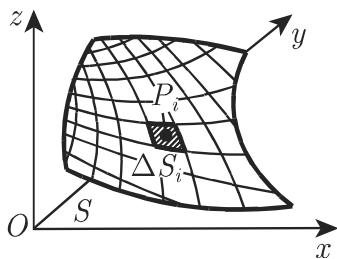
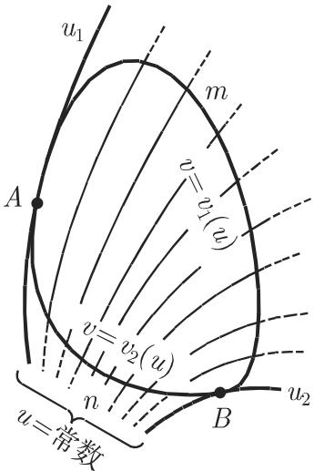
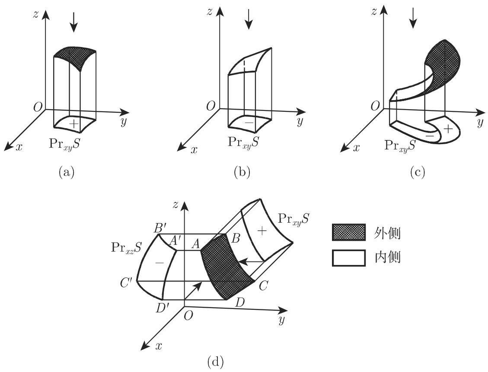
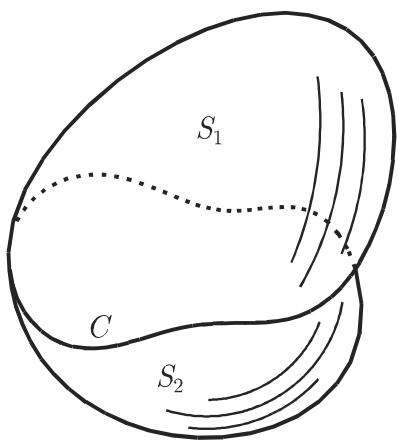

### 8.5 曲面积分

线积分有三种不同的类型（参见第 684 8.3)，与之类似，曲面积分也分为三

类：第一类曲面积分、第二类曲面积分和一般类型的曲面积分

#### 8.5.1 第一类曲面积分

第一类线积分是普通积分的推广（参见第 684 8.3.1)，与之相同曲面积分或空间曲面积分是二重积分的推广．

8.5.1.1 笫一类曲面积分的概念

1. 定义

设有一定义在连通区域上的三元函数 $u = f \left( x , y , z \right)$ ,S 为曲面上的一个区域，则函数在 上的第一类曲面积分为

$$
\int_ {S} f (x, y, z) \mathrm{d} S,\tag{8.148a}
$$

第一类曲面积分的数值可按如下方法来定义（参见图 8.44):

  
8.44

(1) 把区域 任意分成 个小区域 $\Delta S _ { i }$

(2) 在小区域 $\Delta S _ { i }$ 的内部或边界任取一点 $P _ { i } \left( x _ { i } , y _ { i } , z _ { i } \right)$

(3) 用点 $P _ { i } \left( x _ { i } , y _ { i } , z _ { i } \right)$ ）处的函数值 $f \left( x _ { i } , y _ { i } , z _ { i } \right)$ 乘以相应小区域的面积 $\Delta S _ { i }$

(4) 将所有乘积 $f \left( x _ { i } , y _ { i } , z _ { i } \right) \Delta S _ { i }$ 作和．

(5) 当每个小区域的直径都趋千 0, $\Delta S _ { i } \to 0 , n \to \infty$ 时，确定和式

$$
\sum_ {i = 1} ^ {n} f (x _ {i}, y _ {i}, z _ {i}) \Delta S _ {i}\tag{8.148b}
$$

的极限（参见第 694 8.4.1.1, 1.).

若无论区域 的分法如何，也不论点 $P _ { i } \left( x _ { i } , y _ { i } , z _ { i } \right)$ 的取法如何，上述极限都存在，则称之为函数 $u = f \left( x , y , z \right)$ 在曲面 上的第一类曲面积分，记作

$$
\int \liminfits_{S}f(x,y,z)\mathrm{d}S = \liminfits_{\substack{\Delta S_{i}\to 0\\ n\to \infty}}\sum \liminfits_{i = 1}^{n}f(x_{i},y_{i},z_{i})\Delta S_{i}.\tag{8.148c}
$$

2. 存在定理

若函数 $u = f \left( x , y , z \right)$ 在某区域上连续，且定义曲面的函数有连续导数，则第一类曲面积分存在

8.5.1.2 笫一类曲面积分的计算

第一类曲面积分的计算可化成平面区域上二重积分的计算（参见第 694 8.4.1).

1. 曲面的显函数表示

设曲面方程的显形式方程为

$$
z = z (x, y)\tag{8.149}
$$

则

$$
\int_ {S} f (x, y, z) \mathrm{d} S = \iint_ {S ^ {\prime}} f [ x, y, z (x, y) ] \sqrt {1 + p ^ {2} + q ^ {2}} \mathrm{d} x \mathrm{d} y,\tag{8.150a}
$$

其中 $S ^ { \prime }$ 为 $S$ 在 $x O y$ 面的投影， $p = { \frac { \partial z } { \partial x } } , q = { \frac { \partial z } { \partial y } }$ ．此处假设曲面 $S$ 中的每个点都对应 $x O y$ 面内 $S ^ { \prime }$ 中的唯一一点即曲面中的点由它们的坐标唯一确定若这一条不成立，可以把 $S$ 分成儿部分，使得每部分都满足该条件．由此在整个曲而的积分可以表示成 的各个部分积分的代数和．

因为曲面 (8.149) 的法线方程形如 ${ \frac { X - x } { p } } = { \frac { Y - y } { q } } = { \frac { Z - z } { - 1 } }$ （参见第 3533.29)，法线方向与 轴夹角的余弦 $\cos \gamma = { \frac { 1 } { \sqrt { 1 + p ^ { 2 } + q ^ { 2 } } } }$ ，故方程 (8.150a)以写成

$$
\int_ {S} f (x, y, z) \mathrm{d} S = \iint_ {S _ {x y}} f [ x, y, z (x, y) ] \frac {\mathrm{d} S _ {x y}}{\cos \gamma}.\tag{8.150b}
$$

在计算第一类曲面积分时，总把角？ $\gamma$ 看成锐角，故恒有 $\cos \gamma > 0$

2. 曲面的参数表示

若曲面 以参数方程的形式给出（图 8.45)

$$
x = x (u, v), \qquad y = y (u, v), \qquad z = z (u, v),\tag{8.151a}
$$

则

$$
\begin{array}{l} \int_ {S} f (x, y, z) \mathrm{d} S \\ = \iint_ {\Delta} f [ x (u, v), y (u, v), z (u, v) ] \sqrt {E G - F ^ {2}} \mathrm{d} u \mathrm{d} v, \end{array}\tag{8.151b}
$$

其中 $E , F , G$ 均为第 353 3.6.3.3, 1. 给出的量，参数形式的区域面积微元为

$$
\sqrt {E G - F ^ {2}} \mathrm{d} u \mathrm{d} v = \mathrm{d} S,\tag{8.151c}
$$

$\varDelta$ 是与给定的曲面区域相对应的关千参数 $u , v$ 的区域．关千 $u , v$ 依次积分，可计算曲面积分

$$
\begin{array}{l} \int_ {S} \varPhi (u, v) \mathrm{d} S = \int_ {u _ {1}} ^ {u _ {2}} \int_ {v _ {1} (u)} ^ {v _ {2} (u)} \varPhi (u, v) \sqrt {E G - F ^ {2}} \mathrm{d} v \mathrm{d} u, \\ \varPhi = f \Big [ x (u, v), y (u, v), z (u, v) \Big ], \end{array}\tag{8.151d}
$$

其中 $u _ { 1 } , u _ { 2 }$ 是包含区域 的坐标线 $u =$ 常数的下限和上限坐标（图 \_\_ \_ 8.45), $v =$ $v _ { 1 } \left( u \right) , v = v _ { 2 } \left( u \right)$ 是 的边界曲线 $\widehat { A m B }$ 和 $\widehat { A n B }$ 的方程．

  
8.45

(8.150a) (8.151b) 的特殊情况事实上，

$$
u = x, \quad v = y, \quad E = 1 + p ^ {2}, \quad F = p q, \quad G = 1 + q ^ {2}.\tag{8.152}
$$

3. 曲面的面积微元

8.12 给出了曲面的面积微元

8.12 曲面面积微元

<table><tr><td>坐标</td><td>面积微元</td></tr><tr><td>笛卡儿坐标  $x, y, z = z(x, y)$ </td><td> $\mathrm{d}S = \sqrt{1 + \left( \frac{\partial z}{\partial x} \right)^2 + \left( \frac{\partial z}{\partial y} \right)^2} \mathrm{d}x \mathrm{d}y$ </td></tr><tr><td>柱面侧面, $R$ (常数,半径),坐标  $\varphi, z$ </td><td> $\mathrm{d}S = R \mathrm{d}\varphi \mathrm{d}z$ </td></tr><tr><td>球面  $R$ (常数,半径),坐标  $\vartheta, \varphi$ </td><td> $\mathrm{d}S = R^2 \sin \vartheta \mathrm{d}\vartheta \mathrm{d}\varphi$ </td></tr><tr><td>任意曲线坐标  $u, v(E, F, G$ 参见 354 页弧微分)</td><td> $\mathrm{d}S = \sqrt{EG - F^2} \mathrm{d}u \mathrm{d}v$ </td></tr></table>

8.5.1.3 笫一类曲面积分的应用

1. 曲面的面积

$$
S = \int_ {S} \mathrm{d} S.\tag{8.153}
$$

2. 质地不均匀的曲面 的质量

设密度{ $\varrho = f \left( x , y , z \right)$ 依坐标变化，有

$$
M _ {S} = \int_ {S} \varrho \mathrm{d} S.\tag{8.154}
$$

#### 8.5.2 第二类曲面积分

笫二类曲面积分也称为投影积分，与第一类曲面积分类似，也是二重积分概念的推广．

8.5.2.1 笫二类曲面积分的概念

1. 有向曲面的概念

通常曲面有两侧可以选择任意一侧作为外侧．若外侧固定，则该曲面称为有向曲面．对千不能定义两侧的曲面，此处不作讨论（参见 [8.12]).

2. 有向曲面在坐标面上的投影

将有向曲面上一有界区域 向坐标面投影，如向 $x O y$ 面投影，可以按如下方法规定投影 $\operatorname* { P r } _ { x y } S$ 的正负（图 8.46):

a) 若从 轴的正向看向 $x O y$ 面时看到的是曲面 的正面（把外侧作为正面），则射影 $\operatorname* { P r } _ { x y } S$ 取正号，否则取负号（图 8.46(a), (b)).

b) 若曲面有一部分是正面，有一部分是反面，则射影 $\mathrm { P r } _ { x y } \ S$ 可看作正负投影的代数和（图 8.46(c)).

8.46(d) 是曲面 分别在 $x O z$ 和 $y O z$ 面上的投影 $\mathrm { P r } _ { x z } S$ 和 $\mathrm { P r } _ { y z } S ;$ 符号一正一负

闭有向曲而的投影等千 0.

3. 在坐标面上投影的第二类曲面积分的定义

设 $f \left( x , y , z \right)$ 为一个定义在一连通区域上三元函数， 是函数定义域内的一有向曲面且 上的点与其在 $x O y$ 面上的投影一一对应，则 $f \left( x , y , z \right)$ 的第二类曲面积分定义为 $f \left( x , y , z \right)$ 在该投影的积分

$$
\int_ {S} f (x, y, z) \mathrm{d} x \mathrm{d} y.\tag{8.155}
$$

与第一类曲面积分的计算方法类似，但在第三步中不用 $f \left( x _ { i } , y _ { i } , z _ { i } \right)$ 乘以小区域的面积 $\Delta S _ { i }$ , 而是用 $f \left( x _ { i } , y _ { i } , z _ { i } \right)$ ）乘以第 709 8.5.2.1, 2. 中规定的 $x O y$ 面上

的有向投影 $\mathrm { P r } _ { x y } \Delta S _ { i }$ 千是有

$$
\int \limsupits_{S}f(x,y,z)\mathrm{d}x\mathrm{d}y = \limsupits_{\substack{\Delta S_{i}\to 0\\ n\to \infty}}\sum \limsupits_{i = 1}^{n}f(x_{i},y_{i},z_{i})\Pr_{xy}\Delta S_{i}.\tag{8.156a}
$$

类似地可定义有向曲面 $y O z$ 和 $z O x$ 上投影的第二类曲面积分：

$$
\int \liminfits_{S}f(x,y,z)\mathrm{d}y\mathrm{d}z = \liminfits_{\substack{\Delta S_{i}\to 0\\ n\to \infty}}\sum \liminfits_{i = 1}^{n}f(x_{i},y_{i},z_{i})\Pr_{yz}\Delta S_{i},\tag{8.156b}
$$

$$
\int_ {S} f (x, y, z) \mathrm{d} z \mathrm{d} x = \lim _ {\Delta S _ {i} \to 0 \atop n \to \infty} \sum_ {i = 1} ^ {n} f (x _ {i}, y _ {i}, z _ {i}) \mathrm{Pr} _ {z x} \Delta S _ {i}.\tag{8.156c}
$$

  
8.46

4. 第二类曲面积分存在定理

若函数 $f \left( x , y , z \right)$ 连续，定义曲面的方程也连续且有连续导数，则第二类曲面积(8.156a, 8.156b, 8.156c) 存在

8.5.2.2 笫二类曲面积分的计算

主要计算方法可化为二重积分的计算．

1. 由显形式给出的曲面

若曲面 的显形式方程为

$$
z = \varphi (x, y),\tag{8.157}
$$

则积分 (8.156a) 可由以下公式来计算

$$
\int_ {S} f (x, y, z) \mathrm{d} x \mathrm{d} y = \int_ {\operatorname * {P r} _ {x y} S} f [ x, y, \varphi (x, y) ] \mathrm{d} S _ {x y},\tag{8.158a}
$$

其中 $S _ { x y } = \operatorname* { P r } _ { x y } S$ ．类似地，对曲面 在其他坐标面的投影，函数 $f \left( x , y , z \right)$ 的曲面积分为

$$
\int_ {S} f (x, y, z) \mathrm{d} y \mathrm{d} z = \int_ {\operatorname * {P r} _ {y z} S} f (\psi (y, z), y, z) \mathrm{d} S _ {y z},\tag{8.158b}
$$

其中曲面方程为 $x = \psi \left( y , z \right)$ ，且 $S _ { y z } = \operatorname* { P r } _ { y z } S$

$$
\int_ {S} f (x, y, z) \mathrm{d} z \mathrm{d} x = \int_ {\operatorname * {P r} _ {z x} S} f \Bigl (x, \chi (z, x), z \Bigr) \mathrm{d} S _ {z x},\tag{8.158c}
$$

其中曲面方程为 $y = \chi \left( z , x \right)$ ，且 $S _ { z x } = \operatorname* { P r } _ { z x } S$ . 若改变曲面的方向，即把曲面的内外两侧互换，则投影上的积分换号．

2. 以参数形式给出的曲面

若曲面的参数方程为

$$
x = x (u, v), \qquad y = y (u, v), \qquad z = z (u, v),\tag{8.159}
$$

可借助如下公式计算积分 (8.156a, 8.156b, 8.156c):

$$
\int_ {S} f (x, y, z) \mathrm{d} x \mathrm{d} y = \int_ {\Delta} f [ x (u, v), y (u, v), z (u, v) ] \frac {D (x , y)}{D (u , v)} \mathrm{d} u \mathrm{d} v,\tag{8.160a}
$$

$$
\int_ {S} f (x, y, z) \mathrm{d} y \mathrm{d} z = \int_ {\varDelta} f \Big [ x (u, v), y (u, v), z (u, v) \Big ] \frac {D (y , z)}{D (u , v)} \mathrm{d} u \mathrm{d} v,\tag{8.160b}
$$

$$
\int_ {S} f (x, y, z) \mathrm{d} z \mathrm{d} x = \int_ {\Delta} f [ x (u, v), y (u, v), z (u, v) ] \frac {D (z , x)}{D (u , v)} \mathrm{d} u \mathrm{d} v,\tag{8.160c}
$$

其中表达式 $\frac { D \left( x , y \right) } { D \left( u , v \right) } , \frac { D \left( y , z \right) } { D \left( u , v \right) } , \frac { D \left( z , x \right) } { D \left( u , v \right) }$ 分别为 $x , y , z$ 中每一函数对关千变量 $u , v$ 的雅可比行列式； $\varDelta$ 为曲面 $S$ u,v 的定义域．

#### 8.5.3 一般类型的曲面积分

8.5.3.1 一般类型的曲面积分的概念

若 $P \left( x , y , z \right) , Q \left( x , y , z \right) , R \left( x , y , z \right)$ 为定义在一连通区域上的三个三元函数，为该区域内的有向曲面，在三个坐标面上投影的第二类积分之和称为一般类型的曲

面积分：

$$
\int_ {S} (P \mathrm{d} y \mathrm{d} z + Q \mathrm{d} z \mathrm{d} x + R \mathrm{d} x \mathrm{d} y) = \int_ {S} P \mathrm{d} y \mathrm{d} z + \int_ {S} Q \mathrm{d} z \mathrm{d} x + \int_ {S} R \mathrm{d} x \mathrm{d} y.\tag{8.161}
$$

该公式可化为二重积分：

$$
\int_ {S} (P \mathrm{d} y \mathrm{d} z + Q \mathrm{d} z \mathrm{d} x + R \mathrm{d} x \mathrm{d} y) = \int_ {\varDelta} \left[ P \frac {D (y , z)}{D (u , v)} + Q \frac {D (z , x)}{D (u , v)} + R \frac {D (x , y)}{D (u , v)} \right] \mathrm{d} u \mathrm{d} v,\tag{8.162}
$$

其中 $\frac { D \left( x , y \right) } { D \left( u , v \right) } , \frac { D \left( y , z \right) } { D \left( u , v \right) } , \frac { D \left( z , x \right) } { D \left( u , v \right) }$ 和 $\varDelta$ 与前面的意义相同

向量场理论一章讨论了向量值函数的曲面积分（参见第 942 13.3.2).

8.5.3.2 曲面积分的性质

(1) 若积分区域即曲面 能分成两部分 $S _ { 1 }$ 和 $S _ { 2 }$ （图 8.47) ，则

$$
\begin{array}{l} \int_ {S} (P \mathrm{d} y \mathrm{d} z + Q \mathrm{d} z \mathrm{d} x + R \mathrm{d} x \mathrm{d} y) = \int_ {S _ {1}} (P \mathrm{d} y \mathrm{d} z + Q \mathrm{d} z \mathrm{d} x + R \mathrm{d} x \mathrm{d} y) \\ \qquad \qquad + \int_ {S _ {2}} (P \mathrm{d} y \mathrm{d} z + Q \mathrm{d} z \mathrm{d} x + R \mathrm{d} x \mathrm{d} y). \end{array}\tag{8.163}
$$

(2) 若曲面改变方向，即内外侧互换，则积分变号：

$$
\int_ {S ^ {+}} (P \mathrm{d} y \mathrm{d} z + Q \mathrm{d} z \mathrm{d} x + R \mathrm{d} x \mathrm{d} y) = - \int_ {S ^ {-}} (P \mathrm{d} y \mathrm{d} z + Q \mathrm{d} z \mathrm{d} x + R \mathrm{d} x \mathrm{d} y),\tag{8.164}
$$

  
8.47

其中 $S ^ { + }$ 和 $S ^ { - }$ 表示同一曲面的两个不同方向．

(3) 通常曲面积分与曲面区域 边界及曲面本身有关，因此对千由相同闭曲线张成的两个不同的非闭曲面区域 $S _ { 1 }$ 和 $S _ { 2 }$ , 它们的积分往往不同（图 8.47):

$$
\int_ {S _ {1}} (P \mathrm{d} y \mathrm{d} z + Q \mathrm{d} z \mathrm{d} x + R \mathrm{d} x \mathrm{d} y) \neq \int_ {S _ {2}} (P \mathrm{d} y \mathrm{d} z + Q \mathrm{d} z \mathrm{d} x + R \mathrm{d} x \mathrm{d} y).\tag{8.165}
$$

(4) 常用曲面积分来计算以闭曲面 为边界的立体体积 $V$ 积分计算公式如下：

$$
V = \frac {1}{3} \int_ {S} (x \mathrm{d} y \mathrm{d} z + y \mathrm{d} z \mathrm{d} x + z \mathrm{d} x \mathrm{d} y),\tag{8.166}
$$

$$
V = \int_ {S} x \mathrm{d} y \mathrm{d} z \quad \text {或} \quad V = \int_ {S} y \mathrm{d} z \mathrm{d} x \quad \text {或} \quad V = \int_ {S} z \mathrm{d} x \mathrm{d} y \quad \text {或}\tag{8.167a}
$$

$$
V = \frac {1}{3} \int_ {S} (x \mathrm{d} y \mathrm{d} z + y \mathrm{d} z \mathrm{d} x + z \mathrm{d} x \mathrm{d} y),\tag{8.167b}
$$

其中 是使得外侧为正的有向曲面．

·由球面公 $x ^ { 2 } + y ^ { 2 } + z ^ { 2 } = R ^ { 2 }$ , 要想计算球体体积 $V ,$ 需要利用球坐标 $x =$ $R \sin \vartheta \cos \varphi , \ y = R \sin \vartheta \sin \varphi , \ z = R \cos \vartheta ( 0 \leqslant \vartheta \leqslant \pi , \ 0 \leqslant \varphi \leqslant 2 \pi )$ 以及如(8.160a) 中那样的雅可比行列式

$$
\frac {D (x , y)}{D (\vartheta , \varphi)} = \left| \begin{array}{c c} x _ {\vartheta} & x _ {\varphi} \\ y _ {\vartheta} & y _ {\varphi} \end{array} \right| = R ^ {2} \cos \vartheta \sin \vartheta .\tag{8.168a}
$$

(8.167a) 中第三个积分，有

$$
V = \int_ {\varphi = 0} ^ {2 \pi} \int_ {\vartheta = 0} ^ {\pi} R ^ {3} \cos^ {2} \vartheta \sin \vartheta \mathrm{d} \vartheta \mathrm{d} \varphi = 2 \pi R ^ {3} \int_ {0} ^ {\pi} \cos^ {2} \vartheta \sin \vartheta \mathrm{d} \vartheta = \frac {4}{3} \pi R ^ {3}.
$$

（胡俊美译）

(8.168b)
