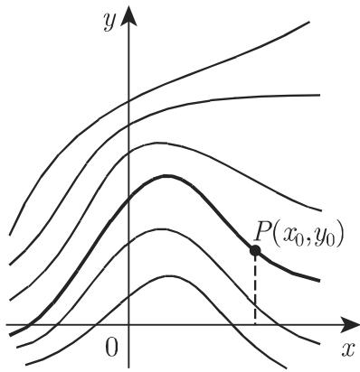
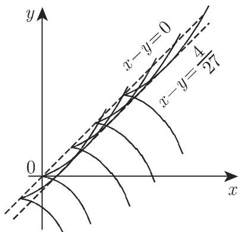
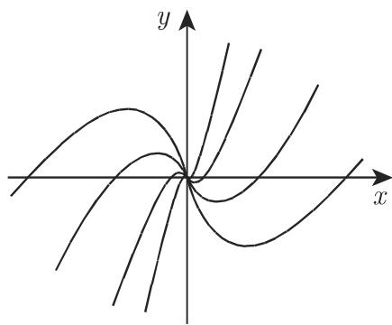
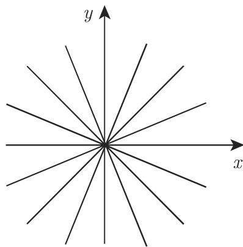
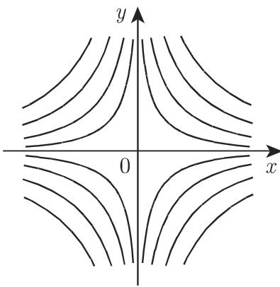

#### 9.1.1 一阶微分方程

9.1.1.1 存在性定理，方向场

1. 解的存在性

如果函数 $f ( x , y )$ 在点 $( x _ { 0 } , y _ { 0 } )$ 的一个邻域 中是连续的，那么根据柯西$\left( { \mathrm { C a u c h y } } \right)$ 存在性定理微分方程

$$
y ^ {\prime} = f (x, y)\tag{9.2}
$$

在 $x _ { 0 }$ 的一个邻域中至少有一个解在 $x = x _ { 0 }$ 处取值 $y _ { 0 }$ ．例如，对千某些 $a$ 和 $b ,$ 可以把 取为由 $| x - x _ { 0 } | < a$ 和 $\vert y - y _ { 0 } \vert < b$ 所给出的区域．

2. 利普希茨条件

$f ( x , y )$ 关千 的利普希茨 (Lipschitz) 条件为

$$
| f (x, y _ {1}) - f (x, y _ {2}) | \leqslant N | y _ {1} - y _ {2} |, \quad \text {对所有} (x, y _ {i}) \in G, \quad i = 1, 2,\tag{9.3}
$$

其中 不依赖千 $x , y _ { 1 }$ 和 $y _ { 2 }$ ．如果这个条件被满足，那么通过 $( x _ { 0 } , y _ { 0 } )$ ，微分方(9.2) 就有一个唯一的解．如果在这个邻域 中函数 $f ( x , y )$ 有有界的偏导数$\partial f / \partial y$ ，则利普希茨条件显然被满足．在第 722 9.1.1.4 中，有一些不满足柯西存在性定理假设的例子．

3. 方向场

如果微分方程 $y ^ { \prime } ( x , y )$ 一个解的图像通过点 $P ( x , y )$ ，那么图像在该点处切线的斜率 $\mathrm { d } y / \mathrm { d } x$ 可以由该微分方程所确定．因而，在每个点处，微分方程就确定了通过所考虑点解的切线的斜率．这些方向的全体（图 9.1) 形成一个方向场 (directionfield)．方向场的元素是一个点以及与其相关的方向一阶微分方程的积分在儿何上意味着把一个方向场的元素连接成一条积分曲线 (integral curve)，在所有点处其切线与该方向场相应元素有相同的斜率

  
9.1

4. 铅垂方向

如果在一个方向场中有一个铅垂方向，即如果函数 $f ( x , y )$ 有一个极点，那么可以交换自变量和应变量的作用，并作为一个等价千 (9.2) 的方程，考虑微分方程

$$
{\frac {\mathrm{d} x}{\mathrm{d} y}} = {\frac {1}{f (x , y)}}.\tag{9.4}
$$

在对千微分方程 (9.2) (9.4) 满足存在性条件的区域中，通过每个点 $P ( x _ { 0 } , y _ { 0 } )$ 存在一条唯一的积分曲线（图 9.2).

  
9.2

5. 通解

(9.2) 的所有积分曲线的集合可以被一个参数所刻画，因而它可以由相应的单参数曲线族的方程

$$
F (x, y, C) = 0\tag{9.5a}
$$

给出．参数 是一个任意常数，它可以被自由地选取，它是每个一阶微分方程通解的一个必要的部分．满足条件 $y _ { 0 } = \varphi ( x _ { 0 } )$ 的一个特解 $y = \varphi ( x )$ 可以从通解 (9.5a)

得到如果 被方程

$$
F (x _ {0}, y _ {0}, C) = 0\tag{9.5b}
$$

所表示

9.1.1.2 重要的求解方法

1. 分离变量法

如果一个微分方程可以被变换为如下形式

$$
M (x) N (y) \mathrm{d} x + P (x) Q (y) \mathrm{d} y = 0,\tag{9.6a}
$$

那么它可以被重写为

$$
R (x) \mathrm{d} x + S (y) \mathrm{d} y = 0,\tag{9.6b}
$$

其中变量 被分离在两项中．为了得到这种形式方程 (9.6a) $P ( x ) N ( y )$ 除即可 (9.6a) 的通解是

$$
\int {\frac {M (x)}{P (x)}} \mathrm{d} x + \int {\frac {Q (y)}{N (y)}} \mathrm{d} y = C.\tag{9.7}
$$

如果对千某些值 $x = { \overline { { x } } }$ 或 $y = { \overline { { y } } } ;$ ，有 $P ( x ) = 0$ 或 $N ( y ) = 0$ 或 $P ( x ) = N ( y ) = 0$ 则常数函数 $x = \overline { { x } }$ 或／和 $y = \overline { { y } }$ 也是该微分方程的解．它们被称为奇异解 (singularsolutions).

$$
x \mathrm{d} y + y \mathrm{d} x = 0; \quad \int \frac {\mathrm{d} y}{y} + \int \frac {\mathrm{d} x}{x} = C; \quad \ln | y | + \ln | x | = C = \ln | c |; \quad y x = c.
$$

果在最后一个方程中允许 $c = 0$ , 则有奇异解 $y \equiv 0$ 和 $x \equiv 0$

2. 齐次方程

如果 $M ( x , y )$ 和 $N ( x , y )$ 是同次的齐次函数（参见第 158 2.18.2.5, 4. ），则在方程

$$
M (x, y) \mathrm{d} x + N (x, y) \mathrm{d} y = 0\tag{9.8}
$$

中，通过代换 $u = y / x$ ，变量可被分离

■ $x ( x - y ) y ^ { \prime } + y ^ { 2 } = 0$ ，作代换 $y = u ( x ) x$ , 得到 $( 1 - u ) u ^ { \prime } + u / x = 0$ ，再用分离变量法得到 $\int \frac { 1 - u } { u } \mathrm { d } u = - \int \frac { 1 } { x } \mathrm { d } x$ 积分后得到 $\ln x + \ln u - u = C = \ln | c | , u x =$ $c \mathrm { e } ^ { u } , y = c \mathrm { e } ^ { y / x }$ ．正如在分离变量法一节中可知直线 $x = 0$ 也是一条积分曲线

3. 恰当微分方程

一个恰当微分方程 (exact differential equation) 是一个形如

$$
M (x, y) \mathrm{d} x + N (x, y) \mathrm{d} y = 0 \quad \text {或} \quad N (x, y) y ^ {\prime} + M (x, y) = 0\tag{9.9a}
$$

的方程，如果存在两个变量的一个函数 $\varPhi ( x , y )$ ，使得

$$
M (x, y) \mathrm{d} x + N (x, y) \mathrm{d} y \equiv \mathrm{d} \varPhi (x, y),\tag{9.9b}
$$

即，如果 (9.9a) 的左端是一个函数 $\varPhi ( x , y )$ 的全微分（参见第 600 6.2.2.1) ．如果函数 $M ( x , y ) , N ( x , y )$ 及其一阶偏导数在一个连通域 上是连续的，则等式

$$
\frac {\partial M}{\partial y} = \frac {\partial N}{\partial x}\tag{9.9c}
$$

是方程 (9.9a) 成为恰当的一个充要条件在此情形，（9.9a) 的通解是函数

$$
\Phi (x, y) = C \quad (C = \text {常数}),\tag{9.9d}
$$

它可以根据第 692 8.3.4.4 (8.132) 作为积分

$$
\Phi (x, y) = \int_ {x _ {0}} ^ {x} M (\xi , y) \mathrm{d} \xi + \int_ {y _ {0}} ^ {y} N (x _ {0}, \eta) \mathrm{d} \eta\tag{9.9e}
$$

而被计算，其中 $x _ { 0 }$ 和 $y _ { 0 }$ 。可以在 $G$ 中任意选取

·本页 4. 将给出一些例子．

4. 积分因子

一个函数 $\mu ( x , y )$ 被称为一个积分因子 (integrating factor) 或一个乘子 (mul-tipier) ，如果方程

$$
M (x, y) \mathrm{d} x + N (x, y) \mathrm{d} y = 0\tag{9.10a}
$$

乘以 $\mu ( x , y )$ 后变成一个恰当微分方程积分因子 $\mu ( x , y )$ 满足微分方程

$$
N \frac {\partial \ln \mu}{\partial x} - M \frac {\partial \ln \mu}{\partial y} = \frac {\partial M}{\partial y} - \frac {\partial N}{\partial x}.\tag{9.10b}
$$

这个方程的每个特解是一个积分因子．得到这个偏微分方程的通解比解原始方程复杂得多，因而人们通常寻找一种特殊形式的解 $\mu ( x , y )$ ，例如 $\mu ( x ) , \mu ( y ) , \mu ( x y )$ 或$\mu ( x ^ { 2 } + y ^ { 2 } )$

·为了解微分方程 $( x ^ { 2 } + y ) \mathrm { d } x - x \mathrm { d } y = 0$ ，其积分因子的方程是 $- x \frac { \partial \ln \mu } { \partial x } - ( x ^ { 2 } +$ $y ) \frac { \partial \ln \mu } { \partial y } = 2 .$ 与 $y$ 无关的积分因子必定满足 $x \frac { \partial \ln \mu } { \partial x } = - 2$ ，因而 $\mu = { \frac { 1 } { x ^ { 2 } } }$ ．用$\mu$ 乘以所给的微分方程产生 $\left( 1 + { \frac { y } { x ^ { 2 } } } \right) \mathrm { d } x - { \frac { 1 } { x } } \mathrm { d } y = 0$ . 根据 (9.9e) ，其中选取$x _ { 0 } = 1 , y _ { 0 } = 0$ ，则得通解为

$$
\varPhi (x, y) \equiv \int_ {1} ^ {x} \left(1 + {\frac {y}{\xi^ {2}}}\right) \mathrm{d} \xi - \int_ {0} ^ {y} \mathrm{d} \eta = C \quad {\text {或}} \quad x - {\frac {y}{x}} = C _ {1}.
$$

5. 一阶线性微分方程

一个一阶线性微分方程 (first-order linear differential equation) 有如下形式

$$
y ^ {\prime} + P (x) y = Q (x),\tag{9.11a}
$$

其中未知函数 $y$ 及其导数 $y ^ { \prime }$ 仅以一次形式出现， $P ( x )$ 和 $Q ( x )$ 是给定的函数．如果$P ( x )$ 和 $Q ( x )$ 在一个有限闭区间上是连续的，则该微分方程在这个区间中满足皮卡—林德勒夫定理 (Picard-Lindelof theorem) 的条件（参见第 872 12.2.2.4, 4.).这里是一个积分因子：

$$
\mu = \exp \left(\int P \mathrm{d} x\right),\tag{9.11b}
$$

而通解是

$$
y = \exp \left(- \int P \mathrm{d} x\right) \left[ \int Q \exp \left(\int P \mathrm{d} x\right) \mathrm{d} x + C \right].\tag{9.11c}
$$

在这个公式中用下界为 $x _ { 0 } ,$ 上界为 的定积分代替不定积分，则得到相应千 $y ( x _ { 0 } )$ $= C$ 的解如果 $y _ { 1 }$ 是该微分方程的任一特解，则微分方程的通解由公式

$$
y = y _ {1} + C \exp \left(- \int P \mathrm{d} x\right)\tag{9.11d}
$$

给出．如果 $y _ { 1 }$ 和 $y _ { 2 }$ 是两个线性无关的特解（参见第 732 9.1.2.3, 2.），那么不用任何积分人们就得到通解为

$$
y = y _ {1} + C (y _ {2} - y _ {1}).\tag{9.11e}
$$

·求解具有初始条件 $x _ { 0 } = 0 , y _ { 0 } = 0$ 的微分方程 $y ^ { \prime } - y \tan x \ = \ \cos x$ 计算$\exp { \bigg ( - \int _ { 0 } ^ { x } \tan x \mathrm { d } x } { \bigg ) } = \cos x $ ，根据 (9.llc) 得到解

$$
y = \frac {1}{\cos x} \int_ {0} ^ {x} \cos^ {2} x \mathrm{d} x = \frac {1}{\cos x} \left[ \frac {\sin x \cos x + x}{2} \right] = \frac {\sin x}{2} + \frac {x}{2 \cos x}.
$$

6. 伯努利微分方程

伯努利 (Bernoulli) 微分方程是形如

$$
y ^ {\prime} + P (x) y = Q (x) y ^ {n} \quad (n \neq 0, n \neq 1)\tag{9.12}
$$

的方程如果它被 $y ^ { n }$ 除，并引进新变量 $z = y ^ { - n + 1 }$ ，就被化为一个线性微分方程·求解微分方程 $y ^ { \prime } - { \frac { 4 y } { x } } = x { \sqrt { y } }$ ．由千 $n = 1 / 2$ ，用 $\sqrt { y }$ 除，并引进新变量 $z = { \sqrt { y } }$ 得到方程 ${ \frac { d z } { d x } } - { \frac { 2 z } { x } } = { \frac { x } { 2 } }$ ．利用线性微分方程解的公式有 $\exp \left( \int P \mathrm { d } x \right) = \frac { 1 } { x ^ { 2 } }$ 和$z = x ^ { 2 } \Bigg [ \int { \frac { x } { 2 } } { \frac { 1 } { x ^ { 2 } } } \mathrm { d } x + C \Bigg ] = x ^ { 2 } \Bigg [ { \frac { 1 } { 2 } } \ln | x | + C \Bigg ]$ 因而，最后得到 $y = x ^ { 4 } { \biggl ( } { \frac { 1 } { 2 } } \ln | x | + C { \biggr ) } ^ { 2 }$

7. 里卡蒂微分方程

里卡蒂 (Riccati) 微分方程

$$
y ^ {\prime} = P (x) y ^ {2} + Q (x) y + R (x)\tag{9.13a}
$$

通常不能用初等积分法求解，即不能利用有限次的初等积分法求得解．然而，有可能通过适当的代换将其变化为一些微分方程，而这些微分方程可以求得它们的解．

方法 由代换

$$
y = \frac {u (x)}{P (x)} + \beta (x),\tag{9.13b}
$$

里卡蒂微分方程可以被变化为正规形式 (normal form)

$$
\frac {\mathrm{d} u}{\mathrm{d} x} = u ^ {2} + R _ {0} (x),\tag{9.13c}
$$

其中

$$
R _ {0} (x) = P ^ {2} \beta^ {2} + Q P \beta + P R - P \beta^ {\prime}.\tag{9.13d}
$$

因而微分方程中未知函数的一次项就消失了．

如果通过一个适当途径可以发现 (9.13c) 的一个特解 $u _ { 1 } ( x )$ ，那么借助千代换

$$
u = \frac {1}{z (x)} + u _ {1} (x),\tag{9.13e}
$$

(9.13c) 即被变化为 $z ( x )$ 的线性微分方程

$$
z ^ {\prime} + 2 u _ {1} (x) z - 1 = 0.\tag{9.13f}
$$

利用 (9.13e) (9.13b) ，从 (9.13f) 的解就得到 (9.13a) 的解．

方法 由代换

$$
y = - \frac {v ^ {\prime}}{P (x) v (x)},\tag{9.13g}
$$

(9.13a) 可以被变化为一个二阶线性微分方程（参见第 741 9.1.2.6, 1.):

$$
P v ^ {\prime \prime} - (P ^ {\prime} + P Q) v ^ {\prime} + P ^ {2} R v = 0.\tag{9.13h}
$$

·求解微分方程 $y ^ { \prime } + y ^ { 2 } + { \frac { 1 } { x } } y - { \frac { 4 } { x ^ { 2 } } } = 0 .$ 即其中 $P = - 1 , Q = - \frac { 1 } { x } , R = \frac { 4 } { x ^ { 2 } }$ 方法 1取 $\beta ( x ) ~ = ~ - \frac { 1 } { 2 x }$ ,借助千 $y ~ = ~ - u ( x ) - { \frac { 1 } { 2 x } }$ 得到正规形式 $u ^ { \prime }$ $= u ^ { 2 } - { \frac { 1 5 } { 4 x ^ { 2 } } }$ .令 $u = \frac { a } { x }$ 可以得到正规形式微分方程的特解： $u _ { 1 } ( x ) = \frac { 3 } { 2 x } , u _ { 2 } ( x ) =$ $- \frac { 5 } { 2 x }$ .在代换 $u = \frac { 1 } { z ( x ) } + \frac { 3 } { 2 x }$ 后即得微分方程 $z ^ { \prime } + { \frac { 3 } { x } } z + 1 = 0$ ，其解为 $z ( x ) =$ $- { \frac { x } { 4 } } + { \frac { K } { x ^ { 3 } } } = { \frac { 4 K - x ^ { 4 } } { 4 x ^ { 3 } } }$ (K 为常数）．逆变换给出 $y = { \frac { 2 x ^ { 4 } + 2 C } { x ^ { 5 } - C x } } ( C = 4 K )$

方法 根据 (9.13h)，得到欧拉微分方程 $x ^ { 2 } v ^ { \prime \prime } + x v ^ { \prime } - 4 v = 0 .$ 其通解为$v ( x ) = C _ { 1 } x ^ { 2 } + C _ { 2 } \frac { 1 } { x ^ { 2 } }$ （参见第 737 页欧拉微分方程）．可以自由选取常数 $C _ { 1 }$ 和 $C _ { 2 }$ 之一，例如，取 $C _ { 2 } = - 1$ ，则从 (9.13h) 得到 $y = \frac { 2 x ^ { 4 } + 2 C _ { 1 } } { x ^ { 5 } - C _ { 1 } x }$

9.1.1.3 隐式微分方程

1. 参数形式的解

给定一个隐式微分方程

$$
F (x, y, y ^ {\prime}) = 0.\tag{9.14}
$$

那么通过一个点 $P ( x _ { 0 } , y _ { 0 } )$ 条积分曲线，如果下述两个条件被满足：

a) 在点 $P ( x _ { 0 } , y _ { 0 } )$ 处方程 $F ( x , y , p ) = 0 ( p = \mathrm { d } y / \mathrm { d } x )$ 个实根 $p _ { 1 } , \cdots , p _ { n }$

b) 函数 $F ( x , y , p )$ 及其诸一阶偏导数在 $x = x _ { 0 } , y = y _ { 0 } , p = p _ { i }$ 处是连续的；并且 $\partial F / \partial p \neq 0$

如果从原来的方程可以解出 $y ^ { \prime } ,$ ，那么就产生了上面所讨论的 个显式方程．解这些方程得到 族积分曲线．如果方程可以被写成 $x = \varphi ( y , y ^ { \prime } )$ 或 $y = \psi ( x , y ^ { \prime } )$ 这样的形式那么令 $y ^ { \prime } = p .$ 并把 视为辅助变量，在关千 求微商后就得到$\mathrm { d } p / \mathrm { d } y$ 或 $\mathrm { { d } } p / \mathrm { { d } } x$ 的一个方程导数在这个方程中被解出．这个方程的解连同原来的方程一起决定了所希望的参数形式的解．

·为了得到微分方程 $x = y y ^ { \prime } + y ^ { \prime 2 }$ 的解，作代换 $y ^ { \prime } = p ,$ 得到 $x = p y + p ^ { 2 }$ 关千 $y$ 求导，并作代换 ${ \frac { \mathrm { d } x } { \mathrm { d } y } } = { \frac { 1 } { p } }$ ,得到— ${ \frac { 1 } { p } } = p + ( y + 2 p ) { \frac { \mathrm { d } p } { \mathrm { d } y } }$ ，或 ${ \frac { { \mathrm { d } } y } { { \mathrm { d } } p } } - { \frac { p y } { 1 - p ^ { 2 } } } = { \frac { 2 p ^ { 2 } } { 1 - p ^ { 2 } } }$ 关解这个方程得到 $y = - p + { \frac { C + \arcsin p } { \sqrt { 1 - p ^ { 2 } } } }$ (C 为常数）．代入原来的方程中得到参数形式的 的解

2. 拉格朗日微分方程

拉格朗日 (Lagrange) 微分方程是方程

$$
a (y ^ {\prime}) x + b (y ^ {\prime}) y + c (y ^ {\prime}) = 0.\tag{9.15a}
$$

由上面给出的方法可以确定其解．如果 $p = p _ { 0 }$ 。满足

$$
a (p) + b (p) p = 0,\tag{9.15b}
$$

则

$$
a (p _ {0}) x + b (p _ {0}) y + c (p _ {0}) = 0\tag{9.15c}
$$

(9.15a) 的一个奇异解．

3. 克莱罗微分方程

克莱罗 (Clairaut) 微分方程是拉格朗日微分方程的特殊情形，如果

$$
a (p) + b (p) p \equiv 0,\tag{9.16a}
$$

因而它可以被变化为

$$
y = y ^ {\prime} x + f (y ^ {\prime}).\tag{9.16b}
$$

其通解为

$$
y = C x + f (C).\tag{9.16c}
$$

除了通解外，克莱罗微分方程还有一个奇异解，它可以从方程

$$
y = C x + f (C)\tag{9.16d}
$$

和

$$
0 = x + f ^ {\prime} (C)\tag{9.16e}
$$

中消去常数 而得到对 (9.16d) 关千 求导可以得到 (9.16e) ．在儿何上，奇异解是解曲线族的包络（参见第 342 3.6.1.7) （图 9.3).

·微分方程 $y = x y ^ { \prime } + y ^ { \prime 2 }$ 的解．通解是 $y = C x + C ^ { 2 }$ 借助千方程 $x + 2 C = 0$ 消得到奇异解，因而是 $x ^ { 2 } + 4 y = 0$ 9.3 展示了这个情形．

  
9.3

9.1.1.4 奇异积分和奇点

1. 奇异元素

一个元素 $( x _ { 0 } , y _ { 0 } , y _ { 0 } ^ { \prime } )$ 被称为微分方程的奇异元素 (singular element) ，如果除了微分方程

$$
F (x, y, y ^ {\prime}) = 0\tag{9.17a}
$$

外，它还满足方程

$$
\frac {\partial F}{\partial y ^ {\prime}} = 0.\tag{9.17b}
$$

2. 奇异积分

通过奇异元素的积分曲线被称为奇异积分曲线 (singular integral curve) ；一条奇异积分曲线的方程

$$
\varphi (x, y) = 0\tag{9.17c}
$$

被称为一个奇异积分 (singular integral) ．积分曲线的包络是奇异积分曲线（图 9.3);它们由奇异元素组成

在一条奇异积分曲线的点处，通常缺乏解的唯一性（参见第 715 9.1.1.1, 1.).

3. 奇异积分的确定

通常，对千通解的任意常数的任何值，不能得到奇异积分．为了确定 $p = y ^ { \prime }$ 的微分方程 (9.17a) 的奇异解，必须引进方程

$$
\frac {\partial F}{\partial p} = 0,\tag{9.17d}
$$

并消去 $p .$ 如果所得到的关系是所给微分方程的一个解，那么它就是一个奇异解．这个解的方程必须被变化为某种形式，其中不包含多值函数，特别是不包含必须考虑其复值的根式．

根式 (radicals) 是巾嵌套 (nesting) 代数方程（参见第 79 2.2.1) 得到的表达式．如果已知积分曲线族的方程即已知所给微分方程的通解，那么可以用微分几何的方法（参见第 342 3.6.1.7) 确定曲线族的包络 奇异积分．

·微分方程 $x - y - { \frac { 4 } { 9 } } y ^ { \prime 2 } + { \frac { 8 } { 2 7 } } y ^ { \prime 3 } = 0$ 的解作代换 $y ^ { \prime } = p$ 则附加的方程 (9.17d)的运算导致 $- \frac { 8 } { 9 } p + \frac { 8 } { 9 } p ^ { 2 } = 0$ ．消去 得到方程心 $x - y = 0$ 和方程＠ $x - y = { \frac { 4 } { 2 7 } }$ 2其中心不是解，＠是一个解 通解 $( y - C ) ^ { 2 } = ( x - C ) ^ { 3 }$ 的一个特殊情形．心和＠的积分曲线在图 g.4中被展示．

  
9.4

4. 微分方程的奇点

一个微分方程

$$
y ^ {\prime} = f (x, y)\tag{9.18a}
$$

的奇点是使得该方程右端没有定义的那些点．例如下述形式的微分方程就是这种情形

(1) 具有线性函数分式的微分方程

$$
{\frac {\mathrm{d} y}{\mathrm{d} x}} = {\frac {a x + b y}{c x + e y}} \quad (a e - b c \neq 0)\tag{9.18b}
$$

在（0, 0) 处有一个孤立奇点 (isolated singular point) ，因为在儿乎所有任意接近 (0,0) 的点处满足存在性定理的假设，但在 (0, 0) 处不满足．在直线 $c x + e y = 0$ 上的点处也不满足这些条件．但通过交换自变量和应变量的作用，并考虑微分方程

$$
{\frac {\mathrm{d} x}{\mathrm{d} y}} = {\frac {c x + e y}{a x + b y}},\tag{9.18c}
$$

可以使得这些条件被强行满足．在奇点的邻域中积分曲线的性状依赖千特征方程(characteristic equation)

$$
\lambda^ {2} - (b + c) \lambda + b c - a e = 0\tag{9.18d}
$$

的诸根．可以分类出下述一些情形．

情形 如果两个根都是实的并且有相同的符号，那么奇点是一个分支点(branch point)．奇点邻域中的积分曲线通过奇点，并且如果特征方程的两个根不相等，那么除了一条积分曲线外，它们有公共的切线．如果两个根相等，那么或者所有的积分曲线都有相同的切线，或者存在唯一一条积分曲线在每个方向通过该奇点．

：对千微分方 ${ \frac { \mathrm { d } y } { \mathrm { d } x } } = { \frac { 2 y } { x } }$ 特征方程是 $\lambda ^ { 2 } - 3 \lambda + 2 = 0$ ，其根为 $\lambda _ { 1 } = 2 , \lambda _ { 2 } = 1$ 积分曲线有方程 $y = C x ^ { 2 }$ （图 9.5) ．考虑到 $x ^ { 2 } = C _ { 1 } y _ { ; }$ 通解也包含直线 $x = 0$

  
9.5

：对 ${ \frac { \mathrm { d } y } { \mathrm { d } x } } = { \frac { x + y } { x } } $ ，特征方程是 $\lambda ^ { 2 } - 2 \lambda + 1 = 0$ 其根为 $\lambda _ { 1 } = \lambda _ { 2 } = 1$ . 积分曲线是 $y = x \ln | x | + C x$ （图 9.6) ．其奇点是所谓的结点 (node).

  
9.6

■ C: 对千 ${ \frac { \mathrm { d } y } { \mathrm { d } x } } = { \frac { y } { x } } $ ，特征方程是 $\lambda ^ { 2 } - 2 \lambda + 1 = 0$ 其根为 $\lambda _ { 1 } = \lambda _ { 2 } = 1$ . 积分曲线是 $y = C x$ （图 9.7) ．其奇点是所谓的射线点 (ray point).

  
9.7

情形 如果两个根是实的并且有不同的符号，则奇点是一个鞍点 (saddlepoint) ，并且两条积分曲线通过它

D: 对千 ${ \frac { \mathrm { d } y } { \mathrm { d } x } } = - { \frac { y } { x } } $ ，特征方程是 $\lambda ^ { 2 } - 1 = 0$ , 其根为 $\lambda _ { 1 } = + 1 , \lambda _ { 2 } = - 1$ . 积分曲线是 $x y = C$ （图 9.8)．相应千 C=O 有两个特解 x=O = 0.

  
9.8

情形 如果两个根是有非零实部 $( \mathrm { R e } ( \lambda ) \neq 0 )$ 的共辄复数，则奇点是一个螺线点 (spiral point) ，也称为焦点 (focal point) ，并且积分曲线卷曲地围绕这个奇点：对千 ${ \frac { \mathrm { d } y } { \mathrm { d } x } } = { \frac { x + y } { x - y } }$ ，特征方程 $\lambda ^ { 2 } - 2 \lambda + 2 = 0$ 其根为 $\lambda _ { 1 } = 1 + \mathrm { i } , \lambda _ { 2 } = 1 - \mathrm { i }$ 极坐标下的积分曲线是 $r = C \mathrm { e } ^ { \varphi }$ （图 9.9).

  
9.9

情形 如果两个根是纯虚数，那么奇点是一个中心点 (central point)，或者中 $\therefore ( \mathrm { c e n t e r } )$ ，闭的积分曲线围绕着它．

：对千 ${ \frac { \mathrm { d } y } { \mathrm { d } x } } = - { \frac { x } { y } }$ ，特征方程是 $\lambda ^ { 2 } + 1 = 0$ , 其根为 $\lambda _ { 1 } = \mathrm { i } , \lambda _ { 2 } = - \mathrm { i }$ . 积分曲线是 $x ^ { 2 } + y ^ { 2 } = C$ （图 9.10).

  
9.10

(2) 具有两个任意函数之比的微分方程

$$
{\frac {\mathrm{d} y}{\mathrm{d} x}} = {\frac {P (x , y)}{Q (x , y)}}\tag{9.19a}
$$

在使得

$$
P (x, y) = Q (x, y) = 0\tag{9.19b}
$$

的点 $( x , y )$ 处是奇点．如果 是连续函数，并且有连续偏导数，那么 (9.19a)可以被写为

$$
\frac {\mathrm{d} y}{\mathrm{d} x} = \frac {a (x - x _ {0}) + b (y - y _ {0}) + P _ {1} (x , y)}{c (x - x _ {0}) + e (y - y _ {0}) + Q _ {1} (x , y)}.\tag{9.19c}
$$

这里 $x _ { 0 }$ 和 $y _ { 0 }$ 。是奇点的坐标， $P _ { 1 } ( x , y )$ 和 $Q _ { 1 } ( x , y )$ 是点 $( x , y )$ 到奇点 $( x _ { 0 } , y _ { 0 } )$ 距离的高阶无穷小．在这些假设下，所给微分方程 (9.19a) 的奇点类型与其略去 $P _ { 1 }$ 和$Q _ { 1 }$ 后得到的近似方程 (approximate equation) 的奇点类型是相同的，除了下述一些例外：

a) 如果近似方程的奇点是一个中心，那么原始方程的奇点或是中心，或是焦点

b) 如果 $a e - b c = 0 .$ ，即 ${ \frac { a } { c } } = { \frac { b } { e } }$ ，或 $a = c = 0$ ，或 $a = b = 0 $ 那么原始方程的奇点类型必须考察高阶项后再确定

9.1.1.5 求解一阶微分方程的近似方法

1. 皮卡逐次逼近法

对千 $x = x _ { 0 }$ 时的初始条件 $y = y _ { 0 }$ 的微分方程

$$
y ^ {\prime} = f (x, y)\tag{9.20a}
$$

的积分法导致不动点问题

$$
y = y _ {0} + \int_ {x _ {0}} ^ {x} f (x, y) \mathrm{d} x.\tag{9.20b}
$$

(9.20b) 的右端以另一函数 $y _ { 1 } ( x )$ 代替 $y ,$ ，其结果将是一个新的函数 $y _ { 2 } ( x )$ ；如果$y _ { 1 } ( x )$ 不是 (9.20a) 的解，那么 $y _ { 2 } ( x )$ $y _ { 1 } ( x )$ 不同在 (9.20b) 的右端以函数 $y _ { 2 } ( x )$ 代替 $y .$ ，得到一个函数 $y _ { 3 } ( x )$ ．如果存在性定理的条件被满足（参见第 715 9.1.1.1,1.），那么函数序列 $y _ { 1 } , y _ { 2 } , y _ { 3 } , \cdots$ 在包含 $x _ { 0 }$ 的一个区间中收敛到所期望的解．

这个皮卡逐次逼近法 (Picard method of successive approximation) 是一种迭代法 (iteration method) （参见第 1233 19.1.1).

·求解具有初值 $x _ { 0 } = 0 , y _ { 0 } = 0$ 的微分方程 $y ^ { \prime } = \mathrm { e } ^ { x } - y ^ { 2 }$ ．把这个方程写成积分形式并利用具有初始逼近 $y _ { 0 } ( x ) \equiv 0$ 的逐次逼近法得到 $y _ { 1 } = \int _ { 0 } ^ { x } \mathrm { e } ^ { x } \mathrm { d } x = \mathrm { e } ^ { x } - 1 , y _ { 2 } =$ $\int _ { 0 } ^ { x } { \biggl [ } \mathrm { e } ^ { x } - \left( \mathrm { e } ^ { x } - 1 \right) ^ { 2 } { \biggr ] } \mathrm { d } x = 3 \mathrm { e } ^ { x } - { \frac { 1 } { 2 } } \mathrm { e } ^ { 2 x } - x - { \frac { 5 } { 2 } }$ ，等等.

．用级数展开求解

如果已知一个微分方程的解函数在自变量的初始值 $x _ { 0 }$ 。处所有导数的值 $y _ { 0 } ^ { \prime }$ $y _ { 0 } ^ { \prime \prime } , \cdots , y _ { 0 } ^ { ( n ) } , \cdots .$ ．．，那么就可以用如下形式

$$
y = y _ {0} + (x - x _ {0}) y _ {0} ^ {\prime} + \frac {(x - x _ {0}) ^ {2}}{2} y _ {0} ^ {\prime \prime} + \dots + \frac {(x - x _ {0}) ^ {n}}{n !} y _ {0} ^ {(n)} + \dots\tag{9.21}
$$

给出该方程解的泰勒级数的表达 $\textstyle { \bigoplus } .$ ．诸导数的值可以通过对原始方程逐次求导，并代入诸初始条件而确定．如果原微分方程可以无穷次求导，那么所得的级数在自变量初始值的某个邻域中收敛．这个方法也可被用千 $n$ 阶微分方程．

上面的结果是函数的泰勒级数，它可能不表示该函数本身（参见第 6307.3.3.3, 1.).

在用一个有未知系数的无穷级数替代解，并用比较系数来确定这些系数时，这经常是有用的

A: 为了解微分方程 $y ^ { \prime } = \operatorname { e } ^ { x } - y ^ { 2 } , x _ { 0 } = 0 , y _ { 0 } = 0$ , 可以考虑级数 $y = a _ { 1 } x + a _ { 2 } x ^ { 2 } +$ $a _ { 3 } x ^ { 3 } + \cdots + a _ { n } x ^ { n } + \cdot \cdot \cdot$ ．．．把这个表达式代入原方程，并考虑级数平方的公式 (7.88),得到

$a _ { 1 } + 2 a _ { 2 } x + 3 a _ { 3 } x ^ { 2 } + \cdot \cdot \cdot + \left[ a _ { 1 } ^ { 2 } x ^ { 2 } + 2 a _ { 1 } a _ { 2 } x ^ { 3 } + ( a _ { 2 } ^ { 2 } + 2 a _ { 1 } a _ { 3 } ) x ^ { 4 } + \cdot \cdot \cdot \right] = 1 + x + { \frac { x ^ { 2 } } { 2 } } + { \frac { x ^ { 3 } } { 6 } } + \cdot \cdot \cdot$ 比较系数，得到 $a _ { 1 } = 1 , 2 a _ { 2 } = 1 , 3 a _ { 3 } + a _ { 1 } ^ { 2 } = { \frac { 1 } { 2 } } , 4 a _ { 4 } + 2 a _ { 1 } a _ { 2 } = { \frac { 1 } { 6 } }$ ，等等逐次解这些方程并把系数的值代入级数表达式得到 $y = x + { \frac { x ^ { 2 } } { 2 } } - { \frac { x ^ { 3 } } { 6 } } - { \frac { 5 } { 2 4 } } x ^ { 4 } + \cdot \cdot \cdot$

：用下述方法可以解具有相同初始条件的同一个微分方程：把 $x = 0$ 代入方程，得到 $y _ { 0 } ^ { \prime } = 1$ ，逐次求导得到 $y ^ { \prime \prime } = \mathrm { e } ^ { x } - 2 y y ^ { \prime } , y _ { 0 } ^ { \prime \prime } = 1 , y ^ { \prime \prime \prime } = \mathrm { e } ^ { x } - 2 y ^ { \prime 2 } - 2 y y ^ { \prime \prime } , y _ { 0 } ^ { \prime \prime \prime } =$ $- 1 , y ^ { ( 4 ) } = \mathrm { e } ^ { x } - 6 y ^ { \prime } y ^ { \prime \prime } - 2 y y ^ { \prime \prime \prime } , y _ { 0 } ^ { ( 4 ) } = - 5$ ，等等．从泰勒定理（参见第 630 7.3.3.3,1.) 即得 $y = x + { \frac { x ^ { 2 } } { 2 ! } } - { \frac { x ^ { 3 } } { 3 ! } } - { \frac { 5 x ^ { 4 } } { 4 ! } } + \cdot \cdot \cdot$

3. 微分方程的图解法

微分方程的图解积分法是基千方向场的一种方法（参见第 715 9.1.1.1, 3.).在图 9.11中的积分曲线由一条折线所表示，它起始千给定的初始点，由短线段组成．这些线段的方向总是与线段在起始点处方向场的方向相同这也是前一线段的端点

  
9.11

4. 微分方程的数值解

微分方程的数值解将在 19.4 中详细讨论．当方程 $y ^ { \prime } = f ( x , y )$ 不属千上面所讨论的已知其解析解的那些特殊情形，或者当函数 $f ( x , y )$ 太复杂时数值方法被用来确定这样方程的解．当 $f ( x , y )$ 关千 是非线性时就是这样的情形．
