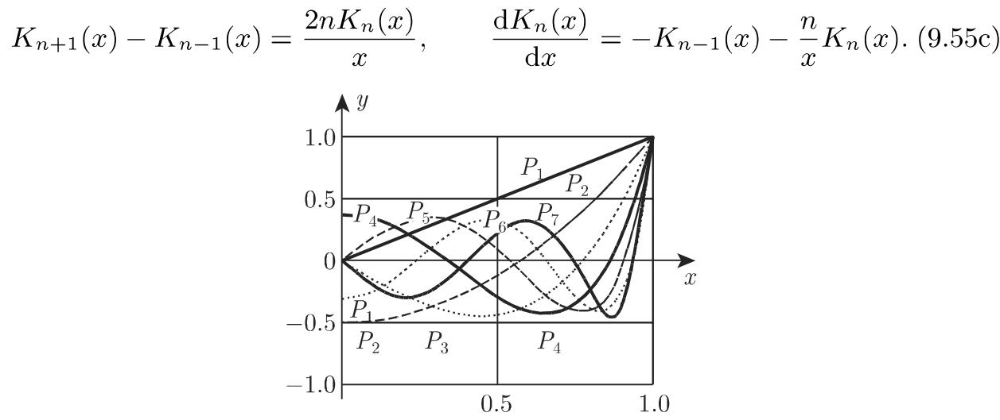

#### 9.1.2 高阶微分方程和微分方程组

9.1.2.1 基本结果

1. 解的存在性

(1) 化为微分方程组 对千每个显式 阶微分方程

$$
y ^ {(n)} = f (x, y, y ^ {\prime}, \dots , y ^ {(n - 1)}),\tag{9.22a}
$$

通过引进新变量

$$
y _ {1} = y ^ {\prime}, y _ {2} = y ^ {\prime \prime}, \dots , y _ {n - 1} = y ^ {(n - 1)},\tag{9.22b}
$$

可以把它化为 个一阶微分方程的一个方程组：

$$
\frac {\mathrm{d} y}{\mathrm{d} x} = y _ {1}, \frac {\mathrm{d} y _ {1}}{\mathrm{d} x} = y _ {2}, \dots , \frac {\mathrm{d} y _ {n - 1}}{\mathrm{d} x} = f (x, y, y _ {1}, \dots , y _ {n - 1}).\tag{9.22c}
$$

(2) 解组的存在性 比方程组 (9.22c) 更一般的，定义在一个区间 $x _ { 0 } - h \leqslant x \leqslant$ $x _ { 0 } + h$ 上，并在 $x = x _ { 0 }$ 处取预先给定初始值 $y _ { i } ( x _ { 0 } ) = y _ { i } ^ { 0 } ( i = 1 , 2 , \cdot \cdot , n )$ 的 $n$ 个微分方程的方程组

$$
\frac {\mathrm{d} y _ {i}}{\mathrm{d} x} = f _ {i} (x, y _ {1}, y _ {2}, \dots , y _ {n}) \quad (i = 1, 2, \dots , n)\tag{9.23a}
$$

有一个唯一的解组

$$
y _ {i} = y _ {i} (x) \quad (i = 1, 2, \dots , n),\tag{9.23b}
$$

如果诸函数 $f _ { i } ( x , y _ { 1 } , y _ { 2 } , \cdot \cdot \cdot , y _ { n } )$ ）关千所有变量是连续的，并且满足下述利普希茨条件

(3) 利普希茨条件 对千位千给定初始值的某个邻域中的 $x , y _ { i }$ 和 $y _ { i } + \Delta y _ { i } ( i =$ $1 , 2 , \cdots , n )$ ，诸函数 $f _ { i }$ 满足下述不等式

$$
\begin{array}{l} | f _ {i} (x, y _ {1} + \Delta y _ {1}, y _ {2} + \Delta y _ {2}, \dots , y _ {n} + \Delta y _ {n}) - f _ {i} (x, y _ {1}, y _ {2}, \dots , y _ {n}) | \\ \leqslant K (| \Delta y _ {1} | + | \Delta y _ {2} | + \dots + | \Delta y _ {n} |), \end{array}\tag{9.24a}
$$

其中 是一个公共常数（参见第 715 9.1.1.1, 2.).

这个事实蕴涵着，如果函数 $f ( x , y , y ^ { \prime } , \cdot \cdot \cdot , y ^ { ( n - 1 ) } )$ 是连续的，并且满足利普希茨条件 (9.24a) ，那么具有初始值 $y ( x _ { 0 } ) = y _ { 0 } , y ^ { \prime } ( x _ { 0 } ) = y _ { 0 } ^ { \prime } , \cdot \cdot \cdot , y ^ { ( n - 1 ) } ( x _ { 0 } ) = y _ { 0 } ^ { ( n - 1 ) }$ 的微分方程

$$
y ^ {(n)} = f \big (x, y, y ^ {\prime}, \dots , y ^ {(n - 1)} \big)\tag{9.24b}
$$

有一个唯一解，并且解是 次连续可微的．

2. 通解

(1) 微分方程 (9.24b) 的通解包含 个独立的任意常数：

$$
y = y \left(x, C _ {1}, C _ {2}, \dots , C _ {n}\right).\tag{9.25a}
$$

(2) 方程 (9.25a) 的儿何解释是，它定义了依赖千 个参数的一个曲线族．这些积分曲线中的每一条曲线，即相应的特解的图像，可以通过适当地选取常数

$C _ { 1 } , C _ { 2 } , \cdots , C _ { n }$ 而得到如果解必须满足上面所说的初始条件，那么 $C _ { 1 } , C _ { 2 } , \cdots , C _ { n }$ 的值由下述方程组所确定

$$
\begin{array}{c} y (x _ {0}, C _ {1}, \dots , C _ {n}) = y _ {0}, \\ \left[ \frac {\mathrm{d}}{\mathrm{d} x} y (x, C _ {1}, \dots , C _ {n}) \right] _ {x = x _ {0}} = y _ {0} ^ {\prime}, \\ \dots \dots \\ \left[ \frac {\mathrm{d} ^ {n - 1}}{\mathrm{d} x ^ {n - 1}} y (x, C _ {1}, \dots , C _ {n}) \right] _ {x = x _ {0}} = y _ {0} ^ {(n - 1)}. \end{array}\tag{9.25b}
$$

如果对千某个区域中的任意初始值，这些方程是不相容的，那么在这个区域中该解不是通解，即，不能独立地选取这些任意常数 $C _ { 1 } , C _ { 2 } , \cdots , C _ { n }$

(3) 方程组 (9.23a) 的通解也包含 个任意常数．可以用两种方式表示这个通解．或者以 个未知函数都被解出的形式给出：

$$
\begin{array}{l} y _ {1} = F _ {1} (x, C _ {1}, \dots , C _ {n}), y _ {2} = F _ {2} (x, C _ {1}, \dots , C _ {n}), \dots , \\ y _ {n} = F _ {n} (x, C _ {1}, \dots , C _ {n}), \end{array}\tag{9.26a}
$$

或者以 个常数都被解出的形式给出：

$$
\varphi_ {1} (x, y _ {1}, \dots , y _ {n}) = C _ {1}, \varphi_ {2} (x, y _ {1}, \dots , y _ {n}) = C _ {2}, \dots , \varphi_ {n} (x, y _ {1}, \dots , y _ {n}) = C _ {n}.\tag{9.26b}
$$

(9.26b) 的情形，每个关系式

$$
\varphi_ {i} (x, y _ {1}, \dots , y _ {n}) = C _ {i}\tag{9.26c}
$$

是方程组 (9.23a) 的一个首次积分 (first integral) ．可以用关系式 (9.26c) 独立千通解来定义首次积分．这也就是，用给定方程组的任意特解代替 $y _ { 1 } , y _ { 2 } , \cdots , y _ { n }$ , 并用这个特解所确定的诸任意常数 $C _ { i }$ 代替诸常数，则（9.26c) 将是一个恒等式．

如果已知 (9.26c) 形的任一首次积分，那么函数 $\varphi _ { i } ( x , y _ { 1 } , y _ { 2 } , \cdot \cdot \cdot , y _ { n } )$ ）满足偏微分方程

$$
\frac {\partial \varphi_ {i}}{\partial x} + f _ {1} (x, y _ {1}, \dots , y _ {n}) \frac {\partial \varphi_ {i}}{\partial y _ {1}} + \dots + f _ {n} (x, y _ {1}, \dots , y _ {n}) \frac {\partial \varphi_ {i}}{\partial y _ {n}} = 0.\tag{9.26d}
$$

反之偏微分方程 (9.26d) 的每个解 $\varphi _ { i } ( x , y _ { 1 } , \cdot \cdot \cdot , y _ { n } )$ ）定义了方程组 (9.23a)(9.26c) 形的一个首次积分．方程组 (9.23a) 的通解可以被表示为方程组 (9.23a)$n$ 个首次积分的组，如果相应的函数 $\varphi _ { i } ( x , y _ { 1 } , \cdot \cdot \cdot , y _ { n } ) ( i = 1 , 2 , \cdot \cdot \cdot , n )$ 是线性无关的（参见第 732 9.1.2.3, 2.).

9.1.2.2 降阶

$n$ 阶微分方程

$$
f (x, y, y ^ {\prime}, \dots , y ^ {(n)}) = 0\tag{9.27}
$$

最重要的解法之一是变量代换，以得到一个较为简单的微分方程，特别是得到一个低阶方程可以分类为不同的情形

l. $f = f ( y , y ^ { \prime } , \cdot \cdot \cdot , y ^ { ( n ) } )$ ），即 不显式地出现：

$$
f (y, y ^ {\prime}, \dots , y ^ {(n)}) = 0.\tag{9.28a}
$$

由代换

$$
\frac {\mathrm{d} y}{\mathrm{d} x} = p, \frac {\mathrm{d} ^ {2} y}{\mathrm{d} x ^ {2}} = p \frac {\mathrm{d} p}{\mathrm{d} y}, \dots\tag{9.28b}
$$

可以把微分方程 (9.28a) 的阶从 降到 $n - 1$

用代换 $y ^ { \prime } = p , p \mathrm { d } p / \mathrm { d } y = y ^ { \prime \prime }$ , 把微分方程 $y y ^ { \prime \prime } - y ^ { \prime 2 } = 0$ 的阶降为一阶，它变为一个一阶微分方程 $y p \mathrm { d } p / \mathrm { d } y - p ^ { 2 } = 0 .$ 并且 $y \mathrm { d } p / \mathrm { d } y - p = 0$ 导致 $p = C y =$ $\mathrm { d } y / \mathrm { d } x , y = C _ { 1 } \mathrm { e } ^ { C x }$ ．消去 $p$ 并不引起解的丢失，因为 $p = 0$ 给出解 $y = C _ { 1 }$ , 它被包含在 $C = 0$ 的通解中．

2. $f = f ( x , y ^ { \prime } , \cdot \cdot \cdot , y ^ { ( n ) } )$ ），即 $y$ 不显式地出现：

$$
f (x, y ^ {\prime}, \dots , y ^ {(n)}) = 0.\tag{9.29a}
$$

由代换

$$
y ^ {\prime} = p\tag{9.29b}
$$

可以把微分方程 (9.29a) 的阶从 降到 $n - 1$ . 如果在方程 (9.29a) 中不出现前阶导数，那么一个适当的代换是

$$
y ^ {(k + 1)} = p.\tag{9.29c}
$$

对千微分方程 $y ^ { \prime \prime } - x y ^ { \prime \prime \prime } + ( y ^ { \prime \prime \prime } ) ^ { 3 } = 0$ 用代换 $y ^ { \prime \prime } = p$ 它的阶将被降低，此时得到一个克莱罗微分方程 $p - x { \frac { \mathrm { d } p } { \mathrm { d } x } } + \left( { \frac { \mathrm { d } p } { \mathrm { d } x } } \right) ^ { 3 } = 0$ ，其通解为 $p = C _ { 1 } x + C _ { 1 } ^ { 3 }$ ．因而$y = \frac { C _ { 1 } x ^ { 3 } } { 6 } - \frac { C _ { 1 } ^ { 3 } x ^ { 2 } } { 2 } + C _ { 2 } x + C _ { 3 }$ 从上述克莱罗微分方程的奇解 $p = { \frac { 2 { \sqrt { 3 } } } { 9 } } x ^ { 3 / 2 }$ 得到原始方程的奇解 $y = \frac { 8 \sqrt { 3 } } { 3 1 5 } x ^ { 7 / 2 } + C _ { 1 } x + C _ { 2 }$

3. $f ( x , y , y ^ { \prime } , \cdots , y ^ { ( n ) } )$ 是 $y , y ^ { \prime } , \cdots , y ^ { ( n ) }$ ）的齐次函数（参见第 158 2.18.2.5,4.):

$$
f (x, y, y ^ {\prime}, \dots , y ^ {(n)}) = 0.\tag{9.30a}
$$

由代换

$$
z = \frac {y ^ {\prime}}{y}, \quad \text {即} \quad y = \mathrm{e} ^ {\int z \mathrm{d} x}\tag{9.30b}
$$

可以降阶．

·用代换 $z = y ^ { \prime } / y$ 变换微分方程 $y y ^ { \prime \prime } - y ^ { \prime 2 } = 0$ , 得到 ${ \frac { \mathrm { d } z } { \mathrm { d } x } } = { \frac { y y ^ { \prime \prime } - y ^ { \prime 2 } } { y ^ { 2 } } } = 0$ ，因而降低了一阶得到 $z = C _ { 1 }$ , 因而 $\ln | y | = C _ { 1 } x + C _ { 2 }$ 或者 $y = C \mathrm { e } ^ { C _ { 1 } x }$ ，其中$\ln | C | = C _ { 2 }$

4. $f = f ( x , y , y ^ { \prime } , \cdot \cdot \cdot , y ^ { ( n ) } )$ ）只是 的函数：

$$
y ^ {(n)} = f (x).\tag{9.31a}
$$

通过 次累次积分得到通解，它有形式

$$
y = C _ {1} + C _ {2} x + C _ {3} x ^ {2} + \dots + C _ {n} x ^ {n - 1} + \psi (x),\tag{9.31b}
$$

其中

$$
\psi (x) = \iint \dots \int f (x) (\mathrm{d} x) ^ {n} = \frac {1}{(n - 1) !} \int_ {x _ {0}} ^ {x} f (t) (x - t) ^ {n - 1} \mathrm{d} t.\tag{9.31c}
$$

在这里必须提到 $x _ { 0 }$ 不是一个附加的常数，由千关系式

$$
C _ {k} = \frac {1}{(k - 1) !} y ^ {(k - 1)} (x _ {0}),\tag{9.31d}
$$

$x _ { 0 }$ 的改变导致 $C _ { k }$ 的改变

9.1.2.3 阶线性微分方程

1. 分类

形如

$$
y ^ {(n)} + a _ {1} y ^ {(n - 1)} + a _ {2} y ^ {(n - 2)} + \dots + a _ {n - 1} y ^ {\prime} + a _ {n} y = F\tag{9.32}
$$

的微分方程被称为 阶线性微分方程．这里 $F$ 和诸系数 $a _ { i }$ 的函数，它们被假设在某个区间中是连续的．如果 $a _ { 1 } , a _ { 2 } , \cdots , a _ { n }$ 是常数，则 (9.32) 被称为常系数微分方程 (differential equation with constant coefficients) ．如果 $F \equiv 0$ 则该线性微分方程是齐次的 (homogeneous) ，如果 $F \not \equiv 0$ 则它是非齐次的 (inhomogeneous).

．基本解组

一个齐次线性微分方程的 个解 $y _ { 1 } , y _ { 2 } , \cdots , y _ { n }$ 的一个组被称为基本解组(fundamental system of solutions) ，如果在所考虑的区间上这些函数是线性无关的(linearly independent) ，即，它们的线性组合 $C _ { 1 } y _ { 1 } + C _ { 2 } y _ { 2 } + \cdot \cdot \cdot + C _ { n } y _ { n }$ 对千 $C _ { 1 }$ $C _ { 2 } , \cdots , C _ { n }$ 的任何值都不恒等千零，除非 $C _ { 1 } = C _ { 2 } = \cdot \cdot \cdot = C _ { n } = 0$ 一个线性齐次微分方程的解 $y _ { 1 } , y _ { 2 } , \cdots , y _ { n }$ 在所考虑的区间上形成一个基本组，当且仅当它们的朗斯基行列式 (Wronskian determinant)

$$
W = \left| \begin{array}{c c c c} y _ {1} & y _ {2} & \dots & y _ {n} \\ y _ {1} ^ {\prime} & y _ {2} ^ {\prime} & \dots & y _ {n} ^ {\prime} \\ \vdots & \vdots & & \vdots \\ y _ {1} ^ {(n - 1)} & y _ {2} ^ {(n - 1)} & \dots & y _ {n} ^ {(n - 1)} \end{array} \right|\tag{9.33}
$$

非零．对千一个齐次线性微分方程的每个解组，刘维尔公式 (formula of Liouville)成立：

$$
W (x) = W (x _ {0}) \exp \bigg (- \int_ {x _ {0}} ^ {x} a _ {n - 1} (x) \mathrm{d} x \bigg).\tag{9.34}
$$

(9.34) 即得如果在解区间的某处朗斯基行列式为零，则它只能恒等千零．这意味着，对千齐次线性微分方程的 个解 $y _ { 1 } , y _ { 2 } , \cdots , y _ { n }$ 九，即使在所考虑区间的一个点处其朗斯基行列式为零： $W ( x _ { 0 } ) = 0$ 那么这 个解线性相关．如果 $n$ 个解$y _ { 1 } , y _ { 2 } , \cdots , y _ { n }$ 形成线性齐次微分方程 (9.32) 的一个基本解组，那么其通解由

$$
y = C _ {1} y _ {1} + C _ {2} y _ {2} + \dots + C _ {n} y _ {n}\tag{9.35}
$$

给出．当 $n$ 阶线性齐次微分方程诸系数函数 $a _ { i } ( x )$ 在一个区间中连续时，该方程在该区间上恰有 $n$ 个线性无关解．

3. 降阶

如果已知齐次微分方程的一个特解 $y _ { 1 }$ ，通过假设

$$
y = y _ {1} (x) u (x),\tag{9.36}
$$

从 $u ^ { \prime } ( x )$ 的一个 $n - 1$ 阶的齐次线性微分方程可以确定一些别的解．

4. 叠加原理

如果 $y _ { 1 }$ 和 $y _ { 2 }$ 是对千不同右端 $F _ { 1 }$ 和 $F _ { 2 }$ 的微分方程 (9.32) 的两个解，那么它们的和 $y _ { 1 } + y _ { 2 }$ 是右端为 $F _ { 1 } + F _ { 2 }$ 的同一个方程的解．从这个观察即得，为了得到一个非齐次微分方程的通解，只需把该非齐次微分方程的任一特解加上相应的齐次微分方程的通解即可

5. 分解定理

如果一个非齐次微分方程 (9.32) 有实系数，并且其右端是复的形如 $F = F _ { 1 } +$ $\mathrm { i } F _ { 2 }$ , 其中 $F _ { 1 }$ 和凡 $F _ { 2 }$ 实函数，则 (9.32) 的解 $y = y _ { 1 } + \mathrm { i } y _ { 2 }$ 也是复的，其中 $y _ { 1 }$ 和 $y _ { 2 }$ 分别是右端为 $F _ { 1 }$ 和 $F _ { 2 }$ 的非齐次微分方程 (9.32) 的解．

6. 非齐次微分方程借助千求积法的解

如果已知相应的齐次微分方程的基本解组 $y _ { 1 } , y _ { 2 } , \cdots , y _ { n }$ ，那么有下述两种解法来继续获得非齐次微分方程的解．

(1) 常数变异法 寻找形如

$$
y = C _ {1} y _ {1} + C _ {2} y _ {2} + \dots + C _ {n} y _ {n}\tag{9.37a}
$$

的解，其中 $C _ { 1 } , C _ { 2 } , \cdots , C _ { n }$ 是 $x$ 的函数有无穷多个这样的函数，但要求它们满足方程组

$$
\begin{array}{c} C _ {1} ^ {\prime} y _ {1} + C _ {2} ^ {\prime} y _ {2} + \dots + C _ {n} ^ {\prime} y _ {n} = 0, \\ C _ {1} ^ {\prime} y _ {1} ^ {\prime} + C _ {2} ^ {\prime} y _ {2} ^ {\prime} + \dots + C _ {n} ^ {\prime} y _ {n} ^ {\prime} = 0, \\ \dots \dots \end{array}\tag{9.37b}
$$

$$
C _ {1} ^ {\prime} y _ {1} ^ {(n - 2)} + C _ {2} ^ {\prime} y _ {2} ^ {(n - 2)} + \dots + C _ {n} ^ {\prime} y _ {n} ^ {(n - 2)} = 0,
$$

把 $y$ 代入 (9.32)，由千这些等式，得到

$$
C _ {1} ^ {\prime} y _ {1} ^ {(n - 1)} + C _ {2} ^ {\prime} y _ {2} ^ {(n - 1)} + \dots + C _ {n} ^ {\prime} y _ {n} ^ {(n - 1)} = F.\tag{9.37c}
$$

因为线性方程组 (9.37b) (9.37c) 系数的朗斯基行列式不等千零，因此对千未知函数 $C _ { 1 } ^ { \prime } , C _ { 2 } ^ { \prime } , \cdots , C _ { n } ^ { \prime }$ 得到一个唯一解，它们的积分就给出 $C _ { 1 } , C _ { 2 } , \cdots , C _ { n }$

$$
y ^ {\prime \prime} + \frac {x}{1 - x} y ^ {\prime} - \frac {1}{1 - x} y = x - 1.\tag{9.37d}
$$

在区间 $x > 1$ 或 $x < 1$ 中，关千系数的所有假设都被满足．首先求解齐次方程${ \overline { { y } } } ^ { \prime \prime } + { \frac { x } { 1 - x } } { \overline { { y } } } ^ { \prime } - { \frac { 1 } { 1 - x } } { \overline { { y } } } = 0$ ．它的一个特解 $\varphi _ { 1 } = \mathrm { e } ^ { x }$ 巴然后寻找形如 $\varphi _ { 2 } = \mathrm { e } ^ { x } u ( x )$ 的第 个特解，利用记号 $u ^ { \prime } ( x ) = v ( x )$ ，得到一阶微分方程 $v ^ { \prime } + \left( 1 + \frac { 1 } { 1 - x } \right) v = 0$ 这个方程的一个解是 $v ( x ) = ( 1 - x ) \mathrm { e } ^ { - x }$ ，因而 $u ( x ) = \int v ( x ) \mathrm { d } x = \int ( 1 - x ) \mathrm { e } ^ { - x } \mathrm { d } x =$ ${ x } \mathrm { e } ^ { - x }$ 利用这个结果得到基本解组的第 个元素 $\varphi _ { 2 } ~ = ~ x$ 齐次方程的通解是$\overline { { y } } ( x ) = C _ { 1 } \mathrm { e } ^ { x } + C _ { 2 } x$ 用 $u _ { 1 } ( x )$ 和 $u _ { 2 } ( x )$ 代替 $C _ { 1 } ( x )$ 和 $C _ { 2 } ( x )$ 的常数变异得到

$$
\begin{array}{r l r l} & y (x) = u _ {1} (x) \mathrm{e} ^ {x} + u _ {2} (x) x, \\ & y ^ {\prime} (x) = u _ {1} (x) \mathrm{e} ^ {x} + u _ {2} (x) + u _ {1} ^ {\prime} (x) \mathrm{e} ^ {x} + u _ {2} ^ {\prime} (x) x, & & u _ {1} ^ {\prime} (x) \mathrm{e} ^ {x} + u _ {2} ^ {\prime} (x) x = 0, \\ & y ^ {\prime \prime} (x) = u _ {1} (x) \mathrm{e} ^ {x} + u _ {1} ^ {\prime} (x) \mathrm{e} ^ {x} + u _ {2} ^ {\prime} (x), & & u _ {1} ^ {\prime} (x) \mathrm{e} ^ {x} + u _ {2} ^ {\prime} (x) = x - 1, \end{array}
$$

因而

$$
u _ {1} ^ {\prime} (x) = x \mathrm{e} ^ {- x}, \quad u _ {2} ^ {\prime} (x) = - 1, \quad \text {即} \quad u _ {1} (x) = - (1 + x) \mathrm{e} ^ {- x} + C _ {1}, \quad u _ {2} (x) = - x + C _ {2}.
$$

利用这个结果，非齐次微分方程的通解为

$$
y (x) = - \left(1 + x ^ {2}\right) + C _ {1} \mathrm{e} ^ {x} + \left(C _ {2} - 1\right) x = - \left(1 + x ^ {2}\right) + C _ {1} ^ {*} \mathrm{e} ^ {x} + C _ {2} ^ {*} x.\tag{9.37e}
$$

(2) 柯西方法 在与 (9.32) 相伴的齐次微分方程的通解

$$
y = C _ {1} y _ {1} + C _ {2} y _ {2} + \dots + C _ {n} y _ {n}\tag{9.38a}
$$

中，对千任意参数 $\alpha ,$ ，要求满足方程组 $y = 0 , y ^ { \prime } = 0 , \cdot \cdot \cdot , y ^ { ( n - 2 ) } = 0 , y ^ { ( n - 1 ) } = F ( \alpha )$ 以确定其中的诸常数 $C _ { i }$ . 用这种方法得到齐次方程的一个特解，表示为 $\varphi ( x , \alpha )$ 此外，

$$
y = \int_ {x _ {0}} ^ {x} \varphi (x, \alpha) \mathrm{d} \alpha\tag{9.38b}
$$

是非齐次微分方程 (9.32) 的一个特解．这个解与其直到 $n - 1$ 阶导数在点 $x = x _ { 0 }$ 处皆为零

·用常数变异法解得与微分方程 (9.37d) 相伴的齐次方程的通解为 $y = C _ { 1 } \mathrm { e } ^ { x } +$ $C _ { 2 } x$ . 由此结果得到 $y ( \alpha ) = C _ { 1 } \mathrm { e } ^ { \alpha } + C _ { 2 } \alpha = 0 , y ^ { \prime } ( \alpha ) = C _ { 1 } \mathrm { e } ^ { \alpha } + C _ { 2 } = \alpha - 1$ 和$\varphi ( x , \alpha ) = \alpha \mathrm { e } ^ { - \alpha } \mathrm { e } ^ { x } - x$ 因而非齐次微分方程的满足 $y ( x _ { 0 } ) = y ^ { \prime } ( x _ { 0 } ) = 0$ 的特解是$y ( x ) = \int _ { x _ { 0 } } ^ { \infty } ( \alpha \mathrm { e } ^ { - \alpha } \mathrm { e } ^ { x } - x ) \mathrm { d } \alpha = ( x _ { 0 } + 1 ) \mathrm { e } ^ { x - x _ { 0 } } + ( x _ { 0 } - 1 ) x - x ^ { 2 } - 1$ . 利用这个结果可以得到非齐次微分方程的通解 $y ( x ) = C _ { 1 } ^ { * } \mathrm { e } ^ { x } + C _ { 2 } ^ { * } x - ( x ^ { 2 } + 1 )$

9.1.2.4 常系数线性微分方程的解

1. 运算符号

可以把微分方程 (9.32) 象征性地写为下述形式

$$
P _ {n} (D) y \equiv \left(D ^ {n} + a _ {1} D ^ {n - 1} + a _ {2} D ^ {n - 2} + \dots + a _ {n - 1} D + a _ {n}\right) y = F,\tag{9.39a}
$$

其中 是一个微分算子：

$$
D y = \frac {\mathrm{d} y}{\mathrm{d} x}, \quad D ^ {k} y = \frac {\mathrm{d} ^ {k} y}{\mathrm{d} x ^ {k}}.\tag{9.39b}
$$

如果诸系数 $a _ { i }$ 是常数，则 $P _ { n } ( D )$ 是算子 的一个 阶多项式．

2. 常系数齐次微分方程的解

为了确定 $F = 0$ 时的齐次微分方程 (9.39a) ，即

$$
P _ {n} (D) y = 0\tag{9.40a}
$$

的通解，必须找到特征方程

$$
P _ {n} (r) = r ^ {n} + a _ {1} r ^ {n - 1} + a _ {2} r ^ {n - 2} + \dots + a _ {n - 1} r + a _ {n} = 0\tag{9.40b}
$$

的诸根门， $r _ { 1 } , r _ { 2 } , \cdots , r _ { n }$ ．每个根确定了方 $P _ { n } ( D ) y = 0$ 的一个解 $\mathrm { e } ^ { r _ { i } x }$ ：．如果某个根$r _ { i }$ 有较高的重数 $k ,$ 则 $x \mathrm { e } ^ { r _ { i } x } , x ^ { 2 } \mathrm { e } ^ { r _ { i } x } , \cdot \cdot \cdot , x ^ { k - 1 } \mathrm { e } ^ { r _ { i } x }$ 是解．所有这些解的线性组合即为齐次微分方程的通解：

$$
y = C _ {1} \mathrm{e} ^ {r _ {1} x} + C _ {2} \mathrm{e} ^ {r _ {2} x} + \dots + \mathrm{e} ^ {r _ {i} x} \left(C _ {i} + C _ {i + 1} x + \dots + C _ {i + k - 1} x ^ {k - 1}\right) + \dots .\tag{9.40c}
$$

如果诸系数 $a _ { i }$ 都是实的，则特征方程的复根是成对共辄的，并有相同的重数．在此情形，对千 $r _ { 1 } = \alpha + \mathrm { i } \beta$ 和 $r _ { 2 } = \alpha - \mathrm { i } \beta$ ，可以用实函数 $\mathrm { e } ^ { \alpha x } \cos { \beta }$ 和 $\mathrm { e } ^ { \alpha x } \sin \beta$ 来代替相应的复值解函数 $\mathrm { e } ^ { r _ { 1 } x }$ 和 $\mathrm { e } ^ { r _ { 2 } x }$ ．可以把所得的的表达式 $C _ { 1 } \cos \beta x + C _ { 2 } \sin \beta x$ 写为 $A \cos ( \beta x + \varphi )$ ）形式其中 和 $\varphi$ 是常数

·微分方程 $y ^ { ( 6 ) } + y ^ { ( 4 ) } - y ^ { \prime \prime } - y = 0$ 的情形，特征方程是 $r ^ { 6 } + r ^ { 4 } - r ^ { 2 } - 1 = 0$ 其根为 $r _ { 1 } = 1 , r _ { 2 } = - 1 , r _ { 3 , 4 } = \mathrm { i } , r _ { 5 , 6 } = - \mathrm { i }$ ．可以用两种方式给出原方程的通解：

$$
y = C _ {1} \mathrm{e} ^ {x} + C _ {2} \mathrm{e} ^ {- x} + (C _ {3} + C _ {4} x) \cos x + (C _ {5} + C _ {6} x) \sin x,
$$

或

$$
y = C _ {1} \mathrm{e} ^ {x} + C _ {2} \mathrm{e} ^ {- x} + A _ {1} \cos (x + \varphi_ {1}) + x A _ {2} \cos (x + \varphi_ {2}).
$$

3. 赫尔维茨定理

在不同的应用中，例如，在振动理论中，对千常系数齐次微分方程，知道其解在$x \to \infty$ 时是否趋千零是重要的显然，如果特征方程 (9.40b) 所有根的实部都是负的，微分方程的解在 $x \longrightarrow \infty$ 时显然趋千零根据赫尔维茨 (Hurwitz) 定理，方程

$$
a _ {n} x ^ {n} + a _ {n - 1} x ^ {n - 1} + \dots + a _ {1} x + a _ {0} = 0\tag{9.41a}
$$

只有实部为负的根，当且仅当所有行列式（其中对千 $m > n$ 有 $a _ { m } = 0 )$

$$
D _ {1} = a _ {1}, D _ {2} = \left| \begin{array}{c c} a _ {1} & a _ {0} \\ a _ {3} & a _ {2} \end{array} \right|, D _ {3} = \left| \begin{array}{c c c} a _ {1} & a _ {0} & 0 \\ a _ {3} & a _ {2} & a _ {1} \\ a _ {5} & a _ {4} & a _ {3} \end{array} \right|, \dots ,
$$

$$
D _ {n} = \left| \begin{array}{c c c c c} a _ {1} & a _ {0} & 0 & \dots & 0 \\ a _ {3} & a _ {2} & a _ {1} & \dots & 0 \\ \vdots & \vdots & \vdots & & \vdots \\ 0 & 0 & 0 & \dots & a _ {n} \end{array} \right|\tag{9.41b}
$$

是正的．系数 $a _ { 1 } , a _ { 2 } , \cdot \cdot \cdot , a _ { k } ( k = 1 , 2 , \cdot \cdot \cdot , n )$ 位千行列式 $D _ { k }$ 的对角线上， $D _ { k }$ 中这些系数的下标从左到右是递减的．具有负指标的系数以及指标大千 的系数被置为零

·对千一个三次多项式，与 (9.14b) 一致的行列式有以下形式：

$$
D _ {1} = a _ {1}, \quad D _ {2} = \left| \begin{array}{c c} a _ {1} & a _ {0} \\ a _ {3} & a _ {2} \end{array} \right|, \quad D _ {3} = \left| \begin{array}{c c c} a _ {1} & a _ {0} & 0 \\ a _ {3} & a _ {2} & a _ {1} \\ 0 & 0 & a _ {3} \end{array} \right|.
$$

4. 常系数非齐次微分方程的解

由常数变异法或柯西方法或用算子方法（参见第 775 9.2.2.3, 5.）可以解常系数非齐次微分方程如果非齐次微分方程 (9.32) 的右端有特殊形式，那么可以容易地确定其一个特解

$$
F (x) = A \mathrm{e} ^ {\alpha x}, P _ {n} (\alpha) \neq 0 \quad \text {一个特解是}\tag{9.42a}
$$

$$
y = \frac {A \mathrm{e} ^ {\alpha x}}{P _ {n} (\alpha)}.\tag{9.42b}
$$

如果 $\alpha$ 是特征多项式的一个 重的根，即如果

$$
P _ {n} (\alpha) = P _ {n} ^ {\prime} (\alpha) = \dots = P _ {n} ^ {(m - 1)} (\alpha) = 0, \quad P _ {n} ^ {(m)} (\alpha) \neq 0,\tag{9.42c}
$$

则 $y = { \frac { A x ^ { m } \mathrm { e } ^ { \alpha x } } { P _ { n } ^ { ( m ) } ( \alpha ) } }$ 曰－定个特解当右端是

$$
F (x) = A \mathrm{e} ^ {\alpha x} \cos \omega x \quad \text {或} \quad A \mathrm{e} ^ {\alpha x} \sin \omega x\tag{9.42d}
$$

时，可以应用分解定理来利用这些公式相应的特解是具有右端为

$$
F (x) = A \mathrm{e} ^ {\alpha x} (\cos \omega x + \mathrm{i} \sin \omega x) = A \mathrm{e} ^ {(\alpha + \mathrm{i} \omega) x}\tag{9.42e}
$$

的同一个微分方程解的实部或虚部．

：对千微分方程 $y ^ { \prime \prime } - 6 y ^ { \prime } + 8 y = \mathrm { e } ^ { 2 x }$ 其特征多项式为 $P ( D ) = D ^ { 2 } - 6 D + 8$ ，有$P ( 2 ) = 0$ ，而 $P ^ { \prime } ( D ) = 2 D - 6$ ，有 $P ^ { \prime } ( 2 ) = 2 \cdot 2 - 6 = - 2$ 因而特解是 $y = - { \frac { x \mathrm { e } ^ { 2 x } } { 2 } }$ 微分方程 $y ^ { \prime \prime } + y ^ { \prime } + y = \mathrm { e } ^ { x } \sin x$ 导出方程 $( D ^ { 2 } + D + 1 ) y = \mathrm { e } ^ { ( 1 + \mathrm { i } ) x }$ \_ 由其解 $y =$ ${ \frac { \mathrm { e } ^ { ( 1 + \mathrm { i } ) x } } { ( 1 + \mathrm { i } ) ^ { 2 } + ( 1 + \mathrm { i } ) + 1 } } = { \frac { \mathrm { e } ^ { x } ( \cos x + \mathrm { i } \sin x ) } { 2 + 3 \mathrm { i } } }$ 得到一个特解 $y _ { 1 } = { \frac { \mathrm { e } ^ { x } } { 1 3 } } ( 2 \sin x - 3 \cos x )$ 这里 $y _ { 1 }$ 的虚部．

$$
F (x) = Q _ {n} (x) \mathrm{e} ^ {\alpha x}, Q _ {n} (x) \text {是一个} n \text {次多项式}\tag{9.43}
$$

总可以找到同一形式的一个特解，即 $y = R ( x ) \mathrm { e } ^ { \alpha x }$ \_ 是特征方程的一个 $m$ 重根时， $R ( x )$ 是乘以 $x ^ { m }$ 后得到的一个 次多项式．把多项式 $R ( x )$ 的系数看作未知量，并把特解表达式代入非齐次微分方程，就得到关千系数的一个线性方程组，并且这个方程组总有一个唯一解．

对千 $F ( x ) \ = \ Q _ { n } ( x )$ ，即 $\alpha \ = \ 0 .$ ，和 $F ( x ) \ = \ Q _ { n } ( x ) \mathrm { e } ^ { r x } \cos \omega x$ 或 $F ( x ) =$ $Q _ { n } ( x ) \mathrm { e } ^ { r x } \sin \omega x$ ，即 $\alpha ~ = ~ r \pm \mathrm { i } \omega$ 这些情形，这个方法是特别有用的 存在形如$y = x ^ { m } \mathrm { e } ^ { r x } [ M _ { n } ( x ) \cos \omega x + N _ { n } ( x ) \sin \omega x ]$ 的一个解

·与微分方程 $y ^ { ( 4 ) } + 2 y ^ { \prime \prime \prime } + y ^ { \prime \prime } = 6 x + 2 x \sin x$ 相伴的特征方程的根是 $k _ { 1 } = k _ { 2 } =$ $0 , k _ { 3 } = k _ { 4 } = - 1$ . 由千叠加原理（参见第 733 9.1.2.3, 4.），可以分别计算得到以右端的被加项为右端的非齐次微分方程的特解．对千第 个被加项，所给形式$y _ { 1 } = x ^ { 2 } ( a x + b )$ 的代入导致右端 $1 2 a + 2 b + 6 a x = 6 x$ , 因而 $a = 1 , b = - 6$ ．对千第个被加项作代换 $y _ { 2 } = ( c x + d ) \sin x + ( f x + g ) \cos x$ 由 $( 2 g + 2 f - 6 c + 2 f x ) \sin x -$ $( 2 c + 2 d + 6 f + 2 c x ) \cos x = 2 x \sin x$ 比较系数，得到 $c = 0 , d = - 3 , f = 1 , g = - 1$ 因而通解是 $y = c _ { 1 } + c _ { 2 } x - 6 x ^ { 2 } + x ^ { 3 } + ( c _ { 3 } x + c _ { 4 } ) \mathrm { e } ^ { - x } - 3 \sin x + ( x - 1 ) \cos x$

(3) 欧拉微分方程 欧拉微分方程

$$
\sum_ {k = 0} ^ {n} a _ {k} (c x + d) ^ {k} y ^ {(k)} = F (x)\tag{9.44a}
$$

在代换

$$
c x + d = \mathrm{e} ^ {t}\tag{9.44b}
$$

下可以被变为一个常系数线性微分方程

·微分方程 $x ^ { 2 } y ^ { \prime \prime } - 5 x y ^ { \prime } + 8 y = x ^ { 2 }$ 是欧拉微分方程 $n = 2$ 的一个特殊情形作代换 $x = \mathrm { e } ^ { t }$ ，它被变化为在第 737 中讨论的微分方程 ${ \frac { \mathrm { d } ^ { 2 } y } { \mathrm { d } t ^ { 2 } } } - 6 { \frac { \mathrm { d } y } { \mathrm { d } t } } + 8 y = \mathrm { e } ^ { 2 t }$ 其通解是 $y = C _ { 1 } \mathrm { e } ^ { 2 t } + C _ { 2 } \mathrm { e } ^ { 4 t } - { \frac { t } { 2 } } \mathrm { e } ^ { 2 t } = C _ { 1 } x ^ { 2 } + C _ { 2 } x ^ { 4 } - { \frac { x ^ { 2 } } { 2 } } \ln | x |$

9.1.2.5 常系数线性微分方程组

1. 正规形式

一阶常系数线性微分方程的下述简单情形被称为一个正规组 (normal system)或一个正规形式 (normal form):

$$
\left\{ \begin{array}{l l} y _ {1} ^ {\prime} = a _ {1 1} y _ {1} + a _ {1 2} y _ {2} + \dots + a _ {1 n} y _ {n}, \\ y _ {2} ^ {\prime} = a _ {2 1} y _ {1} + a _ {2 2} y _ {2} + \dots + a _ {2 n} y _ {n}, \\ \dots \dots \\ y _ {n} ^ {\prime} = a _ {n 1} y _ {1} + a _ {n 2} y _ {2} + \dots + a _ {n n} y _ {n}. \end{array} \right.\tag{9.45a}
$$

为了找到这样一个组的通解，首先必须找到其特征方程

$$
\left| \begin{array}{c c c c} a _ {1 1} - r & a _ {1 2} & \dots & a _ {1 n} \\ a _ {2 1} & a _ {2 2} - r & \dots & a _ {2 n} \\ \vdots & \vdots & & \vdots \\ a _ {n 1} & a _ {n 2} & \dots & a _ {n n} - r \end{array} \right| = 0\tag{9.45b}
$$

的根对千这个方程的每个单根 $r _ { i } .$ ，存在一个特解组

$$
y _ {1} = A _ {1} \mathrm{e} ^ {r _ {i} x}, y _ {2} = A _ {2} \mathrm{e} ^ {r _ {i} x}, \dots , y _ {n} = A _ {n} \mathrm{e} ^ {r _ {i} x},\tag{9.45c}
$$

其系数 $A _ { k } ( k = 1 , 2 , \cdots , n )$ 由齐次线性方程组

$$
\begin{array}{c} (a _ {1 1} - r _ {i}) A _ {1} + a _ {1 2} A _ {2} + \dots + a _ {1 n} A _ {n} = 0, \\ \dots \dots \\ a _ {n 1} A _ {1} + a _ {n 2} A _ {2} + \dots + (a _ {n n} - r _ {i}) A _ {n} = 0 \end{array}\tag{9.45d}
$$

所确定．这个方程组给出了诸系数 $A _ { k }$ 值之间的关系（参见第 412 4.5.2.1, 2.平凡解和基本解）．对千每个 $r _ { i } .$ ，用这个方法确定的特解将包含一个任意常数．如果特征方程的所有根是不同的则这些特解之和包含 个独立的任意常数，因而用这种方法就得到通解．如果特征方程的某个根 $r _ { i }$ 重根，那么相应千这个根的特解组有下述形式：

$$
y _ {1} = A _ {1} (x) \mathrm{e} ^ {r _ {i} x}, y _ {2} = A _ {2} (x) \mathrm{e} ^ {r _ {i} x}, \dots , y _ {n} = A _ {n} (x) \mathrm{e} ^ {r _ {i} x},\tag{9.45e}
$$

其中 $A _ { 1 } ( x ) , \cdots , A _ { n } ( x )$ 是至多为 $m - 1$ 次的多项式把这些表达式连同多项式$A _ { k } ( x )$ 的未知系数代入微分方程组，首先就可以消去因子 $\mathrm { e } ^ { r _ { i } x }$ ，接着比较 的不同幕次的系数，得到多项式未知系数的线性方程组，并且其中可以任意选取 m. 用这种方法就得到有 个任意常数的一部分解．多项式的次数可以小千 $m - 1$

在方程组 (9.45a) 是对称的，即在 $a _ { i k } = a _ { k i }$ 这一特殊情形时只需代换 $A _ { i } ( x ) =$ 常数即可对千特征方程的复根，用常系数微分方程情形中所示的相同方法（参见第735 9.1.2.4) 可以把通解变化为实形式

·方程组 $y _ { 1 } ^ { \prime } = 2 y _ { 1 } + 2 y _ { 2 } - y _ { 3 } , y _ { 2 } ^ { \prime } = - 2 y _ { 1 } + 4 y _ { 2 } + y _ { 3 } , y _ { 3 } ^ { \prime } = - 3 y _ { 1 } + 8 y _ { 2 } + 2 y _ { 3 }$ 的特征方程有形式

$$
\left| \begin{array}{c c c} 2 - r & 2 & - 1 \\ - 2 & 4 - r & 1 \\ - 3 & 8 & 2 - r \end{array} \right| = - (r - 6) (r - 1) ^ {2} = 0.
$$

对千单根 $r _ { 1 } = 6 .$ ，得到 $- 4 A _ { 1 } + 2 A _ { 2 } - A _ { 3 } = 0 , - 2 A _ { 1 } - 2 A _ { 2 } + A _ { 3 } = 0 , - 3 A _ { 1 } + 8 A _ { 2 } -$ $4 A _ { 3 } = 0$ ．从这个方程组得到 $\begin{array} { r } { A _ { 1 } = 0 , A _ { 2 } = \frac { 1 } { 2 } A _ { 3 } = C _ { 1 } , y _ { 1 } = 0 , y _ { 2 } = C _ { 1 } \mathrm { e } ^ { 6 x } , y _ { 3 } = } \end{array}$ $2 C _ { 1 } \mathrm { e } ^ { 6 x }$ ．对千二重根 $r _ { 2 } = 1$ 得到 $y _ { 1 } = ( P _ { 1 } x + Q _ { 1 } ) \mathrm { e } ^ { x } , y _ { 2 } = ( P _ { 2 } x + Q _ { 2 } ) \mathrm { e } ^ { x } , y _ { 3 } =$ $( P _ { 3 } x + Q _ { 3 } ) \mathrm { e } ^ { x }$ . 把它们代入微分方程得到方程组

$$
\begin{array}{r l} & P _ {1} x + (P _ {1} + Q _ {1}) = (2 P _ {1} + 2 P _ {2} - P _ {3}) x + (2 Q _ {1} + 2 Q _ {2} - Q _ {3}), \\ & P _ {2} x + (P _ {2} + Q _ {2}) = (- 2 P _ {1} + 4 P _ {2} + P _ {3}) x + (- 2 Q _ {1} + 4 Q _ {2} + Q _ {3}), \\ & P _ {3} x + (P _ {3} + Q _ {3}) = (- 3 P _ {1} + 8 P _ {2} + 2 P _ {3}) x + (- 3 Q _ {1} + 8 Q _ {2} + 2 Q _ {3}), \end{array}
$$

它蕴涵着 $P _ { 1 } = 5 C _ { 2 } , P _ { 2 } = C _ { 2 } , P _ { 3 } = 7 C _ { 2 } , Q _ { 1 } = 5 C _ { 3 } - 6 C _ { 2 } , Q _ { 2 } = C _ { 3 } , Q _ { 3 } = 7 C _ { 3 } -$ $1 1 C _ { 2 }$ ．通解为 $y _ { 1 } = ( 5 C _ { 2 } x + 5 C _ { 3 } - 6 C _ { 2 } ) \mathrm { e } ^ { x } , y _ { 2 } = C _ { 1 } \mathrm { e } ^ { 6 x } + ( C _ { 2 } x + C _ { 3 } ) \mathrm { e } ^ { x } , y _ { 3 } =$ $2 C _ { 1 } \mathrm { e } ^ { 6 x } + ( 7 C _ { 2 } x + 7 C _ { 3 } - 1 1 C _ { 2 } ) \mathrm { e } ^ { x }$

2. 常系数一阶齐次线性微分方程组

常系数一阶齐次线性微分方程组的一般形式为

$$
\sum_ {k = 1} ^ {n} a _ {i k} y _ {k} ^ {\prime} + \sum_ {k = 1} ^ {n} b _ {i k} y _ {k} = 0 (i = 1, 2, \dots , n).\tag{9.46a}
$$

如果行列式 $\operatorname* { d e t } ( a _ { i k } )$ 不为零，即

$$
\det (a _ {i k}) \neq 0,\tag{9.46b}
$$

那么可以把方程组 (9.46a) 变化为正规形式 (9.45a).

在 $\operatorname* { d e t } ( a _ { i k } ) = 0$ 的情形，进一步的研究是必要的（参见 [9.26]).

用正规形式情形中所示的相同方法可以对上述一般形式确定其解．

特征方程有形式

$$
\det (a _ {i k} r + b _ {i k}) = 0.\tag{9.46c}
$$

相应千一个单根 $r _ { j }$ 的解，（9.45c) 中的系数 $A _ { i }$ 由方程组

$$
\sum_ {k = 1} ^ {n} \left(a _ {i k} r _ {j} + b _ {i k}\right) A _ {k} = 0 (i = 1, 2, \dots , n)\tag{9.46d}
$$

所确定．除此之外，如同在正规形式情形中相同的想法可以得到解的方法．

·两个方程 $5 y _ { 1 } ^ { \prime } + 4 y _ { 1 } - 2 y _ { 2 } ^ { \prime } - y _ { 2 } = 0 , y _ { 1 } ^ { \prime } + 8 y _ { 1 } + - 3 y _ { 2 } = 0$ 的特征方程是

$$
\left| \begin{array}{c c} 5 r + 4 & - 2 r - 1 \\ r + 8 & - 3 \end{array} \right| = 2 r ^ {2} + 2 r - 4 = 0, r _ {1} = 1, r _ {2} = - 2.
$$

对千 $r _ { 1 } = 1$ 的系数 $A _ { 1 }$ 和 $A _ { 2 }$ 可以从方程 $9 A _ { 1 } - 3 A _ { 2 } = 0 , 9 A _ { 1 } - 3 A _ { 2 } = 0$ 得到因而 $A _ { 2 } ~ = ~ 3 A _ { 1 } ~ = ~ 3 C _ { 1 }$ . 对千 $r _ { 2 } ~ = ~ - 2$ 得到 $\overline { { { A } } } _ { 2 } ~ = ~ 2 \overline { { { A } } } _ { 1 } ~ = ~ 2 C _ { 2 }$ ．通解为$y _ { 1 } = C _ { 1 } \mathrm { e } ^ { x } + C _ { 2 } \mathrm { e } ^ { - 2 x } , y _ { 2 } = 3 C _ { 1 } \mathrm { e } ^ { x } + 2 C _ { 2 } \mathrm { e } ^ { - 2 x }$

3. 一阶非齐次线性微分方程组

一阶非齐次线性微分方程组的一般形式为

$$
\sum_ {k = 1} ^ {n} a _ {i k} y _ {k} ^ {\prime} + \sum_ {k = 1} ^ {n} b _ {i k} y _ {k} = F _ {i} (x) \quad (i = 1, 2, \dots , n).\tag{9.47}
$$

(1) 叠加原理如果 $y _ { j } ^ { ( 1 ) }$ $y _ { j } ^ { ( 2 ) } ( j = 1 , 2 , \cdots , n )$ 是右端为 $F _ { i } ^ { ( 1 ) }$ 和 $F _ { i } ^ { ( 2 ) }$ 的非齐次微分方程组的解，则 $y _ { j } = y _ { j } ^ { ( 1 ) } + y _ { j } ^ { ( 2 ) } ( j = 1 , 2 , \cdot \cdot , n )$ 是右端为 $F _ { i } ( x ) =$ $F _ { i } ^ { ( 1 ) } ( x ) + F _ { i } ^ { ( 2 ) } ( x )$ 的该方程组的一个解由此，为了得到非齐次方程组的通解，只需把该组的一个特解加到相应的齐次方程组的通解上即可．

(2) 常数变异法 可以被用千得到非齐次微分方程组的一个特解．为此．用到齐次微分方程组的通解，并把诸常数 $C _ { 1 } , C _ { 2 } , \cdots , C _ { n }$ 看作为未知函数 $C _ { 1 } ( x )$ $C _ { 2 } ( x ) , \cdot \cdot \cdot , C _ { n } ( x )$ ．再把它们代入非齐次方程组．在诸导数 $y _ { k } ^ { \prime }$ 的表达式中有诸新未知函数 $C _ { k } ( x )$ 的导数由千 $y _ { 1 } , y _ { 2 } , \cdots , y _ { n }$ 是齐次方程组的解，因而包含新未知函数的项将被消去．这就对诸函数 $C _ { k } ^ { \prime } ( x )$ 给出了一个非齐次线性代数方程组，这个方程组总有一个唯一解．在 次积分后就得到函数 $C _ { 1 } ( x ) , C _ { 2 } ( x ) , \cdots , C _ { n } ( x )$ ．把它们代替常数 $C _ { 1 } , C _ { 2 } , \cdots , C _ { n }$ 代入齐次方程组的解之，就得到非齐次方程组的特解．

·对千非齐次微分方程组 $5 y _ { 1 } ^ { \prime } + 4 y _ { 1 } - 2 y _ { 2 } ^ { \prime } - y _ { 2 } = \mathrm { e } ^ { - x } , y _ { 1 } ^ { \prime } + 8 y _ { 1 } - 3 y _ { 2 } = 5 \mathrm { e } ^ { - x }$ ，齐次方程组的通解为 $y _ { 1 } = C _ { 1 } \mathrm { e } ^ { x } + C _ { 2 } \mathrm { e } ^ { - 2 x } , y _ { 2 } = 3 C _ { 1 } \mathrm { e } ^ { x } + 2 C _ { 2 } \mathrm { e } ^ { - 2 x }$ ．把常数 $C _ { 1 }$ 和 $C _ { 2 }$ 看作的函数，并把它们代入原始方程得到 $5 C _ { 1 } ^ { \prime } \mathrm { e } ^ { x } + 5 C _ { 2 } ^ { \prime } \mathrm { e } ^ { - 2 x } - 6 C _ { 1 } ^ { \prime } \mathrm { e } ^ { x } - 4 C _ { 2 } ^ { \prime } \mathrm { e } ^ { - 2 x } =$ $\mathrm { e } ^ { - x } , C _ { 1 } ^ { \prime } \mathrm { e } ^ { x } + C _ { 2 } ^ { \prime } \mathrm { e } ^ { - 2 x } = 5 \mathrm { e } ^ { - x }$ 或 $C _ { 2 } ^ { \prime } \mathrm { e } ^ { - 2 x } - C _ { 1 } ^ { \prime } \mathrm { e } ^ { - x } = \mathrm { e } ^ { - x } , C _ { 1 } ^ { \prime } \mathrm { e } ^ { x } + C _ { 2 } ^ { \prime } \mathrm { e } ^ { - 2 x } = 5 \mathrm { e } ^ { - x }$ ．因而 $2 C _ { 1 } ^ { \prime } \mathrm { e } ^ { x } = 4 \mathrm { e } ^ { - x } , C _ { 1 } = - \mathrm { e } ^ { - 2 x } +$ 常数， $2 C _ { 2 } ^ { \prime } \mathrm { e } ^ { - 2 x } = 6 \mathrm { e } ^ { - x } , C _ { 2 } = 3 \mathrm { e } ^ { x } +$ 常数．因为在寻找一个特解，因此可以把每个常数取为零，其结果为 $y _ { 1 } = 2 \mathrm { e } ^ { - x } , y _ { 2 } = 3 \mathrm { e } ^ { - x }$ ．最后，通解即为 $y _ { 1 } = 2 \mathrm { e } ^ { - x } + C _ { 1 } \mathrm { e } ^ { x } + C _ { 2 } \mathrm { e } ^ { - 2 x } , y _ { 2 } = 3 \mathrm { e } ^ { - x } + 3 C _ { 1 } \mathrm { e } ^ { x } + 2 C _ { 2 } \mathrm { e } ^ { - 2 x }$

(3) 未知系数法 是特别有用的，如果右端是一个形如 $Q _ { n } ( x ) \mathrm { e } ^ { \alpha x }$ 的特别的函数．它有类似千用千 阶微分方程的应用．

(4) 二阶组 上面引进的方法也可以用千高阶微分方程组．对千方程组

$$
\sum_ {k = 1} ^ {n} a _ {i k} y _ {k} ^ {\prime \prime} + \sum_ {k = 1} ^ {n} b _ {i k} y _ {k} ^ {\prime} + \sum_ {k = 1} ^ {n} c _ {i k} y _ {k} = 0 (i = 1, 2, \dots , n)\tag{9.48}
$$

可以确定形如 $y _ { i } = A _ { i } \mathrm { e } ^ { r _ { i } x }$ 的特解．为此，从特征方程 $\operatorname* { d e t } ( a _ { i k } r ^ { 2 } + b _ { i k } r + c _ { i k } ) = 0$ 得到 $r _ { i }$ ，并从相应的齐次线性代数方程组得到 $A _ { i }$

9.1.2.6 二阶线性微分方程

许多特殊的微分方程属千这一类，它们经常出现在具体应用中．这一节讨论它们中的一些方程．至千一些表示法、性质和解法请见 [9.26].

1. 一般方法

(1) 借助千叠加原理解非齐次微分方程

$$
y ^ {\prime \prime} + p (x) y ^ {\prime} + q (x) y = F (x).\tag{9.49a}
$$

为了得到一个非齐次微分方程的通解，只需把该非齐次微分方程的一个特解加到相应的齐次微分方程的通解上即可．

a) 相应的齐次微分方程（即其中 $F ( x ) \equiv 0 )$ 的通解是

$$
y = C _ {1} y _ {1} + C _ {2} y _ {2}.\tag{9.49b}
$$

这里 $y _ { 1 }$ 和 $y _ { 2 }$ (9.49a) 的两个线性无关的特解（参见第 732 9.1.2.3, 2. ）．如果已经知道一个特解 $y _ { 1 }$ ，那么第 个特解 $y _ { 2 }$ 可以由刘维尔方程 (9.34) 所确定．从(9.34) 即得

$$
\left| \begin{array}{c c} y _ {1} & y _ {2} \\ y _ {1} ^ {\prime} & y _ {2} ^ {\prime} \end{array} \right| = y _ {1} y _ {2} ^ {\prime} - y _ {1} ^ {\prime} y _ {2} = y _ {1} ^ {2} \frac {y _ {1} y _ {2} ^ {\prime} - y _ {1} ^ {\prime} y _ {2}}{y _ {1} ^ {2}} = y _ {1} ^ {2} \bigg (\frac {y _ {2}}{y _ {1}} \bigg) ^ {\prime} = A \exp \left(- \int p (x) \mathrm{d} x\right),\tag{9.49c}
$$

它给出了

$$
y _ {2} = A y _ {1} \int \frac {\exp \left(- \int p (x) \mathrm{d} x\right)}{y _ {1} ^ {2}} \mathrm{d} x,\tag{9.49d}
$$

其中的 可以任意选取．

b) 由公式

$$
y = \frac {1}{A} \int_ {x _ {0}} ^ {x} F (\xi) \exp \left(\int p (\xi) \mathrm{d} \xi\right) [ y _ {2} (x) y _ {1} (\xi) - y _ {1} (x) y _ {2} (\xi) ] \mathrm{d} \xi ,\tag{9.49e}
$$

可以确定非齐次方程的一个特解，其中 $y _ { 1 }$ 和 $y _ { 2 }$ 是相应的齐次微分方程的两个特解．

c) 也可以用常数变异法（参见第 733 9.1.2.3, 6.) 来确定非齐次微分方程的一个特解

(2) 用待定系数法解非齐次微分方程

$$
s (x) y ^ {\prime \prime} + p (x) y ^ {\prime} + q (x) y = F (x).\tag{9.50a}
$$

如果诸函数 $s ( x ) , p ( x ) , q ( x )$ 和 $F ( x )$ 是多项式，或者在围绕使得 $s ( x _ { 0 } ) \neq 0$ 的点 $x _ { 0 }$ 的某个区域中它们可被展开为收敛幕级数，那么这个微分方程的解也可被展开为类似的级数，并且这些级数在同一区域中收敛在这种情形，这些级数被用待定系数法所确定作为级数，所求之解有形式

$$
y = a _ {0} + a _ {1} (x - x _ {0}) + a _ {2} (x - x _ {0}) ^ {2} + \dots ,\tag{9.50b}
$$

并且必须将其代入微分方程 (9.50a)．令相应的 $( ( x - x _ { 0 } )$ 的同次幕）系数相等，就得到确定诸系数 $a _ { 0 } , a _ { 1 } , a _ { 2 } , \cdots$ ·的方程组．

·为了解微分方程 $y ^ { \prime \prime } + x y = 0$ 作代换 $y = a _ { 0 } + a _ { 1 } x + a _ { 2 } x ^ { 2 } + a _ { 3 } x ^ { 3 } + \cdots , y ^ { \prime } =$ $a _ { 1 } + 2 a _ { 2 } x + 3 a _ { 3 } x ^ { 2 } + \cdot \cdot$ .和 $y ^ { \prime \prime } = 2 a _ { 2 } + 6 a _ { 3 } x + \cdot \cdot \cdot$ ，得到 $2 a _ { 2 } = 0 , 6 a _ { 3 } + a _ { 0 } = 0 , \cdots$ 这些方程的解是 $a _ { 2 } = 0 , a _ { 3 } = - { \frac { a _ { 0 } } { 2 \cdot 3 } } , a _ { 4 } = - { \frac { a _ { 1 } } { 3 \cdot 4 } } , a _ { 5 } = 0 , \cdot \cdot \cdot$ ．．，因而原方程的解是

$$
y = a _ {0} \left(1 - \frac {x ^ {3}}{2 \cdot 3} + \frac {x ^ {6}}{2 \cdot 3 \cdot 5 \cdot 6} - \dots\right) + a _ {1} \left(x - \frac {x ^ {4}}{3 \cdot 4} + \frac {x ^ {7}}{3 \cdot 4 \cdot 6 \cdot 7} - \dots\right).
$$

(3) 齐次微分方程

$$
x ^ {2} y ^ {\prime \prime} + x p (x) y ^ {\prime} + q (x) y = 0\tag{9.51a}
$$

可以通过待定系数法求解，如果函数 $p ( x )$ 和 $q ( x )$ 可以被展开为 的收敛幕级数．解有形式

$$
y = x ^ {r} (a _ {0} + a _ {1} x + a _ {2} x ^ {2} + \dots),\tag{9.51b}
$$

从定义方程 (defining equation)

$$
r (r - 1) + p (0) r + q (0) = 0\tag{9.51c}
$$

可以确定指数 r. 如果定义方程的两个根是不同的，并且其差不是整数，那么就得到(9.51a) 的两个线性无关解．否则，待定系数法只能产生一个解．此时借助千 (9.49b)可以得到第 个解，或者至少可以用待定系数法找到第 个解的形式

·对千贝塞尔 (Bessel) 微分方程 (9.52a)，用待定系数法只得到一个解，形如 $y _ { 1 } =$ $\textstyle \sum _ { k = 0 } ^ { \infty } a _ { k } x ^ { n + 2 k } ( a _ { 0 } \neq 0 )$ ，它与 $J _ { n } ( x )$ 至多相差一个常数因子．由千 $\exp \Big ( - \int p \mathrm { d } \boldsymbol { x } \Big ) =$

$\frac { 1 } { x }$ ，利用 (9.49d) 得到第 个解

$$
y _ {2} = A y _ {1} \int \frac {\mathrm{d} x}{x \cdot x ^ {2 n} \left(\sum a _ {k} x ^ {2 k}\right) ^ {2}} = A y _ {1} \int \frac {\sum_ {k = 0} ^ {\infty} c _ {k} x ^ {2 k}}{x ^ {2 n + 1}} \mathrm{d} x = B y _ {1} \ln | x | + x ^ {- n} \sum_ {k = 0} ^ {\infty} d _ {k} x ^ {2 k}.
$$

从诸 $a _ { k }$ 确定未知系数 $c _ { k }$ 和 $d _ { k }$ 是困难的．但是可以用最后的表达式借助千待定系数法来得到解显然这个形式是函数 $Y _ { n } ( x )$ 的级数展开式 (9.53c).

2. 贝塞尔微分方程

$$
x ^ {2} y ^ {\prime \prime} + x y ^ {\prime} + (x ^ {2} - n ^ {2}) y = 0.\tag{9.52a}
$$

(1) 定义方程 在此情形的定义方程是

$$
r (r - 1) + r - n ^ {2} \equiv r ^ {2} - n ^ {2} = 0,\tag{9.52b}
$$

因而 $r = \pm n$ .

$$
y = x ^ {n} (a _ {0} + a _ {1} x + \dots)\tag{9.52c}
$$

代入方程 (9.52a) ，并让 $x ^ { n + k }$ 的系数等千零，得到

$$
k (2 n + k) a _ {k} + a _ {k - 2} = 0.\tag{9.52d}
$$

对千 $k = 1$ 得到 $( 2 n + 1 ) a _ { 1 } = 0$ ．对千 $k = 2 , 3 , \cdots$ ·，得到

$$
a _ {2 m + 1} = 0 \quad (m = 1, 2, \dots), \quad a _ {2} = - \frac {a _ {0}}{2 (2 n + 2)},
$$

$$
a _ {4} = \frac {a _ {0}}{2 \cdot 4 \cdot (2 n + 2) (2 n + 4)}, \dots , a _ {0} \text {是任意的}.\tag{9.52e}
$$

(2) 贝塞尔函数或柱面函数上面对千 $a _ { 0 } = \frac { 1 } { 2 ^ { n } \Gamma ( n + 1 ) }$ 所得的的级数是贝塞尔微分方程 (9.52a) 对千 的整数值的一个特解，这里 函数（参见第 6828.2.5, 6. ）．这个特解定义了指数 的第一类贝塞尔函数 (Bessel function) 或柱面函数 (cylindrical function) $J _ { n } ( x )$

$$
\begin{array}{l} J _ {n} (x) = \frac {x ^ {n}}{2 ^ {n} \Gamma (n + 1)} \left(1 - \frac {x ^ {2}}{2 (2 n + 2)} + \frac {x ^ {4}}{2 \cdot 4 \cdot (2 n + 2) (2 n + 4)} - \dots\right) \\ = \sum_ {k = 0} ^ {\infty} \frac {(- 1) ^ {k} \left(\frac {x}{2}\right) ^ {n + 2 k}}{k ! \Gamma (n + k + 1)}. \end{array} \tag {（}\tag{9.53a}
$$

在图 9.12中展示了函数 $J _ { 0 }$ 和 $J _ { 1 }$ 的图像．

对千非整数 $n ,$ ，贝塞尔微分方程的通解有形式

$$
y = C _ {1} J _ {n} (x) + C _ {2} J _ {- n} (x),\tag{9.53b}
$$

其中 $J _ { - n } ( x )$ 由在 $J _ { n } ( x )$ 的级数表达式中以— 代替 所得到的无穷级数所定义．对千整数 成立 $J _ { - n } ( x ) = ( - 1 ) ^ { n } J _ { n } ( x )$ ．在这个情形，通解中的项 $J _ { - n } ( x )$ 应该被第二类贝塞尔函数

$$
Y _ {n} (x) = \lim _ {m \to n} \frac {J _ {m} (x) \cos m \pi - J _ {- m} (x)}{\sin m \pi}\tag{9.53c}
$$

  
9.12

  
9.13

所代替， $Y _ { n } ( x )$ 也被称为韦伯函数 (Weber function). $Y _ { n } ( x )$ 的级数展开请参见[9.26] ．在图 9.13 中展示了函数 $Y _ { 0 }$ 和 $Y _ { 1 }$ 的图像．

(3) 虚变量的贝塞尔函数 在某些应用中，要用到纯虚变量的贝塞尔函数．在这个情形要考虑乘积 $\mathrm { i } ^ { - n } J _ { n } ( \mathrm { i } x )$ ，它也被表示为 $I _ { n } ( x )$

$$
I _ {n} (x) = \mathrm{i} ^ {- n} J _ {n} (\mathrm{i} x) = \frac {\left(\frac {x}{2}\right) ^ {n}}{\Gamma (n + 1)} + \frac {\left(\frac {x}{2}\right) ^ {n + 2}}{1 ! \Gamma (n + 2)} + \frac {\left(\frac {x}{2}\right) ^ {n + 4}}{2 ! \Gamma (n + 3)} + \dots .\tag{9.54a}
$$

诸函数 $I _ { n } ( x )$ 是微分方程

$$
x ^ {2} y ^ {\prime \prime} + x y ^ {\prime} - (x ^ {2} + n ^ {2}) y = 0\tag{9.54b}
$$

的解．这个微分方程的第 个解是麦克唐纳函数 (MacDonald function) $K _ { n } ( x )$

$$
K _ {n} (x) = \frac {\pi}{2} \frac {I _ {- n} (x) - I _ {n} (x)}{\sin n \pi}.\tag{9.54c}
$$

收敛到一个整数时这个表达式也收敛．

函数 $I _ { n } ( x )$ 和 $K _ { n } ( x )$ 被称为变形贝塞尔函数 (modified Bessel function) ．在9.14中展示了函数 $I _ { 0 }$ 和 $I _ { 1 }$ 的图像；在图 9.15中展示了函数 $K _ { 0 }$ 和 $K _ { 1 }$ 的图像第 1427 页表 21.11 给出了函数 $J _ { 0 } ( x ) , J _ { 1 } ( x ) , Y _ { 0 } ( x ) , Y _ { 1 } ( x ) , I _ { 0 } ( x ) , I _ { 1 } ( x ) , K _ { 0 } ( x )$ 和 $K _ { 1 } ( x )$ 的值

  
9.14

  
9.15

(4) 贝塞尔函数 $J _ { n } ( x )$ 的重要公式

$$
J _ {n - 1} (x) + J _ {n + 1} (x) = \frac {2 n}{x} J _ {n} (x), \quad \frac {\mathrm{d} J _ {n} (x)}{\mathrm{d} x} = - \frac {n}{x} J _ {n} (x) + J _ {n - 1} (x).\tag{9.55a}
$$

对千韦伯函数，公式 (9.55a) 也成立

$$
I _ {n - 1} (x) - I _ {n + 1} (x) = \frac {2 n I _ {n} (x)}{x}, \quad \frac {\mathrm{d} I _ {n} (x)}{\mathrm{d} x} = I _ {n - 1} (x) - \frac {n}{x} I _ {n} (x),\tag{9.55b}
$$

(9.55c)

  
9.16

对千整数 $n ,$ ，下述一些公式成立：

$$
J _ {2 n} (x) = \frac {2}{\pi} \int_ {0} ^ {\pi / 2} \cos (x \sin \varphi) \cos 2 n \varphi \mathrm{d} \varphi ,\tag{9.55d}
$$

$$
J _ {2 n + 1} (x) = \frac {2}{\pi} \int_ {0} ^ {\pi / 2} \sin (x \sin \varphi) \sin (2 n + 1) \varphi \mathrm{d} \varphi ,\tag{9.55e}
$$

或者，用复形式表示：

$$
J _ {n} (x) = \frac {- (\mathrm{i}) ^ {n}}{\pi} \int_ {0} ^ {\pi} \mathrm{e} ^ {\mathrm{i} x \cos \varphi} \cos n \varphi \mathrm{d} \varphi .\tag{9.55f}
$$

函数 $J _ { n + 1 / 2 } ( x )$ 可以用初等函数表示．特别地，

$$
J _ {1 / 2} (x) = \sqrt {\frac {2}{\pi x}} \sin x,\tag{9.56a}
$$

$$
J _ {- 1 / 2} (x) = \sqrt {\frac {2}{\pi x}} \cos x.\tag{9.56b}
$$

利用递推公式 (9.55a),..\_, (9.55f) ，可以对任意整数 给出 $J _ { n + 1 / 2 } ( x )$ 的表达式．对千大的 $x ,$ ，下述一些渐近公式成立：

$$
J _ {n} (x) = \sqrt {\frac {2}{\pi x}} \bigg [ \cos \bigg (x - \frac {n \pi}{2} - \frac {\pi}{4} \bigg) + O \bigg (\frac {1}{x} \bigg) \bigg ],\tag{9.57a}
$$

$$
I _ {n} (x) = \frac {\mathrm{e} ^ {x}}{\sqrt {2 \pi x}} \left[ 1 + O \left(\frac {1}{x}\right) \right],\tag{9.57b}
$$

$$
Y _ {n} (x) = \sqrt {\frac {2}{\pi x}} \bigg [ \sin \bigg (x - \frac {n \pi}{2} - \frac {\pi}{4} \bigg) + O \bigg (\frac {1}{x} \bigg) \bigg ],\tag{9.57c}
$$

$$
K _ {n} (x) = \sqrt {\frac {\pi}{2 x}} \mathrm{e} ^ {- x} \left[ 1 + O \left(\frac {1}{x}\right) \right],\tag{9.57d}
$$

表达式 $O \left( { \frac { 1 } { x } } \right)$ 意味着是与 $\frac { 1 } { x }$ 同阶的无穷小量（参见第 73 2.1.4.9 朗道 (Landau)

符号）．

有关贝塞尔函数进一步的性质，见 [21.1].

(5) 球面贝塞尔函数的重要公式 从半奇数阶指数 $n = { \frac { 1 } { 2 } } , { \frac { 3 } { 2 } } , \cdot \cdot$ 的第一类和第二类贝塞尔函数 $J _ { n } ( z )$ (9.53a) $Y _ { n } ( z ) \ { \mathrm { ( 9 . 5 3 c ) } }$ ，即得第一类和第二类球面贝塞尔函数 $j _ { l } ( z ) = \sqrt { \frac { \pi } { 2 z } } J _ { l + \frac { 1 } { 2 } } ( z )$ 和 $n _ { l } ( z ) = \sqrt { \frac { \pi } { 2 z } } Y _ { l + \frac { 1 } { 2 } } ( z ) ( l = 0 , 1 , 2 , \cdots )$ )．它们是位势自由径向薛定谔方程 (the potential free radial Schrodinger equation) （参见第789 9.2.4.6, 3. (9.137b) ）当 $V ( r ) = 0 , E = { \frac { \hbar ^ { 2 } k ^ { 2 } } { 2 m } } , z = k r$ 和 $s _ { l } ( z ) = R _ { l } ( r )$ 时的正规解和奇异解：

$$
z \frac {\mathrm{d} ^ {2}}{\mathrm{d} z ^ {2}} [ z s _ {l} (z) ] + [ z ^ {2} - l (l + 1) ] s _ {l} (z) = 0, \quad s _ {l} (z) = j _ {l} (z) \quad \text {或} \quad n _ {l} (z).\tag{9.58a}
$$

它们还出现在量子力学散射理论中，在那里 $n _ { l } ( z )$ 被称为球面冯·诺伊曼 (von Neu-mann) 函数借助千瑞利 (Rayleigh) 公式

$$
j _ {l} (z) = (- z) ^ {l} \Big (\frac {\mathrm{d}}{z \mathrm{d} z} \Big) ^ {l} \frac {\sin z}{z}, \qquad n _ {l} (z) = (- z) ^ {l} \Big (\frac {\mathrm{d}}{z \mathrm{d} z} \Big) ^ {l} (- 1) \frac {\cos z}{z},\tag{9.58b}
$$

有

$$
j _ {0} (z) = \frac {\sin z}{z}, j _ {1} (z) = \frac {\sin z - z \cos z}{z ^ {2}}, \dots ,\tag{9.58c}
$$

$$
n _ {0} (z) = - \frac {\cos z}{z}, n _ {1} (z) = - \frac {\cos z + z \sin z}{z ^ {2}}, \dots .\tag{9.58d}
$$

在第 788 9.2.4.6, (9.136e), $Y _ { L } ( \vec { e } ) = \theta _ { l } ^ { m } ( \vartheta ) \varPhi _ { m } ( \varphi )$ 中用了复球面函数 $\varPhi _ { m } ( \varphi ) =$ $\mathrm { e } ^ { \mathrm { i } m \varphi }$ . 在组合指标 $L = ( l , m )$ 中， $l = 0 , 1 , 2 , \cdots$ 表示轨道角动量的量子数．磁量子被限制千取 2l + 个值 $m = - l , - l + 1 , \cdots , + l$ . 利用缩写

$$
j _ {L} (k \vec {r}) = j _ {l} (k r) Y _ {L} (\vec {e} _ {r}), \quad n _ {L} (k \vec {r}) = n _ {l} (k r) Y _ {L} (\vec {e} _ {r}), \quad \vec {e} _ {r} = \frac {\vec {r}}{r},\tag{9.59a}
$$

得到 Kasterining 公式：

$$
\mathrm{i} ^ {l} j _ {L} (k \vec {r}) = Y _ {L} \Big (\frac {\nabla}{\mathrm{i} k} \Big) \frac {\sin k r}{k r}, \quad \mathrm{i} ^ {l} n _ {L} (k \vec {r}) = Y _ {L} \Big (\frac {\nabla}{\mathrm{i} k} \Big) (- 1) \frac {\cos k r}{k r},\tag{9.59b}
$$

其中 $\nabla$ 表示梯度算子（参见第 933 13.2.6.1)．平面波用球面贝塞尔函数或贝塞尔函数的表达式是

$$
\mathrm{e} ^ {\mathrm{i} \vec {k} \vec {r}} = 4 \pi \sum_ {L} \mathrm{i} ^ {l} j _ {L} (k \vec {r}) Y _ {L} ^ {*} (\vec {e} _ {k}), \quad \vec {e} _ {k} = \frac {\vec {k}}{k}, \quad \sum_ {L} \dots = \sum_ {l = 0} ^ {\infty} \sum_ {m = - l} ^ {+ l} \dots .\tag{9.59c}
$$

有下面一些附加的定理(])

$$
\mathbf {i} ^ {l} j _ {L} (k (\vec {r} _ {1} + \vec {r} _ {2})) = 4 \pi \sum_ {L _ {1}, L _ {2}} C _ {L L _ {1} L _ {2}} \mathbf {i} ^ {l _ {1} + l _ {2}} j _ {L _ {1}} (k \vec {r} _ {1}) j _ {L _ {2}} ^ {*} (k \vec {r} _ {2}), \quad r _ {1, 2} = \text {任意数},\tag{9.59d}
$$

$$
\mathrm{i} ^ {l} n _ {L} (k (\vec {r} _ {1} + \vec {r} _ {2})) = 4 \pi \sum_ {L _ {1}, L _ {2}} C _ {L L _ {1} L _ {2}} \mathrm{i} ^ {l _ {1} + l _ {2}} n _ {L _ {1}} (k \vec {r} _ {1}) n _ {L _ {2}} ^ {*} (k \vec {r} _ {2}), \quad r _ {1} > r _ {2},\tag{9.59e}
$$

其中 $\boldsymbol { C } _ { L L _ { 1 } L _ { 2 } }$ 为克莱布施 (Clebsch)—戈丹 (Gordan) 系数（参见第 463 5.3.4.7)

$$
C _ {L L _ {1} L _ {2}} = \int d ^ {2} e Y _ {L} (\vec {e}) Y _ {L _ {1}} ^ {*} (\vec {e}) Y _ {L _ {2}} ^ {*} (\vec {e}).\tag{9.59f}
$$

进一步的细节见 [21.1], [9.28]\~[9.31].

3. 勒让德 (Legendre) 微分方程

本手册中，对勒让德微分方程限制千考察实变量和整数参数 $n = 0 , 1 , 2 , \cdots$ ·的情形，则勒让德微分方程有形式

$$
(1 - x ^ {2}) y ^ {\prime \prime} - 2 x y ^ {\prime} + n (n + 1) y = 0 \quad \text {或} \quad ((1 - x ^ {2}) y ^ {\prime}) ^ {\prime} + n (n + 1) y = 0.\tag{9.60a}
$$

(1) 第一类勒让德多项式或球面调和函数 是对千整数 的勒让德微分方程的特解，它们可以被表示为幕级数 $y = \sum _ { \nu = 0 } ^ { \infty } a _ { \nu } x ^ { \nu }$ 待定系数法导致多项式

$$
P _ {n} (x) = \frac {(2 n) !}{2 ^ {n} (n !) ^ {2}} \left[ x ^ {n} - \frac {n (n - 1)}{2 (2 n - 1)} x ^ {n - 2} + \frac {n (n - 1) (n - 2) (n - 3)}{2 \cdot 4 (2 n - 1) (2 n - 3)} x ^ {n - 4} + \dots \right]
$$

$$
(| x | <   \infty ; n = 0, 1, 2, \dots).\tag{9.60b}
$$

$$
P _ {n} (x) = F \left(n + 1, - n, 1; \frac {1 - x}{2}\right) = \frac {1}{2 ^ {n} n !} \frac {\mathrm{d} ^ {n} \left(x ^ {2} - 1\right) ^ {n}}{\mathrm{d} x ^ {n}},\tag{9.60c}
$$

其中 表示超儿何级数（参见第 750 4.）．前 个多项式有下述简单形式（参见1430 21.12):

$$
P _ {0} (x) = 1,\tag{9.60d}
$$

$$
P _ {1} (x) = x,\tag{9.60e}
$$

$$
P _ {2} (x) = \frac {1}{2} (3 x ^ {2} - 1),\tag{9.60f}
$$

$$
P _ {3} (x) = \frac {1}{2} (5 x ^ {3} - 3 x),\tag{9.60g}
$$

$$
P _ {4} (x) = \frac {1}{8} (3 5 x ^ {4} - 3 0 x ^ {2} + 3),\tag{9.60h}
$$

$$
P _ {5} (x) = \frac {1}{8} (6 3 x ^ {5} - 7 0 x ^ {3} + 1 5 x),\tag{9.60i}
$$

$$
P _ {6} (x) = \frac {1}{1 6} (2 3 1 x ^ {6} - 3 1 5 x ^ {4} + 1 0 5 x ^ {2} - 5),\tag{9.60j}
$$

$$
P _ {7} (x) = \frac {1}{1 6} (4 2 9 x ^ {7} - 6 9 3 x ^ {5} + 3 1 5 x ^ {3} - 3 5 x).\tag{9.60k}
$$

在图 9.15中展示了从 n=l $n = 7$ 的函数 $P _ { n } ( x )$ 的图像．可以容易地利用袖珍计算器或者从函数表计算出这些函数的数值．

(2) 第一类勒让德多项式性质．

(a) 积分表示

$$
P _ {n} (x) = \frac {1}{\pi} \int_ {0} ^ {\pi} (x \pm \cos \varphi \sqrt {x ^ {2} - 1}) ^ {n} \mathrm{d} \varphi = \frac {1}{\pi} \int_ {0} ^ {\pi} \frac {\mathrm{d} \varphi}{(x \pm \cos \varphi \sqrt {x ^ {2} - 1}) ^ {n + 1}}.\tag{9.61a}
$$

在两个方程中可以任意选取其中的符号

(b) 递推公式

$$
(n + 1) P _ {n + 1} (x) = (2 n + 1) x P _ {n} (x) - n P _ {n - 1} (x) \quad (n \geqslant 1; P _ {0} (x) = 1, P _ {1} (x) = x),\tag{9.61b}
$$

$$
(x ^ {2} - 1) \frac {\mathrm{d} P _ {n} (x)}{\mathrm{d} x} = n [ x P _ {n} (x) - P _ {n - 1} (x) ] \quad (n \geqslant 1).\tag{9.61c}
$$

(c) 正交关系

$$
\int_ {- 1} ^ {1} P _ {n} (x) P _ {m} (x) \mathrm{d} x = \left\{ \begin{array}{l l} 0, & m \neq n, \\ \frac {2}{2 n + 1}, & m = n. \end{array} \right.\tag{9.61d}
$$

(d) 根定理 $P _ { n } ( x )$ 个根都是实的单根，并且都在区间(— 1,1) 中．

(e) 母函数 第一类勒让德多项式可以被表示为下述函数的幕级数展开：

$$
{\frac {1}{\sqrt {1 - 2 r x + r ^ {2}}}} = \sum_ {n = 0} ^ {\infty} P _ {n} (x) r ^ {n}.\tag{9.61e}
$$

第一类勒让德多项式进一步的性质见 [21.1].

(3) 第二类勒让德函数或球面调和函数 由幕级数展开 $\scriptstyle \sum _ { \nu = - \infty } ^ { - ( n + 1 ) } b _ { \nu } x ^ { \nu }$ 可以得到与 $P _ { n } ( x )$ （见 (9.61a)）线性无关的、在 $| x | > 1$ 中成立的第 个特解 $Q _ { n } ( x )$

$$
\begin{array}{r l} & {Q _ {n} (x) = \frac {2 ^ {n} (n !) ^ {2}}{(2 n + 1) !} x ^ {- (n + 1)} F \bigg (\frac {n + 1}{2}, \frac {n + 2}{2}, \frac {2 n + 3}{2}; \frac {1}{x ^ {2}} \bigg)} \\ & {\qquad = \frac {2 ^ {n} (n !) ^ {2}}{(2 n + 1) !} \Bigg [ x ^ {- (n + 1)} + \frac {(n + 1) (n + 2)}{2 (2 n + 3)} x ^ {- (n + 3)}} \\ & {\qquad \qquad + \frac {(n + 1) (n + 2) (n + 3) (n + 4)}{2 \cdot 4 \cdot (2 n + 3) (2 n + 5)} x ^ {- (n + 5)} + \dots \Bigg ].} \end{array}\tag{9.62a}
$$

在 $| x | < 1$ 中成立的 $Q _ { n } ( x )$ 的表达式是

$$
Q _ {n} (x) = \frac {1}{2} P _ {n} (x) \ln \frac {1 + x}{1 - x} - \sum_ {k = 1} ^ {n} \frac {1}{k} P _ {k - 1} (x) P _ {n - k} (x).\tag{9.62b}
$$

第一类和第二类球面调和函数也被称为相伴勒让德函数 (the associated Legendrefunctions) （参见第 790 9.2.4.6, 4. (9.138c)).

4. 超几何微分方程

超几何微分方程 (hypergeometric differential equation) 是方程

$$
x (1 - x) \frac {\mathrm{d} ^ {2} y}{\mathrm{d} x ^ {2}} + [ \gamma - (\alpha + \beta + 1) x ] \frac {\mathrm{d} y}{\mathrm{d} x} - \alpha \beta y = 0,\tag{9.63a}
$$

其中 $\alpha , \beta , \gamma$ 是参数它包含儿个重要的特殊情形

a) 对千 $\alpha = n + 1 , \beta = - n , \gamma = 1$ 和 $x = { \frac { 1 - z } { 2 } }$ ，它是勒让德微分方程

b) 如果 $\gamma \neq 0$ 或？ $\gamma$ 不是一个负整数，那么它有一个超儿何级数或超儿何函数的特解：

$$
\begin{array}{c} F (\alpha , \beta , \gamma ; x) = 1 + \frac {\alpha \cdot \beta}{1 \cdot \gamma} x + \frac {\alpha (\alpha + 1) \beta (\beta + 1)}{1 \cdot 2 \cdot \gamma (\gamma + 1)} x ^ {2} + \dots \\ + \frac {\alpha (\alpha + 1) \cdots (\alpha + n) \beta (\beta + 1) \cdots (\beta + n)}{1 \cdot 2 \cdots (n + 1) \cdot \gamma (\gamma + 1) \cdots (\gamma + n)} x ^ {n + 1} + \dots , \end{array}\tag{9.63b}
$$

对千 $| x | < 1$ , 它是绝对收敛的．对千 $x = \pm 1$ , 其收敛性依赖千 $\delta = \gamma - \alpha - \beta$ 的值当 $x = 1$ 时如果() $\delta > 0 _ { : }$ ，则它是收敛的；如果( $\delta \leqslant 0$ ，则它是发散的．当 $x = - 1$ 时，如果( $\delta < 0$ ，则它是绝对收敛的；当 $- 1 < \delta \leqslant 0$ 时它是条件收敛的，并且当$\delta \leqslant - 1$ 时它是发散的．

c) $2 - \gamma \neq 0$ 或不是一个负整数时它有一个特解

$$
y = x ^ {1 - \gamma} F (\alpha + 1 - \gamma , \beta + 1 - \gamma , 2 - \gamma ; x).\tag{9.63c}
$$

d) 在某些特殊情形，超几何级数可以被化为初等函数，例如，

$$
F (1, \beta , \beta ; x) = F (\alpha , 1, \alpha ; x) = \frac {1}{1 - x},\tag{9.64a}
$$

$$
F (- n, \beta , \beta ; - x) = (1 + x) ^ {n},\tag{9.64b}
$$

$$
F (1, 1, 2; - x) = \frac {\ln (1 + x)}{x},\tag{9.64c}
$$

$$
F \Big (\frac {1}{2}, \frac {1}{2}, \frac {3}{2}; x ^ {2} \Big) = \frac {\arcsin x}{x},\tag{9.64d}
$$

$$
\lim _ {\beta \to \infty} F \Big (1, \beta , 1; \frac {x}{\beta} \Big) = \mathrm{e} ^ {x}.\tag{9.64e}
$$

5. 拉盖尔微分方程

限制千考察整数参数 $( n = 0 , 1 , 2 , \cdots )$ 与实变量和的情形，拉盖尔微分方程(Laguerre differential equation) 有形式

$$
x y ^ {\prime \prime} + (\alpha + 1 - x) y ^ {\prime} + n y = 0.\tag{9.65a}
$$

其特解是拉盖尔多项式 (Laguerre polynomials)

$$
L _ {n} ^ {(\alpha)} (x) = \frac {\mathrm{e} ^ {x} x ^ {- \alpha}}{n !} \frac {\mathrm{d} ^ {n}}{\mathrm{d} x ^ {n}} (\mathrm{e} ^ {- x} x ^ {n + \alpha}) = \sum_ {k = 0} ^ {n} \binom {n + \alpha} {n - k} \frac {(- x) ^ {k}}{k !}.\tag{9.65b}
$$

$n \geqslant 1$ 时的递推公式是

$$
(n + 1) L _ {n + 1} ^ {(\alpha)} (x) = (- x + 2 n + \alpha + 1) L _ {n} ^ {(\alpha)} (x) - (n + \alpha) L _ {n - 1} ^ {(\alpha)} (x),\tag{9.65c}
$$

$$
L _ {0} ^ {(\alpha)} (x) = 1, L _ {1} ^ {(\alpha)} (x) = 1 + \alpha - x.\tag{9.65d}
$$

a $> - 1$ 时的正交性关系成立：

$$
\int_ {0} ^ {\infty} \mathrm{e} ^ {- x} x ^ {\alpha} L _ {m} ^ {(\alpha)} (x) L _ {n} ^ {(\alpha)} (x) \mathrm{d} x = \left\{ \begin{array}{l l} 0, & m \neq n, \\ \binom {n + \alpha} {n} \Gamma (1 + \alpha), & m = n. \end{array} \right.\tag{9.65e}
$$

表示 函数（参见第 682 8.2.5, 6.).

6. 埃尔米特 (Hermite) 微分方程

文献中经常用到两个定义方程

型定义方程

$$
y ^ {\prime \prime} - x y ^ {\prime} + n y = 0 (n = 0, 1, 2, \dots).\tag{9.66a}
$$

型定义方程

$$
y ^ {\prime \prime} - 2 x y ^ {\prime} + n y = 0 (n = 0, 1, 2, \dots).\tag{9.66b}
$$

其特解是埃尔米特多项式 (Hermite polynomials)，对千第 型定义方程是 $H e _ { n } ( x )$ 对千第 型定义方程是 $H _ { n } ( x )$

a) 对千第 型定义方程的埃尔米特多项式：

$$
\begin{array}{r l} & H e _ {n} (x) = (- 1) ^ {n} \exp \left(\frac {x ^ {2}}{2}\right) \frac {\mathrm{d} ^ {n}}{\mathrm{d} x ^ {n}} \exp \left(- \frac {x ^ {2}}{2}\right) \\ & \qquad = x ^ {n} - \binom {n} {2} x ^ {n - 2} + 1 \cdot 3 \binom {n} {4} x ^ {n - 4} - 1 \cdot 3 \cdot 5 \binom {n} {6} x ^ {n - 6} + \dots . \end{array}\tag{\( (n \in \mathbb{N}) \}
$$

(9.66c)

对千 $n \geqslant 1$ ，下述递推公式成立：

$$
H e _ {n + 1} (x) = x H e _ {n} (x) - n H e _ {n - 1} (x),\tag{9.66d}
$$

$$
H e _ {0} (x) = 1, \qquad H e _ {1} (x) = x.\tag{9.66e}
$$

正交性关系是

$$
\int_ {- \infty} ^ {+ \infty} \exp \Big (- \frac {x ^ {2}}{2} \Big) H e _ {m} (x) H e _ {n} (x) \mathrm{d} x = \left\{ \begin{array}{l l} 0, & m \neq n, \\ n! \sqrt {2 \pi}, & m = n. \end{array} \right.\tag{9.66f}
$$

b) 对千第 型定义方程的埃尔米特多项式：

$$
H _ {n} (x) = (- 1) ^ {n} \exp (x ^ {2}) \frac {\mathrm{d} ^ {n}}{\mathrm{d} x ^ {n}} \exp (- x ^ {2}) \quad (n \in \mathbb {N}).\tag{9.66g}
$$

与第 型定义方程的埃尔米特多项式的关系：

$$
H e _ {n} (x) = 2 ^ {- n / 2} H _ {n} \Bigl (\frac {x}{\sqrt {2}} \Bigr) \quad (n \in \mathbb {N}).\tag{9.66h}
$$
