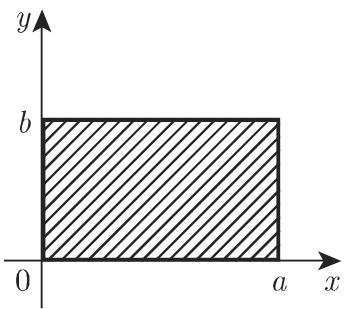
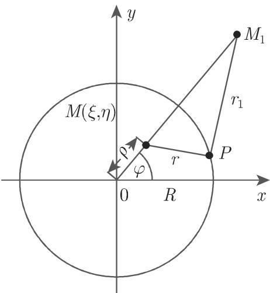

#### 9.2.2 二阶线性偏微分方程

9.2.2.1 两个自变量的二阶线性微分方程的分类和性质

1. 一般形式

两个自变量 x,y 和一个未知函数 的二阶线性偏微分方程的一般形式是形如

$$
A \frac {\partial^ {2} u}{\partial x ^ {2}} + 2 B \frac {\partial^ {2} u}{\partial x \partial y} + C \frac {\partial^ {2} u}{\partial y ^ {2}} + a \frac {\partial u}{\partial x} + b \frac {\partial u}{\partial y} + c u = f\tag{9.82a}
$$

的方程其中系数 $A , B , C , a , b , c$ 和右端的 $f$ 是x和 $y$ 的已知函数这个微分方程解的形式依赖千所考虑区域中判别式 (discriminant)

$$
\delta = A C - B ^ {2}\tag{9.82b}
$$

的符号．必须区别下述一些情形

(1) $\delta < 0$ 双曲型 (Hyperbolic type).

(2) $\delta = 0 \colon$ 抛物型 (Parabolic type).

(3) $\delta > 0 \colon$ 椭圆型 (Elliptic type).

(4) 改变符号：混合型 (Mixed type).

判别式 的一个重要性质是，其符号在自变量的任意变换下，例如，在 $x , y$ 平面中引进新坐标，是不变的．因而微分方程的类型关千自变量的选取是不变的．

2. 特征

线性二阶偏微分方程的特征是微分方程

$$
A \mathrm{d} y ^ {2} - 2 B \mathrm{d} x \mathrm{d} y + C \mathrm{d} x ^ {2} = 0 \quad \text {或} \quad {\frac {\mathrm{d} y}{\mathrm{d} x}} = {\frac {B \pm {\sqrt {- \delta}}}{A}}\tag{9.83}
$$

的积分曲线对千上面 种类型微分方程的特征，下述一些陈述成立：

(1) 双曲型 存在两族实特征．

(2) 抛物线 只存在一族实特征．

(3) 椭圆型 不存在实特征．

(4) (9.82a) 经过坐标变换而得到的微分方程与 (9.28a) 有相同的特征．

(5) 如果一族特征与一族坐标线一致，那么在 (9.28a) 中未知函数关千相应自变量的二阶导数那一项不存在．在抛物型微分方程的情形，不存在混合导数项．

3. 正规形式或典范形式

(9.28a) 变化为二阶线性偏微分方程的正规形式有下述一些可能性

(1) 化为正规形式的变换 通过引进新的自变量

$$
\xi = \varphi (x, y) \quad {\text {和}} \quad \eta = \psi (x, y),\tag{9.84a}
$$

可以把微分方程 (9.28a) 变化为二阶线性偏微分方程的正规形式，根据判别式 (9.28b)的符号，正规形式属千以下 种类型之一：

$$
\frac {\partial^ {2} u}{\partial \xi^ {2}} - \frac {\partial^ {2} u}{\partial \eta^ {2}} + \dots = 0, \quad \delta <   0, \quad \text {双曲型};\tag{9.84b}
$$

$$
\frac {\partial^ {2} u}{\partial \eta^ {2}} + \cdot \cdot \cdot = 0, \quad \delta = 0, \quad \text {抛物型};\tag{9.84c}
$$

$$
\frac {\partial^ {2} u}{\partial \xi^ {2}} + \frac {\partial^ {2} u}{\partial \eta^ {2}} + \dots = 0, \quad \delta > 0, \quad \text {椭圆型}.\tag{9.84d}
$$

其中不包含未知函数二阶偏导数的项用 个点表示．

(2) 双曲型方程到典范形式 (9.84b) 的约化 如果在双曲型的情形，选取两族特征为新坐标系 (9.84a) 的坐标线即，如果作代换 $\xi _ { 1 } = \varphi ( x , y ) , \eta _ { 1 } = \psi ( x , y )$ ，其中 $\varphi ( x , y ) =$ 常数， $\psi ( x , y ) =$ 常数是特征的方程，则（9.82a) 变为形式

$$
\frac {\partial^ {2} u}{\partial \xi_ {1} \partial \eta_ {1}} + \dots = 0.\tag{9.84e}
$$

此形式也被称为双曲型微分方程的典范形式(canonical form of a hyperbolic typedifferential equation) ．由此，由代换

$$
\xi = \xi_ {1} + \eta_ {1}, \eta = \xi_ {1} - \eta_ {1}\tag{9.84f}
$$

得到典范形式 (9.84b).

(3) 抛物型方程到典范形式 (9.84c) 的约化 在这个情形给定的唯一一族特征被选为族 $\xi =$ 常数，而 可以选为 的一个任意函数，它必定不依赖千 e.

(4) 椭圆型方程到典范形式 (9.84d) 的约化 在椭圆型的情形，如果系数 $A ( x ,$ y), $B ( x , y ) , C ( x , y )$ 是解析函数（参见第 954 14.1.2.1)，则特征定义了两个复共辄曲线族 $\varphi ( x , y ) =$ 常数， $\psi ( x , y ) =$ 常数由代换 $\xi = \varphi + \psi$ 和 $\eta = \mathrm { i } ( \varphi - \psi )$ ，方程变为形式 (9.84d).

4. 一般化的形式

对千以更一般形式给出的方程

$$
A (x, y) \frac {\partial^ {2} u}{\partial x ^ {2}} + 2 B (x, y) \frac {\partial^ {2} u}{\partial x \partial y} + C (x, y) \frac {\partial^ {2} u}{\partial y ^ {2}} + F \Bigl (x, y, u, \frac {\partial u}{\partial x}, \frac {\partial u}{\partial y} \Bigr) = 0,\tag{9.85}
$$

关千分类和约化为典范形式的每个陈述仍然成立，这里，与 (9.82a) 形成对照的是，是未知函数 及其一阶偏导数 $\partial u / \partial x$ 和 $\partial u / \partial y$ 的非线性函数．

9.2.2.2 多于两个自变量的二阶线性微分方程的分类和性质

1. 一般形式

关千 $u = u ( x _ { 1 } , x _ { 2 } , \cdot \cdot \cdot , x _ { n } )$ ）的这类微分方程有形式

$$
\sum_ {i, k} a _ {i k} \frac {\partial^ {2} u}{\partial x _ {i} \partial x _ {k}} + \dots = 0,\tag{9.86}
$$

其中 $a _ { i k }$ 是自变量的给定的函数，省略号表示不包含未知函数的二阶导数的项．

一般而言，不能通过自变量的变换而把微分方程 (9.86) 约化为一个简单的典范形式．然而有一种类似千在第 761 9.2.2.1 引进的（见 [9.5] ）重要的分类

2. 常系数二阶线性偏微分方程

如果 (9.86) 中所有系数 $a _ { i k }$ 都是常数，那么可以通过自变量的一个线性齐次变换把方程约化为一个比较简单的形式

$$
\sum_ {i} \kappa_ {i} \frac {\partial^ {2} u}{\partial x _ {i} ^ {2}} + \dots = 0,\tag{9.87}
$$

其中诸系数 $\kappa _ { i }$ 是 $\pm 1$ 0. 必须区别儿个特别的情形．

(1) 椭圆型微分方程 如果所有系数 $\kappa _ { i }$ 皆异千零，并且有相同的符号，那么这是椭圆型微分方程的情形

(2) 双曲型和超双曲型微分方程 如果所有系数 $\kappa _ { i }$ 皆异千零，但是有一个与其他所有的有不同的符号，那么这是双曲型微分方程的情形如果两种符号都至少出现两次那么这是超双曲型微分方程 (ultra-hyperbolic differential equation) 的情形

(3) 抛物型微分方程 如果系数 $\kappa _ { i }$ 之一等千零，而其余的异于零，并且有相同的符号，那么这是抛物型微分方程的情形．

(4) 椭圆型和双曲型微分方程的简单情形 如果不仅未知函数的二阶导数的诸系数都是常数，而且一阶导数的系数也都是常数，那么有可能通过代换消去对应千$\kappa _ { i } \neq 0$ 的那些一阶导数．为此目的作代换

$$
u = v \exp \Big (- \frac {1}{2} \sum \frac {b _ {k}}{\kappa_ {k}} x _ {k} \Big),\tag{9.88}
$$

其中 $b _ { k }$ 是 (9.87) $\frac { \partial u } { \partial x _ { k } }$ 的系数，求和是对所 $\kappa _ { k } \neq 0$ 施行的．用这种方法每个常系数的椭圆型和双曲型微分方程都可被约化为简单形式：

a) 椭圆型情 $\Delta v + k v = g .$

(9.89)

b) 双曲型情形 ${ \frac { \partial ^ { 2 } v } { \partial t ^ { 2 } } } - \Delta v + k v = g .$

(9.90)

这里 $\Delta$ 表示拉普拉斯 (Laplace) 算子（参见第 934 13.2.6.5).

$$
\Delta v = \frac {\partial^ {2} v}{\partial x _ {1} ^ {2}} + \frac {\partial^ {2} v}{\partial x _ {2} ^ {2}} + \dots + \frac {\partial^ {2} v}{\partial x _ {n} ^ {2}}.
$$

9.2.2.3 二阶线性偏微分方程的积分法

1. 分离变量法

物理学中的一些微分方程的解可以用一些特殊的代换来确定，得到依赖千一些参数的解族，虽然这些并不是通解．如果寻找乘积形式 (form of a product) 的解

$$
u (x _ {1}, \dots , x _ {n}) = \varphi_ {1} (x _ {1}) \varphi_ {2} (x _ {2}) \dots \varphi_ {n} (x _ {n})\tag{9.91}
$$

的解，经常可以解线性微分方程，特别是二阶线性微分方程．接着，试图分离那些函数 $\varphi _ { k } \mathopen { } \mathclose \bgroup \left( x _ { k } \aftergroup \egroup \right)$ ，即，对千它们中的每一个，要确定只包含一个变量 $x _ { k }$ 的常微分方程．在把乘积形式 (9.91) 的试探解代入给定的微分方程时，在许多情形这个分离变量(separation of variables) 经常是成功的．为了保证原始方程的解满足所要求的齐次边界条件，函数 $\varphi _ { 1 } ( x _ { 1 } ) , \varphi _ { 2 } ( x _ { 2 } ) , \cdot \cdot \cdot , \varphi _ { n } ( x _ { n } )$ （吓）中的某一些满足某些边界条件就可能足够了．

利用求和、微分和积分，从已经得到的那些解可以获得一些新的解；必须选择参数，使得余下的边界条件和初始条件被满足（见例子）．

最后，不要忘了：用这种方法得到的解，经常是无穷级数和反常积分，只是形式(formal solutions)．也就是，必须验证解是否有物理意义，例如，它是否收敛，满足原始方程和边界条件，是否逐项可微，以及在边界处极限是否存在．

在本节例子中的无穷级数和反常积分是收敛的，如果定义边界条件的那些函数满足所要求的条件，例如，在第一个和第二个例子中关千二阶导数的连续性假设．

■ A: 弦振动方程是一个二阶线性双曲型偏微分方程

$$
\frac {\partial^ {2} u}{\partial t ^ {2}} = a ^ {2} \frac {\partial^ {2} u}{\partial x ^ {2}}.\tag{9.92a}
$$

它描述了被拉紧的弦的振动．边界条件和初始条件为

$$
u \Big | _ {t = 0} = f (x), \quad \frac {\partial u}{\partial t} \Big | _ {t = 0} = \varphi (x), \quad u | _ {x = 0} = 0, \quad u | _ {x = l} = 0.\tag{9.92b}
$$

欲求形如

$$
u = X (x) T (t)\tag{9.92c}
$$

的解，将其代入给定的方程 (9.92a) 后得到

$$
\frac {T ^ {\prime \prime}}{a ^ {2} T} = \frac {X ^ {\prime \prime}}{X}.\tag{9.92d}
$$

变量被分离了，右端仅依赖千 $x ,$ ，而左端仅依赖千 t, 因而它们都是常数．此常数必定为负，否则不能满足边界条件，即，非负常数值给出平凡解 $u ( x , t ) = 0$ 用 $- \lambda ^ { 2 }$ 表示这个负常数．其结果对千两个变量而言都是一个常系数二阶线性常微分方程其通解参见第 735 9.1.2.4. 结果是两个线性微分方程

$$
X ^ {\prime \prime} + \lambda^ {2} X = 0,\tag{9.92e}
$$

$$
T ^ {\prime \prime} + a ^ {2} \lambda^ {2} T = 0.\tag{9.92f}
$$

从边界条件得到 $X ( 0 ) = X ( l ) = 0$ . 因而 $X ( x )$ 是斯图姆—刘维尔边值问题的本征函数，而 $\lambda ^ { 2 }$ 是相应的本征值（参见第 752 9.1.3.1, 3.)．关千 解有相应边界条件的微分方程，得到

$$
X (x) = C \sin \lambda x, \quad \text {满足} \quad \sin \lambda l = 0, \quad \text {即} \quad \lambda = {\frac {n \pi}{l}} = \lambda_ {n} \quad (n = 1, 2, \dots).\tag{9.92g}
$$

关千 解方程 (9.92f) 对每个本征值 $\lambda _ { n }$ 导致常微分方程（9.92a) 的一个特解

$$
u _ {n} (x, t) = \left(a _ {n} \cos {\frac {n a \pi}{l}} t + b _ {n} \sin {\frac {n a \pi}{l}} t\right) \sin {\frac {n \pi}{l}} x.\tag{9.92h}
$$

t=O 时要求

$$
\left. u \right| _ {t = 0} = \sum_ {n = 1} ^ {\infty} u _ {n} (x, 0) = f (x),\tag{9.92i}
$$

$$
\left. \frac {\partial u}{\partial t} \right| _ {t = 0} = \sum_ {n = 1} ^ {\infty} \frac {\partial u _ {n}}{\partial t} (x, 0) = \varphi (x),\tag{9.92j}
$$

就得到正弦函数的傅里叶级数展开式（参见第 633 7.4.1.1, 1.），其中

$$
a _ {n} = \frac {2}{l} \int_ {0} ^ {l} f (x) \sin {\frac {n \pi x}{l}} \mathrm{d} x, b _ {n} = \frac {2}{n a \pi} \int_ {0} ^ {l} \varphi (x) \sin {\frac {n \pi x}{l}} \mathrm{d} x.\tag{9.92k}
$$

■ B: 一根棒的纵向振动方程是一个二阶线性双曲型偏微分方程，它描述一端无约束，另一固定端处受一恒定力 $p$ 影响的棒的纵向振动如 （参见第 764 页）中那样来解同一个微分方程，即

$$
\frac {\partial^ {2} u}{\partial t ^ {2}} = a ^ {2} \frac {\partial^ {2} u}{\partial x ^ {2}},\tag{9.93a}
$$

它有同样的初始条件和不同的边界条件：

$$
u \Big | _ {t = 0} = f (x), \quad \frac {\partial u}{\partial t} \Big | _ {t = 0} = \varphi (x),\tag{9.93b}
$$

$$
\left. \frac {\partial u}{\partial x} \right| _ {x = 0} = 0 \quad (\text {自由端}),\tag{9.93c}
$$

$$
\left. \frac {\partial u}{\partial x} \right| _ {x = l} = k p.\tag{9.93d}
$$

条件 (9.93c, d) 可以被齐次条件

$$
\left. \frac {\partial z}{\partial x} \right| _ {x = 0} = \left. \frac {\partial z}{\partial x} \right| _ {x = l} = 0\tag{9.93e}
$$

代替，其中替代 的是引进的一个新的未知函数

$$
z = u - \frac {k p x ^ {2}}{2 l}.\tag{9.93f}
$$

微分方程变为非齐次的：

$$
\frac {\partial^ {2} z}{\partial t ^ {2}} = a ^ {2} \frac {\partial^ {2} z}{\partial x ^ {2}} + \frac {a ^ {2} k p}{l}.\tag{9.93g}
$$

求形如 $z = v + w$ 的解，其中 $v$ 满足具有下述关千 $z$ 的初始条件和边界条件的齐次微分方程

$$
z \Big | _ {t = 0} = f (x) - \frac {k p x ^ {2}}{2}, \quad \left. \frac {\partial z}{\partial t} \right| _ {t = 0} = \varphi (x),\tag{9.93h}
$$

满足零初始条件和边界条件的非齐次微分方程．这就给出 $w = \frac { k a ^ { 2 } p t ^ { 2 } } { 2 l }$ ．把未知函数 $v ( x , t )$ 的乘积形式

$$
v = X (x) T (t)\tag{9.93i}
$$

代入微分方程 (9.93a)，如 （第 764 页）中一样得到两个分离的常微分方程

$$
\frac {X ^ {\prime \prime}}{X} = \frac {T ^ {\prime \prime}}{a ^ {2} T} = - \lambda^ {2}.\tag{9.93j}
$$

在边界条件 $X ^ { \prime } ( 0 ) = X ^ { \prime } ( l ) = 0$ 下积分关千 的微分方程，得到本征函数

$$
X _ {n} = \cos {\frac {n \pi x}{l}}\tag{9.93k}
$$

和相应的本征值

$$
\lambda_ {n} ^ {2} = \frac {n ^ {2} \pi^ {2}}{l ^ {2}} (n = 0, 1, 2, \dots).\tag{9.931}
$$

（第 764 页）中过程一样，最终得到

$$
u = \frac {k a ^ {2} p t ^ {2}}{2 l} + \frac {k p x ^ {2}}{2 l} + a _ {0} + \frac {a \pi}{l} b _ {0} t + \sum_ {n = 1} ^ {\infty} \left(a _ {n} \cos \frac {a n \pi t}{l} + \frac {b _ {n}}{n} \sin \frac {a n \pi t}{l}\right) \cos \frac {n \pi x}{l},\tag{9.93m}
$$

其中 $a _ { n }$ 和 $b _ { n } ( n = 0 , 1 , 2 , \cdots )$ 分别是函数 $f ( x ) - { \frac { k p x ^ { 2 } } { 2 } }$ 和 ${ \frac { l } { a \pi } } \varphi ( x )$ 在区间 (0, l)中傅里叶余弦级数展开式（参见第 633 7.4.1.1, 1.）的系数．

■ C: 圆膜振动方程圆膜沿着边界被固定．该方程是一个线性双曲型偏微分方程．它有笛卡儿坐标形式和极坐标形式（参见第 283 3.5.3.2, 3.):

$$
\frac {\partial^ {2} u}{\partial x ^ {2}} + \frac {\partial^ {2} u}{\partial y ^ {2}} = \frac {1}{a ^ {2}} \frac {\partial^ {2} u}{\partial t ^ {2}},\tag{9.94a}
$$

$$
\frac {\partial^ {2} u}{\partial \rho^ {2}} + \frac {1}{\rho} \frac {\partial u}{\partial \rho} + \frac {1}{\rho^ {2}} \frac {\partial^ {2} u}{\partial \varphi^ {2}} = \frac {1}{a ^ {2}} \frac {\partial^ {2} u}{\partial t ^ {2}}.\tag{9.94b}
$$

初始条件和边界条件为

$$
u | _ {t = 0} = f (\rho , R),\tag{9.94c}
$$

$$
\left. \frac {\partial u}{\partial t} \right| _ {t = 0} = F (\rho , \varphi),\tag{9.94d}
$$

$$
u | _ {\rho = R} = 0.\tag{9.94e}
$$

个变量的乘积形式的代换

$$
u = U (\rho) \varPhi (\varphi) T (t)\tag{9.94f}
$$

代入极坐标形式的微分方程导致

$$
\frac {U ^ {\prime \prime}}{U} + \frac {U ^ {\prime}}{\rho U} + \frac {\Phi^ {\prime \prime}}{\rho^ {2} \Phi} = \frac {1}{a ^ {2}} \frac {T ^ {\prime \prime}}{T} = - \lambda^ {2}.\tag{9.94g}
$$

类似千例子 （第 764 页）和 （第 765 页），得到分离了变量的 个常微分方程：

$$
T ^ {\prime \prime} + a ^ {2} \lambda^ {2} T = 0,\tag{9.94h}
$$

$$
\frac {\rho^ {2} U ^ {\prime \prime} + \rho U ^ {\prime}}{U} + \lambda^ {2} \rho^ {2} = - \frac {\varPhi^ {\prime \prime}}{\varPhi} = \nu^ {2},\tag{9.94i}
$$

$$
\varPhi^ {\prime \prime} + \nu^ {2} \varPhi = 0.\tag{9.94j}
$$

从条件 $\varPhi ( 0 ) = \varPhi ( 2 \pi ) , \varPhi ^ { \prime } ( 0 ) = \varPhi ^ { \prime } ( 2 \pi )$ ），即得

$$
\varPhi (\varphi) = a _ {n} \cos n \varphi + b _ {n} \sin n \varphi , \quad \nu^ {2} = n ^ {2} \quad (n = 0, 1, 2, \dots).\tag{9.94k}
$$

从方程 $[ \rho U ^ { \prime } ] ^ { \prime } - \frac { n ^ { 2 } } { \rho } U = - \lambda ^ { 2 } \rho U$ 和 $U ( R ) = 0$ 将确定 和入．考虑 $U ( \rho )$ 在 $\rho = 0$ 处显然的有界性条件，并作代 $\lambda \rho = z$ ，得到

$$
z ^ {2} U ^ {\prime \prime} + z U ^ {\prime} + (z ^ {2} - n ^ {2}) U = 0, \quad \text {即} \quad U (\rho) = J _ {n} (z) = J _ {n} \Bigl (\mu \frac {\rho}{R} \Bigr),\tag{9.941}
$$

其中 $J _ { n }$ 是贝塞尔函数（参见第 743 9.1.2.6, 2. ）， $\lambda = \frac { \mu } { R }$ 并且 $J _ { n } ( \mu ) = 0$ ．当$\mu _ { n k }$ 是函数 $J _ { n } ( z )$ 的第 个正根时，函数系

$$
U _ {n k} (\rho) = J _ {n} \left(\mu_ {n k} \frac {\rho}{R}\right) \quad (k = 1, 2, \dots)\tag{9.94m}
$$

是自伴斯图姆—刘维尔问题本征函数完全系，它们在具有权函数 $\rho$ 时是正交的．

问题的解可以有二重级数的形式

$$
\begin{array}{l} U = \sum_ {n = 0} ^ {\infty} \sum_ {k = 1} ^ {\infty} \Big [ (a _ {n k} \cos n \varphi + b _ {n k} \sin n \varphi) \cos \frac {a \mu_ {n k} t}{R} \\ \qquad + (c _ {n k} \cos n \varphi + d _ {n k} \sin n \varphi) \sin \frac {a \mu_ {n k} t}{R} \Big ] J _ {n} \Big (\mu_ {n k} \frac {\rho}{R} \Big). \end{array}\tag{9.94n}
$$

从在 t=O 时的初始条件得到

$$
f (\rho , \varphi) = \sum_ {n = 0} ^ {\infty} \sum_ {k = 1} ^ {\infty} (a _ {n k} \cos n \varphi + b _ {n k} \sin n \varphi) J _ {n} \Bigl (\mu_ {n k} \frac {\rho}{R} \Bigr),\tag{9.94o}
$$

$$
F (\rho , \varphi) = \sum_ {n = 0} ^ {\infty} \sum_ {k = 1} ^ {\infty} \frac {a \mu_ {n k}}{R} (c _ {n k} \cos n \varphi + d _ {n k} \sin n \varphi) J _ {n} \Bigl (\mu_ {n k} \frac {\rho}{R} \Bigr),\tag{9.94p}
$$

其中

$$
a _ {n k} = \frac {2}{\pi R ^ {2} J _ {n - 1} ^ {2} (\mu_ {n k})} \int_ {0} ^ {2 \pi} \mathrm{d} \varphi \int_ {0} ^ {R} f (\rho , \varphi) \cos n \varphi J _ {n} \Bigl (\mu_ {n k} \frac {\rho}{R} \Bigr) \rho \mathrm{d} \rho ,\tag{9.94q}
$$

$$
b _ {n k} = \frac {2}{\pi R ^ {2} J _ {n - 1} ^ {2} (\mu_ {n k})} \int_ {0} ^ {2 \pi} \mathrm{d} \varphi \int_ {0} ^ {R} f (\rho , \varphi) \sin n \varphi J _ {n} \Bigl (\mu_ {n k} \frac {\rho}{R} \Bigr) \rho \mathrm{d} \rho .\tag{9.94r}
$$

n=O 的情形，分子 要改为 1. 为了确定系数 $c _ { n k }$ 和 $d _ { n k }$ ，在 $a _ { n k }$ 和 $b _ { n k }$ 的公

式中用 $F ( \rho , \varphi )$ ）代替 $f ( \rho , \varphi )$ ，再乘以 $\frac { R } { a \mu _ { n k } }$

■ D: 狄利克雷 (Dirichlet) 问题 （参见第 951 13.5.1) 对千长方形 $0 \leqslant x \leqslant$ $a , 0 \leqslant y \leqslant b$ （图 9.17) 的狄利克雷问题为：

  
9.17

求满足椭圆型拉普拉斯微分方程

$$
\Delta u = 0\tag{9.95a}
$$

和边界条件

$$
\begin{array}{l l} u (0, y) = \varphi_ {1} (y), & u (a, y) = \varphi_ {2} (y), \\ u (x, 0) = \psi_ {1} (x), & u (x, b) = \psi_ {2} (x) \end{array}\tag{9.95b}
$$

的函数 $u ( x , y )$

步，要确定边界条件为 $\varphi _ { 1 } ( y ) = \varphi _ { 2 } ( y ) = 0$ 的一个特解．把乘积形式

$$
u = X (x) Y (y)\tag{9.95c}
$$

代入 (9.95a)，得到两个分离的微分方程

$$
\frac {X ^ {\prime \prime}}{X} = - \frac {Y ^ {\prime \prime}}{Y} = - \lambda^ {2},\tag{9.95d}
$$

其中本征值入类似千例子 （第 764 页）～ （第 766 页）．由千 $X ( 0 ) = X ( a ) = 0$ 因而

$$
X = C \sin \lambda x, \quad \lambda = \frac {n \pi}{a} = \lambda_ {n} \quad (n = 1, 2, \dots).\tag{9.95e}
$$

步，获得微分方程

$$
Y ^ {\prime \prime} - \frac {n ^ {2} \pi^ {2}}{a ^ {2}} Y = 0\tag{9.95f}
$$

形如

$$
Y = a _ {n} \sinh {\frac {n \pi}{a}} (b - y) + b _ {n} \sinh {\frac {n \pi}{a}} y\tag{9.95g}
$$

的通解．从这些方程得到 (9.95a) 的满足边界条件 $u ( 0 , y ) = u ( a , y ) = 0$ 的一个特解，它有形式

$$
u _ {n} = \left[ a _ {n} \sinh \frac {n \pi}{a} (b - y) + b _ {n} \sinh \frac {n \pi}{a} y \right] \sin \frac {n \pi}{a} x.\tag{9.95h}
$$

步，考虑级数形式的通解

$$
u = \sum_ {n = 1} ^ {\infty} u _ {n},\tag{9.95i}
$$

因而从 $y = 0$ 和 $y = b$ 处的边界条件得到

$$
u = \sum_ {n = 1} ^ {\infty} \left(a _ {n} \sinh \frac {n \pi}{a} (b - y) + b _ {n} \sinh \frac {n \pi}{a} y\right) \sin \frac {n \pi}{a} x,\tag{9.95j}
$$

其中系数为

$$
\begin{array}{l} a _ {n} = \frac {2}{a \sinh \frac {n \pi b}{a}} \int_ {0} ^ {a} \psi_ {1} (x) \sin \frac {n \pi}{a} x \mathrm{d} x, \\ b _ {n} = \frac {2}{a \sinh \frac {n \pi b}{a}} \int_ {0} ^ {a} \psi_ {2} (x) \sin \frac {n \pi}{a} x \mathrm{d} x. \end{array}\tag{9.95k}
$$

可以用类似方法解边界条件为 $\psi _ { 1 } ( x ) = \psi _ { 2 } ( x ) = 0$ 的问题，并取级数 (9.95j)，就得(9.95a) (9.95b) 的通解

■ E: 热导方程 一端在无穷远另一端保待恒定温度的均匀棒中的热传导由一个在区域 $0 \leqslant x < + \infty , t \geqslant 0$ 中的二阶抛物型线性偏微分方程

$$
\frac {\partial u}{\partial t} = a ^ {2} \frac {\partial^ {2} u}{\partial x ^ {2}}\tag{9.96a}
$$

及其满足的初始条件和边界条件

$$
u | _ {t = 0} = f (x), \quad u | _ {x = 0} = 0\tag{9.96b}
$$

所描述．还假设在无穷远处温度趋千零．在 (9.96a) 中作代换

$$
u = X (x) T (t),\tag{9.96c}
$$

得到两个常微分方程

$$
\frac {T ^ {\prime}}{a ^ {2} T} = \frac {X ^ {\prime \prime}}{X} = - \lambda^ {2},\tag{9.96d}
$$

其参数入类似千以前的例子 （第 764 页）～D( 768 页）而被引进．作为 $T ( t )$ 的一个解，得到

$$
T (t) = C _ {\lambda} \mathrm{e} ^ {- \lambda^ {2} a ^ {2} t},\tag{9.96e}
$$

利用边界条件 $X ( 0 ) = 0$ ，得到

$$
X (x) = C \sin \lambda x,\tag{9.96f}
$$

因而

$$
u _ {\lambda} = C _ {\lambda} \mathrm{e} ^ {- \lambda^ {2} a ^ {2} t} \sin \lambda x,\tag{9.96g}
$$

其中入是一个任意实数．可以得到下述形式的解

$$
u (x, t) = \int_ {0} ^ {\infty} C (\lambda) \mathrm{e} ^ {- \lambda^ {2} a ^ {2} t} \sin \lambda x \mathrm{d} \lambda ,\tag{9.96h}
$$

从初始条件 $u | _ { t = 0 } = f ( x )$ 即得 (9.96i) 及对千常数 （入）的 (9.96j) （参见第 6337.4.1.1):

$$
f (x) = \int_ {0} ^ {\infty} C (\lambda) \sin \lambda x \mathrm{d} \lambda ,\tag{9.96i}
$$

$$
C (\lambda) = \frac {2}{\pi} \int_ {0} ^ {\infty} f (s) \sin \lambda s \mathrm{d} s.\tag{9.96j}
$$

结合 (9.96j) (9.96h) 就得到

$$
u (x, t) = \frac {2}{\pi} \int_ {0} ^ {\infty} f (s) \Big (\int_ {0} ^ {\infty} \mathrm{e} ^ {- \lambda^ {2} a ^ {2} t} \sin \lambda s \sin \lambda x \mathrm{d} \lambda \Big) \mathrm{d} s,\tag{9.96k}
$$

或者，在用两个余弦之差的一半代替两个正弦的乘积（参见第 106 (2.122)），并利用第 1421 页表 21.8.2 中公式 (21.27) ，就得到

$$
u (x, t) = \int_ {0} ^ {\infty} f (s) \frac {1}{2 a \sqrt {\pi t}} \Big [ \exp \Big (- \frac {(x - s) ^ {2}}{4 a ^ {2} t} \Big) - \exp \Big (- \frac {(x + s) ^ {2}}{4 a ^ {2} t} \Big) \Big ] \mathrm{d} s.\tag{9.961}
$$

2. 解双曲型微分方程柯西问题的黎曼方法

$$
\frac {\partial^ {2} u}{\partial x \partial y} + a \frac {\partial u}{\partial x} + b \frac {\partial u}{\partial y} + c u = F.\tag{9.97a}
$$

(1) 黎曼函数 是一个函数 $v ( x , y ; \xi , \eta )$ ，其中 $\xi$ 和 $\eta$ 是参数，该函数满足齐次方程 (9.97a) 的伴随方程

$$
\frac {\partial^ {2} v}{\partial x \partial y} - \frac {\partial (a v)}{\partial x} - \frac {\partial (b v)}{\partial y} + c v = 0\tag{9.97b}
$$

和条件

$$
v (x, \eta ; \xi , \eta) = \exp \left(\int_ {\xi} ^ {x} b (s, \eta) \mathrm{d} s\right), \quad v (\xi , y; \xi , \eta) = \exp \left(\int_ {\eta} ^ {y} a (\xi , s) \mathrm{d} s\right).\tag{9.97c}
$$

一般而言二阶线性微分方程及其伴随微分方程分别有形式

$$
\sum_ {i, k} a _ {i k} \frac {\partial^ {2} u}{\partial x _ {i} \partial x _ {k}} + \sum_ {i} b _ {i} \frac {\partial u}{\partial x _ {i}} + c u = f,\tag{9.97d}
$$

$$
\sum_ {i, k} \frac {\partial^ {2} (a _ {i k} v)}{\partial x _ {i} \partial x _ {k}} - \sum_ {i} \frac {\partial (b _ {i} v)}{\partial x _ {i}} + c v = 0.\tag{9.97e}
$$

  
9.18

(2) 黎曼公式 是一个积分公式，它被用千确定满足所给定的微分方程 (9.97a)的函数 $u ( \xi , \eta )$ ，它沿着事先给定的曲线 （图 9.18) 取事先给定的值及其事先给定的在曲线的法向导数值（参见第 327 3.6.1.2, 2.):

$$
\begin{array}{r} u (\xi , \eta) = \frac {1}{2} (u v) _ {P} + \frac {1}{2} (u v) _ {Q} - \int_ {\widehat {P Q}} \Big [ b u v + \frac {1}{2} \Big (v \frac {\partial u}{\partial x} - u \frac {\partial v}{\partial x} \Big) \Big ] \mathrm{d} x \\ - \left[ a u v + \frac {1}{2} \Big (v \frac {\partial u}{\partial y} - u \frac {\partial v}{\partial y} \Big) \right] \mathrm{d} y + \iint_ {P M Q} F v \mathrm{d} x \mathrm{d} y. \end{array}\tag{9.97f}
$$

光滑曲线 （图 9.18) 必须没有切线平行千坐标轴，即，曲线 必须不与特征相切可以计算这个公式中的线积分，因为由函数值及其沿着 的非切向导数值可以确定其中的偏导数的值．

在柯西问题中，沿着 的法向导数经常被未知函数的偏导数，例如 $\frac { \partial u } { \partial y }$ 的值所取代此时，用另一形式的黎曼公式：

$$
u (\xi , \eta) = (u v) _ {P} - \int_ {\widehat {Q P}} \left(b u v - u \frac {\partial v}{\partial x}\right) \mathrm{d} x - \left(a u v + v \frac {\partial u}{\partial y}\right) \mathrm{d} y + \iint_ {P M Q} F v \mathrm{d} x \mathrm{d} y.\tag{9.97g}
$$

·电报方程 （报务员方程）是一个二阶线性双曲型偏微分方程

$$
a \frac {\partial^ {2} u}{\partial t ^ {2}} + 2 b \frac {\partial u}{\partial t} + c u = \frac {\partial^ {2} u}{\partial x ^ {2}},\tag{9.98a}
$$

其中 $a > 0 , b , c$ 都是常数该方程描述了导线中的电流它是弦振动微分方程的推广．

用 $u = z \exp ( - ( b / a ) t )$ 替代未知函数 $u ( x , t )$ , (9.98a) 就约化为形式

$$
\frac {\partial^ {2} z}{\partial t ^ {2}} = m ^ {2} \frac {\partial^ {2} z}{\partial x ^ {2}} + n ^ {2} z \left(m ^ {2} = \frac {1}{a}, n ^ {2} = \frac {b ^ {2} - a c}{a ^ {2}}\right).\tag{9.98b}
$$

用

$$
\xi = \frac {n}{m} (m t + x), \quad \eta = \frac {n}{m} (m t - x)\tag{9.98c}
$$

代替自变量，最后得到双曲型线性偏微分方程的典范形式（参见第 761 9.2.2.1,1.)

$$
\frac {\partial^ {2} z}{\partial \xi \partial \eta} - \frac {z}{4} = 0.\tag{9.98d}
$$

黎曼函数 $v ( \xi , \eta ; \xi _ { 0 } , \eta _ { 0 } )$ 必须满足此方程，并且在 $\xi = \xi _ { 0 } , \eta = \eta _ { 0 }$ 处取值 1. 选取

$$
w = (\xi - \xi_ {0}) (\eta - \eta_ {0}),\tag{9.98e}
$$

其中 $v = f ( w )$ ，则 f(w) 是微分方程

$$
w \frac {\mathrm{d} ^ {2} f}{\mathrm{d} w ^ {2}} + \frac {\mathrm{d} f}{\mathrm{d} w} - \frac {1}{4} f = 0,\tag{9.98f}
$$

以及初始条件 $f ( 0 ) = 1$ 的一个解．代换 $w = \alpha ^ { 2 }$ 把这个微分方程约化为零阶贝塞尔微分方程（参见第 743 9.1.2.6, 2.)

$$
\frac {\mathrm{d} ^ {2} f}{\mathrm{d} \alpha^ {2}} + \frac {1}{\alpha} \frac {\mathrm{d} f}{\mathrm{d} \alpha} - f = 0,\tag{9.98g}
$$

因而解为

$$
v = I _ {0} \left[ \sqrt {\left(\xi - \xi_ {0}\right) \left(\eta - \eta_ {0}\right)} \right].\tag{9.98h}
$$

原始微分方程 (9.98a) 满足边界条件

$$
z \Big | _ {t = 0} = f (x), \quad \frac {\partial z}{\partial t} \Big | _ {t = 0} = g (x)\tag{9.98i}
$$

的解可以通过把所得到的 的值代入黎曼公式再回到原来的变量而得到

$$
\begin{array}{l} z (x, t) = \frac {1}{2} [ f (x - m t) + f (x + m t) ] \\ \qquad + \frac {1}{2} \int_ {x - m t} ^ {x + m t} \left[ g (s) \frac {I _ {0} \left(\frac {n}{m} \sqrt {m ^ {2} t ^ {2} - (s - x) ^ {2}}\right)}{m} \right. \\ \qquad \left. - f (s) \frac {n t I _ {1} \left(\frac {n}{m} \sqrt {m ^ {2} t ^ {2} - (s - x) ^ {2}}\right)}{\sqrt {m ^ {2} t ^ {2} - (s - x) ^ {2}}} \right] \mathrm{d} s. \end{array}\tag{9.98j}
$$

3. 解两个自变量的椭圆型微分方程边值问题的格林方法

这个方法与解双曲型微分方程柯西问题的黎曼方法非常相似．

如果想在一个给定的区域中找一个满足二阶线性椭圆型偏微分方程

$$
\frac {\partial^ {2} u}{\partial x ^ {2}} + \frac {\partial^ {2} u}{\partial y ^ {2}} + a \frac {\partial u}{\partial x} + b \frac {\partial u}{\partial y} + c u = f,\tag{9.99a}
$$

并在该区域的边界上取规定值的函数 $u ( x , y )$ ，首先必须确定该区域的格林函数(Green function) $G ( x , y ; \xi , \eta )$ ，其中 $\xi , \eta$ 被视作参数．格林函数必须满足下述一些条件：

(1) 除了在点 $x = \xi , y = \eta$ 处外，在给定的区域中函数 $G ( x , y ; \xi , \eta )$ 处处满足齐次伴随方程

$$
\frac {\partial^ {2} G}{\partial x ^ {2}} + \frac {\partial^ {2} G}{\partial y ^ {2}} - \frac {\partial (a G)}{\partial x} - \frac {\partial (b G)}{\partial y} + c G = 0.\tag{9.99b}
$$

(2) 函数 $G ( x , y ; \xi , \eta )$ 有形式

$$
U \ln {\frac {1}{r}} + V,\tag{9.99c}
$$

其中

$$
r = \sqrt {(x - \xi) ^ {2} + (y - \eta) ^ {2}},\tag{9.99d}
$$

并且 在点 $x = \xi , y = \eta$ 处取值 l, 及其二阶导数在整个区域中是连续函数

(3) 函数 $G ( x , y ; \xi , \eta )$ 在给定区域的边界上等千零

步是通过下述公式用格林函数给出边值问题的解

$$
u (\xi , \eta) = \frac {1}{2 \pi} \int_ {S} u (x, y) \frac {\partial}{\partial n} G (x, y; \xi , \eta) \mathrm{d} s - \frac {1}{2 \pi} \iint_ {D} f (x, y) G (x, y; \xi , \eta) \mathrm{d} x \mathrm{d} y,\tag{9.99e}
$$

其中 是所考虑的区域， 的边界，在 $S$ 上假定函数 是已知的，而 $\frac { \partial } { \partial n }$ 表示指向 内部的法向导数．

条件 (3) 依赖千问题的表达．例如，如果取代函数值，在区域边界的法向给出未知函数导数之值，那么条件 (3) 就变为在边界上成立条件

$$
\frac {\partial G}{\partial n} - (a \cos \alpha + b \cos \beta) G = 0,\tag{9.99f}
$$

其中 $\alpha$ 和 $\beta$ 分别表示区域边界的内法向和两个坐标轴之间的夹角．在此情形』犀巾下述公式给出

$$
u (\xi , \eta) = - \frac {1}{2 \pi} \int_ {S} \frac {\partial u}{\partial n} G \mathrm{d} s - \frac {1}{2 \pi} \iint_ {D} f G \mathrm{d} x \mathrm{d} y.\tag{9.99g}
$$

4. 解三个自变量的边值问题的格林方法

微分方程

$$
\Delta u + a \frac {\partial u}{\partial x} + b \frac {\partial u}{\partial y} + c \frac {\partial u}{\partial z} + e u = f\tag{9.100a}
$$

的解应该在所考虑区域的边界上取给定的值．第 步，仍构造格林函数，但现在它依赖千 个参数 C,n 和(.格林函数满足的自伴微分方程有形式

$$
\Delta G - \frac {\partial (a G)}{\partial x} - \frac {\partial (b G)}{\partial y} - \frac {\partial (c G)}{\partial z} + e G = 0.\tag{9.100b}
$$

与在条件 (2) 中相仿，函数 $G ( x , y , z ; \xi , \eta , \zeta )$ )有形式

$$
U \frac {1}{r} + V,\tag{9.100c}
$$

其中

$$
r = \sqrt {(x - \xi) ^ {2} + (y - \eta) ^ {2} + (z - \zeta) ^ {2}}.\tag{9.100d}
$$

问题的解为

$$
u (\xi , \eta , \zeta) = \frac {1}{4 \pi} \iint_ {S} u \frac {\partial G}{\partial n} \mathrm{d} s - \frac {1}{4 \pi} \iiint_ {D} f G \mathrm{d} x \mathrm{d} y \mathrm{d} z.\tag{9.100e}
$$

黎曼方法和格林方法有共同的想法，即首先确定微分方程的一个特解，然后它可被用千得到具有任意边界条件的解．黎曼方法与格林方法的本质不同点在千，前者仅依赖千微分方程左端的形式，而后者还依赖千所考虑的区域．在实践中，找格林函数是一个特别困难的问题，即使已知其存在；因而，格林方法主要被用千理论研究

  
9.19

A: 当所考虑区域是一个圆盘（图 9.19) 时，拉普拉斯微分方程

$$
\Delta u = 0\tag{9.101a}
$$

狄利克雷问题（参见第 951 13.5.1) 格林函数的构造．格林函数是

$$
G (x, y; \xi , \eta) = \ln {\frac {1}{r}} + \ln {\frac {r _ {1} \rho}{R}},\tag{9.101b}
$$

其中 $r = \overline { { M P } } , \rho = \overline { { O M } } , r _ { 1 } = \overline { { M _ { 1 } P } } , R$ 是所考虑圆盘的半径（图 9.19)．点$M _ { 1 }$ 关千圆周是对称的，即，两个点位千从圆心发出的同一条射线上，并且

$$
\overline {{O M}} \cdot \overline {{O M _ {1}}} = R ^ {2}.\tag{9.101c}
$$

狄利克雷问题解的公式 (9.99e)，在代入格林函数法向导数并经过一些计算后就产生了所谓的泊松 (Poisson) 积分

$$
u (\xi , \eta) = \frac {1}{2 \pi} \int_ {0} ^ {2 \pi} \frac {R ^ {2} - \rho^ {2}}{R ^ {2} + \rho^ {2} - 2 R \rho \cos (\psi - \varphi)} u (\varphi) \mathrm{d} \varphi .\tag{9.101d}
$$

记号如上． $u ( \varphi )$ 给出了 在圆盘边界上的已知值．对千点 $M ( \xi , \eta )$ 的坐标，有$\xi = \rho \cos \psi , \eta = \rho \sin \psi$

：当所考虑区域是一个半径为 的球时，拉普拉斯微分方程

$$
\Delta u = 0\tag{9.102a}
$$

狄利克雷问题（参见第 951 13.5.1) 格林函数的构造．此时格林函数有形式

$$
G (x, y, z; \xi , \eta , \zeta) = \frac {1}{r} - \frac {R}{r _ {1} \rho},\tag{9.102b}
$$

其中 $\rho ~ = ~ \sqrt { \xi ^ { 2 } + \zeta ^ { 2 } + \zeta ^ { 2 } }$ 是从球心到点 $( \xi , \eta , \zeta )$ 的距离， 是点 $( x , y , z )$ 与点$( \xi , \eta , \zeta )$ 之间的距离， $r _ { 1 }$ 是点 $( x , y , z )$ 与 $( \xi , \eta , \zeta )$ 的对称点（根据 (9.101c)），即与点 $\Big ( \frac { R \xi } { \rho } , \frac { R \eta } { \rho } , \frac { R \zeta } { \rho } \Big )$ 的距离在此情形，泊松积分有形式（用与 （第 774 页）中相同的记号）

$$
u (\xi , \eta , \zeta) = \frac {1}{4 \pi} \iint_ {S} \frac {R ^ {2} - \rho^ {2}}{R r ^ {3}} u \mathrm{d} s.\tag{9.102c}
$$

5. 算子方法

算子方法不仅可以用来解常微分方程，而且也可以用来解偏微分方程（参见第1005 15.1.6)．它们基千从未知函数到其积分变换的转移（参见第 1002 15.1).在这个过程中，未知函数被视为只是一个变量的函数，而变换是关千这个变量所施行的．其余的变量被视为参数确定未知函数变换的方程比原始方程的自变量少．特别地，如果原始微分方程是两个自变量的偏微分方程，那么对千其作变换就得到一个常微分方程．如果从所得到的方程能发现未知函数的变换，那么或者从反函数的公式或者从变换表就得到原来的函数

6. 逼近方法

为了解决偏微分方程的实际问题，使用了不同的逼近方法．它们可以被分为解析方法和数值方法

(1) 分析方法 (analytical methods) 有可能对未知函数确定其逼近解析表达式.

(2) 数值方法 (numerical methods) 对自变量的某些值导致未知函数的逼近值可用下述一些方法（参见第 1267 19.5):

a) 有限差分法 (finite difference method) ，或格点法 (Lattice-Point Method):导数用均差 (divided differences) 代替，因而包括初始条件和边界条件的微分方程变为一个代数方程组带有初始条件和边界条件的线性微分方程变为一个线性代数方程组

b) 有限元法 (finite element method) ，或简称为FEM （参见第 127119.5.3)，这是针对边值问题的．这里一个变分问题被指派给边值问题．用样条方法来获得未知函数的逼近，选取其中的系数以得到最佳解．边值问题的区域被分成一些正规的子区域．通过解一个极值问题来确定系数

c) 积分方程法（沿着一条闭曲线） (integral equation method (along a closedcurve)），对千一些特殊的边界问题：把边值问题叙述为沿着边值问题的区域边界的一个等价的积分方程问题．为此，利用向量分析的一些定理（参见第 4513.3.3)，例如格林公式利用适当的求积公式来数值地确定剩下的沿着闭曲线的积分．

(3) 物理解法 (physical solutions) 由实验方法可以给出微分方程的物理解法．这基千下述事实同一个微分方程可以描述不同的物理现象．为了解一个给定的方程首先要建立一个模拟给定问题的模型由此模型可以直接得到未知函数的值．因为常常知道这样的模型并且可以通过在宽广的范围中变动参数来构造这样的模型，所以可以把微分方程应用千变量的广阔领域中．
