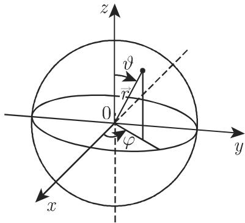

#### 9.2.4 薛定谔方程

9.2.4.1 薛定谔方程的概念

1. 确定性和依赖性

薛定谔方程的解，即波函数 (wave function) 心，描述了量子力学系统的性质即粒子态的性质．薛定谔方程是波函数的一个二阶偏微分方程，关千空间坐标它有二阶导数，关千时间坐标它有一阶导数：

$$
\mathrm{i} \hbar \frac {\partial \psi}{\partial t} = - \frac {\hbar^ {2}}{2 m} \Delta \psi + U (x _ {1}, x _ {2}, x _ {3}, t) \psi = \hat {H} \psi ,\tag{9.111a}
$$

$$
\hat {H} \equiv \frac {\hat {p} ^ {2}}{2 m} + U (\vec {r}, t), \quad \hat {p} \equiv \frac {\hbar}{\mathrm{i}} \frac {\partial}{\partial \vec {r}} \equiv \frac {\hbar}{\mathrm{i}} \nabla ,\tag{9.111b}
$$

这里 $\Delta$ 是拉普拉斯算子， $\hbar = { \frac { h } { 2 \pi } }$ 是约化普朗克 (Planck) 常数， 是虚单位，梯度算子．在质量为 的一个自由粒子的冲量 $p$ 和波长入之间的关系是 $\lambda = h / p$

2. 一些注记

a) 在量子力学中，对每个可测量都配以一个算子．出现在 (9.llla) (9.lllb)中的算子 $\hat { H }$ 被称为哈密顿算子 (Hamilton operator) ("Hamiltonian”) ．它与经典力学中的哈密顿函数（例如，见第 758 页关千二体问题的例子）有相同的作用．它表示分为动能和势能的系统总能量． $\hat { H }$ 中的第 项是关千动能的算子，第 项是关千势能的算子．

b) 虚单位显式地出现在薛定谔算子中．因而，波函数是复函数需要计算出现在 $\psi ^ { ( 1 ) } + \mathrm { i } \psi ^ { ( 2 ) }$ 中的两个实函数的可观察量．描述粒子位千所观察区域一个任意体积元 dV 中概率 dw 的波函数的平方 $| \psi | ^ { 2 }$ 必须满足特别的进一步的条件．

c) 除了互作用 (interaction) 的位势外，每个特解还依赖千所给问题的初始条件和边界条件一般地，有这样的线性二阶边值问题，其解只对千本征值有物理意义有意义解的绝对值平方处处是唯一的和正规的，并且在无穷远处趋千零．

d) 基千波粒二象性 (wave-particle duality) ，微粒子也有波和粒子性质因而薛 定谔方程是关千德布罗意 (De Broglie) 物质波的波方程．

e) 局限千非相对论情形，意味着相对千光速 而言粒子的速度 非常小$( v \ll c )$

在理论物理学的文献中（例如，见 [9.5], [9. 7], [9.15], [22.19] ）详细地讨论了薛定谔方程的应用本章只展示了一些最重要的例子

9.2.4.2 含时薛定谔方程

含时薛定谔方程 (9.llla) 描述了在一个与位置有关的含时位势场 $U ( x _ { 1 } , x _ { 2 }$ $x _ { 3 } , t )$ 中质量为 的无自旋粒子的一般非相对论的情形．波函数必须满足的特殊条件是：

a) 函数 $\psi$ 必须是有界的和连续的．

b) $\partial \psi / \partial x _ { 1 } , \partial \psi / \partial x _ { 2 } , \partial \psi / \partial x _ { 3 }$ 必须是连续的．

c) 函数 $| \psi | ^ { 2 }$ 必须是可积的，即

$$
\iiint_ {V} | \psi (x _ {1}, x _ {2}, x _ {3}, t) | ^ {2} \mathrm{d} V <   \infty .\tag{9.112a}
$$

根据归一化条件，粒子位千所考虑区域中的概率必定等千 1. (9.112a) 足以保证此条件成立，因为用一个适当的常数乘以 $\psi$ ，积分值就变为 1.

含时薛定谔方程的一个解有形式

$$
\psi (x _ {1}, x _ {2}, x _ {3}, t) = \varPsi (x _ {1}, x _ {2}, x _ {3}) \exp \Big (- \mathrm{i} \frac {E}{\hbar} t \Big).\tag{9.112b}
$$

具有角频率 $\omega = E / \hbar$ 的一个时间的周期函数描述了粒子态．如果粒子能量有固定值 $E =$ 常数，那么粒子位千空间元 $\mathrm { d } V$ 中的概率与时间无关：

$$
\mathrm{d} \omega = | \psi | ^ {2} \mathrm{d} V = \psi \psi^ {*} \mathrm{d} V.\tag{9.112c}
$$

此时就是粒子的平稳态 (stationary state).

9.2.4.3 定常薛定谔方程

如果位势 $U$ 与时间无关即 $U = U ( x _ { 1 } , x _ { 2 } , x _ { 3 } )$ ，那么 (9.llla) 就是定常薛定谔方程并且波函数 $\varPsi ( x _ { 1 } , x _ { 2 } , x _ { 3 } )$ 足以描述粒子态．从具有解（9.112b) 的含时薛定谔方程 (9.llla) 得到

$$
\Delta \varPsi + \frac {2 m}{\hbar^ {2}} (E - U) \varPsi = 0.\tag{9.113a}
$$

在这个非相对论的情形，粒子的能量是

$$
E = \frac {p ^ {2}}{2 m} \quad \left(p = \frac {h}{\lambda}, h = 2 \pi \hbar\right).\tag{9.113b}
$$

满足微分方程 (9.113a) 的波函数 是本征函数 (eigenfunctions) ；它们仅对某些能量值 (energy values) 存在，一些特殊边界条件的问题给出了这些能量值．本征值的全体形成粒子的能谱 (energy spectrum)．如果 是一个有限深度位势，并且在无穷远处它趋千零，那么负本征值形成一个离散谱 (discrete spectrum).

如果所考虑的区域是整个空间，那么作为边界条件，可以要求在整个空间勒贝格意义下（参见第 908 12.9.3.2 [8.9]）是平方可积的．如果区域是有限的，例如，是一个球体或圆柱体，那么可以要求，例如在边界上 $\varPsi = 0$ ，作为第一边界条件问题

在 $U ( x ) = 0$ 的特殊情形这给出了亥姆霍兹微分方程 (Helmholtz differentialequation):

$$
\Delta \Psi + \lambda \Psi = 0,\tag{9.114a}
$$

其本征值为

$$
\lambda = \frac {2 m E}{\hbar^ {2}}.\tag{9.114b}
$$

这里经常要求 $\varPsi = 0$ 作为边界条件．（9.114a) 表示有限区域内声振荡的初始数学方程

9.2.4.4 波函数的统计解释

量子力学假设，在时刻 的单粒子系统的完全描述是由作为状态函数 (statefunction) 和薛定谔方程正规化解的复波函数 (wave function) $\psi ( \vec { r } , t )$ 来给出的．因而波函数包含由该系统的测量所得到的所有可能的实验信息量子力学理论不存在可以消去量子力学的主要统计特性 (principal statistical character) 的隐藏子结构和隐藏参量，因为该理论包含着状态函数与 $\psi$ 和测量结果的关联．

1. 可观察振幅和概率振幅

可以由适当的测量工具所确定的物理表达（位置、动量、角动量、能量）被称为可观察的 (observable)．在量子力学中，每个可观察量 由一个满足 $\hat { A } ^ { + } = \hat { A }$ 的，作用在波函数上的线性埃尔米特算子 表达．同时，量子力学中的算子控制着经典表达的结构

·对千角动量算子 $\hat { \vec { l } } ,$ 其中户 $\hat { \vec { r } }$ 位置算子， $\hat { \vec { p } }$ 是动量算子，有

$$
\hat {\vec {l}} = (\hat {l} _ {x}, \hat {l} _ {y}, \hat {l} _ {z}) = \hat {\vec {r}} \times \hat {\vec {p}}, \quad \text {即} \quad \hat {l} _ {x} = \hat {y} \hat {p} _ {z} - \hat {z} \hat {p} _ {y} = \frac {\hbar}{\mathrm{i}} \Big (y \frac {\partial}{\partial z} - z \frac {\partial}{\partial y} \Big),\tag{9.115a}
$$

$$
\hat {l} _ {y} = \hat {z} \hat {p} _ {x} - \hat {x} \hat {p} _ {z} = \frac {\hbar}{\mathrm{i}} \left(z \frac {\partial}{\partial x} - x \frac {\partial}{\partial z}\right), \quad \hat {l} _ {z} = \hat {x} \hat {p} _ {y} - \hat {y} \hat {p} _ {x} = \frac {\hbar}{\mathrm{i}} \left(x \frac {\partial}{\partial y} - y \frac {\partial}{\partial x}\right).\tag{9.115b}
$$

一般来说一个可观测量的数值首先只是通过测量的结果得到而不可能通过确定波函数来制定其数值．唯一可能的那些测量值 $\hat { A }$ 的诸实本征值 $a _ { i }$ ；它们的相伴

本征函数 $\varphi _ { i }$ 形成一个完全正交系：

$$
\hat {A} \varphi_ {i} = a _ {i} \varphi_ {i}, \quad \iiint_ {V} \varphi_ {i} ^ {*} \varphi_ {k} \mathrm{d} V = \delta_ {i, k} \quad (i, k = 1, 2, \dots).\tag{9.116}
$$

如果系统在任意一般态 $\psi$ ，那么不能预测一个单个实验的结果，即不能预测某个测量值 ai 在一个单个测量中的出现．设想对 $a _ { i }$ $N \to \infty$ 个处千相同态 $\psi$ 的相同系统进行测量，那么在测量结果中每一个可能的结果 $a _ { i }$ 以 $N _ { i }$ 的频率出现．在一个单个测量中的值 $a _ { i }$ 的概率 $W _ { i }$ 可由下式确定

$$
W _ {i} = \lim _ {N \to \infty} \frac {N _ {i}}{N}, \quad \sum_ {i} N _ {i} = N.\tag{9.117}
$$

为了从波函数 $\psi$ 确定这个概率，把 $\psi$ 表示为诸本征函数 $\varphi _ { i }$ 的一个级数：

$$
\psi = \sum_ {i} c _ {i} \varphi_ {i}, \qquad c _ {i} = \iiint_ {V} \varphi_ {i} ^ {*} \psi \mathrm{d} V.\tag{9.118}
$$

展开式的系数 $c _ { i }$ 是系统 $\psi$ 在其特征态 $\varphi _ { i }$ 中的概率，即得到测量值 $a _ { i }$ 的概率．从$c _ { i }$ 绝对值的平方得到对千测量值 $a _ { i }$ 的概率 $W _ { i }$

$$
W _ {i} = \left| c _ {i} \right| ^ {2}, \quad \sum_ {i} W _ {i} = \iiint_ {V} \psi^ {*} \psi \mathrm{d} V = 1.\tag{9.119}
$$

由千在每次测量中必须发现诸可能的测量值 $a _ { i }$ 之一，因此诸概率 $W _ { i }$ 之和满足波函数 $\psi$ 的正规化条件．

如果已知一个物理系统的两个状态 $\psi _ { 1 } , \psi _ { 2 }$ 那么从薛定谔方程的线性性即得，叠加

$$
\psi = \psi_ {1} + \psi_ {2}\tag{9.120}
$$

也表示一个可能的物理态．量子力学的这个基本的叠加原理 (superposition princi-ple) 解释了为什么用态函数 $\psi$ 来确定的概率，例如

$$
| \psi | ^ {2} = | \psi_ {1} + \psi_ {2} | ^ {2} = | \psi_ {1} | ^ {2} + | \psi_ {2} | ^ {2} + 2 \mathrm{Re} (\psi_ {1} \psi_ {2} ^ {*}).\tag{9.121}
$$

除了两个单个的概率 $| \psi _ { 1 } | ^ { 2 } , | \psi _ { 2 } | ^ { 2 }$ 外，还出现了带符号的一个附加项．这解释了量子力学惊人的干涉效应例如波粒二象性 (wave-particle duality).

2. 期望值和不确定度

量子力学期望值 (quantum mechanical expectation value) $\overline { { A } }$ 被定义为对全同系统当 $N \to \infty$ 时众多测量结果的平均值：

$$
\overline {{A}} = \lim _ {N \rightarrow \infty} \frac {1}{N} \sum_ {i} a _ {i} N _ {i} = \sum_ {i} a _ {i} W _ {i} = \iiint_ {V} \psi^ {*} \hat {A} \psi \mathrm{d} V.\tag{9.122}
$$

期望值通常与可能的测量结果不同

·对态 $\psi ( \vec { r } , t )$ 中一粒子位置测量期望值户 $\overline { { \vec { r } } } = ( \overline { { x } } , \overline { { y } } , \overline { { z } } )$ ）的计算，例如

$$
\overline {{{x}}} = \iiint_ {V} x | \psi (\vec {r}, t) | ^ {2} \mathrm{d} V
$$

说明了波函数心 $\psi ( \vec { r } , t )$ 被解释为概率振幅．绝对值平方 $| \psi | ^ { 2 }$ 则为概率密度．表达式

$$
\mathrm{d} W = | \psi (\vec {r}, t) | ^ {2} \mathrm{d} V, \quad \int \mathrm{d} W = \iiint_ {V} | \psi (\vec {r}, t) | ^ {2} \mathrm{d} V = 1
$$

被理解为该粒子在时刻 位千位置 $\vec { r }$ 处体积元 $\mathrm { d } V$ 中的概率（位置概率 (probability$\mathrm { o f ~ t h e ~ p o s i t i o n } ) \rangle$ 1

对千某些测量中的一个一般态给定的一个可观察量 ，借助千在期望值 $\overline { { A } }$ 附近的所谓的不确定度 $( \mathrm { u n c e r t a i n t y } ) \ \Delta A$ 可以定义 的测量结果分布的度量； $\Delta A$ 是通过标准误差而引进的：

$$
(\Delta A) ^ {2} = \lim _ {N \to \infty} \frac {1}{N} \sum_ {i} N _ {i} (a _ {i} - \overline {{{A}}}) ^ {2} = \sum_ {i} W _ {i} (a _ {i} - \overline {{{A}}}) ^ {2}.\tag{9.123}
$$

借助千波函数 $\psi$ 可以用离开平均值 $\overline { { A } }$ 的根方偏差的期望值来确定一个可观察量的不确定度 $\Delta A$

$$
(\Delta A) ^ {2} = \overline {{(A - \overline {{A}}) ^ {2}}} = \overline {{A ^ {2}}} - \overline {{A}} ^ {2} = \iiint_ {V} \psi^ {*} (\hat {A} - \overline {{A}}) ^ {2} \psi \mathrm{d} V.\tag{9.124}
$$

如果系统位千 $\hat { A }$ 的本征态 $\varphi _ { i }$ 中，那么所有的测量都给出相同的测量值 $a _ { i }$ :

$$
\overline {{A}} = a _ {i}, \qquad \Delta A = 0.\tag{9.125}
$$

在期望值 $\overline { { A } }$ 附近不出现分布．

3. 不确定度关系

考虑两个可观察量 A,B, 它们的算子可对易 (commutate严（参见第 4785.3.6.4, ．李（Lie) 括号）：

$$
\hat {C} = [ \hat {A}, \hat {B} ] = \hat {A} \hat {B} - \hat {B} \hat {A} = 0,\tag{9.126}
$$

则（并且仅当此时）存在一个联合的本征函数系 $\varphi _ { i , \nu } ( i , \nu = 1 , 2 , \cdot \cdot \cdot )$

$$
\hat {A} \varphi_ {i, \nu} = a _ {i} \varphi_ {i, \nu}, \qquad \hat {B} \varphi_ {i, \nu} = b _ {\nu} \varphi_ {i, \nu}.\tag{9.127}
$$

在这个情形存在一些物理态，其中两个算子的期望值都是本征值，以致不确定度 $\Delta A$ 和 $\Delta B$ 同时消失：

$$
\overline {{{A}}} = a _ {i}, \quad \overline {{{B}}} = b _ {\nu}, \quad \Delta A = \Delta B = 0.\tag{9.128}
$$

在这个系统中对可观察量 做一个测量，它具有测量值 $a _ { i }$ ，并导致态 $\varphi _ { i , \nu }$ ，然后接下来对 的测量给出了测量值 $b _ { \nu }$ ，而不干涉在第一次测量时生成的态（相容的可观察量，容限测量）．

对千两个由非对易算子表示的可观察最 ，不存在联合的本征函数系．在这个情形，不可能找到一个物理态，使得两个不确定度 $\Delta A , \Delta B$ 可以同时任意小．对千这两个不确定度的乘积，有一个由对易式 (commutator) $\hat { C }$ 的期望值所定义的下界：

$$
\Delta A \Delta B \geqslant \left| \frac {1}{2 \mathrm{i}} \overline {{[ \hat {A} , \hat {B} ]}} \right|.\tag{9.129}
$$

这个关系被称为不确定度关系 (uncertainty relation) ．两个分量，例如在同一方向上的位置算符和动量算符，之间的对易关系 (9.130) （亦见第 478 5.3.6.4, 2.)

$$
[ \hat {p} _ {x}, \hat {x} ] = \frac {\hbar}{\mathrm{i}}\tag{9.130}
$$

导致海森伯 (Heisenberg) 不确定度关系 (9.131):

$$
\Delta p _ {x} \Delta x \geqslant \frac {\hbar}{2}.\tag{9.131}
$$

换言之关千一个粒子的位置和动量在何种确切程度上可以被同时知晓存在一个本质的限制

9.2.4.5 粒子在一方块中的自由运动

1. 问题的阐述

一个质量为 的粒子在一个边长分别为 $a , b , c ,$ ，并且墙壁不可穿透的方块中自由移动因为墙壁是不可穿透的，所以它就如同在一个 个方向都是无穷长的盒子中也就是说粒子出现在盒子外的概率为零，并且波函数在盒子外亦为零．对千这个问题的薛定谔方程和边界条件是

$$
\frac {\partial^ {2} \Psi}{\partial x ^ {2}} + \frac {\partial^ {2} \Psi}{\partial y ^ {2}} + \frac {\partial^ {2} \Psi}{\partial z ^ {2}} + \frac {2 m}{\hbar^ {2}} E \Psi = 0,\tag{9.132a}
$$

$$
\Psi = 0, \qquad \left\{ \begin{array}{l l} x = 0, & x = a, \\ y = 0, & y = b, \\ z = 0, & z = c \end{array} \right.\tag{9.132b}
$$

2. 解的方法

分离变量

$$
\Psi (x, y, z) = \Psi_ {x} (x) \Psi_ {y} (y) \Psi_ {z} (z),\tag{9.133a}
$$

并将其代入 (9.132a) ，得到

$$
\frac {1}{\varPsi_ {x}} \frac {\mathrm{d} ^ {2} \varPsi_ {x}}{\mathrm{d} x ^ {2}} + \frac {1}{\varPsi_ {y}} \frac {\mathrm{d} ^ {2} \varPsi_ {y}}{\mathrm{d} y ^ {2}} + \frac {1}{\varPsi_ {z}} \frac {\mathrm{d} ^ {2} \varPsi_ {z}}{\mathrm{d} z ^ {2}} = - \frac {2 m}{\hbar^ {2}} E = - B.\tag{9.133b}
$$

在左端的每一项仅依赖千一个独立变量．只有在每一项都是常数时它们之和才能对任意 $x , y , z$ 为常数－ ．在这个情形，偏微分方程 (9.133b) 被归结为 个常微分方程

$$
\frac {\mathrm{d} ^ {2} \varPsi_ {x}}{\mathrm{d} x ^ {2}} = - k _ {x} ^ {2} \varPsi_ {x}, \quad \frac {\mathrm{d} ^ {2} \varPsi_ {y}}{\mathrm{d} y ^ {2}} = - k _ {y} ^ {2} \varPsi_ {y}, \quad \frac {\mathrm{d} ^ {2} \varPsi_ {z}}{\mathrm{d} z ^ {2}} = - k _ {z} ^ {2} \varPsi_ {z}.\tag{9.133c}
$$

分离常数 (separation constants) $- k _ { x } ^ { 2 } , - k _ { y } ^ { 2 } , - k _ { z } ^ { 2 }$ 启之间的关系为

$$
k _ {x} ^ {2} + k _ {y} ^ {2} + k _ {z} ^ {2} = B,\tag{9.133d}
$$

因而

$$
E = \frac {\hbar^ {2}}{2 m} (k _ {x} ^ {2} + k _ {y} ^ {2} + k _ {z} ^ {2}).\tag{9.133e}
$$

3.

个方程 (9.133c) 的解为 个函数

$$
\varPsi_ {x} = A _ {x} \sin k _ {x} x, \quad \varPsi_ {y} = A _ {y} \sin k _ {y} y, \quad \varPsi_ {z} = A _ {z} \sin k _ {z} z,\tag{9.134a}
$$

其中 $A _ { x } , A _ { y } , A _ { z }$ 是常数对千这些函数 $\varPsi$ ' $x = 0 , y = 0 , z = 0$ 时满足边界条件$\varPsi = 0$ ．为了当 $x = a , y = b , z = c$ 时也满足关系式 $\varPsi = 0$ , 必须成立

$$
\sin k _ {x} a = \sin k _ {y} b = \sin k _ {z} c = 0,\tag{9.134b}
$$

即必须满足关系式

$$
k _ {x} = \frac {\pi n _ {x}}{a}, k _ {y} = \frac {\pi n _ {y}}{b}, k _ {z} = \frac {\pi n _ {z}}{c},\tag{9.134c}
$$

其中 $n _ { x } , n _ { y }$ 和 $n _ { z }$ 是整数

对千总能量，有

$$
E _ {n _ {x}, n _ {y}, n _ {z}} = \frac {\hbar^ {2}}{2 m} \left[ \left(\frac {n _ {x}}{a}\right) ^ {2} + \left(\frac {n _ {y}}{b}\right) ^ {2} + \left(\frac {n _ {z}}{c}\right) ^ {2} \right] \quad (n _ {x}, n _ {y}, n _ {z} = \pm 1, \pm 2, \dots).\tag{9.134d}
$$

由此公式即得，一个粒子通过与其他粒子交换能量而导致的能量改变是不连续的，这只可能在量子系统中发生．数 $n _ { x } , n _ { y } , n _ { z }$ 属千能量的本征值 (eigenvalues) ，被称为量子数 (quantum numbers).

由正规化条件 (normalization condition)

$$
(A _ {x} A _ {y} A _ {z}) ^ {2} \int_ {0} ^ {a}     \int_ {0} ^ {b}     \int_ {0} ^ {c} \sin^ {2} {\frac {\pi n _ {x} x}{a}} \sin^ {2} {\frac {\pi n _ {y} y}{b}} \sin^ {2} {\frac {\pi n _ {z} z}{c}} \mathrm{d} x \mathrm{d} y \mathrm{d} z = 1\tag{9.134e}
$$

计算了 个常数之积 $A _ { x } A _ { y } A _ { z }$ 后，得到由 个量子数所刻画的态的完全的本征函数 (eigenfunctions)

$$
\varPsi_ {n _ {x}, n _ {y}, n _ {z}} = \sqrt {\frac {8}{a b c}} \sin \frac {\pi n _ {x} x}{a} \sin \frac {\pi n _ {y} y}{b} \sin \frac {\pi n _ {z} z}{c}.\tag{9.134f}
$$

由千 个正弦函数之一在墙处等千零，因此本征函数在墙处为零．如果下述关系式

$$
\begin{array}{l} {x = \frac {a}{n _ {x}}, \frac {2 a}{n _ {x}}, \dots , \frac {(n _ {x} - 1) a}{n _ {x}}, y = \frac {b}{n _ {y}}, \frac {2 b}{n _ {y}}, \dots , \frac {(n _ {y} - 1) b}{n _ {y}},} \\ {z = \frac {c}{n _ {z}}, \frac {2 c}{n _ {z}}, \dots , \frac {(n _ {z} - 1) c}{n _ {z}}} \end{array}\tag{9.134g}
$$

成立，那么在墙外也总为零．因而，存在垂直千 轴，或 轴，或 轴的 $n _ { x } - 1 , n _ { y } - 1$ 个和 $n _ { z } - 1$ 个平面，在这些平面上 $\varPsi = 0$ ．这些平面被称为结点平面 (nodal planes).

4. 立方体的特殊情形，退化

在 $a = b = c$ 立方体的特殊情形，一个粒子可以处千有相同能量的不同的态，这些态由不同的线性无关的本征函数所描述．当 $n _ { x } ^ { 2 } + n _ { y } ^ { 2 } + n _ { z } ^ { 2 }$ 在不同的态中有相同的值时就是这种情形它们被称为退化态 (degenerate states)，并且如果有态有相同能量，则它们被称为 折叠退化 (i-fold degeneracy).

量子数 $n _ { x } , n _ { y } , n _ { z }$ 可以跑遍除了零之外的所有实数．零的情形意味着波函数恒为零，即，在盒子的任何处都没有粒子．粒子能量必定保持为有限值，即使温度达到绝对零度对千一个块的这个零点平移能量 (zero-point translational energy)

$$
E _ {0} = \frac {\hbar^ {2}}{2 m} \left(\frac {1}{a ^ {2}} + \frac {1}{b ^ {2}} + \frac {1}{c ^ {2}}\right).\tag{9.134h}
$$

9.2.4.6 对称中心场中的粒子运动（参见笫 916 13.1.2.2)

1. 问题的阐述

所考虑的粒子在一个中心对称位势场 $V ( r )$ 中运动．这个模型再现了一个电子在一个带正电荷原子核的静电场中的运动．由千这是一个球面对称问题，利用球面坐标（图 9.20) 是合理的下述关系成立：

$$
\begin{array}{r l r l} & {r = \sqrt {x ^ {2} + y ^ {2} + z ^ {2}},} & & {x = r \sin \vartheta \cos \varphi ,} \\ & {\vartheta = \arccos \frac {z}{r},} & & {y = r \sin \vartheta \sin \varphi ,} \\ & {\varphi = \arctan \frac {y}{x},} & & {z = r \cos \vartheta ,} \end{array}\tag{9.135a}
$$

其中 是径向量的绝对值， $\vartheta$ 是径向量与 轴间的夹角（极角）， $\varphi$ 中是径向量在 $x , y$ 平面上的投影与 轴的夹角（方位角）．对千拉普拉斯算子，有

$$
\Delta \varPsi = \frac {\partial^ {2} \varPsi}{\partial r ^ {2}} + \frac {2}{r} \frac {\partial \varPsi}{\partial r} + \frac {1}{r ^ {2}} \frac {\partial^ {2} \varPsi}{\partial \vartheta^ {2}} + \frac {\cos \vartheta}{r ^ {2} \sin \vartheta} \frac {\partial \varPsi}{\partial \vartheta} + \frac {1}{r ^ {2} \sin^ {2} \vartheta} \frac {\partial^ {2} \varPsi}{\partial \varphi^ {2}},\tag{9.135b}
$$

因而定常薛定谔方程是

$$
\frac {1}{r ^ {2}} \frac {\partial}{\partial r} \left(r ^ {2} \frac {\partial \Psi}{\partial r}\right) + \frac {1}{r ^ {2} \sin^ {2} \vartheta} \frac {\partial}{\partial \vartheta} \left(\sin \vartheta \frac {\partial \Psi}{\partial \vartheta}\right) + \frac {1}{r ^ {2} \sin^ {2} \vartheta} \frac {\partial^ {2} \Psi}{\partial \varphi^ {2}} + \frac {2 m}{\hbar^ {2}} [ E - V (r) ] \Psi = 0.\tag{9.135c}
$$

  
9.20

2.

求形如

$$
\varPsi (r, \vartheta , \varphi) = R _ {l} (r) Y _ {l} ^ {m} (\vartheta , \varphi)\tag{9.136a}
$$

的解，其中 $R _ { l }$ 是仅依赖千 的径向波函数， $Y _ { l } ^ { m } ( \vartheta , \varphi )$ 是依赖千两个角的波函数(9.136a) 代入 (9.135c) ，得到

$$
\begin{array}{c} \frac {1}{r ^ {2}} \frac {\partial}{\partial r} \bigg (r ^ {2} \frac {\partial R _ {l}}{\partial r} \bigg) Y _ {l} ^ {m} + \frac {2 m}{\hbar^ {2}} [ E - V (r) ] R _ {l} Y _ {l} ^ {m} \\ = - \left\{\frac {1}{r ^ {2} \sin \vartheta} \frac {\partial}{\partial \vartheta} \bigg (\sin \vartheta \frac {\partial Y _ {l} ^ {m}}{\partial \vartheta} \bigg) R _ {l} + \frac {1}{r ^ {2} \sin^ {2} \vartheta} \frac {\partial^ {2} Y _ {l} ^ {m}}{\partial \varphi^ {2}} R _ {l} \right\}. \end{array}\tag{9.136b}
$$

除以 $R _ { l } Y _ { L } ^ { m }$ 并乘以 $r ^ { 2 }$ ，得到

$$
\begin{array}{l} \frac {1}{R _ {l}} \frac {\mathrm{d}}{\mathrm{d} r} \left(r ^ {2} \frac {\mathrm{d} R _ {l}}{\mathrm{d} r}\right) + \frac {2 m r ^ {2}}{\hbar^ {2}} [ E - V (r) ] \\ = - \frac {1}{Y _ {l} ^ {m}} \left\{\frac {1}{\sin \vartheta} \frac {\partial}{\partial \vartheta} \left(\sin \vartheta \frac {\partial Y _ {l} ^ {m}}{\partial \vartheta}\right) + \frac {1}{\sin^ {2} \vartheta} \frac {\partial^ {2} Y _ {l} ^ {m}}{\partial \varphi^ {2}} \right\}. \end{array}\tag{9.136c}
$$

方程 (9.136c) 可以被满足，如果其左端的表达式仅依赖千 $r _ { : }$ ，而右端的表达式仅依赖千 $\vartheta$ 和 $\varphi ,$ ，并且都等千一个常数，即，两端相互独立，并等千同一个常数从偏微分方程即得两个常微分方程．如果选取常数等千 $l ( l + 1 )$ ，则得到仅依赖千 $r$ 和位势$V ( r )$ 的所谓的径向方程 (radial equation):

$$
\frac {1}{R _ {l} r ^ {2}} \frac {\mathrm{d}}{\mathrm{d} r} \bigg (r ^ {2} \frac {\mathrm{d} R _ {l}}{\mathrm{d} r} \bigg) + \frac {2 m}{\hbar^ {2}} \bigg [ E - V (r) - \frac {l (l + 1) \hbar^ {2}}{2 m r ^ {2}} \bigg ] = 0.\tag{9.136d}
$$

为了找到也是以分离形式

$$
Y _ {l} ^ {m} (\vartheta , \varphi) = \Theta (\vartheta) \Phi (\varphi)\tag{9.136e}
$$

表示的依赖千角那一部分的解，把 (9.136e) 代入 (9.136c) 即得

$$
\sin^ {2} \vartheta \bigg \{\frac {1}{\Theta \sin \vartheta} \frac {\mathrm{d}}{\mathrm{d} \vartheta} \bigg (\sin \vartheta \frac {\mathrm{d} \Theta}{\mathrm{d} \vartheta} \bigg) + l (l + 1) \bigg \} = - \frac {1}{\Phi} \frac {\mathrm{d} ^ {2} \Phi}{\mathrm{d} \varphi^ {2}}.\tag{9.136f}
$$

如果在某种合理的方式下取分离常数为 $m ^ { 2 }$ ，那么所谓的极方程 (polar equation)为

$$
\frac {1}{\varTheta \sin \vartheta} \frac {\mathrm{d}}{\mathrm{d} \vartheta} \bigg (\sin \vartheta \frac {\mathrm{d} \varTheta}{\mathrm{d} \vartheta} \bigg) + l (l + 1) - \frac {m ^ {2}}{\sin^ {2} \vartheta} = 0,\tag{9.136g}
$$

而方位方程 (azimuthal equation)

$$
\frac {d ^ {2} \varPhi}{d \varphi^ {2}} + m ^ {2} \varPhi = 0.\tag{9.136h}
$$

这两个方程是位势无关的，因而它们对千每个有心对称位势场都成立．对千 (9.136a)个要求当 $r \to \infty$ 时它必须趋千零，它是单值的，在球而上它是平方可积的．

3. 径向方程的解

除了位势 $V ( r )$ 之外，径向方程 (9.136d) 还包含分离常数 $l ( l + 1 )$ ．作代换

$$
u _ {l} (r) = r \cdot R _ {l} (r),\tag{9.137a}
$$

这是由千函数 $u _ { l } ( r )$ 的平方给出了一个粒子出现在 $r + \mathrm { d } r$ 之间球壳中最小需要的概率 $| u _ { l } ( r ) | ^ { 2 } \mathrm { d } r = | R _ { l } ( r ) | ^ { 2 } r ^ { 2 } \mathrm { d } r$ . 这个代换导致一维薛定谔方程

$$
\frac {\mathrm{d} ^ {2} u _ {l} (r)}{\mathrm{d} r ^ {2}} + \frac {2 m}{\hbar} \bigg [ E - V (r) - \frac {l (l + 1) \hbar^ {2}}{2 m r ^ {2}} \bigg ] u _ {l} (r) = 0.\tag{9.137b}
$$

这个方程包含有效位势

$$
V _ {\mathrm{eff}} = V (r) + V _ {l} (l),\tag{9.137c}
$$

它有两个部分旋转能量

$$
V _ {l} (r) = V _ {\mathrm{rot}} (l) = \frac {l (l + 1) \hbar^ {2}}{2 m r ^ {2}}\tag{9.137d}
$$

称为离心位势 (centrifugal potential).

作为轨道角动量 (orbital angular momentum) 的物理意义和一个转动粒子的下述经典转动能类似

$$
E _ {\mathrm{rot}} = \frac {1}{2} \Theta \vec {\omega} ^ {2} = \frac {(\Theta \vec {\omega}) ^ {2}}{2 \Theta} = \frac {\vec {l} ^ {2}}{2 \Theta} = \frac {\vec {l} ^ {2}}{2 m r ^ {2}},\tag{9.137e}
$$

该转动粒子具有转动惯量 $\Theta = \mu r ^ { 2 }$ 和轨道角动量： $\vec { l } = \theta \vec { \omega } ^ { \textregistered }$

$$
\vec {l} ^ {2} = l (l + 1) \hbar^ {2}, \quad | \vec {l} | = \hbar \sqrt {l (l + 1)}.\tag{9.137f}
$$

的旋转粒子的．

4. 极方程的解

包含两个分离常数 l(l+l) $m ^ { 2 }$ 的极方程 (9.136g) 的一个勒让德方程 (9.60a).它的解用 $\Theta _ { l } ^ { m } ( \vartheta )$ ）表示，并可以用一个幕级数展开式来确定．仅当 $l ( l + 1 ) = 0 , 2 , 6$ 12, · · ·时存在有限的，单值的连续解．对千 $m$ ，有

$$
l = 0, 1, 2, \dots , \quad | m | \leqslant l.\tag{9.138a}
$$

因而 可以取 2l+1 个值

$$
- l, (- l + 1), (- l + 2), \dots , (l - 2), (l - 1), l.\tag{9.138b}
$$

对千 $m \neq 0 ,$ 得到相关的勒让德多项式 (corresponding Legendre polynomials) ，它们由下述方式定义：

$$
P _ {l} ^ {m} (\cos \vartheta) = \frac {(- 1) ^ {m}}{2 ^ {l} l !} (1 - \cos^ {2} \vartheta) ^ {m / 2} \frac {d ^ {l + m} (\cos^ {2} \vartheta - 1) ^ {l}}{(d \cos \vartheta) ^ {l + m}}.\tag{9.138c}
$$

作为一个特殊情形 $( l = 0 , m = n , \cos \vartheta = x )$ ，得到第 748 页的第一类勒让德多项(9.60c)．它们的正规化导致方程

$$
\Theta_ {l} ^ {m} (\vartheta) = \sqrt {\frac {2 l + 1}{2} \cdot \frac {(l - m) !}{(l + m) !}} \cdot P _ {l} ^ {m} (\cos \vartheta) = N _ {l} ^ {m} P _ {l} ^ {m} (\cos \vartheta).\tag{9.138d}
$$

5. 方位方程的解

即使在由一个磁场对一个空间方向以物理赋值的清形，粒子在位势场 $V ( r )$ 中的运动也与方位角无关因此通解 $\phi = \alpha \mathrm { e } ^ { \mathrm { i } m \varphi } + \beta \mathrm { e } ^ { - \mathrm { i } m \varphi }$ 可以通过令

$$
\varPhi_ {m} (\varphi) = A \mathrm{e} ^ {\pm \mathrm{i} m \varphi}\tag{9.139a}
$$

而获得明确因为在此情形 $| \varPhi _ { m } | ^ { 2 }$ 中 $\varphi$ 关对千唯一性，其要求为

$$
\varPhi_ {m} (\varphi + 2 \pi) = \varPhi_ {m} (\varphi),\tag{9.139b}
$$

因此 $m$ 只能取值 $0 , \pm 1 , \pm 2 , \cdots$

从正规化

$$
\int_ {0} ^ {2 \pi} | \varPhi | ^ {2} \mathrm{d} \varphi = 1 = | A | ^ {2} \int_ {0} ^ {2 \pi} \mathrm{d} \varphi = 2 \pi | A | ^ {2},\tag{9.139c}
$$

叩原文将下式中的 $| \vec { l } |$ 误为 $| \vec { l } ^ { 2 } |$ 译者注

即得

$$
\varPhi_ {m} (\varphi) = \frac {1}{\sqrt {2 \pi}} \mathrm{e} ^ {\mathrm{i} m \varphi} (m = 0, \pm 1, \pm 2, \dots).\tag{9.139d}
$$

该量子数 被称为磁量子数 (magnetic quantum number).

6. 依赖千角的完全解

(9.136e) 一样，极方程和方位方程的解必须相乘

$$
Y _ {l} ^ {m} (\vartheta , \varphi) = \Theta (\vartheta) \varPhi (\varphi) = \frac {1}{\sqrt {2 \pi}} N _ {l} ^ {m} P _ {l} ^ {m} (\cos \vartheta) \mathrm{e} ^ {\mathrm{i} m \varphi}.\tag{9.140a}
$$

函数 $Y _ { l } ^ { m } ( \vartheta , \varphi )$ 被称为表面球面调和函数 (surface spherical harmonics).

当径向量 $\vec { r }$ 关千原点反射时 $( \vec { r }  - \vec { r } )$ , 变为 $\pi - \vartheta , \varphi$ 中变为 $\varphi + \pi ,$ ，因而$Y _ { l } ^ { m }$ 的符号也许会改变：

$$
Y _ {l} ^ {m} (\pi - \vartheta , \varphi + \pi) = (- 1) ^ {l} Y _ {l} ^ {m} (\vartheta , \varphi).\tag{9.140b}
$$

此时对千所考虑的波函数的奇偶性 (parity) ，有

$$
P = (- 1) ^ {l}.\tag{9.141a}
$$

7. 奇偶性

奇偶性性质是用来刻画在空间反演 (space inversion) ${ \vec { r } } \to - { \vec { r } }$ （参见第 3844.3.5.1, 1.) 下波函数的行为的反演通过反演算子或奇偶性算子 $\mathbf { P } : \mathbf { P } \varPsi ( \vec { r } , t ) =$ $\varPsi ( - \overrightarrow { r } , t )$ 来实行的．用 表示算子 的本征值，作用 两次必定产生原来的波函数： $\mathbf { P P } \boldsymbol { \Psi } ( \vec { r } , t ) = P P \boldsymbol { \Psi } ( \vec { r } , t ) = \boldsymbol { \Psi } ( \vec { r } , t )$ ．因而

$$
P ^ {2} = 1, \quad P = \pm 1.\tag{9.141b}
$$

如果波函数在空间反演下不改变符号，则它被称为偶波函数 (even wave function);如果改变符号，则它被称为奇波函数 (odd wave function).

9.2.4.7 线性谐振子

1. 问题的阐述

当振子的拉力满足胡克 (Hooke) 定律 $F = - k x$ 时就出现谐振动 (harmonicoscillation)．对千该振动的频率、振动回路的频率，以及势能、成立下述一些公式：

$$
\nu = \frac {1}{2 \pi} \sqrt {\frac {k}{m}},\tag{9.142a}
$$

$$
\omega = \sqrt {\frac {k}{m}},\tag{9.142b}
$$

$$
E _ {\mathrm{pot}} = \frac {1}{2} k x ^ {2} = \frac {\omega^ {2}}{2} x ^ {2}.\tag{9.142c}
$$

把这些代入 (9.114a)，薛定谔方程就变为

$$
\frac {\mathrm{d} ^ {2} \varPsi}{\mathrm{d} x ^ {2}} + \frac {2 m}{\hbar^ {2}} \bigg [ E - \frac {\omega^ {2}}{2} m x ^ {2} \bigg ] \varPsi = 0.\tag{9.143a}
$$

作代换

$$
y = x \sqrt {\frac {m \omega}{\hbar}},\tag{9.143b}
$$

$$
\lambda = \frac {2 E}{\hbar \omega},\tag{9.143c}
$$

其中入是一个参数，而不是波长，则 (9.143a) 可以被变为韦伯微分方程的简单形式

$$
\frac {\mathrm{d} ^ {2} \varPsi}{\mathrm{d} y ^ {2}} + (\lambda - y ^ {2}) \varPsi = 0.\tag{9.143d}
$$

2.

可以得到韦伯微分方程的形如

$$
\varPsi (y) = \mathrm{e} ^ {- y ^ {2} / 2} H (y)\tag{9.144a}
$$

的解对其求微商，得到

$$
\frac {\mathrm{d} ^ {2} \varPsi}{\mathrm{d} y ^ {2}} = \mathrm{e} ^ {- y ^ {2} / 2} \bigg [ \frac {\mathrm{d} ^ {2} H}{\mathrm{d} y ^ {2}} - 2 y \frac {\mathrm{d} H}{\mathrm{d} y} + (y ^ {2} - 1) H \bigg ].\tag{9.144b}
$$

代入 (9.143d) 得到

$$
\frac {\mathrm{d} ^ {2} H}{\mathrm{d} y ^ {2}} - 2 y \frac {\mathrm{d} H}{\mathrm{d} y} + (\lambda - 1) H = 0.\tag{9.144c}
$$

用级数形式

$$
H = \sum_ {i = 0} ^ {\infty} a _ {i} y ^ {i}, \quad \text {并有} \quad {\frac {\mathrm{d} H}{\mathrm{d} y}} = \sum_ {i = 1} ^ {\infty} i a _ {i} y ^ {i - 1} \quad \text {及} \quad {\frac {\mathrm{d} ^ {2} H}{\mathrm{d} y ^ {2}}} = \sum_ {i = 2} ^ {\infty} i (i - 1) a _ {i} y ^ {i - 2}\tag{9.145a}
$$

来确定一个解是方便的把 (9.145a) 代入 (9.144c) 产生

$$
\sum_ {i = 2} ^ {\infty} i (i - 1) a _ {i} y ^ {i - 2} - \sum_ {i = 1} ^ {\infty} 2 i a _ {i} y ^ {i} + \sum_ {i = 0} ^ {\infty} i (\lambda - 1) a _ {i} y ^ {i} = 0.\tag{9.145b}
$$

比较 $y ^ { j }$ 的系数导致递推公式

$$
(j + 2) (j + 1) a _ {j + 2} = [ 2 j - (\lambda - 1) ] a _ {j} \quad (j = 0, 1, 2, \dots).\tag{9.145c}
$$

$y$ 偶次幕的系数 $a _ { j }$ 从 $a _ { 0 }$ 开始，奇次幕的系数 $a _ { j }$ 从 $a _ { 1 }$ 开始．因而可以任意选择$a _ { 0 }$ 和 $a _ { 1 }$ .

3. 物理解

可以通过一个平方可积波函数 $\varPsi ( x )$ ，以及一个具有物理意义的本征函数，即可正规化的，并对千大 值趋千零的本征函数，来确定在不同态中一个粒子出现的概率．

(9.144a) 中的指数函数 $\exp ( - y ^ { 2 } / 2 )$ 保证了当 $y \longrightarrow \infty$ 时，如果函数 $H ( y )$ 是一个多项式则解 $\varPsi ( y )  0 .$ 为了得到一个多项式从某个 开始，对千每个 $j > n ,$ (9.145a) 中的系数 $a _ { j }$ 必须对千零： $: a _ { n } \neq 0 , a _ { n + 1 } = a _ { n + 2 } = a _ { n + 3 } = \cdot \cdot \cdot = 0$ .$j = n$ 时的递推公式 (9.145c)

$$
a _ {n + 2} = \frac {2 n - (\lambda - 1)}{(n + 2) (n + 1)} a _ {n}.\tag{9.146a}
$$

因而当 $a _ { n } \neq 0$ 时可以成立 $a _ { n + 2 } = 0$ ，仅当

$$
2 n - (\lambda - 1) = 0, \quad \lambda = \frac {2 E}{\hbar \omega} = 2 n + 1.\tag{9.146b}
$$

对千入的这个选取，系数 $a _ { n + 2 } , a _ { n + 4 } , \cdot \cdot \cdot$ 皆为零此外， $a _ { n - 1 } = 0$ 必须成立以使系数 $a _ { n + 1 } , a _ { n + 3 } , \cdots$ ·皆为零

对千特殊的选择 $a _ { n } = 2 ^ { n } , a _ { n - 1 } = 0$ ，从第二个定义方程（参见第 751 9.1.2.6,6.）得到埃尔米特多项式 (Hermite polynomial) ．它们中前 个多项式是

$$
\begin{array}{l l} {H _ {0} (y) = 1,} & {H _ {3} (y) = - 1 2 y + 8 y ^ {3},} \\ {H _ {1} (y) = 2 y,} & {H _ {4} (y) = 1 2 - 4 8 y ^ {2} + 1 6 y ^ {4},} \\ {H _ {2} (y) = - 2 + 4 y ^ {2},} & {H _ {5} (y) = 1 2 0 y - 1 6 0 y ^ {3} + 3 2 y ^ {5}.} \end{array}\tag{9.146c}
$$

对千振动量子数 (vibration quantum number) n, $\varPsi ( y )$ 为

$$
\Psi_ {n} = N _ {n} \mathrm{e} ^ {- y ^ {2} / 2} H _ {n} (y),\tag{9.147a}
$$

其中 $N _ { n }$ 是正规化因子．从正规化条件 $\int \varPsi _ { n } ^ { 2 } \mathrm { d } y = 1$ 得到正规化因子：

$$
N _ {n} ^ {2} = \frac {1}{2 ^ {n} n !} \sqrt {\frac {\alpha}{\pi}}, \quad \text {其中} \quad \sqrt {\alpha} = \frac {y}{x} = \sqrt {\frac {m \omega}{\hbar}} \quad (\text {参见} (9. 1 4 3 \mathrm{b})).\tag{9.147b}
$$

从级数 (9.143c) 的有尽条件 (terminating condition) 即得振动能量的本征值

$$
E _ {n} = \hbar \omega \bigg (n + \frac {1}{2} \bigg) \qquad (n = 0, 1, 2, \dots).\tag{9.147c}
$$

能级谱是等距的．括号中的被加数 $+ 1 / 2$ 意味着与经典情形不同量子力学振子有能量，即使在 $n = 0$ 时被称为零点振动能 (zero-point vibration energy) 的最深能级

9.21展示了能态等距谱， $\varPsi _ { 0 }$ 到 $\varPsi _ { 5 }$ 相应的波函数，以及势能函数(9.142c)

的图示势能抛物线的点表示经典振子的逆向点因为振幅 $a = { \frac { 1 } { \omega } } { \sqrt { \frac { 2 E } { m } } }$ ，所以它可以从能量 $E = \frac { 1 } { 2 } m \omega ^ { 2 } a ^ { 2 }$ 计算而得一个粒子在区间 $( x , x + \mathrm { d } x )$ 中的量子力学概率由 $\mathrm { d } w _ { q u } = | \varPsi ( x ) | ^ { 2 } \mathrm { d } x$ 给出．它在区间之外也不等千零对千 n=l，因而对千$E = ( 3 / 2 ) \hbar \omega$ ，根据 $\mathrm { d } w _ { q u } = 2 \sqrt { \frac { \lambda } { \pi } } \mathrm { e } ^ { - \lambda x ^ { 2 } } \mathrm { d } x$ , 最大出现概率位千

$$
x _ {\mathrm{max}, q u} = \frac {\pm 1}{\sqrt {\lambda}} = \pm \sqrt {\frac {\hbar}{m \omega}}.\tag{9.147d}
$$

而对千相应的经典振子，它是

$$
x _ {\mathrm{max}, k l} = \pm a = \pm \sqrt {\frac {2 E}{m \omega^ {2}}} = \pm \sqrt {\frac {3 \hbar}{m \omega}}.\tag{9.147e}
$$

对千大量子数 $n ,$ ，量子力学概率密度函数在均值意义上趋千经典概率密度函数．

  
9.21
