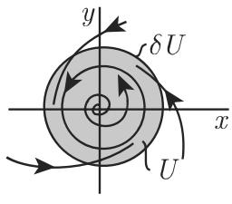

# 数学手册(原书第10版) 17.1.4 结构稳定性

本页是 [[entities/数学手册(原书第10版)]] 17.1.4 节的入库摘要，上承 [[sources/10-数学手册原书第10版--12-171-常微分方程与映射--pd13pm]]。本节围绕一个核心概念展开：**[[concepts/结构稳定性]]**——向量场（或时间离散映射）在 C¹ 小扰动下是否与邻近系统保持相同的轨道拓扑结构。全节分三部分：17.1.4.1 连续系统的定义、平面算例与平面特征定理；17.1.4.2 时间离散系统的平行定义；17.1.4.3 通有性质（贝尔纲集、平面通有性、哈密顿系统与 KAM 定理、非游荡点与莫尔斯—斯梅尔系统、帕利—斯梅尔定理）。

## 核心定义与公式（按原文转录）

**C¹ 度量与结构稳定性（连续情形）**：设 U ⊂ M ⊂ ℝⁿ 为公共的连通吸收开集，边界 ∂U 为光滑 n−1 维超曲面，∂U = {x ∈ ℝⁿ : h(x) = 0}，h: ℝⁿ → ℝ 为 C¹ 且在 ∂U 的某邻域上 grad h ≠ 0。X¹(U) 为 U 上全体光滑向量场构成的度量空间，装配度量

```
ρ(f, g) = sup_{x∈U} ‖f(x) − g(x)‖ + sup_{x∈U} ‖Df(x) − Dg(x)‖        (17.25)
```

（第一项 ‖·‖ 为向量的欧几里得范数，第二项 ‖·‖ 为算子范数。）沿边界横截内向的向量场构成 X₊¹(U) ⊂ X¹(U)：

```
grad h(x)ᵀ f(x) ≠ 0  (x ∈ ∂U)，且 φᵗ(x) ∈ U  (x ∈ ∂U, t > 0)
```

f ∈ X₊¹(U) 称为结构稳定的，若存在 δ>0 使任意满足 ρ(f,g)<δ 的 g ∈ X₊¹(U) 与 f 拓扑等价。

**平面算例（式 17.26）**：

```
ẋ = −y + x(α − x² − y²),   ẏ = x + y(α − x² − y²),   |α| < 1
U = {(x, y) : x² + y² < 2}
ρ(g(·,0), g(·,α)) = |α(√2 + 1)|
极坐标：ṙ = −r³ + αr，v̇ = 1（原文角变量作 v，疑为 θ）
α > 0 时存在稳定的极限环 r = √α；g(·,0) 结构不稳定
```

**离散情形（17.1.4.2）**：Diff¹(U) 为装配 U 上 C¹ 度量的映射空间，Diff₊¹(U) ⊂ Diff(U) 包含满足 φ(Ū) ⊂ U 的微分同胚。φ ∈ Diff₊¹(U)（及相应离散系统）结构稳定 ⟺ 存在 δ>0 使任意 ρ(φ,ψ)<δ 的 ψ 与 φ 拓扑共轭。

**非游荡点（式 17.27）**：设 {φᵗ} 是 n 维紧致可定向流形 M 上的动力系统，p ∈ M 称为非游荡点，若对 p 的任意邻域 U_p ⊂ M，

```
∀T > 0  ∃t, |t| ≥ T：φᵗ(U_p) ∩ U_p ≠ ∅        (17.27)
```

Ω(φᵗ) 是闭的、{φᵗ} 的不变集，包括所有周期轨和所有 Ū 中点的 ω 极限集；稳态解和周期轨仅含非游荡点。

**通有性与贝尔纲算例**：度量空间 (M, ρ) 上性质称为通有的，若满足该性质的元素集合 B 是「第二贝尔纲集」，即 B = ∩_{m=1,2,…} B_m，各 B_m 开且在 M 中稠密。

```
B = ∩_{k=1,2,…} B_k，B_k = ∪_{n≥0} (a_n − 1/(k·2ⁿ), a_n + 1/(k·2ⁿ))，ℚ = {a_n}_{n=0}^∞
λ(B) = lim_{k→∞} λ(B_k) ≤ lim_{k→∞} (2/k)·(1/(1−1/2)) = 0
（原文「λ(B) = lim B_k」疑脱漏 λ；B 为第二贝尔纲集但勒贝格测度为零）
```

**二自由度哈密顿系统与 KAM 定理**：

```
ĵ₁ = 0,  ĵ₂ = 0,  θ̇₁ = ∂H₀/∂j₁,  θ̇₂ = ∂H₀/∂j₂   （H₀(j₁,j₂) 解析）
解：j₁ = c₁, j₂ = c₂, θ₁ = ω₁t + c₃, θ₂ = ω₂t + c₄；(j₁,j₂)=(c₁,c₂) 确定不变环面 T²
扰动：H₀(j₁,j₂) + εH₁(j₁,j₂,θ₁,θ₂)，H₁ 解析，ε > 0 小参数
KAM：若 H₀ 非退化 det(∂²H₀/∂j_k²) ≠ 0（疑漏混合偏导，应为完整黑塞矩阵行列式），
则 ε 充分小时大多数非共振不变环面不消失、仅轻微变形；
「大多数」＝ ε→0 时环面余集勒贝格测度→0
非共振：∃c>0，∀正整数 p,q：|ω₁/ω₂ − p/q| ≥ c/q^{2.5}
```

## 三大定理与主要断言

1. **[[concepts/安德罗诺夫—蓬特里亚金定理]]**（平面，X₊¹(U)）：结构稳定 ⟺ (a) U 内所有平衡点与周期轨双曲；(b) 无分界线（无连接鞍点和鞍点的异宿轨和同宿轨）。配套必要性质：结构稳定的平面系统仅含有限个平衡点和周期轨，且任意 x ∈ Ū 的 ω(x) 仅含平衡点和周期点。
2. **[[concepts/帕利—斯梅尔定理]]**（紧致可定向流形上的流）：[[concepts/莫尔斯—斯梅尔系统]]（有限个双曲平衡点与周期轨 + 稳定/不稳定流形横截相交 + 非游荡点集仅含平衡点和周期轨）是结构稳定的；逆定理不成立（n=3 时存在含无穷多周期轨的结构稳定系统）；n≥3 时结构稳定系统不是通有的。
3. **[[concepts/KAM定理]]**（柯尔莫哥洛夫—阿诺德—莫泽定理）：非退化解析二自由度哈密顿系统经小哈密顿扰动后，大多数非共振不变环面保持。

平面通有性质：X₊¹(U) 中结构稳定系统之集开且稠密（平面系统结构稳定是通有的）；随时间增加趋于有限个平衡点/周期轨中某一个的轨道通有；拟周期轨非通有；哈密顿系统不是通有的。

## 复算与证据强度

- **式 17.25–17.26（强，复算通过）**：见 [[findings/式17-25至17-26C¹度量与平面算例转录复算]]。极坐标化 ṙ = r(α−r²)、θ̇ = 1；ρ(g(·,0),g(·,α)) = |α|(√2+1)（sup‖α(x,y)‖ = √2|α| 于半径 √2 的球上取到，‖αI‖ = |α|）；∂U 上 ṙ = √2(α−2) < 0 验证 g ∈ X₊¹(U)；原点雅可比特征值 α±i，α=0 时纯虚 → 非双曲，与 AP 定理条件自洽。
- **贝尔纲零测算例（强，复算通过）**：见 [[findings/贝尔纲集零测余密集算例复算]]。λ(B_k) ≤ Σₙ 2/(k·2ⁿ) = 4/k → 0，配合 B_k ⊃ B_{k+1} 与 λ(B_k) < ∞（从上连续性）得 λ(B) = 0；ℚ/𝕀 对照说明稠密 ≠ 通有。
- **式 17.27 与 Ω 集性质**：见 [[findings/式17-27非游荡点定义与Ω集性质转录复算]]（定义转录一致；闭性与不变性为手册断言，未独立复证）。
- **哈密顿系统与 KAM**：见 [[findings/二自由度哈密顿系统与KAM非共振条件转录复算]]（解的形式可平凡验证；KAM 为权威引用，无证明）。
- AP 定理、PS 定理、「n=3 反例」与「n≥3 非通有」均为手册陈述（权威引用，复算状态 null），见 [[queries/n=3无穷周期轨反例与n≥3非通有之辨]]。

## 适用范围（断言不得外推）

- AP 定理仅对平面 X₊¹(U) 系统成立，不可外推至 n≥3 或离散系统。
- KAM 定理仅对非退化解析二自由度哈密顿系统与非共振环面成立，不可推广至任意哈密顿或耗散系统。
- 本节未对 [[concepts/逻辑斯谛映射]]、[[concepts/埃农映射]]、[[concepts/洛伦茨系统]] 下任何结构稳定性断言；离散定义仅提供一般视角。
- 两处「扰动」口径不同：KAM 的环面保持指哈密顿类内扰动（H₀+εH₁），而「哈密顿系统不是通有的」是在全体光滑向量场空间中陈述，辨析见 [[concepts/哈密顿系统（作用—角变量）]]。

## 与既有维基的联系

- 回指 17.1.1 系列页：[[concepts/动力系统]]、[[concepts/流（连续时间动力系统）]]、[[concepts/离散动力系统]]、[[concepts/平衡点]]、[[concepts/周期轨道]]、[[concepts/omega极限集与alpha极限集]]、[[concepts/吸收集]]（X₊¹(U) 的内向横截边界条件即吸收集思想的强化）、[[concepts/不变集的稳定性]]（李雅普诺夫稳定性，与结构稳定性对照，见 [[comparisons/结构稳定性与李雅普诺夫稳定性比较]]）。
- 方法论复用：[[methodology/自治微分方程极坐标化求解与极限集核算流程]] 被 17.26 算例直接复用。
- 保守系统知识扩展：[[concepts/耗散系统与保守系统]] 可补入「哈密顿系统非通有 + KAM 环面保持」（待人工更新）。
- 拓扑等价/共轭、双曲性、稳定/不稳定流形与横截相交本节仅使用未定义，疑在尚未入库的 17.1.2/17.1.3，见 [[queries/17-1-4未入库回指缺口]]。

## 转写讹误与口径问题

系统性 OCR 讹误（与既往各节同型）：属千/趋千→属于/趋于、AU/au→∂U、万→U、入→λ、共辄→共轭、帕利淇斤梅尔→帕利—斯梅尔、欧儿里得→欧几里得、「区中」→「ℝ 中」、「所有 中点」脱字、「笫二」→「第二」、φ: M M→φ: M→M 等，汇总于 [[queries/17-1-4全节系统性转写讹误清单]]。另有口径/疑点：手册将「第二贝尔纲集」定义为可数个稠密开集之交（即标准术语的余密集），见 [[queries/第二贝尔纲集定义口径疑为余密集之辨]]；17.1.4.2 称 Diff¹(U) 为「同胚映射」空间却装备 C¹ 度量又称其元素为微分同胚，见 [[queries/Diff¹同胚与微分同胚表述之辨]]；极坐标式 v̇ = 1 疑为 θ̇ = 1，与 [[queries/式17-9b角变量v疑为theta之辨]] 同型，见 [[queries/式17-26极坐标角变量v疑为theta之辨]]。

## 插图

- 图 17.12(a)：`media/10-数学手册原书第10版--10-1714-结构稳定性--qrmz5/001-7f250acb47c8b789c7b9427ce069b861c87877eee2427c53cd1d2483991191b8.jpg`
- 图 17.12(b)：`media/10-数学手册原书第10版--10-1714-结构稳定性--qrmz5/002-9eec3e2ea79b3d55a88b33c66254b3ca0cb59abd67fa1e271b91366ecaa79f7e.jpg`
- 图 17.12(c)：`media/10-数学手册原书第10版--10-1714-结构稳定性--qrmz5/003-3369a24567db2c2535577414f059c57dbc55449880c25f63bce83c82f7a4ea56.jpg`

<!-- llm-wiki:embedded-images -->
## Embedded Images

### Document




<!-- llm-wiki:embedded-images -->
