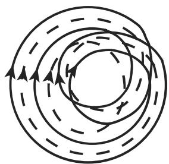
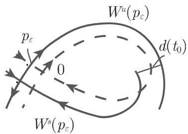
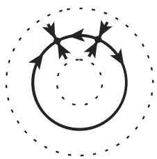
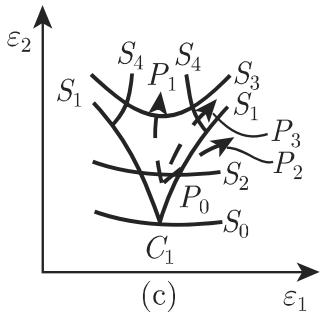

# 数学手册(原书第10版) 17.3.2 过渡到混沌

本节是 17.3《分岔理论和通往混沌之路》的第二节，前节见 [[sources/10-数学手册原书第10版--15-173-分岔理论和通往混沌之路--xq2pz]]。核心论题：奇异吸引子通常不会突然出现，而是伴随一系列分岔产生。全节给出四条典型路径——周期倍增级联（17.3.2.1）、间歇混沌（17.3.2.2）、全局同宿分岔（17.3.2.3）、环面的破裂（17.3.2.4）。本源转写质量较差，存在大量系统性 OCR 讹误，集中记录于 [[queries/17-3-2全节系统性转写讹误清单]]。

## 17.3.2.1 周期倍增级联

与逻辑斯蒂方程 (17.84)（定义见 17.3.1）类似，周期倍增级联也可在连续时间系统 (17.67) 中产生：ε<ε₁ 时系统有稳定周期轨 γ_ε^(1)；ε=ε₁ 处发生周期加倍，γ^(1) 失稳并分裂出近似双周期的周期轨 γ^(2)；ε=ε₂ 处再次加倍……由此产生参数序列 {ε_j}。对于某些微分方程 (17.67)，诸如洛伦茨系统这样的流体方程组的数值计算表明极限

$$
\lim _ {j \to \infty} \frac {\varepsilon_ {j + 1} - \varepsilon_ {j}}{\varepsilon_ {j + 2} - \varepsilon_ {j + 1}} = \delta\tag{17.89}
$$

存在，其中 δ（原文脱符号）仍是费根鲍姆常数。当 ε* = lim_{j→∞} ε_j 时，具有无穷周期的环丧失稳定性，同时出现奇异吸引子；庞加莱截面近似地显示为面包师映射，暗示类康托尔集结构（图 17.34(a)）。**证据强度：数值**（源文明言“数值计算表明”），归属系统 (17.67) 的某些例子（含洛伦茨型流体方程组），非严格证明。详见 [[concepts/周期倍增级联]]、[[concepts/费根鲍姆常数]]、[[findings/式17-89费根鲍姆级联极限转录]]。

## 17.3.2.2 间歇混沌

考虑 (17.67) 的稳定周期轨：若恰有一个乘子在单位圆周上取值 +1（原文“在单位原周内取值为 ”疑脱"+1"，见 [[queries/间歇乘子取值疑脱正一之辨]]），则它在 ε=0 处丧失稳定性。由中心流形定理，庞加莱映射对应的鞍结点分岔可由一维正则形式

`x ↦ F̃(x, α) = α + x + x² + ⋯`（α = α(ε), α(0) = 0）

描述。当 α≳0 时，F̃(·,α) 的迭代在隧道区域停留较久（层流相，(17.68) 的行为近似周期），随后逃逸呈不规则运动（湍流相），经过一段时间后轨道恢复，再次出现新的层流相（图 17.34(b)）。鞍结点分岔只是间歇混沌场景中起作用的典型局部分岔之一，另外两个是周期加倍和环面产生（原文“环而产生”疑讹，见 [[queries/环而产生疑为环面产生之辨]]）。**证据强度：严格**（中心流形定理）。详见 [[concepts/间歇混沌]]。

## 17.3.2.3 全局同宿分岔

### 1. 斯梅尔定理

令 ℝ³ 上微分方程 (17.67) 在周期轨附近的庞加莱映射的不变流形如 17.3.1 图 17.11(b) 所示；对应于 (17.67) 的同宿轨的同宿点横截。则：

- a) 横截同宿点的每个邻域内总存在庞加莱映射 (17.80) 的周期点（斯梅尔定理）；因此存在 P^m（m∈ℕ）不变集 A，具有康托尔集结构，P^m 在 A 上的限制共轭于一个伯努利移位，即共轭于一个混合系统。
- b) 靠近同宿轨的微分方程 (17.67) 的不变集类似于康托尔集与单位圆周的乘积；若这个不变集是吸引的，则它表示 (17.67) 的一个奇异吸引子。

这类同宿轨的存在导致对初始条件的敏感依赖性。详见 [[concepts/斯梅尔定理]]、[[entities/斯梅尔]]。

### 2. 什尔尼科夫定理

考虑 ℝ³ 上具标量参数 ε 的方程 (17.67)，ε=0 处有一个鞍焦点型定常状态（原文作“双曲鞍结点型”，与特征值矛盾，见 [[queries/什尔尼科夫鞍结点疑为鞍焦点之辨]]），D_xf(0,0) 的特征值满足 λ_{1,2} = a±iω（a<0）及 λ₃>0；且 ε=0 处有分界线环 γ₀（t→±∞ 趋于该平衡点的同宿轨，图 17.35(a)）。则：

- a) λ₃+a<0：依据变化 A，若分界线环在 ε≠0 处破裂，则恰有一个周期轨（原文“在 ε = 0 处”疑为“ε ≠ 0 处”，见 [[queries/什尔尼科夫情形a参数ε之辨]]）；依据变化 B，若环在 ε≠0 处破裂，则没有周期轨。
- b) λ₃+a>0：在分界线环 γ₀ 附近存在可数多个鞍点型周期轨；关于横截于 γ₀ 的平面的庞加莱映射在 ε=0 处生成一个马蹄映射的可数集合，当 |ε|≠0 且较小时仍保留有限多个。

详见 [[concepts/什尔尼科夫定理]]、[[entities/什尔尼科夫]]。

### 3. 梅尔尼科夫方法

考虑平面微分方程（ε 为小参数）

$$
\dot{x}=f(x)+\varepsilon g(t,x)\tag{17.90}
$$

ε=0 时 (17.90) 为哈密顿系统（参见第 1138 页 17.1.4.3）。设未扰动系统关于鞍点存在同宿轨 φ(t−t₀)，庞加莱映射 P_{ε,t₀}: Σ_{t₀}→Σ_{t₀} 在 x=0 附近有鞍点 p_ε 及不变流形 W^s(p_ε)、W^u(p_ε)，则沿过 φ(0) 且垂直于 f(φ(0)) 的直线测量的流形间距离为

$$
d(t_0)=\varepsilon\frac{M(t_0)}{\|f(\varphi(0))\|}+O(\varepsilon^2)\tag{17.91}
$$

$$
M(t_0)=\int_{-\infty}^{+\infty}f(\varphi(t-t_0))\wedge g(t,\varphi(t-t_0))\,\mathrm{d}t\tag{17.92}
$$

（a∧b = a₁b₂ − a₂b₁）。若 M 在 t₀ 有单根（M(t₀)=0, M′(t₀)≠0），则对充分小 ε>0 流形横截相交；若 M 无根则无同宿点。异宿轨情形类似成立。

**单摆算例**：ẍ+sinx = εsinωt，H = y²/2 − cosx；异宿轨 φ^±(t) = (±2 arctan(sinh t), ±2/cosh t)（原文"sin t"为转写之讹，见 [[queries/单摆异宿轨sin疑为sinh之辨]]），直接计算得 M(t₀) = ∓2π sin(ωt₀)/cosh(πω/2)；t₀=0 为单根 ⇒ 小 ε>0 时扰动系统的庞加莱映射有横截同宿点。详见 [[concepts/梅尔尼科夫方法]]、[[methodology/梅尔尼科夫函数计算与横截相交判别流程]]、[[findings/式17-90至17-92梅尔尼科夫方法与单摆算例复算]]。

## 17.3.2.4 环面的破裂

### 1. 从环面到混沌

- **霍普夫—朗道模型**：通过无穷霍普夫分岔级联产生湍流——ε=ε₁ 时定常状态在极限环上分岔，导致 T² 的产生；此后每级分岔卷绕在环面上的非闭轨道生成更高一维的环面。**源文自陈：一般来讲，霍普夫—朗道模型不会导致出现对初始条件敏感依赖且为混合的吸引子。**详见 [[concepts/霍普夫—朗道模型]]。
- **吕埃勒—塔肯斯—纽豪斯场景**（原文“吕埃勒—塔肯—纽豪斯”）：在系统 (17.67) 中取定 n≥4（原文"n ≥ l = 1"疑讹，见 [[queries/RTN参数n疑为4之辨]]）、l=1；分岔序列“平衡点—周期轨—环面 T²—环面 T³”由接连三个霍普夫分岔造成。T³ 上的拟周期流是结构不稳定的，于是 (17.67) 的某些小扰动会造成 T³ 的破裂和**结构稳定的**奇异吸引子的产生。详见 [[concepts/吕埃勒—塔肯斯—纽豪斯场景]]。
- **阿弗莱诺维奇—什尔尼科夫定理**（n≥3, l=2）：光滑共振环面 T²(ε₀) 由稳定周期轨 γ_s、鞍型周期轨 γ_u 及 W^u(γ_u) 张成，γ_s 离单位圆周最近的乘子 ρ 为实且单重；ε(·):[0,1]→V 为破坏环面的任意连续路径。结论：a) 存在 s* 使 T² 损失光滑性（ρ 变复或 W^u(γ_u) 失光滑）；b) 存在 s**∈(s*,1) 使环面按 α)/β)/γ)（原文标号 Q)/3)/'Y) 为乱码，见 [[queries/情形标号Q3Y疑为αβγ之辨]]）三方式破裂：α) γ_s 失稳（周期加倍，可续以级联生奇异吸引子；或新环面，定理递归适用）；β) γ_s 与 γ_u 融合（鞍结点），环面破裂、可经间歇过渡到混沌；γ) γ_u 的稳定/不稳定流形非横截相交，形成非稳健同宿曲线，保留非吸引双曲集，γ_s 消失则生奇异吸引子。参数平面曲线 S₀–S₄ 与喙状末梢（C₁、P₀–P₃）刻画各过渡；喙状末梢处公式乱码待核（[[queries/喙状末梢公式乱码待核]]）。详见 [[concepts/阿弗莱诺维奇—什尔尼科夫定理]]。

### 2. 单位圆周上的映射和旋转数

等变映射与提升映射：

$$
\Theta_{n+1}=F(\Theta_n),\quad F(\theta+1)=F(\theta)+1\tag{17.93}
$$
$$
x_{t+1}=f(x_t),\quad \mathbb{S}^1=\mathbb{R}/\mathbb{Z}\tag{17.94}
$$

标准圆周映射 σ_{n+1}=σ_n+ω−K sin σ_n (17.95) 经 σ_n=2πθ_n 化为典范形式

$$
\Theta_{n+1}=\Theta_n+\Omega-\frac{K}{2\pi}\sin 2\pi\Theta_n,\quad \Omega=\frac{\omega}{2\pi}\tag{17.96}
$$

**旋转数**：ρ(F) := lim_{|n|→∞} Fⁿ(x)/n（保定向同胚，极限存在且不依赖 x）；同一 f 的两个提升满足 ρ(F)=ρ(F̃)+k，故 ρ(f)=ρ(F) mod 1 良定义。性质 a)–d)：有周期轨 ⇒ ρ(f)=p/q；ρ(f)=0 ⇔ 有平衡点；ρ(f)=p/q（p≠0, p,q 互素）⇒ 有周期轨；ρ(f) 无理 ⇔ 既无周期轨也无平衡点（引 [17.11]）。**当茹瓦定理**：C² 保定向微分同胚 + 无理旋转数 α ⇒ 拓扑共轭于提升为 x↦x+α 的纯旋转。详见 [[concepts/等变映射与提升映射]]、[[concepts/旋转数]]、[[concepts/当茹瓦定理]]。

### 3. 环面 T² 上的微分方程

$$
\dot{\Theta}_1=f_1(\Theta_1,\Theta_2),\quad \dot{\Theta}_2=f_2(\Theta_1,\Theta_2)\tag{17.97}
$$
$$
\frac{\mathrm{d}\Theta_2}{\mathrm{d}\Theta_1}=\frac{f_2}{f_1}\tag{17.98}
$$
$$
\dot{x}=f(t,x)\tag{17.99}
$$

f₁ 处处大于 0 时 (17.97) 无平衡点且约化为周期标量方程 (17.99)；时间-1 映射 φ¹(·)=φ(1,·) 可看成圆周映射的提升；常数流 ω₁,ω₂ 给出 φ¹(x)=x+ω₂/ω₁。复算见 [[findings/式17-97至17-99环面流约化转录复算]]。

### 4. 圆周映射的典范形式

由 ∂F/∂ϑ = 1−K cos 2πϑ：0≤K<1 时 (17.96) 为保定向微分同胚；K=1 不再是微分同胚但仍是同胚；K>1 时不可逆。固定 K∈(0,1)，ρ(·,K) 在 [0,1] 上：a) 非减且连续（原文“连续但不可微”疑过强）；b) 每个有理数 p/q 有内部非空的区间 I_{p/q} 使 ρ=p/q；c) 每个无理数 α 恰对应一个 Ω。ρ(·,K) 为康托尔函数（**魔鬼阶梯**，图 17.37(b)）；从 Ω 轴上每个有理数点长出喙状区域（**阿诺尔德舌**），其中旋转数常数且等于该有理数——频率同步化（频率锁定）是其成因。0≤K<1 时舌不交叠，从每个无理数点可引连续曲线到达 K=1；ρ=0 的第一个舌内动力系统有平衡点，固定 K 令 Ω 增长时两个平衡点在舌边界融合并消失（鞍结点分岔），S¹ 上出现稠密轨。K>1 时旋转数理论失效，出现类似费根鲍姆常数的另外的普适常数，对某些映射类相等（标准圆周映射属于这一类）。**黄金分割与斐波那契数**：(√5−1)/2（连分数记法疑脱前导 0，应为 [0;1,1,1,⋯]，见 [[queries/黄金分割连分数疑脱前导0之辨]]）；F₀=0, F₁=1, F_{n+1}=F_n+F_{n−1}，rₙ=Fₙ/F_{n+1} 收敛于 (√5−1)/2。令 ρ(Ω_∞,1)=(√5−1)/2、ρ(Ω_n,1)=rₙ，数值计算给出

$$
\lim_{n\to\infty}\frac{\Omega_n-\Omega_{n-1}}{\Omega_{n+1}-\Omega_n}=-2.8336\cdots
$$

详见 [[concepts/圆周映射典范形式]]、[[concepts/魔鬼阶梯（康托尔函数）]]、[[concepts/阿诺尔德舌与频率锁定]]、[[findings/黄金分割圆周映射常数-2.8336转录]]。

## 证据强度与归属警示

- 式 (17.89) 的 δ 极限：**数值证据**，对象为“某些微分方程 (17.67)，诸如洛伦茨系统这样的流体方程组”的数值计算，非对洛伦茨系统本身的严格证明。
- −2.8336：**数值常数**，归属 K=1 的标准圆周映射沿斐波那契序列的情形，与 δ 分属不同对象，不可互换（见 [[comparisons/费根鲍姆常数与圆周映射黄金分割普适常数比较]]）。
- “结构稳定的奇异吸引子”是 RTN 的措辞；A-S 情形 γ) 仅产生非吸引双曲集、γ_s 消失后才成奇异吸引子（见 [[queries/RTN结构稳定奇异吸引子与结构稳定性之辨]]）。
- HL 模型被源文明确否定为产生敏感依赖且混合吸引子的机制（源内部刻意对比，非矛盾）。
- 斯梅尔定理、什尔尼科夫定理、梅尔尼科夫方法、RTN、A-S 定理、当茹瓦定理为严格结果；间歇混沌正则形式由中心流形定理保证。

## 与既有 wiki 的联系

- [[sources/10-数学手册原书第10版--15-173-分岔理论和通往混沌之路--xq2pz]]：直接前驱；(17.67)、(17.68)、(17.80)、(17.84)、图 17.11(b) 及 17.3.1 典型分岔均回指该节——部分回应 [[queries/17-3未入库回指缺口]]，同时登记本节新增回指（[[queries/17-3-2未入库回指缺口]]）。
- [[sources/10-数学手册原书第10版--12-1726-一维映射的混沌--l6tj88]]：将逻辑斯蒂级联（一维）推广至连续时间系统；费根鲍姆常数跨节复现。
- [[sources/10-数学手册原书第10版--13-1725-奇异吸引子与混沌--1kdz8qx]]：斯梅尔定理为奇异吸引子、敏感依赖、伯努利移位（式 17.59）提供**产生机制**——强化而非挑战。
- [[sources/10-数学手册原书第10版--10-1714-结构稳定性--qrmz5]]：RTN 的“结构稳定奇异吸引子”与“T³ 拟周期流结构不稳定”直接衔接 [[concepts/结构稳定性]]。
- [[sources/10-数学手册原书第10版--12-1724-维数--1sapdhv]]：级联吸引子截面≈[[concepts/耗散面包师映射]]；同宿不变集≈康托尔集×圆周（与 [[entities/螺线管]] 局部结构同型）。
- [[sources/10-数学手册原书第10版--14-1721-吸引子上的概率测度--qm9tb9]]：伯努利共轭⇒混合延伸 [[concepts/混合性]]；旋转数内容延伸 [[concepts/圆周旋转映射]]。
- [[concepts/普遍性]]：δ 与 −2.8336 两个普适常数及“某些映射类上常数相等”强化该页。
- 译名：本节“塔肯斯”即 17.2.7 的 [[entities/塔肯]]（Takens）；“阿诺尔德”即 [[entities/阿诺德]]（Arnold）。
- 四条路径总览见 [[comparisons/过渡到混沌四条路径比较]]；同宿三定理见 [[comparisons/同宿分岔三定理比较]]；HL 与 RTN 见 [[comparisons/霍普夫—朗道模型与吕埃勒—塔肯斯—纽豪斯场景比较]]。

## 图版

- 图 17.34 (a) 周期倍增级联产生的奇异吸引子的几何背景；(b) 间歇混沌正则形式图像：

- 图 17.35 (a) 什尔尼科夫定理分界线环；(b) 梅尔尼科夫方法的庞加莱截面：

- 图 17.36 阿弗莱诺维奇—什尔尼科夫定理的庞加莱映射不变流形与分岔图：

- 图 17.37 (a) 圆周映射分岔图与阿诺尔德舌；(b) 魔鬼阶梯：

## 转写讹误概览

系统性 OCR 代换（千→于、而→面、厌/叹/砓/IR→ℝ、单位原周→单位圆周、“才十尔尼科夫”→什尔尼科夫等）、图号 7.34/7.35/7.36 应为 17.x、“第113817.1.4.3”应为“第 1138 页 17.1.4.3”、多处脱符号（δ、F、q、Ω、M、k、ε、r、“+1”等）、末尾“18 优 化”为下一章标题混入应剔除——全部细目见 [[queries/17-3-2全节系统性转写讹误清单]]。

<!-- llm-wiki:embedded-images -->
## Embedded Images

### Document

<!-- llm-wiki:embedded-images -->
