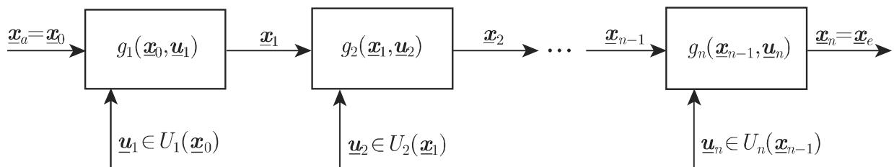

# 数学手册(原书第10版) 18.3 离散动态规划

## 来源与范围

本页对应《数学手册(原书第10版)》第 18 章第 3 节「离散动态规划」的中译转写文本，节末署名「（冯德兴 译）」。该节与已入库的 [[sources/10-数学手册原书第10版--8-181-线性规划--12v6ql9]]（18.1 线性规划）和 [[sources/10-数学手册原书第10版--11-182-非线性优化问题--1gv38ye]]（18.2 非线性优化问题）并列，构成第 18 章的三大支柱。文末另溢出一段第 19 章（数值分析）引言片段（提及 Mathematica 及 19.8.2–19.8.4、20.1 页码），属下一 source 的先导内容，本页仅作线索记录（见 [[queries/18-3未入库回指缺口]]）。

## 节结构

| 小节 | 内容要点 |
|---|---|
| 18.3.1 离散动态决策模型 | 18.3.1.1 n 级决策过程（式 18.125、图 18.14）；18.3.1.2 动态规划问题（式 18.126a 标准形、动态约束与静态约束、可行策略） |
| 18.3.2 离散决策模型的例子 | 18.3.2.1 购买问题（式 18.127a/b、18.128）；18.3.2.2 背包问题（式 18.129a/b） |
| 18.3.3 贝尔曼泛函方程 | 18.3.3.1 费用函数的性质（可分性式 18.130、极小可交换性式 18.131–18.132、和式/最大值型式 18.133–18.135）；18.3.3.2 列出泛函方程（式 18.136–18.138） |
| 18.3.4 贝尔曼最优性原理 | 式 18.139–18.140，子过程后缀最优性 |
| 18.3.5 贝尔曼泛函方程方法 | 18.3.5.1 最小费用的确定（后向递推、节点+插值）；18.3.5.2 最优策略的确定（方式 1、方式 2 及比较，式 18.141） |
| 18.3.6 泛函方程方法的应用例子 | 18.3.6.1 最优购买策略（式 18.142a/b、18.143–18.144 及数值表）；18.3.6.2 背包问题（式 18.145a/b 及泛函方程、数值表） |

## 核心主张

1. 多级决策问题可写成 OF/CT 形式的动态规划标准形（式 18.126a），目标为极小化，极大问题对称处理（[[concepts/动态规划标准形]]）。
2. 当费用函数满足可分性（式 18.130）且诸 $H_j$ 满足极小可交换性（式 18.131–18.132）时，最优值由贝尔曼泛函方程（式 18.136–18.138）后向递推刻画，$\varphi_1(x_0)$ 即最优值；不可行状态置 $\infty$（[[concepts/贝尔曼泛函方程]]）。
3. 贝尔曼最优性原理：整体最优策略的任意后缀 $(u_j^*,\dots,u_n^*)$ 在初始状态 $x_{j-1}^*$ 下对子过程 $P_j$ 亦最优（[[concepts/贝尔曼最优性原理]]）。
4. 求解分两阶段：后向递推定 $\varphi_j$，前向回代定最优策略；方式 1 前向代价小但需逐状态存储决策，方式 2 仅存 $\varphi_j$ 但前向每级须解一个优化问题（式 18.141），高维决策空间时常在计算机上用方式 2；背包问题因 $u_j\in\{0,1\}$ 宜用方式 1（[[concepts/贝尔曼泛函方程方法]]）。
5. 两个完整数值算例（最优购买策略、背包问题）给出全部 $\varphi_j$ 值表与最优策略，均可独立复算验证。

## 关键结构化数据（逐字转录）

```latex
% (18.125) 状态变换
x_j = g_j(x_{j-1}, u_j),  j = 1(1)n

% (18.126a) 动态规划标准形（末行 ℝ^m 疑为 ℝ^s；正文 X_e ⊆ ℝ_m 下标疑为上标）
OF: f(f_1(x_0,u_1), …, f_n(x_{n-1},u_n)) → min!
CT: x_j = g_j(x_{j-1},u_j),  j = 1(1)n
    x_0 = x_a,  x_n = x_e ∈ X_e,  x_j ∈ X_j ⊆ ℝ^m,  j = 1(1)n
    u_j ∈ U_j(x_{j-1}) ⊆ ℝ^m,  j = 1(1)n

% (18.127a) 购买问题
OF: f(u_1,…,u_n) = Σ_{j=1}^n f_j(u_j) = Σ_{j=1}^n c_j u_j → min!
CT: x_j = x_{j-1} + u_j − v_j,  j = 1(1)n
    x_0 = x_a,  0 ⩽ x_j ⩽ K,  j = 1(1)n
    U_j(x_{j-1}) = {u_j : max{0, v_j − x_{j-1}} ⩽ u_j ⩽ K − x_{j-1}},  j = 1(1)n

% (18.128) 含单位储存费用 ℓ 的修正费用函数
f(x_0,u_1,…,x_{n-1},u_n) = Σ_{j=1}^n (c_j u_j + (x_{j-1} + u_j − v_j/2)·ℓ)

% (18.129a/b) 背包问题（a 式 min! 疑为 max!）
OF: f(u_1,…,u_n) = Σ_{j=1}^n c_j u_j → min!
CT: x_j = x_{j-1} − w_j u_j,  j = 1(1)n
    x_0 = W,  0 ⩽ x_j ⩽ W,  j = 1(1)n
    u_j ∈ {0,1}  若 x_{j-1} ⩾ w_j；  u_j = 0  若 x_{j-1} < w_j

% (18.131) 极小可交换性
min_{(a,b)∈A×B} H(f̃(a), F̃(b)) = min_{a∈A} H(f̃(a), min_{b∈B} F̃(b))

% (18.133) 和式与最大值型费用函数
f^sum = Σ_{j=1}^n f_j(x_{j-1},u_j)   或   f^max = max_{j=1(1)n} f_j(x_{j-1},u_j)

% (18.136)–(18.138) 贝尔曼泛函方程
φ_j(x_{j-1}) = min_{u_k∈U_k(x_{k-1}), k=j(1)n} F_j(f_j(x_{j-1},u_j), …, f_n(x_{n-1},u_n))
φ_{n+1}(x_n) = 0
φ_j(x_{j-1}) = min_{u_j∈U_j(x_{j-1})} H_j(f_j(x_{j-1},u_j), φ_{j+1}(g_j(x_{j-1},u_j)))

% (18.141) 方式 2 的前向方程
φ_j(x*_{j-1}) = min_{u_j∈U_j(x*_{j-1})} H_j(f_j(x*_{j-1},u_j), φ_{j+1}(g_j(x*_{j-1},u_j)))

% (18.143)–(18.144) 购买问题的泛函方程（144 之 max 疑为 min）
φ_{n+1}(x_n) = 0
φ_j(x_{j-1}) = max_{u_j∈U_j(x_{j-1})} (c_j u_j + φ_{j+1}(x_{j-1} + u_j − v_j)),  j = 1(1)n

% (18.145a) 背包问题标准形（极大形式）
OF: f(u_1,…,u_n) = Σ_{j=1}^n c_j u_j → max!
CT: 同 (18.129b)

% 背包问题的泛函方程（极大形式，未编号）
φ_{n+1}(x_n) = 0
φ_j(x_{j-1}) = max_{u_j∈U_j(x_{j-1})} (c_j u_j + φ_{j+1}(x_{j-1} − w_j u_j)),  j = 1(1)n
```

图 18.14（n 级决策过程示意图）：



## 算例一：最优购买策略（18.3.6.1）

数据：$n=6,\ K=10,\ x_a=2$；$c=(4,3,5,3,4,2)$，$v=(6,7,4,2,4,3)$。对状态 $x_{j-1}=0,1,\dots,10$ 后向计算 $\varphi_j$（只需对 $u_j$ 的整数值进行极小搜索），得

| $j \backslash x_{j-1}$ | 0 | 1 | 2 | 3 | 4 | 5 | 6 | 7 | 8 | 9 | 10 |
|---|---|---|---|---|---|---|---|---|---|---|---|
| $j=1$ | | | 75 | | | | | | | | |
| 2 | 59 | 56 | 53 | 50 | 47 | 44 | 41 | 38 | 35 | 32 | 29 |
| 3 | 44 | 39 | 34 | 29 | 24 | 21 | 18 | 15 | 12 | 9 | 6 |
| 4 | 24 | 21 | 18 | 15 | 12 | 9 | 6 | 4 | 2 | 0 | 0 |
| 5 | 22 | 18 | 14 | 10 | 6 | 4 | 2 | 0 | 0 | 0 | 0 |
| 6 | 6 | 4 | 2 | 0 | 0 | 0 | 0 | 0 | 0 | 0 | 0 |

前向回代（方式 2）得最优策略 $(u_1^*,\dots,u_6^*)=(4,10,1,6,0,3)$，$\varphi_1(2)=75$，状态序列 $x^*=(2,0,3,0,4,0,0)$。全表逐值复算相符，见 [[findings/购买问题算例六行φ值表复算]]。

## 算例二：背包问题（18.3.6.2）

数据行（照录）：$W=10,\ n=6$；$c=(1,2,3,1,5,4)$，$w=(2,4,6,3,7,6)$。表中每格为 $\varphi_j(x_{j-1});\,u_j(x_{j-1})$：

| $j \backslash x_{j-1}$ | 0 | 1 | 2 | 3 | 4 | 5 | 6 | 7 | 8 | 9 | 10 |
|---|---|---|---|---|---|---|---|---|---|---|---|
| $j=1$ | | | | | | | | | | | 19;0 |
| 2 | 0;0 | 3;0 | 4;1 | 7;1 | 9;0 | 10;1 | 13;1 | 13;1 | 15;0 | 16;0 | 19;1 |
| 3 | 0;0 | 3;0 | 3;0 | 6;1 | 9;1 | 9;0 | 10;0 | 12;1 | 15;1 | 16;1 | 16;0 |
| 4 | 0;0 | 3;1 | 3;1 | 3;1 | 6;0 | 9;1 | 10;1 | 10;1 | 10;1 | 13;0 | 16;1 |
| 5 | 0;0 | 0;0 | 0;0 | 0;0 | 6;0 | 7;1 | 7;1 | 7;1 | 7;1 | 13;1 | 13;1 |
| 6 | 0;0 | 0;0 | 0;0 | 0;0 | 6;1 | 6;1 | 6;1 | 6;1 | 6;1 | 6;1 | 6;1 |

最优策略 $(0,1,1,1,0,1)$，$\varphi_1(10)=19$。**复算发现**：按数据行原义（$w=(2,4,6,3,7,6)$、$c=(1,2,3,1,5,4)$）表格与最优解不符；若将 $c$ 与 $w$ 两行互换（权重 $(1,2,3,1,5,4)$、价值 $(2,4,6,3,7,6)$），则全表逐值复算完全相符，且同时解释内联算式中的 $w_3=3$、$c_3=6$、$w_6=4$、$c_6=6$，见 [[findings/背包问题算例表复算]] 与 [[queries/背包算例c与w数据行疑互换之辨]]。

## 实质性讹误与疑点

本节转写存在多项直接改变算法语义的讹误，均另立 query 追踪：

- 式 (18.129a) 背包目标函数印作 `→ min!`，与题设「总价值最大」及式 (18.145a) 的 `→ max!` 矛盾（[[queries/式18-129a疑为max之辨]]）。
- 式 (18.144) 购买问题泛函方程印作 `max`，与式 (18.142a) 的 min 及本节全部后向/前向计算矛盾（[[queries/式18-144疑为min之辨]]）。
- 背包算例数据行 $c$/$w$ 疑互换（[[queries/背包算例c与w数据行疑互换之辨]]）。
- 式 (18.142b) 「$0 \leqslant j \leqslant K$」与式 (18.127a) 「$0 \leqslant x_j \leqslant K$」矛盾，疑脱 $x$（[[queries/式18-142b疑脱x之辨]]）。
- 其余（购买时机「周期结束时」与储存费用公式不符、贝尔曼原理段 $(u_j,\dots,u_n)$ 记号自相矛盾、$u_6$ 分段第二支 0 疑为 1、式 (18.126a) 决策空间 $\mathbb{R}^m$ 疑为 $\mathbb{R}^s$、「可行约束」疑为「可行策略」、系统性 OCR 噪声等）汇总于 [[queries/18-3全节系统性转写讹误清单]]。

## 关联页面

- 概念：[[concepts/离散动态规划]]、[[concepts/n级决策过程]]、[[concepts/动态规划标准形]]、[[concepts/购买问题（库存—采购模型）]]、[[concepts/背包问题（0-1背包）]]、[[concepts/可分性（动态规划）]]、[[concepts/极小可交换性]]、[[concepts/贝尔曼泛函方程]]、[[concepts/贝尔曼最优性原理]]、[[concepts/贝尔曼泛函方程方法]]
- 人物：[[entities/贝尔曼]]
- 方法：[[methodology/贝尔曼泛函方程后向递推流程]]、[[methodology/泛函方程前向回代方式一与方式二流程]]
- 发现：[[findings/式18-125至18-126状态变换与标准形转录]]、[[findings/式18-127至18-129购买与背包模型转录]]、[[findings/式18-130至18-135可分性与可交换性转录复算]]、[[findings/式18-136至18-141贝尔曼泛函方程转录]]、[[findings/购买问题算例六行φ值表复算]]、[[findings/背包问题算例表复算]]
- 比较：[[comparisons/泛函方程方法方式一与方式二比较]]、[[comparisons/购买问题与背包问题建模比较]]、[[comparisons/贝尔曼最优性原理与库恩—塔克条件比较]]

<!-- llm-wiki:embedded-images -->
## Embedded Images

### Document


<!-- llm-wiki:embedded-images -->
