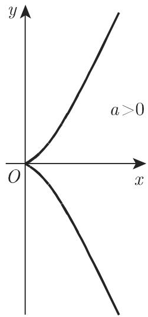
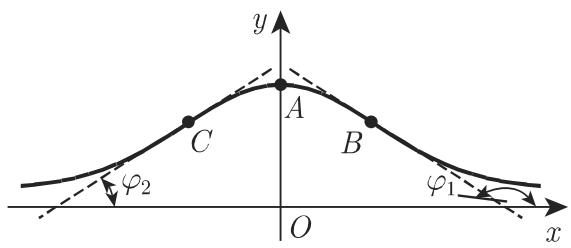
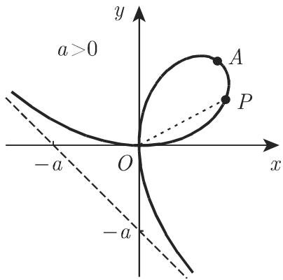
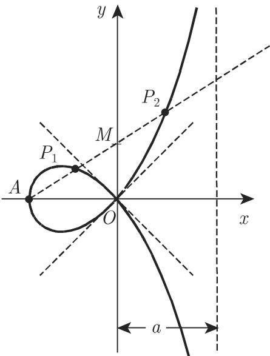

# 数学手册(原书第10版) 2.11 三阶(三次)曲线

本页对应 [[数学手册原书第10版]] 第 2.11 节「三阶(三次)曲线」。该节先给出 $n$ 阶代数曲线的一般定义，然后依次讨论五种经典三阶曲线——[[二分之三次抛物线]]、[[阿涅西箕舌线]]（及其一般化 [[洛伦兹曲线]]）、[[笛卡儿叶形线]]、[[蔓叶线]]、[[环索线]]——的方程（直角坐标、参数、极坐标三种形式）与几何要素（奇点、渐近线、顶点、极值、拐点、曲率、面积）。

## 总纲：n 阶代数曲线

> 若曲线可以写成关于两个变量的多项式方程 $F(x,y) = 0$ 的形式，其中方程的左边为一个 $n$ 次多项式表达式，则称该曲线为 $n$ 阶代数曲线。

手册给出的阶数实例：心脏线 $\left(x^{2} + y^{2}\right)\left(x^{2} + y^{2} - 2ax\right) - a^{2}y^{2} = 0\ (a > 0)$（参见第 128 页 2.12.2）是四阶代数曲线；著名的圆锥曲线（参见第 277 页 3.5.2.11）是二阶曲线。详见 [[代数曲线的阶的定义与阶数实例]]。

## 2.11.1 二分之三次抛物线（式 2.225，图 2.57）

$$
y = a x ^ {3/2} \quad (a > 0, x \geqslant 0)\tag{2.225a}
$$

$$
x = t ^ {2}, \quad y = a t ^ {3} \quad (a > 0, - \infty < t < \infty)\tag{2.225b}
$$

原点为尖点，函数无渐近线；曲率 $K = \dfrac{6a}{\sqrt{x}(4 + 9a^2x)^{3/2}}$ 取遍从 $\infty$ 到 0 的所有值；从原点到点 $P(x, y)$ 的曲线弧长 $L = \dfrac{1}{27a^2}\left[(4 + 9a^2x)^{3/2} - 8\right]$。

## 2.11.2 阿涅西箕舌线（式 2.226，图 2.58）

$$
y = \frac {a ^ {3}}{a ^ {2} + x ^ {2}} \quad (a > 0, - \infty < x < \infty)\tag{2.226a}
$$

渐近线方程为 $y = 0$；极值点为 $A(0, a)$，该点处曲率半径 $r = \dfrac{a}{2}$；拐点 $B, C$ 为 $\left(\pm \dfrac{a}{\sqrt{3}}, \dfrac{3a}{4}\right)$，此处切线倾斜角的斜率 $\tan \varphi = \mp \dfrac{3\sqrt{3}}{8}$；曲线和渐近线围成的面积 $S = \pi a^2$。

阿涅西箕舌线（2.226a）是洛伦兹（Lorentz）曲线或布赖特-维格纳（Breit-Wigner）曲线

$$
y = \frac {a}{b ^ {2}} + (x - c) ^ {2}\ \text{（见下式 2.226b）}
$$

$$
y = \frac {a}{b ^ {2} + (x - c) ^ {2}} \quad (a > 0, b \neq 0)\tag{2.226b}
$$

的特殊情况（参数对应：分子 $a \to a^3$、$b \to a$、$c \to 0$；注意 2.226a 与 2.226b 中字母 $a$ 含义不同）。

手册旁注：**阻尼振荡的傅里叶变换是洛伦兹或布赖特-维格纳曲线**（参见第 1033 页 15.3.1.4）。

## 2.11.3 笛卡儿叶形线（式 2.227，图 2.59）

$$
x ^ {3} + y ^ {3} = 3 a x y \quad (a > 0)\tag{2.227a}
$$

$$
x = \frac {3 a t}{1 + t ^ {3}},\ y = \frac {3 a t ^ {2}}{1 + t ^ {3}},\quad t = \tan \nless POx\ (a > 0, - \infty < t < - 1, - 1 < t < \infty)\tag{2.227b}
$$

（原文的「$\nless$」疑为角符号「$\angle$」的转写讹误，见 [[式2-231c角符号tan-xPOx是否转写丢失]]。）

曲线两次通过原点，故原点为二重点，坐标轴为该点处的切线；原点处两曲线分支的曲率半径均为 $r = \dfrac{3a}{2}$；渐近线方程为 $x + y + a = 0$；顶点 $A$ 的坐标为 $\left(\dfrac{3}{2}a, \dfrac{3}{2}a\right)$；环部面积 $S_{1} = \dfrac{3a^{2}}{2}$，曲线与渐近线围成的面积 $S_{2}$ 的值与之相同。

## 2.11.4 蔓叶线（式 2.228–2.229，图 2.60）

$$
y ^ {2} = \frac {x ^ {3}}{a - x} \quad (a > 0)\tag{2.228a}
$$

$$
x = \frac {a t ^ {2}}{1 + t ^ {2}},\ y = \frac {a t ^ {3}}{1 + t ^ {2}},\quad t = \tan \nless POx\ (a > 0, - \infty < t < \infty)\tag{2.228b}
$$

$$
\rho = \frac {a \sin^ {2} \varphi}{\cos \varphi} \quad (a > 0)\tag{2.228c}
$$

以上方程确定满足

$$
\overline {OP} = \overline {MQ}\tag{2.229}
$$

的点 $P$ 的轨迹，其中 $M$ 是直线 $OP$ 和半径为 $\dfrac{a}{2}$ 的圆的交点，且 $Q$ 为直线 $OP$ 和渐近线 $x = a$ 的交点（定义中未指明圆心，见 [[蔓叶线定义中半径a除2的圆是否缺少圆心]]）。曲线与渐近线围成的面积 $S = \dfrac{3}{4}\pi a^{2}$。

## 2.11.5 环索线（式 2.230–2.231，图 2.61）

设 $P_{1}, P_{2}$ 是以 $A$（$A$ 在 $x$ 轴的负半轴）为起点且满足

$$
\overline {MP _ {1}} = \overline {MP _ {2}} = \overline {OM}\tag{2.230}
$$

的任意射线上的点，其中 $M$ 为射线与 $y$ 轴的交点，则称点 $P_{1}, P_{2}$ 的轨迹为环索线。其笛卡儿方程、极坐标方程和参数方程分别为

$$
y ^ {2} = x ^ {2} \left(\frac {a + x}{a - x}\right) \quad (a > 0)\tag{2.231a}
$$

$$
\rho = - a \frac {\cos 2 \varphi}{\cos \varphi} \quad (a > 0)\tag{2.231b}
$$

$$
x = a\frac{t^2 - 1}{t^2 + 1},\quad y = at\frac{t^2 - 1}{t^2 + 1},\quad t = \tan xPOx\ (a > 0,\ -\infty < t < \infty)\tag{2.231c}
$$

（原文「$\tan xPOx$」中的角符号疑在转写中丢失，见 [[式2-231c角符号tan-xPOx是否转写丢失]]。）

原点为二重点，此处切线方程为 $y = \pm x$；渐近线方程为 $x = a$；顶点为 $A(-a, 0)$；环部面积 $S_{1} = 2a^{2} - \dfrac{1}{2}\pi a^{2}$，曲线与渐近线围成的面积 $S_{2} = 2a^{2} + \dfrac{1}{2}\pi a^{2}$。

## 插图

## 转写疑点清单

1. 式 2.225a 显式方程与式 2.225b 参数方程的分支不一致 → [[式2-225a显式方程是否仅覆盖上半支]]
2. 角符号转写问题：2.227b/2.228b 的「$\nless$」与 2.231c 的「$\tan xPOx$」→ [[式2-231c角符号tan-xPOx是否转写丢失]]
3. 蔓叶线定义中「半径为 $a/2$ 的圆」未指明圆心 → [[蔓叶线定义中半径a除2的圆是否缺少圆心]]
4. 「洛伦兹曲线」中文名与经济学 Lorenz 曲线撞名 → [[洛伦兹曲线与经济学Lorenz曲线如何区分]]

## 验证状态

本节公式的验证情况（详见各发现页）：曲率 $K$ 与弧长 $L$（二分之三次抛物线）、箕舌线的极值点/拐点/斜率/曲率半径/面积 $\pi a^2$、叶形线参数式与原点曲率半径、蔓叶线三种方程的等价性、环索线三形式方程的等价性与环部面积 $S_1$，均经导入分析解析重推证实；叶形线两个面积与蔓叶线面积为教科书级经典结果，与标准值一致。

## 与既有 Wiki 的联系

- [[渐近线]]（来自 2.4）：本节新增水平（$y=0$）、竖直（$x=a$）、斜（$x+y+a=0$）三类渐近线实例。
- [[阻尼振荡]]（来自 2.7）：阻尼振荡的傅里叶变换为 [[洛伦兹曲线]]（手册 15.3.1.4）。
- [[误差曲线]]（来自 2.6）：与洛伦兹曲线同为钟形线型，见 [[误差曲线与洛伦兹曲线比较]]。
- [[第I类三次曲线]]、[[第II类三次曲线]]、[[第III类三次曲线]]（来自 2.4）：三次多项式函数图像是三阶代数曲线的特例，术语辨析见 [[代数曲线]]。

## 前向引用锚点（待后续导入）

- 心脏线：第 128 页 2.12.2（四阶代数曲线）。
- 圆锥曲线：第 277 页 3.5.2.11（二阶曲线）。
- 阻尼振荡的傅里叶变换：第 1033 页 15.3.1.4。

<!-- llm-wiki:embedded-images -->
## Embedded Images

### Document

<!-- llm-wiki:embedded-images -->
