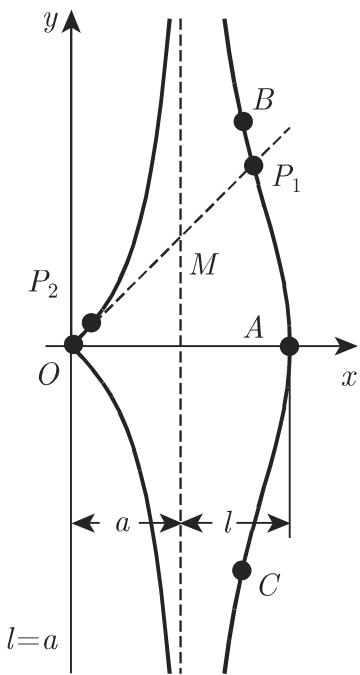
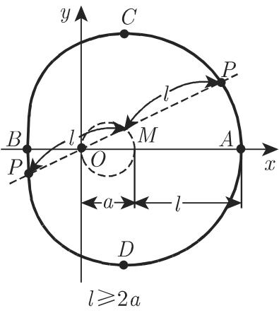
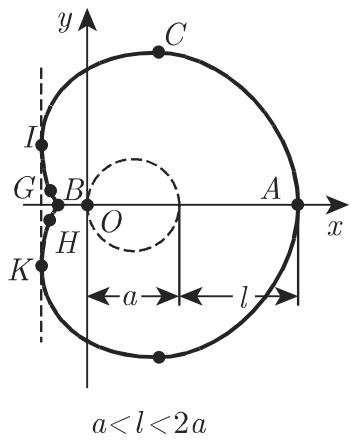
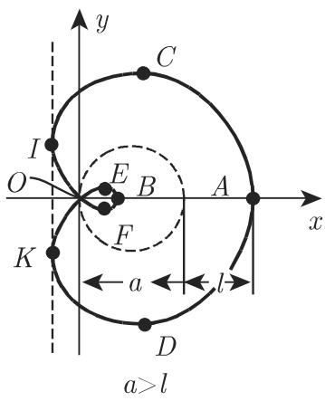
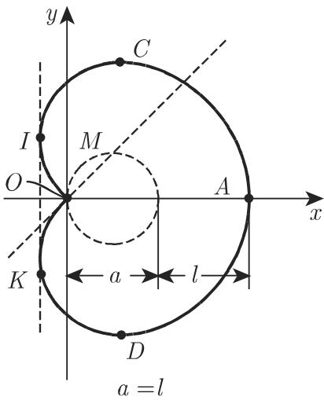
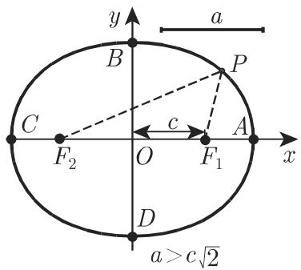
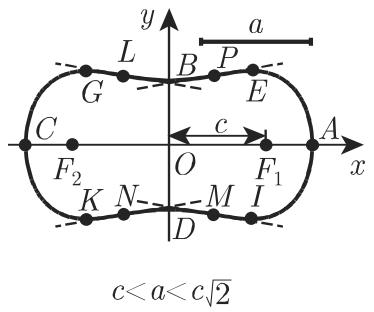
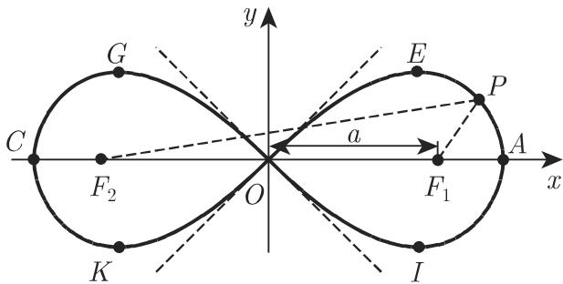

# 数学手册(原书第10版) 2.12 四阶(四次)曲线

本文件是 [[entities/数学手册原书第10版]] 2.x 函数与曲线系列的 2.12 节，主题为隐式方程总次数为 4 的代数曲线（见 [[concepts/四阶四次曲线]]）。全节按两条特化链组织六条曲线：

- **蚌线族**：[[concepts/一般蚌线]]（2.12.2，式 2.234 的统一构造）⟶ [[concepts/尼科梅德斯蚌线]]（2.12.1，直线的蚌线）与 [[concepts/帕斯卡蜗线]]（2.12.3，过极点、直径为 a 的圆的蚌线）⟶ [[concepts/心脏线]]（2.12.4，蜗线 a = l 的特例）；
- **卡西尼族**：[[concepts/卡西尼曲线]]（2.12.5，到两焦点距离之积为常数 a² 的轨迹）⟶ [[concepts/双纽线]]（2.12.6，a = c 的特例）。

两族的形态均由参数比（l/a 或 a/c）驱动，原点奇点在孤立点、尖点、二重点之间切换（[[concepts/曲线的奇点三型]]）；其中两族蚌线的三分律方向相反，是本节最易误用之处（[[comparisons/尼科梅德斯蚌线与帕斯卡蜗线奇点分类比较]]）。本节延续 2.3–2.10 各节“按参数比分情形给特征点公式”的体例，与 [[findings/第II类三次曲线按判别式三情形的公式体系]]、[[findings/第III类三次曲线的六种行为模式与极值点配对]] 方法论同构（见 [[methodology/四阶曲线图像绘制法]]）。

## 完整方程体系（原样保留）

```text
(2.232)  OP = OM ± l                     定义构造：M 为射线 OP 与渐近线 x = a 的交点（+：右支，−：左支）
(2.233a) (x − a)²(x² + y²) − l²x² = 0                                   (a > 0, l > 0)
(2.233b) x = a + l cos φ,   y = a tan φ + l sin φ
         右支：−π/2 < φ < π/2；左支：π/2 < φ < 3π/2
(2.233c) ρ = a/cos φ ± l                                                 （+：右支，−：左支）
(2.234)  ρ = f(φ) ± l                    一般蚌线
(2.235a) (x² + y² − ax)² = l²(x² + y²)                                   (a > 0, l > 0)
(2.235b) ρ = a cos φ + l                                                 (a > 0, l > 0)
(2.235c) x = a cos²φ + l cos φ,   y = a cos φ sin φ + l sin φ            (a > 0, l > 0, 0 ≤ φ < 2π)
(2.236)  OP = OM ± a                     心脏线（a 为圆直径）
(2.237a) (x² + y²)² − 2ax(x² + y²) = a²y²                                (a > 0)
(2.237b) x = a cos φ(1 + cos φ),   y = a sin φ(1 + cos φ)                (a > 0, 0 ≤ φ < 2π)
(2.237c) ρ = a(1 + cos φ)                                                (a > 0)
(2.238)  F₁P · F₂P = a²                  焦点 F₁ = (c, 0), F₂ = (−c, 0)
(2.239a) (x² + y²)² − 2c²(x² − y²) = a⁴ − c⁴                             (a > 0, c > 0)
(2.239b) ρ² = c² cos 2φ ± √(c⁴ cos² 2φ + a⁴ − c⁴)                        (a > 0, c > 0)
(2.240)  F₁P · F₂P = (F₁F₂/2)²           双纽线，焦点 F₁, F₂ = (±a, 0)
(2.241a) (x² + y²)² − 2a²(x² − y²) = 0                                   (a > 0)
(2.241b) ρ = a√(2 cos 2φ)                                                (a > 0)
```

## 分曲线要点

### 2.12.1 尼科梅德斯蚌线
双支均以 x = a 为渐近线；顶点 A(a+l, 0)、D(a−l, 0)；右支与渐近线围成面积 S = ∞；拐点横坐标由三次方程 x³ − 3a²x + 2a(a²−l²) = 0 的根给出（右支 B, C 取最大根，l < a 时左支 E, F 取第二大根）；原点奇点随 l/a 三分（l < a 孤立点、l = a 尖点、l > a 二重点，l > a 时左支在 x = a − ∛(al²) 处有一极大一极小）。详见 [[concepts/尼科梅德斯蚌线]]、[[findings/尼科梅德斯蚌线的三种方程与双支结构]]、[[findings/尼科梅德斯蚌线的奇点三分律与特征点]]。

### 2.12.2 一般蚌线
构造 ρ = f(φ) ± l（极径平移 ±l）；尼科梅德斯蚌线是直线的蚌线。详见 [[concepts/一般蚌线]]、[[findings/蚌线的一般构造与三级特化]]。

### 2.12.3 帕斯卡蜗线
顶点 A, B(a ± l, 0)；极值条件 cos φ = (−l ± √(l²+8a²))/(4a)（a > l 时四点，a ≤ l 时两点）；拐点仅当 a < l < 2a，cos φ = −(2a²+l²)/(3al)；l < 2a 时在 (−l²/(4a), ±l√(4a²−l²)/(4a)) 有二重切线；面积 S = πa²/2 + πl²（a > l 时内环计两次）；原点奇点随 a/l 三分，方向与蚌线相反。详见 [[concepts/帕斯卡蜗线]]、[[findings/帕斯卡蜗线的极值拐点与二重切线]]、[[findings/帕斯卡蜗线的奇点分类与面积公式]]。

### 2.12.4 心脏线
两种定义（蜗线 a = l；定圆与动圆同径 a 的外摆线特例）；原点尖点，顶点 (2a, 0)；极值点 (3a/4, ±3√3a/4)；S = (3/2)πa²；L = 8a。详见 [[concepts/心脏线]]、[[findings/心脏线的两种定义与特征量]]。

### 2.12.5 卡西尼曲线
按 a 与 c 之比五情形：a > c√2 类椭圆卵形；a = c√2 过渡（B, D 处曲率为 0）；c < a < c√2 压卵形（四拐点）；a = c 双纽线；a < c 两条卵形（附曲率通式）。详见 [[concepts/卡西尼曲线]]、[[findings/卡西尼曲线按a与c之比的五种形态]]。

### 2.12.6 双纽线
原点为二重点兼拐点（切线 y = ±x）；A, C(±a√2, 0)；极值点 (±a√3/2, ±a/2)，极角 ±π/6；r = 2a²/(3ρ)；每环面积 S = a²。详见 [[concepts/双纽线]]、[[findings/双纽线的方程奇点与几何量]]。

## 验证状态总览

本节公式体系大多可独立重推，验证方法在各 finding 页内注明：

- 已验证：蚌线构造三级特化（式 2.235b 平方消根得 2.235a）；蚌线拐点三次方程（曲率分子复推）；蚌线极值条件与 r₀（极点曲率公式）；蜗线极值/拐点条件（极坐标曲率分子 2a² + 3al cosφ + l²）；蜗线二重切线竖直性；两族 tanα（最低次项分析）；蜗线与心脏线面积（½∫ρ²dφ 积分）；卡西尼交点与腰部极值点（隐函数 F_x = 0）；双纽线切线、面积、曲率（含卡西尼 a = c 退化交叉验证）。
- 未完整验证：卡西尼拐点 m/n 公式与曲率通式（仅存在性与退化一致性检查）；心脏线弧长 L = 8a。

## 与现有 Wiki 的联系

- 回链 [[entities/数学手册原书第10版]]；本 source 页延续 2.3–2.10 的 sources 系列。
- **强化** [[concepts/渐近线]]（源自 2.4 有理函数节）：蚌线双支的渐近线 x = a。
- **方法论同构**：分情形特征点公式体系与 [[findings/第II类三次曲线按判别式三情形的公式体系]]、[[findings/第III类三次曲线的六种行为模式与极值点配对]]、[[findings/指数和四情形分类与特征点公式]] 一脉相承；绘制方法总结于 [[methodology/四阶曲线图像绘制法]]（与 [[methodology/有理函数图像绘制法]]、[[methodology/双曲函数图像绘制法]]、[[methodology/三角函数类图像绘制法]] 并列）。
- **前向引用**：2.12.3“也可参见第 136 页 (2.246c)”与心脏线的外摆线定义指向尚未入库的摆线族章节。

## 转写疑点与开放问题

已立案的 query：

1. [[queries/心脏线面积文字圆的面积与直径a乘积的六倍是否为误]]——面积文字量纲不符，疑应为“以 a 为直径的圆面积的六倍”。
2. [[queries/2-12-4末尾孤立a小于c是否为错位残留]]——2.12.4 末尾孤立的“a < c”疑为 2.12.5 情形标签错位。
3. [[queries/图2-63图题位置是否错位]]——图题位于子图 (b) 与 (c) 之间，与本库既往图题错位模式一致。
4. [[queries/帕斯卡蜗线定义引用式2-232还是式2-234]]——蜗线定义句行文断裂，引用编号存疑。

其他注记（未立案）：

- 2.12.5 定义句“常数 a² ≠ 0”与后文 (a > 0, c > 0) 约束冗余（无害）；“紧密接触”疑为 osculation 的非常规译法。
- 版式：2.12.5 各情形以“边缘标签 + 句内重复”出现（如“a > c√2 当 a > c√2 时”），系双栏版式转写产物，内容无损。
- 开放：卡西尼拐点 m/n 公式与曲率通式的完整推导；索引中 2.5、2.11 节源页缺位是否为处理顺序问题。

## 图版

图 2.62（蚌线三情形，子图 (a)(b)(c)）、图 2.63（蜗线形态）、图 2.64（心脏线）、图 2.65（卡西尼三形态）、图 2.66（双纽线）；子图引用见各概念页。

<!-- llm-wiki:embedded-images -->
## Embedded Images

### Document











<!-- llm-wiki:embedded-images -->
