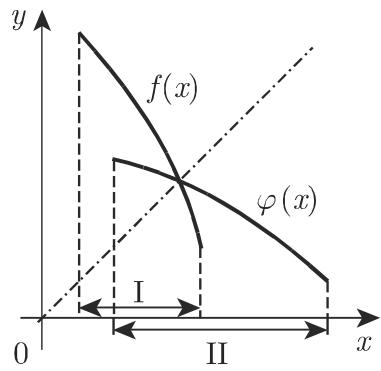

# 数学手册(原书第10版) 2.1.5 函数的连续性

《数学手册》(原书第10版) 2.1.5 节（据公开可查的出版背景，该书属 Bronshtein–Semendyayev 数学手册谱系的中译本，此身份说明独立于本节内容）是函数论主线 2.1.1（函数的定义）→ 2.1.2（实函数的定义方法）→ 2.1.3（某些类型的函数）→ 2.1.4（函数的极限）→ 2.1.5 的收束环节：在 [[concepts/函数的极限]] 之上定义 [[concepts/函数的连续性]]，系统分类 [[concepts/间断点]]，给出初等函数的连续性结论，并汇总闭区间上连续函数的性质定理。

## 章节结构

- **2.1.5.1 连续与间断的概念**：以图 2.9 的分段连续曲线（间断点 A–G，箭头表示端点不在曲线上）引入。
- **2.1.5.2 连续的定义**：三条件定义、ε-δ 刻画（式 2.30）、单侧连续、区间连续与处处连续、间断点与“终点”之辨、[[concepts/分段连续]]。
- **2.1.5.3 常见间断点的类型**：无穷间断、有限跳跃、[[concepts/可去间断点]] 三型及实例。
- **2.1.5.4 初等函数的连续性与间断性**：八条结论与一个判别算例。
- **2.1.5.5 连续函数的性质**：和差积商、复合（式 2.31）、波尔查诺定理（式 2.32）、介值定理（式 2.33）、反函数存在性、有界性定理（式 2.34）、魏尔斯特拉斯定理（式 2.35）。

## 核心定义（式 2.30，原文转写）

```
函数 y = f(x) 称为在点 x = a 连续，若
(1) f(x) 在 a 点有定义；
(2) lim_{x→a} f(x) 存在且 lim_{x→a} f(x) = f(a)，
即对任意 ε > 0，存在 δ(ε) > 0，使得当 |x − a| < δ 时，
对一切 x 有 |f(x) − f(a)| < ε。                          (2.30)
```

关键细节：邻域 $|x-a|<\delta$ **含 $a$ 点本身**，与 2.1.4 极限定义的去心邻域 $0<|x-a|<\eta$ 形成对照（见 [[comparisons/连续定义与极限定义比较]]）。仅在单侧有定义的点（$\sqrt{x}$ 于 $0$、$\arccos x$ 于 $1$）按本节约定不是间断点，而是“终点”。

## 间断点三分类（2.1.5.3）

| 类型 | 判据 | 实例（单侧极限均已数值复核无误） | 图 2.9 对应 |
|---|---|---|---|
| 无穷间断 | 单侧极限为 ±∞ | $\tan x$ 于 $\pi/2$（$+\infty/-\infty$）；$\frac{1}{(x-1)^2}$ 于 $1$（双侧 $+\infty$）；$\mathrm{e}^{1/(x-1)}$ 于 $1$（左 $0$、右 $\infty$） | E、B、C |
| 有限跳跃 | $f(a-0)$、$f(a+0)$ 存在但不等 | $\frac{1}{1+\mathrm{e}^{1/(x-1)}}$ 于 $1$（$1/0$）；$E(x)$ 于 $n$（$n-1/n$）；$\lim_{n\to\infty}\frac{1}{1+x^{2n}}$ 于 $1$（$1/0$，且 $f(1)=\frac12$） | A、F、G |
| 可去 | $f(a-0)=f(a+0)$ 但无定义或 $f(a)\neq\lim f$ | $\frac{\sqrt{1+x}-1}{x}$ 于 $0$（$\frac00$ 型，极限 $\frac12$，补定义后连续） | D |

## 初等函数连续性八条结论（2.1.5.4）

1. 多项式是处处连续函数。
2. 有理函数 $\frac{P(x)}{Q(x)}$ 除 $Q(x)=0$ 外连续；若 $Q(a)=0$、$P(a)\neq0$，则 $a$ 为[[concepts/极点]]；若 $P(a)=0$ 但 $a$ 是分母比分子更高重的根（参见 1.6.3.1，[[concepts/重根]]）亦为极点，否则为[[concepts/可去间断点]]。
3. 多项式的根式对定义域内每点连续；被开方式间断处，根式亦间断。
4. $\sin x,\cos x$ 处处连续；$\tan x,\sec x$ 在 $x=\frac{(2n+1)\pi}{2}$、$\cot x,\csc x$ 在 $x=n\pi$ 有无穷间断点。
5. $\arctan x,\operatorname{arccot} x$ 处处连续；$\arcsin x,\arccos x$ 在区间端点“中断”且端点单侧连续。
6. 指数函数 $\mathrm{e}^x$ 或 $a^x\ (a>0)$ 处处连续。
7. $\log x$ 对任意正数 $x$ 连续；因 $\lim_{x\to+0}\log x=-\infty$，在 $x=0$ 处“中断”。
8. 复合初等函数的连续性由复合过程中每个初等函数在该点的连续性逐层判断。

判别算例：$y=\dfrac{\mathrm{e}^{1/(x-2)}}{x\sin\sqrt[3]{1-x}}$ 的间断点为 $x=2$（点 C 型：左 $0$、右 $\infty$）及 $x=1-n^3\pi^3$（$n$ 为整数，即 $x=0,\ 1,\ 1\pm\pi^3,\ 1\pm8\pi^3,\ 1\pm27\pi^3,\dots$，点 E 型无穷间断）。

## 闭区间上连续函数的性质（式 2.31–2.35，原文转写）

```
lim_{x→a} f(u(x)) = f(lim_{x→a} u(x)) = f(u(a))          (2.31) 复合
f(c) = 0,  a < c < b     [f 在 [a,b] 连续, f(a)f(b) < 0]  (2.32) 波尔查诺
f(a)=A, f(b)=B, A≠B ⟹ 对介于 A,B 的每个 C，存在
c ∈ (a,b) 使 f(c) = C                                    (2.33a,b) 介值
m ⩽ f(x) ⩽ M,  a ⩽ x ⩽ b                                (2.34) 有界性
m = f(d) ⩽ f(x) ⩽ f(c) = M                               (2.35) 魏尔斯特拉斯
```

另含：连续函数的和差积商（$g\neq0$）连续；复合连续且“反之不成立”；反函数两条——区间上连续的单射必严格单调、区间上连续且严格单调的函数存在连续严格单调的反函数（定义域为值域 II，图 2.10）；最大值与最小值之差称为“变化量”。

## 与既有 wiki 的联系

- 延伸 [[findings/函数极限的精确定义及a点无需有定义]]：连续性恰好补上“$a$ 点有定义且极限等于函数值”，邻域由去心改为含心。
- 复用 [[concepts/左极限与右极限]] 的 $f(a\mp0)$ 记号（引自 2.1.4.5）与 [[findings/左右极限存在且相等方有极限]]。
- 复用 [[concepts/洛必达法则]]、[[concepts/未定式]] 作为可去间断点的判别工具。
- 延伸 [[concepts/反函数]] 与 [[findings/严格单调保证反函数存在且图像沿y等于x反射]]（2.1.3.8），补充连续性条件。
- 支撑 [[concepts/有界函数]]、[[concepts/极值]]、[[concepts/单调函数]]、[[concepts/分段函数]] 与 [[concepts/重根]]（极点判据）。
- 与 [[concepts/柯西收敛准则]] 同属实数完备性现象家族。

## 疑点与张力

1. **反函数注记（2.1.5.5.5 注）疑误（最重要）**：注称仅设区间上严格单调、内点 $c$ 连续且 $f(c)=C$，则反函数存在但“可能在点 $C$ 不连续”。按标准结果，区间上严格单调函数的反函数必在其值域上处处连续；$f$ 在区间上连续的真正作用是保证值域为区间。字面断言疑为翻译/转写改变了原文，见 [[queries/反函数注记在内点连续条件下能否不连续]]。
2. 例 C（$\mathrm{e}^{1/(x-1)}$）称“不同之处在于在 $x=1$ 处无定义”，但例 A（$\tan x$ 于 $\pi/2$）与例 B（$\frac{1}{(x-1)^2}$ 于 $1$）在各自间断点处同样无定义；真正的差别应是仅单侧趋于无穷，见 [[queries/例C差别说明无定义是否应为仅单侧无穷]]。
3. 算例称“当 $x=0$ 时 $\sin\sqrt[3]{1-x}=\sin 1$，故分母为 0”——$\sin 1\neq0$，为零的是因子 $x$，推理疑脱漏“$x\cdot\sin 1=0$”，见 [[queries/算例x等于0处分母为零的推理是否脱漏]]。
4. 术语口径：“中断”既用于 $\arcsin/\arccos$ 端点（单侧连续），又用于 $\log x$ 在 $0$（单侧极限 $-\infty$），与 2.1.5.2“终点不是间断点”的约定存在表述张力，见 [[queries/对数函数在x0处中断与终点口径是否一致]]。

## 证据强度

定义与定理均为标准结果，表述规范、配几何解释与可复核算例（本 wiki 的来源分析已对三分类实例与算例结论逐一经数值复核，均无误），证据强度**高**；上述第 1–3 条疑点使对应段落的证据强度降为**中**。

<!-- llm-wiki:embedded-images -->
## Embedded Images

### Document



<!-- llm-wiki:embedded-images -->
