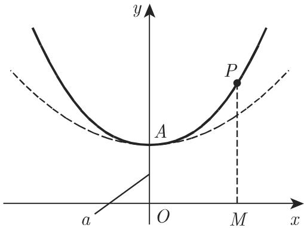
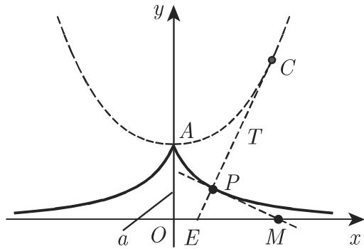

# 数学手册(原书第10版) 2.15 各种其他曲线

## 概述

本节是手册第 2 章特殊曲线序列（2.7–2.14 已陆续入库）中的条目，仅含两个小节：2.15.1 [[concepts/悬链线]] 与 2.15.2 [[concepts/曳物线]]。全节的结构核心是这两条曲线的[[concepts/渐屈线与渐伸线]]对偶：悬链线是曳物线的渐屈线，曳物线是顶点为 $A(0,a)$ 的悬链线的渐伸线。本节未点名任何人物或组织。

## 2.15.1 悬链线

机械定义：一质地均匀、柔韧但不能伸展的粗链悬挂两端得到的连续曲线称为悬链线（图 2.78）。方程为

```latex
y = a \cosh {\frac {x}{a}} = a \frac {\mathrm{e} ^ {\frac {x}{a}} + \mathrm{e} ^ {- \frac {x}{a}}}{2} (a > 0) \tag{2.252}
```

条目要点（详见 [[findings/悬链线的方程与几何量]]）：

- 顶点 $A(0,a)$ 由参数 $a$ 确定；曲线关于 $y$ 轴对称。
- 始终位于抛物线 $y = a + \frac{x^2}{2a}$（图 2.78 虚线）的上方。
- 弧长 $\widehat{AP}$：$L = a\sinh\frac{x}{a}$。
- 区域 $OAPM$ 的面积：$S = aL = a^2\sinh\frac{x}{a}$（面积 = $a\times$ 弧长，原文明示的结构性关系）。
- 曲率半径：$r = \frac{y^2}{a} = a\cosh^2\frac{x}{a} = a + \frac{L^2}{a}$（三种等价表示）。

段末给出对偶论断：悬链线是曳物线的渐屈线（参见第 341 页 3.6.1.6, 1.），因此曳物线是顶点为 $A(0,a)$ 的悬链线的渐伸线（参见第 341 页 3.6.1.6, 2.）。

## 2.15.2 曳物线

定义（双重表述）：若曲线为曳物线（图 2.79 中的粗线），则对于曲线上一点 P，过点 P 的切线与给定直线（此处为 x 轴）的交点为 M，有 $\overline{PM}$ 为常数 a；等价地，将一条长为 a 的不能伸展的绳子的一端系有质点 P，拽着绳子的另一端沿一直线（x 轴）移动，点 P 的轨迹为曳物线。方程为

```latex
\begin{array}{r l} & {x = a \mathrm{Arcosh} \frac {a}{y} \pm \sqrt {a ^ {2} - y ^ {2}}} \\ & {\qquad = a \ln \frac {a \pm \sqrt {a ^ {2} - y ^ {2}}}{y} \mp \sqrt {a ^ {2} - y ^ {2}} \quad (a > 0, 0 < y \leqslant a).} \end{array}\tag{2.253}
```

条目要点（详见 [[findings/曳物线的方程与几何量]]）：

- x 轴为渐近线；点 $A(0,a)$ 为尖点；曲线关于 y 轴对称。
- 弧长 $\widehat{AP}$：$L = a\ln\frac{a}{y}$。
- 极限性质：当弧长 L 增加时，$L - x \to a(1-\ln 2) \approx 0.307a$（x 为点 P 的横坐标）。
- 曲率半径 $r = a\cot\frac{x}{y}$（辐角疑误，见下），且曲率半径 $\overline{PC}$ 与线段 $\overline{PE} = b$ 成反比：$rb = a^2$。
- 渐屈线：曳物线的渐屈线（参见第 341 页 3.6.1.6, 2.），即曲率圆的中心 C 的轨迹曲线，是如图 2.79 中虚线所示的悬链线 (2.252)。

## 公式疑点

本节有两处公式疑点与一处引用小瑕疵，均已建 query 页跟踪：

1. **曲率半径辐角疑误**：辐角 $x/y$ 未在文中任何处定义，且结构上不可能是角度；以切线倾角参数（$y = a\sin t$）重建得 $r = a\cot t = a\frac{\sqrt{a^2-y^2}}{y}$，此时 $b = a\tan t$（E 推测为 P 处法线与 x 轴之交点），$rb = a^2$ 完全自洽。见 [[queries/式2-253曲率半径cot辐角x比y是否为误]]。
2. **第一行符号配对疑失配**：主支 $\mathrm{Arcosh}\frac{a}{y} = \ln\frac{a+\sqrt{a^2-y^2}}{y}$ 内部已含「+√」，第一行按字面「+√」会得到不在曲线上的点；疑漏 Arcosh 前的 ±，正确形式应为 $x = \pm\left(a\,\mathrm{Arcosh}\frac{a}{y} - \sqrt{a^2-y^2}\right)$。见 [[queries/式2-253第一行Arcosh形式的符号配对是否失配]]。
3. **交叉引用子目号不一致**：「渐屈线」在 2.15.1 引 3.6.1.6, 1.、在 2.15.2 却引 3.6.1.6, 2.。见 [[queries/渐屈线渐伸线对3-6-1-6子目号引用是否错位]]。

## 与既有 wiki 内容的联系

- [[concepts/悬链线]]：本源将其从 2.9 节（[[sources/10-数学手册原书第10版--7-29-双曲函数--145kavb]]）的「双曲余弦函数图像示例」扩充为完整几何对象（机械定义、全套几何量、密切抛物线注记、与曳物线的对偶）。
- [[concepts/双曲函数]]、[[concepts/双曲余弦函数]]、[[concepts/双曲正弦函数]]：式 (2.252) 的 cosh 与指数两种表示直接呼应 2.9 的定义。
- [[concepts/面积余弦函数]]（[[sources/10-数学手册原书第10版--8-210-面积函数--1cebibi]]）：式 (2.253) 的 Arcosh 记号与 2.10 一致，本节提供其应用实例。
- [[concepts/曲线奇点]]、[[concepts/曲线的奇点三型]]（2.11/2.12）：曳物线在 $A(0,a)$ 的尖点为「尖点」提供新实例。
- [[concepts/摆线族]]（[[sources/10-数学手册原书第10版--10-213-摆线--coam6g]]）：曳物线同为「运动生成」曲线（拖拽 vs 滚动），可在方法论层面呼应（[[methodology/悬链线与曳物线图像绘制法]] 与 [[methodology/摆线族图像绘制法]]），但分属不同族，勿混。
- 3.6.1.6（第 341 页，渐屈线与渐伸线的正式定义）：尚未入库；入库后本节两处交叉引用即可闭环。

## 图片



图 2.78：悬链线，虚线为抛物线 $y = a + \frac{x^2}{2a}$。



图 2.79：曳物线（粗线），虚线为其渐屈线——悬链线。

<!-- llm-wiki:embedded-images -->
## Embedded Images

### Document


<!-- llm-wiki:embedded-images -->
