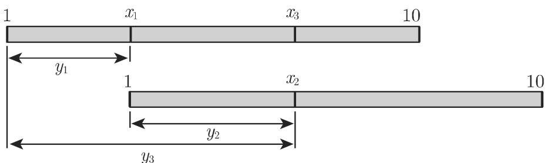
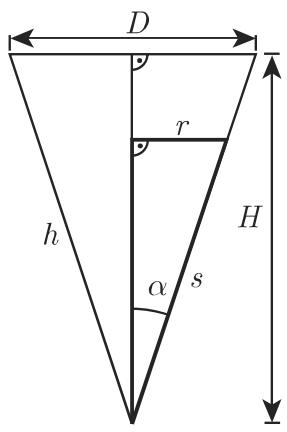
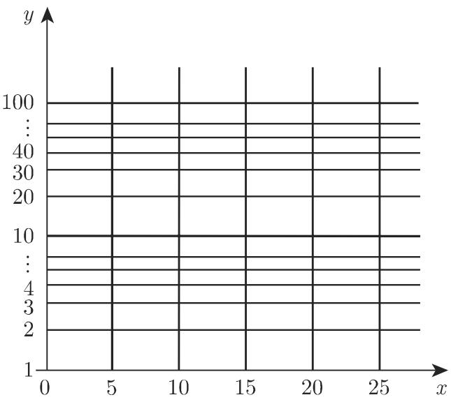
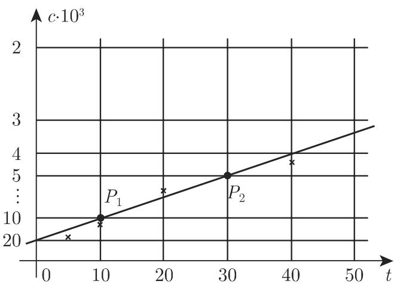

# 数学手册(原书第10版) 2.17 标度与坐标纸

《数学手册(原书第10版)》第 2.17 节「标度与坐标纸」分两个小节：2.17.1 以任意函数 $y = f(x)$ 为基建立**标度**的一般理论（式 2.268），并以三个示例展开——例 A 对数标度、例 B 滑尺、例 C 圆锥形漏斗侧面上的体积标度；2.17.2 以双轴标度方程（式 2.269）定义**坐标纸**，特化为半对数、双对数、倒数标度三类坐标纸，并逐一演示把指数函数、幂函数、二级反应浓度曲线「直线化」后图解参数（式 2.270–2.275）。本节把本维基对手册第 2 章的逐节覆盖从 [[sources/10-数学手册原书第10版--10-215-各种其他曲线--pzek1r]]（2.15 各种其他曲线）推进到 2.17 节。

## 2.17.1 标度

标度的基是一个函数 $y = f(x)$，目标是据此构造一个标度，使得在如直线等曲线上能够把函数值 $y$ 像自变量 $x$ 一样描出来；标度可看作**数表的一维表示形式**。标度方程为

$$
y = l [ f (x) - f (x _ {0}) ],\tag{2.268}
$$

标度的起点固定在点 $x_0$；对一个具体的标度，为了仅有一个给定的标度长度，要考虑标度因子 $l$。详见 [[concepts/标度]] 与 [[findings/标度方程与数表的一维表示]]。

### 例 A：对数标度

取 $f = \lg$、$l = 10\,\mathrm{cm}$、$x_0 = 1$，标度方程为 $y = 10[\lg x - \lg 1] = 10\lg x\ (\mathrm{cm})$，由下表得到图 2.95 所示标度：

| x | 1 | 2 | 3 | 4 | 5 | 6 | 7 | 8 | 9 | 10 |
|---|---|---|---|---|---|---|---|---|---|----|
| y = lg x | 0 | 0.30 | 0.48 | 0.60 | 0.70 | 0.78 | 0.85 | 0.90 | 0.95 | 1 |

注意表中行为无量纲的 $\lg x$ 值，实际刻距为其 10 倍（单位 cm）。图 2.95 在转写稿中呈现为带空行的表格，系图形转写痕迹（原图缺失）。详见 [[concepts/对数标度]]、[[findings/对数标度的构造与表值]]。

### 例 B：滑尺

手册指出：从历史看，滑尺是对数标度中最重要的应用；利用两个同样的、能沿彼此相互移动的标准对数标度，可以进行乘法和除法运算：

- $y_3 = y_1 + y_2$，即 $\lg x_3 = \lg x_1 + \lg x_2 = \lg x_1 x_2$，因此 $x_3 = x_1 \cdot x_2$；
- $y_1 = y_3 - y_2$，即 $\lg x_1 = \lg x_3 - \lg x_2 = \lg \dfrac{x_3}{x_2}$，因此 $x_1 = \dfrac{x_3}{x_2}$。

原文作「由表2.96可看出」，但本节并无表 2.96，滑尺对应的是插图图 2.96，疑为「图 2.96」之误，见 [[queries/表2-96是否应为图2-96]]。详见 [[entities/滑尺]]、[[findings/滑尺的对数运算原理]]。

### 例 C：一圆锥形漏斗侧面上的体积标度

为能读出漏斗（高 $H = 15\,\mathrm{cm}$、上面直径 $D = 10\,\mathrm{cm}$）内部的体积，在漏斗上刻标度。图 2.97(a) 给出的标度方程如下：体积 $V = \frac{1}{3} r^{2} \pi h$，边心距 $s = \sqrt{h^{2} + r^{2}}$，$\tan \alpha = \frac{r}{h} = \frac{D/2}{H} = \frac{1}{3}$；由此 $h = 3r$、$s = r\sqrt{10}$、$V = \frac{\pi}{(\sqrt{10})^{3}}$（该式疑漏写分子 $s^3$，见 [[queries/漏斗例V式是否漏写s立方]]；「边心距」一词疑应译作「母线」，见 [[queries/圆锥例边心距s是否应译作母线]]），故标度方程为

$$
s = \frac{\sqrt{10}}{\sqrt[3]{\pi}} \sqrt[3]{V} \approx 2.16 \sqrt[3]{V}.
$$

漏斗的标准刻度表：

| V | 0 | 50 | 100 | 150 | 200 | 250 | 300 | 350 |
|---|---|----|-----|-----|-----|-----|-----|-----|
| s | 0 | 7.96 | 10.03 | 11.48 | 12.63 | 13.61 | 14.46 | 15.22 |

详见 [[findings/圆锥漏斗的体积标度方程]]。

## 2.17.2 坐标纸

最常用的坐标纸是通过把直角坐标系的坐标轴用标度方程

$$
x = l _ {1} [ g (u) - g (u _ {0}) ], \quad y = l _ {2} [ f (v) - f (v _ {0}) ]\tag{2.269}
$$

标准化后得到的。其中 $l_{1}, l_{2}$ 为标度因子，$u_{0}, v_{0}$ 为标度的初始点。详见 [[concepts/坐标纸]]、[[findings/坐标纸的一般标度方程]]。

### 2.17.2.1 半对数坐标纸

对 $x$ 轴等距划分、对 $y$ 轴对数划分（式 2.270）。指数函数 $y = \alpha \mathrm{e}^{\beta x}$（式 2.271a）在其上为一直线（参见第 143 页 2.16.2.2 中的修正，该节尚未入库）；若测点大约位于一条直线上，可假设变量关系满足 (2.271a)，借助直线上两点 $P_{1}(x_{1}, y_{1})$、$P_{2}(x_{2}, y_{2})$ 得

$$
\beta = \frac {\ln y _ {2} - \ln y _ {1}}{x _ {2} - x _ {1}}, \quad \alpha = y _ {1} \mathrm{e} ^ {\beta x _ {1}}.\tag{2.271b}
$$

详见 [[concepts/半对数坐标纸]]、[[findings/半对数坐标纸直线化指数函数]]。

### 2.17.2.2 双对数坐标纸

$x$ 轴与 $y$ 轴均经对数函数标准化（式 2.272），称双对数坐标纸、重对数坐标纸或双对数坐标系。幂函数 $y = \alpha x^{\beta}$（式 2.273）在此坐标系中为一直线（参见第 91 页 2.5.3 及第 142 页 2.16.2.1 中幂函数的修正，均尚未入库），使用方法与半对数坐标纸中的类似。详见 [[concepts/双对数坐标纸]]、[[findings/双对数坐标纸直线化幂函数]]。

### 2.17.2.3 倒数标度的坐标纸

坐标轴的标度划分来自反比函数（式 2.45，参见第 85 页 2.4.1，尚未入库）。标度方程为式 2.274。化学反应浓度示例（假设二级反应 $c(t) = c_{0}/(1 + c_{0} k t)$，式 2.275）：

| t/min | 5 | 10 | 20 | 40 |
|---|---|---|---|---|
| c·10³/(mol/L) | 15.53 | 11.26 | 7.27 | 4.25 |

两边取倒数得 $\frac{1}{c} = \frac{1}{c_0} + kt$，故在 $y$ 轴倒数划分、$x$ 轴线性划分的坐标纸上（例中 $y$ 轴标度方程取 $y = 10 \cdot \frac{1}{v}\ \mathrm{cm}$），方程 (2.275) 表示一条直线。由图 2.99，测点大约位于一条直线上，即可认为假设的关系 (2.275) 成立。选取两点 $P_{1}(10,10)$、$P_{2}(30,5)$，手册给出 $k \approx 0.005$、$c_{0} \approx 20 \cdot 10^{-3}$；但所载公式 $k = \frac{1/c_1 - 1/c_2}{t_2 - t_1}$ 代入该两点得 $-0.005$，与答案符号矛盾，分子顺序疑颠倒，见 [[queries/式2-275例k公式分子顺序是否颠倒]]。详见 [[concepts/倒数坐标纸]]、[[findings/倒数坐标纸直线化二级反应]]。

### 2.17.2.4 注（时代性论断）

手册指出还有绘制和使用坐标纸的其他方法；尽管当今仅凭实验室中得到的几个数据、高速计算机便能分析出经验数据和测量结果，坐标纸仍是用以说明函数关系和近似参数值最常用的方法，而这些近似参数值正是采用数值方法所必须的初始值（参见第 1282 页 19.6.2.4 中的非线性最小二乘法）。此为第 10 版成书年代的论断，宜作历史性注记而非当前实践的事实沿用。

## 跨章节引用（多为悬空引用）

- 2.4.1 反比函数（式 2.45，第 85 页）——倒数标度的基函数；
- 2.5.3 幂函数（第 91 页）——双对数纸直线化的对象；
- 2.16.2.1 幂函数的经验修正（第 142 页）与 2.16.2.2 指数函数的经验修正（第 143 页）——注意 2.16 节在本维基缺位（已处理 2.15 后直接处理 2.17）；
- 19.6.2.4 非线性最小二乘法（第 1282 页）——图解初值的下游方法。

## 本节入库页面

- 概念：[[concepts/标度]]、[[concepts/对数标度]]、[[concepts/坐标纸]]、[[concepts/半对数坐标纸]]、[[concepts/双对数坐标纸]]、[[concepts/倒数坐标纸]]
- 实体：[[entities/滑尺]]
- 方法论：[[methodology/坐标纸线性化参数估计法]]
- 发现：[[findings/标度方程与数表的一维表示]]、[[findings/对数标度的构造与表值]]、[[findings/滑尺的对数运算原理]]、[[findings/圆锥漏斗的体积标度方程]]、[[findings/坐标纸的一般标度方程]]、[[findings/半对数坐标纸直线化指数函数]]、[[findings/双对数坐标纸直线化幂函数]]、[[findings/倒数坐标纸直线化二级反应]]
- 比较：[[comparisons/三类坐标纸比较]]
- 疑点：[[queries/式2-275例k公式分子顺序是否颠倒]]、[[queries/漏斗例V式是否漏写s立方]]、[[queries/表2-96是否应为图2-96]]、[[queries/圆锥例边心距s是否应译作母线]]

<!-- llm-wiki:embedded-images -->
## Embedded Images

### Document

<!-- llm-wiki:embedded-images -->
