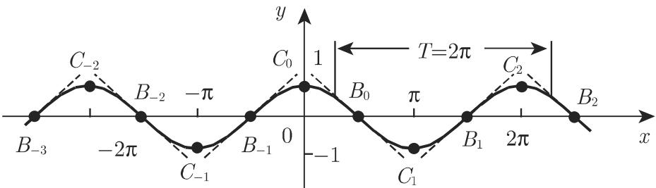
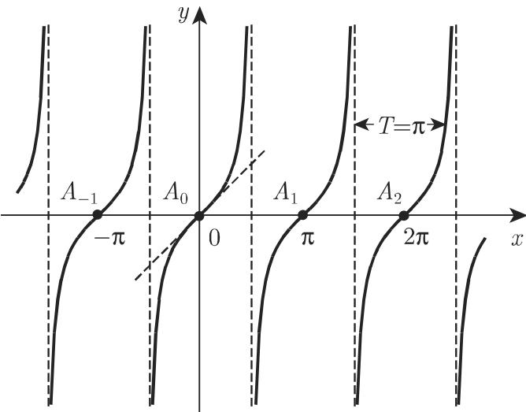
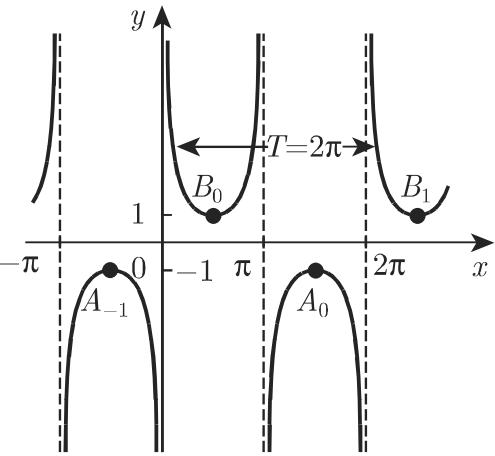
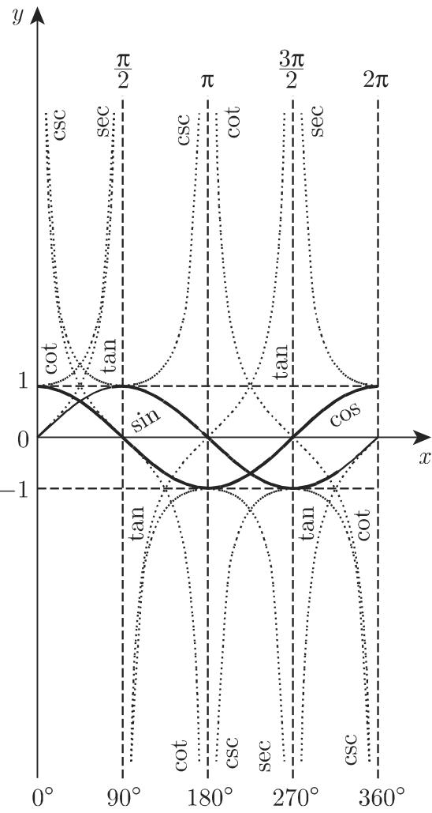
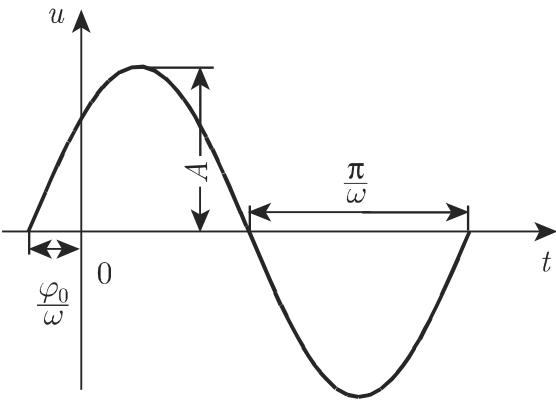
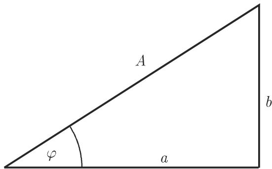

# 数学手册(原书第10版) 2.7 三角函数(角函数)

《数学手册(原书第10版)》第 2.7 节（母书条目：[[entities/数学手册原书第10版]]）。三角函数「从几何角度引入」，自变量采用角度或弧度制（交叉引用 3.1.1.5 弧度制，第 170 页）。全节分三部分：2.7.1 基本概念（六函数定义与曲线要素、值域与符号、任意角化简）；2.7.2 三角函数的重要公式（同角关系、加法定理、倍角、半角、和差化积/积化和差、幂）；2.7.3 振动的描述（谐振荡、叠加、向量图、阻尼振荡）。

## 章节结构

- **2.7.1 基本概念**：定义及表示（式 2.63–2.71）；函数的值域与性质（表 2.1–2.3）；任意角（式 2.72–2.81、表 2.4）；弧度角
- **2.7.2 重要公式**：同角关系（式 2.82–2.89、表 2.5）；加法定理（式 2.90–2.95）；倍角（式 2.96–2.109）；半角（式 2.111–2.114）；两三角函数的和与差（式 2.115–2.122）；三角函数的积（式 2.123–2.129）；幂（式 2.130–2.135）
- **2.7.3 振动的描述**：问题表述（式 2.136–2.137）；振动的叠加（式 2.138a–c）；振动的向量图（图 2.41）；振荡的阻尼（式 2.139、图 2.42）

## 六个三角函数的定义与曲线要素（式 2.63–2.71）

详细论证分见各 finding 页；此处为总览，**各条性质仅归属于所述函数**：

- **标准正弦** $y=\sin x$（式 2.63）：周期 $T=2\pi$；拐点 $B_k=(k\pi,0)$，切线关于 x 轴倾角 $\pm\pi/4$；极值点 $C_k=((k+\tfrac12)\pi,(-1)^k)$；$-1\le y\le 1$。见 [[findings/标准正弦与一般正弦的曲线要素及三步变换]]、[[concepts/正弦函数]]。
- **一般正弦** $y=A\sin(\omega x+\varphi_0)$（式 2.64）：振幅 $|A|$、周期 $T=2\pi/\omega$；由标准正弦沿 y 轴方向拉伸 $|A|$ 倍、沿 x 轴方向压缩 $1/\omega$ 倍、再向左平移 $\varphi_0/\omega$ 得到；交点 $B_k=((k\pi-\varphi_0)/\omega,0)$，极值点 $C_k=(((k+\tfrac12)\pi-\varphi_0)/\omega,\,(-1)^k A)$。
- **余弦** $y=\cos x=\sin(x+\pi/2)$（式 2.65）：拐点 $B_k=((k+\tfrac12)\pi,0)$（倾角 $\pm\pi/4$），极值点 $C_k=(k\pi,(-1)^k)$；一般余弦（式 2.66）化为 $y=A\sin(\omega x+\varphi_0+\pi/2)$（式 2.67）。见 [[findings/余弦为正弦的相位平移及其特征点体系]]、[[concepts/余弦函数]]。
- **正切** $y=\tan x$（式 2.68）：$T=\pi$；渐近线 $x=(k+\tfrac12)\pi$；各区间 $(-\tfrac{\pi}{2}+k\pi,\ \tfrac{\pi}{2}+k\pi)$ 单调增、值域 $\mathbb{R}$；拐点 $A_k=(k\pi,0)$，切线倾角 $\pi/4$。见 [[findings/正切与余切的周期渐近线单调性与拐点]]、[[concepts/正切函数]]。
- **余切** $y=\cot x=-\tan(x+\pi/2)$（式 2.69）：由正切曲线沿 x 轴反射并左移 $\pi/2$ 得到；渐近线 $x=k\pi$；$(0,\pi)$ 单调减；拐点 $A_k=((k+\tfrac12)\pi,0)$，倾角 $-\pi/4$。见 [[concepts/余切函数]]。
- **正割** $y=\sec x=1/\cos x$（式 2.70）：$T=2\pi$；渐近线 $x=(k+\tfrac12)\pi$；$|y|\ge 1$；**极大值点 $A_k=((2k+1)\pi,-1)$、极小值点 $B_k=(2k\pi,+1)$——极值反转**。见 [[findings/正割与余割的值域约束与极值反转]]、[[concepts/正割函数]]。
- **余割** $y=\csc x=1/\sin x$（式 2.71）：由正割右移 $\pi/2$ 得到；渐近线 $x=k\pi$；极大值点 $A_k=((4k+3)\pi/2,-1)$、极小值点 $B_k=((4k+1)\pi/2,+1)$。见 [[concepts/余割函数]]。

六函数横向对照见 [[comparisons/六个三角函数性质比较]]；$0^\circ$–$360^\circ$ 四象限全景见原文图 2.38。

## 定义域、值域与符号（表 2.1–2.3）

表 2.1 三角函数的定义域和值域（按转写件重构；原 HTML rowspan 结构错乱，未见 sec/csc 行，见 [[queries/表2-1是否缺sec与csc行]]）：

| 函数 | 定义域 | 值域 |
|---|---|---|
| sin x | $-\infty<x<\infty$ | $-1\le\sin x\le 1$ |
| cos x | $-\infty<x<\infty$ | $-1\le\cos x\le 1$ |
| tan x | $x\ne(2k+1)\frac{\pi}{2}$ | $-\infty<\tan x<\infty$ |
| cot x | $x\ne k\pi\ (k=0,\pm1,\pm2,\dots)$ | $-\infty<\cot x<\infty$ |

表 2.2 三角函数的符号（原样）：

| 象限 | 角 | sin | cos | tan | cot | sec | csc |
|---|---|---|---|---|---|---|---|
| I | $0^\circ<\alpha<90^\circ$ | + | + | + | + | + | + |
| II | $90^\circ<\alpha<180^\circ$ | + | − | − | − | − | + |
| III | $180^\circ<\alpha<270^\circ$ | − | − | + | + | − | − |
| IV | $270^\circ<\alpha<360^\circ$ | − | + | − | − | + | − |

表 2.3 特殊角三角函数值（原样；手册注「当今常用计算机计算」）：

| 角度 | 弧度 | sin | cos | tan | cot | sec | csc |
|---|---|---|---|---|---|---|---|
| $0^\circ$ | 0 | 0 | 1 | 0 | $\mp\infty$ | 1 | $\mp\infty$ |
| $30^\circ$ | $\frac{\pi}{6}$ | $\frac12$ | $\frac{\sqrt3}{2}$ | $\frac{\sqrt3}{3}$ | $\sqrt3$ | $\frac{2\sqrt3}{3}$ | 2 |
| $45^\circ$ | $\frac{\pi}{4}$ | $\frac{\sqrt2}{2}$ | $\frac{\sqrt2}{2}$ | 1 | 1 | $\sqrt2$ | $\sqrt2$ |
| $60^\circ$ | $\frac{\pi}{3}$ | $\frac{\sqrt3}{2}$ | $\frac12$ | $\sqrt3$ | $\frac{\sqrt3}{3}$ | 2 | $\frac{2\sqrt3}{3}$ |
| $90^\circ$ | $\frac{\pi}{2}$ | 1 | 0 | $\pm\infty$ | 0 | $\pm\infty$ | 1 |

详页：[[findings/三角函数定义域值域符号与特殊角值]]。

## 任意角的化简（式 2.72–2.81、表 2.4）

大于周期的角（n 为整数）归约：

$$\sin(360^\circ\!\cdot n+\alpha)=\sin\alpha\ (2.72)\qquad \cos(360^\circ\!\cdot n+\alpha)=\cos\alpha\ (2.73)$$
$$\tan(180^\circ\!\cdot n+\alpha)=\tan\alpha\ (2.74)\qquad \cot(180^\circ\!\cdot n+\alpha)=\cot\alpha\ (2.75)$$

负角（奇偶性）：

$$\sin(-\alpha)=-\sin\alpha\ (2.76)\qquad \cos(-\alpha)=\cos\alpha\ (2.77)$$
$$\tan(-\alpha)=-\tan\alpha\ (2.78)\qquad \cot(-\alpha)=-\cot\alpha\ (2.79)$$

表 2.4 三角函数的简化公式与象限关系（原样；相差 $90^\circ$、$180^\circ$、$270^\circ$ 的角之间的函数值关系称为象限关系）：

| 函数 | $x=90^\circ\pm\alpha$ | $x=180^\circ\pm\alpha$ | $x=270^\circ\pm\alpha$ | $x=360^\circ-\alpha$ |
|---|---|---|---|---|
| sin x | $+\cos\alpha$ | $\mp\sin\alpha$ | $-\cos\alpha$ | $-\sin\alpha$ |
| cos x | $\mp\sin\alpha$ | $-\cos\alpha$ | $\pm\sin\alpha$ | $+\cos\alpha$ |
| tan x | $\mp\cot\alpha$ | $\pm\tan\alpha$ | $\mp\cot\alpha$ | $-\tan\alpha$ |
| cot x | $\mp\tan\alpha$ | $\pm\cot\alpha$ | $\mp\tan\alpha$ | $-\cot\alpha$ |

命名关系：$\alpha+x=90^\circ$ 时为**余角公式**（2.80a–b：$\cos\alpha=\sin(90^\circ-\alpha)$、$\sin\alpha=\cos(90^\circ-\alpha)$，交叉引用 3.1.1.2）；$\alpha+x=180^\circ$ 时为**补角公式**（2.81a–b：$\sin\alpha=\sin(180^\circ-\alpha)$、$-\cos\alpha=\cos(180^\circ-\alpha)$）。

算例（原样）：$\sin(-1000^\circ)=-\sin 1000^\circ=-\sin(360^\circ\cdot 2+280^\circ)=-\sin 280^\circ=+\cos 10^\circ=+0.9848$。

观察：该化简体系与表 2.4 仅覆盖 sin/cos/tan/cot，未列 sec/csc。详页：[[findings/任意角化简规则体系与算例]]、[[concepts/诱导公式]]。

## 同角关系与恒等式体系（式 2.82–2.135）

八条同角关系（式 2.82–2.89）：

$$\sin^2\alpha+\cos^2\alpha=1\ (2.82)\qquad \sec^2\alpha-\tan^2\alpha=1\ (2.83)\qquad \csc^2\alpha-\cot^2\alpha=1\ (2.84)$$
$$\sin\alpha\cdot\csc\alpha=1\ (2.85)\qquad \cos\alpha\cdot\sec\alpha=1\ (2.86)\qquad \tan\alpha\cdot\cot\alpha=1\ (2.87)$$
$$\frac{\sin\alpha}{\cos\alpha}=\tan\alpha\ (2.88)\qquad \frac{\cos\alpha}{\sin\alpha}=\cot\alpha\ (2.89)$$

表 2.5 当 $0<\alpha<\frac{\pi}{2}$ 时同角三角函数间的关系（原样；其他区间平方根符号依象限决定）：

| 所求＼已知 | sin α | cos α | tan α | cot α |
|---|---|---|---|---|
| sin α | — | $\sqrt{1-\cos^2\alpha}$ | $\frac{\tan\alpha}{\sqrt{1+\tan^2\alpha}}$ | $\frac{1}{\sqrt{1+\cot^2\alpha}}$ |
| cos α | $\sqrt{1-\sin^2\alpha}$ | — | $\frac{1}{\sqrt{1+\tan^2\alpha}}$ | $\frac{\cot\alpha}{\sqrt{1+\cot^2\alpha}}$ |
| tan α | $\frac{\sin\alpha}{\sqrt{1-\sin^2\alpha}}$ | $\frac{\sqrt{1-\cos^2\alpha}}{\cos\alpha}$ | — | $\frac{1}{\cot\alpha}$ |
| cot α | $\frac{\sqrt{1-\sin^2\alpha}}{\sin\alpha}$ | $\frac{\cos\alpha}{\sqrt{1-\cos^2\alpha}}$ | $\frac{1}{\tan\alpha}$ | — |

其余恒等式分组（详见对应 finding 与概念页）：

- 加法定理（式 2.90–2.95，含三角和展开）→ [[findings/加法定理两角和差与三角和展开]]、[[concepts/加法定理]]
- 倍角 2–4 倍公式与棣莫弗–二项式通式（式 2.96–2.109；式 2.110 为空编号，见疑点）→ [[findings/倍角公式与棣莫弗二项式通式]]、[[concepts/倍角公式]]
- 半角公式（式 2.111–2.114，平方根依半角象限定号）→ [[findings/半角公式及依象限定号规则]]、[[concepts/半角公式]]
- 和差化积与积化和差（式 2.115–2.129，含三函数乘积四式）→ [[findings/和差化积与积化和差公式组]]、[[concepts/和差化积与积化和差]]
- 幂的降幂公式（式 2.130–2.135）→ [[findings/三角函数幂的降幂公式]]、[[concepts/三角函数的幂]]

同角八式详页：[[findings/同角三角函数八条基本关系]]、[[concepts/同角三角函数的基本关系]]。

## 振动的描述（式 2.136–2.139）

- 正弦量两种表示与同频叠加（式 2.136–2.138，$A=\sqrt{a^2+b^2}$、$\tan\varphi=b/a$）→ [[findings/谐振荡两种表示与同频叠加]]、[[concepts/谐振荡]]
- 向量图的旋转时间轴投影机制（图 2.41）→ [[findings/向量图的旋转时间轴投影机制]]、[[concepts/向量图]]
- 阻尼振荡特征点体系与对数衰减率 $\delta=a\pi/\omega$（式 2.139、图 2.42）→ [[findings/阻尼振荡特征点体系与对数衰减率]]、[[concepts/阻尼振荡]]
- 两种振荡对照 → [[comparisons/谐振荡与阻尼振荡比较]]

## 转写疑点

1. 表 2.1 的 HTML rowspan 结构错乱，重构后未见 sec/csc 行 → [[queries/表2-1是否缺sec与csc行]]
2. 式 (2.110) 为空编号；同节式 2.118（$\cos\alpha-\cos\beta$）缺编号 tag → [[queries/式2-110空编号是否为转写残留]]
3. ω 的术语口径：2.7.1.1 称「频率为 ω」，2.7.3.1 称「ω 是振动的频率，在波动理论中称为角频率或径向频率」；通行约定中频率 $f=\omega/(2\pi)$ → [[queries/omega是频率还是角频率]]
4. 向量图投影口径：「投影 ON 等于 u 的绝对值」与「t=0 时投影 $u_0=A\sin\varphi$（可负）」并存 → [[queries/向量图投影绝对值与带符号u0是否矛盾]]
5. 表述精度：「沿 x 轴方向压缩 $1/\omega$ 倍」隐含 $\omega>1$（$\omega<1$ 时实为拉伸）；式 2.67 处「向左平移 $\varphi=\pi/2$ 个单位」将相位平移表述为 x 轴平移（对一般 $\omega$，x 方向位移应为 $\pi/(2\omega)$）。

## 与其他章节及本 wiki 的关联

- 手册内交叉引用：3.1.1.5 弧度制（第 170 页）、3.1.1.2 余角/补角（第 168 页）、1.5.3.5 棣莫弗公式（第 48 页）、1.1.6.4 二项式定理（第 14 页）、3.5.2.1 极坐标（第 255 页）。前述章节均未入库。
- 三角函数是 [[concepts/周期函数]] 的典型实例；sin/cos/tan/cot 拐点处的 $\pm\pi/4$ 切线倾角是 [[concepts/拐点]] 的直接应用；tan/cot/sec/csc 的垂直渐近线联系 [[concepts/渐近线]]；sec/csc 的极值反转是 [[concepts/极值]] 的反直觉案例。
- 阻尼振荡的包络 $\pm A\mathrm{e}^{-at}$ 把 2.6 节的 [[concepts/指数函数]] 与本节复合（见 [[sources/10-数学手册原书第10版--12-26-指数函数和对数函数--1wum3pd]]）。
- 图像绘制方法论系列：[[methodology/三角函数类图像绘制法]]（与 [[methodology/多项式图像绘制法]]、[[methodology/指数对数类函数图像绘制法]]、[[methodology/有理函数图像绘制法]] 同系列）。

<!-- llm-wiki:embedded-images -->
## Embedded Images

### Document

<!-- llm-wiki:embedded-images -->
