# 数学手册(原书第10版) 3.5.2 平面解析几何

本节是《数学手册(原书第10版)》中平面解析几何的完整公式体系，公式编号 (3.286)–(3.354) 连续承接 3.5.1（前节编号应止于约 3.285，该节入库状态待确认）。全节按层级自下而上构建：坐标系 → 坐标变换 → 特殊点 → 面积 → 曲线方程观念 → 直线 → 圆 → 椭圆 → 双曲线 → 抛物线 → 二次曲线总论（不变量分类）。

## 小节结构与对应页面

| 小节 | 主题 | 对应页面 |
|---|---|---|
| 3.5.2.1 | 基本概念、平面坐标系 | [[concepts/笛卡儿坐标]]、[[concepts/极坐标]]、[[concepts/曲线坐标系]] |
| 3.5.2.2 | 坐标变换（平移/旋转/极坐标互化） | [[concepts/坐标变换]]、[[findings/坐标变换公式组]] |
| 3.5.2.3 | 特殊点：距离、质心、分割 | [[concepts/定比分割]]、[[concepts/调和分割]]、[[concepts/黄金分割]] |
| 3.5.2.4 | 面积 | [[findings/多边形与三角形面积公式]] |
| 3.5.2.5 | 曲线方程（轨迹、代数/超越/虚曲线） | （见下方摘录） |
| 3.5.2.6 | 直线 | [[concepts/黑塞法式]]、[[concepts/直线束]] |
| 3.5.2.7 | 圆（节题在转写中脱落） | [[findings/圆的解析方程组]] |
| 3.5.2.8 | 椭圆 | [[concepts/椭圆]] |
| 3.5.2.9 | 双曲线 | [[concepts/双曲线]]、[[concepts/渐近线]] |
| 3.5.2.10 | 抛物线 | [[concepts/抛物线]] |
| 3.5.2.11 | 二次曲线（圆锥曲线）总论 | [[concepts/圆锥曲线]]、[[concepts/二次曲线不变量]]、[[methodology/二次曲线一般方程化简流程]] |

## 核心公式组（结构性摘录）

### 坐标变换（3.286–3.290）

```
平移:  x = x′ + a,  y = y′ + b                    (3.286a)
       x′ = x − a,  y′ = y − b                    (3.286b)
旋转:  x′ = x cos φ + y sin φ
       y′ = −x sin φ + y cos φ                    (3.287a)
       x = x′ cos φ − y′ sin φ
       y = x′ sin φ + y′ cos φ                    (3.287b)
D = [cos φ  sin φ; −sin φ  cos φ],  (x′,y′)ᵀ = D(x,y)ᵀ   (3.287c)
对象旋转（几何变换）: (x′_P, y′_P)ᵀ = R(x_P, y_P)ᵀ,  R = D⁻¹   (3.288–3.289)
笛卡儿→极: x = ρ cos φ, y = ρ sin φ (−π < φ ≤ π, ρ ≥ 0)   (3.290a)
       ρ = √(x² + y²)                             (3.290b)
       φ = arctan(y/x)+π (x<0); arctan(y/x) (x>0); ±π/2 (x=0); 未定义 (x=y=0)  (3.290c)
```

关键区分：**坐标变换**改变坐标系而对象位置不动；**几何变换**改变对象而坐标系不动，二者通过 R = D⁻¹ 相联系（详细展开前向引用原书 3.5.4.1，第 308 页）。

### 椭圆周长（3.329）

```
L = 4a E(e) = 4a ∫₀^{π/2} √(1−e²sin²ψ) dψ,  e = √(a²−b²)/a        (3.329a)
L = 2πa[1 − (1/2)²e² − ((1·3)/(2·4))² e⁴/3 − ((1·3·5)/(2·4·6))² e⁶/5 − …]  (3.329b)
L = π(a+b)(1 + λ²/4 + λ⁴/64 + λ⁶/256 + 25λ⁸/16384 + …),  λ = (a−b)/(a+b)  (3.329c)
L ≈ π[1.5(a+b) − √(ab)]                                              (3.329d)
L ≈ π(a+b)(64 − 3λ⁴)/(64 − 16λ²)                                     (3.329e)
```

### 二次曲线不变量与分类（3.353 + 表 3.19/3.20）

```
一般方程:  ax² + 2bxy + cy² + 2dx + 2ey + f = 0        (3.353a)
不变量:    Δ = |a b d; b c e; d e f|,  δ = |a b; b c|,  S = a + c   (3.353b)
```

表 3.19（有心曲线，δ≠0）：

| 条件 | 曲线形状 |
|---|---|
| δ>0，Δ≠0，Δ·S<0 | 实椭圆 |
| δ>0，Δ≠0，Δ·S>0 | 虚椭圆 |
| δ>0，Δ=0 | 一对具有实公共点的虚直线 |
| δ<0，Δ≠0 | 双曲线 |
| δ<0，Δ=0 | 一对相交直线 |

化简：① 平移原点至中心 x₀=(be−cd)/δ、y₀=(bd−ae)/δ；② 旋转 α 角，tan 2α = 2b/(a−c)（转写中分数线脱落），sin 2α 符号须与 2b 一致；新 x′ 轴斜率 k = [c−a+√((c−a)²+4b²)]/(2b)；标准形 a′x′² + c′y′² + Δ/δ = 0，a′、c′ 为 u²−Su+δ=0 之根。

表 3.20（抛物型，δ=0）：

| 条件 | 曲线形状 |
|---|---|
| δ=0，Δ≠0 | 抛物线 |
| δ=0，Δ=0，d²−af>0 | 一对平行实直线 |
| δ=0，Δ=0，d²−af=0 | 二重直线 |
| δ=0，Δ=0，d²−af<0 | 一对虚直线 |

化简（Δ≠0）：① 平移至顶点（x₀、y₀ 由 a x₀+b y₀+(ad+be)/S=0 与 (d+(dc−be)/S)x₀+(e+(ae−bd)/S)y₀+f=0 给出）；② 旋转 α 角，tan α = −a/b（sin α 符号与 a 相异）；标准形 y′² = 2px′，p = (ae−bd)/(S√(a²+b²))。Δ=0 时仅旋转：Sy′² + 2(ad+be)/√(a²+b²)·y′ + f = 0 → (y′−y₀′)(y′−y₁′)=0。脚注：δ=0 情形假设 a、b、c 均不为 0（转写讹作「0=0」）。

### 统一极坐标方程（3.354）

```
ρ = p/(1 + e cos φ)   （极点在焦点，极轴指向较近顶点；双曲线只定义一支）
```

## 已验证算例（分析阶段独立复算，视为已复算）

- P₂ 为 P₁P 中点时 λ = −2（坐标复算成立）
- 调和分割 xᵢxₐ = b² 与调和平均 r = 2pq/(p+q) = 2b（代数推导成立）
- 黄金分割 x = a(√5−1)/2 ≈ 0.618a，且为外接圆半径 a 的正十边形边长（= 2a sin 18°）
- 三角形面积 (3.300) 三种形式互相等价
- 圆的虚曲线/点退化条件（q 与 m²+n² 比较）
- 椭圆曲率半径三种形式等价、弓形面积 (3.328c) 积分验证
- 椭圆周长算例 a=1.5, b=1：(3.329e) → 7.9327，数值积分 → 7.932721，查表 21.9 → 7.94
- 双曲线焦半径符号体系自洽
- 抛物线 (3.344)(3.346)(3.348)(3.349)(3.350)(3.351b)(3.352a,c) 均复算/积分验证
- 表 3.19/3.20 以 x²+y²−1=0、x²+y²+1=0、x²−y²−1=0、xy=1、y²−x=0 等试例复核分类正确

## 转写疑点（详见各 query 页）

- [[queries/式3-299多边形面积公式损毁是否可据原书复原]]：多边形面积公式被 OCR 打碎
- [[queries/式3-341a双曲线弓形面积公式本体脱落是否可复原]]：整段缺失，仅存编号
- [[queries/式3-290c第三象限极角分支是否应为arctan减pi]]：区间约定矛盾
- [[queries/式3-352b首项负号是否为转写错误]]：与 (3.352a) 不等价
- [[queries/双曲线小节疑似讹误清单]]：d=a/c、a₂→a²、「椭圆」→「双曲线」等
- [[queries/3-5-2节符号成片脱落与λ转写为入是否为转写丢字]]：λ→「入」、节题「圆」、e=1、页码-节号粘连等系统性问题

## 与既有维基内容的联系

- [[concepts/圆]]（3.1.6 综合几何）：本节 3.5.2.7 提供圆的解析方程、参数式、极坐标式与切线，是综合几何圆页的直接扩展（弦定理/割线定理 ↔ 解析方程两套语言）
- [[findings/两直角坐标系相似变换]]、[[findings/坐标互化与比例因子校正]]（3.2 节式 3.106–3.109）：本节 (3.286)–(3.290) 是同一主题的深化——3.2 节含比例因子的相似变换 vs 本节纯刚体的平移+旋转及极坐标互化，互相印证
- [[findings/航向角与方位角区间约定]]：(3.290a) 的 −π<φ≤π 区间约定同属「角量区间约定」主题
- [[concepts/正凸多边形]]（3.1.5）：黄金分割即外接圆半径 a 的正十边形边长（原文交叉引用 3.1.5.3），建立 3.5 ↔ 3.1 的反向链接
- 前向引用（待对应章节入库后回填）：1.67b 调和平均（第 25 页）、2.3.4（第 83 页）、3.5.4.1 几何变换（第 308 页）、3.6.1.4 渐近线定义（第 338 页）、8.1.4.3 与 8.2.2.2 椭圆积分（第 654、668 页）、表 21.9（第 1424 页）

<!-- llm-wiki:embedded-images -->
## Embedded Images

### Document

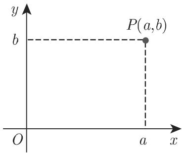


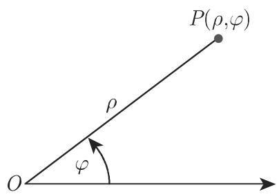
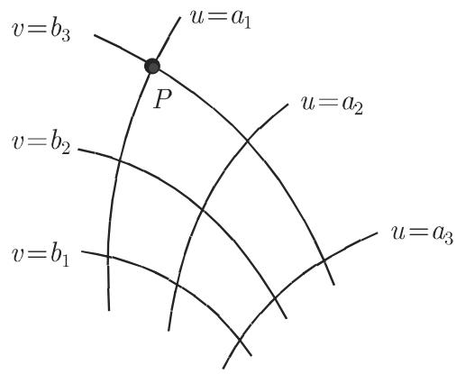


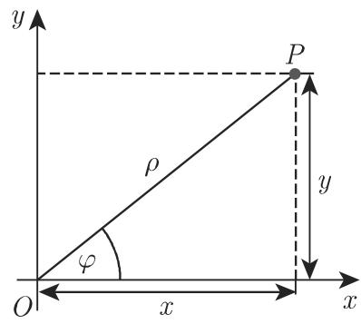
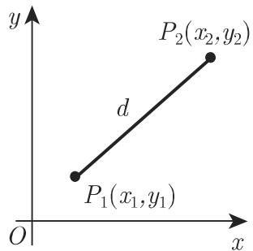
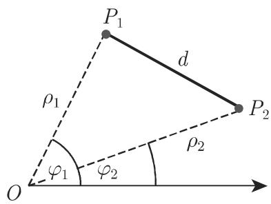


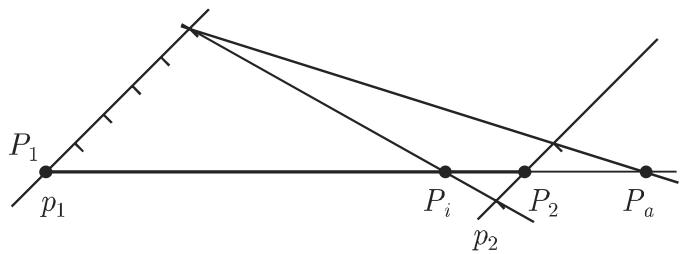
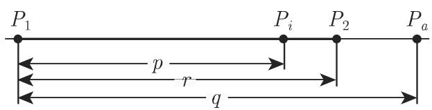
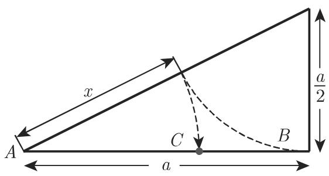
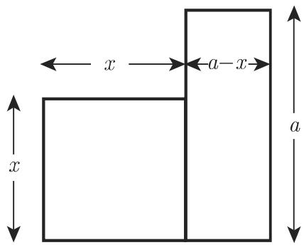
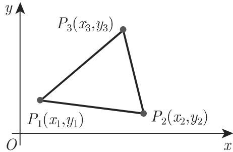


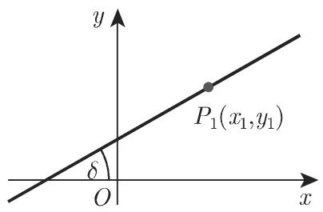

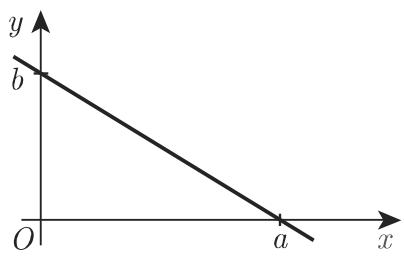
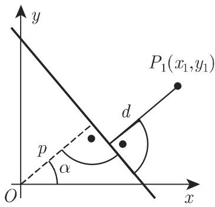


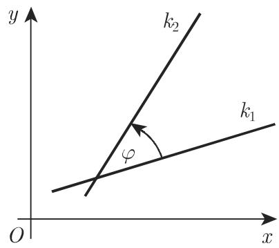

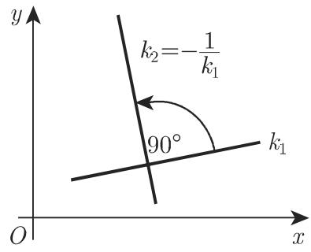
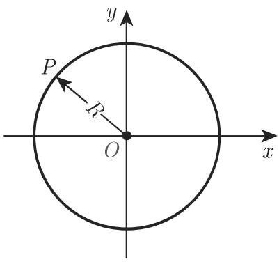


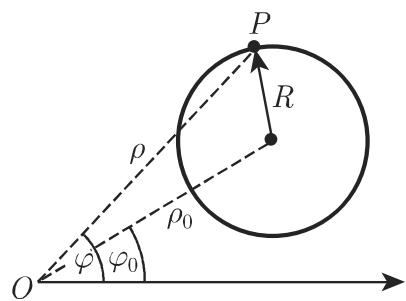

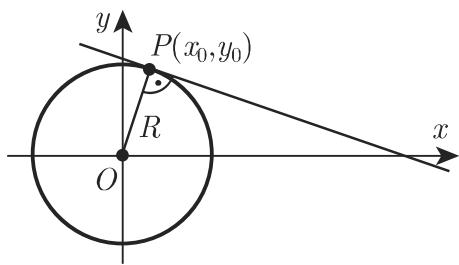


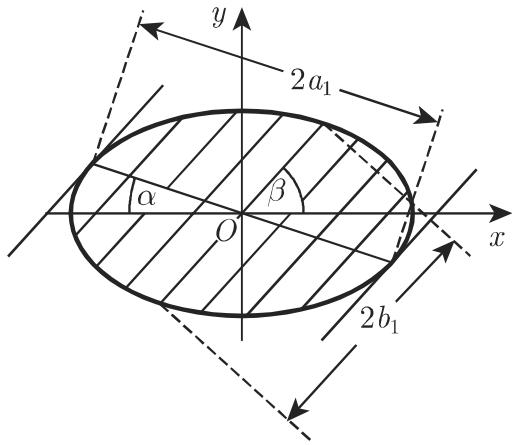
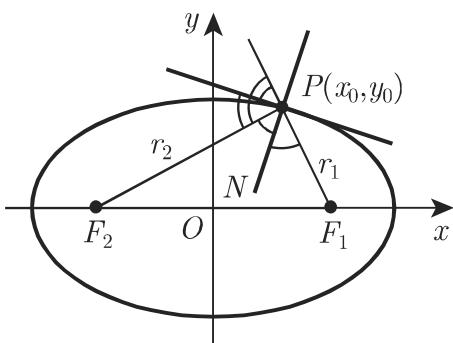

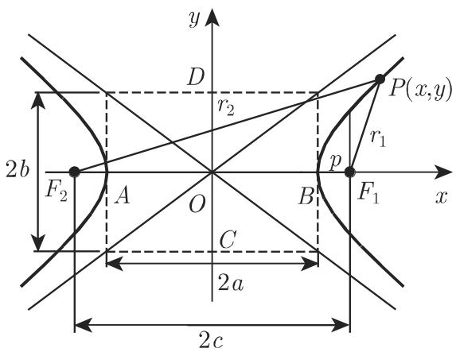
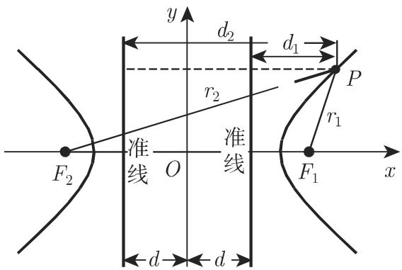
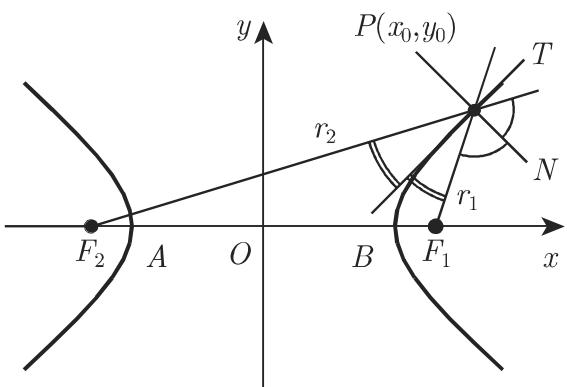

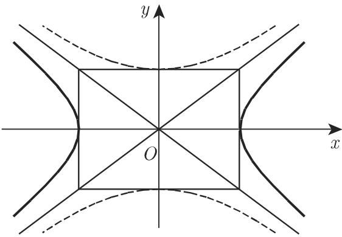


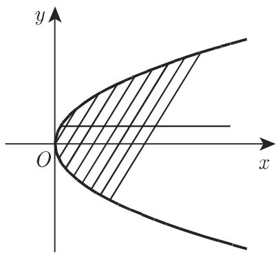

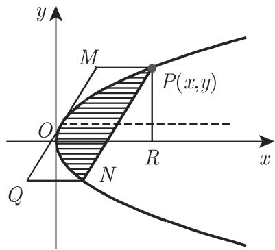
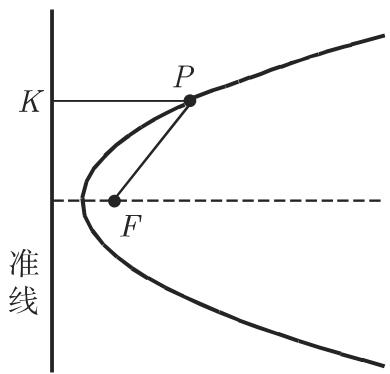
<!-- llm-wiki:embedded-images -->
