# 数学手册(原书第10版) 3.5.3 空间解析几何

本源是《数学手册(原书第10版)》第 3 章几何学中 3.5 节「向量代数与解析几何学」的第三小节，为母节 [[sources/10-数学手册原书第10版--13-35-向量代数与解析几何学--1uj7znc]] 的空间部分。全节为公式密集型手册章节，含式 (3.355)–(3.429)、表 3.21–3.25、图 3.170–3.200，系统给出空间坐标系（笛卡儿、柱、球）、正交坐标变换（平移、旋转、方向余弦、卡丹角、欧拉角）、空间特殊量、曲面与曲线的方程、空间中的直线和平面及其相互关系，以及二次曲面的标准方程与不变量判型理论。

## 章节结构

| 小节 | 主题 | 主要式号 |
|---|---|---|
| 3.5.3.1 | 基本概念：坐标系、右手系/左手系、笛卡儿坐标、坐标曲面与坐标曲线 | 3.355a–c，表 3.21 |
| 3.5.3.2 | 空间坐标系：曲线坐标系、柱坐标、球坐标、三系关系、空间中的方向 | 3.356–3.358，表 3.22 |
| 3.5.3.3 | 正交坐标变换：平移、坐标系旋转、对象旋转 | 3.359–3.361 |
| 3.5.3.4 | 带方向余弦的旋转：坐标轴旋转、变换行列式性质、标量不变量 | 3.362，表 3.23 |
| 3.5.3.5 | 卡丹角 | 3.363–3.364 |
| 3.5.3.6 | 欧拉角 | 3.365–3.367 |
| 3.5.3.7 | 空间特殊量：质心、线段分割、距离、四面体体积 | 3.368–3.372 |
| 3.5.3.8 | 曲面的方程：柱面、旋转面、锥面 | 3.373–3.375 |
| 3.5.3.9 | 空间曲线的方程 | 3.376–3.378 |
| 3.5.3.10 | 平面九式、平面束、多平面关系 | 3.379–3.394 |
| 3.5.3.11 | 空间中的直线：五式、点线距、两线公垂距 | 3.395–3.402 |
| 3.5.3.12 | 直线与平面的交点和夹角 | 3.403–3.411 |
| 3.5.3.13 | 二次曲面：标准方程 | 3.412–3.427 |
| 3.5.3.14 | 二次曲面：一般理论与不变量判型 | 3.428–3.429，表 3.24/3.25 |

## 关键内容与公式组

### 定向与叉积符号

右手系 $\vec e_i\times\vec e_j=\vec e_k$（循环），左手系反号（式 3.355a–b），任意系 $\vec e_i\times\vec e_i=\vec 0$（式 3.355c），见 [[findings/左右手系单位向量叉积公式]]。原文注明「在大地测量学中常使用左手坐标系（参见 3.2.2.1）」，直接补强 [[findings/测地左手坐标系定则]]。

### 柱/球坐标与方向余弦

式 (3.356a–b)、(3.357a–b) 给出与笛卡儿坐标的互换，表 3.22 为总表（[[findings/柱球坐标变换公式组]]）；空间方向由方向余弦 $l,m,n$（$l^2+m^2+n^2=1$）刻画（式 3.358，[[findings/方向余弦与两方向夹角公式]]）。

### 正交变换

平移 (3.359)；绕轴旋转矩阵 $D_x(\alpha),D_y(\beta),D_z(\gamma)$（式 3.360b–d）；对象旋转 $R=D^{-1}=D^{\mathrm T}$（式 3.361，[[findings/平移旋转与对象旋转矩阵关系]]）；方向余弦旋转与变换行列式 $\Delta=\pm1$ 的性质（式 3.362、表 3.23，[[findings/方向余弦旋转与变换行列式性质]]）。

### 卡丹角与欧拉角

$$D_C=D_x(\alpha)D_y(\beta)D_z(\gamma)\tag{3.363a}$$
$$D_E=D_z(\varphi)D_x(\vartheta)D_z(\psi)\tag{3.366a}$$

矩阵连乘按 [[concepts/法尔克图式]] 排布（式 3.363b、3.366b）。方向余弦表达式 (3.364a) 与 (3.367a) 中，欧拉组九分量与矩阵 (3.366c) 完全自洽（经矩阵乘法逐项验证），而卡丹组 (3.364a) 有两处与 (3.363c) 不符（$n_1$ 符号、$n_3$ 下标）——本源最重要的新发现，见 [[findings/卡丹角旋转矩阵及方向余弦两处不符]]、[[findings/欧拉角旋转矩阵与方向余弦自洽性]]。

### 空间特殊量与直线平面

质心 (3.368)、定比分点 (3.369)、距离 (3.370)、四面体体积行列式 (3.371–3.372)；曲面/曲线方程 (3.373–3.378)；平面九式与平面束 (3.379–3.387)；多平面关系 (3.388–3.394)；直线五式与两种距离 (3.395–3.402)；线面交点与夹角 (3.403–3.411)。各公式组见对应 finding 页。

### 二次曲面

九种标准形 (3.412–3.427)、椭球与抛物面截体体积、单叶双曲面与双曲抛物面的两族直母线 (3.422/3.424)；一般方程 (3.428) 与不变量 $\Delta,\delta,S,T$（式 3.429）判型（表 3.24/3.25），判型流程见 [[methodology/二次曲面不变量判型流程]]。

## 表格数据（照录）

表 3.21 卦限中的坐标符号：

| 卦限 | I | II | III | IV | V | VI | VII | VIII |
|---|---|---|---|---|---|---|---|---|
| $x$ | + | − | − | + | + | − | − | + |
| $y$ | + | + | − | − | + | + | − | − |
| $z$ | + | + | + | + | − | − | − | − |

表 3.22 笛卡儿坐标、柱坐标和球坐标之间的关系（转写损坏处以〔〕标注）：

| 笛卡儿坐标 | 柱坐标 | 球坐标 |
|---|---|---|
| $x=$ | $=\varrho\cos\varphi$ | $=r\sin\vartheta\cos\varphi$ |
| $y=$ | $=\varrho\sin\varphi$ | $=r\sin\vartheta\sin\varphi$ |
| $z=$ | $=z$ | $=r\cos\vartheta$ |
| $\sqrt{x^2+y^2}$ | $=\varrho$ | $=r\sin\vartheta$ |
| $\arctan\frac{y}{x}$ | $=\varphi$ | $=\varphi$ |
| 〔转写首格空缺，应为 $z$〕 | $=z$ | $=r\cos\vartheta$ |
| $\sqrt{x^2+y^2+z^2}$ | $=\sqrt{\varrho^2+z^2}$ | $=r$ |
| $\arctan\frac{\sqrt{x^2+y^2}}{z}$ | $=\arctan\frac{\varrho}{z}$ | $=\vartheta$ |
| $\arctan\frac{y}{x}$〔转写重复行〕 | $=\varphi$ | $=\varphi$ |

表 3.23 坐标变换下的方向余弦记号：

| 旧坐标轴 \ 新坐标轴 | $x'$ | $y'$ | $z'$ |
|---|---|---|---|
| $x$ | $l_1$ | $l_2$ | $l_3$ |
| $y$ | $m_1$ | $m_2$ | $m_3$ |
| $z$ | $n_1$ | $n_2$ | $n_3$ |

表 3.24 二次曲面的类型（$\delta\neq0$，有心曲面）：

| | $S\cdot\delta>0,\ T>0$ | $S\cdot\delta$ 和 $T$ 都不大于 0〔条件存疑〕 |
|---|---|---|
| $\Delta<0$ | 椭球面 $\frac{x^2}{a^2}+\frac{y^2}{b^2}+\frac{z^2}{c^2}=1$ | 双叶双曲面 $\frac{x^2}{a^2}+\frac{y^2}{b^2}-\frac{z^2}{c^2}=-1$ |
| $\Delta>0$ | 虚椭球面 $\frac{x^2}{a^2}+\frac{y^2}{b^2}+\frac{z^2}{c^2}=-1$ | 单叶双曲面 $\frac{x^2}{a^2}+\frac{y^2}{b^2}-\frac{z^2}{c^2}=1$ |
| $\Delta=0$ | 虚锥面（实顶点）$\frac{x^2}{a^2}+\frac{y^2}{b^2}+\frac{z^2}{c^2}=0$ | 锥面 $\frac{x^2}{a^2}+\frac{y^2}{b^2}-\frac{z^2}{c^2}=0$ |

表 3.25 二次曲面的类型（$\delta=0$；抛物面、柱面和两个平面），原表为合并结构、表头错乱，内容为：$\Delta\neq0$ 时 $T>0$ 为椭圆抛物面 $\frac{x^2}{a^2}+\frac{y^2}{b^2}=\pm z$、$T<0$ 为双曲抛物面 $\frac{x^2}{a^2}-\frac{y^2}{b^2}=\pm z$；$\Delta=0$ 时为以二次曲线为准线的柱面（$T>0$ 虚椭圆柱面〔存疑〕、$T<0$ 双曲柱面、$T=0$ 抛物柱面），退化为两个实平面、虚平面或重合平面的条件为

$$\begin{vmatrix} a_{11} & a_{12} & a_{14} \\ a_{21} & a_{22} & a_{24} \\ a_{41} & a_{42} & a_{44} \end{vmatrix}+\begin{vmatrix} a_{11} & a_{13} & a_{14} \\ a_{31} & a_{33} & a_{34} \\ a_{41} & a_{43} & a_{44} \end{vmatrix}+\begin{vmatrix} a_{22} & a_{23} & a_{24} \\ a_{32} & a_{33} & a_{34} \\ a_{42} & a_{43} & a_{44} \end{vmatrix}=0$$

## 内部矛盾与疑点（按优先级）

1. **(3.364a) 卡丹角方向余弦两处不符**：$n_1=s_2$（矩阵给 $-\sin\beta$）、$n_3=c_1c_3$（矩阵给 $c_1c_2$）；欧拉组完全自洽反证其为讹。→ [[queries/式3-364a的n1符号与n3下标是否与3-363c矛盾]]
2. **(3.362a) 与 (3.362c)/(3.362e) 相差一个转置**。→ [[queries/式3-362a与3-362e是否互为转置错位]]
3. **表 3.24 第二列「都不大于 0」疑为「不都大于 0」**（反例 $x^2+y^2-100z^2=1$ 为单叶双曲面，两列皆不匹配）。→ [[queries/表3-24第二列是不都大于还是都不大于]]
4. **表 3.25「T>0 → 虚椭圆柱面」排除实椭圆柱面；表头 Δ<0/Δ>0 与行标 Δ≠0/Δ=0 结构错乱**。→ [[queries/表3-25中T大于0的柱面是否应含实椭圆柱面]]
5. **欧拉进动角范围 $0\le\psi<\pi$ 疑应为 $2\pi$；(3.389) 后 Δ=0 两情形措辞与系数矩阵秩的实际几何不符**。→ [[queries/欧拉角进动角ψ范围与3-389秩一情形措辞]]

## 转写讹误

全节再现全书系统性 OCR 损伤（「千」=于、「兀」=π、「詈茄」=雪茄、「入」=λ、向量/点/轴名成片脱落、分数线脱落、「变换行列式 φcorner」=Δ 之讹、表 3.22 重复行、例 A–D 残字），译名「卡当角/卡丹角」「黑赛法式/黑塞法式」并存，统一登记于 [[queries/3-5-3全节符号脱落与分数线脱落是否为转写丢字]]。

## 与其他部分的联系

- 母节：[[sources/10-数学手册原书第10版--13-35-向量代数与解析几何学--1uj7znc]]；本节大量回指 3.5.1（向量代数）与 3.5.2（平面解析几何，含被两次回指的式 (3.290c)），二者尚未入库，交叉引用暂为悬空。
- 直接补强 [[findings/测地左手坐标系定则]]；同构 [[findings/四面体行列式体积公式]]（式 3.133 ↔ 3.371）；三维类比 [[findings/坐标互化与比例因子校正]]（式 3.106–3.107 ↔ 3.356/3.357）与 [[findings/两直角坐标系相似变换]]（式 3.108–3.109 ↔ 3.359–3.362）。
- 衔接 3.3 节 [[concepts/母线与准线]]、[[concepts/柱体族]]、[[concepts/锥体族]]、[[concepts/球]]、[[concepts/相错直线]]、[[concepts/四面体]]。
- 记号张力：本节球坐标（$\vartheta$=极角、$\varphi$=方位角）与 [[concepts/地理坐标]]（$\varphi$=纬度、$\lambda$=经度）记号相反，见 [[comparisons/球坐标极角与地理纬度记号比较]]。
- 本节两处引用「图 3.34」描述字母循环次序（a,b,c 换为 i,j,k），为 [[queries/342节转写讹误与图3-34误引]] 提供旁证：原书早期确有循环次序图，3.4.2 处的引用可能并非误引。

<!-- llm-wiki:embedded-images -->
## Embedded Images

### Document

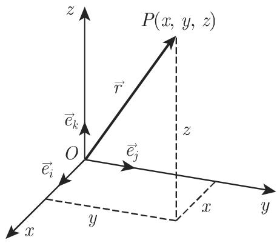
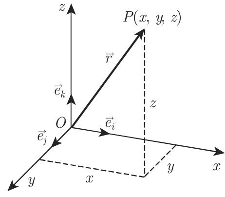
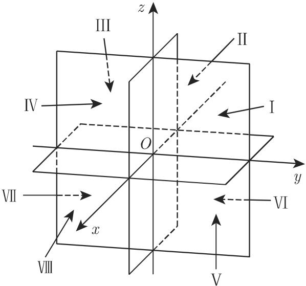
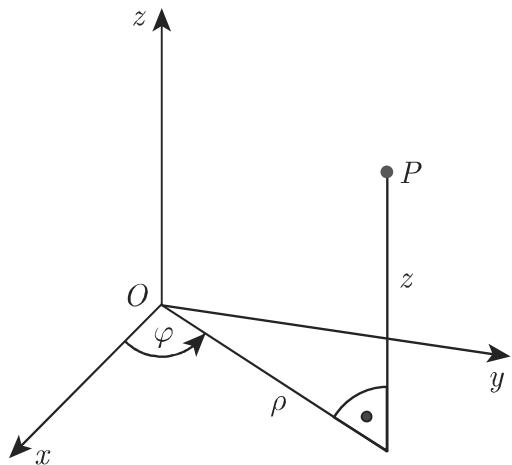
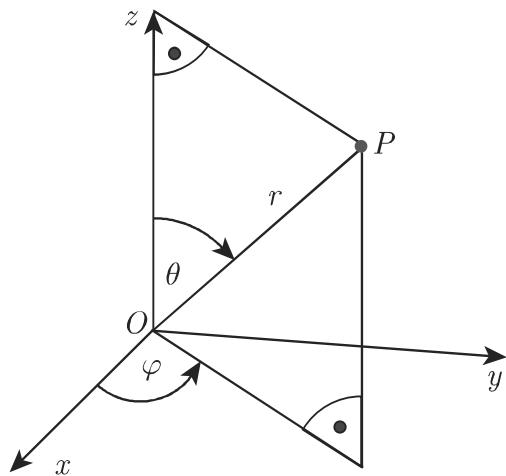
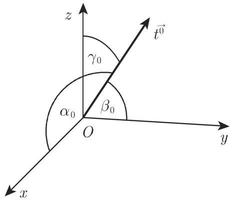

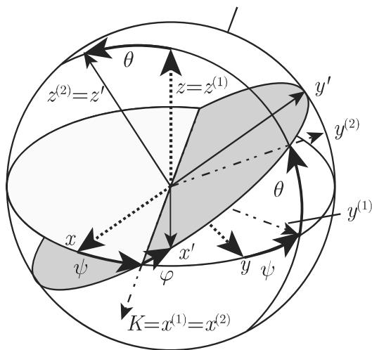

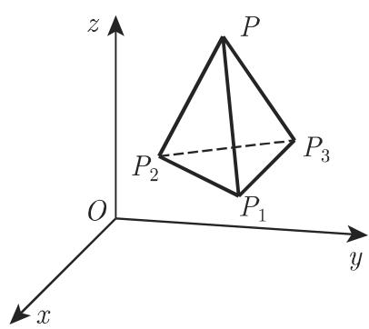

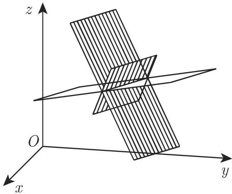

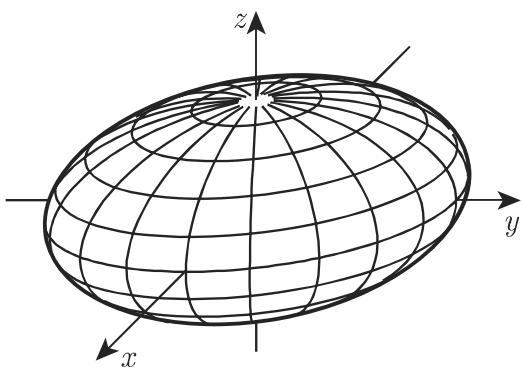

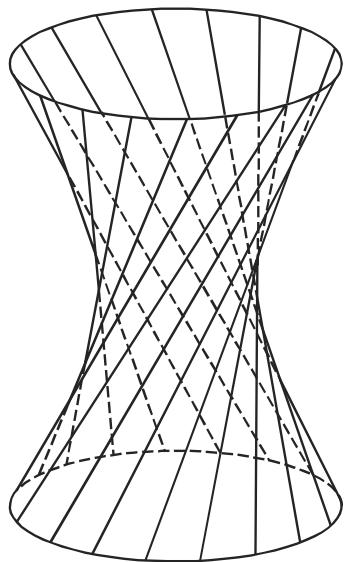
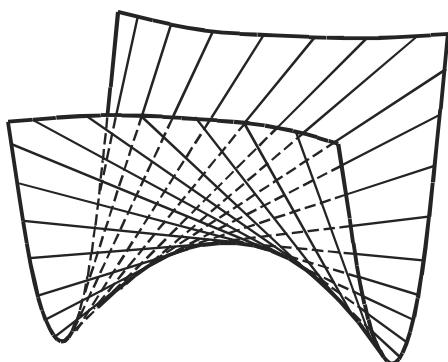

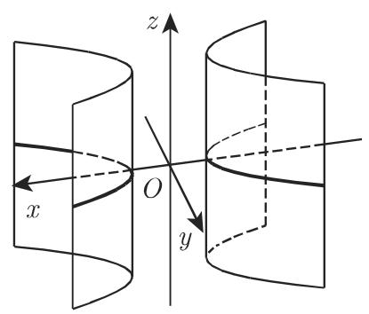

<!-- llm-wiki:embedded-images -->
