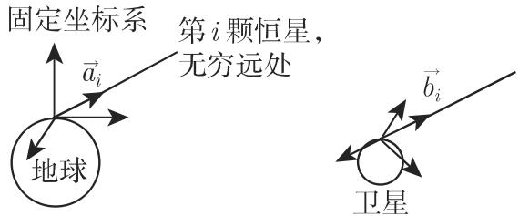

# 数学手册(原书第10版) 4.4.3 四元数的应用

## 概述

本页是《数学手册（原书第10版）》4.4 节「四元数及应用」的应用小节 **4.4.3「四元数的应用」** 的入库记录，是 [[sources/10-数学手册原书第10版--9-44-四元数及应用--1oshpaj]] 所覆盖的 4.4.1/4.4.2 代数部分的直接延续——本节多处回引式 (4.107)（i, j, k 的乘法表）、(4.109b)（四元数乘法法则）与 (4.115)。全节以单位四元数群 ℍ₁ ≅ S³ 为统一载体，含六个小节：

| 小节 | 主题 | 派生页面 |
|---|---|---|
| 4.4.3.1 | 计算机绘图学中的 3D 旋转插值（Lerp/Slerp/Squad） | [[concepts/Lerp]]、[[concepts/Slerp]]、[[concepts/Squad]] |
| 4.4.3.2 | 旋转矩阵的插值 | [[entities/SO3]] |
| 4.4.3.3 | 球极平面投影 | [[concepts/球极平面投影]] |
| 4.4.3.4 | 卫星导航（四元数最小二乘姿态确定） | [[concepts/四元数最小二乘姿态确定]] |
| 4.4.3.5 | 向量分析（四元数微分算子 ∇_Q 与 D） | [[concepts/四元数微分算子]] |
| 4.4.3.6 | 规范化四元数和刚体运动（对偶四元数，书称「八元数」） | [[concepts/对偶四元数]]、[[entities/SE3]] |

## 4.4.3.1 计算机绘图学中的 3D 旋转

动机：刻画运动流需要旋转的插值；因 3D 旋转可用单位四元数表示，计算机绘图学发展了相应算法，基本算法为 Lerp、Slerp、Squad。

```latex
Lerp(p, q, t) = p(1 - t) + q t                                             (4.143)

Slerp(p, q, t) = p(\bar{p} q)^t = p^{1-t} q^t
               = p · sin((1-t)φ)/sinφ + q · sin(tφ)/sinφ,   0 < φ < π       (4.144)

Slerp(1, q, t) = cos(tφ) + n̲_q sin(tφ)    (p = 1, q = cosφ + n̲_q sinφ)    (4.145)

q_k := Slerp(p, q, k/n) = (1/sinφ)(sin(φ - kψ) p + sin(kψ) q),
       ψ = φ/n,   k = 0, 1, …, n                                           (4.146)

Q₀ = Sc Q = Sc(p̄q) = ⟨p, q⟩ = cos φ                                       (4.147)

Q(t) = sin((1-t)φ)/sinφ + Q · sin(tφ)/sinφ
     = cos(tφ) + n⃗_Q sin(tφ) = e^{t n⃗_Q φ} = e^{t log Q} = Q^t            (4.148)

q(t) = p Q(t) = p · sin((1-t)φ)/sinφ + q · sin(tφ)/sinφ
     = p Q^t = p(p⁻¹q)^t = p^{1-t} q^t                                     (4.149)

Squad(q_i, q_{i+1}, s_i, s_{i+1}, t)
  = Slerp( Slerp(q_i, q_{i+1}, t), Slerp(s_i, s_{i+1}, t), 2t(1-t) )       (4.150)
s_i = q_i exp( −( log(q_i⁻¹ q_{i+1}) + log(q_i⁻¹ q_{i-1}) ) / 4 )
```

书中要点：Lerp 取 ℝ⁴ 中连接 p、q 的弦线段（单位球内部）上的点，须经规范化才表示旋转，且归一化所得单位四元数**不是等距四元数**（角速度不均匀）；Slerp 沿 S³ 大圆插值（[[concepts/测地线]]），取最短连接需 ⟨p, q⟩ > 0；Squad 给出四元数序列的类贝济埃（Bezier）样条，但首末区间未定义，可取 s₀ = q₀、s_N = q_N 或补定义 q₋₁、q_{N+1}。另点名 nlerp、log-lerp、islerp、四元数德卡斯特里奥样条（书中拼作 de Casteeljau）等算法。图 4.5 比较 Lerp 与 Slerp：


## 4.4.3.2 旋转矩阵的插值

借助 [[entities/SO3]] 元素的对数（满足 e^r = R 的斜对称矩阵）可把 Slerp 完全类似地移植到旋转矩阵：

```latex
R(t) = R₀ (R₀⁻¹ R₁)^t = R₀ exp( t log(R₀⁻¹ R₁) )                           (4.151)
```

书中评注：一般而言，应用四元数基本算法、再依单位四元数转换为旋转矩阵，由 q(t) 确定 R(t) 要简单些。

## 4.4.3.3 球极平面投影

取 1 ∈ ℍ₁ ∼ S³ 为三维球的北极，单位四元数可用球极平面投影映为纯四元数（ℍ₀ ∼ ℝ³）：

```latex
ℍ₁ ∋ q  ↦  (1 + q)(1 - q)⁻¹  ∈  ℍ₀ ~ ℝ³      (以 1 ∈ S³ 为北极)
ℝ³ ~ ℍ₀ ∋ p  ↦  (p - 1)(p + 1)⁻¹  ∈  ℍ₁ ~ S³     (逆映射)                (4.152)
```

## 4.4.3.4 卫星导航

环绕地球运行的人造卫星的姿态确定：恒星视为无穷远，故恒星方向相对于地球与相对于卫星相同（图 4.6）；任何测量差别都可由两坐标系的相对旋转推出。设 a⃗ᵢ、b⃗ᵢ 分别为地球固定系与卫星系中指向第 i 颗恒星的单位向量，相对旋转由单位四元数 h 刻画；测量带误差时以最小二乘极小化 Q²：

```latex
b⃗ᵢ = h a⃗ᵢ h̄                                                            (4.153)

Q² = Σᵢ |b⃗ᵢ − h a⃗ᵢ h̄|² = Σᵢ (2 − b̲ᵢ h āᵢ h̄ − h a̲ᵢ h̄ b̄ᵢ)                 (4.154)

∂_v h = lim_{θ→0} (e^{θv} h − h)/θ = v h     (v 为四元数, θ 为实数)        (4.155)

∂_v Q² = −Σᵢ ( b̲ᵢ v̲ h āᵢ h̄ + b̲ᵢ h āᵢ (vh)‾ + v̲ h a̲ᵢ h̄ b̄ᵢ + h a̲ᵢ (vh)‾ b̄ᵢ ) = 0
                                                                        (4.156)

∂_v̲ Q² = −4 v̲ · ( Σᵢ h a⃗ᵢ h̄ × b̲ᵢ ) = 0                                  (4.157)

Σᵢ h a⃗ᵢ h̄ × b̲ᵢ = 0                                                       (4.158)

K(a⃗) = [  0   −a_z  a_y ]
        [ a_z   0   −a_x ]
        [−a_y  a_x   0  ]                                                  (4.159)

K(a⃗) b⃗ = a⃗ × b⃗,    K(K(a⃗) b⃗) = b⃗ a⃗ᵀ − a⃗ b⃗ᵀ                            (4.160)

Σᵢ K(R a⃗ᵢ × b⃗ᵢ) = O ⇔ Σᵢ (b⃗ᵢ a⃗ᵢᵀ Rᵀ − R a⃗ᵢ b⃗ᵢᵀ) = O
                  ⇔ R P = Pᵀ Rᵀ,      P = Σᵢ a⃗ᵢ b⃗ᵢᵀ                       (4.161)

P = R_pᵀ S  (S 对称, R_p 旋转矩阵)  ⟹  R R_pᵀ S = S R_p Rᵀ                 (4.162)

R = R_p                                                                  (4.163)

R = R_j R_p   (j = 1,2,3),   R_j S R_j = S  (绕 S 的第 j 个特征向量旋转 π)   (4.164)

R = R_p          若 det P > 0
R = R_{j₀} R_p   若 det P < 0    (j₀: S 的绝对值最小特征值对应的特征向量)    (4.165)
```

（转写中 R、S、P、R_j、j₀ 等符号成片脱落，上式已按上下文复原；详见 [[queries/4-4-3全节转写讹误清单]]。）



## 4.4.3.5 向量分析

把 ∇ 算子（13.2.6.1，式 13.67）与向量（13.1.3）等同到四元数演算：

```latex
∇_Q = i ∂/∂x + j ∂/∂y + k ∂/∂z                                             (4.166)

v̲(x,y,z) = v₁(x,y,z) i + v₂(x,y,z) j + v₃(x,y,z) k                        (4.167)

∇_Q v̲ = −∇·v⃗ + ∇×v⃗ = −div v⃗ + rot v⃗                                      (4.168)

D = ∂/∂t + i ∂/∂x + j ∂/∂y + k ∂/∂z                                        (4.169a)

w(t,x,y,z) = w₀ + w₁ i + w₂ j + w₃ k = w₀ + w̲        (转写误标为 "(4.16)") (4.169b)

D w = ∂w₀/∂t − div w̲ + rot w̲ + grad w₀          [疑脱落 ∂w̲/∂t 项]        (4.169c)

∇_Q ∇̄_Q f = ∇̄_Q ∇_Q f = Δ₃ f                                              (4.170a)
∇_Q ∇_Q f = −Δ₃ f                                                         (4.170b)
D D̄ f = D̄ D f = ∂²f/∂t² + Δ₃ f = Δ₄ f                                     (4.170c)
```

书中称 ∇_Q 恰如 ∇ 一样，常称为**狄拉克（Dirac）**或**柯西–黎曼（Cauchy–Riemann）算子**。Δ₃、Δ₄ 为 ℝ³、ℝ⁴ 的拉普拉斯算子（13.2.6.5，式 13.75；第 13 章未入库，见 [[queries/第13章未入库对四元数向量分析的依赖缺口]]）。

## 4.4.3.6 规范化四元数和刚体运动

**术语警示**：本小节定义的「八元数」是 ε² = 0 的对偶代数，按结构为标准的**对偶四元数**，与 4.4.2 层级中的八元数（若为 Cayley 型）不是同一对象——见 [[queries/八元数一词双义之疑]] 与 [[concepts/对偶四元数]]。

```latex
ĥ = h₀ + ε h₁,    h₀, h₁ ∈ ℍ,   ε² = 0, ε 与每个四元数交换                 (4.171)

ĥ ĥ‾ = (h₀ + ε h₁)(h̄₀ + ε h̄₁) = 1
  ⇔  h₀ h̄₀ = 1  且  h₀ h̄₁ + h₁ h̄₀ = 0                                     (4.172)

ĥ = h₀ + h₁ ε = (1 + ½ t̲ ε) r = r + ½ t̲ r ε,    t̲ ∈ ℍ₀, r ∈ ℍ₁          (4.173)
```

**表 4.1（用「八元数」表示刚体运动；转写中下标被压平，此处复原）**

| 元素 | 表示 |
|---|---|
| 空间中点 p̲ = (p_x, p_y, p_z) | p̌ = 1 + p̲ε，其中 p̲ = p_x **i** + p_y **j** + p_z **k** |
| 旋转 | r ∈ ℍ₁，单位四元数 |
| 平移 t̲ = (t_x, t_y, t_z) | 1 + ½ t̲ε，其中 t̲ = t_x **i** + t_y **j** + t_z **k** |

因 ±ĥ 刻画相同的刚体运动，单位八元数（4.173）给出 ℝ³ 中刚体运动群 [[entities/SE3]] 的**双重覆盖**。

## 关键论断与归属边界

1. **Lerp**：归一化后插值点非等距（角速度不均匀）——该缺陷属于 Lerp＋归一化，不属于 Slerp（书称 Lerp「几乎是完美的」，仅此一问题）。
2. **Slerp**：沿大圆等角速插值；最短连接条件 ⟨p, q⟩ > 0 属于 Slerp。转写中该条件写作「−Sc(p, q) = ⟨p,q⟩ > 0」，与式 (4.147) 的 Sc(p̄q) = ⟨p,q⟩ = cosφ 不一致，负号与逗号疑为讹误。
3. **Squad**：首末区间未定义的问题属于 Squad。
4. **矩阵法评注**：「先做四元数插值再转矩阵更简单」只针对 4.4.3.2 的实现路径，不可转用于 4.4.3.4（那里 K(a⃗)、极分解等矩阵工具是推导手段）。
5. **刚体运动能力**：表示旋转+平移、双重覆盖 SE(3) 的能力属于式 (4.171) 的 ε-代数（对偶四元数），**不可**转授予 4.4.2 层级中的八元数。
6. **算子命名**：书中明确把 ∇_Q 与 ∇ 并列称为狄拉克或柯西–黎曼算子。

## 独立复核结果（分析者标注，非书中内容）

- (4.145)/(4.146) 由 (4.144) 代入成立；(4.148) 化简链 sin((1−t)φ) + cosφ·sin(tφ) → cos(tφ) 正确；(4.149) 与 (4.144) 一致。**警示**：(4.144)/(4.149) 末项 p^{1−t}q^t 是非交换代数中的记号缩并（反例：p = i, q = j, t = ½ 时 p(p̄q)^t = (i+j)/√2 而 p^{1−t}q^t = (1+i+j+k)/2），见 [[queries/式4-144末项非交换记号是否原书如此]]。
- (4.152)：(1+q)(1−q)⁻¹ = (q−q̄)/|1−q|² 确为纯四元数，等于经典公式 Im(q)/(1−Sc q)；逆映射互逆；q = 1（北极）为奇点，书未明示排除。
- (4.154)、(4.160)、(4.161)、(4.162)–(4.164) 验证无误（(4.160) 即 [a⃗×b⃗]× = b⃗a⃗ᵀ − a⃗b⃗ᵀ）。
- (4.168)、(4.170a–c) 验证成立；**例外**：(4.169c) 疑脱落 ∂w̲/∂t 项，见 [[queries/式4-169c是否脱落时间偏导项]]。
- (4.172) ⟺ h₀ ∈ ℍ₁ 且 h₀⁻¹h₁ 为纯四元数；(4.173) 与之自洽；平移可加：(1+½t̲ε)(1+½t′ε) = 1+½(t̲+t′)ε；双重覆盖核为 {±ĥ}；点变换作用式在转写中缺失（标准约定 p̌′ = ĥ p̌ ĥ̄ᵉ 给出 p′ = Rp + t，与表中 ½ 因子吻合，分析者复核）。
- 外部识别（书未命名）：4.4.3.4 的问题即正交 Procrustes / Wahba 问题，解法为其极分解（SVD 型）解法。

## 与既有 wiki 的联系

- [[concepts/四元数]]：本节把四元数从代数结构推向应用（插值、投影、姿态、向量分析、刚体运动），建议在该页补应用交叉链接。
- [[concepts/八元数]]：**术语冲突关键点**（见上）；亦牵动 [[queries/八元数能否描述刚体一般运动]]（本书的肯定答案主语是对偶四元数）与 [[queries/八元数是否属克利福德代数特殊情形]]（对偶四元数 ≅ Cℓ⁺(3,0,1) 为分析者推断）。
- [[findings/四元数刻画旋转的优缺点与八元数补救主张]]：本节以表 4.1 与式 (4.172)–(4.173) 把该「补救主张」落到具体构造。
- [[concepts/反对称矩阵]]、[[findings/轴向量与斜对称秩2张量的对应]]：K(a⃗)（式 4.159–4.160）正是该对应的矩阵形式；so(3) 即斜对称矩阵全体的实例。
- [[concepts/正交矩阵]]、[[concepts/行列式]]：SO(3) ⊂ 正交矩阵；式 (4.165) 用 det P 判别极小解。
- [[concepts/测地线]]：Slerp 沿 S³ 大圆（球面测地线）插值。
- [[concepts/并积]]、[[concepts/缩并]]：P = Σᵢ a⃗ᵢb⃗ᵢᵀ 是并向量之和；Q² 的展开用到缩并。
- [[queries/4-4节千于与卫星导行等转写讹误]]：同一讹误家族在本节大规模重现，见 [[queries/4-4-3全节转写讹误清单]]。

## 本源派生页面

- 概念：[[concepts/Lerp]]、[[concepts/Slerp]]、[[concepts/Squad]]、[[concepts/球极平面投影]]、[[concepts/对偶四元数]]、[[concepts/四元数微分算子]]、[[concepts/四元数最小二乘姿态确定]]
- 实体：[[entities/SO3]]、[[entities/SE3]]
- 发现：[[findings/Lerp与Slerp公式组及等价性证明]]、[[findings/Squad公式与端点未定义问题]]、[[findings/旋转矩阵的Slerp插值公式]]、[[findings/球极平面投影正逆映射]]、[[findings/卫星导航最小二乘姿态确定解全链]]、[[findings/四元数算子与拉普拉斯分解]]、[[findings/对偶四元数表示刚体运动与SE3双重覆盖]]
- 方法：[[methodology/卫星姿态确定的极分解求解流程]]
- 比较：[[comparisons/Lerp与Slerp比较]]
- 问题：[[queries/4-4-3全节转写讹误清单]]、[[queries/八元数一词双义之疑]]、[[queries/式4-169c是否脱落时间偏导项]]、[[queries/式4-144末项非交换记号是否原书如此]]、[[queries/4-4-3-6标题规范化四元数与点变换作用式缺失]]、[[queries/第13章未入库对四元数向量分析的依赖缺口]]

<!-- llm-wiki:embedded-images -->
## Embedded Images

### Document


<!-- llm-wiki:embedded-images -->
