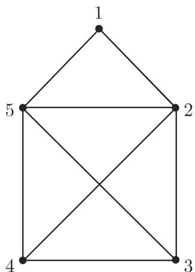
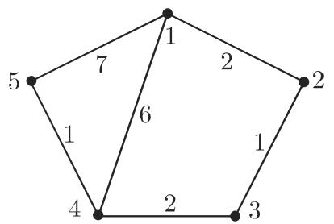
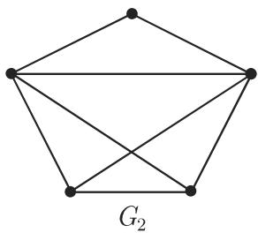
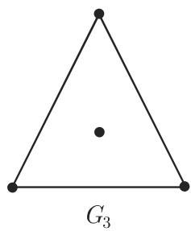
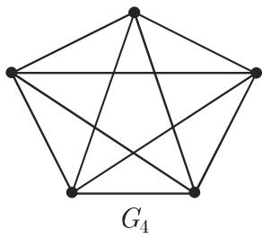
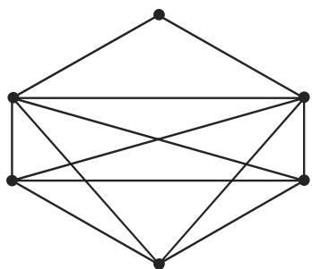

# 数学手册(原书第10版) 5.8.2 无向图的遍历

《数学手册（原书第 10 版）》第 5 章第 8.2 节，主题为**无向图的遍历**。这是本 wiki 入库的首个图论（5.8.x）小节——此前已入库的 5.4.2–5.7 覆盖数论、保密学、泛代数与布尔代数，图论领域此前为空白。全节分三个小节：

- **5.8.2.1 边序列或路**：边序列、圈、路、迹、基本圈的定义链；连通图与分量；顶点间距离；最短路问题；距离矩阵（式 5.320）与矩阵幂最短路判据（式 5.321）。
- **5.8.2.2 欧拉迹**：欧拉迹与欧拉图定义；欧拉-希尔霍尔策定理；闭欧拉迹的构造；开欧拉迹判定；中国邮递员问题（式 5.322）。
- **5.8.2.3 哈密顿圈**：哈密顿圈定义与历史渊源；判定问题的 NP 完全性；狄拉克、奥尔、波萨三组充分条件。

## 5.8.2.1 边序列或路

### 边序列定义组

在无向图 $G=(V,E)$ 中，形如下式的序列称为边序列（长度数字 $s$ 在转写中脱落）：

$$
F = (\{v_1, v_2\}, \{v_2, v_3\}, \dots, \{v_s, v_{s+1}\})
$$

若 $v_1 = v_{s+1}$ 则称为**圈**，否则为**开边序列**；顶点 $v_1,\dots,v_s$ 两两不同的边序列称为**路**；闭路即**环道**；无重复边的边序列称为**迹**。图 5.38 给出 F₁–F₅ 五例（其中 F₃ 疑有转写错误、F₅ 字符损坏，详见 [[边序列定义组与图5-38五例]]）。

### 连通、距离与最短路

每对不同顶点之间都存在路的图称为**连通图**；不连通图可分解为**分量**（极大顶点数的诱导连通子图）。两顶点 $v,w$ 间的距离 $\delta(v,w)$ 定义为连接它们的路的最小边数，无路时为 $\infty$。

**最短路问题**：在加权简单图 $G=(V,E,f)$（每条边 $f(e)>0$）中，求两点间使边权之和极小的路。手册提及丹齐格（Dantzig）的有效算法（对有向图叙述，可类似地用于无向图，见未入库的 5.8.6，第 551 页），并给出两种矩阵工具（原文出现「边**和弧**的权之和」，「弧」属有向图术语，疑为编译残留）。

### 距离矩阵（式 5.320，逐字保留）

$$
\boldsymbol{D} = (d_{ij}), \quad \text{其中} \quad d_{ij} = \delta(v_i, v_j)\ (i, j = 1, 2, \dots, n).\tag{5.320}
$$

图 5.39 例的 D 矩阵（编号在转写中残缺为「(•6)」，数值逐字保留）：

$$
D = \begin{pmatrix}
0 & 2 & 3 & 5 & 6 & \infty \\
2 & 0 & 1 & 3 & 4 & \infty \\
3 & 1 & 0 & 2 & 3 & \infty \\
5 & 3 & 2 & 0 & 1 & \infty \\
6 & 4 & 3 & 1 & 0 & \infty \\
\infty & \infty & \infty & \infty & \infty & 0
\end{pmatrix}
$$

### 矩阵幂最短路判据（式 5.321，逐字保留）

在每条边权都为 __（数字脱落，应为 1）的情形，可用矩阵幂判定两顶点间最短路的长度：存在从顶点 $v_i$ 到顶点 $v_j\ (i\neq j)$ 的长为 k 的最短路，当且仅当

$$
a_{ij}^{k} \neq 0, \quad \text{并且} \quad a_{ij}^{s} = 0\ (s = 1, 2, \dots, k-1).\tag{5.321}
$$

**术语警示**：原文此处通篇称「关联矩阵」，但按数学实质（点×点矩阵、幂计数步道）应为**邻接矩阵**；关联矩阵（点×边矩阵）不具有此功能。详见 [[关联矩阵是否应为邻接矩阵]] 与 [[邻接矩阵幂与最短路判定]]。

图 5.40 例的三个矩阵（逐字保留；A²、A³ 已逐项复算，与 A 完全一致）：

$$
\boldsymbol{A} = \begin{pmatrix}
0 & 1 & 0 & 0 & 0 & 0 \\
1 & 1 & 1 & 1 & 1 & 0 \\
0 & 1 & 0 & 0 & 0 & 0 \\
0 & 1 & 0 & 0 & 0 & 0 \\
0 & 1 & 0 & 0 & 0 & 1 \\
0 & 0 & 0 & 0 & 1 & 0
\end{pmatrix},\quad
\boldsymbol{A}^{2} = \begin{pmatrix}
1 & 1 & 1 & 1 & 1 & 0 \\
1 & 5 & 1 & 1 & 1 & 1 \\
1 & 1 & 1 & 1 & 1 & 0 \\
1 & 1 & 1 & 1 & 1 & 0 \\
1 & 1 & 1 & 1 & 2 & 0 \\
0 & 1 & 0 & 0 & 0 & 1
\end{pmatrix},\quad
\boldsymbol{A}^{3} = \begin{pmatrix}
1 & 5 & 1 & 1 & 1 & 1 \\
5 & 9 & 5 & 5 & 6 & 1 \\
1 & 5 & 1 & 1 & 1 & 1 \\
1 & 5 & 1 & 1 & 1 & 1 \\
1 & 6 & 1 & 1 & 1 & 2 \\
1 & 1 & 1 & 1 & 2 & 0
\end{pmatrix}
$$

原例句（顶点对列表残缺）：「长为 __ 的最短路连接顶点 3, 4, 1 5, 6, 4,5, 5. 此外，顶点 6, 3 6, 以及最后， 之间的最短路的长为 3.」据矩阵复算可复原为：距离 2 的顶点对 $\{1,3\}$、$\{1,4\}$、$\{1,5\}$、$\{2,6\}$、$\{3,4\}$、$\{3,5\}$、$\{4,5\}$；距离 3 的顶点对 $\{1,6\}$、$\{3,6\}$、$\{4,6\}$。详见 [[图5-40例句最短路顶点对复原]] 与 [[距离矩阵与邻接矩阵幂判据-式5-320-321]]。

## 5.8.2.2 欧拉迹

**定义**：含有图 G 的每条边的迹，称为 G 的（开或闭的）**欧拉迹**；含有闭欧拉迹的**连通图**称为**欧拉图**。

**欧拉-希尔霍尔策（Euler-Hierholzer）定理**：有限连通图是欧拉图，当且仅当它的所有顶点的次数都是正偶数（详见 [[欧拉-希尔霍尔策定理]]）。

**开欧拉迹判定**：图中存在开欧拉迹，当且仅当图中恰存在两个有奇次数的顶点（图 5.45 给出一个无闭欧拉迹但有开欧拉迹的图，各边按欧拉迹相继顺序标号；图 5.46 为具有欧拉迹的图）。

**闭欧拉迹的构造**（希尔霍尔策方法）：任取顶点 $v_1$ 贪心遍历得迹 $F_1$；若未覆盖全部边，则从 $F_1$ 上某顶点 $v_2$ 出发构造 $F_2$，再拼接；有限步内得闭欧拉迹。详见 [[希尔霍尔策闭欧拉迹构造流程]]。

四例分层（图 5.41–5.44）：G₁ 无欧拉迹；G₂ 有欧拉迹但非欧拉图；G₃「有一个闭欧拉迹但它不是欧拉图」（与定义表面冲突，仅当 G₃ 不连通时相容，见 [[g3有闭欧拉迹却非欧拉图是否因不连通]]）；G₄ 是欧拉图。

### 中国邮递员问题（式 5.322，逐字保留）

邮递员必须至少一次通过其服务区的所有街道并回到出发地，且使路程尽可能短。图论表述：设 $G=(V,E,f)$ 为加权图，对每条边 $e\in E$ 有 $f(e)\geqslant 0$；确定边序列使其具有极小总长

$$
L = \sum_{e \in F} f(e).\tag{5.322}
$$

问题命名源于中国数学家[[管梅谷]]，他首先研究此问题（详见 [[中国邮递员问题]]）。求解分两情形：(1) G 是欧拉图，则每个闭欧拉迹都是最优的；(2) G 无闭欧拉迹，此时有 Edmonds 与 Johnson 给出的有效算法（手册仅引 [5.49]，无算法细节）。

## 5.8.2.3 哈密顿圈

**定义**：哈密顿圈是覆盖图中**所有顶点**的基本圈（图 5.47 以粗线条标出）。在面为五边形的十二面体的图中构造哈密顿圈的游戏可追溯到哈密顿爵士。

**复杂性断言**：刻画有哈密顿圈的图的问题导致一个经典的 NP 完全问题，因此「在此不能给出确定哈密顿圈的有效算法」——这是本小节只给充分条件的根本原因。此断言仅关于哈密顿圈，不得迁移到欧拉问题（多项式可解），详见 [[哈密顿圈判定是np完全问题]] 与 [[np完全问题]]。

**三组充分（而非必要）条件**（均为简单图；「至少有 __ 个顶点」数字脱落，标准定理应为 3，见 [[狄拉克奥尔波萨至少顶点数缺字是否为3]]）：

- [[狄拉克定理]]：若对每个顶点 $v$ 有 $d_G(v)\geq |V|/2$，则 G 有哈密顿圈；
- [[奥尔定理]]：若对每对非邻接顶点 $v,w$ 有 $d_G(v)+d_G(w)\geq |V|$，则 G 有哈密顿圈（手册明确称其假设比狄拉克定理「更一般」）；
- [[波萨定理]]：若 (1) 对 $1\leq k\leq (|V|-1)/2$，次数不超过 k 的顶点个数小于 k；(2) 若 $|V|$ 为奇数，次数不超过 $(|V|-1)/2$ 的顶点个数小于或等于 $(|V|-1)/2$，则 G 有哈密顿圈。

图 5.48 给出一个有哈密顿圈但不满足奥尔定理假设的图，支撑「充分而非必要」。

## 转写质量与复算

- **已复算（强，可直接引用）**：图 5.40 的 A²、A³ 与 A 逐项一致；图 5.39 的 D 对称、对角为 0，并与「权为 2,1,2,1 的路 1—2—3—4—5 加孤立点 6」的推断结构完全一致。这是本源中罕见且可机读验证的数据，可作为本节的**验证锚点**。
- **系统性数字脱落**：边序列长度 s；F₁/F₂ 的长度；无权情形的边权；式 5.321 前导句与图 5.40 例句中的「长为 __」；三定理的「至少有 __ 个顶点」；波萨条件的次数阈值。
- **系统性替换**：「于→千」贯穿全篇（对千/应用千/小千/等千/相对千/源千）。
- **字符损坏与乱码**：F₅ 的「{5，叶}」；D 矩阵编号「(•6)」；「图伍 G₄」「从某过顶点」「应 F₁ 凡和 F₂」「图 5.45出一个图」；多处图符号 G 脱落。
- **疑内容错误**：F₃ 顶点 2 重复，按定义不是路；G₃ 例与欧拉图定义表面冲突。

全部讹误汇总见 [[5-8-2全节系统性转写讹误清单]]。

## 依赖与交叉引用缺口

本节引用的以下内容均未入库：4.1.4（矩阵乘法，第 365 页）、5.8.1（图的基本概念：加权图、次数、关联/邻接矩阵、基本圈的定义处）、5.8.6（有向图的遍历与丹齐格算法，第 551 页）、外部引文 [5.49]（Edmonds–Johnson 算法）。详见 [[5-8-2未入库依赖缺口]]。

## 图版索引

**图 5.38**（边序列示例 F₁–F₅）

**图 5.39**（加权图及其距离矩阵 D）

**图 5.40**（图及其矩阵 A、A²、A³）

**图 5.41**（G₁，无欧拉迹）

**图 5.42**（G₂，有欧拉迹但非欧拉图）

**图 5.43**（G₃，有闭欧拉迹但「不是欧拉图」，连通性待核）

**图 5.44**（G₄，欧拉图）

**图 5.45**（无闭欧拉迹但有开欧拉迹，边按欧拉迹顺序标号）

**图 5.46**（具有欧拉迹的图）

**图 5.47**（粗线条表示一个哈密顿圈）

**图 5.48**（有哈密顿圈但不满足奥尔定理假设的反例图）

<!-- llm-wiki:embedded-images -->
## Embedded Images

### Document

<!-- llm-wiki:embedded-images -->
