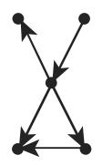
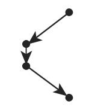

# 数学手册(原书第10版) 5.8.6 有向图中的路

《数学手册（原书第 10 版）》[[concepts/图论|图论算法]]章（5.8）的第六小节。节标题作「有向图中的路」，正文主用「链／有向链」术语（术语游移问题见 [[queries/闭链圈环道一句是否脱字与路链术语混乱]]）。全节四块内容：①弧序列分类体系；②有向图的连通与强连通；③[[entities/丹齐格算法|丹齐格算法]]（正权加权简单有向图上从固定顶点 v₁ 出发的最短有向链标号算法，输出[[concepts/距离树|距离树]]）；④图 5.61 十四顶点算例、单位权矩阵法注记与负权注记。转录文本存在系统性讹误，总汇见 [[queries/5-8-6全节系统性转写讹误清单]]。

## 1. 弧序列（原文重构，〔〕内为分析者标注的脱字）

- **链**：有向图中一个弧序列 $F=(e_1,e_2,\cdots,e_s)$ 称为一个长〔为 s〕的链，当且仅当〔**不**〕两次含有任何一条弧，并且每条弧 $e_i\ (i=2,3,\cdots,s-1)$ 的端点之一是 $e_{i-1}$ 的一个端点而另外一个是 $e_{i+1}$ 的一个端点。→ [[concepts/链]]
- **有向链**：一个链称作有向链，当且仅当对于 $i=1,2,\cdots,s-1$，弧 $e_i$ 的终点与 $e_{i+1}$ 的始点相重合。→ [[concepts/有向链]]
- **基本链／基本有向链**：遍历每个顶点至多一次的链或有向链分别称为基本链和基本有向链。→ [[concepts/基本链与基本有向链]]
- **圈／环道**：「闭链称为圈一条闭有向路，若它的每个顶点恰是两条弧的端点则称为环道」（原文一句连书，疑脱标点，「闭有向路」疑应为「闭有向链」）。→ [[concepts/圈]]、[[concepts/环道]]

图 5.60 以子图对照展示上述弧序列种类；转录中六幅子图仅对应五个紧邻标签，对应关系存疑，见 [[findings/弧序列种类与图5-60]] 与 [[comparisons/六种弧序列比较]]。

## 2. 连通图和强连通图

有向图〔G〕称为连通的，当且仅当对于任何两个顶点存在一条连接它们的链；图称为强连通的，当且仅当对于任何两个顶点 v,w 存在一条给定的连接它们的有向链（「给定的」措辞可疑）。→ [[concepts/连通与强连通]]

## 3. 丹齐格算法

设 $G=(V,E,f)$ 是一个加权简单有向图，并且对于每条弧 $e$，$f(e)>0$。原文算法流程（a)–d) 结构保留，衍字符已清理；原件讹误见 [[queries/5-8-6全节系统性转写讹误清单]]）：

```text
a) 顶点 v₁ 有标号 t(v₁) = 0；令 S₁ = {v₁}
b) 被加标号的顶点的集合是 S_m
c) 若 U_m = { e | e = (v_i, v_j) ∈ E, v_i ∈ S_m, v_j ∉ S_m } = ∅，则算法结束
d) 否则选取弧 e* = (x*, y*) 使得 t(x*) + f(e*) 极小；将 e* 和 y* 加标号，
   令 t(y*) = t(x*) + f(e*)，并令 S_{m+1} = S_m ∪ {y*}；
   重复 b)，其中 m := m + 1
```

手册断言（未给证明）：

- 若 G 的顶点 v 未被加标号，则不存在从 $v_1$ 到 v 的有向路；
- 若 v 有标号 t(v)，则 t(v) 是〔从 $v_1$ 到 v 的最短〕有向链的长；
- 在由被加标号的弧和顶点给出的树中可以找到从 $v_1$ 出发的最短有向路，即对于 $v_1$ 的距离树。

操作细节、$f(e)>0$ 的正确性意义与终止条件见 [[methodology/丹齐格算法流程]]。

**单位权情形**（原文重构）：「如果所有弧的权是 1，那么可以应用〔关联？〕矩阵（参见第 541〔页〕5.8.2.1, 4.）〔求〕出从顶点〔v〕到顶点 w 的最短有向链的长。」矩阵名疑为「邻接矩阵」之讹，且该句脱「页」「求」「v」等字，待核对 [[sources/10-数学手册原书第10版--10-582-无向图的遍历--nx1yky]] 中 5.8.2.1 第 4 点定谳，见 [[queries/5-8-6关联矩阵是否应为邻接矩阵]]。

**负权注记**（原文）：「注：在 $G=(V,E,f)$ 有带负权的弧的情形，还有一个修饰的〔疑为「修正的」〕求最短有向链的算法。」句子疑被截断，无任何细节，仅存目。

## 4. 图 5.61 算例

原图中加标号的弧和顶点表示图中对于 $v_1$ 的距离树。最短有向链的长（原文表）：

| 从 v₁ 到 | 长 | 从 v₁ 到 | 长 |
|---|---|---|---|
| v₃ | 2 | v₆ | 7 |
| v₇ | 3 | v₈ | 7 |
| v₉ | 3 | v₁₄ | 8 |
| v₂ | 4 | v₅ | 8 |
| v₁₀ | 5 | v₁₂ | 9 |
| v₄ | 6 | v₁₃ | 10 |
| v₁₁ | 6 | | |

13 个目标顶点连同 $v_1$ 共 14 个，与下标 $v_1$–$v_{14}$ 一致；长度序列 2,3,3,4,5,6,6,7,7,8,8,9,10 严格非降，与算法逐轮取极小、$f>0$ 的执行顺序内部一致；全量复算需从图像读取弧权，见 [[findings/图5-61距离树与最短链长度表]]。

## 与其他小节的联系

- **依赖 5.8.1 术语**：始点／终点（[[concepts/邻接性与端点]]）、加权图（[[concepts/加权图]]）、有向图（[[concepts/图与关联函数]]）。
- **引用 5.8.2.1 第 4 点**（[[sources/10-数学手册原书第10版--10-582-无向图的遍历--nx1yky]]）支撑单位权矩阵法，该依赖直接决定「关联矩阵／邻接矩阵」讹误的判定。
- **与 5.8.3 平行**：[[entities/丹齐格算法]] 与 [[entities/克鲁斯卡尔算法]] 同为贪心逐弧扩张、以树结构为输出的算法，对照见 [[comparisons/克鲁斯卡尔与丹齐格贪心算法比较]]；5.8.3 生成树证明中「去圈边」所用的「圈」在本节首次获得形式定义（[[concepts/圈]]）。
- **5.8.5 仍未入库**，见 [[queries/5-8-5未入库缺口]]。

<!-- llm-wiki:embedded-images -->
## Embedded Images

### Document







<!-- llm-wiki:embedded-images -->
