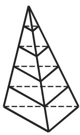
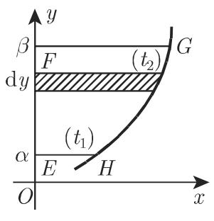
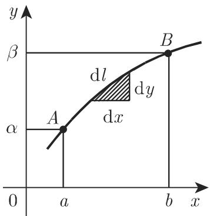
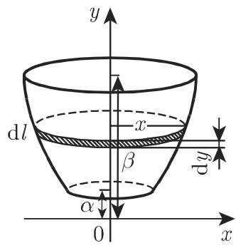
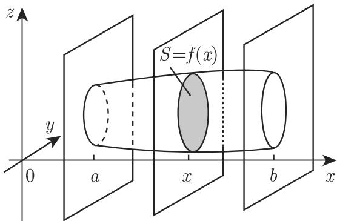
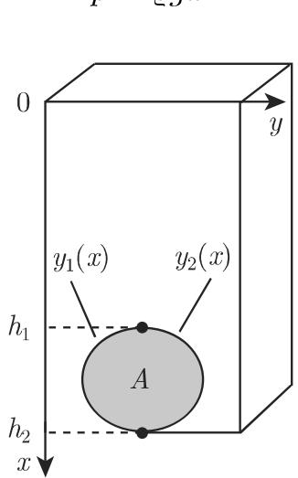
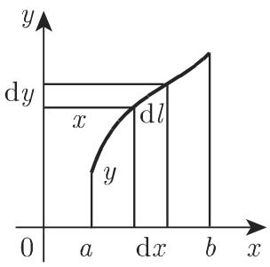
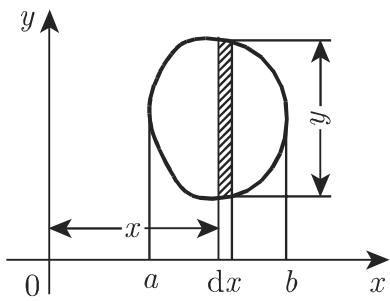
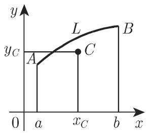
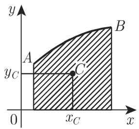

# 数学手册(原书第10版) 8.2.2 定积分的应用

《数学手册（原书第10版）》第 8 章 8.2.2 节，系统给出定积分在几何与力学物理中的应用公式组（式 8.58–8.75）。全部公式由统一框架 [[concepts/微元法]] 推导，配三个完整算例（棱锥体积、椭圆周长、旋转椭球体积），并命名两条原理：[[concepts/卡瓦列里原理]] 与 [[concepts/古尔丁法则]]。这是 8.2（定积分）章第一个入库的小节，上承已入库的 8.1 不定积分系列（见 [[sources/10-数学手册原书第10版--7-81-不定积分--1fcvveq]]）。

## 小节结构

- **8.2.2.1 定积分应用的一般原则**：微元法四步（式 8.58–8.59），棱锥体积示范算例（图 8.11）。
- **8.2.2.2 在几何中应用**：1. 平面图形的面积（式 8.60a–c，图 8.12）；2. 平面曲线的弧长（式 8.61a–d，图 8.13，椭圆周长算例）；3. 旋转体的表面积（式 8.62a–b，图 8.14，回指第一古尔丁法则）；4. 体积（式 8.63a–b、8.64a–b，图 8.15–8.17，卡瓦列里原理与旋转椭球算例）。
- **8.2.2.3 在力学与物理中应用**：1. 一点所走过的距离（式 8.65）；2. 做功（式 8.66）；3. 重力压力与侧压（式 8.67a–c，图 8.18）；4. 转动惯量（式 8.68–8.69，图 8.19）；5. 重心与古尔丁法则（式 8.70–8.75，图 8.20）。

## 公式组转录（式 8.58–8.75）

### 一般原则（8.2.2.1）

$$
A = a_1 + a_2 + \dots + a_n \tag{8.58}
$$

$$
A = \lim_{n\to\infty}\sum_{i=1}^{n}\tilde a_i = \lim_{n\to\infty}\sum_{i=1}^{n} f(x_i)\Delta x_i = \int_a^b f(x)\,\mathrm{d}x \tag{8.59}
$$

其中对每个 $i$ 有 $\Delta x_i\geqslant 0$；$\tilde a_i$ 为 $a_i$ 的可积等价替代量，误差 $\alpha_i = a_i - \tilde a_i$ 是高阶无穷小。

### 几何应用（8.2.2.2）

面积（[[concepts/曲边梯形与曲边扇形的面积]]）：

$$
S_{ABCD} = \int_a^b f(x)\,\mathrm{d}x = \int_{t_1}^{t_2} y(t)\,x'(t)\,\mathrm{d}t \tag{8.60a}
$$

$$
S_{EFGH} = \int_\alpha^\beta g(y)\,\mathrm{d}y = \int_{t_1}^{t_2} x(t)\,y'(t)\,\mathrm{d}t \tag{8.60b}
$$

$$
S_{OKL} = \frac{1}{2}\int_{\varphi_1}^{\varphi_2}\rho^2\,\mathrm{d}\varphi \tag{8.60c}
$$

弧长（[[concepts/弧长与弧微分]]）：

$$
L_{\widehat{AB}} = \int_a^b\sqrt{1+[f'(x)]^2}\,\mathrm{d}x = \int_\alpha^\beta\sqrt{[g'(y)]^2+1}\,\mathrm{d}y = \int_{t_1}^{t_2}\sqrt{[x'(t)]^2+[y'(t)]^2}\,\mathrm{d}t \tag{8.61a}
$$

$$
L = \int\mathrm{d}l,\quad \mathrm{d}l^2 = \mathrm{d}x^2+\mathrm{d}y^2 \tag{8.61b}
$$

$$
L_{\widehat{CD}} = \int_{\varphi_1}^{\varphi_2}\sqrt{\rho^2+\left(\frac{\mathrm{d}\rho}{\mathrm{d}\varphi}\right)^2}\,\mathrm{d}\varphi \tag{8.61c}
$$

$$
L = \int\mathrm{d}l,\quad \mathrm{d}l^2 = \rho^2\,\mathrm{d}\varphi^2+\mathrm{d}\rho^2 \tag{8.61d}
$$

旋转曲面面积（[[concepts/旋转曲面的面积]]）：

$$
S = 2\pi\int_a^b y\,\mathrm{d}l = 2\pi\int_a^b y(x)\sqrt{1+\left(\frac{\mathrm{d}y}{\mathrm{d}x}\right)^2}\,\mathrm{d}x \tag{8.62a}
$$

$$
S = 2\pi\int_\alpha^\beta x\,\mathrm{d}l = 2\pi\int_\alpha^\beta x(y)\sqrt{1+\left(\frac{\mathrm{d}x}{\mathrm{d}y}\right)^2}\,\mathrm{d}y \tag{8.62b}
$$

体积（[[concepts/旋转体与截面立体的体积]]）：

$$
V = \pi\int_a^b y^2\,\mathrm{d}x \tag{8.63a}
$$

$$
V = \pi\int_\alpha^\beta x^2\,\mathrm{d}y \tag{8.63b}
$$

$$
V = \int_a^b f(x)\,\mathrm{d}x \quad (f(x)\ \text{为截面面积}) \tag{8.64a}
$$

卡瓦列里原理（[[concepts/卡瓦列里原理]]）：

$$
\overline{V} = \int_a^b\overline{f}(x)\,\mathrm{d}x = V \tag{8.64b}
$$

### 力学与物理应用（8.2.2.3）

（[[concepts/定积分的力学与物理应用]]、[[concepts/转动惯量的积分公式]]、[[concepts/重心的积分公式]]、[[concepts/古尔丁法则]]）

$$
s = \int_{t_0}^{T} v\,\mathrm{d}t \tag{8.65}
$$

$$
W = \int_a^b f(x)\,\mathrm{d}x \tag{8.66}
$$

$$
p = \varrho gx \tag{8.67a}
$$

$$
\mathrm{d}F = \varrho gx\,\mathrm{d}A = \varrho gx\,y(x)\,\mathrm{d}x \tag{8.67b}
$$

$$
p_s = \frac{\varrho g}{A}\int_{h_1}^{h_2} x\,(y_2(x)-y_1(x))\,\mathrm{d}x = \varrho g\,x_C \tag{8.67c}
$$

$$
I_y = \varrho\int_a^b x^2\,\mathrm{d}l = \varrho\int_a^b x^2\sqrt{1+(y')^2}\,\mathrm{d}x \tag{8.68}
$$

$$
I_y = \varrho\int_a^b x^2 y\,\mathrm{d}x \tag{8.69}
$$

$$
x_C = \frac{\int_a^b x\sqrt{1+(y')^2}\,\mathrm{d}x}{L},\qquad y_C = \frac{\int_a^b y\sqrt{1+(y')^2}\,\mathrm{d}x}{L} \tag{8.70}
$$

$$
x_C = \frac{\int_a^b x\left(\sqrt{1+(y_1')^2}+\sqrt{1+(y_2')^2}\right)\mathrm{d}x}{L},\qquad y_C = \frac{\int_a^b\left(y_1\sqrt{1+(y_1')^2}+y_2\sqrt{1+(y_2')^2}\right)\mathrm{d}x}{L} \tag{8.71}
$$

$$
S_{\mathrm{rot}} = L\cdot 2\pi r_C \tag{8.72}
$$

$$
x_C = \frac{\int_a^b xy\,\mathrm{d}x}{S},\qquad y_C = \frac{\frac{1}{2}\int_a^b y^2\,\mathrm{d}x}{S} \tag{8.73}
$$

$$
x_C = \frac{\int_a^b x(y_1-y_2)\,\mathrm{d}x}{S},\qquad y_C = \frac{\frac{1}{2}\int_a^b (y_1^2-y_2^2)\,\mathrm{d}x}{S} \tag{8.74}
$$

$$
V_{\mathrm{rot}} = S\cdot 2\pi r_C \tag{8.75}
$$

## 三个算例（均已独立复算）

1. **棱锥体积**（图 8.11）：由截面相似 $S_i : S = h_i^2 : H^2$ 得 $\tilde v_i = \frac{Sh_i^2}{H^2}\Delta h_i$，故 $V = \int_0^H\frac{Sh^2}{H^2}\mathrm{d}h = \frac{SH}{3}$。复算通过（[[findings/式8-58至8-59微元法原则与棱锥体积复算]]）。
2. **椭圆周长**（图 8.13）：代换 $x=a\sin t,\ y=b\cos t$，第一象限 $t\in[0,\pi/2]$，周长 $L = 4aE(e)$，$e=\sqrt{a^2-b^2}/a$，值查表 21.9。原文该行右端作 "$aE(k,\pi/2)$"，疑脱漏因子 4；积分下限 $\Omega$ 为转写讹误（应为 0）。见 [[findings/式8-61弧长四式与椭圆周长复算]]、[[queries/椭圆周长是否脱漏因子4]]。
3. **旋转椭球体积**（图 8.16，$a=c$，绕 y 轴）：截面 $S = f(y) = \pi z^2 = \pi c^2(1-y^2/b^2)$，$V = 2\pi c^2\int_0^b(1-y^2/b^2)\mathrm{d}y = \frac{4}{3}\pi bc^2$。复算通过（[[findings/式8-62至8-64旋转曲面与体积公式及椭球复算]]）。

## 公式网络的互洽性

- 式 8.72（第一古尔丁法则）= 式 8.62a + 式 8.70：$2\pi\int y\,\mathrm{d}l = 2\pi y_C L$。
- 式 8.75（第二古尔丁法则）= 式 8.63a + 式 8.73：$\pi\int y^2\mathrm{d}x = 2\pi y_C S$。
- 式 8.67c（平均侧压）= 式 8.67b + 式 8.74：$p_s = \varrho g x_C$。

互洽性为整组转录公式的正确性提供强佐证；唯一例外是椭圆周长行的因子 4 疑点。

## 回指关系与缺口

- **表 21.9**：椭圆周长例 "$E(k,\pi/2)$ 的值可查表 21.9（参见第 653 页 8.1.4.3）"，模数 $k=e$。这补上了 [[queries/表21-9与8-2-2-2及14-6-1未入库回指缺口]] 的 8.2.2.2 一侧（14.6.1 一侧仍悬置），并为 [[queries/E0-74-1-3238与表21-9-3索引约定问题]] 补充模数索引（勒让德形式）证据。表体见 [[entities/表21-9椭圆积分值表]]（占位）。
- **前向引用未入库**：8.3（第 684 页）、8.4.1（第 694 页）、8.4.1.3（第 699 页）、8.5.1.3（第 709 页）、表 8.9（第 700 页）、表 8.10（第 705 页）、式 8.130（第 692 页）、21.2（第 1368 页）、3.5.3.13（第 302 页，式 3.412）——见 [[queries/表8-9与表8-10及前向引用未入库缺口]]。
- **8.2.1**（定积分的定义与性质）尚无 source 页，8.2 章推导基础待补。
- **转写质量**：全节存在系统性讹误（"千/于"混讹、变量符号脱漏、页码与式号粘连等），集中记录于 [[queries/8-2-2全节系统性转写讹误清单]]，不影响数学判定。

## 相关页面

- 概念：[[concepts/微元法]]、[[concepts/曲边梯形与曲边扇形的面积]]、[[concepts/弧长与弧微分]]、[[concepts/旋转曲面的面积]]、[[concepts/旋转体与截面立体的体积]]、[[concepts/卡瓦列里原理]]、[[concepts/古尔丁法则]]、[[concepts/重心的积分公式]]、[[concepts/转动惯量的积分公式]]、[[concepts/定积分的力学与物理应用]]
- 方法论：[[methodology/微元法建模四步流程]]
- 比较：[[comparisons/椭圆周长两途径比较]]、[[comparisons/重心公式四情形比较]]

<!-- llm-wiki:embedded-images -->
## Embedded Images

### Document

<!-- llm-wiki:embedded-images -->
