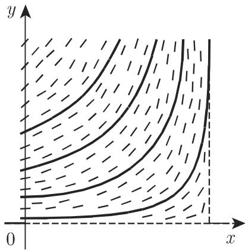
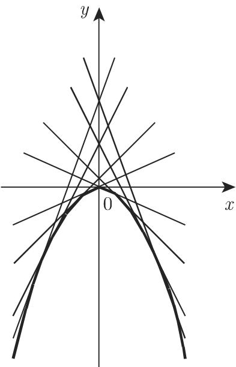
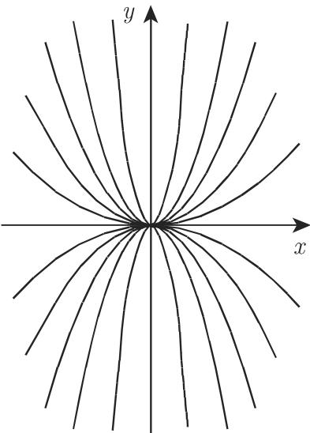
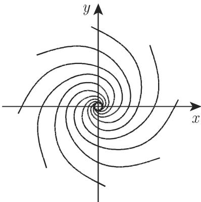
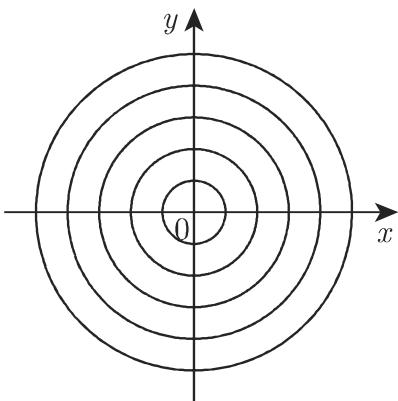
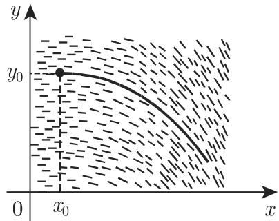

# 数学手册(原书第10版) 9.1.1 一阶微分方程

本源是《数学手册(原书第10版)》第 9 章「微分方程」的开篇小节 9.1.1「一阶微分方程」，全节按「存在唯一性 → 七类精确解法 → 隐式方程参数解 → 奇异解与奇点 → 近似解法」组织，构成手册常微分方程部分的方法论总纲。本 wiki 已成体系地入库同书第 8 章积分各小节，本源是序列向第 9 章的自然推进，亦为第 9 章首个入库小节。

## 内容结构与对应页面

| 原书小节 | 主题 | 对应页面 |
|---|---|---|
| 9.1.1.1 | 柯西存在性定理、利普希茨条件、方向场、铅垂方向、通解与特解 | [[一阶微分方程]]、[[方向场与积分曲线]] |
| 9.1.1.2 | 七类求解方法：分离变量、齐次、恰当、积分因子、一阶线性、伯努利、里卡蒂 | [[分离变量法]]、[[齐次微分方程]]、[[恰当微分方程]]、[[积分因子]]、[[一阶线性微分方程]]、[[伯努利微分方程]]、[[里卡蒂微分方程]] |
| 9.1.1.3 | 隐式方程参数解法、拉格朗日方程、克莱罗方程 | [[隐式微分方程的参数解法]] |
| 9.1.1.4 | 奇异元素、奇异积分、奇点六类分类、近似方程奇点保持 | [[奇异解奇异元素与奇异积分]]、[[微分方程的奇点及其分类]] |
| 9.1.1.5 | 皮卡逐次逼近、级数解、图解法、数值解（指向 19.4） | [[皮卡逐次逼近法]]、[[微分方程的级数解法]] |

方法选用的决策树见 [[一阶微分方程解法选择流程]]。

## 核心定义式（逐字转录，编号沿用原文）

$$y'=f(x,y)\tag{9.2}$$
$$|f(x,y_1)-f(x,y_2)|\leqslant N|y_1-y_2|\tag{9.3}$$
$$\int\frac{M(x)}{P(x)}\,\mathrm{d}x+\int\frac{Q(y)}{N(y)}\,\mathrm{d}y=C\tag{9.7}$$
$$\frac{\partial M}{\partial y}=\frac{\partial N}{\partial x}\tag{9.9c}$$
$$\Phi(x,y)=\int_{x_0}^{x}M(\xi,y)\,\mathrm{d}\xi+\int_{y_0}^{y}N(x_0,\eta)\,\mathrm{d}\eta\tag{9.9e}$$
$$N\frac{\partial\ln\mu}{\partial x}-M\frac{\partial\ln\mu}{\partial y}=\frac{\partial M}{\partial y}-\frac{\partial N}{\partial x}\tag{9.10b}$$
$$y'+P(x)y=Q(x)y^n\quad(n\neq0,\ n\neq1)\tag{9.12}$$
$$y'=P(x)y^2+Q(x)y+R(x)\tag{9.13a}$$
$$z'+2u_1(x)z-1=0\tag{9.13f（转录原文，符号存疑）}$$
$$Pv''-(P'+PQ)v'+P^2Rv=0\tag{9.13h}$$
$$y=Cx+f(C),\qquad 0=x+f'(C)\tag{9.16c,\ 9.16e}$$
$$\lambda^2-(b+c)\lambda+bc-ae=0\tag{9.18d}$$
$$y=y_0+\int_{x_0}^{x}f(x,y)\,\mathrm{d}x\tag{9.20b}$$

## 算例独立复算结果

全节 12 个算例经独立重推，**全部通过**（详见各发现页）：

| 算例（归属方法） | 方程 | 书中结果 | 复算 |
|---|---|---|---|
| 分离变量 | $x\,\mathrm{d}y+y\,\mathrm{d}x=0$ | $yx=c$；$c=0$ 时 $y\equiv0$、$x\equiv0$ 为奇异解 | ✓ |
| 齐次方程 | $x(x-y)y'+y^2=0$ | $y=c\,e^{y/x}$；$x=0$ 亦为积分曲线 | ✓ |
| 积分因子 | $(x^2+y)\mathrm{d}x-x\,\mathrm{d}y=0$ | $\mu=1/x^2$，$x-y/x=C_1$ | ✓（$\Phi=x-y/x-1$） |
| 一阶线性 | $y'-y\tan x=\cos x,\ y(0)=0$ | $y=\frac{\sin x}{2}+\frac{x}{2\cos x}$ | ✓ |
| 伯努利 | $y'-\frac{4y}{x}=x\sqrt{y}$ | $y=x^4\left(\tfrac12\ln\|x\|+C\right)^2$ | ✓ |
| 里卡蒂·方法 1 | $y'+y^2+\frac{y}{x}-\frac{4}{x^2}=0$ | $u'=u^2-\frac{15}{4x^2}$；$u_1=\frac{3}{2x}$；$z=-\frac x4+\frac K{x^3}$；$y=\frac{2x^4+2C}{x^5-Cx}$ | ✓ |
| 里卡蒂·方法 2 | 同上 | $x^2v''+xv'-4v=0$，$v=C_1x^2+C_2x^{-2}$ | ✓（含常数重标记，见「矛盾与存疑」3） |
| 隐式方程 | $x=yy'+y'^2$ | $y=-p+\frac{C+\arcsin p}{\sqrt{1-p^2}}$ | ✓（参数式 $x(p)$ 转写脱漏，应为 $x=\frac{p(C+\arcsin p)}{\sqrt{1-p^2}}$） |
| 克莱罗 | $y=xy'+y'^2$ | 通解 $y=Cx+C^2$；奇异解 $x^2+4y=0$ | ✓ |
| 奇异积分 | $x-y-\frac49y'^2+\frac{8}{27}y'^3=0$ | $x-y=0$ 非解；$x-y=\frac{4}{27}$ 为奇异解；通解 $(y-C)^2=(x-C)^3$ | ✓（包络消元 $t=4/9$ 复核一致） |
| 皮卡迭代 | $y'=e^x-y^2,\ y(0)=0$ | $y_1=e^x-1$；$y_2=3e^x-\tfrac12e^{2x}-x-\tfrac52$ | ✓ |
| 级数解（两法） | 同上 | $y=x+\frac{x^2}{2}-\frac{x^3}{6}-\frac{5x^4}{24}+\cdots$ | ✓（且 $y_2$ 泰勒展开与之逐项一致） |

对应发现页：[[式9-2至9-5存在唯一性与方向场逐字转录]]、[[式9-6至9-8分离变量与齐次方程算例复算]]、[[式9-9至9-10恰当方程与积分因子算例复算]]、[[式9-11至9-12线性与伯努利方程算例复算]]、[[式9-13里卡蒂方程两方法算例复算]]、[[式9-14至9-16隐式拉格朗日与克莱罗算例复算]]、[[式9-17奇异积分算例复算]]、[[式9-18至9-19奇点分类六算例复算]]、[[式9-20至9-21皮卡迭代与级数解法复算]]。

奇点六类分类（分支点、结点、射线点、鞍点、螺线点/焦点、中心点/中心）的完整算例表见 [[奇点六种类型比较]]。

## 与已有 wiki 的衔接（跨章实锚点）

- **式 9.9e 明文引用「第 692 页 8.3.4.4（式 8.132）」**：恰当微分方程的势函数 $\Phi$ 构造就是已入库 [[原函数折线构造法]] 的直接应用（参见 [[式8-131至8-133原函数折线构造与两算例复算]]），并与 [[线积分与积分路径无关]] 的理论同源。这是第 9 章对第 8 章 8.3 内容的第一个明确下游应用，应双向回链。
- **式 9.9c 把恰当性充要条件陈述在「连通域」上**（标准定理需单连通域），为 [[单连通前提与例A去心平面的失效边界]] 增添新证据，见 [[式9-9c是连通域还是单连通域]]。
- **9.1.1.5.3 的方向场折线图解法**是第 8 章 [[图形积分法]]（8.2.1）在常微分方程中的类比。

## 矛盾与存疑

1. **式 9.13f 内部符号矛盾（最重要）**：正文 $z'+2u_1z-1=0$，算例用 $z'+\frac3x z+1=0$；独立推导支持 $+1$。见 [[式9-13f常数项符号是减1还是加1]]。
2. **式 9.13b 的 $\beta(x)$ 选取条件缺失**：消一次项要求 $2P\beta+Q+P'/P=0$（算例 $\beta=-\frac{1}{2x}$ 恰符合），转录未给出该方程。见 [[式9-13b的beta选取条件是否原文给出]]。
3. **里卡蒂方法 2 的常数重标记**：取 $C_2=-1$ 直接计算得 $y=\frac{2C_1x^4+2}{C_1x^5-x}$，书中写 $y=\frac{2x^4+2C_1}{x^5-C_1x}$，仅在对 $C_1\to1/C_1$ 重标记后成立，文中未说明。
4. **式 9.9c「连通域」vs 单连通域**：疑为译文弱化，见 [[式9-9c是连通域还是单连通域]]。
5. **奇点术语张力**：本书以「分支点（branch point）」称实同号不等根情形（通行教材多归入「结点」类），「射线点（ray point）」亦非常用译名；相关页面保留原书用语并加注记，未静默改译。
6. **式 9.11e 表述宽松**：称两个特解「线性无关」（引 9.1.2.3），对一阶非齐次方程该说法欠严格，但公式 $y=y_1+C(y_2-y_1)$ 本身正确。
7. **转写脱漏密集**：系统性 OCR 讹误（千/于、儿/几、心/①、＠/②、g.4/9.4、O/0 及 $G,C,N,n$、页码等符号脱漏），与 8.x 各节同模式，见 [[9-1-1全节系统性转写讹误清单]]；隐式算例 $x(p)$ 整段丢失，见 [[隐式算例参数式x-p是否原文给出]]。另公式编号从 (9.2) 起，(9.1) 应在本章开篇（未含于本文件）。

## 证据强度

全部数学内容为标准教科书结论，书内未给证明（陈述性强）；但 12 个算例与奇点六算例经独立复算全部一致，属高置信直接证据。弱项集中在**转写保真度**而非数学正确性。

## 插图资产（11 幅）

方向场（图 9.1）、存在唯一性（图 9.2）、克莱罗包络（图 9.3）、奇异积分 ①②（图 9.4）、六种奇点相图（图 9.5–9.10）、图解折线（图 9.11），媒体文件位于 `media/10-数学手册原书第10版--10-911-一阶微分方程--zklkjc/`，已在对应概念页引用。

## 人物冠名

柯西（Cauchy）、利普希茨（Lipschitz）、皮卡（Picard）、林德勒夫（Lindelöf）、伯努利（Bernoulli）、里卡蒂（Riccati）、拉格朗日（Lagrange）、克莱罗（Clairaut）均仅以定理/方程冠名形式出现，无生平叙述，不单独建页，其贡献归入对应概念页。

## 未入库回指

见 [[9-1-1未入库回指缺口]]：2.18.2.5、6.2.2.1、3.6.1.7、7.88、7.3.3.3、2.2.1、12.2.2.4、19.1.1、19.4、9.1.2.3、9.1.2.6、第 737 页欧拉微分方程等。

<!-- llm-wiki:embedded-images -->
## Embedded Images

### Document

<!-- llm-wiki:embedded-images -->
