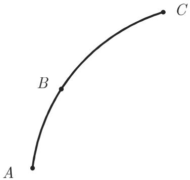
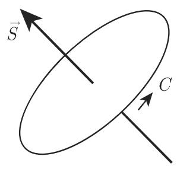
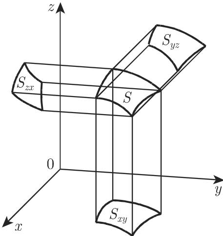

# 数学手册(原书第10版) 13.3 向量场中的积分

本节是《数学手册（原书第10版）》第 13 章“向量场理论”的第三节，承接 [[sources/10-数学手册原书第10版--11-132-空间的微分算子--10s6yfu]] 的微分算子理论，系统建立向量场中的积分理论。核心脉络为：以正交坐标系的线元、面元、体积元（表 13.4）为计算基础，用黎曼型和式极限定义线积分与面积分，给出保守场（位势场）的积分论刻画，最后给出高斯积分定理、高斯积分公式、扇形公式、斯托克斯积分定理与格林积分定理，并配六个全部复算通过的算例。

## 章节结构

- **表 13.4**：笛卡儿、柱面、球面坐标系中的 $\mathrm{d}\vec r$、$\mathrm{d}\vec S$、$\mathrm{d}V^*$ 与基向量关系（详见 [[线元面元与体积元]]）。
- **13.3.1 向量场中的线积分和位势**：线积分定义与五步构造（13.99a/b）、力学解释（功）、性质（13.100–13.103）、笛卡儿形式（13.104）、周线积分（13.105）；保守场定义、零周线积分（13.106）、无旋性（13.107）、可积性条件（13.108）、位势函数及其计算（13.109–13.112）。详见 [[向量场的线积分]]、[[保守场与位势]]。
- **13.3.2 面积分**：平面片向量与曲面定向（右手定律）、面积分五步计算、三种场流（13.113–13.115）、笛卡儿第二型面积分（13.116–13.119）与例 A/B/C。详见 [[面积分与三种场流]]。
- **13.3.3 积分定理**：高斯积分定理（13.120a/b）、平面高斯积分公式（13.121）、扇形公式（13.122）、斯托克斯积分定理（13.123a/b）、格林积分定理（13.124–13.127）与定理例 A/B/C（含热导方程推导）。详见 [[高斯积分定理]]、[[斯托克斯积分定理]]、[[格林积分定理]]、[[热传导方程]]。

## 表 13.4（原文逐字转录）

> 转写中表题“表 13.4”被误作节号“13.4”；⚠️ 标记处为发现的疑似讹误（见下文“复算与讹误”）。

| | 笛卡儿坐标系 | 柱面坐标系 | 球面坐标系 |
|---|---|---|---|
| $\mathrm{d}\vec{r}$ | $\vec{\mathrm{e}}_{x}\mathrm{d}x + \vec{\mathrm{e}}_{y}\mathrm{d}y + \vec{\mathrm{e}}_{z}\mathrm{d}z$ | $\vec{\mathrm{e}}_{\rho}\mathrm{d}\rho + \vec{\mathrm{e}}_{\varphi}\rho\mathrm{d}\varphi + \vec{\mathrm{e}}_{z}\mathrm{d}z$ | $\vec{\mathrm{e}}_{r}\mathrm{d}r + \vec{\mathrm{e}}_{\vartheta}r\mathrm{d}\vartheta + \vec{\mathrm{e}}_{\varphi}r\sin\vartheta\mathrm{d}\varphi$ |
| $\mathrm{d}\vec{S}$ | $\vec{\mathrm{e}}_{x}\mathrm{d}y\mathrm{d}z + \vec{\mathrm{e}}_{y}\mathrm{d}x\mathrm{d}z + \vec{\mathrm{e}}_{z}\mathrm{d}x\mathrm{d}y$ | $\vec{\mathrm{e}}_{\rho}\rho\mathrm{d}\varphi\mathrm{d}z + \vec{\mathrm{e}}_{\varphi}\mathrm{d}\rho\mathrm{d}z + \vec{\mathrm{e}}_{z}\rho\mathrm{d}\rho\mathrm{d}\varphi$ | $\vec{\mathrm{e}}_{r}r^{2}\sin\vartheta\mathrm{d}\vartheta\mathrm{d}\varphi + \vec{\mathrm{e}}_{\vartheta}r\sin\vartheta\mathrm{d}r\mathrm{d}\varphi + \vec{\mathrm{e}}_{\varphi}r\mathrm{d}r\mathrm{d}\vartheta\mathrm{d}\varphi$ ⚠️ |
| $\mathrm{d}V^{*}$ | $\mathrm{d}X\mathrm{d}Y\mathrm{d}Z$ ⚠️ | $\rho\mathrm{d}\rho\mathrm{d}\varphi\mathrm{d}Z$ ⚠️ | $r^{2}\sin\vartheta\mathrm{d}r\mathrm{d}\vartheta\mathrm{d}\varphi$ |
| 基向量叉积 | $\vec{\mathrm{e}}_{x} = \vec{\mathrm{e}}_{y} \times \vec{\mathrm{e}}_{z}$，$\vec{\mathrm{e}}_{y} = \vec{\mathrm{e}}_{z} \times \vec{\mathrm{e}}_{x}$，$\vec{\mathrm{e}}_{z} = \vec{\mathrm{e}}_{x} \times \vec{\mathrm{e}}_{y}$ | $\vec{\mathrm{e}}_{\rho} = \vec{\mathrm{e}}_{\varphi} \times \vec{\mathrm{e}}_{z}$，$\vec{\mathrm{e}}_{\varphi} = \vec{\mathrm{e}}_{z} \times \vec{\mathrm{e}}_{\rho}$，$\vec{\mathrm{e}}_{z} = \vec{\mathrm{e}}_{\rho} \times \vec{\mathrm{e}}_{\varphi}$ | $\vec{\mathrm{e}}_{r} = \vec{\mathrm{e}}_{\vartheta} \times \vec{\mathrm{e}}_{\varphi}$，$\vec{\mathrm{e}}_{\vartheta} = \vec{\mathrm{e}}_{\varphi} \times \vec{\mathrm{e}}_{r}$，$\vec{\mathrm{e}}_{\varphi} = \vec{\mathrm{e}}_{r} \times \vec{\mathrm{e}}_{\vartheta}$ |
| 正交归一 | $\vec{\mathrm{e}}_{i} \cdot \vec{\mathrm{e}}_{j} = \begin{cases} 0, & i \neq j\\ 1, & i = j \end{cases}$ | 同左 | 同左 |

脚注（原文）：\* 这里用 $V^*$ 表示体积是为了避免与向量函数的绝对值 $|\vec V|=V$ 混淆（转写中符号 $V^*$ 丢失）；\*\* 指标 $j$（疑应为 $i,j$）代替 $x,y,z$ 或 $\rho,\varphi,z$ 或 $r,\vartheta,\varphi$（译者注）。

## 核心公式速览（保留原书式号）

- 线积分：$P=\int_{\widehat{AB}}\vec V(\vec r)\cdot\mathrm{d}\vec r$（13.99a），五步和式极限定义（13.99b）；可加性（13.100）、反向变号（13.101）、和场线性（13.102–13.103）、笛卡儿形式（13.104）、周线积分 $P=\oint_C\vec V\cdot\mathrm{d}\vec r$（13.105）。
- 保守场：$\oint_C\vec V\cdot\mathrm{d}\vec r=0$（13.106）；$\operatorname{rot}\vec V=\vec 0$（13.107，逆命题需偏导连续＋单连通域）；可积性条件 $\partial V_x/\partial y=\partial V_y/\partial x$ 等三式（13.108）。
- 位势：$U(\vec r)=\int_{\vec r_0}^{\vec r}\vec V\cdot\mathrm{d}\vec r$（13.109a/b）；物理约定 $U^*(\vec r)=-U(\vec r)$（13.110）；全微分（13.111a）与方程组（13.111b）；折线法（13.112）。
- 三种场流：$\vec P=\int_S U\,\mathrm{d}\vec S$（13.113）、$Q=\int_S\vec V\cdot\mathrm{d}\vec S$（13.114）、$\vec R=\int_S\vec V\times\mathrm{d}\vec S$（13.115）；笛卡儿第二型面积分（13.116–13.118）；闭曲面记号（13.119）。
- 高斯积分定理：$\oiint_S\vec V\cdot\mathrm{d}\vec S=\iiint_v\operatorname{div}\vec V\,\mathrm{d}v$（13.120a/b）；平面高斯积分公式（13.121）；扇形公式 $F=\tfrac12\oint_C(x\,\mathrm{d}y-y\,\mathrm{d}x)$（13.122）。
- 斯托克斯积分定理：$\iint_S\operatorname{rot}\vec V\cdot\mathrm{d}\vec S=\oint_C\vec V\cdot\mathrm{d}\vec r$（13.123a/b）。
- 格林积分定理：(13.124)(13.125) 两个体—面积分恒等式，特例 (13.126)，笛卡儿形式 (13.127)；由 $\vec V=U_1\operatorname{grad}U_2$ 代入高斯定理而得。

## 六个算例（全部复算通过）

| 算例 | 内容 | 结果 |
|---|---|---|
| 13.3.2.4 例 A | $\vec P=\int_S xyz\,\mathrm{d}\vec S$，$S$ 为 $x+y+z=1$ 与三坐标平面所围平面区域（向上为正） | $\vec P=\tfrac{1}{120}(\vec i+\vec j+\vec k)$ |
| 13.3.2.4 例 B | $Q=\int_S\vec r\cdot\mathrm{d}\vec S$（同一 $S$） | $Q=\tfrac12$ |
| 13.3.2.4 例 C | $\vec R=\int_S\vec r\times\mathrm{d}\vec S$（同一 $S$） | $\vec R=\vec 0$ |
| 13.3.3 例 A | 斯托克斯：$I=\oint_C(x^2y^3\,\mathrm{d}x+\mathrm{d}y+z\,\mathrm{d}z)$，$C$ 为圆柱 $x^2+y^2=a^2$ 与平面 $z=0$ 的交线 | $I=-\tfrac{a^6}{8}\pi$ |
| 13.3.3 例 B | 高斯：$\vec V=x^3\vec i+y^3\vec j+z^3\vec k$ 通过球面 $x^2+y^2+z^2=a^2$ 的通量 | $I=\tfrac{12}{5}a^5\pi$ |
| 13.3.3 例 C | 热导方程推导（无热源区域热平衡） | $c\varrho\,\partial T/\partial t=\operatorname{div}(\lambda\operatorname{grad}T)$，均匀介质化为 $\partial T/\partial t=a^2\triangle T$ |

## 复算与讹误

全部公式经独立推导复核，见 [[表13-4线元面元体积元转录复算]]、[[式13-99至13-112线积分保守场与位势转录复算]]、[[式13-113至13-119三种场流与第二型面积分转录复算]]、[[式13-120至13-127高斯斯托克斯格林积分定理转录复算]]。

两处实质讹误：

1. 表 13.4 球面 $\mathrm{d}\vec S$ 的 $\vec{\mathrm{e}}_\varphi$ 分量 $r\,\mathrm{d}r\,\mathrm{d}\vartheta\,\mathrm{d}\varphi$ 含三个微分元，量纲不符，应为 $r\,\mathrm{d}r\,\mathrm{d}\vartheta$（[[表13-4球面dS的eφ分量疑多dφ]]）。
2. 例 C 结果式中"$c\lambda\,\partial T/\partial t$"由推导链应为"$c\varrho\,\partial T/\partial t$"（[[热导方程例中cλ疑为cρ]]）；另 $a^2$ 未定义（[[热导方程a²未定义]]）。

其余为系统性转写噪声（“于”误作“千”、行内符号丢失、杂字等），见 [[13-3全节系统性转写讹误清单]]；未入库回指见 [[13-3未入库回指缺口]]。

## 与既有维基的联系

- [[concepts/无旋场]]（13.2.5）：本节给出积分论对偶刻画（路径无关 ⟺ 零周线积分 ⟺ 无旋），并明确逆命题的充分性条件（偏导连续＋单连通域）。
- [[concepts/向量场的散度]]：高斯积分定理 (13.120) 使散度获得通量意义。
- [[concepts/旋度]]：斯托克斯积分定理 (13.123) 使旋度获得环流意义；(13.108) 即 $\operatorname{rot}\vec V=\vec 0$ 的分量形式。
- [[concepts/梯度]]：(13.111b) 给出 $\vec V=\operatorname{grad}U$ 与位势的双向关系。
- [[concepts/向量曲面元]]（13.2.1）：13.3.2.2 回指 (13.33a) 构造 $\Delta\vec S_i$，并补充闭曲面外法向定向约定。
- [[methodology/体积导数三步构造流程]]：线积分、面积分均为同构的五步黎曼型构造（见 [[线积分与面积分构造流程比较]]）。

## 术语与记号张力

- 命名：手册称 (13.121) 为“高斯积分公式”（中文教材惯例多称“格林公式”），称 (13.124)(13.125) 为“格林积分定理”，见 [[平面高斯积分公式与格林公式命名问题]]。
- 术语：13.3.2.3 用“场流”、13.3.3 例 B 用“通量”；“热导方程”即通行术语“热传导方程”；“周线积分”即常见的“回路积分/环量”。
- 记号：体积记号 $V^*$（表 13.4 脚注）、“体积 $\vec V$”（13.3.3.1，误带箭头）与积分限 $v$ 三处不一致。

## 插图（media/10-数学手册原书第10版--11-133-向量场中的积分--1ekl882/）

图 13.13 路径分割（001-51f26961….jpg）、图 13.14 路径可加性（002-99ee5e94….jpg）、图 13.15 位势折线路径（003-471b67d8….jpg）、图 13.16(a)(b)(c) 平面片向量与定向（004–006）、图 13.17 曲面分割（007-e0060b90….jpg）、图 13.18 坐标平面投影（008-a577a5b8….jpg）。

<!-- llm-wiki:embedded-images -->
## Embedded Images

### Document

<!-- llm-wiki:embedded-images -->
