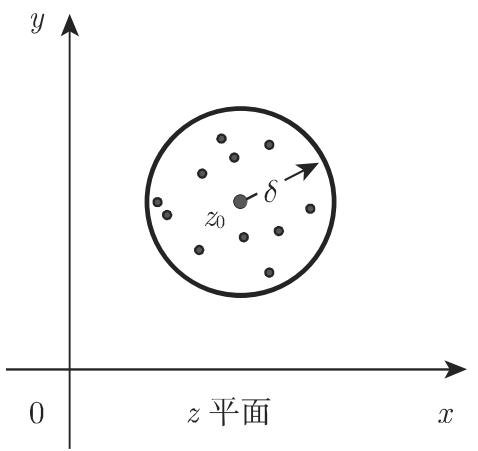

# 数学手册(原书第10版) 14.1.1 连续性、可微性

## 内容定位

本小节是《数学手册(原书第10版)》第 14 章（复变函数）的首个入库小节，建立「复函数定义 → 极限 → 连续 → 可微」的完整定义链。原书声明：复函数的极限、连续性和导数概念「可以与实变量的实函数那样类似地定义」，但可微性额外附加差商极限的**路径无关性**条件——这是本节最核心的概念，也是后续 Cauchy–Riemann 方程与解析函数理论的种子。此前 wiki 已完成第 12 章（至 12.9）与第 13 章（13.1–13.4）的系统性入库，本节为第 14 章开篇，与既有页面无重叠。

## 小节结构

- **14.1.1.1 复函数的定义**：对 $z=x+\mathrm{i}y$ 指定复数 $w=u+\mathrm{i}v$，其中 $u(x,y),v(x,y)$ 是两个实变量 $x,y$ 的实函数；记为 $w=f(z)$，即从复数 $z$ 平面到复数 $w$ 平面的映射。见 [[concepts/复函数]]。
- **14.1.1.2 复函数的极限**：$\varepsilon$-$\delta$ 圆盘定义（式 14.1a–14.1c）；几何意义为以 $z_0$ 为圆心、$\delta$ 为半径的圆中的点被映入以 $w_0$ 为圆心、$\varepsilon$ 为半径的圆中，两圆即邻域 $U_\delta(z_0)$ 与 $U_\varepsilon(w_0)$。见 [[concepts/复函数的极限]]。
- **14.1.1.3 连续的复函数**：函数在 $z_0$ 处连续当且仅当该处极限存在且等于函数值（式 14.2）；此处邻域不取去心。见 [[concepts/复函数的连续性]]。
- **14.1.1.4 复函数的可微性**：差商（式 14.3）当 $\Delta z\to 0$ 时的极限须不依赖于 $\Delta z$ 趋零的方式；该极限记为 $f'(z)$，称为 $f(z)$ 的导数。见 [[concepts/复函数的可微性]]。

## 原文公式（逐字转录）

$$
w _ {0} = \lim _ {z \to z _ {0}} f (z)\tag{14.1a}
$$

$$
| z _ {0} - z | < \delta,\tag{14.1b}
$$

$$
\left| w _ {0} - w \right| < \varepsilon.\tag{14.1c}
$$

$$
\lim _ {z \to z _ {0}} f (z) = f (z _ {0}) \quad {\text {或}} \quad \lim _ {\delta \to 0} f (z _ {0} + \delta) = f (z _ {0}).\tag{14.2}
$$

$$
{\frac {\triangle w}{\triangle z}} = {\frac {f (z + \triangle z) - f (z)}{\triangle z}}\tag{14.3}
$$

## 反例：Re z 处处不可微

原书指出：$f(z)=\operatorname{Re}z=x$ 在任何点 $z=z_0$ 处都不是可微的，因为平行于 x 轴趋近 $z_0$ 时差商极限为 1，而平行于 y 轴趋近 $z_0$ 时该值为零（转录文本缺失轴向名与数值 1，系依复算还原，见 [[queries/Re-z例缺极限值1与轴向名]] 与 [[findings/式14-1a至14-3复函数极限连续与可微性转录复算]]）。该结论仅关于 $f(z)=\operatorname{Re}z$ 这一个函数，不可外推到其他函数。

## 插图

图 14.1 给出极限与连续定义的几何解释：(a) z 平面中以 $z_0$ 为圆心、$\delta$ 为半径的圆盘邻域 $U_\delta(z_0)$；(b) w 平面中以 $w_0$ 为圆心、$\varepsilon$ 为半径的圆盘 $U_\varepsilon(w_0)$。

## 转录质量

本节转录存在系统性讹误，完整清单见 [[queries/14-1-1全节系统性转写讹误清单]]，要点包括：

- 「千」系统性误代「于」（对千、趋千、依赖千、平行千，全节 8 处以上）；
- 「儿何意义」应为「几何意义」；
- 公式标签 (14.lb)、(14.lc) 中小写字母 l 应为数字 1，与正文引用 (14.1b)(14.1c) 不一致；
- 多处缺符号：14.1.1.2「以 $z_0$ 为圆心，〔缺 δ〕为半径」「当〔缺 z〕趋于 $z_0$」「在〔缺 z〕平面中」；14.1.1.3「在〔缺 z〕平面中存在…」「〔缺 $f(z)$〕的连续性表达为」；14.1.1.4「函数 $w=f(z)$〔缺「在点 z」〕处是可微的」「当 $\Delta z$〔缺 →〕0 时」；Re z 反例句缺轴向名与极限值 1；
- 噪声字符：首句「$f(z)(\not\equiv z_0$ 处)」中 `\not\equiv` 为转写噪声（原意当为「在 $z_0$ 处」）；「的连续性表达为少」末字「少」为噪声；
- 式 (14.1b) 按转录不含 $0<|z_0-z|$ 去心条件，去心仅由文字「也许除了 $z_0$ 本身外」承担，与标准写法不同（见 [[queries/式14-1b疑缺去心条件0小于绝对值]]）；
- 式 (14.2) 第二式中 δ 兼作复增量变量，与 (14.1b) 半径 δ 记号冲突（记号复用，非讹误但值得登记）。

## 与既有 wiki 的联系

- $u(x,y),v(x,y)$ 即 [[concepts/标量场]] 意义下的二元实函数；$w=f(z)$ 与 [[concepts/向量函数]] 形成实–复对照。
- 复可微可对照 [[concepts/弗雷歇可微性与弗雷歇导数]]（更强的方向一致性要求）与 [[concepts/方向导数]]、[[concepts/标量场的方向导数]]（实函数沿单方向求导 vs 复可微要求所有方向同一极限），详见 [[comparisons/实函数与复函数可微性比较]]。
- 14.1.2 及后续小节（预计为 Cauchy–Riemann 方程）尚未入库，回指缺口见 [[queries/14-1-1未入库回指缺口]]。

<!-- llm-wiki:embedded-images -->
## Embedded Images

### Document

<!-- llm-wiki:embedded-images -->
