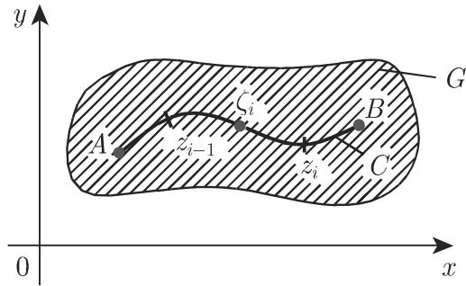
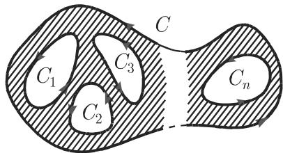
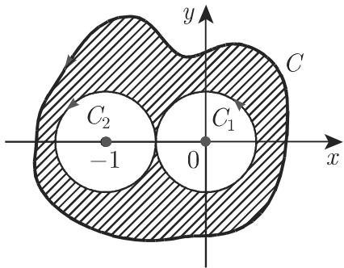
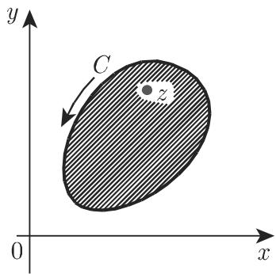
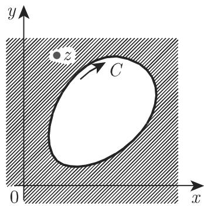

# 数学手册(原书第10版) 14.2 复平面中的积分

本节是《数学手册(原书第10版)》第 14 章（复变函数）的第二节，系统建立复平面上的积分理论：[[concepts/复定积分]] 与 [[concepts/复不定积分]] 的定义与关系、复积分的性质与求值方法、[[concepts/柯西积分定理]]（单连通与多连通两种表述）以及 [[concepts/柯西积分公式]]（区域内点与区域外点两种情形）。本节直接续接 [[sources/10-数学手册原书第10版--8-141-复变函数--10zcww1]]（14.1 总览）与 [[sources/10-数学手册原书第10版--11-1411-连续性可微性--m111o5]]（14.1.1），将 14.1 建立的 [[concepts/复函数的可微性]] 升级为积分论中的「解析性」前提，并给出本节最具洞察力的结论：[[concepts/解析函数的无穷可微性]]。

## 章节结构

- **14.2.1 定积分和不定积分**
  - 14.2.1.1 复平面中积分的定义：复定积分；复不定积分；复定积分和复不定积分的关系
  - 14.2.1.2 复积分的性质和求值：与第二型线积分的比较；积分值的估计；用参数表示的复积分值的求值；与积分路径的无关性；沿着一条闭曲线的复积分
- **14.2.2 柯西积分定理**：14.2.2.1 单连通区域的柯西积分定理；14.2.2.2 多连通区域的柯西积分定理
- **14.2.3 柯西积分公式**：14.2.3.1 在一个区域内点集上的解析函数；14.2.3.2 在一个区域外点集上的解析函数

## 公式转录（逐字保全）

```latex
(14.33a)  Σ_{i=1}^{n} f(ζ_i) Δz_i,  其中 Δz_i = z_i − z_{i−1}
(14.33b)  lim_{n→∞} Σ_{i=1}^{n} f(ζ_i) Δz_i
(14.33c)  I = ∫_{\widehat{AB}} f(z) dz = (C)∫_A^B f(z) dz
(14.34)   F(z) = ∫ f(z) dz + C,  F′(z) = f(z)
(14.35)   ∫_{\widehat{AB}} f(z) dz = ∫_A^B f(z) dz = F(z_B) − F(z_A)
(14.36)   |∫_{\widehat{AB}} f(z) dz| ⩽ M s
(14.37)   x = x(t),  y = y(t)
(14.38a)  (C)∫_A^B f dz = ∫_A^B (u dx − v dy) + i ∫_A^B (v dx + u dy)
          = ∫_{t_A}^{t_B} [u x′(t) − v y′(t)] dt + i ∫_{t_A}^{t_B} [v x′(t) + u y′(t)] dt
(14.38b)  f(z) = u(x,y) + i v(x,y),  z = x + i y
(14.39)   (C) ∮ f(z) dz = 0
(14.40)   (C) ∮ f(z) dz = 0
(14.41)   ∮_C f dz = ∮_{C_1} f dz + ∮_{C_2} f dz + ⋯ + ∮_{C_n} f dz
(14.42)   f(z) = (1 / 2πi) ∮_C f(ζ)/(ζ − z) dζ        （C 逆时针）
(14.43)   f^{(n)}(z) = (n! / 2πi) ∮_C f(ζ)/(ζ − z)^{n+1} dζ
```

注：(14.39) 在 14.2.1.2.5 先行陈述、14.2.2.1 以 (14.40) 正式重述，二者内容相同；(14.34) 的定义以「定积分不依赖于积分路径」为前提，正文两处前向回指 14.2.2。

## 例题

本节共三道例题，全部经独立复算通过（详见 [[findings/式14-33a至14-43复积分定义定理与例题转录复算]]）：

1. $\oint_{|z-z_0|=r_0}(z-z_0)^n\,\mathrm{d}z$（$n\in\mathbb{Z}$）$=0$（$n\neq-1$）；$2\pi\mathrm{i}$（$n=-1$）——圆周参数化 + 棣莫弗（de Moivre）公式。
2. $f(z)=\frac{1}{z-a}$，C 逆时针围绕 $a$：$\oint = 2\pi\mathrm{i}\,\operatorname{Res} f(z)|_{z=a} = 2\pi\mathrm{i}$——Res 记号未定义即使用（前向回指 14.3.5.5）。
3. $\oint_C \frac{z-1}{z(z+1)}\,\mathrm{d}z = 2\pi\mathrm{i}$（C 含 $0$ 与 $-1$）——多连通柯西积分定理 + 部分分式分解。

## 转写讹误与原书表述问题

本节转写存在两类系统性损坏（「于→千」讹误 ≥7 处；区域 G、曲线 C、z、s、n、t 等行内符号丢失数十处）及十余处局部讹误，完整清单见 [[queries/14-2全节系统性转写讹误清单]] 与 [[findings/式14-33a至14-43复积分定义定理与例题转录复算]]；单点问题见 [[queries/例题1z-a分式分子丢失]]、[[queries/式14-33b疑缺趋于号]]。所有表面数学错误均为转写损坏所致，复原后数值全部正确；另有两条原书表述上的注意事项（「充要条件……满足柯西—黎曼微分方程」忽略正则性条件；「可微性并不包含反复的可微性」中「包含」疑为「蕴含」）记录于 finding 页。

未入库回指（14.1.2.1 解析函数、(14.4) 柯西—黎曼微分方程、8.3.2 第二型线积分、14.3.5.5 留数定理、14.4 实积分应用）清单见 [[queries/14-2未入库回指缺口]]。

## 图版



*图 14.33：复定积分定义——曲线 $\widehat{AB}$ 被任意分点 $z_i$ 分为 $n$ 个子弧段。*


*图 14.34：以逆时针方向围绕奇点 $a$ 的闭曲线（例 $f(z)=1/(z-a)$）。*



*图 14.35：多连通区域（阴影区域，外围曲线 C 与内围曲线 $C_1,\dots,C_n$）。*



*图 14.36：包含原点与 $z=-1$ 的简单闭曲线 C 及小圆 $C_1$、$C_2$（多连通例题）。*



*图 14.37：柯西积分公式——内点 z 与边界曲线 C（逆时针）。*



*图 14.38：柯西积分公式——外部区域点与顺时针定向。*

## 与其他页面的联系

- **续接 14.1**：[[sources/10-数学手册原书第10版--8-141-复变函数--10zcww1]]、[[sources/10-数学手册原书第10版--11-1411-连续性可微性--m111o5]]；本节把 [[concepts/复函数的可微性]] 升级为积分论中的解析性前提，属强化与延伸。
- **跨章连接**：(14.38a) 把复积分落实为两个实的第二型线积分，呼应 [[concepts/向量场的线积分]] 与 [[concepts/保守场与位势]]（实向量场的路径无关性 ↔ 复解析函数的路径无关性，结构平行），详见 [[comparisons/复定积分与第二型线积分比较]]。
- **扩展既有比较**：「解析 ⟹ 无穷可微 vs 实可微不保证二阶可微」为 [[comparisons/实函数与复函数可微性比较]] 提供新的实质性论据，先行记录于 [[concepts/解析函数的无穷可微性]]。
- **本节新建比较页**：[[comparisons/单连通与多连通区域柯西积分定理比较]]、[[comparisons/柯西积分公式内点与外点情形比较]]。
- **计算流程**：[[methodology/复积分圆周参数化计算流程]]、[[methodology/多连通区域积分部分分式分解流程]]。

<!-- llm-wiki:embedded-images -->
## Embedded Images

### Document


<!-- llm-wiki:embedded-images -->
