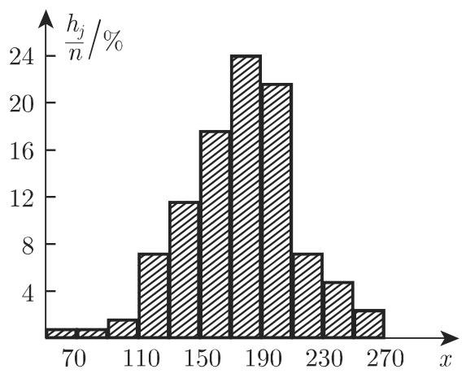

# 数学手册(原书第10版) 16.3.2 描述性统计学

本源是工具书 [[entities/数学手册原书第10版]] 16.3.2 节的入库页。该节承接 [[sources/10-数学手册原书第10版--7-162-概率论--dhwnyh]] 及其 16.2.1–16.2.6 子节系列，是全书由概率论进入统计学的过渡小节，主题为 [[concepts/描述性统计学]]：对给定的测量数据进行分组、编制频率表、绘制直方图与实证分布函数（16.3.2.1），并给出均值、方差、中位数、极差、众数五个统计参数（16.3.2.2），公式编号 (16.125)–(16.129)，附表 16.3（n=125 测量值算例）与图 16.13(a)(b)。

## 章节结构

### 16.3.2.1 对给定数据的统计汇总与分析

统计描述的前提：为对某元素的性质进行统计描述，该性质必须用随机变量（符号 X 在转写中脱落）来刻画；性质的 n 个测量或观察值 $x_i$ 通常是统计调查的起点，用来探寻该随机变量的分布的某些参数或分布本身。

概念桥梁：如果试验或测量在相同条件下可重复进行无数次，则每个容量为 n 的测量序列可视为无限总体的随机样本（见 [[concepts/随机样本与无限总体]]）。

统计调查过程四步：

1. **规则、主要记法**——测量或观察值 $x_i$ 记录在规则表中（「记录在规则表中」表述存疑，见 [[queries/16-3-2全节系统性转写讹误清单]]）。
2. **区间或分组**——把样本的 n 个测量数据 $x_i\ (i=1,2,\dots,n)$ 分到 k 个子区间（分组），或作长度（宽度）为 h 的等组距分组，通常分成 10~20 组（见 [[concepts/分组与组距]]）。
3. **频率和频率分布**——绝对频率 $h_j\ (j=1,2,\dots,k)$ 指落在给定区间 $\Delta x_j$ 的数据（占有数）的个数；比值 $h_j/n$（用 % 表示）称为相对频率；若用矩形表示各组的 $h_j/n$，得到频率分布的图形表示，即直方图（图 16.13(a)）；$h_j/n$ 可看作概率或密度函数 f(x) 的实证数值（见 [[concepts/直方图]]、[[concepts/频数与相对频率]]）。
4. **累计频率**——把绝对频率或相对频率累加，得式 (16.125)；图 16.13(b) 给出实证分布函数图，可看作未知基本分布函数的近似（见 [[concepts/累计频率与实证分布函数]]）。

算例：设某研究进行了 $n=125$ 次测量，结果分散于区间 [50, 270] 内，把区间分组为组数 $k=11$、长度 $h=20$ 是合理的，频率表见表 16.3。

### 16.3.2.2 统计参数

在总结和分析 16.3.2.1 给定的样本数据后，可推知下述参数是**随机变量分布参数的近似值**：

1. **均值**：式 (16.126a)（原始数据）与 (16.126b)（分组数据），见 [[concepts/样本均值]]；
2. **方差**：式 (16.127a)（原始数据）与 (16.127b)（分组数据），除数为 $n-1$；组中点 $u_j$ 常用来代替组均值 $\bar{x}_j$，见 [[concepts/样本方差]]；
3. **中位数**：式 (16.128a)（分布层面）与 (16.128b)（样本层面），见 [[concepts/中位数]]；
4. **极差**：式 (16.129)，见 [[concepts/极差]]；
5. **众数或最可能值**：以最大频率出现的数值，原书符号在转写中脱落，见 [[concepts/众数]]。

## 公式逐字转录

$$F_j = \frac{h_1 + h_2 + \cdots + h_j}{n}\,\%\qquad (j=1,2,\dots,k) \tag{16.125}$$

$$\bar{x} = \frac{1}{n}\sum_{i=1}^{n} x_i \tag{16.126a} \qquad \bar{x} = \frac{1}{n}\sum_{j=1}^{k} h_j\,\bar{x}_j \tag{16.126b}$$

$$s^2 = \frac{1}{n-1}\sum_{i=1}^{n} (x_i - \bar{x})^2 \tag{16.127a} \qquad s^2 = \frac{1}{n-1}\sum_{j=1}^{k} h_j\,(\bar{x}_j - \bar{x})^2 \tag{16.127b}$$

$$P(X < \tilde{x}) = \frac{1}{2} \tag{16.128a} \qquad \tilde{x} = \begin{cases} x_{m+1}, & n = 2m+1, \\ \dfrac{x_{m+1} + x_m}{2}, & n = 2m. \end{cases} \tag{16.128b}$$

$$R = x_{\max} - x_{\min} \tag{16.129}$$

注：众数一节无公式，其表示符号在转写中脱落。

## 表 16.3 频率表（逐字转录）

n=125，k=11，h=20。表头下标用 $i$，与正文 $h_j$、$F_j$ 不一致（见 [[queries/表16-3下标i与正文j不一致之辨]]）。

| 分组 | $h_i$ | $(h_i/n)/\%$ | $F_i/\%$ |
|---|---|---|---|
| 50—70 | 1 | 0.8 | 0.8 |
| 71—90 | 1 | 0.8 | 1.6 |
| 91—110 | 2 | 1.6 | 3.2 |
| 111—130 | 9 | 7.2 | 10.4 |
| 131—150 | 15 | 12.0 | 22.4 |
| 151—170 | 22 | 17.6 | 40.0 |
| 171—190 | 30 | 24.0 | 64.0 |
| 191—210 | 27 | 21.6 | 85.6 |
| 211—230 | 9 | 7.2 | 92.8 |
| 231—250 | 6 | 4.8 | 97.6 |
| 251—270 | 3 | 2.4 | 100.0 |

## 复算验证

- [[findings/表16-3频率表转录复算]]：频数总和、各相对频率、累计频率、总跨度 $220=11\times 20$ 全部复算通过，表 16.3 算术 100% 成立。
- [[findings/式16-125至16-129累计频率与统计参数转录复算]]：五组公式均为标准定义，逐式核对未发现公式本体错误。

## 插图

## 转写讹误与疑点

本源延续 16.1–16.2 各节的系统性转写讹误模式（符号脱落、「千/于」混淆），正文文字不可直接引用，需对照原书：

- 数学符号系统性脱落（X、n、k、h、众数符号）→ [[queries/16-3-2数学符号系统性脱落]]
- 「千/于」字形混淆再现两例（「用千探寻」「分散千区间」）→ [[queries/千于字形系统性混淆之辨]]
- 「分位数元」「样本分位数」疑为「中位数」「样本中位数」→ [[queries/分位数元与样本分位数疑为中位数]]
- 表 16.3 下标 $i$ 与正文 $j$ 不一致 → [[queries/表16-3下标i与正文j不一致之辨]]
- 等组距 h=20 与分组端点宽度的出入、符号 h 过载 → [[queries/等组距h20与分组端点宽度之辨]]
- 零星脱字与节末疑截断 → [[queries/16-3-2全节系统性转写讹误清单]]

## 与系列及既有条目的关联

- 宿主著作：[[entities/数学手册原书第10版]]
- 前序系列：[[sources/10-数学手册原书第10版--12-1621-事件频率和概率--1abmnju]] 至 [[sources/10-数学手册原书第10版--13-1626-随机过程和随机链--jtltwo]]（16.2.1–16.2.6）
- 概念扩展：[[concepts/频数与相对频率]]（16.2.1 入库；本源将其扩展至分组数据与直方图语境）；[[concepts/分布函数]]、[[concepts/密度函数（概率密度）]]（获得实证对应物）；[[concepts/分位数]]（中位数为其 $p=1/2$ 特例）；[[concepts/期望]]、[[concepts/方差与标准差]]（获得样本对应物，且除数不同形成对照，见 [[comparisons/样本统计量与总体参数比较]]）
- 后续缺口：16.3 章级页与 16.3.1、16.3.3 等兄弟小节尚未入库 → [[queries/16-3-2未入库回指缺口]]

<!-- llm-wiki:embedded-images -->
## Embedded Images

### Document

<!-- llm-wiki:embedded-images -->
