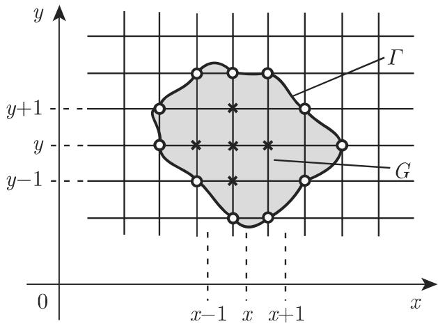

# 数学手册(原书第10版) 16.3.5 蒙特卡罗方法

本节是《数学手册(原书第10版)》16.3「数理统计学」的第 5 小节（母节见 [[concepts/数理统计学]]，母书见 [[entities/数学手册原书第10版]]），系统介绍 [[concepts/蒙特卡罗方法]]：从模拟的一般概念出发，依次给出随机数的定义与生成（[[concepts/均匀分布随机数]]、[[concepts/平方取中法]]、[[concepts/同余法]]、[[concepts/逆变换抽样]]、[[concepts/随机数表]]），再以积分估计与随机游动求解偏微分方程两类数值应用收束。全节唯一具名人物为 [[entities/冯·诺伊曼]]。

## 章节结构与核心主张

**16.3.5.1 模拟**：模拟法立足于构建等价的数学模型，通过计算机分析这些模型；当一定数量的模型被随机选取时，蒙特卡罗方法给出一个特殊案例，这些随机元素可使用随机数选取。

**16.3.5.2 随机数**：随机数是满足特定分布的某些随机量的实现（回指第 1061 页 16.2.2，即 [[concepts/随机变量]]），据此可区分不同类型的随机数。

1. **均匀分布的随机数**（式 16.168，见 [[concepts/均匀分布随机数]]），生成途径有三：
   - **平方取中法**（[[concepts/平方取中法]]）：冯·诺伊曼提出的简便方法，从 2n 位小数出发反复平方取中段；源文评价「由千（由于）该程序产生了比它更小的数字，故很少使用」。
   - **同余法**（[[concepts/同余法]]，式 16.169）：递推生成，源文称「应用广泛」；取 m = 2^r（r 为二进制位数，例如 r=40），c 依 √m 的次序（疑为「数量级」）选取；随机数生成器产生所谓伪随机数；计算器与计算机的 ran、rand 键用于生成随机数。
   - **逆变换**（式 16.170，见 [[concepts/逆变换抽样]]）：由 η_i = F⁻¹(ξ_i) 将均匀随机数变换为服从任意分布 F 的随机数，是本节唯一带完整推导链的公式。
2. **随机数表及其应用**（[[concepts/随机数表]]）：以 0–9 等概率的筹码抽放构造（第 1464 页表 21.21）；应用例为从 N=250 项总体中随机选取 n=20 项。

**16.3.5.3 蒙特卡罗模拟举例**：求 I = ∫₀¹ g(x)dx（式 16.171）的近似值，两种方法——运用频率的投点法（式 16.172，源文指出欲得到较好的精确度需要大量随机数）与利用均值逼近法（式 16.173，源文称「普通蒙特卡罗方法」），详见 [[methodology/蒙特卡罗积分的投点与均值两法流程]] 与 [[comparisons/投点法与均值逼近法比较]]。

**16.3.5.4 在数值数学中应用蒙特卡罗方法**：
1. **估计多重积分**：经 min–max 变换（式 16.174–16.179）将任意定积分标准化为 [0,1] 上的体积比例估计，见 [[methodology/积分标准化min-max变换流程]]。源文的选用建议：单变量定积分用第 1252 页 19.3 节的方法，估计多重积分仍常推荐蒙特卡罗方法。
2. **使用随机游动过程求解偏微分方程**：以拉普拉斯方程狄利克雷问题（式 16.180a,b）为例，粒子在格点上以 1/4 概率向四邻点游动、至边界吸收，命中概率满足离散调和方程（式 16.183–16.187），估计式为 (16.188)，见 [[concepts/随机游动]] 与 [[methodology/随机游动求解拉普拉斯边值问题流程]]。网格化与第 1268 页 19.5.1 节的差分法类比（差分法属第 19 章，未入库）。

**16.3.5.5 蒙特卡罗方法的进一步应用**：作为随机模拟，蒙特卡罗方法有时也称为统计试验方法，广泛应用于核技术（穿过材料层的中子数）、通信（分离信号和噪声）、运筹学（排队系统过程设计、库存控制、服务系统）；细节见文献 [16.19]、[16.23]（仅引用编号，无题录）。

## 结构化数据转录（式 16.168–16.188）

（按源文逐式转录；「←」后为本次入库复算标注的疑点）

```
(16.168)  f₀(x) = 1 (0⩽x⩽1), 0 其他；
          F₀(x) = 0 (0⩽x) / x (0<x⩽1) / 1 (x⩾1)        ← 首段条件「0⩽x」疑应为「x<0」
(16.169)  z_{i+1} ≡ c·z_i (mod m)
(16.170)  P(η_i⩽x) = P(F⁻¹(ξ_i)⩽x) = P(ξ_i⩽F(x)) = ∫₀^{F(x)} f₀(t)dt = F(x)
(16.171)  I = ∫₀¹ g(x)dx
(16.172)  ∫₀¹ g(x)dx ≈ m/n
(16.173)  E(g(X)) = ∫_{-∞}^{∞} g(x)f₀(x)dx = ∫₀¹ g(x)dx ≈ (1/n)∑_{i=1}^{n} g_i
(16.174a) I* = ∫_a^b h(x)dx
(16.174b) I = ∫₀¹ g(x)dx  且 0⩽g(x)⩽1
(16.175)  x = a+(b-a)u,  m = min_{x∈[a,b]} h(x),  M = max_{x∈[a,b]} h(x)
(16.176)  I* = (M-m)(b-a)∫₀¹ [h(a+(b-a)u)-m]/(M-m) du + (b-a)m   [代换复算通过]
(16.177)  V = ∬_S h(x,y)dxdy  且 h(x,y)⩾0
(16.178)  V* = ∬_{S*} g(u,v)dudv  且 0⩽g(u,v)⩽1
(16.179)  V* ≈ m/n
(16.180a) Δu = ∂²u/∂x² + ∂²u/∂y² = 0,  (x,y)∈G
(16.180b) u(x,y) = f(x,y),  (x,y)∈Γ
(16.181)  u(R_i) = f(R_i)  (i=1,2,…,N)
(16.182)  p(P,R_i) = p((x,y),R_i)
(16.183)  p(R_i,R_i)=1,  p(R_i,R_j)=0  (i≠j)
(16.184)  p((x,y),R_i) = (1/4)[p((x-1,y),R_i)+p((x+1,y),R_i)
                                  +p((x,y-1),R_i)+p((x,y+1),R_i)]
(16.185)  p((x,y),R_i) ≈ m_i/n
(16.186)  v(P) = v(x,y) = ∑_{i=1}^{N} f(R_i)·p((x,y),R_i)
(16.187)  v(x,y) = (1/4)[v(x-1,y)+v(x+1,y)+v(x,y-1)+v(x,y+1)]
(16.188)  v(x,y) ≈ (1/n)∑_{i=1}^{n} m_i·f(R_i)     ← 求和上限 n 疑应为 N（边界点数）
```

## 平方取中法算例（2n=4）原文转录

```
z = z₀ = 0.1234,   z₀² = 0.01[5227]56
z = z₁ = 0.5227,   z₀² = 0.27[3215]29    ← 第二行平方记号 z₀² 疑应为 z₁²
z = z₂ = 0.3215 等
```

复算：0.1234² = 0.01522756（中段四位 5227）、0.5227² = 0.27321529（中段四位 3215），数值全部吻合，仅第二行标号有误，见 [[findings/平方取中法算例复算]]。

## 插图




## 转写讹误与疑点

本节延续全书既有系统性转写问题，并出现新类型：

1. **「千/于」字形混淆**再现十余处（「立足千」「均匀分布千」「由千」「用千」「位千」「终止千」及 16.3.5.5 段首粘连），直接强化 [[queries/千于字形系统性混淆之辨]]。
2. **页码–节号粘连**六处：「第 1061 16.2.2」「第 1057 16.2.1.2」「第 1103 (16.175)」「第 1252 19.3」「第 1268 19.5.1」「第 1464 表 21.21」。
3. **新类型：字母 O 与数字 0 混淆**，区间「[O, 1]」多处。
4. **「＆」衍文**两处（均值逼近法段与「柱体 K*＊」处）。
5. **符号系统性脱落**：n、m、N、X、c、r、0 与 1、S、V、G、Γ（「I' 表示 的边界」为 Γ 之残迹）、终止概率之 1、位数词等。
6. **单项疑点**（均另建 query 跟踪）：式 (16.168) 首段条件（[[queries/式16-168分布函数首段条件疑为x小于0]]）、式 (16.188) 上限 n/N（[[queries/式16-188求和上限n疑为N]]）、随机游动两处回指式号（[[queries/随机游动两处回指式号疑误之辨]]）、平方取中法 z₁² 标号（[[queries/平方取中法算例z0平方疑为z1平方]]）、「二次格」疑为「正方形网格」（[[queries/二次格疑为正方形网格]]）、「依 √m 的次序」疑为「数量级」（[[queries/依根号m的次序疑为数量级之辨]]）、「记数 000249」疑为「000 至 249」（[[queries/记数000249疑为000至249]]）、随机数表「位随机数一组」脱位数（[[queries/随机数表位随机数一组脱位数之辨]]）。
7. **数学张力（非转写讹误）**：式 (16.170) 中 P(F⁻¹(ξ)⩽x)=P(ξ⩽F(x)) 需 F 连续（或采用广义逆约定），源文未声明该条件；平方取中法弃用理由「产生了比它更小的数字」语句不通，原文表述存疑。

全节汇总见 [[queries/16-3-5全节系统性转写讹误清单]]；未入库回指见 [[queries/16-3-5未入库回指缺口]]。

## 复算结论

经本次入库逐式复算，式 (16.170)、(16.173)、(16.176)、(16.184)、(16.186)–(16.187) 数学内容全部正确；平方取中法算例数值吻合。本节未给出蒙特卡罗积分或随机游动的数值算例，实证性弱于 16.3.1、16.3.2 的例题风格。逐式记录见 [[findings/式16-168至16-170随机数定义与逆变换转录复算]]、[[findings/平方取中法算例复算]]、[[findings/式16-171至16-173蒙特卡罗积分两法转录复算]]、[[findings/式16-174至16-179多重积分变换转录复算]]、[[findings/式16-180至16-188随机游动求解边值问题转录复算]]。

## 与既有维基的关联

- 式 (16.168) 回指 [[concepts/均匀分布]]、[[concepts/分布函数]]、[[concepts/密度函数（概率密度）]]；随机数定义回指 [[concepts/随机变量]]。
- 式 (16.172) 的频率依据回指第 1057 页 16.2.1.2（[[concepts/频数与相对频率]]）；式 (16.173) 回指第 1063 页期望公式 (16.49a, 16.49b)（[[concepts/期望]]，对应 [[findings/式16-49至16-53期望矩与方差转录复算]]）。
- [[methodology/随机数表抽样流程]]（16.3.1 的 00–69 两位数抽样流程）被本节 N=250、n=20、三位数 000–249 的例子直接扩展，并新增「随机数表构造」维度；[[queries/从0069标号疑为从00到69]] 的标号脱漏模式在「记数 000249」处再现。
- 随机游动求解 PDE 是 [[concepts/马尔可夫链]]、[[concepts/转移概率与转移矩阵]]、[[concepts/吸收状态]]（式 16.183 正是吸收态性质）、[[concepts/随机链]] 的首个入库应用场景，呼应 [[findings/式16-111至16-115概率向量演算与粒子游走算例转录复算]] 的粒子游走算例。

<!-- llm-wiki:embedded-images -->
## Embedded Images

### Document


<!-- llm-wiki:embedded-images -->
