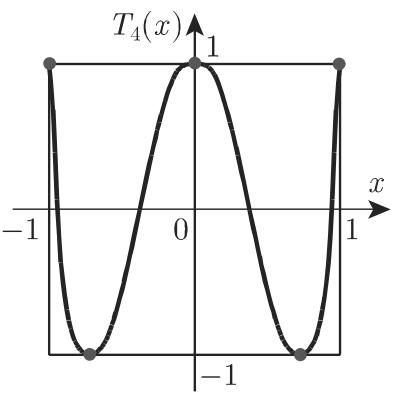
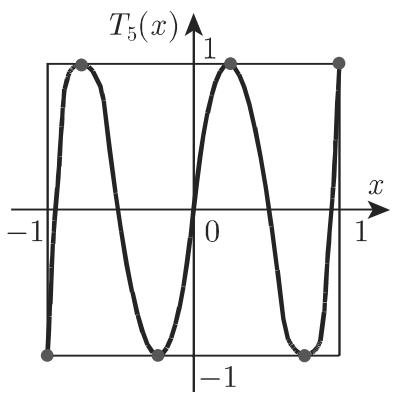

# 数学手册(原书第10版) 19.6.3 切比雪夫逼近

## 来源信息

- 书名：《数学手册（原书第10版）》，第 19 章「数值分析」→ 19.6「插值、调整计算、调和分析」→ **19.6.3 切比雪夫逼近**。
- 父节来源页：[[10-数学手册原书第10版--14-196-插值调整计算调和分析--3evq7v]]（父节页应回指本子节）；前一子节：[[10-数学手册原书第10版--9-1962-平均逼近--zr0sw4]]。
- 作者、出版年份、出处（venue）在所获文本中未载，留空待补；原书版本信息待考。

## 概述

本子节主题为**切比雪夫逼近**，即**一致逼近**：在 sup-范数（最大绝对误差）意义下选取逼近参数，使 (19.195) 定义的误差尽可能小。它与 19.6.2 的[[平均逼近]]（L² 范数）构成函数逼近的两种对偶范式（对照见 [[平均逼近与切比雪夫逼近比较]]）。

全节四个小节：

1. **19.6.3.1 问题的定义和交替点定理** — min–max 目标 (19.195) 与[[交替点定理]]的特征化；xⁿ 特例引出 [[切比雪夫多项式]] 的极值性质。
2. **19.6.3.2 切比雪夫多项式的性质** — T_n 的三种表达式、根、极值点、递推与显式 T₂–T₁₀（(19.196)–(19.200)）。
3. **19.6.3.3 列梅兹 (Remes) 算法** — 由交替点定理导出的方程组 (19.202)–(19.203) 与四步迭代，停机判据 (19.204)；冠名者见 [[列梅兹]]。
4. **19.6.3.4 离散切比雪夫逼近和最优化** — 离散化 (19.205)–(19.206)，消绝对值化为线性规划 (19.209)；参数非线性时归为非凸最优化。

## 19.6.3.1 问题的定义和交替点定理

连续情况的切比雪夫逼近（一致逼近）：函数 f(x) 在区间 [a,b] 内被函数 g(x) = g(x; a₀, a₁, …, aₙ) 逼近，使得由

$$
\max_{a\leqslant x\leqslant b}\bigl|f(x)-g(x;a_0,a_1,\dots,a_n)\bigr|=\Phi(a_0,a_1,\dots,a_n)\tag{19.195}
$$

定义的误差对于适当选取的参数 aᵢ (i = 0, 1, …, n) 尽可能小。如果 f(x) 存在这样的（最佳）近似函数，则误差的绝对值至少在区间的 **n+2 个点** x_ν 上取得极大，且误差在这些所谓的**交替点**上变号（图 19.10）。这正是[[交替点定理]]对切比雪夫逼近问题之解的特征化。

图 19.10（交替点示意）：

特例（T_n 的极值性质）：若函数 f(x) = xⁿ 在区间 [−1, 1] 上在切比雪夫意义下被次数 ⩽ n−1 的多项式近似，则切比雪夫多项式 T_n(x) 可作为最大模为（**转录此处脱落数值**，复算为 2^{1−n}，见 [[最大模为后脱数值疑为2的1减n次幂之辨]]）的误差函数。位于区间端点和区间内 n−1 个点（原文作「n-l」，l 疑为 1 之讹）的交替点恰好相应于 T_n(x) 的极值点（图 19.11(a)–(f)）。

图 19.11（T_n 的图像，六幅子图；转写文本中 (b)(c) 标签与图序错乱，各子图分别对应哪些 T_n 待核，见 [[19-6-3全节系统性转写讹误清单]]）：

## 19.6.3.2 切比雪夫多项式的性质

以下公式按原文转录，复算全部验证无误（见 [[式19-195至19-200切比雪夫逼近定义与Tn性质转录复算]]）。

**1. 表达式：**

$$
T_n(x)=\cos(n\arccos x),\tag{19.196a}
$$

$$
T_n(x)=\frac{1}{2}\Bigl[\bigl(x+\sqrt{x^2-1}\bigr)^n+\bigl(x-\sqrt{x^2-1}\bigr)^n\Bigr],\tag{19.196b}
$$

$$
T_n(x)=\begin{cases}\cos nt, & x=\cos t,\ |x|<1,\\ \cosh nt, & x=\cosh t,\ |x|>1\end{cases}\quad(n=1,2,\dots).\tag{19.196c}
$$

**2. T_n(x) 的根：**

$$
x_\mu=\cos\frac{(2\mu-1)\pi}{2n}\quad(\mu=1,2,\dots,n).\tag{19.197}
$$

**3. x ∈ [−1, 1] 时 T_n(x) 极值点的位置：**

$$
x_\nu=\cos\frac{\nu\pi}{n}\quad(\nu=0,1,2,\dots,n).\tag{19.198}
$$

**4. 递推公式：**

$$
T_{n+1}(x)=2xT_n(x)-T_{n-1}(x)\quad(n=1,2,\dots;\ T_0(x)=1,\ T_1(x)=x).\tag{19.199}
$$

**5. 递推所得的显式 T₂–T₁₀：**

$$
\begin{aligned}
&T_2(x)=2x^2-1,\quad &&T_3(x)=4x^3-3x,\\
&T_4(x)=8x^4-8x^2+1,\quad &&T_5(x)=16x^5-20x^3+5x,\\
&T_6(x)=32x^6-48x^4+18x^2-1,\\
&T_7(x)=64x^7-112x^5+56x^3-7x,\\
&T_8(x)=128x^8-256x^6+160x^4-32x^2+1,\\
&T_9(x)=256x^9-576x^7+432x^5-120x^3+9x,\\
&T_{10}(x)=512x^{10}-1280x^8+1120x^6-400x^4+50x^2-1.
\end{aligned}\tag{19.200}
$$

## 19.6.3.3 列梅兹 (Remes) 算法

**交替点定理的推论。** 数值求解连续切比雪夫逼近问题源于交替点定理。逼近函数选为

$$
g(x)=\sum_{i=0}^{n}a_i g_i(x),\tag{19.201}
$$

其中 g₀, …, gₙ 为 n+1 个线性无关的已知函数；切比雪夫问题的解的系数记为 aᵢ* (i = 0, 1, …, n)，根据 (19.195) 最小偏差记为 ρ = Φ(a₀*, a₁*, …, aₙ*)（**原文此处衍「吐）」二字**）。此时当函数 f 和 gᵢ (i = 0, 1, …, n) 可微，由交替点定理有

$$
\sum_{i=0}^{n}a_i^{*}g_i(x_\nu)+(-1)^{\nu}\varrho=f(x_\nu),\qquad
\sum_{i=0}^{n}a_i^{*}g_i'(x_\nu)=f'(x_\nu)\quad(\nu=1,2,\dots,n+2),\tag{19.202}
$$

交替点 x_ν 满足

$$
a\leqslant x_1<x_2<\dots<x_{n+2}\leqslant b.\tag{19.203}
$$

方程组 (19.202) 对切比雪夫逼近问题的 **2n+4 个未知量**——n+1 个系数、n+2 个交替点及最小偏差 ρ——给出了 **2n+4 个条件**。若区间端点也是交替点，则在该处导数条件不是必要条件。（记号注意：原文 ρ 与 ϱ 混用。）

**根据列梅兹算法确定最小解**（详见 [[列梅兹算法]] 与 [[列梅兹算法迭代流程]]）：

1. 按 (19.203) 确定交替点近似值 x_ν^{(0)}（原文括注误作 i = 1, 2, …, n+2），例如等距节点或 T_{n+1}(x) 的极值点（见 19.6.3.2）。
2. 求解线性方程组 ∑ᵢ₌₀ⁿ aᵢgᵢ(x_ν^{(0)}) + (−1)^ν ϱ = f(x_ν^{(0)})（ν = 1, 2, …, n+2），其解为近似值 aᵢ^{(0)} (i = 0, 1, …, n) 与 ρ₀。
3. 确定交替点新的近似值 x_ν^{(1)}，例如取误差函数 f(x) − ∑ᵢ₌₀ⁿ aᵢ^{(0)}gᵢ(x) 极值点的位置。
4. 以 x_ν^{(1)}, aᵢ^{(1)} 代替 x_ν^{(0)}, aᵢ^{(0)}，重复步骤 (2) 与步骤 (3)（**原文「重复步骤 和步骤 3」脱步骤号**），等等，即得到关于系数和交替点的逼近序列，其收敛性在某些条件下可以得到（见 [19.33]）。若某个迭代指标 μ 使得

$$
|\varrho_\mu|=\max_{a\leqslant x\leqslant b}\Bigl|f(x)-\sum_{i=0}^{n}a_i^{(\mu)}g_i(x)\Bigr|\tag{19.204}
$$

满足充分的精度，则计算停止。

## 19.6.3.4 离散切比雪夫逼近和最优化

从连续切比雪夫逼近问题

$$
\max_{a\leqslant x\leqslant b}\Bigl|f(x)-\sum_{i=0}^{n}a_ig_i(x)\Bigr|=\min!\tag{19.205}
$$

出发，若选取 N 个点 x_ν（ν = 1, 2, …, N；N ⩾ n+2；**原文「若选取 个点」处脱 N**）满足 a ⩽ x₁ < x₂ < ⋯ < x_N ⩽ b（**原文此排序式中一处「⩽」疑为「<」**），并要求

$$
\max_{\nu=1,2,\dots,N}\Bigl|f(x_\nu)-\sum_{i=0}^{n}a_ig_i(x_\nu)\Bigr|=\min!\tag{19.206}
$$

可得相应的离散问题。代入

$$
\gamma=\max_{\nu=1,2,\dots,N}\Bigl|f(x_\nu)-\sum_{i=0}^{n}a_ig_i(x_\nu)\Bigr|,\tag{19.207}
$$

显然有推论

$$
\Bigl|f(x_\nu)-\sum_{i=0}^{n}a_ig_i(x_\nu)\Bigr|\leqslant\gamma\quad(\nu=1,2,\dots,N).\tag{19.208}
$$

(19.208) 消去绝对值，得到关于系数 aᵢ 和 γ 的线性不等式组（**原文「和？γ」之「？」为衍字**），从而 (19.206) 为**线性规划问题**（参见第 1179 页 18.1.1.1）：

$$
\gamma=\min!,\ \text{满足}\quad
\begin{cases}
\gamma+\sum_{i=0}^{n}a_ig_i(x_\nu)\geqslant f(x_\nu),\\
\gamma-\sum_{i=0}^{n}a_ig_i(x_\nu)\geqslant -f(x_\nu)
\end{cases}\quad(\nu=1,2,\dots,N).\tag{19.209}
$$

对 γ > 0 方程 (19.209) 有极小解。对于足够大的点数（**原文此处亦脱 N**）及某些进一步的条件，离散问题的解可看作连续问题的解（条件未具体化，见 [[19-6-3未入库回指缺口]]）。

若用非线性依赖参数 a₀, a₁, …, aₙ 的非线性逼近函数 g(x) = g(x; a₀, a₁, …, aₙ) 代替线性逼近函数 g(x) = ∑ᵢ₌₀ⁿ aᵢgᵢ(x)，则类似可得非线性最优化问题，其通常即使在简单函数形式下也是**非凸**的，这从本质上减少了非线性最优化问题的数值解法（参见第 1203 页 18.2.2.1）。

## 转写讹误与疑点

本子节转写文本存在系统性 OCR 讹误（「千」为「于」之讹遍布全节，另有脱字、衍字、记号混用等多处），逐条清单见 [[19-6-3全节系统性转写讹误清单]]，分条辨析：

- [[最大模为后脱数值疑为2的1减n次幂之辨]]
- [[列梅兹步骤下标ν与括注i不一致之辨]]
- [[重复步骤后脱步骤号之辨]]
- [[选取N个点与足够大点数处脱N之辨]]
- [[19-202后吐字与问号衍字之辨]]
- [[19-6-3未入库回指缺口]]（18.1.1.1、18.2.2.1、[19.33] 三处回指未入库）

## 派生页面

- 概念：[[切比雪夫逼近（一致逼近）]]、[[交替点定理]]、[[列梅兹算法]]、[[离散切比雪夫逼近与线性规划形式]]；更新 [[切比雪夫多项式]]（补 L∞ 极值角色）。
- 实体：[[列梅兹]]（新建）、[[切比雪夫]]（更新）。
- 方法：[[列梅兹算法迭代流程]]。
- 复算：[[式19-195至19-200切比雪夫逼近定义与Tn性质转录复算]]、[[式19-201至19-204列梅兹算法交替点方程组转录复算]]、[[式19-205至19-209离散问题与线性规划形式转录复算]]。
- 比较：[[平均逼近与切比雪夫逼近比较]]、[[连续与离散切比雪夫逼近比较]]。

## 开放问题

1. 「最大模为」后脱落之数值是否确为 2^{1−n}（或原书作「乘以因子 2^{1−n} 的 T_n」）？
2. 文献 [19.33] 的具体出处与其给出的收敛条件为何？
3. 「某些进一步的条件」（离散解可视作连续解）是否即 Haar 型条件？
4. 图 19.11(a)–(f) 六幅子图分别对应哪些 T_n？

<!-- llm-wiki:embedded-images -->
## Embedded Images

### Document

<!-- llm-wiki:embedded-images -->
