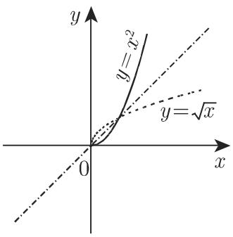
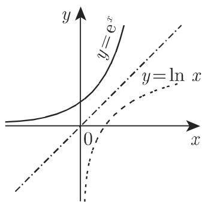
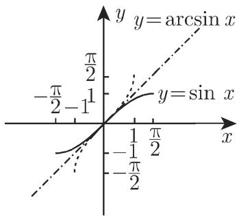

# 数学手册(原书第10版) 2.1.3 某些类型的函数

## 概述

本节是《数学手册(原书第10版)》2.1 章“函数”的第三小节，接续 [[sources/10-数学手册原书第10版--9-211-函数的定义--191yjep]]（2.1.1 [[concepts/函数]] 的定义）与 [[sources/10-数学手册原书第10版--12-212-实函数的定义方法--bb6fa4]]（2.1.2 实函数的表示方法），完成“定义 → 表示 → 性质”的第三层。全节给出函数性质的六个分类维度，每一维度配定义式、图示（图 2.3–2.6）与可直接代入验算的示例：

| 小节 | 维度 | 概念页 |
|---|---|---|
| 2.1.3.1 | 单调性 | [[concepts/单调函数]] |
| 2.1.3.2 | 有界性 | [[concepts/有界函数]] |
| 2.1.3.3 | 极值 | [[concepts/极值]] |
| 2.1.3.4 / 2.1.3.5 | 奇偶性 | [[concepts/偶函数]]、[[concepts/奇函数]] |
| 2.1.3.6 | 偶奇分解（表示技术） | [[concepts/偶奇分解]] |
| 2.1.3.7 | 周期性 | [[concepts/周期函数]] |
| 2.1.3.8 | 可逆性 | [[concepts/反函数]] |

证据形态为规定性定义加可验算示例，属权威工具书的定义性内容，强度高：所有示例均可直接代入验算，不存在经验复制问题。

## 编号公式原文（式 2.7a–2.13）

```latex
f(x_2) \geqslant f(x_1)  或  f(x_2) \leqslant f(x_1)              (2.7a)
f(x_2) > f(x_1)  或  f(x_2) < f(x_1)                              (2.7b)
f(a) \geqslant f(x)                                                (2.8a)
f(a) \leqslant f(x)                                                (2.8b)
f(-x) = f(x)                                                       (2.9a)
(x \in D) \Rightarrow (-x \in D)                                   (2.9b)
f(-x) = -f(x)                                                      (2.10a)
(x \in D) \Rightarrow (-x \in D)                                   (2.10b)
f(x) = g(x) + u(x),  g(x) = ½[f(x)+f(-x)],  u(x) = ½[f(x)-f(-x)]   (2.11)
f(x+T) = f(x),  T 为非零常数                                        (2.12)
f(\varphi(y)) = y  和  \varphi(f(x)) = x                           (2.13)
```

## 各小节要点

### 2.1.3.1 单调函数

弱式 (2.7a)（允许等号）定义“单调递增/递减”函数；严格式 (2.7b)（等号恒不成立）定义“严格单调递增/递减”函数。若关系仅在定义域的某一区间或半轴上成立，则称该函数为此区域内的单调函数。图 2.3(a) 为严格单调递增；图 2.3(b) 为在 $x_1, x_2$ 之间取常数的（弱式）单调递减函数。示例：$y = \mathrm{e}^{-x}$ 严格递减，$y = \ln x$ 严格递增。

**术语口径警示**：手册以弱式 (2.7a) 称“单调递增”，相当于许多教材的“单调不减”；跨页转移单调性结论时须注明约定（可类比 1.6 节二次方程判别式反号约定的先例）。详见 [[findings/单调函数弱式与严格式定义及区间单调性]]。

### 2.1.3.2 有界函数

有上界（存在数使所有函数值不超过之）、有下界（存在数使所有函数值不小于之）；两者兼备简称有界。四例：

| 例 | 函数 | 结论 | 界 |
|---|---|---|---|
| A | $y = 1 - x^{2}$ | 有上界 | $y \leqslant 1$ |
| B | $y = e^{x}$ | 有下界 | $y > 0$ |
| C | $y = \sin x$ | 有界 | $-1 \leqslant y \leqslant +1$ |
| D | $y = \frac{4}{1 + x^{2}}$ | 有界 | $0 < y \leqslant 4$ |

详见 [[findings/有界函数由上下界定义且四例验证]]。

### 2.1.3.3 函数的极值

(2.8a) 对一切 $x \in D$ 成立为绝对/全局极大值；仅在点 $a$ 的 $\varepsilon$-邻域内成立为相对/局部极大值；(2.8b) 对偶定义极小值。注 (1)：极值与可微性无关，不可微点（含间断点）可为极值点（前向引用第 75 页图 2.9、第 595 页图 6.10(b), (c)）；注 (2)：可微函数的极值判据见第 595 页 6.1.5.2。详见 [[findings/极值定义分全局与局部且与可微性无关]] 与 [[comparisons/全局极值与局部极值比较]]。

### 2.1.3.4 / 2.1.3.5 偶函数与奇函数

偶函数 (2.9a) 与奇函数 (2.10a) 的定义均附带定义域对称条件 (2.9b)/(2.10b)。奇函数示例：$y = \sin x$、$y = x^{3} - x$。详见 [[findings/偶奇函数定义附带定义域对称条件]] 与 [[comparisons/偶函数与奇函数比较]]。

### 2.1.3.6 偶函数和奇函数的表示（偶奇分解）

定义域对称的函数可写成偶函数 $g$ 与奇函数 $u$ 之和（式 2.11）。示例：$e^{x} = \cosh x + \sinh x$（前向引用第 115 页 2.9.1 双曲函数）。手册仅言“可写成”并给出公式，未显式主张唯一性。转写问题：式 (2.11) 编号在原文挂在示例行而非分解公式行。详见 [[findings/对称域函数可分解为偶部与奇部之和]]。

### 2.1.3.7 周期函数

(2.12)：$f(x+T) = f(x)$，$T$ 为非零常数；$T$ 的倍数亦为周期；满足关系的最小正数称为周期——原文作“最小正**整数**”，与同句“$T$ 为非零**常数**”及示例 $\sin x$ 的周期 $2\pi$ 矛盾，疑为“最小正数”之误。详见 [[findings/周期函数定义与最小正周期约定]] 与 [[queries/周期定义最小正整数是否应为最小正数]]。

### 2.1.3.8 反函数

存在条件（对任一 $y \in W$ 存在唯一 $x \in D$）；记号 $\varphi$ 或 $f^{-1}$（$f^{-1}$ 是函数符号，不是幂）；求法（交换 $x, y$ 后由 $x = f(y)$ 解出 $y$，即 [[concepts/隐函数]] 的显式化程序）；等价式 (2.13)；图像沿直线 $y = x$ 反射（图 2.6）；“每个严格单调函数都有反函数”（充分性表述）；注 (1) 区间严格单调则区间上存在反函数，注 (2) 非单调函数可在严格单调部分分割求逆。三例均靠限制定义域获得双射：

| 例 | $f(x)$ | $D_f$ | $W_f$ | 反函数 $\varphi(x)$ | $D_\varphi$ | $W_\varphi$ |
|---|---|---|---|---|---|---|
| A | $x^{2}$ | $x \geqslant 0$ | $y \geqslant 0$ | $\sqrt{x}$ | $x \geqslant 0$ | $y \geqslant 0$ |
| B | $e^{x}$ | $-\infty < x < +\infty$ | $y > 0$ | $\ln x$ | $x > 0$ | $-\infty < y < +\infty$ |
| C | $\sin x$ | $-\frac{\pi}{2} \leqslant x \leqslant \frac{\pi}{2}$ | $-1 \leqslant y \leqslant 1$ | $\arcsin x$ | $-1 \leqslant x \leqslant 1$ | $-\frac{\pi}{2} \leqslant y \leqslant \frac{\pi}{2}$ |

详见 [[findings/严格单调保证反函数存在且图像沿y等于x反射]]。

## 与现有 wiki 的关联

- **系列延续**：与 [[sources/10-数学手册原书第10版--9-211-函数的定义--191yjep]]、[[sources/10-数学手册原书第10版--12-212-实函数的定义方法--bb6fa4]] 构成 2.1 章三层结构；[[concepts/函数]] 页宜补性质分类索引。
- **实例回链**：[[concepts/符号函数]] 为奇函数实例；[[concepts/取整函数]] 为弱式单调不减实例；[[concepts/小数部分函数]] 为周期 1 且有界的实例。
- **程序互证**：反函数求法即 [[concepts/隐函数]] 的显式化程序，与 [[findings/实函数解析表示三形式及其成立条件]] 相通。
- **主题强化**：反函数例 A（$x^{2}$ 限 $x \geqslant 0$）与例 C（$\sin x$ 限区间）为 [[findings/隐式方程整圆不定义函数须附加限制]] 的同型新证据——“限制定义域以获得单值性/可逆性”是 2.1.2 与 2.1.3 反复出现的模式。
- **前向引用（未来页面）**：第 115 页 2.9.1（双曲函数，$\cosh$/$\sinh$）、第 595 页 6.1.5.2（极值判据）、第 75 页图 2.9（间断点极值）；处理相应章节时应回链本节。

## 疑点与勘误

1. **“最小正整数”应为“最小正数”**（高置信）：见 [[queries/周期定义最小正整数是否应为最小正数]]。
2. **常数函数边界情形**：常数函数满足 (2.12) 却无最小正周期，手册未排除该情形。
3. **轻微转写问题**：式 (2.11) 编号挂在示例行；2.1.3.3 “函数 $f(x)$ 点 $a$ 取得相对极大值”疑漏“在”字；图 2.6(c) 未被正文显式引用（推测对应注 (2) 的分段反函数情形）。
4. **术语口径**：弱式“单调递增”不可与通行严格口径混用。

## 配图

图 2.3–2.6 的语义已在各概念页转述，图片文件位于 `media/10-数学手册原书第10版--11-213-某些类型的函数--18jbkkh/`：

- 图 2.3(a)：`001-be7fb46f8f14f4c146173bb1d9191c17099c03f70838a58bde3e4fb15d0a4c84.jpg`；图 2.3(b)：`002-8a8e268b6b68c6e1b7c1bdffd696bcd0702241b0e5c9f159df8014129d3c56de.jpg`
- 图 2.4(a)：`003-4bde873f65da53c24bac6ea2fc7816530e91be72d46505cf226469224bb235bc.jpg`；图 2.4(b)：`004-15419c34e6e707ad377e4b520e7f171315b0c5fc44dfa715b179b6c49f6efd1e.jpg`
- 图 2.5：`005-a7cc9913be3a3676dfe3b7c1187b21168e9456f517cc85176515f2f549677924.jpg`
- 图 2.6(a)：`006-d93e337907b97db1e45f4b30985639fcfd986dd92d666aa63481dfbaa4a3f601.jpg`；图 2.6(b)：`007-800f28a30f7fe3ea951719e153013103221faffd04478b493e6c653cf040541e.jpg`；图 2.6(c)：`008-44eca028edc6dfff2159a8329e22faad2b24e47e80fded416976006f0fbcf9f.jpg`

<!-- llm-wiki:embedded-images -->
## Embedded Images

### Document





<!-- llm-wiki:embedded-images -->
