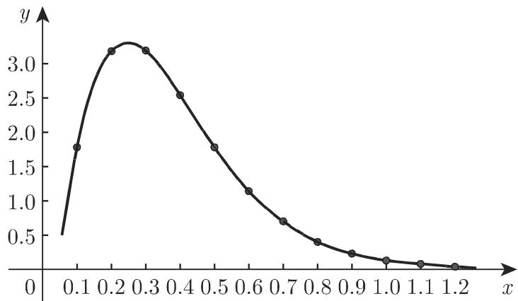
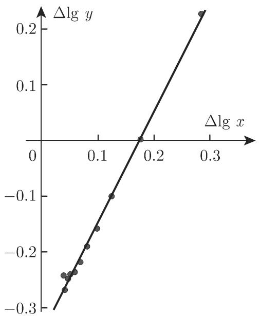
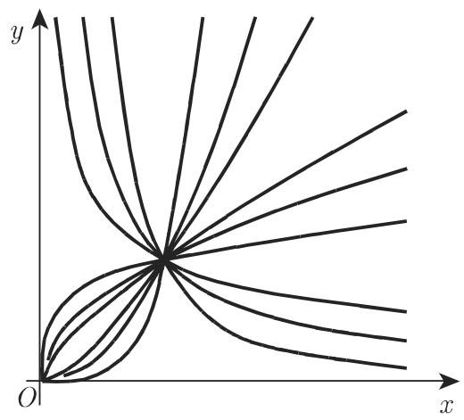
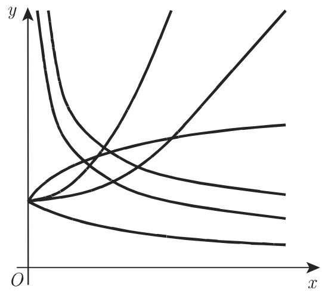
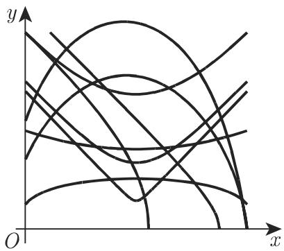
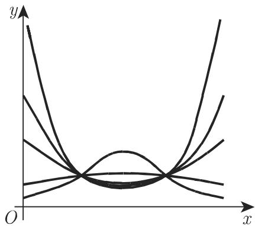
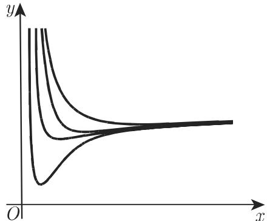
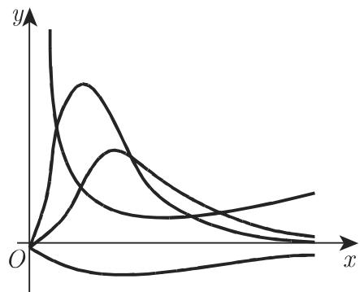
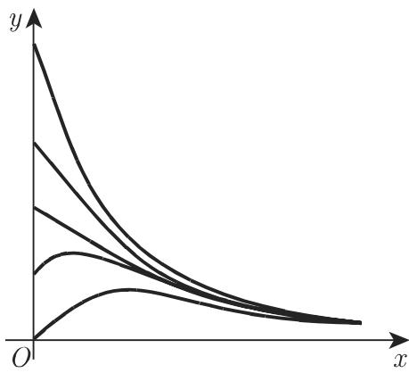

# 数学手册(原书第10版) 2.16 经验曲线的确定

## 内容概要

本节是《数学手册(原书第10版)》第 2 章末尾的方法论小节，主题是**由经验数据确定近似公式（经验曲线）**，由两部分组成：

- **2.16.1 步骤**：曲线形状的比较（2.16.1.1）→ 修正（2.16.1.2）→ 参数的确定（2.16.1.3：平均值法、最小二乘法）。
- **2.16.2 实用的经验公式**：开列 11 类常用经验公式族的参数—形状目录（图 2.80–2.91），逐一给出修正代换；2.16.2.12 以表 2.9 的 12 组数据完成一个可复算的数值算例（图 2.92–2.94）。

核心主张：直观的形状相似性判断并不可靠，故选式之后、定参之前必须以**修正**（式 2.254）检验公式恰当性；定参首选最小二乘法（手册称其“最重要、最准确”，前引第 1097 页 16.3.4.2），平均值法为更简单的替代，并在参数非线性出现时为非线性最小二乘（前引第 1282 页 19.6.2.4）提供迭代初值。流程总纲见 [[methodology/经验曲线确定三步法]]。

本节延续手册“按参数值分类曲线形状”的传统（每个函数族给出不同参数值对应的多条曲线），与本 wiki 已收录的 [[findings/卡西尼曲线按a与c之比的五种形态]]、[[findings/外摆线按m的三分类与几何量]] 同构；但与 2.7–2.13 各分节（三角、反三角、双曲、面积函数、代数曲线）无内容交叉。

## 2.16.1 步骤要点

1. **曲线形状的比较（2.16.1.1）**：先从所有可能的函数中选一个最简单的近似公式（手册建议典型地含三个参数），将其曲线与经验数据曲线比较；因“有时从直观上去判断的相似性并不可靠”，选式后、定参前必须检查公式是否恰当。选式时必须考虑参数对曲线形状的影响——不能仅凭经验数据曲线有极大或极小值就断定 $y=ax^2+bx+c$ 合理。
2. **修正（2.16.1.2）**：引进 $X=\varphi(x,y)$、$Y=\psi(x,y)$ 使 $Y=AX+B$（式 2.254），对给定的 x、y 值计算相应 X、Y 并作图，判断点是否大约共线；亦可用线性回归或相关（前引第 1095 页 16.3.4）形式化检验。手册给出三种手段：■A 代数代换（例：$y=\frac{x}{ax+b}$ 取 $X=x,\ Y=\frac{x}{y}$ 得 $Y=aX+b$，或取 $X=\frac1x,\ Y=\frac1y$ 得 $Y=a+bX$）；■B 半对数坐标纸（2.17.2.1）；■C 双对数坐标纸（2.17.2.2）。
3. **参数的确定（2.16.1.3）**：平均值法把条件方程分为数目相等或近似相等的两组，各自求和得两个方程定出 A、B；若参数非线性出现，修正与平均值法配合使用（例见式 2.267b、2.267c），或转入非线性最小二乘（其迭代解需良好初值，恰由修正+平均值法提供）。

## 修正公式目录（式 2.255–2.267，逐字保存）

（本节 log 均为常用对数 lg，表 2.9 中 lg 2 = 0.301 可证；"log e" 即 lg e ≈ 0.4343。）

| 编号 | 函数族 / 情形 | 修正代换 | 线性关系 / 化归结果 |
|---|---|---|---|
| 2.255a–b | $y=ax^{b}$ | $X=\log x,\ Y=\log y$ | $Y=\log a+bX$ |
| 2.256a–b | $y=ax^{b}+c$（b 已知） | $X=x^{b},\ Y=y$ | $Y=aX+c$ |
| 2.256c | 同上（b 未知，先定 c） | $X=\log x,\ Y=\log(y-c)$ | $Y=\log a+bX$ |
| 2.256d | 幂函数型 c 的估计 | $x_3=\sqrt{x_1x_2}$ | $c=\frac{y_1y_2-y_3^2}{y_1+y_2-2y_3}$ |
| 2.257a–b | $y=a\mathrm{e}^{bx}$ | $X=x,\ Y=\log y$ | $Y=\log a+b\log\mathrm{e}\cdot X$ |
| 2.258a–b | $y=a\mathrm{e}^{bx}+c$ | $X=x,\ Y=\log(y-c_1)$ | $Y=\log a+b\log\mathrm{e}\cdot X$ |
| 2.258 节内 | 指数型 c 的估计 | $x_3=\frac{x_1+x_2}{2}$ | $c=\frac{y_1y_2-y_3^2}{y_1+y_2-2y_3}$ |
| 2.259a–b | $y=ax^{2}+bx+c$（任选数据点 $(x_1,y_1)$） | $X=x,\ Y=\frac{y-y_1}{x-x_1}$ | $Y=(b+ax_1)+aX$ |
| 2.259c | 同上（x 成公差 h 的等差数列） | $X=x,\ Y=\Delta y$ | $Y=(bh+ah^{2})+2ahX$ |
| 2.259d | 上两情形中 c 的确定 | — | $\sum y=a\sum x^{2}+b\sum x+nc$ |
| 2.260a–b | $y=\frac{ax+b}{cx+d}$（任选数据点 $(x_1,y_1)$） | $X=x,\ Y=\frac{x-x_1}{y-y_1}$ | $Y=A+BX$，回代得 $y=y_1+\frac{x-x_1}{A+Bx}$（2.260c） |
| 2.260d | $y=\frac{x}{cx+d}$ | $X=\frac1x,\ Y=\frac1y$ 或 $X=x,\ Y=\frac{x}{y}$ | $Y=a+bX$ |
| 2.260d | $y=\frac{1}{cx+d}$ | $X=x,\ Y=\frac1y$ | 线性 |
| 2.261 | $y^{2}=ax^{2}+bx+c$ | $Y=y^{2}$ | 化归二次多项式（2.16.2.3） |
| 2.262 | $y=a\mathrm{e}^{bx+cx^{2}}$（一般误差曲线） | $Y=\log y$ | 化归二次多项式（2.16.2.3） |
| 2.263 | $y=\frac{1}{ax^{2}+bx+c}$（第II类三次曲线） | $Y=\frac1y$ | 化归二次多项式（2.16.2.3） |
| 2.264 | $y=\frac{x}{ax^{2}+bx+c}$（第III类三次曲线） | $Y=\frac{x}{y}$ | 化归二次多项式（2.16.2.3） |
| 2.265 | $y=a+\frac bx+\frac c{x^{2}}$（第I类三次曲线） | $X=\frac1x$ | 化归二次多项式（2.16.2.3） |
| 2.266a–b | $y=ax^{b}\mathrm{e}^{cx}\ (c\neq0)$（x 等差，公差 h） | $X=\Delta\log x,\ Y=\Delta\log y$ | $Y=hc\log\mathrm{e}+bX$ |
| 2.266c | 同上（x 等比，公比 q） | $X=x,\ Y=\Delta\log y$ | $Y=b\log q+c(q-1)X\log\mathrm{e}$ |
| 2.266 节内 | 同上（x 非等比，但可选出商恒为 q 的数对） | $Y=\Delta_1\log y$ | 按等比情形的方法修正 |
| 2.267a–b | $y=a\mathrm{e}^{bx}+c\mathrm{e}^{dx}$（x 等差，公差 h；y, y₁, y₂ 为三个连续值） | $X=\frac{y_1}{y},\ Y=\frac{y_2}{y}$ | $Y=(\mathrm{e}^{bh+dh})X-\mathrm{e}^{bh}\mathrm{e}^{dh}$（系数存疑，见 [[queries/式2-267b系数e-bh-dh是否应为e-bh加e-dh]]） |
| 2.267c | 同上（二级修正） | $\overline{X}=\mathrm{e}^{(b-d)x},\ \overline{Y}=y\mathrm{e}^{-dx}$ | $\overline{Y}=a\overline{X}+c$ |

补充约定：三点定 c 法中，幂函数型取几何均值点 $x_3=\sqrt{x_1x_2}$、指数型取算术均值点 $x_3=\frac{x_1+x_2}{2}$，两种取点方式**不可互换**（详见 [[findings/幂函数与指数函数族的修正公式]]）。幂指乘积族在 b、c 定出后取对数并按 (2.259d) 式求和算出 $\log a$；指数和族用 (2.267c) 作二级修正定 a、c。幂/指数型在定出 a、b 后可用残差均值改进 c（2.16.2.2 相应句子疑为串文，见 [[queries/2-16-2-2的y-ax-b均值是否应为y-ae-bx均值]]）。

## 表 2.9 数据（逐字保存）

表 2.9（经验函数关系的近似确定）共 12 组数据（x = 0.1, 0.2, …, 1.2），各列为拟合过程所需的派生量：

| x | y | x/y | Δ(x/y) | lg x | lg y | Δlg x | Δlg y | Δ₁lg y | y_err |
|---|---|---|---|---|---|---|---|---|---|
| 0.1 | 1.78 | 0.056 | 0.007 | -1.000 | 0.250 | 0.301 | 0.252 | 0.252 | 1.78 |
| 0.2 | 3.18 | 0.063 | 0.031 | -0.699 | 0.502 | 0.176 | +0.002 | -0.097 | 3.15 |
| 0.3 | 3.19 | 0.094 | 0.063 | -0.523 | 0.504 | 0.125 | -0.099 | -0.447 | 3.16 |
| 0.4 | 2.54 | 0.157 | 0.125 | -0.398 | 0.405 | 0.097 | -0.157 | -0.803 | 2.52 |
| 0.5 | 1.77 | 0.282 | 0.244 | -0.301 | 0.248 | 0.079 | -0.191 | -1.134 | 1.76 |
| 0.6 | 1.14 | 0.526 | 0.488 | -0.222 | 0.057 | 0.067 | -0.218 | -1.455 | 1.14 |
| 0.7 | 0.69 | 1.014 | 0.986 | -0.155 | -0.161 | 0.058 | -0.237 | - | 0.70 |
| 0.8 | 0.40 | 2.000 | 1.913 | -0.097 | -0.398 | 0.051 | -0.240 | - | 0.41 |
| 0.9 | 0.23 | 3.913 | 3.78 | -0.046 | -0.638 | 0.046 | -0.248 | - | 0.23 |
| 1.0 | 0.13 | 7.69 | 8.02 | 0.000 | -0.886 | 0.041 | -0.269 | - | 0.13 |
| 1.1 | 0.07 | 15.71 | 14.29 | 0.041 | -1.155 | 0.038 | -0.243 | - | 0.07 |
| 1.2 | 0.04 | 30.0 | - | 0.079 | -1.398 | - | - | - | 0.04 |

其中 $\Delta_1\lg y$ 为商恒为 $q=2$ 的两个 x 值所对应 $\lg y$ 之差（即 $\lg y(2x)-\lg y(x)$，仅对 x = 0.1–0.6 有定义）；$y_{\text{err}}$ 为最终近似公式给出的 y 近似值。

## 数值算例要点（2.16.2.12）

1. **选式**：数据作图（图 2.92），与形状目录对比，候选为 (2.264) $y=\frac{x}{ax^2+bx+c}$ 与 (2.266a) $y=ax^b\mathrm{e}^{cx}$。
2. **排除 (2.264)**：做修正 $\Delta\frac{x}{y}$ 对 $x$（即先化归 $Y=\frac{x}{y}$，再按二次多项式差分型修正 2.259c 检验线性性），计算显示非线性，排除。
3. **确认 (2.266a)**：h = 0.1 时 $\Delta\log x$–$\Delta\log y$（图 2.93）与 q = 2 时 $x$–$\Delta_1\log y$（图 2.94）两种修正的点均与直线足够吻合。
4. **平均值法定参**：对条件方程 $\Delta_1\lg y=b\lg 2+cx\lg\mathrm{e}$ 按每三个一组求和：
   $$-0.292=0.903b+0.2606c,\qquad -3.392=0.903b+0.6514c,$$
   解得 $b=1.966,\ c=-7.932$；再对 $\log y=\log a+b\log x+c\log\mathrm{e}\cdot x$ 型的 12 个方程求和：$-2.670=12\log a-6.529-26.87$，得 $\log a=2.561$，故 $a=364$。
5. **两模型与误差平方和的归属**（须严格区分，见 [[findings/经验拟合数值算例]]）：
   - 平均值法模型 $y=364\,x^{1.966}\mathrm{e}^{-7.932x}$：误差平方和 0.0024（表中 $y_{\text{err}}$ 列即由该模型算出）。正文该处公式写作 $\mathrm{e}^{-7.032x}$，与求和方程、$y_{\text{err}}$ 列均不符，疑为 -7.932 的排版/转写讹误（见 [[queries/算例中e-7-032x与c-7-932不一致是否为讹误]]）。
   - 以其为初值的非线性最小二乘解 $y=396.601986\,x^{1.998098}\mathrm{e}^{-8.0000916x}$：误差平方和 0.0000916，精度提升约 26 倍（目标函数 $\sum_{i=1}^{12}[y_i-ax_i^{b}\mathrm{e}^{cx_i}]^2=\min!$，前引第 1282 页 19.6.2.4）。

原始数据图（图 2.92）：

修正检验图（图 2.93，h = 0.1 时 Δlog x 与 Δlog y）：

修正检验图（图 2.94，q = 2 时 Δ₁log y 与 x）：

## 交叉引用（上游与前瞻）

**回引（上游，尚未入库，待相应章节入库后回填链接）**：
- 2.3.2（第 82 页起）：二次多项式 (2.41) 与图 2.12；第I类三次曲线 (2.47) 与图 2.18（第 86–87 页）；第II类 (2.48) 与图 2.19（第 87–88 页）；第III类 (2.49) 与图 2.20（第 88–89 页）；n 次抛物线、反比函数、倒数幂 (2.44)(2.45)(2.50)；另见图 2.15、图 2.21、图 2.24–2.26。
- 2.4（第 85–86 页）：有理线性函数 (2.46) 与图 2.17。
- 第 91 页：函数 (2.52) 与其图像（图 2.23），即二次多项式的平方根。
- 2.6.1（第 92–97 页）：指数函数 (2.54) 与图 2.26；指数和 (2.60) 与图 2.29（第 94–95 页）；一般误差曲线 (2.61) 与图 2.30（第 95–96 页，**原文误作图 2.31，译者注订正**）；幂指乘积 (2.62) 与图 2.31（第 96–97 页）。

**前瞻引用（尚未入库，仅占位记录）**：
- 2.17.2.1 半对数坐标纸（第 151 页）、2.17.2.2 双对数坐标纸（第 152 页）。
- 16.3.4 线性回归与相关（第 1095 页）、16.3.4.2 最小二乘法（第 1097 页）。
- 19.6.2.4 非线性最小二乘（第 1282 页）。

## 译者注

2.16.2.6（一般误差曲线）处脚注：“原文中为图 2.31, 译者认为, 应订正为图 2.30。——译者注”。此为已解决的矛盾，记录备查。

## 命名消歧

本节回引的「第I/II/III类三次曲线」（式 2.263–2.265，源自 2.3.2 的函数图像分类，分别为 $\frac{1}{ax^2+bx+c}$、$\frac{x}{ax^2+bx+c}$、$a+\frac bx+\frac c{x^2}$ 型）与手册 2.11「三阶(三次)曲线」（代数阶意义，见 [[sources/10-数学手册原书第10版--10-211-三阶三次曲线--nch2ec]]）**名近实异**，引用时须注意区分。

## 已识别的讹误与存疑之处

1. 算例正文 $y=364x^{1.966}\mathrm{e}^{-7.032x}$ 与求得的 $c=-7.932$ 不一致（以 x=1.0 验证：$364\mathrm{e}^{-7.932}\approx0.13$ 与 $y_{\text{err}}=0.13$ 吻合；$364\mathrm{e}^{-7.032}\approx0.32$ 不符）→ [[queries/算例中e-7-032x与c-7-932不一致是否为讹误]]。
2. 式 (2.267b) 系数 $\mathrm{e}^{bh+dh}$ 疑为 $\mathrm{e}^{bh}+\mathrm{e}^{dh}$ 的上标粘连 → [[queries/式2-267b系数e-bh-dh是否应为e-bh加e-dh]]。
3. 2.16.2.2（指数型）末句「正确的 c，即量 $y-ax^b$ 的均值」疑自 2.16.2.1（幂函数型）串文 → [[queries/2-16-2-2的y-ax-b均值是否应为y-ae-bx均值]]。
4. 非线性最小二乘结果 $c=-8.0000916$ 与误差平方和 0.0000916 数值完全相同，巧合或转写讹误存疑 → [[queries/非线性最小二乘结果c与误差平方和同值是否巧合]]。
5. 次要张力（wiki 分析观察，非手册明言）：2.16.1.1 主张选「含三个参数」的公式，但 (2.255a) 仅两参数、(2.260a) 四个字母按齐次性仅三个有效（其拟合形 (2.260c) 以固定点 $(x_1,y_1)$ 加 A、B 实现）——参数数目为指导性而非硬性约束。

## 插图目录（15 幅）

| 图号 | 内容 | 文件 |
|---|---|---|
| 图 2.80 | 幂函数 $y=ax^b$（指数 b 取不同值） | media/10-数学手册原书第10版--11-216-经验曲线的确定--1bsif90/001-aad62b9fe2c2b1ba9677e3a68648fef2f16fa4d39d9a782f96c08991113ce92f.jpg |
| 图 2.81 | 指数函数 $y=a\mathrm{e}^{bx}$ | media/10-数学手册原书第10版--11-216-经验曲线的确定--1bsif90/002-41f922bfb60185e5366d56aef4c7c7e3694dad92b6542e989b08c65c6f25137b.jpg |
| 图 2.82 | $y=ax^b+c$（幂函数沿 y 轴平移 c） | media/10-数学手册原书第10版--11-216-经验曲线的确定--1bsif90/003-f3e8d6e8b47b7e69015adb8f110a25d8671cff12ac24f680b594f295886778e4.jpg |
| 图 2.83 | $y=a\mathrm{e}^{bx}+c$（指数函数沿 y 轴平移 c） | media/10-数学手册原书第10版--11-216-经验曲线的确定--1bsif90/004-42e05d80e769312a60225facda6a7d15f5904912ce0b2e662e64d33250af6fc1.jpg |
| 图 2.84 | 二次多项式 $y=ax^2+bx+c$ 的所有可能形状 | media/10-数学手册原书第10版--11-216-经验曲线的确定--1bsif90/005-17e4f58d1327bec1771aef55b35995712c7044b32e5ddf40f66ef445001adc03.jpg |
| 图 2.85 | $y^2=ax^2+bx+c$ | media/10-数学手册原书第10版--11-216-经验曲线的确定--1bsif90/006-3d1000a47c52bef866c2c2f59e52ea196bd1764324b84ef434f7a14c7b9ced59.jpg |
| 图 2.86 | 一般误差曲线 $y=a\mathrm{e}^{bx+cx^2}$ | media/10-数学手册原书第10版--11-216-经验曲线的确定--1bsif90/007-45583dfca68822927b7b7185a17a361f24ee7d345665807bf69412dc0837082d.jpg |
| 图 2.87 | 第II类三次曲线 $y=\frac{1}{ax^2+bx+c}$ | media/10-数学手册原书第10版--11-216-经验曲线的确定--1bsif90/008-d38e2095ae54b2a6d2554e7be16faca5db8197b7a3d18a6fd103238918acad5c.jpg |
| 图 2.88 | 第III类三次曲线 $y=\frac{x}{ax^2+bx+c}$ | media/10-数学手册原书第10版--11-216-经验曲线的确定--1bsif90/009-c00cd3c74f520b2c30180c3f0a850f6f66077d19e71b82bd35628a1daad3eaf1.jpg |
| 图 2.89 | 第I类三次曲线 $y=a+\frac bx+\frac c{x^2}$ | media/10-数学手册原书第10版--11-216-经验曲线的确定--1bsif90/010-f9cfce5e1f004d2e7024d9f9af654e99b6c9e5cff82d44bf2f0a3196b6f38985.jpg |
| 图 2.90 | 幂函数与指数函数的乘积 $y=ax^b\mathrm{e}^{cx}$ | media/10-数学手册原书第10版--11-216-经验曲线的确定--1bsif90/011-3f6590bb0c3d9c0bb272ad99e0eafca407adf9fd4a94bc12a4693683076473b5.jpg |
| 图 2.91 | 指数和 $y=a\mathrm{e}^{bx}+c\mathrm{e}^{dx}$ | media/10-数学手册原书第10版--11-216-经验曲线的确定--1bsif90/012-ce68cceef590062a8b3225f706b76d0068f76cdf1f90795732dd2e015ff60b68.jpg |
| 图 2.92 | 表 2.9 原始数据图像 | media/10-数学手册原书第10版--11-216-经验曲线的确定--1bsif90/013-8618ee5480a4f96698d237f5e7c98e73cd512625c1f8da638a7c99f0f8717bd5.jpg |
| 图 2.93 | h=0.1 时 Δlog x 与 Δlog y 的关系 | media/10-数学手册原书第10版--11-216-经验曲线的确定--1bsif90/014-7bbf1fa9962a2b243e6ddf4c4daf08a91eb040b6e63a8bf5e4ea6db0e47b0c01.jpg |
| 图 2.94 | q=2 时 Δ₁log y 与 x 的关系 | media/10-数学手册原书第10版--11-216-经验曲线的确定--1bsif90/015-5e6742c917c7a9f59e41b2d37a98be6337f133d66b65dce0f069701058e666b6.jpg |

<!-- llm-wiki:embedded-images -->
## Embedded Images

### Document

<!-- llm-wiki:embedded-images -->
