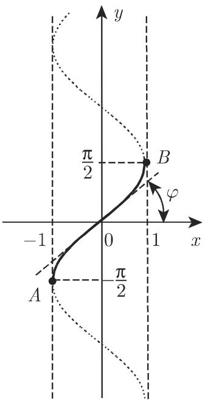
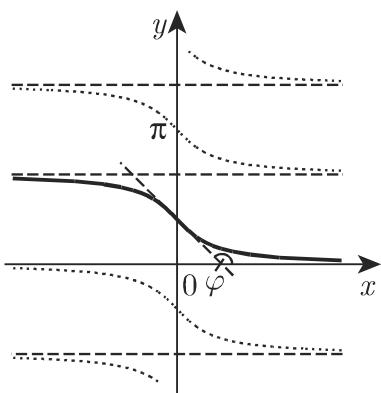
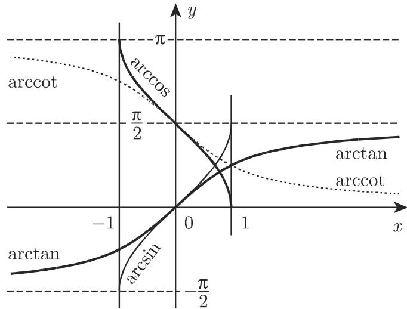

# 数学手册(原书第10版) 2.8 测圆或反三角函数

《数学手册(原书第10版)》第 2.8 节「测圆或反三角函数」系统给出反三角函数（手册又称测圆函数、弧函数）的完整体系：将三角函数定义域分解为单调区间并以指标 $k$ 区分（式 2.140、表 2.6），把一切值约化为主值（式 2.141–2.144），建立主值间的互换关系（式 2.145–2.150）与负角公式（式 2.151–2.154），给出 arcsin、arccos、arctan 的和差公式（式 2.155–2.160）与倍角关系（式 2.161–2.163），并以 $\cos(n\arccos x)=T_n(x)$ 引出切比雪夫多项式（式 2.164–2.165）。本节是 [[10-数学手册原书第10版--10-27-三角函数角函数--a2ypwy]]（2.7 三角函数）的反函数篇章，也是 [[连续严格单调函数的反函数存在且连续]]（2.1.5.5）的最完整实例化。

## 章节结构

| 小节 | 主题 | 公式 |
| --- | --- | --- |
| 2.8.1 | 反三角函数的定义 | 式 2.140a/b，表 2.6，图 2.43–2.46 |
| 2.8.2 | 约化为主值 | 式 2.141–2.144，算例 A–C，图 2.47 |
| 2.8.3 | 主值间的关系 | 式 2.145–2.150 |
| 2.8.4 | 负角公式 | 式 2.151–2.154 |
| 2.8.5 | arcsin x 与 arcsin y 的和与差 | 式 2.155–2.156 |
| 2.8.6 | arccos x 与 arccos y 的和与差 | 式 2.157–2.158 |
| 2.8.7 | arctan x 与 arctan y 的和与差 | 式 2.159–2.160 |
| 2.8.8 | arcsin x、arccos x 及 arctan x 间的特殊关系 | 式 2.161–2.165 |

## 一、定义：单调区间分解（式 2.140、表 2.6）

手册以正弦为示范：$y=\sin x$ 的定义域分解为单调区间 $k\pi-\frac{\pi}{2}\leqslant x\leqslant k\pi+\frac{\pi}{2}$（$k=0,\pm1,\pm2,\dots$），曲线 $y=\sin x$ 沿直线 $y=x$ 反射得反函数

$$y=\operatorname{arc}_{k}\sin x \tag{2.140a}$$

其定义域与值域分别为 $-1\leqslant x\leqslant+1$ 与 $k\pi-\frac{\pi}{2}\leqslant y\leqslant k\pi+\frac{\pi}{2}$（2.140b），且 $y=\operatorname{arc}_{k}\sin x$ 亦即 $x=\sin y$。其余反函数类似可得（图 2.44–2.46）。

表 2.6 反三角函数的定义域和值域（原文照录）：

| 反函数 | 定义域 | 值域 | 具有相同意义的三角函数 |
| --- | --- | --- | --- |
| arcsin：$y=\operatorname{arc}_{k}\sin x$ | $-1\leqslant x\leqslant 1$ | $k\pi-\frac{\pi}{2}\leqslant y\leqslant k\pi+\frac{\pi}{2}$ | $x=\sin y$ |
| arccos：$y=\operatorname{arc}_{k}\cos x$ | $-1\leqslant x\leqslant 1$ | $k\pi\leqslant y\leqslant (k+1)\pi$ | $x=\cos y$ |
| arctan：$y=\operatorname{arc}_{k}\tan x$ | $-\infty<x<\infty$ | $k\pi-\frac{\pi}{2}<y<k\pi+\frac{\pi}{2}$ | $x=\tan y$ |
| arccot：$y=\operatorname{arc}_{k}\cot x$ | $-\infty<x<\infty$ | $k\pi<y<(k+1)\pi$ | $x=\cot y$ |

闭区间（arcsin/arccos，对应原函数达到 $\pm1$）与开区间（arctan/arccot，对应原函数趋于 $\pm\infty$）的差别值得注意。本节仅覆盖这四种反函数，未涉及 arcsec/arccsc（2.7 节的正割/余割在此无对应处理）。

## 二、约化为主值（式 2.141–2.144，图 2.47）

$k=0$ 时的值称为主值，用不含指标的记号表示，如 $\arcsin x\equiv\operatorname{arc}_0\sin x$。

$$\operatorname{arc}_{k}\sin x=k\pi+(-1)^{k}\arcsin x \tag{2.141}$$

$$\operatorname{arc}_{k}\cos x=\begin{cases}(k+1)\pi-\arccos x, & k\text{ 为奇数},\\ k\pi+\arccos x, & k\text{ 为偶数};\end{cases} \tag{2.142}$$

$$\operatorname{arc}_{k}\tan x=k\pi+\arctan x \tag{2.143}$$

$$\operatorname{arc}_{k}\cot x=k\pi+\operatorname{arccot} x \tag{2.144}$$

算例（原文照录）：

- A：$\arcsin 0=0$，$\operatorname{arc}_k\sin 0=k\pi$。
- B：$\operatorname{arccot}1=\frac{\pi}{4}$，$\operatorname{arc}_{k}\cot 1=\frac{\pi}{4}+k\pi$。
- C：$\arccos\frac{1}{2}=\frac{\pi}{3}$，$\operatorname{arc}_k\cos\frac{1}{2}=\begin{cases}-\frac{\pi}{3}+(k+1)\pi, & k\text{ 为奇数},\\ \frac{\pi}{3}+k\pi, & k\text{ 为偶数}.\end{cases}$

注：计算器给出的是反三角函数的主值。

## 三、主值间的关系（式 2.145–2.150）

$$\arcsin x=\frac{\pi}{2}-\arccos x=\arctan\frac{x}{\sqrt{1-x^{2}}}=\begin{cases}-\arccos\sqrt{1-x^{2}}, & -1\leqslant x\leqslant0,\\ \arccos\sqrt{1-x^{2}}, & 0\leqslant x\leqslant1,\end{cases} \tag{2.145}$$

$$\arccos x=\frac{\pi}{2}-\arcsin x=\operatorname{arccot}\frac{x}{\sqrt{1-x^{2}}}=\begin{cases}\pi-\arcsin\sqrt{1-x^{2}}, & -1\leqslant x\leqslant0,\\ \arcsin\sqrt{1-x^{2}}, & 0\leqslant x\leqslant1,\end{cases} \tag{2.146}$$

（转写文本中 2.146 第一分支条件作「$\pi-1\leqslant x\leqslant 0$」，为空集，疑为「$-1\leqslant x\leqslant 0$」之误，见 [[式2-146条件π减1是否应为负1]]；上式按更正后条件登记。）

$$\arctan x=\frac{\pi}{2}-\operatorname{arccot}x=\arcsin\frac{x}{\sqrt{1+x^{2}}} \tag{2.147}$$

$$\arctan x=\begin{cases}\operatorname{arccot}\frac{1}{x}-\pi, & x<0,\\ \operatorname{arccot}\frac{1}{x}, & x>0,\end{cases}=\begin{cases}-\arccos\frac{1}{\sqrt{1+x^{2}}}, & x\leqslant0,\\ \arccos\frac{1}{\sqrt{1+x^{2}}}, & x\geqslant0,\end{cases} \tag{2.148}$$

$$\operatorname{arccot}x=\frac{\pi}{2}-\arctan x=\arccos\frac{x}{\sqrt{1+x^{2}}} \tag{2.149}$$

$$\operatorname{arccot}x=\begin{cases}\arctan\frac{1}{x}+\pi, & x<0,\\ \arctan\frac{1}{x}, & x>0,\end{cases}=\begin{cases}\pi-\arcsin\frac{1}{\sqrt{1+x^{2}}}, & x\leqslant0,\\ \arcsin\frac{1}{\sqrt{1+x^{2}}}, & x\geqslant0.\end{cases} \tag{2.150}$$

## 四、负角公式（式 2.151–2.154）

$$\arcsin(-x)=-\arcsin x \tag{2.151}$$

$$\arctan(-x)=-\arctan x \tag{2.152}$$

$$\arccos(-x)=\pi-\arccos x \tag{2.153}$$

$$\operatorname{arccot}(-x)=\pi-\operatorname{arccot}x \tag{2.154}$$

## 五、和差公式（式 2.155–2.160）

$$\arcsin x+\arcsin y=\begin{cases}\arcsin\left(x\sqrt{1-y^{2}}+y\sqrt{1-x^{2}}\right), & xy\leqslant0\ \text{或}\ x^{2}+y^{2}\leqslant1,\\ \pi-\arcsin\left(x\sqrt{1-y^{2}}+y\sqrt{1-x^{2}}\right), & x>0,\ y>0,\ x^{2}+y^{2}>1,\\ -\pi-\arcsin\left(x\sqrt{1-y^{2}}+y\sqrt{1-x^{2}}\right), & x<0,\ y<0,\ x^{2}+y^{2}>1,\end{cases} \tag{2.155}$$

$$\arcsin x-\arcsin y=\begin{cases}\arcsin\left(x\sqrt{1-y^{2}}-y\sqrt{1-x^{2}}\right), & xy\geqslant0\ \text{或}\ x^{2}+y^{2}\leqslant1,\\ \pi-\arcsin\left(x\sqrt{1-y^{2}}-y\sqrt{1-x^{2}}\right), & x>0,\ y<0,\ x^{2}+y^{2}>1,\\ -\pi-\arcsin\left(x\sqrt{1-y^{2}}-y\sqrt{1-x^{2}}\right), & x<0,\ y>0,\ x^{2}+y^{2}>1,\end{cases} \tag{2.156}$$

（转写文本中 2.155–2.156 的编号 (2.155a)(2.155b)(2.155c)(2.156a)(2.156b)(2.156c) 漂移、条件行「(x < 0, y < 0, x² + y² > 1)」孤立出现又随 −π 分支重复，上式为复原后的结构，见 [[式2-155与2-156编号及条件行错乱如何复原]]。）

$$\arccos x+\arccos y=\begin{cases}\arccos\left(xy-\sqrt{1-x^{2}}\sqrt{1-y^{2}}\right), & x+y\geqslant0,\\ 2\pi-\arccos\left(xy-\sqrt{1-x^{2}}\sqrt{1-y^{2}}\right), & x+y<0,\end{cases} \tag{2.157}$$

$$\arccos x-\arccos y=\begin{cases}-\arccos\left(xy+\sqrt{1-x^{2}}\sqrt{1-y^{2}}\right), & x\geqslant y,\\ \arccos\left(xy+\sqrt{1-x^{2}}\sqrt{1-y^{2}}\right), & x<y,\end{cases} \tag{2.158}$$

（转写文本中 2.158 前的等式左端「arccos x − arccos y =」丢失，上式左端为数学推断复原，见 [[式2-158前是否缺失arccos差公式标题行]]。）

$$\arctan x+\arctan y=\begin{cases}\arctan\frac{x+y}{1-xy}, & xy<1,\\ \pi+\arctan\frac{x+y}{1-xy}, & x>0,\ xy>1,\\ -\pi+\arctan\frac{x+y}{1-xy}, & x<0,\ xy>1,\end{cases} \tag{2.159}$$

$$\arctan x-\arctan y=\begin{cases}\arctan\frac{x-y}{1+xy}, & xy>-1,\\ \pi+\arctan\frac{x-y}{1+xy}, & x>0,\ xy<-1,\\ -\pi+\arctan\frac{x-y}{1+xy}, & x<0,\ xy<-1,\end{cases} \tag{2.160}$$

## 六、倍角关系与切比雪夫多项式（式 2.161–2.165）

$$2\arcsin x=\begin{cases}\arcsin\left(2x\sqrt{1-x^{2}}\right), & |x|\leqslant\frac{1}{\sqrt{2}},\\ \pi-\arcsin\left(2x\sqrt{1-x^{2}}\right), & \frac{1}{\sqrt{2}}<x\leqslant1,\\ -\pi-\arcsin\left(2x\sqrt{1-x^{2}}\right), & -1\leqslant x<-\frac{1}{\sqrt{2}},\end{cases} \tag{2.161}$$

$$2\arccos x=\begin{cases}\arccos\left(2x^{2}-1\right), & 0\leqslant x\leqslant1,\\ 2\pi-\arccos\left(2x^{2}-1\right), & -1\leqslant x<0,\end{cases} \tag{2.162}$$

$$2\arctan x=\begin{cases}\arctan\frac{2x}{1-x^{2}}, & |x|<1,\\ \pi+\arctan\frac{2x}{1-x^{2}}, & x>1,\\ -\pi+\arctan\frac{2x}{1-x^{2}}, & x<-1,\end{cases} \tag{2.163}$$

$$\cos(n\arccos x)=T_n(x)\quad(n\geqslant1) \tag{2.164}$$

其中的 $n$ 亦可能为分数；

$$T_n(x)=\frac{(x+\sqrt{x^{2}-1})^{n}+(x-\sqrt{x^{2}-1})^{n}}{2} \tag{2.165}$$

对任意整数 $n$，$T_n(x)$ 是关于 $x$ 的多项式（切比雪夫多项式）。关于切比雪夫多项式的性质参见手册第 1283 页 19.6.3（尚未转写）。

## 转写保真度与勘误清单

1. **式 2.146 条件疑似笔误**：分段条件作「$\pi-1\leqslant x\leqslant 0$」；因 $\pi-1\approx2.14>0$，该区间为空集，正确条件应为 $-1\leqslant x\leqslant 0$。极可能为「−1」被误转写为「π − 1」。见 [[式2-146条件π减1是否应为负1]]。
2. **式 2.155–2.156 编号与条件行错乱**：孤立条件行出现一次又随 −π 分支重复，编号 (2.155c)(2.156a)(2.156b) 漂移到错误位置。见 [[式2-155与2-156编号及条件行错乱如何复原]]。
3. **式 2.158 缺失标题行**：「arccos x − arccos y =」在 2.158a 前丢失。见 [[式2-158前是否缺失arccos差公式标题行]]。
4. **图 2.43 与图 2.44 图题错位**：「图2.44」题注先于「图2.43」出现，与 [[图2-32图2-35图2-41图题错位及式2-70被截断如何修复]] 所记录的跨节模式一致。见 [[图2-43与图2-44图题错位如何修复]]。
5. 2.8.8 标题中「arcos x」为「arccos x」的漏字。
6. 边界留白（非错误）：式 2.159/2.160 未覆盖 $xy=\pm1$、式 2.163 未覆盖 $x=\pm1$，此时结果为 $\pm\frac{\pi}{2}$（公式自变量趋于无穷），属手册惯用的严格不等式口径。
7. 覆盖不对称（非错误）：2.7 节完整处理正割/余割，本节未涉及 arcsec/arccsc。

## 内部张力（非转写错误）

式 2.164 中 $\arccos x$ 要求 $|x|\leqslant1$，而式 2.165 的闭式含 $\sqrt{x^{2}-1}$，仅在 $|x|\geqslant1$ 时取实值；二者对整数 $n$ 靠多项式恒等关系（或复数延拓）沟通，手册未加说明。详见 [[切比雪夫多项式]]。

## 图像资源

本节含五幅插图，转写文本中的图题顺序存在错位（详见 [[图2-43与图2-44图题错位如何修复]]）：

- `media/10-数学手册原书第10版--11-28-测圆或反三角函数--1yi9enf/001-e9cc8b75b9ae28c8b0b300b94e2cb0cbdba9865b1d6453a86f6103517011cf9f.jpg` — 正文首图（2.8.1，未带图题，对应反正弦的定义示意）
- `media/10-数学手册原书第10版--11-28-测圆或反三角函数--1yi9enf/002-98fd7f2230ed1d84d78c2f786212d025ca96c67e1cc0640c3d8c4b1a1d6db6b0.jpg` — 其后紧随「图2.44」题注
- `media/10-数学手册原书第10版--11-28-测圆或反三角函数--1yi9enf/003-54ce6796370384d137465cb54c3cfc56222c37094e745629fd55bf60e687c056.jpg` — 「图2.43」题注出现于其前、「图2.45」题注出现于其后
- `media/10-数学手册原书第10版--11-28-测圆或反三角函数--1yi9enf/004-2e23caeba2a4191ff65c654370781b08ce573b8f38f0e40544994bf9302eb9b8.jpg` — 其后为「图2.46」
- `media/10-数学手册原书第10版--11-28-测圆或反三角函数--1yi9enf/005-4c5b6634171299bb0eaa04bcf3c5891b506a0984b40c3ccc866cc082a619c494.jpg` — 其后为「图2.47」（主值图）

## 与既有维基内容的联系

- 上游：[[10-数学手册原书第10版--10-27-三角函数角函数--a2ypwy]]（2.7 节）建立六种三角函数体系；[[三角函数]]、[[正弦函数]]、[[余弦函数]]、[[正切函数]]、[[余切函数]] 为四个反函数概念页的对偶。
- 定理实例化：单调区间分解正是 [[连续严格单调函数的反函数存在且连续]] 的应用。
- 公式族镜像：[[加法定理]] ↔ 式 2.155–2.160；[[倍角公式]] ↔ 式 2.161–2.163；[[棣莫弗公式]] ↔ 式 2.164–2.165；[[诱导公式]] 与 [[象限关系与简化公式]] 的 $k\pi\pm\frac{\pi}{2}$ 模式在式 2.141–2.144 中重现。
- 口径警示：手册取 arccot 主值域为 $(0,\pi)$，式 2.147/2.149/2.154 的形式依赖该约定，不可外推到采用 $(-\frac{\pi}{2},\frac{\pi}{2}]$ 约定的其他文献。

## 证据强度评估

- 数学内容：强。分析中对式 2.141–2.145、2.148、2.150、2.155–2.163 做了抽样符号/数值核验（如 $x=\pm1$、$x=y=\sqrt3$、$x=1/y=-1$ 等边界点），全部通过。
- 转写保真度：中等偏低，见勘误清单第 1–4 条。

<!-- llm-wiki:embedded-images -->
## Embedded Images

### Document

<!-- llm-wiki:embedded-images -->
