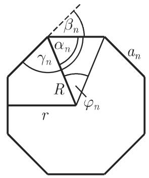
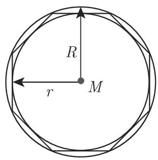

# 数学手册(原书第10版) 3.1.5 平面上的多边形

《数学手册(原书第10版)》「3.1 平面几何学」的第 5 小节（式 3.44–3.57，图 3.22–3.24，表 3.2），分三部分：3.1.5.1 一般多边形的角和与对角线数；3.1.5.2 正凸多边形的角量体系与「半径—边长—周长—面积」度量体系（含倍边、倍面积递推）；3.1.5.3 借助表 3.2 汇集三、五、六、八、十边形的根式性质，并以正五边形—五角星形的嵌套自相似论证对角线与边的不可公度性（黄金分割）。本节是 [[sources/10-数学手册原书第10版--8-31-平面几何学--g0i8gh]] 的子节，直接衔接 [[sources/10-数学手册原书第10版--8-311-基本概念--mrusl5]]（3.1.1 基本概念）。

## 3.1.5.1 一般多边形

由直线段作为边所围成的一个封闭平面图形可以分解成 n − 2 个三角形（图 3.22）。其外角 βᵢ 之和、内角 γᵢ 之和以及对角线数为：

```
Σ_{i=1}^{n} β_i = 360°              (3.44)
Σ_{i=1}^{n} γ_i = 180°·(n − 2)      (3.45)
D = n(n − 3)/2                       (3.46)
```


图 3.22 一般多边形的三角剖分

注意：源文 3.1.5.1 只称「封闭平面图形」而未限定凸性，而式 3.44 的外角和 360° 严格地说对凸多边形（或采用有向外角约定）成立，存在轻度表述张力（见 [[queries/外角和360度是否限于凸多边形]]）。详见 [[findings/一般多边形角和对角线公式]]。

## 3.1.5.2 正凸多边形

正凸多边形（图 3.23）具有 n 条相等的边和 n 个相等的角。边的中垂线的交点是内切圆（半径 r）和外接圆（半径 R）的公共中心 M。这些多边形的边是内切圆的切线和外接圆的弦：对内切圆而言形成外切多边形（切线多边形），对外接圆而言形成内接多边形。分解一个正凸 n 边形将得到 n 个环绕中心的等腰全等三角形——这是本小节全部公式的推导根基（见 [[methodology/正多边形中心三角形分解法]]）。


图 3.23(a) 正凸多边形（内切圆/外接圆）


图 3.23(b) 正凸多边形

角量体系（中心角 φₙ、底角 αₙ、外角 βₙ、内角 γₙ）：

```
φ_n = 360°/n                          (3.47)
α_n = (1 − 2/n)·90°                   (3.48)
β_n = 360°/n                          (3.49)
γ_n = 180° − β_n                      (3.50)
```

度量体系（外接圆半径 R、内切圆半径 r、边长 aₙ、周长 U、面积 Sₙ）：

```
R = a_n / (2·sin(180°/n)),  R² = r² + a_n²/4                 (3.51)
r = (a_n/2)·cot(180°/n) = R·cos(180°/n)                      (3.52)
a_n = 2√(R² − r²) = 2R·sin(φ_n/2) = 2r·tan(φ_n/2)            (3.53)
U = n·a_n                                                    (3.54)
S_n = (1/2)·n·a_n·r = n·r²·tan(φ_n/2)
    = (1/2)·n·R²·sin φ_n = (1/4)·n·a_n²·cot(φ_n/2)           (3.56)
```

倍边与倍面积递推（2n 边形的边长与面积）：

```
a_{2n} = R·√(2 − 2√(1 − (a_n/(2R))²))
a_n    = a_{2n}·√(4 − a_{2n}²/R²)                            (3.55)

S_{2n} = (n·R²/√2)·√(1 − √(4·S_n²/(n²·R⁴)))     [转写字面，见下注]
S_n    = S_{2n}·√(1 − S_{2n}²/(n²·R⁴))                      (3.57)
```

**转写存疑（重要）**：式 3.57 前半按转写字面数值不成立（n = 4 时代入得 S₈ = 0，真值为 2√2·R²；n = 6 时得 6·sin15°·R² ≈ 1.553R²，真值为 3R²）。若在内层根号内补「1 −」，即 S_{2n} = (n·R²/√2)·√(1 − √(1 − 4·S_n²/(n²·R⁴)))，则对 n ≥ 4 正确（n = 3 需取另一支）。疑为转写丢失内层「1 −」，见 [[queries/式3-57的S2n式内层是否漏了1减]]；式 3.55 两向与式 3.57 后半均验证自洽。

详见 [[findings/正凸多边形角量体系]]、[[findings/正凸多边形半径边长面积公式]]、[[findings/正多边形倍边与倍面积递推]]。

## 3.1.5.3 某些正凸多边形

源文将某些正凸多边形的性质汇集在表 3.2 中，并对五边形与五角星形作重点讨论：据信梅塔蓬图姆的希帕索斯（Hippasus of Metapontum，约公元前 450）通过这些多边形的性质认识到无理数（源文指向 1.1.1.2；此为传说性归因，源文以「据信」措辞，应弱记录）。论证链：正五边形的对角线（图 3.24）构成一个内接五角星形，其边又围成一个正五边形；对角线与边之比等于边与（对角线 − 边）之比，即 a₀:a₁ = a₁:(a₀ − a₁) = a₁:a₂，其中 a₂ = a₀ − a₁；嵌套递推 a₃ = a₁ − a₂，a₄ = a₂ − a₃，……保持比例不变；欧几里得算法 a₀ = 1·a₁ + a₂，a₁ = 1·a₂ + a₃，a₂ = 1·a₃ + a₄，……的商 qₙ = 1 恒定、永不终止，故 a₁ 与 a₀ 不可公度；由 a₀:a₁ 所确定的连分数与 1.1.1.4 第 3 点中的黄金分割完全相同，即它导致一个无理数。


图 3.24 正五边形与内接五角星形的嵌套

详见 [[findings/正五边形对角线与边不可公度]]、[[concepts/五角星形]]、[[concepts/黄金分割]]、[[concepts/欧几里得算法]]。

### 表 3.2 一些正多边形的性质（转写原文，逐字）

转写中根号横线与括号系统性丢失（如「R/2√10-2√5」应读作 (R/2)·√(10−2√5)；上下标亦常脱落，a3 即 a₃、R2 即 R²）：

```
正多边形 | a_n            | R                  | r                    | S_n
三边形   | a3=R√3=2r√3    | =a3/3√3=2r=2/3h    | =a3/6√3=R/2=1/3h     | =a2/4√3=3R2/4√3
         | h=a3/2√3=3/2R  |                    |                      | =3r2√3
五边形   | a5=R/2√10-2√5  | =a5/10√50+10√5     | =a5/10√25+10√5       | =a2/4√25+10√5
         | =2r√5-2√5      | =r(√5-1)           | =R/4(√5+1)           | =5R2/8√10+2√5
         |                |                    |                      | =5r2√5-2√5
六边形   | a6=2/3r√3      | =2/3r√3            | =R/2√3               | =3a2/2√3=3R2/2√3
         |                |                    |                      | =2r2√3
八边形   | a8=R√2-√2      | =a8/2√4+2√2        | =a8/2(√2+1)          | =2a2/8(√2+1)
         | =2r(√2-1)      | =r√4-2√2           | =R/2√2+√2            | =2R2√2
         |                |                    |                      | =8r2(√2-1)
十边形   | a10=R/2(√5-1)  | =a10/2(√5+1)       | =a10/2√5+2√5         | =5a2/2√5+2√5
         | =2r/5√25-10√5 | =r/5√50-10√5       | =R/4√10+2√5          | =5R2/4√10-2√5
         |                |                    |                      | =2r2√25-10√5
```

复原读法（恢复根号横线后经数值复核与式 3.51–3.56 一致）见 [[findings/表3-2五种正多边形根式性质]] 与 [[comparisons/五种正多边形性质比较]]。唯一存疑条目为八边形面积的 a₈² 形式「2a2/8(√2+1)」（见 [[queries/表3-2八边形面积条目2a2是否为a8平方之误]]）。表 3.2 无正方形（n = 4）行（见 [[queries/表3-2是否原书即缺正方形行]]）。

## 转写缺陷清单

- **单变量脱落（系统性）**：3.1.5.2 正文多处脱落单斜体变量——「具有 条相等的边和 个相等的角」「半径分别为 的内切圆」「分解一个正凸 边形将得到 个……三角形」「 边形的面积」均缺 n（或 r、R），为典型 OCR 单斜体变量脱落（见 [[queries/3-1-5-2正文单变量脱落是否为转写丢字]]）。
- **式 3.57 前半疑漏内层「1 −」**：见上文存疑注与 [[queries/式3-57的S2n式内层是否漏了1减]]。
- **OCR 讹字**：「平而」→平面、「等千」→等于、「对千」→对于、「欧儿里得」→欧几里得；「参见第 1.1.1.2」的「第」字可疑。
- **表 3.2 根号横线与括号全部丢失**：复原读法需据原书核定（见 [[queries/表3-2根号与括号复原读法是否需据原书核定]]）。
- **缺失页码与残留符号**：「与第 页， 1.1.1.4, 3., ■ 中的黄金分割」缺页码且残留「■」（见 [[queries/五角星段缺失页码与方块残留是否为转写损坏]]）。

## 与其他章节及既有条目的联系

- 角度公式全部以度制书写，直接复用 [[concepts/角]]、[[concepts/度分秒]]、[[concepts/弧度]]；内角 γₙ 随 n 变化落入 [[findings/角的六类名称与区间]] 所列各类角。
- 本节两次前向引用第 1 章：1.1.1.2（无理数）、1.1.1.4 第 3 点（黄金分割/连分数），该章尚未入库。
- 3.1.2–3.1.4（式 3.3–3.43）亦未见入库记录，本节「分解成三角形」的论述与这些小节相关。
- 消歧：本节的「五角星形」（正五边形对角线构成的星形多边形）与 [[concepts/星形线]]（astroid，§2.13 的四尖点曲线）仅字面相近，对象完全不同。

## 派生条目

- 概念：[[concepts/多边形]]、[[concepts/正凸多边形]]、[[concepts/内切圆与外接圆]]、[[concepts/正五边形]]、[[concepts/五角星形]]、[[concepts/黄金分割]]、[[concepts/欧几里得算法]]
- 发现：[[findings/一般多边形角和对角线公式]]、[[findings/正凸多边形角量体系]]、[[findings/正凸多边形半径边长面积公式]]、[[findings/正多边形倍边与倍面积递推]]、[[findings/正五边形对角线与边不可公度]]、[[findings/表3-2五种正多边形根式性质]]
- 方法与比较：[[methodology/正多边形中心三角形分解法]]、[[comparisons/五种正多边形性质比较]]
- 待查：上文转写缺陷清单所列七个 query。

<!-- llm-wiki:embedded-images -->
## Embedded Images

### Document


<!-- llm-wiki:embedded-images -->
