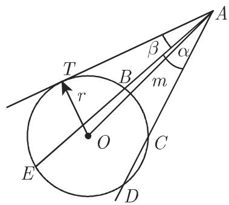
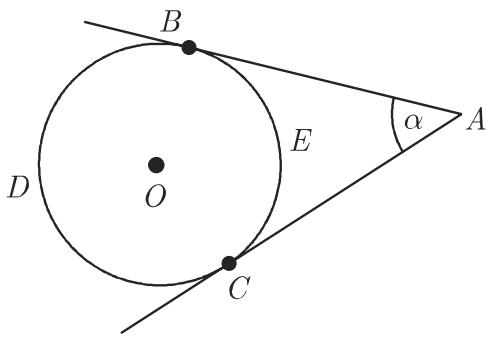

# 数学手册(原书第10版) 3.1.6 圆和有关的图形

本条目是 [[entities/数学手册原书第10版]] 3.1 章「平面几何学」的第 6 小节，主题为圆及其有关的图形（弦、割线、切线、弓形、扇形、圆环），收录式 3.58–3.82 共 25 组公式与图 3.25–3.30。全节为参考性「定义—定理—公式」语料而非论证性文本，内容分三大块：圆的基本量与三条幂定理（式 3.58–3.64）、圆中五类角的弧量公式（式 3.65–3.70）、弓形/扇形/圆环的量度公式（式 3.71–3.82）。六幅插图的图像文件齐备（见「图像清单」），是核验本节两个未定义符号 m、b 的关键证据。

## 小节结构与定义群

- **3.1.6.1**（无小节标题，疑为「圆」）：圆、半径、弦、割线、切线的定义；三条幂定理；周长/面积/半径/直径公式；圆中各角公式。
- **3.1.6.2 圆弓形和圆扇形**：定义量为半径与圆心角（图 3.29）；确定弦、圆心角、弓形的高、弧长、扇形面积、弓形面积。
- **3.1.6.3 圆环**：定义量为外环半径、内环半径与圆心角 φ（图 3.30）；确定直径、平均半径、宽度、面积与部分圆环面积。

3.1.6.1 开头的定义群（逐字转录，割线与切线一句在源文中缺标点）：

> 圆是平面上与一个给定点即圆心保持相同给定距离的点的轨迹．该距离本身，还有连接圆心与圆上任意点之间的线段称为半径．圆的圆周环绕着圆的面积．连接圆上两点的线段称为弦．穿过圆上两点的直线称为割线和圆只有一个公共点的直线称为该圆的切线

## 公式全量收录（逐字转录）

**转录说明**：源文中角记号 ∠ 在式 3.65a–3.70 被损坏为 `\nless` 或 `\not\prec`，以下按源文原样保留（见「转写疑点」第 5 条）；3.1.6.2、3.1.6.3 定义句中的下划线 ＿ 标记源文缺失符号的位置。

### 三条幂定理（式 3.58–3.60）

弦定理（图 3.26）：

$$
\overline {A C} \cdot \overline {A D} = \overline {A B} \cdot \overline {A E} = r ^ {2} - m ^ {2}.\tag{3.58}
$$

割线定理（图 3.27）：

$$
\overline {A B} \cdot \overline {A E} = \overline {A C} \cdot \overline {A D} = m ^ {2} - r ^ {2}.\tag{3.59}
$$

切割线定理（图 3.27）：

$$
\overline {A T} ^ {2} = \overline {A B} \cdot \overline {A E} = \overline {A C} \cdot \overline {A D} = m ^ {2} - r ^ {2}.\tag{3.60}
$$

### 周长、面积、半径、直径（式 3.61–3.64）

$$
U = 2 \pi r \approx 6. 2 8 3 r, U = \pi d \approx 3. 1 4 2 d, U = 2 \sqrt {\pi S} \approx 3. 5 4 5 \sqrt {S}.\tag{3.61}
$$

$$
S = \pi r ^ {2} \approx 3. 1 4 2 r ^ {2}, S = \frac {\pi d ^ {2}}{4} \approx 0. 7 8 5 d ^ {2}, S = \frac {U d}{4}.\tag{3.62}
$$

$$
r = \frac {U}{2 \pi} \approx 0. 1 5 9 U.\tag{3.63}
$$

$$
d = 2 r = 2 \sqrt {\frac {S}{\pi}} \approx 1. 1 2 8 \sqrt {S}.\tag{3.64}
$$

源文注（原文如此）：「对千下列与角有关的公式见第 168 3.1.1.2 中角的定义」（「对千」应为「对于」，「第 168」后缺「页」字）。

### 圆中的角（式 3.65–3.70）

圆周角（图 3.25）：

$$
\alpha = \frac {1}{2} \widehat {B C} = \frac {1}{2} \nless B O C = \frac {1}{2} \varphi .\tag{3.65a}
$$

泰勒斯定理的一种特殊情形（参见第 188 3.2.1）：

$$
\varphi = 1 8 0 ^ {\circ}, \quad \text {即} \quad \alpha = 9 0 ^ {\circ}.\tag{3.65b}
$$

弦与切线之间的夹角（图 3.25）：

$$
\beta = \frac {1}{2} \widehat {A C} = \frac {1}{2} \nless C O A.\tag{3.66}
$$

内角（图 3.26）：

$$
\gamma = \frac {1}{2} (\widehat {C B} + \widehat {E D}) = \frac {1}{2} (\nless B O C + \nless E O D).\tag{3.67}
$$

外角（图 3.27）：

$$
\alpha = \frac {1}{2} (\widehat {D E} - \widehat {B C}) = \frac {1}{2} (\nless E O C - \nless C O B).\tag{3.68}
$$

割线与切线之间的夹角（图 3.27）：

$$
\beta = \frac {1}{2} (\widehat {T E} - \widehat {T B}) = \frac {1}{2} (\nless T O E - \nless B O T).\tag{3.69}
$$

切线角（图 3.28）是左边弧和右边弧上的任意一点（原文如此，句子缺主语）：

$$
\begin{array}{r l} \alpha & = \frac {1}{2} (\widehat {B D C} - \widehat {C E B}) = \frac {1}{2} (\not \prec B O C - \not \prec C O B) \\ & = \frac {1}{2} (3 6 0 ^ {\circ} - \not \prec C O B - \not \prec C O B) = 1 8 0 ^ {\circ} - \not \prec C O B. \end{array}\tag{3.70}
$$

### 圆弓形和圆扇形（式 3.71–3.76）

定义量 半径＿和圆心角＿（图 3.29）．要确定的量是：

弦：

$$
a = 2 \sqrt {2 h r - h ^ {2}} = 2 r \sin {\frac {\alpha}{2}}.\tag{3.71}
$$

圆心角：

$$
\alpha = 2 \arcsin {\frac {a}{2 r}} (\alpha \text {以度度量}).\tag{3.72}
$$

弓形的高：

$$
h = r - \sqrt {r ^ {2} - \frac {a ^ {2}}{4}} = r \left(1 - \cos {\frac {\alpha}{2}}\right) = \frac {a}{2} \tan {\frac {\alpha}{4}}.\tag{3.73}
$$

弧长：

$$
l = \frac {2 \pi r \alpha}{3 6 0} \approx 0. 0 1 7 4 5 r \alpha \quad (\alpha \text {以弧度度量})\tag{3.74a}
$$

$$
l \approx {\frac {8 b - a}{3}} \quad {\text {或}} \quad l \approx {\sqrt {a ^ {2} + {\frac {1 6}{3}} h ^ {2}}}.\tag{3.74b}
$$

扇形面积：

$$
S = \frac {\pi r ^ {2} \alpha}{3 6 0} \approx 0. 0 0 8 7 3 r ^ {2} \alpha .\tag{3.75}
$$

弓形面积：

$$
S = \frac {r ^ {2}}{2} \left(\frac {\pi \alpha}{1 8 0} - \sin \alpha\right) = \frac {1}{2} [ l r - a (r - h) ], \quad S \approx \frac {h}{1 5} (6 a + 8 b).\tag{3.76}
$$

### 圆环（式 3.77–3.82）

圆环的定义量 外环半径＿、内环半径＿和圆心角 $\varphi$（图 3.30）：

$$
D = 2 R.\tag{3.77}
$$

$$
d = 2 r.\tag{3.78}
$$

$$
\rho = \frac {R + r}{2}.\tag{3.79}
$$

$$
\delta = R - r.\tag{3.80}
$$

圆环面积：

$$
S = \pi (R ^ {2} - r ^ {2}) = \frac {\pi}{4} (D ^ {2} - d ^ {2}) = 2 \pi \rho \delta .\tag{3.81}
$$

对应圆心角 $\varphi$ 的圆环面积（图 3.30 中的阴影面积）：

$$
S _ {\varphi} = \frac {\varphi \pi}{3 6 0} \left(R ^ {2} - r ^ {2}\right) = \frac {\varphi \pi}{1 4 4 0} \left(D ^ {2} - d ^ {2}\right) = \frac {\varphi \pi}{1 8 0} \rho \delta (\varphi \mathrm {以弧度度量}).\tag{3.82}
$$

## 图像清单

本节六幅插图图像文件齐备（不同于此前若干小节的缺图情形），图 3.26、3.27、3.29 是核验未定义符号 m、b 的首选证据：

*图 3.25（圆周角，式 3.65a；弦与切线之间的夹角，式 3.66）*

*图 3.26（弦定理，式 3.58；内角，式 3.67）*

*图 3.27（割线定理，式 3.59；切割线定理，式 3.60；外角，式 3.68；割线与切线之间的夹角，式 3.69）*

*图 3.28（切线角，式 3.70）*

*图 3.29（圆弓形和圆扇形，式 3.71–3.76）*

*图 3.30（圆环与部分圆环阴影，式 3.77–3.82）*

## 核验状态

全部公式为标准欧氏几何结果，证据强度高；本库分析已完成独立代数互洽与数值抽检：

- 式 3.61–3.64 的近似系数核验：2√π ≈ 3.5449、π/4 ≈ 0.7854、1/(2π) ≈ 0.1592、2/√π ≈ 1.1284，全部相符（见 [[findings/圆的周长面积与半径直径互换公式]]）。
- 式 3.73 三形式互洽（依据 1 − cos(α/2) = 2sin²(α/4)）；式 3.76 两精确形式代数等价；式 3.81 三形式互洽（见 [[findings/弓形与扇形的量度公式]]、[[findings/圆环的量度公式]]）。
- 近似式数值抽检（r = 1）：α = 90° 时误差约 0.08%（(8b−a)/3 式）、约 0.2%（√ 式）、约 0.06%（面积式）；α = 180° 时约 1.2%、2.7%、1.1%——近似式随弓形增大而劣化，源文未给误差界（见 [[methodology/弓形弧长与面积的近似计算]]）。

## 转写疑点

1. **单位标注矛盾**：式 3.74a 括注「α以弧度度量」、式 3.82 括注「φ以弧度度量」，但两式系数（0.01745 = π/180）与结构（φπ/360）均为度制；式 3.72 括注「度」、式 3.75 系数 0.00873 = π/360 同构印证。见 [[queries/式3-74a与3-82的单位标注弧度是否应为度]]。
2. **式 3.68 角记号疑误**：∠EOC 与式 3.67 同构位置的 ∠EOD 用字不一致，疑 D 误作 C。见 [[queries/式3-68的角EOC是否应为角EOD]]。
3. **式 3.70 中间等式损坏**：½(∠BOC − ∠COB) 恒为零，与终式 180° − ∠COB 矛盾，第一个角应为对优弧的优角（360° − ∠COB）；同句「是左边弧和右边弧上的任意一点」缺主语。见 [[queries/式3-70中间等式与句子主语是否转写损坏]]。
4. **定义句符号缺失**：3.1.6.2「定义量 半径＿和圆心角＿」缺 r、α；3.1.6.3「外环半径＿、内环半径＿」缺 R、r；m（式 3.58–3.60）与 b（式 3.74b、3.76）全节未定义。见 [[queries/定义句符号与mb是否转写缺失]]。
5. **角记号损坏**：∠ 被转写为 `\nless`（式 3.65a–3.69）、`\not\prec`（式 3.70），为 [[queries/角记号not-subset是否为angle之误]]（3.1.1 中该记号被转写为 ⊄）增添新证据。
6. **措辞疑倒置**：「泰勒斯定理的一种特殊情形」——φ = 180° 情形本身即泰勒斯定理，原意应为「圆周角定理的特例（即泰勒斯定理）」，见 [[concepts/泰勒斯定理]]。
7. **杂项瑕疵**：「对千」应为「对于」；「第 168 3.1.1.2」「第 188 3.2.1」缺「页」字；3.1.6.1 无小节标题（疑为「圆」）；割线/切线定义句缺标点。

## 与其他小节及既有页面的联系

- 父级：[[sources/10-数学手册原书第10版--8-31-平面几何学--g0i8gh]]（3.1 平面几何学）。
- 角度单位：两处单位标注疑点直接落在 [[concepts/弧度]]、[[concepts/度分秒]]、[[concepts/角]] 的区分上；本节交叉引用的 3.1.1.2（第 168 页）已入库为 [[sources/10-数学手册原书第10版--8-311-基本概念--mrusl5]]。
- 三角形节（3.1.3）：[[concepts/外接圆]]、[[concepts/内切圆]] 是 [[concepts/圆]] 的衍生概念；圆周角定理是外接圆语境的后续工具。
- 前向引用：第 188 页 3.2.1（泰勒斯定理，属 3.2 章）尚未入库，入库时应回链 [[concepts/泰勒斯定理]]。
- 转写模式：定义句符号缺失与 [[queries/轴对称与截距定理段符号S与g是否缺失]]（3.1.3）同型。

## 本条目派生页面

- 概念：[[concepts/圆]]、[[concepts/弦定理]]、[[concepts/割线定理]]、[[concepts/切割线定理]]、[[concepts/圆周角]]、[[concepts/泰勒斯定理]]、[[concepts/圆中的角]]、[[concepts/圆弓形]]、[[concepts/圆扇形]]、[[concepts/圆环]]
- 发现：[[findings/圆的周长面积与半径直径互换公式]]、[[findings/弦割线切割线三定理与符号翻转]]、[[findings/圆周角定理与泰勒斯定理]]、[[findings/圆中五类角的弧量公式]]、[[findings/弓形与扇形的量度公式]]、[[findings/圆环的量度公式]]
- 比较：[[comparisons/弦定理割线定理与切割线定理比较]]、[[comparisons/圆中五类角比较]]
- 疑问：[[queries/式3-74a与3-82的单位标注弧度是否应为度]]、[[queries/定义句符号与mb是否转写缺失]]、[[queries/式3-68的角EOC是否应为角EOD]]、[[queries/式3-70中间等式与句子主语是否转写损坏]]
- 方法：[[methodology/弓形弧长与面积的近似计算]]

<!-- llm-wiki:embedded-images -->
## Embedded Images

### Document

<!-- llm-wiki:embedded-images -->
