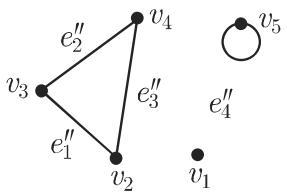
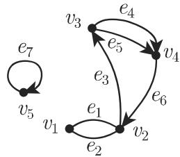
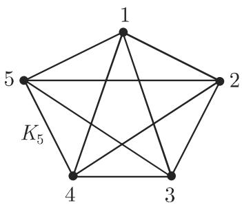
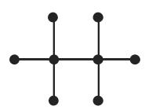
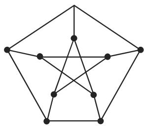
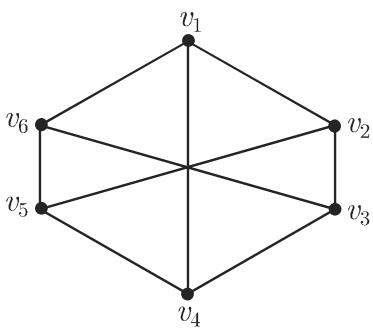

# 数学手册(原书第10版) 5.8.1 基本概念和记号

《数学手册（原书第10版）》5.8.1「基本概念和记号」是 5.8 节（图论）的首个小节：系统给出图论的形式化定义体系与记号，为后续各小节奠基。本系列此前已入库同章的 5.4.1–5.4.6（数论与编码）、5.5（保密学）、5.6（泛代数学）；本源是维基收录的**首个图论内容**。

## 覆盖范围

小节按 11 个编号条目组织（转写中第 3、5 条的编号丢失）：

1. 无向图和有向图（图与关联函数）
2. 邻接性
3. 简单图（重边、环）
4. 顶点的次数（外次、内次，式 5.316a–b）
5. 特殊的图类（有限图、r-正则图、完全图、二部图与完全二部图）
6. 图的表示（直观表示；[[entities/彼得森图]]）
7. 图的同构
8. 子图、因子
9. 邻接矩阵（式 5.317）
10. 关联矩阵（式 5.318–5.319）
11. 加权图

配图 5.25–5.37 共 13 幅，图像内容无法从转写核验（仅图号与残缺图注可读）。

## 逐字入库的公式与算例

### 例 A：图 5.27 的图 G（关联函数 f₁，无序对 → 无向图）

$$
\begin{array}{r l} & V = \{v _ {1}, v _ {2}, v _ {3}, v _ {4}, v _ {5} \}, \quad E = \{e _ {1}, e _ {2}, e _ {3}, e _ {4}, e _ {5}, e _ {6}, e _ {7} \}, \\ & f _ {1} (e _ {1}) = \{v _ {1}, v _ {2} \}, \quad f _ {1} (e _ {2}) = \{v _ {1}, v _ {2} \}, \quad f _ {1} (e _ {3}) = \{v _ {2}, v _ {3} \}, \\ & f _ {1} (e _ {4}) = \{v _ {3}, v _ {4} \}, \quad f _ {1} (e _ {5}) = \{v _ {3}, v _ {4} \}, \quad f _ {1} (e _ {6}) = \{v _ {4}, v _ {2} \}, \\ & f _ {1} (e _ {7}) = \{v _ {5}, v _ {5} \}. \end{array}
$$

其中 f₁(e₁) = f₁(e₂) = {v₁, v₂} 与 f₁(e₄) = f₁(e₅) = {v₃, v₄} 为两组重边，f₁(e₇) = {v₅, v₅} 为环。

### 例 B：图 5.26 的图 G（关联函数 f₂，有序对 → 有向图）

$$
\begin{array}{r l} & {V = \{v _ {1}, v _ {2}, v _ {3}, v _ {4}, v _ {5} \}, E ^ {\prime} = \{e _ {1} ^ {\prime}, e _ {2} ^ {\prime}, e _ {3} ^ {\prime}, e _ {4} ^ {\prime} \},} \\ & {f _ {2} (e _ {1} ^ {\prime}) = (v _ {2}, v _ {3}), f _ {2} (e _ {2} ^ {\prime}) = (v _ {4}, v _ {3}), f _ {2} (e _ {3} ^ {\prime}) = (v _ {4}, v _ {2}),} \\ & {f _ {2} (e _ {4} ^ {\prime}) = (v _ {5}, v _ {5}).} \end{array}
$$

### 例 C：自称「对于图 5.25 中的图 G」（关联函数 f₃，有序对）

$$
\begin{array}{r l} & V = \{v _ {1}, v _ {2}, v _ {3}, v _ {4}, v _ {5} \}, E ^ {\prime \prime} = \{e _ {1} ^ {\prime \prime}, e _ {2} ^ {\prime \prime}, e _ {3} ^ {\prime \prime}, e _ {4} ^ {\prime \prime} \}, \\ & f _ {3} (e _ {1} ^ {\prime \prime}) = (v _ {2}, v _ {3}), f _ {3} (e _ {2} ^ {\prime \prime}) = (v _ {4}, v _ {3}), f _ {3} (e _ {3} ^ {\prime \prime}) = (v _ {4}, v _ {2}), f _ {3} (e _ {4} ^ {\prime \prime}) = (v _ {5}, v _ {5}). \end{array}
$$

例 C 存在图号引用疑点（见下文「转写讹误与内部矛盾」第 1 条）。

### 外次与内次（式 5.316a–b）

$$
d _ {G} ^ {+} (v) = | \{w \mid (v, w) \in E \} |,\tag{5.316a}
$$

$$
d _ {G} ^ {-} (v) = | \{w \mid (w, v) \in E \} |.\tag{5.316b}
$$

### 简单图的邻接矩阵（式 5.317）

$$
\boldsymbol {A} = (a _ {i j}), \quad \text{其中} \quad a _ {i j} = \left\{ \begin{array}{l l} 1, & (v _ {i}, v _ {j}) \in E, \\ 0, & (v _ {i}, v _ {j}) \not \in E, \end{array} \right.\tag{5.317}
$$

无向图的邻接矩阵是对称的。

### 邻接矩阵算例（有向图 G₁ ＝ 图 5.36；无向简单图 G₂ ＝ 图 5.37）

$$
\boldsymbol {A} _ {1} = \left( \begin{array}{c c c c} 0 & 1 & 0 & 0 \\ 0 & 0 & 0 & 0 \\ 0 & 1 & 0 & 3 \\ 0 & 1 & 0 & 0 \end{array} \right),\qquad
\boldsymbol {A} _ {2} = \left( \begin{array}{c c c c c c} 0 & 1 & 0 & 1 & 0 & 1 \\ 1 & 0 & 1 & 0 & 1 & 0 \\ 0 & 1 & 0 & 1 & 0 & 1 \\ 1 & 0 & 1 & 0 & 1 & 0 \\ 0 & 1 & 0 & 1 & 0 & 1 \\ 1 & 0 & 1 & 0 & 1 & 0 \end{array} \right)
$$

### 关联矩阵（式 5.318–5.319；原文分段排版被转写打乱，下表为依原文各分支重构）

| 情形 | 无向图（5.318） | 有向图（5.319） |
|---|---|---|
| v_i 不与 e_j 关联 | 0 | 0 |
| v_i 与 e_j 关联且 e_j 不是环 | 1 | 始点记 1，终点记 −1 |
| v_i 与 e_j 关联且 e_j 是环 | 2 | 0 |

## 复算结论（维基侧独立验证）

- A₁ 的 (3,4) = 3 表示从 v₃ 到 v₄ 的三条重弧；行和＝外次 d⁺ = (1, 0, 4, 1)，列和＝内次 d⁻ = (0, 3, 0, 3)，与式 5.316a–b 直接印证。
- A₂ 对称、第 1/3/5 行相同、第 2/4/6 行相同，故 **G₂ ≅ K_{3,3} 且为 3-正则图**（此判定仅针对 G₂，不外推至图 5.29 的图像）。
- 图 5.34 与 5.35 为两个同构的 K₄：φ(1)=a、φ(2)=b、φ(3)=c、φ(4)=d 是一个同构，且 {1,2,3,4} → {a,b,c,d} 的每个双射都是同构。

详见 [[findings/邻接矩阵算例a1a2-式5-317]]、[[findings/顶点内外次公式-式5-316]] 与 [[findings/同构定义与k4判例]]。

## 与现有维基的联系

- **同章前节**：[[sources/10-数学手册原书第10版--7-56-泛代数学--mv1xcy]]（5.6）、[[sources/10-数学手册原书第10版--6-55-保密学--g896dm]]（5.5）及 5.4.x 各节；无跨源矛盾。
- **结构平行**：[[concepts/图的同构]] 与 [[concepts/泛代数同态与核]]、[[concepts/泛代数同态定理]] 同属「结构保持映射」主题，可互链扩展。但存在概念张力：图是**关系结构**，不是 [[concepts/omega代数与型标志]] 意义下带运算集合的代数，5.6 的同态—核—商代数框架不能直接套用于图。
- **弱关联**：[[concepts/线性代换密码]]（Hill 密码）的矩阵运算与邻接矩阵仅共享矩阵工具，无实质依赖。
- **编号缺口**：上一入库节 5.6 止于式 5.283，本节起于式 5.316；式 5.284–5.315 属未入库的 5.7 节，见 [[queries/5-7节及式5-284至315缺口]]。
- **前瞻依赖**：平面图、树、运输网络被显式推迟到后节；[[concepts/加权图]] 为运输网络伏笔。

## 转写讹误与内部矛盾

系统清单见 [[queries/5-8-1全节系统性转写讹误清单]]。要点：

1. **例 C 图号错位**（最重要内部矛盾）：例 C 声称针对图 5.25（正文标为无向图示例）却指派**有序对**，且指派内容与例 B（图 5.26 的有向图）逐条完全相同——见 [[queries/例c引用图5-25却用有序对是否错位]]。
2. 完全图定义作「无限简单图」却紧接有限记号 K_n，疑为「有限」之讹——见 [[queries/完全图定义无限是否应为有限]]。
3. **记号滥用**：第 1 条将 E 定义为抽象边集、由关联函数指派顶点对；第 2 条起直接写 (v, w) ∈ E，把 E 当作顶点对集合。
4. 单字母符号（G, V, E, X, Y, n, m, r, u, v, w, f）系统性脱落，二部图定义几乎须重构方能使用。

## 证据强度

定义性内容与标准图论一致；两个矩阵算例可复算且内部自洽——**强**。但正文单字母符号系统性脱落，逐字保真度受损——引用定义时须以讹误清单为戒；关键公式（式 5.316–5.319）与矩阵本体完整。

## 开放问题

① 图 5.25/5.26 图像是否互换；② 图 5.29 实际描绘的 K_{n,m} 参数；③ 德文原版中彼得森图反例断言所指的具体猜想；④ 「权或」后脱落的原词；⑤ 5.7 节（式 5.284–5.315）是否入库。

<!-- llm-wiki:embedded-images -->
## Embedded Images

### Document

<!-- llm-wiki:embedded-images -->
