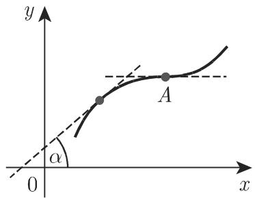
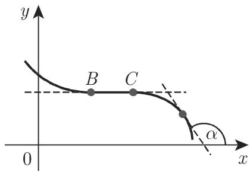
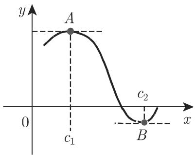
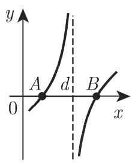
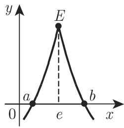

# 数学手册(原书第10版) 6.1.4 微分学基本定理

本页摘要《数学手册(原书第10版)》第 6 章 6.1.4 节「微分学基本定理」。该节是 6.1「一元函数的微分」的定理核心，依次给出单调性的导数符号判据、费马定理、罗尔定理、微分中值定理（即通行的拉格朗日中值定理）、一元函数的泰勒定理与广义微分中值定理（柯西定理），构成一条从符号判据到多项式逼近的完整定理链。全部定理以 6.1.1 的 [[concepts/微商]]、[[concepts/导函数]]、[[concepts/可微性]] 与 [[concepts/导数的几何意义]] 为定义基础，属对前置定义的强化与延伸。父节见 [[sources/10-数学手册原书第10版--10-61-一元函数的微分--6vscw8]]，前置定义节见 [[sources/10-数学手册原书第10版--6-611-微商--y9fryb]]。

## 小节结构与本库映射

| 小节 | 主题 | 概念页 | finding 页 |
|---|---|---|---|
| 6.1.4.1 | 单调性 | [[concepts/单调性]] | [[findings/单调性导数符号判据-式6-26]] |
| 6.1.4.2 | 费马定理 | [[concepts/费马定理]] | [[findings/费马定理极值必要条件-式6-27]] |
| 6.1.4.3 | 罗尔定理 | [[concepts/罗尔定理]] | [[findings/罗尔定理及假设反例-式6-28]] |
| 6.1.4.4 | 微分中值定理 | [[concepts/微分中值定理]] | [[findings/微分中值定理两种形式-式6-29]]、[[findings/中值定理π近似误差算例-式6-30]] |
| 6.1.4.5 | 一元函数的泰勒定理 | [[concepts/泰勒定理]] | [[findings/泰勒公式拉格朗日余项-式6-31]] |
| 6.1.4.6 | 广义微分中值定理（柯西定理） | [[concepts/广义微分中值定理]] | [[findings/柯西中值定理与参数曲线解释-式6-32-633]] |

四个基本定理的横向对照见 [[comparisons/四个微分学基本定理比较]]；误差估计的通用做法提炼为 [[methodology/微分中值定理误差估计流程]]。

## 定理链原文（逐字转录）

（公式按原文转录；周边文字中的 OCR 讹误已按通行字形订正，讹误原貌集中列于「系统性转写讹误」一节并汇总于 [[queries/6-1-4全节系统性转写讹误清单]]。）

```latex
% 6.1.4.1 单调性（题设：f(x) 在一连通区间上有定义且连续，并对该区间的每个内点都可微）
(6.26a)  f(x) 为单调递增函数, 当且仅当 f'(x) ⩾ 0
(6.26b)  f(x) 为单调递减函数, 当且仅当 f'(x) ⩽ 0

% 6.1.4.2 费马定理（题设：内点 x=c 处有极大值或极小值, 且在点 c 可导）
(6.27a)  f(c) > f(x)        （c 为区间内点, 对该区间的任一点 x）
(6.27b)  f(c) < f(x)
(6.27c)  f'(c) = 0

% 6.1.4.3 罗尔定理（题设：[a,b] 连续, (a,b) 可微）
(6.28a)  f(a) = 0,  f(b) = 0        (a < b)
(6.28b)  f'(c) = 0                   (a < c < b)

% 6.1.4.4 微分中值定理（题设：[a,b] 连续, (a,b) 可微）
(6.29a)  \frac{f(b)-f(a)}{b-a} = f'(c)                (a < c < b)
(6.29b)  f(a+h) = f(a) + h\,f'(a+\Theta h)            (0 < \Theta < 1)

% 6.1.4.4 应用 A（K 为 |f'(x)| 在 [a,b] 内每一点的上界）
(6.30)   |f(b) - f(a)| < K\,|b - a|

% 6.1.4.5 泰勒定理（题设：[a, a+h] 上 n-1 次连续可微, 且区间内部存在 n 阶导数）
(6.31)   f(a+h) = f(a) + \frac{h}{1!}f'(a) + \frac{h^{2}}{2!}f''(a) + \dots
               + \frac{h^{n-1}}{(n-1)!}f^{(n-1)}(a) + \frac{h^{n}}{n!}f^{(n)}(a+\Theta h),
         其中 0 < \Theta < 1, h 可正可负（转写脱「h」字）

% 6.1.4.6 广义微分中值定理（题设：f、φ 在 [a,b] 连续, 至少内部可微, 且 φ'(x) ≠ 0）
(6.32)   \frac{f(b)-f(a)}{\varphi(b)-\varphi(a)} = \frac{f'(c)}{\varphi'(c)}   (a < c < b)

% 6.1.4.6 参数曲线几何解释（设图 6.9 曲线的参数方程为 x = φ(t), y = f(t)）
(6.33)   \tan\alpha = \frac{f(b)-f(a)}{\varphi(b)-\varphi(a)} = \frac{f'(c)}{\varphi'(c)}
```

各定理的题设、断言、反例讨论与证据强度分散记录于对应 finding 页。其中两条特例/退化关系为来源明言：**式 6.29b 是泰勒公式在 n=1 时的特例**；**φ(x)=x 时广义中值定理简化为第一个（微分）中值定理**。两断言均经代入核验成立。

## 插图清单

| 图号 | 媒体文件 | 内容 |
|---|---|---|
| 图 6.6(a) | media/10-数学手册原书第10版--11-614-微分学基本定理--19qkxf6/001-c1977a7f33e4284a3e16dabaf171be692669ee0a0d81188be19cc11e674a971.jpg | 单调递增函数曲线：上升或沿水平方向移动；点 A 处 f′=0 但无极值 |
| 图 6.6(b) | media/10-数学手册原书第10版--11-614-微分学基本定理--19qkxf6/002-84e2b23777815599ceecd21e46b1422d8be5cdd18bfaaa54e78413a48ef0639d.jpg | 单调递减函数曲线；水平线段 BC（严格单调条件的反例图示） |
| 图 6.7 | media/10-数学手册原书第10版--11-614-微分学基本定理--19qkxf6/003-3e16fefd668a08cd0bc0051b48aa9a3e6a667eae76b2e44e513fc9f4532d7792.jpg | 费马定理几何意义：点 c 处切线平行于 x 轴 |
| 图 6.8(a) | media/10-数学手册原书第10版--11-614-微分学基本定理--19qkxf6/004-25c559add75d5df9fb2991ca5f0795bc8d30109128a93404576a578992bd12db.jpg | 罗尔定理基本情形：A、B 间一点 C 处切线与 x 轴平行 |
| 图 6.8(b) | media/10-数学手册原书第10版--11-614-微分学基本定理--19qkxf6/005-07da198d5f809fa8b4426535b9b62093a71b333a713a2e737d8da23ed1eabf6c.jpg | 罗尔定理：可能存在多个这样的点 C、D、E |
| 图 6.8(c) | media/10-数学手册原书第10版--11-614-微分学基本定理--19qkxf6/006-349ccdcbad802ea05d92d5d964d5328f723e5a1562f2f340906c7fef9a763544.jpg | 罗尔假设失效反例：x=d 处不连续，凡导数存在处 f′(x)≠0 |
| 图 6.8(d) | media/10-数学手册原书第10版--11-614-微分学基本定理--19qkxf6/007-e9e95ce761c0ab23f6cf3128425c06585822643824d17d2c8ec259775db64f06.jpg | 罗尔/费马假设失效反例：x=e 处有极大值但导数不存在 |
| 图 6.9 | media/10-数学手册原书第10版--11-614-微分学基本定理--19qkxf6/008-28eeeb322e8d2471696121829cc0b6c23650af5136a80d2b49526d3cc45ea5bb.jpg | 微分中值定理几何意义：点 C 处切线与弦 AB 平行 |

## π 近似算例（应用 B，已复算）

原文以 π̄ = 3.14 代替 π，估计 f(π) = 1/(1+π²) 的精度：

$$\left|f(\pi)-f(\bar{\pi})\right| = \left|\frac{2c}{(1+c^{2})^{2}}\right|\left|\pi-\bar{\pi}\right| \leqslant 0.053 \times 0.0016 = 0.000085$$

即 1/(1+π²) 处于 0.092084 − 0.000085 与 0.092084 + 0.000085 之间；中间等号由微分中值定理给出，c 介于 π̄ 与 π 之间。复算逐项数值见 [[findings/中值定理π近似误差算例-式6-30]]（已独立复算通过）。

## 系统性转写讹误

OCR 型讹误，与 5.8.x、5.9.x、6.1.1 各节的「转写讹误清单」模式一致，全文汇总见 [[queries/6-1-4全节系统性转写讹误清单]]：

- `千 → 于`：恒等千、平行千、交千、对千、介千、等千、处千；
- `儿何意义 → 几何意义`；
- 行内数学符号整体脱落：「与 轴」→「与 x 轴」、「在点 可导」→「在点 c 可导」、「点 」→「点 A / 点 e」、「存在 阶导数」→「存在 n 阶导数」、「0 < Θ < 1, 可正可负」→「h 可正可负」、「介千 之间」→「介于 0 与 1 之间」；
- `n-l 次 → n−1 次`、`n=l 时 → n=1 时`；
- `图 6.S(b) → 疑为图 6.9(b)`（见 [[queries/图6-S-b所指何图]]）；
- `亢 / 𝔯 → π`；
- `思即 → 亦即`。

## 断言强度与边界

- 单调性判据（式 6.26）为标准结果，表述正确；「单调递增/递减」须按非严格理解（来源后文另行区分「严格单调」，内部一致）。
- 严格单调条件来源仅述必要方向（任意子区间上 f′ ≢ 0），未断言充分方向，见 [[queries/严格单调与导数不恒为零是否充要]]。
- 费马、罗尔两定理的反例讨论（图 6.6(a) 点 A、图 6.8(c)(d)）依赖插图内容，纯文字无法独立核验。
- 罗尔几何意义中「每一点都没有垂直切线」是对可微性的几何直观转述，不严格（角点处无切线亦不可微），呼应 [[findings/立方根函数垂直切线算例-图6-2a]]。
- 式 6.30 正文用严格不等号 `<`，而应用 B 的推导用 `⩽`，内部不一致，见 [[queries/式6-30严格不等号是否应为小于等于]]。
- 手册版罗尔定理取 f(a)=f(b)=0（较通行版 f(a)=f(b) 强）；费马定理将极值定义为对区间任一点的严格不等式（全书区间意义）。两处与通行教材表述不同但非错误，见 [[queries/罗尔与费马表述与通行版差异]]。

## 与现有 wiki 的联系

- 填补 [[queries/6-1各子小节未入库缺口]] 中 6.1.4 部分（6.1.2、6.1.3 仍缺）。
- 图 6.8(d) 不可微点极值呼应 [[concepts/尖点]] 与 [[findings/左右导数尖点算例-式6-3]]。
- 图 6.8(c)(d) 假设失效反例强化 [[comparisons/可微与连续关系比较]] 的论点。

<!-- llm-wiki:embedded-images -->
## Embedded Images

### Document









<!-- llm-wiki:embedded-images -->
