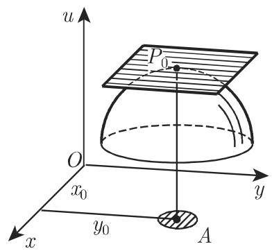
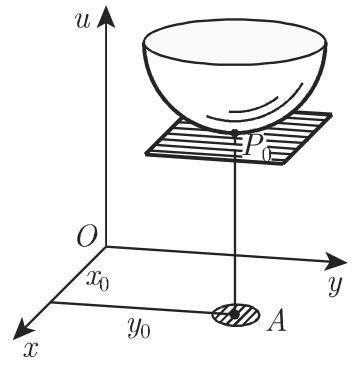
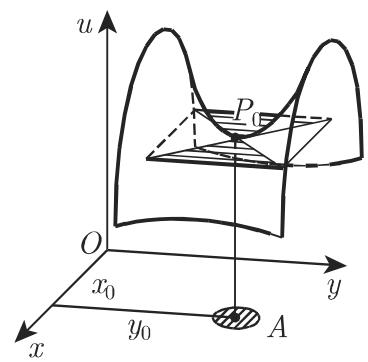

# Source: 数学手册(原书第10版)/6.2.5 多元函数的极值.md

# 来源分析：数学手册(原书第10版) 6.2.5 多元函数的极值

## 关键实体

| 候选实体 | 类型 | 角色与意义 | 是否已在维基 | 页面价值判定 |
|---|---|---|---|---|
| 《数学手册(原书第10版)》6.2.5 节「多元函数的极值」 | 文献来源（手册小节） | 本分析对象；第 6 章多元微分学的极值理论核心小节，含式 6.68–6.73 与图 6.16 | 否（6.2.5 尚未入库；媒体目录名提示 slug 为 `10-数学手册原书第10版--11-625-多元函数的极值--hfn8nx`） | **Page-worthy: yes** — 按既有惯例每小节建 source 页，且本节含成组编号公式与判别法体系 |
| 胡俊美 | 人名（译者） | 节末译者署名，无知识内容 | 否 | **Page-worthy: no** — 署名性提及，不构成独立知识主题 |
| 参考文献 [6.3]、[6.12] | 文献引用 | 手册书目编号，被 6.2.5.4 与 6.2.5.6 引作深入判据的出处，但内容未展开 | 否 | **Page-worthy: no** — 无法确认所指文献；作为开放问题记录于 query |
| 高斯最小二乘法、最小二乘法、均方逼近、回归演算、傅里叶系数确定 | 方法/应用方向 | 6.2.5.5 仅以交叉引用罗列为极值理论的应用去向（指向 19.6.2、16.3.4.2、7.4.1.2、19.2.1.3 等节） | 否 | **Page-worthy: no** — 纯提及，本节未给出实质内容；待相应章节入库时再建页 |

## 关键概念

| 概念 | 简要定义 | 在本源中的地位 | 是否已在维基 |
|---|---|---|---|
| 多元函数的相对极值 | 在点 P₀ 的 ε-盒邻域内函数值严格大于（或小于）所有其他点的值（式 6.68a–b） | 全节定义起点，是 6.1.5 一元相对极值向 n 元的推广 | 部分已有：[[concepts/相对极值与绝对极值]]（一元版），需扩展 |
| 鞍点 | 有水平切平面但非极值点的曲面点（图 6.16(c)） | 作为「必要非充分」的反例出现，与 Δ<0 情形呼应 | **否，需新建** |
| 二阶偏导数矩阵（黑塞矩阵） | a_ij = ∂²f/∂x_i∂x_j 构成的矩阵；源文仅称「由二阶偏导数构成的矩阵」，未用「Hesse/黑塞」之名 | n 元判据的载体 | **否，需新建**（页内须注明源文未命名） |
| 顺序主子式 | 矩阵左上角主子式序列 (a₁₁, a₁₁a₂₂ − a₁₂a₂₁, …) | n 元极值判据的核心工具 | **否，需新建** |
| 二元极值判别法（Δ 判别式） | Δ = AC − B² 的符号三分判据（式 6.69–6.70） | 6.2.5.3 主体，对应一元「高阶导数法」的二元版本 | **否，需新建** |
| n 元极值顺序主子式判据 | 梯度方程组（式 6.71）+ Hessian 顺序主子式符号四情形判据 | 6.2.5.4 主体；实质即 Sylvester 型判据（源文未提 Sylvester） | **否，需新建** |
| 拉格朗日乘数法（含拉格朗日函数 Φ = f + λφ + μψ + … + κχ） | 引入 k 个乘数将条件极值化为 n+k 变量的无条件驻点问题（式 6.72a–c） | 6.2.5.6 的主要方法，含二元一约束特例（式 6.73） | **否，需新建** |
| 条件极值（带约束的极值）与消元代入法 | 约束下变量不独立；可用约束解出 k 个变量代入化为 n−k 元无条件问题 | 拉格朗日法的对照方法 | **否，需新建** |
| 极值点切平面水平性 | 内点取极值且切平面存在 ⟹ 切平面平行于 xOy 面（必要非充分） | 连接 [[concepts/切平面]]（6.2.2 式 6.43）与本节 | 已有 [[concepts/切平面]]、[[concepts/极值存在的必要条件]]，需更新 |
| 梯度为零（驻点条件） | 式 6.71 即 ∇f = 0；源文未用「梯度/驻点」术语 | 隐性连接 [[concepts/梯度]] | 已有 [[concepts/梯度]]，作为关联 |

## 主要论点与发现

所有论断均针对手册自身的表述体系；各判据的适用范围严格限定于其针对的情形（二元无约束 / n 元无约束 / 约束问题），不可互相搬用。

**1. 相对极值的定义（式 6.68a–b）**——n 元函数在 P₀ 的逐坐标 ε-盒邻域内满足严格不等式：

```latex
f(x_1, x_2, \dots, x_n) < f(x_{10}, x_{20}, \dots, x_{n0})  \tag{6.68a}
f(x_1, x_2, \dots, x_n) > f(x_{10}, x_{20}, \dots, x_{n0})  \tag{6.68b}
```

注意定义采用**严格**不等号与矩形（盒式）邻域。与 6.1.5 一元定义同构，证据强度高（标准定义）。

**2. 几何表示与必要条件（6.2.5.2，图 6.16）**——二元函数极值点（若切平面存在）的切平面平行于 xOy 面，此为**必要非充分**条件；图 6.16(c) 的鞍点有水平切平面但非极值点。此论断关于「切平面水平性」这一性质本身，且手册明确加了前提「存在一个切平面」。

**3. 二元判别式（式 6.69–6.70）**——仅适用于**二元可微、无约束**情形：

```latex
A = \frac{\partial^2 f}{\partial x^2}, \quad
B = \frac{\partial^2 f}{\partial x\,\partial y}, \quad
C = \frac{\partial^2 f}{\partial y^2}  \tag{6.69}

\Delta = \begin{vmatrix} A & B \\ B & C \end{vmatrix}
= AC - B^2 = [\, f_{xx} f_{yy} - (f_{xy})^2 \,]_{x=x_i,\, y=y_i}
\quad (i = 1, 2, \dots)  \tag{6.70}
```

| 情形 | 结论 |
|---|---|
| Δ > 0 | 有极值；f_xx < 0 为极大，f_xx > 0 为极小（**充分条件**） |
| Δ < 0 | 无极值 |
| Δ = 0 | 需进一步判断 |

判据与标准二阶充分条件一致，可独立复算验证——证据强度高。

**4. n 元判据（式 6.71 + 顺序主子式四情形）**——仅适用于 **n 元无约束**情形。先解

```latex
f_{x_1} = 0,\; f_{x_2} = 0,\; \dots,\; f_{x_n} = 0  \tag{6.71}
```

（必要非充分），再建 a_ij = ∂²f/∂x_i∂x_j，将解代入并检查顺序主子式 (a₁₁, a₁₁a₂₂ − a₁₂a₂₁, …) 的符号：

| 情形 | 符号模式 | 结论 |
|---|---|---|
| (1) | −, +, −, +, … | 极大值 |
| (2) | +, +, +, +, … | 极小值 |
| (3) | 部分子式为零，非零者符号与上述模式一致 | 需进一步判断（检验闭邻域内函数值） |
| (4) | 不满足上述符号规则 | 无极值 |

此即负定/正定 Hessian 的 Sylvester 型判据，数学上自洽（情形 (4) 中 det<0 类情形确为不定，可复算印证）；情形 (3) 偏保守但不出错。

**5. 应用方向（6.2.5.5）**——极值判定理论可用于傅里叶系数确定、逼近函数系数参数确定、超定线性方程组近似解；方法为高斯最小二乘法、最小二乘法、均方逼近、观测拟合与回归演算。仅为交叉引用清单，本节无实质推导——证据强度弱（罗列性内容）。

**6. 条件极值与拉格朗日乘数法（式 6.72a–c、6.73）**——k 个约束（k < n）下：

```latex
\varphi = 0,\; \psi = 0,\; \dots,\; \chi = 0  \tag{6.72a}

\Phi(x_1,\dots,x_n,\lambda,\mu,\dots,\kappa)
= f(x_1,\dots,x_n) + \lambda\varphi + \mu\psi + \dots + \kappa\chi  \tag{6.72b}

\varphi = 0,\; \psi = 0,\; \dots,\; \chi = 0,\;
\Phi_{x_1} = 0,\; \Phi_{x_2} = 0,\; \dots,\; \Phi_{x_n} = 0  \tag{6.72c}

\varphi(x,y) = 0,\quad
\frac{\partial}{\partial x}[f + \lambda\varphi] = 0,\quad
\frac{\partial}{\partial y}[f + \lambda\varphi] = 0  \tag{6.73}
```

变量计数自洽（k 约束、k 乘数、n+k 变量、n+k 方程），已复核。关键限定：**式 6.72c/6.73 仅是必要非充分条件**，且手册明言对约束问题的充分性检验「数学检验准则相当复杂」（参见 [6.3], [6.12]），通常退而比较闭邻域内的函数值——即 6.2.5.3/6.2.5.4 的无约束判据**不可直接搬用**于拉格朗日方程组的解。

**证据强度总评**：数学内容为标准定理，可独立复算，强度高；但本节转写讹误为已入库各节中最严重之一（系统性「千/于」讹误、「吓）」衍文、多处脱字如标题脱「n」、主子式列表数学符号损坏、「未定乘数入」、Φ/φ 大小写混用、页码-节号粘连交叉引用），逐字转录前须先复原。

## 与现有维基的联系

- **扩展** [[concepts/相对极值与绝对极值]]、[[concepts/极值存在的必要条件]]：由一元推广至 n 元；「必要非充分」主题线（f′=0 → 切平面水平 → 梯度为零 → 拉格朗日方程组）贯穿 6.1.5 与本节。
- **强化** [[concepts/切平面]]：极值点切平面水平性是 6.2.2 式 6.43 切平面方程的直接应用。
- **强化** [[concepts/施瓦茨交换定理]]：a_ij 的对称性（C² 条件下）是行列式判据成立的前提，属隐含依赖。
- **隐性连接**（属推断而非源文明言）：[[concepts/多元函数的泰勒定理]]（式 6.49–6.50）是二阶判别的理论根据，可作为 synthesis 素材。
- **对接** [[concepts/梯度]]：式 6.71 即 ∇f = 0。
- **推进** [[queries/6-2各子小节未入库缺口]] 与 [[queries/6-2后续小节（全微分等）未入库缺口]]：6.2.5 入库后，6.2.3、6.2.4 及其后小节仍缺。
- **平行结构**：与 [[concepts/符号改变法]]、[[concepts/高阶导数法]]（6.1.5 一元判据）构成一元/多元判据系列。

无与现有内容冲突之处。

## 矛盾与张力

- **与现有维基**：无实质矛盾；定义口径（严格不等号）与 6.1.5 一致。
- **内部张力一**：拉格朗日函数定义为大写 Φ，正文却写「函数 φ 有极值的必要条件」，与约束函数 φ 记号冲突（疑为原书排印或转写问题）。
- **内部张力二**：6.2.5.6 中「必要条件是……方程组 **(6.71)** 满足 (6.72c)」——对式 6.71 的引用语义含糊：既可解读为「将 (6.71) 的原理应用于 Φ」，也可能是 (6.72c) 之误。
- **内部张力三**：顺序主子式判据情形 (3)/(4) 的边界在「存在零子式且非零子式偏离两种模式」时归类略含糊；数学上该规则不会给出错误结论（至多保守地判为待定），但逐字转录时需注明。
- **主要限制**：全节转写损坏严重，多处关键量（n、k、f、点记号）脱落，逐字转录的可靠性受制于复原质量。

## 建议

**新建 source 页**
- `sources/10-数学手册原书第10版--11-625-多元函数的极值--hfn8nx`

**新建 concept 页**
- `concepts/鞍点`、`concepts/二阶偏导数矩阵`（别名「黑塞矩阵/Hesse 矩阵」，注明源文未命名）、`concepts/顺序主子式`、`concepts/二元函数极值判别法`、`concepts/顺序主子式判据`、`concepts/拉格朗日乘数法`（含拉格朗日函数）、`concepts/条件极值`（含消元代入法）

**新建 finding 页**（沿用房内「式号」命名惯例）
- `findings/多元相对极值定义-式6-68`
- `findings/极值点切平面水平性与鞍点反例-图6-16`
- `findings/二元极值判别式Δ-式6-69至6-70`（注明已对照标准二阶条件复算）
- `findings/n元极值顺序主子式判据-式6-71`（注明四情形已复核、与 Sylvester 型判据实质一致、情形(3)保守性）
- `findings/拉格朗日乘数法与条件极值-式6-72至6-73`（注明变量计数已复核、仅必要条件）
- `findings/极值理论的应用方向清单-6-2-5-5`（低优先级，纯罗列）

**新建 methodology 页**
- `methodology/二元函数极值判定流程`、`methodology/n元函数极值判定流程`、`methodology/约束极值求解流程`（含消元法与乘数法两条分支及「必要条件解需另行验证」的收尾步骤）

**新建 comparison 页**
- `comparisons/一元与多元极值判定比较`（f″ 符号 vs Δ vs 顺序主子式，衔接 [[comparisons/符号改变法与高阶导数法比较]]）
- `comparisons/消元法与拉格朗日乘数法比较`

**新建 query 页**
- `queries/6-2-5全节系统性转写讹误清单`（枚举：千/于系统性讹误；两处「吓）」衍文；6.2.5.2「此性质[是]」脱字与「比在[]点」脱字；6.2.5.4 标题脱「n」及正文多处脱 n/k/f；主子式列表损坏符号 `$\vec{\mathfrak{x}}\binom{}{}(a_{11}, a_{11}a_{22}-a_{12}a_{21},\dots)$`；「未定乘数入」之「入」；「·，尺」衍文；情形(4)「情形[]和情形[]」脱编号；「儿类」=「几类」；Φ/φ 大小写；多处页码-节号粘连交叉引用）
- `queries/式6-72c前对式6-71的引用是否为讹误`
- `queries/参考文献6-3与6-12所指文献`
- 更新 `queries/6-2各子小节未入库缺口`（6.2.5 已入库，6.2.3、6.2.4 仍缺）

**更新既有页**：`concepts/相对极值与绝对极值`、`concepts/极值存在的必要条件`、`concepts/切平面`、`concepts/梯度`（补式 6.71 关联）。

**强调 vs 弱化**：强调各判据的精确公式、适用范围边界（二元/n 元/约束三套判据互不通用）、「必要非充分」主题线与鞍点反例；弱化 6.2.5.5 的应用罗列（待 19.6.2 等节入库）、译者署名及未复原的损坏文本。

**开放问题**：(1) [6.3]、[6.12] 具体所指文献；(2) 原书（德文第 10 版）是否使用「Hesse 矩阵」「Sylvester 判据」等名称；(3) 「方程组 (6.71)」引用的原貌；(4) 情形 (3)「检验闭邻域内函数值」在原书中的具体表述；(5) 6.2.3、6.2.4 的内容归属。

<!-- llm-wiki:embedded-images -->
## Embedded Images

### Document




<!-- llm-wiki:embedded-images -->
