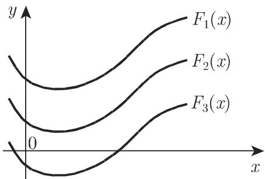
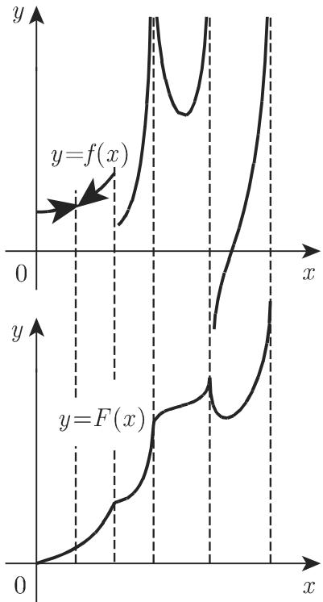

# 数学手册(原书第10版) 8.1.1 原函数或反导数

## 概述

本节是 [[entities/数学手册原书第10版]] 第 8 章（积分学）的首节，也是第 8 章首批入库的内容。全节回答两个问题：其一，什么是原函数与不定积分（定义，式 8.1–8.2）；其二，初等函数的积分如何求解（基本积分表 8.1 与化归策略、三注 a–c）。本节明确声明其积分公式是 583 页表 6.1（初等函数的导数）微分公式的逆运算，从而与已入库的第 6 章微分学体系（[[concepts/微分]] 所在体系）构成“微分—积分互逆”关系；注 c 又把非初等可积情形与 [[concepts/幂级数]] 相连（并可与已入库的 7.3，即 [[sources/10-数学手册原书第10版--8-73-函数项级数--1itytmq]]，作口径对照）。

## 结构

| 小节 | 内容 |
|---|---|
| 1. 定义 | 原函数（反导数）的定义（式 8.1）；原函数族相差常数、可由平移得到（图 8.2） |
| 2. 练习（标题疑为转写讹误） | 连续函数存在原函数；有间断点时按子区间分解（图 8.3） |
| 8.1.1.1 不定积分 | 式 8.2；被积函数、积分变量、积分常数术语；物理学记号 ∫dx f(x) |
| 8.1.1.2 初等函数的积分 | 基本积分（表 8.1，22 条）与一般积分（化归策略 + 三注 a–c） |

## 核心内容逐字转录

转录约定：源文多处句读脱漏，引用时已按语义补足标点；讹误字与脱漏符号保留原样，并在各段后另行标注（总清单见 [[queries/8-1-1全节系统性转写讹误清单]]）。

### 原函数的定义（式 8.1）

> 设 $y = f(x)$ 为区间 $[a, b]$ 上的函数，若 $F(x)$ [a, b] 上处处可微，且其导数为 $f(x)$，
>
> $$
> F^{\prime}(x) = f(x), \tag{8.1}
> $$
>
> 则 $F(x)$ 称为 $f(x)$ 的原函数或反导数。因为 $F(x) + C$（$C$ 为常数）在微分过程中所加常数项消失，所以一个函数如果有原函数，便会有无穷多个原函数，且两个原函数的差为常数。千是只要把一个特殊的原函数沿坐标轴方向平移，便能得到所有原函数 $F_1(x), F_2(x), \cdots, F_n(x)$ 的图像（图 8.2）。

标注：“若 $F(x)$ [a, b] 上处处可微”脱漏介词“在”；“所加常数项消失”处源文空格异常、疑有脱字；“千是”为“于是”之讹。

### 原函数的存在性（源文小节标题“2. 练习”）

> 区间 [a,b] 上的连续函数在该区间都存在原函数。若存在一些间断点则可将该区间分解成一系列子区间，使其原函数在这些子区间连续。例如，图 8.3 中，若上半部分图形表示已知函数 $y = f(x)$，下半部分图形表示的函数 $y = F(x)$ 则是所考虑区间的原函数。

小节标题“2. 练习”与存在性命题内容不符，疑为转写讹误。精确性限定（Darboux 定理）与“手册原话 / 数学事实”的区分见 [[findings/连续函数原函数存在与间断点分解]]。

### 不定积分（式 8.2）

> 函数 (x) 的不定积分是 f(x) 所有原函数的集合：
>
> $$
> F(x) + C = \int f(x)\, \mathrm{d}x. \tag{8.2}
> $$
>
> 积分号 $\int$ 下的函数 f(x) 称为被积函数， 称为积分变量， 称为积分常数。在其他学科特别是物理学中，积分也是很实用的记号，而且会把微分 dx 写在积分号之后，函数 f(x) 之前。

标注：“函数 (x)”脱漏 f；“称为积分变量”“称为积分常数”前分别脱漏 dx 与 C。

### 表 8.1 基本积分（22 条，逐字转录）

源文声明：“8.1 中的积分公式源自 583 页表 6.1 中微分公式（初等函数的导数）的逆运算，略去了积分常数 c.”（句末小写 c 与正文大写 C 不一致，属轻微转写不一致。）

| 幂函数 | 指数函数 |
|---|---|
| $\int x^n \,\mathrm{d}x = \dfrac{x^{n+1}}{n+1}$ $(n \neq -1)$ | $\int \mathrm{e}^x \,\mathrm{d}x = \mathrm{e}^x$ |
| $\int \dfrac{\mathrm{d}x}{x} = \ln \lvert x\rvert$ | $\int a^x \,\mathrm{d}x = \dfrac{a^x}{\ln a}$ $(a > 0,\ a \neq 1)$ |

| 三角函数 | 双曲函数 |
|---|---|
| $\int \sin x \,\mathrm{d}x = -\cos x$ | $\int \sinh x \,\mathrm{d}x = \cosh x$ |
| $\int \cos x \,\mathrm{d}x = \sin x$ | $\int \cosh x \,\mathrm{d}x = \sinh x$ |
| $\int \tan x \,\mathrm{d}x = -\ln \lvert \cos x\rvert$ | $\int \tanh x \,\mathrm{d}x = \ln \lvert \cosh x\rvert$ |
| $\int \cot x \,\mathrm{d}x = \ln \lvert \sin x\rvert$ | $\int \coth x \,\mathrm{d}x = \ln \lvert \sinh x\rvert$ |
| $\int \dfrac{\mathrm{d}x}{\cos^2 x} = \tan x$ | $\int \dfrac{\mathrm{d}x}{\cosh^2 x} = \tanh x$ |
| $\int \dfrac{\mathrm{d}x}{\sin^2 x} = -\cot x$ | $\int \dfrac{\mathrm{d}x}{\sinh^2 x} = -\coth x$ |

| 分式有理函数 | 无理函数 |
|---|---|
| $\int \dfrac{\mathrm{d}x}{a^2 + x^2} = \dfrac{1}{a} \arctan \dfrac{x}{a}$ | $\int \dfrac{\mathrm{d}x}{\sqrt{a^2 - x^2}} = \arcsin \dfrac{x}{a}$ $(\lvert x\rvert < a,\ a > 0)$ |
| $\int \dfrac{\mathrm{d}x}{a^2 - x^2} = \dfrac{1}{a} \operatorname{Artanh} \dfrac{x}{a} = \dfrac{1}{2a} \ln \left\lvert \dfrac{a + x}{a - x} \right\rvert$ $(\lvert x\rvert < a,\ a > 0)$ | $\int \dfrac{\mathrm{d}x}{\sqrt{a^2 + x^2}} = \operatorname{Arsinh} \dfrac{x}{a} = \ln \left\lvert x + \sqrt{x^2 + a^2} \right\rvert$ $(a > 0)$ |
| $\int \dfrac{\mathrm{d}x}{x^2 - a^2} = -\dfrac{1}{a} \operatorname{Arcoth} \dfrac{x}{a} = \dfrac{1}{2a} \ln \left\lvert \dfrac{x - a}{x + a} \right\rvert$ $(\lvert x\rvert > a,\ a > 0)$ | $\int \dfrac{\mathrm{d}x}{\sqrt{x^2 - a^2}} = \operatorname{Arcosh} \dfrac{x}{a} = \ln \left\lvert x + \sqrt{x^2 - a^2} \right\rvert$ $(\lvert x\rvert > a,\ a > 0)$ |

逐条求导复算结论：22 条公式全部成立（含 Artanh、Arcoth、Arsinh、Arcosh 与对数等价式的等价性），详见 [[findings/表8-1基本积分22式逐字转录与复算]]（replicated: true）。

### 一般积分与三注

> 为了解决积分问题，应尽量利用代数变换、三角变换以及基本积分的积分法则将给定积分化简。在很多情况下，具有初等原函数的函数都能通过 8.1.2 中的积分方法加以积分。1382 页中的表 21.7（不定积分）列出了某些积分结果。在积分中下而的注有着重要作用：
>
> a) 通常可以忽略积分常数，除非某些积分在不同形式时可用不同的任意常数来表示；
>
> b) 若原函数中存在一个含 $\ln f(x)$ 的表达式，$\ln f(x)$ 必须用 $\ln\left|f(x)\right|$ 代替；
>
> c) 若原函数以幕级数的形式给出，则函数不能按初等方法积分。

标注：“下而”为“下面”之讹；“幕级数”为“幂级数”之讹；注 c 字面表述过强，原意应为“**只能**以幂级数的形式给出”（详见 [[findings/积分运算三注a-b-c]]）。

## 参考文献

文末称“[8.1] [8.3] 中给出了更多的积分形式及结果”，但未附书目细节，暂无法回指。

## 回指缺口

- 表 6.1（第 583 页，初等函数的导数）：表 8.1 的来源；
- 表 21.7（第 1382 页，不定积分表）：查表出口；
- 8.1.2（积分方法）：化归失败时的专门方法。

以上均未入库，追踪见 [[queries/表6-1与表21-7未入库回指缺口]] 与 [[queries/7-1及1-2-3与8-2-3未入库回指缺口]]。

## 配图

## 派生页面

- 概念：[[concepts/原函数]]、[[concepts/不定积分]]、[[concepts/初等函数的积分]]
- 发现：[[findings/式8-1与8-2原函数与不定积分定义逐字转录]]、[[findings/表8-1基本积分22式逐字转录与复算]]、[[findings/连续函数原函数存在与间断点分解]]、[[findings/积分运算三注a-b-c]]
- 方法：[[methodology/基本积分化归流程]]
- 比较：[[comparisons/三角与双曲基本积分平行比较]]
- 疑问：[[queries/8-1-1全节系统性转写讹误清单]]、[[queries/表6-1与表21-7未入库回指缺口]]

<!-- llm-wiki:embedded-images -->
## Embedded Images

### Document

<!-- llm-wiki:embedded-images -->
